# 机器学习“日历”第一天：Excel 中的 k-NN 回归器

> 原文：[`towardsdatascience.com/day-1-k-nn-regressor-in-excel-how-distance-drives-prediction/`](https://towardsdatascience.com/day-1-k-nn-regressor-in-excel-how-distance-drives-prediction/)

<mdspan datatext="el1764618373080" class="mdspan-comment">欢迎</mdspan>来到这个 [“日历”中的机器学习和深度学习在 Excel 中](https://towardsdatascience.com/machine-learning-and-deep-learning-in-excel-advent-calendar-announcement/)。

对于第一天，我们从 k-NN（k-Nearest Neighbors）回归器算法开始。正如你将看到的，这实际上是最简单的模型，也是一个好的开始方式。

对于已经了解这个模型的人来说，这里有一些问题给你。希望这些问题能让你继续阅读。还有一些细微的教训，这些在传统的课程中是没有教授的。

+   连续特征的缩放对于这个模型重要吗？

+   如何处理分类特征？

+   为了提高模型性能，应该对连续特征做些什么？

+   在某些情况下，哪些类型的距离度量可能更合适？例如，在预测房价，地理位置很重要的情况下？

**剧透：**使用简单的 k-NN，你不能自动获得理想的缩放。

这也是一个机会，如果你不熟悉 Excel 公式，可以使用 RANK、IF、SUMPRODUCT 等其他有用的 Excel 函数。

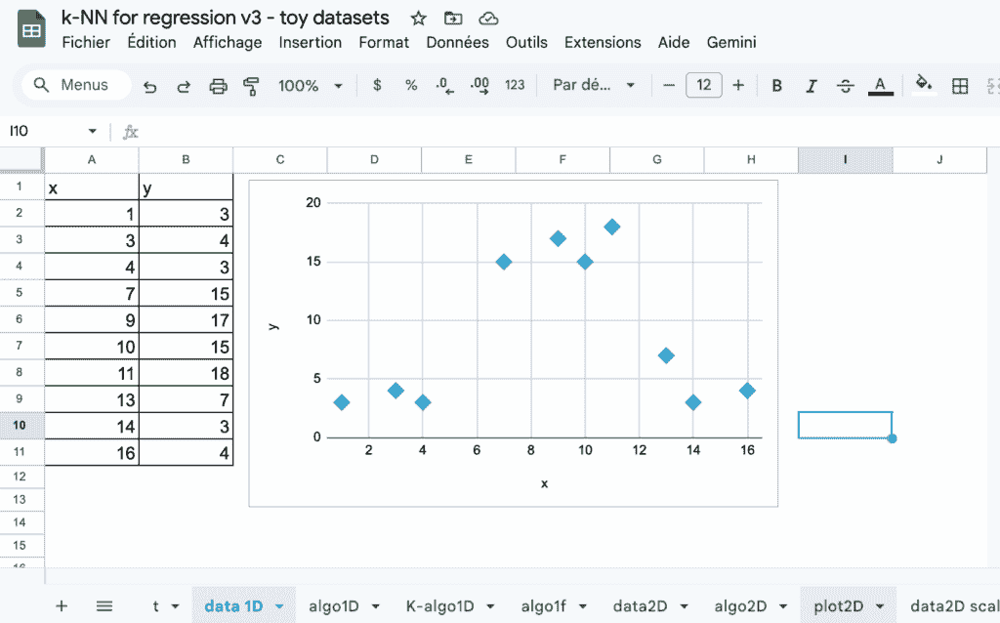

Excel 中的 k-NN 回归器 – 图片由作者提供

## k-NN 原则

如果你想要出售或购买一套公寓，你会如何估算价格？

请考虑一个非常实际的方法，而不是一些复杂的模型，你需要花费数小时来构建。

你可以真正做到的事情。

嗯，你可能会的做法是询问那些拥有相同或类似大小公寓的邻居。然后计算这些公寓的平均值。

是的，这正是 k-NN 的理念，即 k-Nearest Neighbors：寻找最相似的例子，并使用它们的值来估计新的值。

为了用房屋定价估计的实例来说明这个任务，我们将使用这个著名的名为 California Housing Dataset 的数据集。这是加利福尼亚街区群体的普查数据，用于预测 **房屋价值的中间值**。

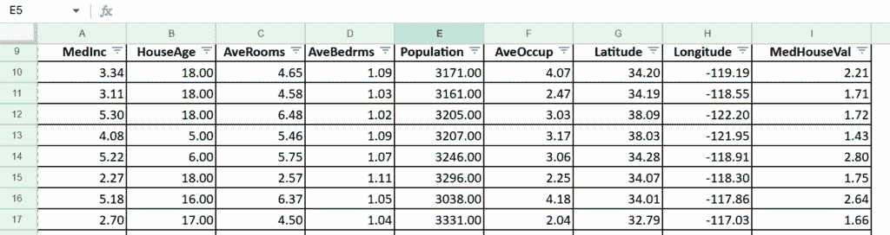

[California Housing Dataset](https://huggingface.co/datasets/gvlassis/california_housing) – **许可:** **MIT**

每个观察值不是一个单独的房屋，但使用这个例子仍然很有趣。

这里是变量的快速描述。

**目标变量**是 **MedHouseVal**，即房屋价值的中间值，单位为 **100,000 美元**（例如：3.2 表示 320,000 美元）。

**特征变量**如下：

**1\. MedInc**: 中等收入（单位为 10,000 美元）

**2\. HouseAge**: 房屋的中等年龄

**3\. AveRooms**: 每户平均房间数

**4. AveBedrms**：每户平均卧室数

**5. 人口**：居住在街区组中的人数

**6. AveOccup**：每户平均居住人数

**7. 纬度**：地理纬度

**8. 经度**：地理经度

## 带有一个连续特征的 k-NN

在我们使用多个特征来查找邻居之前，让我们首先只使用一个特征和一些观测值。

即使对于连续特征的过程将非常简单，我们仍然会遵循每个步骤。我们首先探索我们的数据集，然后使用超参数训练模型，最后我们可以使用模型进行预测。

### 训练数据集

这是 10 个观测值简单数据集的图。x 轴是连续特征，y 轴是目标变量。

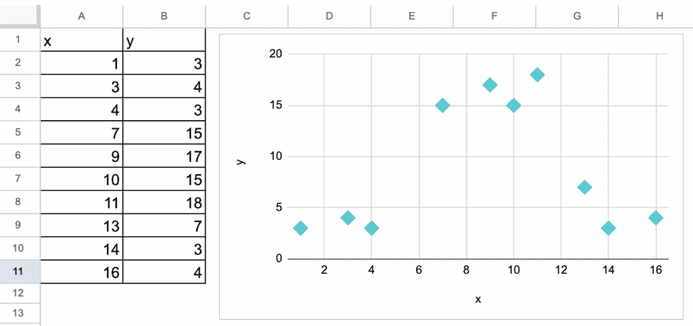

K-NN 的一个简单特征——作者图片

现在，假设我们必须预测新观测值 x=10 的值。我们该如何做呢？

### 模型训练？

几乎所有机器学习模型的第一步是训练。

但对于 k-NN，您的模型就是您的整个数据集。换句话说，您不需要训练模型，直接使用原始数据集即可。

因此，在 scikit-learn 中，当您执行 model.fit 时，对于 k-NN 估计器，实际上并没有发生任何事情。

有些人可能会问：k 值是多少？

嗯，k 是超参数。因此，您必须为 k 选择一个值，并且它可以进行调整。

### 对一个新观测值的预测

对于超参数 k，我们将使用 k=3，因为数据集非常小。

对于一个特征变量，距离可以简单地是新观测值与其他观测值之间值的**绝对值**差异。

在“algo1D”工作表中，您可以更改新观测值的值，并使用距离列 C 上的过滤器按升序排列数据集，将最近的 3 个邻居绘制出来。

为了使计算更加自动化，我们可以使用 RANK 函数查看距离最小的观测值。

我们还可以创建一个指标列（列 G），如果它们属于 k 个最近邻居，则指标=1。

最后，对于预测，我们可以使用 SUMPRODUCT 计算所有 y 值中指标=1 的平均值。

在图中，

+   浅蓝色点代表数据集

+   红色点代表具有预测 y 值的新观测值

+   黄色点代表新观测值（红色）的 3 个最近邻居

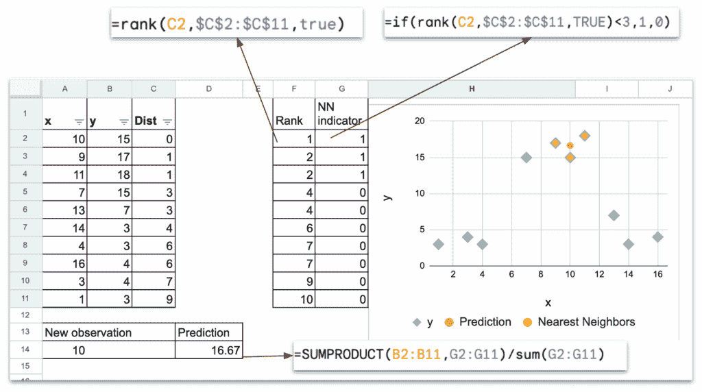

带有一个特征的 Excel 中的 k-NN 回归器——作者图片

让我们回顾一下——预测阶段包括以下步骤：

+   对于一个给定的新观测值，计算这个新观测值与训练数据集中所有观测值之间的距离。

+   识别具有最短距离的 k 个观测值。在 Excel 中，我们将使用过滤器手动排序训练数据集。或者我们可以使用 RANK（以及一个指标列）来获取前 k 个观测值。

+   通过使用 SUMPRODUCT 计算目标变量的平均值来计算预测值。

### 对新观测值区间的预测

在“*algo1D f*”工作表（f 代表最终）中，我绘制了一系列新观测值的预测，范围从 1 到 17。

使用编程语言，我们可以轻松地在循环中完成它，对于更多的新观测值，表示可以更密集。

使用 Excel，我手动重复以下步骤：

+   输入 x 的值

+   排序距离列

+   复制粘贴预测值

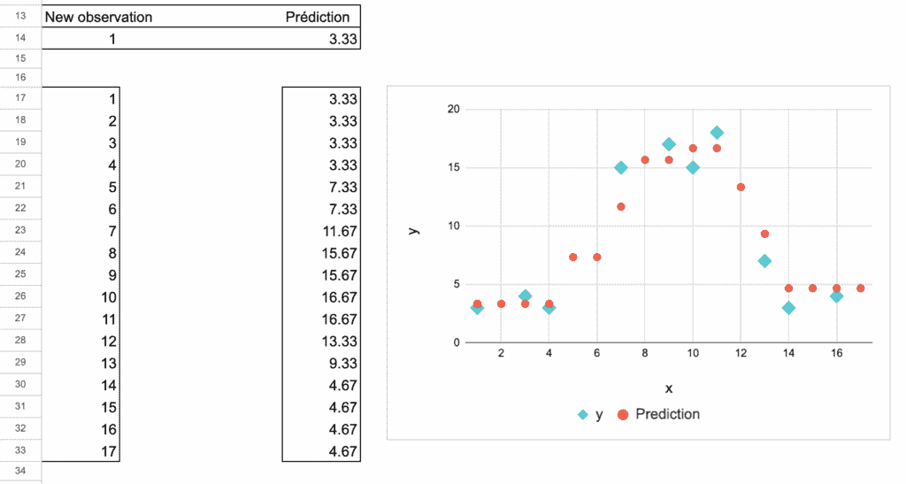

Excel 中带有单个特征的 k-NN 回归器 – 作者图片

### 超参数 k 的影响

在 k-NN 中使用的超参数是我们用于计算平均值时考虑的邻居数量。

我们通常使用以下图表来解释模型如何欠拟合或过拟合。

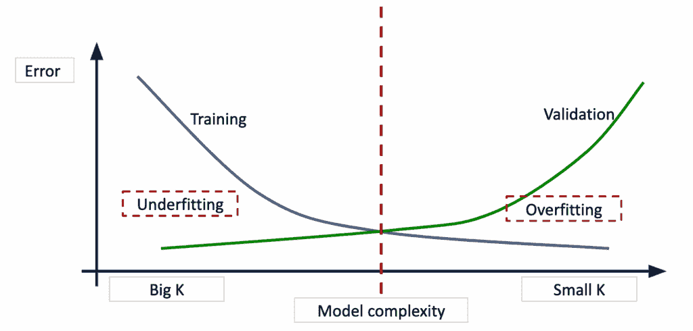

k-NN 回归器过拟合和过拟合 – 作者图片

在我们的例子中，如果 k 值较小，可能会存在过拟合的风险。

如果 k 值较大，可能会存在欠拟合的风险。

非常大的 k 的极端情况是 k 可以是训练数据集的总数。对于每个新的观测值，预测值将是相同的：它是全局平均值。

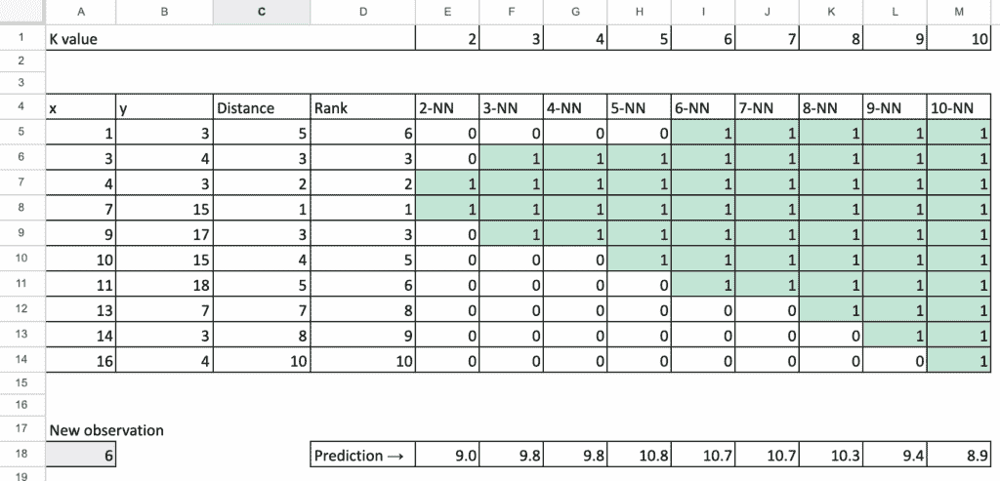

Excel 中带有 k 影响的 k-NN 回归器 – 作者图片

因此，我们可以说 k-NN 通过计算接近新观测值的几个观测值的平均值来改进预测的想法。

## 基于两个连续特征的 k-NN

现在，我们将研究两个连续特征变量 x1 和 x2 的情况，并且我们只讨论与之前一个特征变量情况的不同。

### 两个连续特征变量数据集

当我们有两个特征变量时，我无法使用 Excel 进行 3D 绘图，因此图表只包含 x1 作为 x 轴，x2 作为 y 轴。

因此，不要对之前的 dataset 混淆，其中 y 轴表示目标值 y。

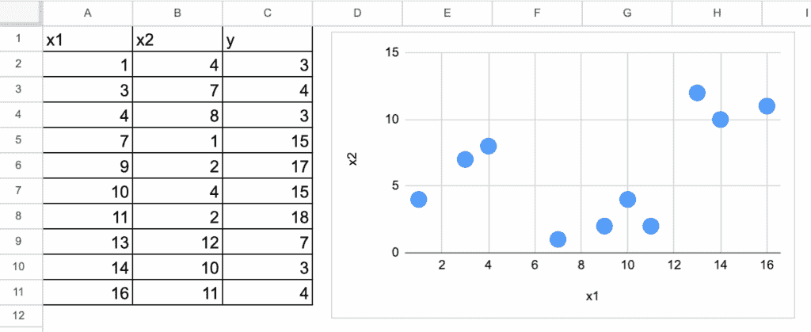

Excel 中带有两个特征的 K-NN – 作者图片

### 使用欧几里得距离进行预测

现在我们有两个特征，我们必须考虑它们两个。

我们可以使用的一个常用距离是欧几里得距离。

然后，我们可以使用相同的过程处理与新的观测值距离最小的 top k 个观测值。

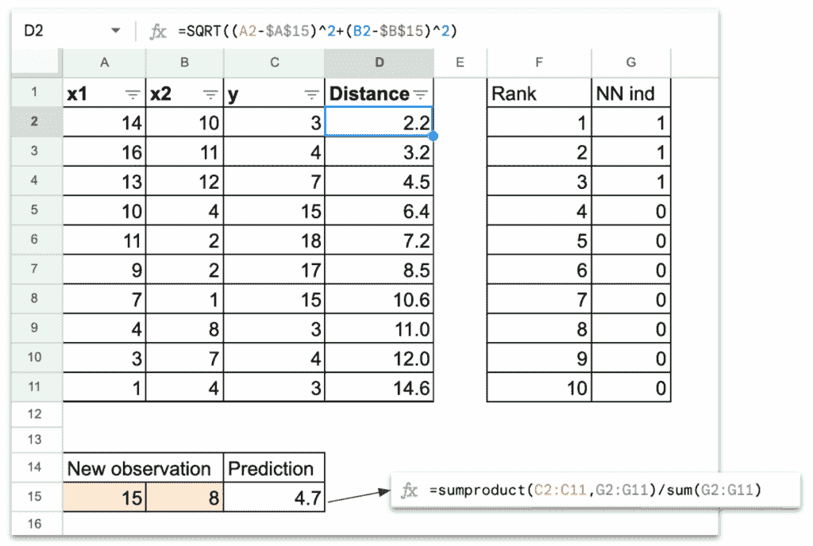

Excel 中带有两个特征的 k-NN 回归器 – 作者图片

为了得到可视化的图表，我们可以使用相同的颜色

+   蓝色表示训练数据集

+   红色表示新观测值

+   黄色表示找到的 k 个最近邻

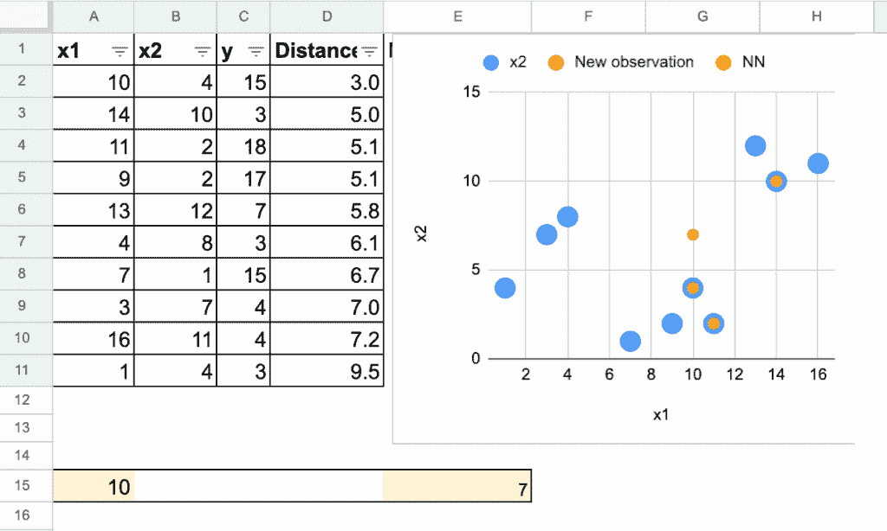

Excel 中带有两个特征的 k-NN 回归器 – 作者图片

### 变量规模的影响

当你有两个特征时，我们可以问的一个问题是特征规模对预测结果的影响。

首先，让我们看看这个简单的例子，我将特征 x2 乘以 10。

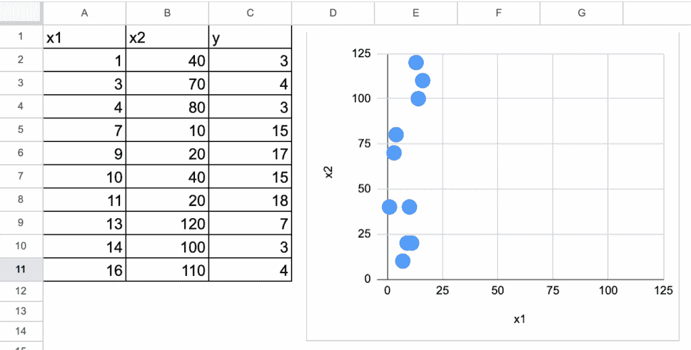

Excel 中的不同规模的 k-NN 回归器 – 作者图片

这种缩放会影响预测吗？答案是当然会的。

我们可以很容易地比较它们，如下面的图像所示。

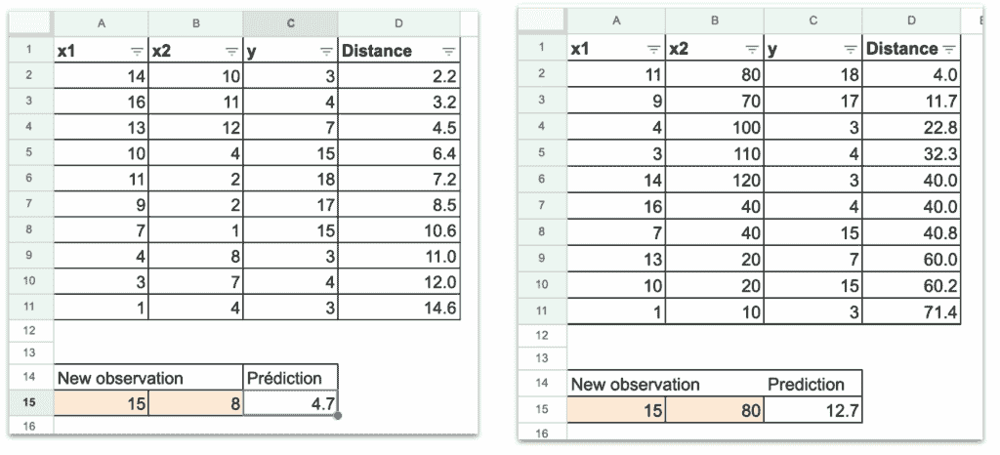

Excel 中的不同规模的 k-NN 回归器 – 作者图片

很容易理解，欧几里得距离将特征之间的平方差相加，而不考虑它们的规模。

因此，具有较大规模的特性将主导距离。

当涉及到特征缩放时，一个常见的操作是标准化（也称为中心化和归一化）或最小-最大缩放。其思想是将所有特征放置在可比较的规模上。

但是，让我们考虑这种情况：如果一个特征以美元表示，而另一个以日元表示。

在现实生活中，两个规模之间的正确关系大约是 1 美元=156 日元（截至 2025 年 11 月）。我们知道这一点，因为我们理解了单位的意义。

模型会如何知道这一点呢？它**不知道**。

唯一的超参数是 k，模型不会调整任何东西来纠正单位或规模的差异。k-NN 没有内部机制来理解两个特征具有不同的单位。

这只是问题开始的一部分...

## k-NN 与加利福尼亚住房数据集

现在，让我们最终使用加利福尼亚住房数据集的实际情况数据集。

使用单特征数据集，我们得到了 k-NN 是如何工作的基本概念。使用双特征数据集，我们看到了特征规模的重要性。

现在，使用这个实际情况数据集，我们将看到特征的异质性使得欧几里得距离变得没有意义。

当我们在实践中使用 k-NN 时，我们将看到一些其他更重要的想法。

### Naive 应用 k-NN 回归器

由于这个数据集中的所有特征都是连续的，我们可以轻松地计算欧几里得距离。我们定义一个数字 k，来计算目标变量的平均值，这里 MedHouseVal。

在 Excel 中，你可以轻松地自己做到这一点。或者你可以支持我[这里](https://ko-fi.com/s/4ddca6dff1)并获取所有文件。

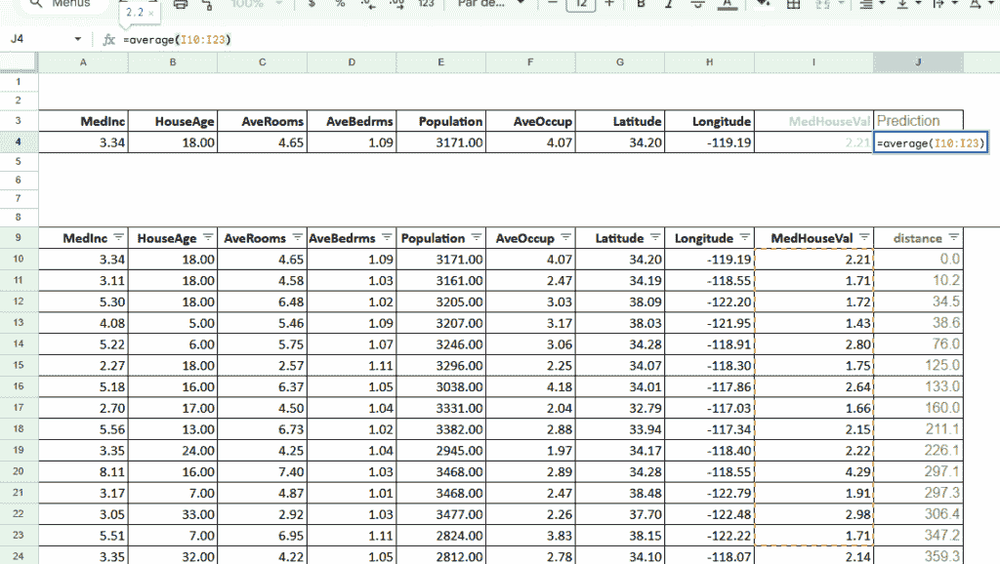

Excel 中的加利福尼亚住房数据集的 k-NN 回归器 – 作者图片

### 基于不同特征的距离概念

我说之前的应用是 naive 的，因为如果你仔细看，你会看到这些问题：

MedInc（中位数收入）以 10,000 美元为单位表示。如果我们决定用 100,000 美元或 1,000 美元来表示，预测将会改变，因为 k-NN 对特征的规模很敏感。我们之前已经看到过这个问题。

现在，更进一步，每个特性都有不同的性质。

+   MedInc 是金额（美元）。

+   HouseAge 是按年计算的年龄。

+   AveRooms 是房间数量的计数。

+   Population 是人数。

+   纬度和经度是地理坐标。

因此，欧几里得距离注定是注定要失败的。

### 不同的距离类型

最常见的选择是欧几里得距离，但并非只有这一种。

我们还可以在特征表示网格状移动时使用**曼哈顿距离**，而在只有方向重要时（如文本嵌入）使用**余弦距离**。

每个距离都会改变“最近”的定义，因此可以改变 KNN 选择的邻居。

根据数据，其他距离可能更合适。

例如，对于纬度和经度，我们可以使用实际的地理距离（以米为单位），而不是简单的以度为单位的欧几里得距离。

在加利福尼亚住房数据集中，这一点特别有用，因为我们有每个地区的确切纬度和经度。

然而，一旦我们尝试将这些地理距离与其他变量（如中位数收入、房间数量或人口）相结合，问题就变得更加复杂，因为这些变量具有非常不同的性质和尺度。

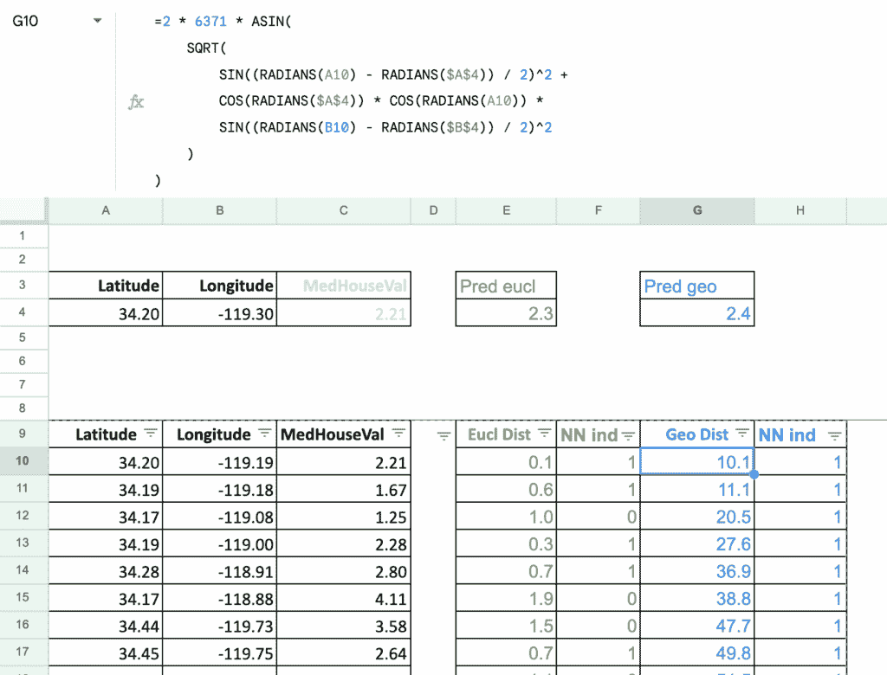

Excel 中的 k-NN 回归器带有地理距离 - 作者图片

在下面的地图渲染中，我使用了 k-NN 作为平滑函数来细化与巴黎不同区域相关的值。

在左侧，每个区域只有一个值，因此从一个区域到其相邻区域，变量的连续性可能会有间断。

在右侧，k-NN 允许我通过对附近区域的基于信息进行平滑来为每个特定地址估计一个值。

此外，对于如某些专业类别比例这样的指标，我还应用了基于人口的加权，以便较大的区域在平滑过程中有更强的影响力。

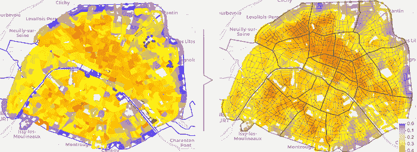

Excel 中的 k-NN 回归器带有平滑功能 - 作者图片

作为结论，当情况允许时，选择一个更具体的距离可以帮助我们更好地捕捉潜在的现实。

通过将距离与数据的性质联系起来，我们可以使 k-NN 变得更加有意义：地理距离用于坐标，余弦距离用于嵌入，等等。距离的选择不仅仅是技术细节，它改变了模型“看待”世界的方式以及它认为哪些邻居是相关的。

## 如何对分类特征进行建模

你可能会听到*分类特征不能在 k-NN 模型中处理*的说法。

但这并不完全正确。

只要我们可以在两个观测值之间**定义一个距离**，k-NN 就可以与分类变量一起工作。

许多人会说：“*只需使用独热编码即可。”*

其他提到*标签编码*或有序编码。

但这些方法在基于距离的模型中表现非常不同。

为了使这一点更清晰，我们将使用另一个数据集：**[钻石价格数据集](https://www.tensorflow.org/datasets/catalog/diamonds)**（CC BY 4.0 许可），它包含诸如克拉、*切割*、*颜色*和*净度*等几个特征。

为了简单起见，我们将只使用**克拉**（数值）和**净度**（分类）来展示一些结果。

### 使用克拉预测价格

首先，我们将从**克拉**开始，因为你可能知道钻石的价格主要取决于宝石的大小（克拉）。

下面的图形显示了 k-NN 如何找到与相似大小的钻石来估计价格。

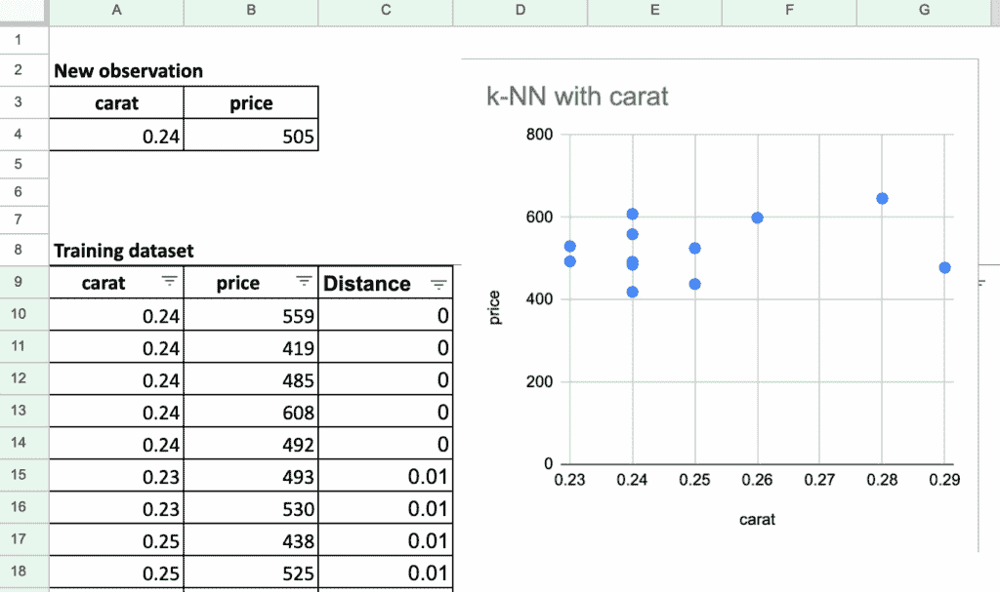

Excel 中的 k-NN 回归器，使用钻石价格数据集 – 图像由作者提供

### 净度特征的 One-Hot 编码

现在，让我们来看看**净度**。

以下是类别及其含义的表格，我们应用**one-hot 编码**将每个类别转换为一个二进制向量。

| **净度** | **含义** |
| --- | --- |
| IF | 完美无瑕 |
| VVS1 | 非常非常轻微包裹 1 |
| VVS2 | 非常非常轻微包裹 2 |
| VS1 | 非常轻微包裹 1 |
| VS2 | 非常轻微包裹 2 |
| SI1 | 轻微包裹 1 |
| SI2 | 轻微包裹 2 |
| I1 | 包裹 1 |

在这个表中，我们可以看到对于新的具有净度**VVS2**的钻石，最近的邻居都是**来自同一净度类别**的钻石。

数值特征*克拉*对距离的影响很小，而它是一个更重要的特征，正如你在价格列中可以看到的那样。

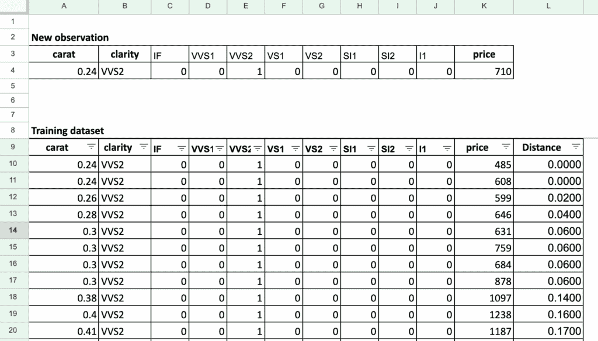

Excel 中的 k-NN 回归器，使用钻石价格数据集中的 one-hot 编码进行净度 – 图像由作者提供

**关键问题 1：所有类别距离相等**

当使用欧几里得距离在一维向量上：

+   IF vs VVS1 → 距离 = √2

+   IF vs SI2 → 距离 = √2

+   IF vs I1 → 距离 = √2

**每个不同的类别都处于完全相同的距离。**

这并不反映真实的钻石评级标准。

**关键问题 2：连续变量的缩放问题**

由于我们将 one-hot 净度与克拉（一个连续特征）结合，我们面临另一个问题：

+   我们的例子中的克拉值在 1 以下

+   净度向量之间的差异为√2 → **净度主导距离计算**

因此，即使净度的微小变化也会压倒克拉的影响。

这正是我们面对的多连续特征缩放问题，但更为严重。

### 净度的顺序编码

现在，我们可以尝试使用数值标签对**净度**特征进行编码。但不是使用经典的标签 1、2、3……我们使用**基于专家的标签**，这些标签反映了真实的评级标准。

理念是将净度级别转换为更类似于连续特征（类似于克拉）的值，即使净度不是严格连续的。

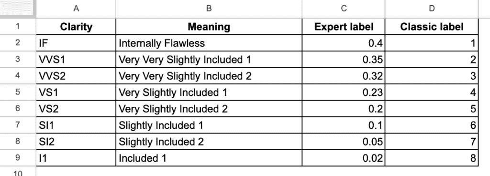

Excel 中的 k-NN 回归器，使用净度编码 – 图像由作者提供

使用这种基于专家的编码，距离变得更有意义。

钻石的大小和清晰度现在处于可比较的尺度上，因此没有任何一个特征完全主导距离计算。

因此，我们在选择邻居时获得了更好的尺寸和清晰度之间的平衡，这给出了更现实的预测。

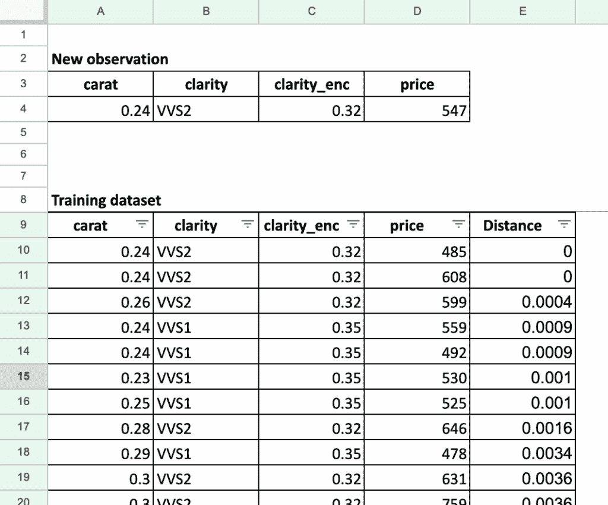

Excel 中的 k-NN 回归器，使用顺序编码对钻石价格数据集中的清晰度特征进行编码 – 图像由作者提供

## 结论

总之，k-NN 回归器是一个高度非线性的局部估计器。它是如此局部，以至于实际上只使用了 K 个最近的观察值。

在 Excel 中实现 k-NN 回归器之后，我认为我们真的可以提出这个问题：k-NN 回归器真的是一个机器学习模型吗？

+   没有模型训练

+   在预测时，邻居观察值的选取不依赖于目标变量的值

但是，它如此容易理解，以至于我们只需使用 Excel 就可以实施整个算法。此外，我们可以随意调整距离。

商人可以直接看到这个想法：**为了预测一个值，我们查看相似的观察结果**。

k-NN 以及所有基于距离的模型的实际问题：

+   特征的尺度

+   特征的异质性，这使得总和没有意义

+   在具体情况下应定义的具体距离

+   对于分类特征，如果我们能找到最优缩放，标签/顺序编码可以优化。

简而言之，问题是特征缩放。我们可能会认为它们可以作为超参数进行调整，但调整将需要花费大量时间。

我们将在后面看到，这正是另一系列模型的动机。

在这里，尺度的概念也等同于特征重要性的概念，因为在 k-NN 中，每个特征的重要性是在使用模型之前定义的。

因此，这只是我们旅程的开始。我们将一起发现其他可以从不同方向改进、做得更好的模型，从这个简单的模型开始：特征缩放、从距离到概率、分割以更好地对每个类别建模...
