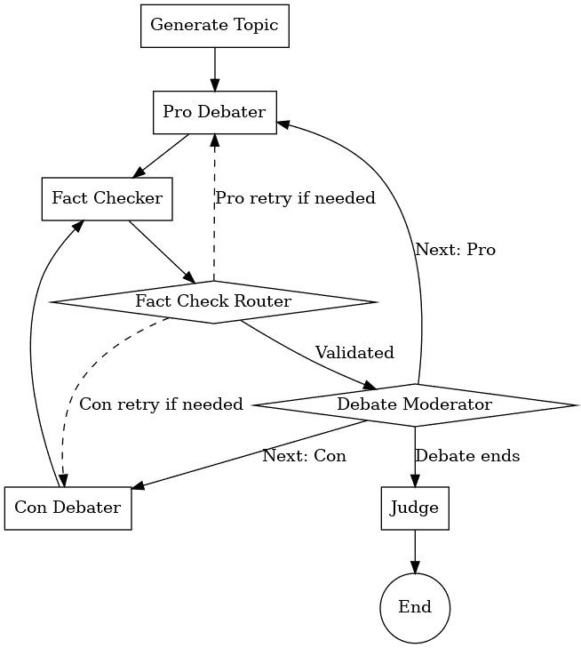
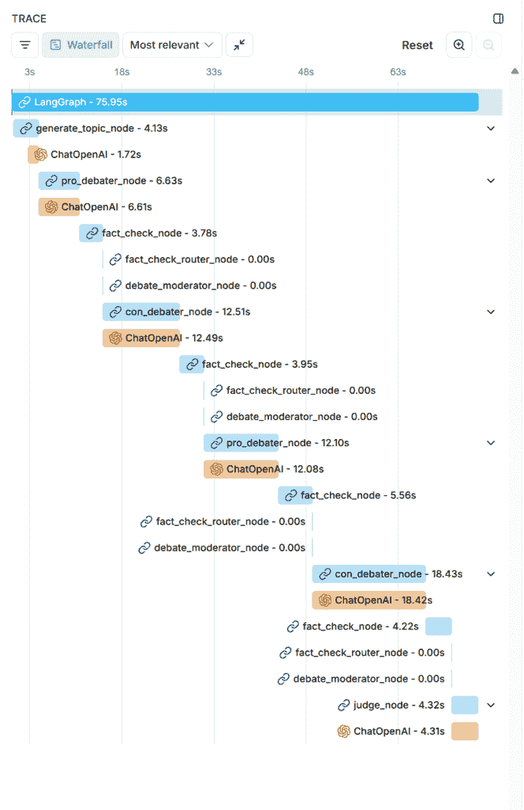

# Deb8flow：使用 LangGraph 和 GPT-4o 编排自主 AI 辩论

> 原文：[`towardsdatascience.com/deb8flow-orchestrating-autonomous-ai-debates-with-langgraph-and-gpt-4o/`](https://towardsdatascience.com/deb8flow-orchestrating-autonomous-ai-debates-with-langgraph-and-gpt-4o/)

## <mdspan datatext="el1743654648107" class="mdspan-comment">简介</mdspan>

我一直对辩论着迷——战略性的框架、尖锐的反驳和精心安排的反击。辩论不仅仅是娱乐；它们是有组织的思想战斗，由逻辑和证据驱动。最近，我开始思考：我们能否使用 AI 代理复制那种动态——让他们自主辩论，包括实时事实核查和主持？结果是**Deb8flow**，一个由**[LangGraph](https://langchain-ai.github.io/langgraph/tutorials/introduction/)**、OpenAI 的**GPT-4o**模型和新的集成**[Web Search](https://platform.openai.com/docs/guides/tools-web-search?api-mode=chat)**功能驱动的自主 AI 辩论环境。

在 Deb8flow 中，两个代理——赞成和反对——就给定的话题进行辩论，同时主持人管理轮流发言。专门的事实核查员利用 GPT-4o 的新浏览功能实时审查每个主张，最终裁判评估论点的质量和连贯性。如果一个代理反复犯事实错误，他们将自动被取消资格——确保辩论基于事实。

本文深入探讨了推动自主 AI 辩论的高级架构和动态工作流程。我将向您介绍 Deb8flow 的模块化设计如何利用 LangGraph 的状态管理和条件路由，以及 GPT-4o 的功能。

即使你对 AI 代理或 LangGraph（见资源[1]和[2]以获取入门知识），我也会清楚地解释关键概念。如果你想进一步探索，完整的项目可在[**GitHub: iason-solomos/Deb8flow**](https://github.com/iason-solomos/Deb8flow)上找到。

准备看看 AI 代理如何在实践中进行自主辩论吗？

**让我们深入探讨。**

## 高级概述：具有多个代理的自主辩论

在 Deb8flow 中，我们编排了一场**正式辩论**，其中两个 AI 代理——一个主张**赞成**，一个主张**反对**——以及一个**主持人**、一个**事实核查员**和一个最终的**裁判**。辩论是自主进行的，每个代理在结构化的格式中扮演一个角色。

在其核心，Deb8flow 是一个由 LangGraph 驱动的代理系统，建立在 LangChain 之上，使用 GPT-4o 为每个角色（正方、反方、裁判等）提供动力。我们使用 GPT-4o 的预览模型和浏览功能来实现实时事实核查。本质上，正方和反方代理进行辩论；在每个陈述之后，事实核查代理使用 GPT-4o 的网页搜索来捕捉该陈述中的任何幻觉或不准确性**实时**。只有当陈述得到验证后，辩论才会继续。整个过程由 LangGraph 定义的工作流程协调，确保适当的轮流发言和条件逻辑。




*高级辩论流程图。每个矩形是一个代理节点（正方/反方辩论者、事实核查者、裁判等），菱形是控制节点（主持人及事实核查后的路由器）。实线箭头表示正常进展，而虚线箭头表示如果主张未通过事实核查则进行重试。裁判节点输出最终裁决，然后工作流程结束。*

作者使用 DALL-E 生成的图像

辩论工作流程经过以下阶段：

+   **主题生成**：主题生成代理为会议生成一个细微且可辩论的主题（例如：“是否应该在课堂教育中使用 AI？”）。

+   **开场**：**正方论点**代理就主题发表开场陈述，从而开启辩论。

+   **反驳**：辩论主持人随后将发言权交给**反方论点**代理，以反驳正方的开场陈述。

+   **反驳**：主持人将发言权交回**正方**代理，以反驳反方代理的观点。

+   **结束语**：主持人最后一次将发言权切换给**反方**代理进行总结陈词。

+   **评判**：最后，**裁判**代理回顾整个辩论历史，并根据论点质量、清晰度和说服力评估双方。最有说服力的那一方获胜。

在**每一次演讲**之后，**事实核查**代理介入以验证该声明的真实性。如果辩论者的主张站不住脚（例如引用错误的数据统计或“幻觉”事实），工作流程将触发**重试**：演讲者必须纠正或修改他们的声明。（如果任何辩论者累积 3 次事实核查失败，他们将**自动被取消资格**，因为他们反复传播不准确性，对手默认获胜。）这种机制确保我们的 AI 辩论者诚实并立足于现实！

## 前提和设置

在深入研究代码之前，请确保您已经具备以下条件：

+   **Python 3.12+**已安装。

+   一个具有访问 GPT-4o 模型的**OpenAI API 密钥**。您可以在以下位置创建自己的 API 密钥：[`platform.openai.com/settings/organization/api-keys`](https://platform.openai.com/settings/organization/api-keys)

+   **项目代码**：从 GitHub 克隆 Deb8flow 仓库 (`git clone https://github.com/iason-solomos/Deb8flow.git`)。仓库包含所有必需软件包的 `requirements.txt` 文件。关键依赖包括 LangChain/LangGraph（用于构建代理图）和 OpenAI Python 客户端。

+   **安装依赖项**：在您的项目目录中运行：`pip install -r requirements.txt` 以安装必要的库。

+   在项目根目录下创建一个 `.env` 文件来保存您的 OpenAI API 凭证。它应该是以下形式：`OPENAI_API_KEY_GPT4O = "sk-…"`

+   您也可以随时查看 README 文件：[`github.com/iason-solomos/Deb8flow`](https://github.com/iason-solomos/Deb8flow)，如果您只想运行完成的应用程序。

依赖项安装和环境变量设置完成后，您应该可以运行应用程序。项目结构组织得清晰明了：

Deb8flow/

├── configurations/

│ ├── debate_constants.py

│ └── llm_config.py

├── nodes/

│ ├── base_component.py

│ ├── topic_generator_node.py

│ ├── pro_debater_node.py

│ ├── con_debater_node.py

│ ├── debate_moderator_node.py

│ ├── fact_checker_node.py

│ ├── fact_check_router_node.py

│ └── judge_node.py

├── prompts/

│ ├── topic_generator_prompts.py

│ ├── pro_debater_prompts.py

│ ├── con_debater_prompts.py

│ └── …（其他代理的提示）

├── tests/ (包含单元和整个工作流程测试)

└── debate_workflow.py

对此结构的快速浏览：

**`configurations/`** 包含常量定义和 LLM 配置类。

**`nodes/`** 包含辩论中每个代理或功能节点的实现（这些中的每一个都是一个模块，定义了一个代理的行为）。

**`prompts/`** 存储语言模型的提示模板（以便每个代理知道如何提示 GPT-4o 执行其特定任务）。

**`debate_workflow.py`** 通过定义 LangGraph 工作流程（节点和转换的图）将所有内容结合起来。

**`debate_state.py`** 定义了代理在每次运行中使用的共享数据结构。

**`tests/`** 包含一些基本测试和示例运行，以帮助您验证一切是否正常工作。

## 内部机制：状态管理和工作流程设置

为了协调复杂的多轮辩论，我们需要一个共享状态和一个定义良好的流程。我们将首先查看 Deb8flow 如何定义 **辩论状态** 和常量，然后了解 **LangGraph 工作流程** 的构建方式。

### 定义辩论状态模式 (`debate_state.py`)

Deb8flow 使用一种 **共享状态** ([`langchain-ai.github.io/langgraph/concepts/low_level/#state`](https://langchain-ai.github.io/langgraph/concepts/low_level/#state) )，其形式为 Python 的 `TypedDict`，所有代理都可以从中读取并更新。此状态跟踪辩论的进度和上下文——例如主题、消息的历史、轮到谁等。通过集中这些信息，每个代理节点可以根据辩论的当前状态做出决策。

链接：[**debate_state.py**](https://github.com/iason-solomos/Deb8flow/blob/main/debate_state.py)

```py
from typing import TypedDict, List, Dict, Literal

DebateStage = Literal["opening", "rebuttal", "counter", "final_argument"]

class DebateMessage(TypedDict):
    speaker: str  # e.g. pro or con
    content: str  # The message each speaker produced
    validated: bool  # Whether the FactChecker ok’d this message
    stage: DebateStage # The stage of the debate when this message was produced

class DebateState(TypedDict):
    debate_topic: str
    positions: Dict[str, str]
    messages: List[DebateMessage]
    opening_statement_pro_agent: str
    stage: str  # "opening", "rebuttal", "counter", "final_argument"
    speaker: str  # "pro" or "con"
    times_pro_fact_checked: int # The number of times the pro agent has been fact-checked. If it reaches 3, the pro agent is disqualified.
    times_con_fact_checked: int # The number of times the con agent has been fact-checked. If it reaches 3, the con agent is disqualified.
```

在`DebateState`中我们需要有的关键字段包括：

+   `debate_topic` (str): 正在辩论的主题。

+   `messages` (List[DebateMessage]): 到目前为止交换的所有消息的列表。每条消息都是一个包含`speaker`（例如`"pro"`、`"con"`或`"fact_checker"`）、消息`content`（文本）、`validated`标志（是否通过事实核查）和辩论产生时的`stage`的字典。

+   `stage` (str): 当前辩论阶段（`"opening"`、`"rebuttal"`、`"counter"`、`"final_argument"`之一）。

+   `speaker` (str): 当前轮到谁发言 (`"pro"` 或 `"con"`).

+   `times_pro_fact_checked` / `times_con_fact_checked` (int): 计数器，记录每一方被抓住虚假陈述的次数。（在我们的规则中，如果辩手三次未能通过事实核查，他们可能会被取消资格或自动失利。）

+   `positions` (Dict[str, str]): (可选) 每一方立场的一般映射（例如，`"pro": "支持该主题"`）。

通过结构化辩论的状态，代理可以轻松访问对话历史或检查当前阶段，控制逻辑可以在回合之间更新状态。状态实际上是辩论的记忆。

### 常量和配置

为了避免代码中散布的“魔法字符串”，我们在`debate_constants.py`中定义了一些常量。例如，阶段名称的常量（`STAGE_OPENING = "opening"`等）、发言人标识符（`SPEAKER_PRO = "pro"`、`SPEAKER_CON = "con"`等）、节点名称（`NODE_PRO_DEBATER = "pro_debater_node"`等）。这些使代码更容易维护和阅读。

[**debate_constants.py**](https://github.com/iason-solomos/Deb8flow/blob/main/configurations/debate_constants.py)**:**

```py
# Stage names
STAGE_OPENING = "opening"
STAGE_REBUTTAL = "rebuttal"
STAGE_COUNTER = "counter"
STAGE_FINAL_ARGUMENT = "final_argument"
STAGE_END = "end"

# Speakers
SPEAKER_PRO = "pro"
SPEAKER_CON = "con"
SPEAKER_JUDGE = "judge"

# Node names
NODE_PRO_DEBATER = "pro_debater_node"
NODE_CON_DEBATER = "con_debater_node"
NODE_DEBATE_MODERATOR = "debate_moderator_node"
NODE_JUDGE = "judge_node" 
```

我们还在`llm_config.py`中设置了 LLM 配置。[llm_config.py](https://github.com/iason-solomos/Deb8flow/blob/main/configurations/llm_config.py)。在这里，我们定义了 OpenAI 或 Azure OpenAI 配置的类，然后创建了一个将模型名称映射到其配置的字典`llm_config_map`。例如，我们将`"gpt-4o"`映射到一个包含模型名称和 API 密钥的`OpenAILLMConfig`。这样，每次我们需要初始化一个 GPT-4o 代理时，我们只需执行`llm_config_map["gpt-4o"]`来获取正确的配置。我们所有的主要代理（辩手、主题生成器、裁判）都使用这个相同的 GPT-4o 配置。

```py
import os
from dataclasses import dataclass
from typing import Union

@dataclass
class OpenAILLMConfig:
    """
    A data class to store configuration details for OpenAI models.

    Attributes:
        model_name (str): The name of the OpenAI model to use.
        openai_api_key (str): The API key for authenticating with the OpenAI service.
    """
    model_name: str
    openai_api_key: str

llm_config_map = {
    "gpt-4o": OpenAILLMConfig(
        model_name="gpt-4o",
        openai_api_key=os.getenv("OPENAI_API_KEY_GPT4O"),
    )
} 
```

### 构建 LangGraph 工作流程 (`debate_workflow.py`)

在设置好状态和配置后，我们构建了[辩论工作流程图](https://github.com/iason-solomos/Deb8flow/blob/main/workflow/debate_workflow.py)。LangGraph 的**StateGraph**是我们所有代理节点执行顺序的骨干。以下是我们的设置方法：

```py
class DebateWorkflow:

    def _initialize_workflow(self) -> StateGraph:
        workflow = StateGraph(DebateState)
        # Nodes
        workflow.add_node("generate_topic_node", GenerateTopicNode(llm_config_map["gpt-4o"]))
        workflow.add_node("pro_debater_node", ProDebaterNode(llm_config_map["gpt-4o"]))
        workflow.add_node("con_debater_node", ConDebaterNode(llm_config_map["gpt-4o"]))
        workflow.add_node("fact_check_node", FactCheckNode())
        workflow.add_node("fact_check_router_node", FactCheckRouterNode())
        workflow.add_node("debate_moderator_node", DebateModeratorNode())
        workflow.add_node("judge_node", JudgeNode(llm_config_map["gpt-4o"]))

        # Entry point
        workflow.set_entry_point("generate_topic_node")

        # Flow
        workflow.add_edge("generate_topic_node", "pro_debater_node")
        workflow.add_edge("pro_debater_node", "fact_check_node")
        workflow.add_edge("con_debater_node", "fact_check_node")
        workflow.add_edge("fact_check_node", "fact_check_router_node")
        workflow.add_edge("judge_node", END)
        return workflow

    async def run(self):
        workflow = self._initialize_workflow()
        graph = workflow.compile()
        # graph.get_graph().draw_mermaid_png(output_file_path="workflow_graph.png")
        initial_state = {
            "topic": "",
            "positions": {}
        }
        final_state = await graph.ainvoke(initial_state, config={"recursion_limit": 50})
        return final_state 
```

让我们分解一下正在发生的事情：

+   我们使用我们的`DebateState`类型作为状态模式初始化一个新的`StateGraph`。

+   我们将每个节点（代理）添加到图中，并赋予一个名称。对于需要 LLM 的节点，我们传入 GPT-4o 配置。例如，`"pro_debater_node"`被添加为`ProDebaterNode(llm_config_map["gpt-4o"])`，这意味着正方辩论代理将使用 GPT-4o 作为其底层模型。

+   我们将图的**入口点**设置为`"generate_topic_node"`。这意味着工作流程的第一步是生成一个辩论主题。

+   然后我们添加有向边来连接节点。上面的边编码了主要序列：主题 -> 正方发言 -> 事实核查 -> （然后是路由决策）-> … 最终 -> 判决 -> 结束。我们不会用静态边连接主持人或事实核查路由器，因为这些节点使用动态命令来重定向流程。最后的边将判决连接到一个`END`标记，以终止图。

当工作流程运行时，控制将按照这些边的顺序传递，但每当遇到**路由器或主持人节点**时，该节点将输出一个命令，告诉图下一个要访问的节点（覆盖默认边）。这就是我们创建条件循环的方式：`fact_check_router_node`可能会将我们送回辩论节点进行重试，而不是直接前进。LangGraph 通过允许节点返回带有`goto`指令的特殊`Command`对象来支持这一点。

总结来说，从高层次上讲，我们已经定义了一个**代理工作流程**：一个自主代理的图，控制可以根据代理的输出进行分支和循环。现在，让我们探索每个代理节点实际上做什么。

## 代理节点分解

辩论中的每个阶段或角色都被封装在一个节点（代理）中。在 LangGraph 中，节点通常是简单的函数，但我希望有一个更面向对象的方法来提高清晰度和可重用性。因此，在 Deb8flow 中，每个节点都是一个**类**，具有`__call__`方法。所有主要代理类都继承自一个共同的`BaseComponent`以实现共享功能。这种设计使系统模块化：我们可以通过修改它们的类定义来轻松地替换或扩展代理，并且每个代理类都负责其工作流程的一部分。

让我们逐一介绍关键代理。

### `BaseComponent` – 可重用代理基类

我们的大多数代理节点（如辩论者和裁判）有共同的需求：它们使用 LLM 来生成输出，它们可能需要在出错时重试，并且它们应该跟踪令牌使用情况。`BaseComponent`类（在`<a href="https://github.com/iason-solomos/Deb8flow/blob/main/nodes/base_component.py">nodes/base_component.py</a>`中定义）提供了这些共同特性，这样我们就不需要重复代码。

```py
class BaseComponent:
    """
    A foundational class for managing LLM-based workflows with token tracking.
    Can handle both Azure OpenAI (AzureChatOpenAI) and OpenAI (ChatOpenAI).
    """

    def __init__(
        self,
        llm_config: Optional[LLMConfig] = None,
        temperature: float = 0.0,
        max_retries: int = 5,
    ):
        """
        Initializes the BaseComponent with optional LLM configuration and temperature.

        Args:
            llm_config (Optional[LLMConfig]): Configuration for either Azure or OpenAI.
            temperature (float): Controls the randomness of LLM outputs. Defaults to 0.0.
            max_retries (int): How many times to retry on 429 errors.
        """
        logger = logging.getLogger(self.__class__.__name__)
        tracer = trace.get_tracer(__name__, tracer_provider=get_tracer_provider())

        self.logger = logger
        self.tracer = tracer
        self.llm: Optional[ChatOpenAI] = None
        self.output_parser: Optional[StrOutputParser] = None
        self.state: Optional[DebateState] = None
        self.prompt_template: Optional[ChatPromptTemplate] = None
        self.chain: Optional[RunnableSequence] = None
        self.documents: Optional[List] = None
        self.prompt_tokens = 0
        self.completion_tokens = 0
        self.max_retries = max_retries

        if llm_config is not None:
            self.llm = self._init_llm(llm_config, temperature)
            self.output_parser = StrOutputParser()

    def _init_llm(self, config: LLMConfig, temperature: float):
        """
        Initializes an LLM instance for either Azure OpenAI or standard OpenAI.
        """
        if isinstance(config, AzureOpenAILLMConfig):
            # If it's Azure, use the AzureChatOpenAI class
            return AzureChatOpenAI(
                deployment_name=config.deployment_name,
                azure_endpoint=config.azure_endpoint,
                openai_api_version=config.openai_api_version,
                openai_api_key=config.openai_api_key,
                temperature=temperature,
            )
        elif isinstance(config, OpenAILLMConfig):
            # If it's standard OpenAI, use the ChatOpenAI class
            return ChatOpenAI(
                model_name=config.model_name,
                openai_api_key=config.openai_api_key,
                temperature=temperature,
            )
        else:
            raise ValueError("Unsupported LLMConfig type.")

    def validate_initialization(self) -> None:
        """
        Ensures we have an LLM and an output parser.
        """
        if not self.llm:
            raise ValueError("LLM is not initialized. Ensure `llm_config` is provided.")
        if not self.output_parser:
            raise ValueError("Output parser is not initialized.")

    def execute_chain(self, inputs: Any) -> Any:
        """
        Executes the LLM chain, tracks token usage, and retries on 429 errors.
        """
        if not self.chain:
            raise ValueError("No chain is initialized for execution.")

        retry_wait = 1  # Initial wait time in seconds

        for attempt in range(self.max_retries):
            try:
                with get_openai_callback() as cb:
                    result = self.chain.invoke(inputs)
                    self.logger.info("Prompt Token usage: %s", cb.prompt_tokens)
                    self.logger.info("Completion Token usage: %s", cb.completion_tokens)
                    self.prompt_tokens = cb.prompt_tokens
                    self.completion_tokens = cb.completion_tokens

                return result

            except Exception as e:
                # If the error mentions 429, do exponential backoff and retry
                if "429" in str(e):
                    self.logger.warning(
                        f"Rate limit reached. Retrying in {retry_wait} seconds... "
                        f"(Attempt {attempt + 1}/{self.max_retries})"
                    )
                    time.sleep(retry_wait)
                    retry_wait *= 2
                else:
                    self.logger.error(f"Unexpected error: {str(e)}")
                    raise e

        raise Exception("API request failed after maximum number of retries")

    def create_chain(
        self, system_template: str, human_template: str
    ) -> RunnableSequence:
        """
        Creates a chain for unstructured outputs.
        """
        self.validate_initialization()
        self.prompt_template = ChatPromptTemplate.from_messages(
            [
                ("system", system_template),
                ("human", human_template),
            ]
        )
        self.chain = self.prompt_template | self.llm | self.output_parser
        return self.chain

    def create_structured_output_chain(
        self, system_template: str, human_template: str, output_model: Type[BaseModel]
    ) -> RunnableSequence:
        """
        Creates a chain that yields structured outputs (parsed into a Pydantic model).
        """
        self.validate_initialization()
        self.prompt_template = ChatPromptTemplate.from_messages(
            [
                ("system", system_template),
                ("human", human_template),
            ]
        )
        self.chain = self.prompt_template | self.llm.with_structured_output(output_model)
        return self.chain

    def build_return_with_tokens(self, node_specific_data: dict) -> dict:
        """
        Convenience method to add token usage info into the return values.
        """
        return {
            **node_specific_data,
            "prompt_tokens": self.prompt_tokens,
            "completion_tokens": self.completion_tokens,
        }

    def __call__(self, state: DebateState) -> None:
        """
        Updates the node's local copy of the state.
        """
        self.state = state
        for key, value in state.items():
            setattr(self, key, value) 
```

`BaseComponent`的关键特性：

+   它存储了一个初始化了给定模型和 API 密钥的 LLM 客户端（例如，一个 OpenAI 的`ChatOpenAI`实例），以及一个输出解析器。

+   它提供了一个`create_chain(system_template, human_template)`方法，该方法设置了一个 LangChain **提示链**（一个`RunnableSequence`），结合了系统提示和人类提示。这个链在运行时实际上生成输出。

+   它有一个 `execute_chain(inputs)` 方法，该方法调用链并包含逻辑以**重试**如果 OpenAI API 返回速率限制错误（HTTP 429）。这是通过指数退避直到 `max_retries` 计数来完成的。

+   它跟踪令牌使用情况（提示令牌和完成令牌）以进行日志记录或分析。

+   `__call__` 方法（每个子类将通过 `super().__call__(state)` 调用）可以在节点的主要逻辑运行之前执行任何必要的设置（例如确保 LLM 已初始化）。

通过在 `BaseComponent` 上构建，每个代理类都可以专注于其独特的逻辑（例如使用什么提示以及如何处理状态），同时继承与 GPT-4o 交互的繁重工作。

### 主题生成代理（`GenerateTopicNode`）

**主题生成器** **(**[topic_generator_node.py](https://github.com/iason-solomos/Deb8flow/blob/main/nodes/topic_generator_node.py)**)** 是图中的第一个代理。其任务是为会话提供一个可辩论的主题。我们给它一个提示，指示它输出一个可能合理地有赞成和反对两方面的细微主题。

该代理从 `BaseComponent` 继承，并使用提示链（系统+人工提示）生成一条文本内容——辩论主题。当被调用时，它执行链（没有特殊输入，仅使用提示）并返回一个 `topic_text`。然后它通过以下方式更新状态：

+   `debate_topic`：生成的主题（去除任何额外的空白字符），

+   `positions`：一个字典，将赞成和反对立场分配给（默认情况下我们使用 `"支持主题"` 和 `"反对主题"`），

+   `stage`：设置为 `"opening"`，

+   `speaker`：设置为 `"pro"`（因此赞成方将首先发言）。

在代码中，返回可能看起来像这样：

```py
return {
    "debate_topic": debate_topic,
    "positions": positions,
    "stage": "opening",
    "speaker": first_speaker  # "pro"
} 
```

这里是主题生成器的提示：

```py
SYSTEM_PROMPT = """\
You are a brainstorming AI that suggests debate topics.
You will provide a single, interesting or timely topic that can have two opposing views.
"""

HUMAN_PROMPT = """\
Please suggest one debate topic for two AI agents to discuss.
For example, it could be about technology, politics, philosophy, or any interesting domain.
Just provide the topic in a concise sentence.
"""
```

然后我们在类的构造函数中传递这些提示。

```py
class GenerateTopicNode(BaseComponent):
    def __init__(self, llm_config, temperature: float = 0.7):
        super().__init__(llm_config, temperature)
        # Create the prompt chain.
        self.chain: RunnableSequence = self.create_chain(
            system_template=SYSTEM_PROMPT,
            human_template=HUMAN_PROMPT
        )

    def __call__(self, state: DebateState) -> Dict[str, str]:
        """
        Generates a debate topic and assigns positions to the two debaters.
        """
        super().__call__(state)

        topic_text = self.execute_chain({})

        # Store the topic and assign stances in the DebateState
        debate_topic = topic_text.strip()
        positions = {
            "pro": "In favor of the topic",
            "con": "Against the topic"
        }

        first_speaker = "pro"
        self.logger.info("Welcome to our debate panel! Today's debate topic is: %s", debate_topic)
        return {
            "debate_topic": debate_topic,
            "positions": positions,
            "stage": "opening",
            "speaker": first_speaker
        }
```

这是我们将重复用于所有类（除了不使用 LLM 和事实核查器的类）的模式。

现在我们可以实现表演的两大亮点，即赞成和反对的辩论代理！

### 辩论代理（赞成和反对）

链接：[pro_debater_node.py](https://github.com/iason-solomos/Deb8flow/blob/main/nodes/pro_debater_node.py)

这两个辩论代理在结构上非常相似，但每个都使用针对其角色（赞成方与反对方）和辩论阶段的不同的提示模板。

例如，赞成辩论者必须处理**开场陈述**和**反论**（反驳反对方的反驳）。我们还需要在陈述失败事实核查时的重试逻辑。在代码中，ProDebater 类设置多个提示链：

+   `opening_chain` 和 `opening_retry_chain`（使用略微不同的人工提示——重试提示可能指示它再次尝试而不重复任何有事实问题的主张）。

+   `counter_chain` 和 `counter_retry_chain` 用于反论阶段。

```py
class ProDebaterNode(BaseComponent):
    def __init__(self, llm_config, temperature: float = 0.7):
        super().__init__(llm_config, temperature)
        self.opening_chain = self.create_chain(SYSTEM_PROMPT, OPENING_HUMAN_PROMPT)
        self.opening_retry_chain = self.create_chain(SYSTEM_PROMPT, OPENING_RETRY_HUMAN_PROMPT)
        self.counter_chain = self.create_chain(SYSTEM_PROMPT, COUNTER_HUMAN_PROMPT)
        self.counter_retry_chain = self.create_chain(SYSTEM_PROMPT, COUNTER_RETRY_HUMAN_PROMPT)

    def __call__(self, state: DebateState) -> Dict[str, Any]:
        super().__call__(state)

        debate_topic = state.get("debate_topic")
        messages = state.get("messages", [])
        stage = state.get("stage")
        speaker = state.get("speaker")

        # Check if retrying (last message was by pro and not validated)
        last_msg = messages[-1] if messages else None
        retrying = last_msg and last_msg["speaker"] == SPEAKER_PRO and not last_msg["validated"]

        if stage == STAGE_OPENING and speaker == SPEAKER_PRO:
            chain = self.opening_retry_chain if retrying else self.opening_chain # select which chain we are triggering: the normal one or the fact-cehcked one
            result = chain.invoke({
                "debate_topic": debate_topic
            })
        elif stage == STAGE_COUNTER and speaker == SPEAKER_PRO:
            opponent_msg = self._get_last_message_by(SPEAKER_CON, messages)
            debate_history = get_debate_history(messages)
            chain = self.counter_retry_chain if retrying else self.counter_chain
            result = chain.invoke({
                "debate_topic": debate_topic,
                "opponent_statement": opponent_msg,
                "debate_history": debate_history
            })
        else:
            raise ValueError(f"Unknown turn for ProDebater: stage={stage}, speaker={speaker}")
        new_message = create_debate_message(speaker=SPEAKER_PRO, content=result, stage=stage)
        self.logger.info("Speaker: %s, Stage: %s, Retry: %s\nMessage:\n%s", speaker, stage, retrying, result)
        return {
            "messages": messages + [new_message]
        }

    def _get_last_message_by(self, speaker_prefix, messages):
        for m in reversed(messages):
            if m.get("speaker") == speaker_prefix:
                return m["content"]
        return ""
```

当 ProDebater 的 `__call__` 运行时，它会查看状态中的当前 `stage` 和 `speaker` 以决定要做什么：

+   如果是**开场**阶段且发言者是“pro”，它使用`opening_chain`生成开场论点。如果来自 Pro 的最后一条消息被标记为无效（未验证），它知道这是一个重试，因此会使用`opening_retry_chain`。

+   如果是**反驳**阶段且发言者是“pro”，它会对对手（Con）刚刚说的内容生成反驳论点。它将从`messages`历史中获取 Con 的最后一条消息，并将其输入到提示中（这样 Pro 可以直接反驳它）。同样，如果最后一条 Pro 消息无效，它会切换到重试链。

在生成其论点后，辩论者代理创建一个新的消息条目（`speaker="pro"`，内容文本，`validated=False`初始状态，以及阶段），并将其附加到状态的消息列表中。这成为节点的输出（LangGraph 将此部分状态更新合并到全局状态）。

**Con 辩论者**代理以类似的方式为其阶段实现逻辑：

它同样将其消息附加到状态上。

它有一个**反驳**和**总结陈词**（最终论点）阶段，每个阶段都有一个正常和重试链。

它检查是否处于反驳阶段（发言者“con”）或最终论点阶段（发言者“con”），并调用适当的链，在反驳时可能使用最后一条 Pro 消息作为上下文。

[con_debater_node.py](https://github.com/iason-solomos/Deb8flow/blob/main/nodes/con_debater_node.py)

通过使用基于类的实现，我们的辩论者代码更容易维护。我们可以清楚地分离 Pro 所做和 Con 所做，即使它们共享结构。此外，通过在类中封装提示链，每个辩论者可以干净地管理多种可能的输出（常规与重试）。

**提示设计**：实际的提示（在`prompts/pro_debater_prompts.py`和`con_debater_prompts.py`中）指导 GPT-4o 模型扮演一个角色（“你是一位辩论者，正在为/反对该主题进行辩论...”）并生成论点。它们还指示模型保持陈述的事实性和逻辑性。如果事实核查失败，重试提示可能会说：“你之前的陈述有一个未经证实的说法。修改你的论点，使其在保持立场的同时保持事实正确。”——鼓励模型自我纠正。

通过这种方式，我们的 AI 辩论者可以进行多轮对决，甚至能够从事实错误中恢复过来。

### 事实核查代理（`FactCheckNode`）

每位辩论者发言后，事实核查代理就会介入以验证他们的主张。这个代理在`<a href="https://github.com/iason-solomos/Deb8flow/blob/main/nodes/fact_checker_node.py">fact_checker_node.py</a>`中实现，有趣的是，它使用的是**GPT-4o 模型的网络浏览能力**而不是我们自己的定制提示。本质上，我们将事实核查委托给了 OpenAI 的 GPT-4 和网页搜索。

这是如何工作的？OpenAI Python 客户端 GPT-4（带有浏览功能）允许我们发送用户消息并获得结构化响应。在 `FactCheckNode.__call__` 中，我们做的是类似以下操作：

```py
completion = self.client.beta.chat.completions.parse(
            model="gpt-4o-search-preview",
            web_search_options={},
            messages=[{
                "role": "user",
                "content": (
                        f"Consider the following statement from a debate. "
                        f"If the statement contains numbers, or figures from studies, fact-check it online.\n\n"
                        f"Statement:\n\"{claim}\"\n\n"
                        f"Reply clearly whether any numbers or studies might be inaccurate or hallucinated, and why."
                        f"\n"
                        f"If the statement doesn't contain references to studies or numbers cited, don't go online to fact-check, and just consider it successfully fact-checked, with a 'yes' score.\n\n"
                )
            }],
            response_format=FactCheck
        )
```

如果结果是**“是”**（意味着主张似乎真实或至少不是事实上的错误），事实核查器将在状态中将最后一条消息的 `validated` 字段标记为 True，并输出 `{"validated": True}` 而没有进一步的更改。这表示辩论可以正常继续。

如果结果是**“否”**（意味着它发现主张是不正确的或可疑的），事实核查器将向状态中添加一条新消息，内容为 `speaker="fact_checker"` 描述发现（或者我们也可以简单地标记它，但提供像 *“（事实核查器：引用的统计数据无法验证。）”* 这样的简短说明可能是有用的）。它还将设置 `validated: False` 并增加提出主张的任何一方的计数器。从这个节点输出的状态包括 `validated: False` 和更新的 `times_pro_fact_checked` 或 `times_con_fact_checked` 计数。

我们还使用 Pydantic BaseModel 来控制 LLM 的输出：

```py
class FactCheck(BaseModel):
    """
    Pydantic model for the fact checking the claims made by debaters.

    Attributes:
        binary_score (str): 'yes' if the claim is verifiable and truthful, 'no' otherwise.
    """

    binary_score: str = Field(
        description="Indicates if the claim is verifiable and truthful. 'yes' or 'no'."
    )
    justification: str = Field(
        description="Explanation of the reasoning behind the score."
    )
```

### 辩论主持人代理 (`DebateModeratorNode`)

辩论主持人是辩论的指挥。这个代理的任务不是产生冗长的文本，而是管理**轮流发言**和舞台进展。在工作流程中，在事实核查器验证了陈述之后，控制权传递给主持人节点。然后主持人发出一个 `Command`，更新下一轮的状态，并将流程导向适当的下一个代理。

`DebateModeratorNode.__call__` 中的逻辑（见 `<a href="https://github.com/iason-solomos/Deb8flow/blob/main/nodes/debate_moderator_node.py">nodes/debate_moderator_node.py</a>`）大致如下：

```py
if stage == STAGE_OPENING and speaker == SPEAKER_PRO:
            return Command(
                update={"stage": STAGE_REBUTTAL, "speaker": SPEAKER_CON},
                goto=NODE_CON_DEBATER
            )
        elif stage == STAGE_REBUTTAL and speaker == SPEAKER_CON:
            return Command(
                update={"stage": STAGE_COUNTER, "speaker": SPEAKER_PRO},
                goto=NODE_PRO_DEBATER
            )
        elif stage == STAGE_COUNTER and speaker == SPEAKER_PRO:
            return Command(
                update={"stage": STAGE_FINAL_ARGUMENT, "speaker": SPEAKER_CON},
                goto=NODE_CON_DEBATER
            )
        elif stage == STAGE_FINAL_ARGUMENT and speaker == SPEAKER_CON:
            return Command(
                update={},
                goto=NODE_JUDGE
            )

        raise ValueError(f"Unexpected stage/speaker combo: stage={stage}, speaker={speaker}")
```

每个条件对应辩论中一个轮次刚刚结束的点，并设置下一轮。例如，在**开场**（正方发言后），它将阶段设置为**反驳**，切换发言者为反方，并将工作流程导向反方辩论节点。在**最后陈述**（反方的结束语）后，它将流程导向法官，不再进行更新（辩论阶段实际上结束了）。

### 事实核查路由器 (`FactCheckRouterNode`)

这又是一个控制节点（类似于主持人），它引入了条件逻辑。事实核查路由器位于事实核查代理之后的流程中。它的目的是根据**事实核查结果****分支工作流程**。

在 `<a href="https://github.com/iason-solomos/Deb8flow/blob/main/nodes/fact_check_router_node.py">nodes/fact_check_router_node.py</a>` 中，逻辑如下：

```py
if pro_fact_checks >= 3 or con_fact_checks >= 3:
            disqualified = SPEAKER_PRO if pro_fact_checks >= 3 else SPEAKER_CON
            winner = SPEAKER_CON if disqualified == SPEAKER_PRO else SPEAKER_PRO

            verdict_msg = {
                "speaker": "moderator",
                "content": (
                    f"Debate ended early due to excessive factual inaccuracies.\n\n"
                    f"DISQUALIFIED: {disqualified.upper()} (exceeded fact check limit)\n"
                    f"WINNER: {winner.upper()}"
                ),
                "validated": True,
                "stage": "verdict"
            }
            return Command(
                update={"messages": messages + [verdict_msg]},
                goto=END
            )
        if last_message.get("validated"):
            return Command(goto=NODE_DEBATE_MODERATOR)
        elif speaker == SPEAKER_PRO:
            return Command(goto=NODE_PRO_DEBATER)
        elif speaker == SPEAKER_CON:
            return Command(goto=NODE_CON_DEBATER)
        raise ValueError("Unable to determine routing in FactCheckRouterNode.")
```

首先，事实核查路由器检查任何一方的事实核查计数是否达到 3。如果是这样，它将创建一个类似主持人的消息宣布提前结束：违规方被取消资格，另一方获胜。它将这个裁决添加到消息中，并返回一个跳转到 `END` 的命令，实际上在没有去法官那里的情况下终止了辩论（因为我们已经知道了结果）。

如果我们不是提前结束辩论，它将查看最后一条信息的核查结果（该信息存储为该消息上的`validated`）。如果验证为*True*，则转向辩论主持人：`Command(goto=debate_moderator_node)`。

否则，如果声明未通过事实核查，工作流程将返回给辩论者以生成修订后的声明（状态计数器更新以反映失败）。如果需要，这个循环可以发生多次（直到取消资格限制）。

这种动态控制是 Deb8flow 的“代理”特性的核心——根据代理输出的内容调整执行路径的能力。它展示了 LangGraph 的优势：将控制流与状态相结合。我们实际上是将辩论规则（如允许对错误声明进行重试，或如果有人作弊太频繁则结束辩论）直接编码到工作流程图中。

### 法官代理（`JudgeNode`）

**最后但同样重要的是，法官代理**根据**修辞技巧、清晰度、结构和整体说服力**给出最终裁决。其**系统提示词**和**人类提示词**使这一点明确：

+   **系统提示词**： “您是一个无偏见的辩论法官 AI。…评估哪位辩论者更清晰地、更有说服力地、更有逻辑性地陈述了自己的观点。您必须关注沟通技巧、论点结构、修辞强度和整体连贯性。”

+   **人类提示词**： “这里是完整的辩论记录。请分析两位辩论者的表现——正方和反方。评估修辞表现——清晰度、结构、说服力和相关性，并决定谁更有效地陈述了自己的观点。”

当**法官**节点运行时，它接收整个辩论记录（所有已验证的消息）以及原始主题。然后它使用 GPT-4o 来检查每一方如何构建论点、处理反驳点，以及用例子或逻辑支持（或未能支持）主张。关键的是，**法官**被禁止评估哪个立场是**客观正确的**（或它**认为**可能正确的人）——只评估**谁更有说服力**。

下面是一个关于该主题的 Deb8flow 运行示例最终裁决：

**“政府应该实施全民基本收入以应对劳动力中日益增长的自动化吗？”**

```py
WINNER: PRO

REASON: The PRO debater presented a more compelling and rhetorically effective case for universal basic income. Their arguments were well-structured, beginning with a clear statement of the issue and the necessity of UBI in response to automation. They effectively addressed potential counterarguments by highlighting the unprecedented speed and scope of current technological changes, which distinguishes the current situation from past technological shifts. The PRO also provided empirical evidence from UBI pilot programs to counter the CON's claims about work disincentives and economic inefficiencies, reinforcing their argument with real-world examples.

In contrast, the CON debater, while presenting valid concerns about UBI, relied heavily on historical analogies and assumptions about workforce adaptability without adequately addressing the unique challenges posed by modern automation. Their arguments about the fiscal burden and potential inefficiencies of UBI were less supported by specific evidence compared to the PRO's rebuttals.

Overall, the PRO's arguments were more coherent, persuasive, and backed by empirical evidence, making their case more convincing to a neutral observer. 
```

## Langsmith 跟踪

在 Deb8flow 的开发过程中，我依赖**LangSmith**（LangChain 的跟踪和可观察性工具包）来确保整个辩论流程运行正确。因为我们有多个代理在它们之间传递控制权，所以很容易出现意外的循环或错误路由的状态。**LangSmith**提供了一种方便的方法：

+   **可视化执行流程**：您可以看到每个代理的提示词、**消耗的标记**（因此您也可以跟踪成本），以及任何中间状态。这使得确认，例如，反方辩论者是否正确引用了正方辩论者的最后一条消息，或者事实核查者是否准确接收了要验证的主张，变得简单得多。

+   **调试状态更新**：如果主持人或事实核查路由器将流程发送到错误的节点，跟踪将突出显示这种不匹配。你可以跟踪每个步骤调用了哪个代理以及为什么，帮助你及早发现阶段或演讲者不匹配。

+   **跟踪提示和完成令牌**：在多个 GPT-4o 调用中，看到每个阶段使用了多少令牌是有用的，如果启用跟踪，LangSmith 会自动记录。

集成**LangSmith**意外地简单。你只需在你的.env 文件中提供这些 3 个密钥：`LANGCHAIN_API_KEY`

`LANGCHAIN_TRACING_V2`

`LANGCHAIN_PROJECT`

然后，你可以打开 LangSmith UI 来查看每个运行的结构化跟踪。这大大减少了调试多代理系统所需的猜测工作，在我的经验中，这对于我们这样的更复杂的 AI 编排是必不可少的。单个运行的示例：



在 Lansmith 中，一个运行的瀑布模式跟踪，显示了整个流程的运行情况。来源：作者使用 Langsmith 生成。

## 反思与下一步计划

构建 Deb8flow 是一次令人耳目一新的练习，用于编排**自主代理工作流程**。我们不仅仅是一个模型调用的链式调用——我们创建了一个完整的辩论模拟，其中包含 AI 代理，每个代理都有特定的角色，并允许他们根据一套规则进行交互。LangGraph 提供了一个清晰的框架来定义数据和控制如何在代理之间流动，使得复杂的序列在代码中变得可管理。通过使用基于类的代理和共享状态，我们保持了模块化和清晰性，这对于任何软件工程项目的长期发展都将是有益的。

这个项目的令人兴奋之处在于看到了涌现的行为。尽管每个代理都遵循一个脚本（一个提示），但未经编排的组合——一个试图欺骗的辩论者、一个捕捉到错误的核查者、辩论者重新措辞——感觉出奇地真实！这是朝着更具有代理性的 AI 系统迈出的一小步，这些系统能够执行非平凡的多步任务，并且相互之间有监督。

有很多改进的想法：

+   **用户交互**：目前它是完全自动化的，但可以添加一种模式，其中人类提供主题，甚至可以扮演 AI 对手的一边。

+   我们可以改变辩论者说话的顺序。

+   我们可以更改提示，从而在一定程度上改变代理的行为，并尝试不同的提示。

+   让辩论者在发表声明之前也进行网络搜索，从而为他们提供最新的信息。

Deb8flow 的更广泛影响在于它展示了**可组合 AI 代理**的模式。通过定义清晰的边界和交互（就像软件中的微服务一样），我们可以拥有复杂的 AI 驱动过程，这些过程仍然可解释和可控。每个代理就像机器上的一个齿轮，LangGraph 是使它们协同工作的齿轮系统。

我觉得这个项目很有活力，希望它能激发你探索多智能体工作流程。无论是辩论、共同写作，还是从不同专家角度解决问题，**GPT**、**工具**和结构化的**智能体工作流程**为人工智能的发展开辟了新的可能性。祝大家愉快地破解！

## 参考文献

[[1] D. Bouchard, “From Basics to Advanced: Exploring LangGraph,” *Medium*, Nov. 22, 2023\. [Online]. Available:](https://medium.com/data-science/from-basics-to-advanced-exploring-langgraph-e8c1cf4db787) [`medium.com/data-science/from-basics-to-advanced-exploring-langgraph-e8c1cf4db787`](https://medium.com/data-science/from-basics-to-advanced-exploring-langgraph-e8c1cf4db787). [Accessed: Apr. 1, 2025].

[2] A. W. T. Ng, “Building a Research Agent that Can Write to Google Docs: Part 1,” *Towards Data Science*, Jan. 11, 2024\. [Online]. Available: [`towardsdatascience.com/building-a-research-agent-that-can-write-to-google-docs-part-1-4b49ea05a292/`](https://towardsdatascience.com/building-a-research-agent-that-can-write-to-google-docs-part-1-4b49ea05a292/). [Accessed: Apr. 1, 2025].
