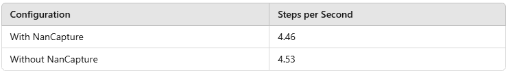

# 调试令人恐惧的 NaN

> 原文：[`towardsdatascience.com/debugging-the-dreaded-nan/`](https://towardsdatascience.com/debugging-the-dreaded-nan/)

你正在训练最新的 AI 模型，焦急地观察着损失稳步下降，突然——砰！你的日志被 NaN（非数字）填满——你的模型已经不可修复地损坏，你只能绝望地盯着屏幕。更糟糕的是，NaN 并不总是出现。有时你的模型训练得很好；有时，它无法解释地失败。有时它立即崩溃，有时在训练了许多天后才会崩溃。

深度学习工作负载中的 NaN（非数字）问题是遇到的最令人沮丧的问题之一。由于它们通常突然出现——由模型状态、输入数据和随机因素的特定组合触发——因此它们可能极其难以重现和调试。

考虑到训练 AI 模型的成本相当高以及 NaN 失败可能造成的潜在浪费，建议拥有专门的工具来捕获和分析 NaN 的发生。在[之前的文章](https://contributor.insightmediagroup.io/capturing-a-training-state-in-tensorflow-7d643e3fb20b/)中，我们讨论了在 TensorFlow 训练工作负载中调试 NaN 的挑战。我们提出了一种高效的方法来捕获和重现 NaN，并分享了一个示例 TensorFlow 实现。在这篇文章中，我们采用并展示了类似机制来调试 PyTorch 工作负载中的 NaN。一般方案如下：

在每个训练步骤：

1.  保存训练输入批次的副本。

1.  检查梯度中的 NaN 值。如果出现任何 NaN 值，在模型被破坏之前保存当前模型权重的检查点。此外，保存输入批次，如果需要，保存随机状态。中断训练作业。

1.  通过加载保存的实验状态来重现和调试 NaN 的发生。

虽然这个方案可以很容易地在原生 PyTorch 中实现，但我们将借此机会展示一些[PyTorch Lightning](https://github.com/Lightning-AI/pytorch-lightning)的便利之处——这是一个强大的开源框架，旨在简化机器学习（ML）模型的开发。建立在 PyTorch 之上，Lightning 抽象掉了许多机器学习实验的样板代码组件，如训练循环、数据分布、日志记录等，使开发者能够专注于模型的核心逻辑。

为了实现我们的 NaN 捕获方案，我们将使用[Lightning 的回调](https://lightning.ai/docs/pytorch/stable/extensions/callbacks.html)接口——这是一个专门的架构，允许在执行流程的特定点插入自定义逻辑。

重要的是，请不要将我们选择 Lightning 或我们提到的任何其他工具或技术视为对其使用的认可。我们将分享的代码仅用于演示目的——请勿依赖其正确性或最优性。

感谢[Rom Maltser](https://www.linkedin.com/in/rom-maltser/?originalSubdomain=il)为此帖子的贡献。

## NaNCapture 回调

为了实现我们的 NaN 捕获解决方案，我们创建了一个 NaNCapture Lightning 回调。构造函数接收一个用于存储/加载检查点的目录路径，并设置 NaNCapture 状态。我们还定义了用于检查 NaN、存储检查点和停止训练作业的实用工具。

```py
 import os
import torch
from copy import deepcopy
import lightning.pytorch as pl

class NaNCapture(pl.Callback):

    def __init__(self, dirpath: str):
        # path to checkpoint
        self.dirpath = dirpath

        # update to True when Nan is identified
        self.nan_captured = False

        # stores a copy of the last batch
        self.last_batch = None
        self.batch_idx = None

    @staticmethod
    def contains_nan(tensor):
        return torch.isnan(tensor).any().item()
        # alternatively check for finite
        # return not torch.isfinite(tensor).item()

    @staticmethod
    def halt_training(trainer):
        trainer.should_stop = True
        # communicate stop command to all other ranks
        trainer.strategy.reduce_boolean_decision(trainer.should_stop,
                                                 all=False)

    def save_ckpt(self, trainer):
        os.makedirs(self.dirpath, exist_ok=True)
        # include trainer.global_rank to avoid conflict
        filename = f"nan_checkpoint_rank_{trainer.global_rank}.ckpt"
        full_path = os.path.join(self.dirpath, filename)
        print(f"saving ckpt to {full_path}")
        trainer.save_checkpoint(full_path, False)
```

### 回调函数：on_train_batch_start

我们首先实现[on_train_batch_start](https://lightning.ai/docs/pytorch/stable/extensions/callbacks.html#on-train-batch-start)钩子，以存储每个输入批次的副本。在发生 NaN 事件的情况下，这个批次将被存储在检查点中。

### 回调函数：on_before_optimizer_step

接下来我们实现[on_before_optimizer_step](https://lightning.ai/docs/pytorch/stable/extensions/callbacks.html#on-before-optimizer-step)钩子。在这里，我们检查所有梯度张量中是否存在 NaN 条目。如果找到，我们将存储一个包含未损坏模型权重的检查点并停止训练。

```py
 def on_before_optimizer_step(self, trainer, pl_module, optimizer):
        if not self.nan_captured:
            # Check if gradients contain NaN
            grads = [p.grad.view(-1) for p in pl_module.parameters()
                     if p.grad is not None]
            all_grads = torch.cat(grads)
            if self.contains_nan(all_grads):
                self.nan_captured = True
                print("nan found")
                self.save_ckpt(trainer)
                self.halt_training(trainer) 
```

### 捕获训练状态

为了启用可重现性，我们将 NaNCapture 状态包含在检查点中，通过将其附加到训练状态字典。Lightning 提供了用于保存和加载[callback 状态](https://lightning.ai/docs/pytorch/stable/extensions/callbacks.html#save-callback-state)的专用实用工具：

```py
def state_dict(self):
        d = {"nan_captured": self.nan_captured}
        if self.nan_captured:
            d["last_batch"] = self.last_batch
        return d

    def load_state_dict(self, state_dict):
        self.nan_captured = state_dict.get("nan_captured", False)
        if self.nan_captured:
            self.last_batch = state_dict["last_batch"]
```

## 复现 NaN 的出现

我们已经描述了如何使用 NaNCapture 回调来存储导致 NaN 的训练状态，但如何重新加载此状态以重现问题并进行调试？为了完成这项任务，我们利用 Lightning 的专用数据加载类[LightningDataModule](https://lightning.ai/docs/pytorch/stable/data/datamodule.html)。

### DataModule 函数：on_before_batch_transfer

在下面的代码块中，我们扩展了[LightningDataModule](https://lightning.ai/docs/pytorch/stable/data/datamodule.html)类，以允许注入一个固定的训练输入批次。这是通过覆盖[on_before_batch_transfer](https://lightning.ai/docs/pytorch/stable/data/datamodule.html#on-before-batch-transfer)钩子来实现的，如下所示：

```py
from lightning.pytorch import LightningDataModule

class InjectableDataModule(LightningDataModule):

    def __init__(self):
        super().__init__()
        self.cached_batch = None

    def set_custom_batch(self, batch):
        self.cached_batch = batch

    def on_before_batch_transfer(self, batch, dataloader_idx):
        if self.cached_batch:
            return self.cached_batch
        return batch
```

### 回调函数：on_train_start

最后一步是修改 NaNCapture 回调的[on_train_start](https://lightning.ai/docs/pytorch/stable/extensions/callbacks.html#on-train-start)钩子，将存储的训练批次注入到[LightningDataModule](https://lightning.ai/docs/pytorch/stable/data/datamodule.html)。

```py
 def on_train_start(self, trainer, pl_module):
        if self.nan_captured:
            datamodule = trainer.datamodule
            datamodule.set_custom_batch(self.last_batch)
```

在下一节中，我们将使用玩具示例演示端到端解决方案。

## 玩具示例

为了测试我们新的回调，我们创建了一个基于[resnet50](https://pytorch.org/vision/main/models/generated/torchvision.models.resnet50)的图像分类模型，并故意设计了一个损失函数来触发 NaN 的出现。

我们没有使用标准的[CrossEntropy](https://pytorch.org/docs/stable/generated/torch.nn.CrossEntropyLoss.html)损失，而是为每个类别独立计算[binary_cross_entropy_with_logits](https://pytorch.org/docs/stable/generated/torch.nn.functional.binary_cross_entropy_with_logits.html)，并将结果除以属于该类别的样本数量。不可避免地，我们将遇到一个批次，其中一个或多个类别缺失，导致除以零操作，从而产生 NaN 值并损坏模型。

下面的实现遵循 Lightning 的[introductory tutorial](https://lightning.ai/docs/pytorch/stable/starter/introduction.html)。

```py
import lightning.pytorch as pl
import torch
import torchvision
import torch.nn.functional as F

num_classes = 20

# define a lightning module
class ResnetModel(pl.LightningModule):
    def __init__(self):
        """Initializes a new instance of the MNISTModel class."""
        super().__init__()
        self.model = torchvision.models.resnet50(num_classes=num_classes)

    def forward(self, x):
        return self.model(x)

    def training_step(self, batch, batch_nb):
        x, y = batch
        outputs = self(x)
        # uncomment for default loss
        # return F.cross_entropy(outputs, y)

        # calculate binary_cross_entropy for each class individually
        losses = []
        for c in range(num_classes):
            count = torch.count_nonzero(y==c)
            masked = torch.where(y==c, 1., 0.)
            loss = F.binary_cross_entropy_with_logits(
                outputs[..., c],
                masked,
                reduction='sum'
            )
            mean_loss = loss/count # could result in NaN
            losses.append(mean_loss)
        total_loss = torch.stack(losses).mean()
        return total_loss

    def configure_optimizers(self):
        return torch.optim.Adam(self.parameters(), lr=0.02)
```

我们定义了一个合成数据集，并将其封装在我们的`InjectableDataModule`类中：

```py
import os
import random
from torch.utils.data import Dataset, DataLoader

batch_size = 128
num_steps = 800

# A dataset with random images and labels
class FakeDataset(Dataset):
    def __len__(self):
        return batch_size*num_steps

    def __getitem__(self, index):
        rand_image = torch.randn([3, 224, 224], dtype=torch.float32)
        label = torch.tensor(random.randint(0, num_classes-1),
                             dtype=torch.int64)
        return rand_image, label

# define a lightning datamodule
class FakeDataModule(InjectableDataModule):

    def train_dataloader(self):
        dataset = FakeDataset()
        return DataLoader(
            dataset,
            batch_size=batch_size,
            num_workers=os.cpu_count(),
            pin_memory=True
        )
```

最后，我们使用我们的 NaNCapture 回调函数初始化一个 Lightning [Trainer](https://lightning.ai/docs/pytorch/stable/common/trainer.html)，并使用我们的 Lightning 模块和 Lightning DataModule 调用 trainer.fit。

```py
import time

if __name__ == "__main__":

    # Initialize a lightning module
    lit_module = ResnetModel()

    # Initialize a DataModule
    mnist_data = FakeDataModule()

    # Train the model
    ckpt_dir = "./ckpt_dir"
    trainer = pl.Trainer(
        max_epochs=1,
        callbacks=[NaNCapture(ckpt_dir)]
    )

    ckpt_path = None

    # check is nan ckpt exists
    if os.path.isdir(ckpt_dir):

    # check if nan ckpt exists
    if os.path.isdir(ckpt_dir):
        dir_contents = [os.path.join(ckpt_dir, f)
                        for f in os.listdir(ckpt_dir)]
        ckpts = [f for f in dir_contents
                 if os.path.isfile(f) and f.endswith('.ckpt')]
        if ckpts:
            ckpt_path = ckpts[0]

    t0 = time.perf_counter()
    trainer.fit(lit_module, mnist_data, ckpt_path=ckpt_path)
    print(f"total runtime: {time.perf_counter() - t0}")
```

在经过一定数量的训练步骤后，将发生 NaN 事件。此时，将保存包含完整训练状态的检查点，并停止训练。

当脚本再次运行时，将重新加载导致 NaN 的确切状态，使我们能够轻松地重现问题并调试其根本原因。

## 性能开销

为了评估我们的 NaNCapture 回调函数对运行时性能的影响，我们修改了实验，使用[CrossEntropyLoss](https://pytorch.org/docs/stable/generated/torch.nn.CrossEntropyLoss.html)（以避免 NaN）并测量了在有和无 NaNCapture 回调函数运行时的平均吞吐量。实验在一个[NVIDIA L40S GPU](https://www.nvidia.com/en-eu/data-center/l40s/)上执行，使用了一个[PyTorch 2.5.1 Docker](https://hub.docker.com/layers/pytorch/pytorch/2.5.1-cuda12.4-cudnn9-devel/images/sha256-14611869895df612b7b07227d5925f30ec3cd6673bad58ce3d84ed107950e014)镜像。



NaNCapture 回调函数的开销（作者提供）

对于我们的玩具模型，NaNCapture 回调函数为运行时性能增加了最小的 1.5%开销——为了它提供的宝贵调试能力，这是一个微不足道的代价。

自然地，实际的开销将取决于模型和运行时环境的特定细节。

## 如何处理随机性

因此，我们之前描述的解决方案将成功重现训练状态，前提是模型不包含任何随机性。然而，将随机性引入模型定义对于收敛通常是至关重要的。一个常见的随机层示例是[torch.nn.Dropout](https://pytorch.org/docs/stable/generated/torch.nn.Dropout.html)。

你可能会发现你的 NaN 事件取决于失败发生时随机状态的精确状态。因此，我们希望增强我们的 NaNCapture 回调，以捕获和恢复失败点的随机状态。随机状态由多个库决定。在下面的代码块中，我们尝试捕获随机状态的完整状态：

```py
import os
import torch
import random
import numpy as np
from copy import deepcopy
import lightning.pytorch as pl

class NaNCapture(pl.Callback):

    def __init__(self, dirpath: str):
        # path to checkpoint
        self.dirpath = dirpath

        # update to True when Nan is identified
        self.nan_captured = False

        # stores a copy of the last batch
        self.last_batch = None
        self.batch_idx = None

        # rng state
        self.rng_state = {
            "torch": None,
            "torch_cuda": None,
            "numpy": None,
            "random": None
        }

    @staticmethod
    def contains_nan(tensor):
        return torch.isnan(tensor).any().item()
        # alternatively check for finite
        # return not torch.isfinite(tensor).item()

    @staticmethod
    def halt_training(trainer):
        trainer.should_stop = True
        trainer.strategy.reduce_boolean_decision(trainer.should_stop,
                                                 all=False)

    def save_ckpt(self, trainer):
        os.makedirs(self.dirpath, exist_ok=True)
        # include trainer.global_rank to avoid conflict
        filename = f"nan_checkpoint_rank_{trainer.global_rank}.ckpt"
        full_path = os.path.join(self.dirpath, filename)
        print(f"saving ckpt to {full_path}")
        trainer.save_checkpoint(full_path, False)

    def on_train_start(self, trainer, pl_module):
        if self.nan_captured:
            # inject batch
            datamodule = trainer.datamodule
            datamodule.set_custom_batch(self.last_batch)

    def on_train_batch_start(self, trainer, pl_module, batch, batch_idx):
       if self.nan_captured:
            # restore random state
            torch.random.set_rng_state(self.rng_state["torch"])
            torch.cuda.set_rng_state_all(self.rng_state["torch_cuda"])
            np.random.set_state(self.rng_state["numpy"])
            random.setstate(self.rng_state["random"])
        else:
            # capture current batch
            self.last_batch= deepcopy(batch)
            self.batch_idx = batch_idx

            # capture current random state
            self.rng_state["torch"] = torch.random.get_rng_state()
            self.rng_state["torch_cuda"] = torch.cuda.get_rng_state_all()
            self.rng_state["numpy"] = np.random.get_state()
            self.rng_state["random"] = random.getstate()

    def on_before_optimizer_step(self, trainer, pl_module, optimizer):
        if not self.nan_captured:
            # Check if gradients contain NaN
            grads = [p.grad.view(-1) for p in pl_module.parameters()
                     if p.grad is not None]
            all_grads = torch.cat(grads)
            if self.contains_nan(all_grads):
                print("nan found")
                self.nan_captured = True
                self.save_ckpt(trainer)
                self.halt_training(trainer)

    def state_dict(self):
        d = {"nan_captured": self.nan_captured}
        if self.nan_captured:
            d["last_batch"] = self.last_batch
            d["rng_state"] = self.rng_state
        return d

    def load_state_dict(self, state_dict):
        self.nan_captured = state_dict.get("nan_captured", False)
        if self.nan_captured:
            self.last_batch = state_dict["last_batch"]
            self.rng_state = state_dict["rng_state"]
```

重要的是，设置随机状态可能无法保证完全的[可复现性](https://pytorch.org/docs/stable/notes/randomness.html#reproducibility)。GPU 的强大之处在于其巨大的并行性。在某些 GPU 操作中，多个线程可能同时读取或写入相同的内存位置，导致非确定性。PyTorch 允许通过其 [use_deterministic_algorithms](https://pytorch.org/docs/stable/generated/torch.use_deterministic_algorithms.html) 提供一些控制，但这可能会影响运行时性能。此外，一旦更改此配置设置，NaN 事件可能无法再次复现。请参阅 PyTorch 关于 [可复现性](https://pytorch.org/docs/stable/notes/randomness.html#reproducibility) 的文档以获取更多详细信息。

## 摘要

遇到 NaN 错误是机器学习开发中最令人沮丧的事件之一。这些错误不仅浪费了宝贵的计算和开发资源，而且通常表明模型架构或实验设计中存在根本问题。由于它们具有偶然性和有时难以捉摸的特性，调试 NaN 错误可能是一场噩梦。

本文介绍了一种使用专用 Lightning 回调捕获和复现 NaN 错误的主动方法。我们分享的解决方案是一个可以修改和扩展以适应您特定用例的提案。

虽然此解决方案可能无法解决每个可能的 NaN 场景，但在适用的情况下，它显著减少了调试时间，可能为开发者节省了无数小时的挫败感和浪费的努力。
