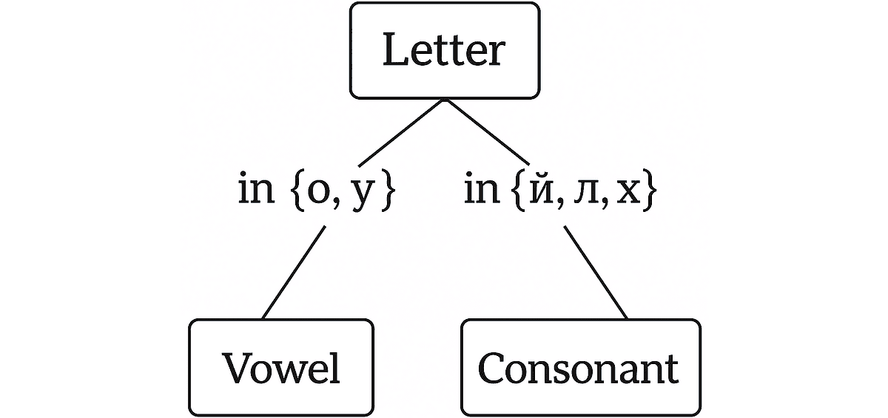
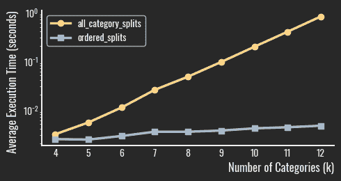

# 决策树原生处理分类数据

> 原文：[`towardsdatascience.com/decision-trees-natively-handle-categorical-data/`](https://towardsdatascience.com/decision-trees-natively-handle-categorical-data/)

<mdspan datatext="el1748975096821" class="mdspan-comment">许多人声称</mdspan>机器学习算法无法处理分类变量。但决策树（DTs）可以。分类树也不需要数值目标。下面是一个将西里尔字母的子集分类为元音和辅音的树的插图。它不使用任何数值特征——但它确实存在。

许多人也推崇均值目标编码（MTE）作为一种巧妙地将分类数据转换为数值形式的方法——而不像独热编码那样膨胀特征空间。然而，我在 TDS 上还没有看到任何关于 MTE 与决策树逻辑之间这种固有联系的提及。本文通过一个说明性的实验正好填补了这一空白。特别是：

+   我将首先简要回顾决策树如何处理分类特征。

+   我们将看到，对于高基数特征，这成为一个计算挑战。

+   我将展示均值目标编码如何自然地成为解决这个问题的方案——与标签编码不同。

+   你可以使用 GitHub 上的代码重现我的实验[GitHub](https://github.com/Arzik1987/medium/blob/main/mt_encoding/mt_encoding.ipynb)。



这个简单的决策树（决策树桩）不使用任何数值特征——但它确实存在。图像由作者在 ChatGPT-4o 的帮助下创建

> 简要说明：独热编码经常被均值目标编码的粉丝描绘得不太理想——但它并没有他们说的那么糟糕。事实上，在我们的基准实验中，它在我们评估的 32 种分类编码方法中经常排名第一。[1]

### 决策树和分类特征的诅咒

决策树学习是一个递归算法。在每次递归步骤中，它遍历所有特征，寻找最佳的分割。因此，只需检查单个递归迭代如何处理分类特征就足够了。如果你不确定这种操作如何推广到整个树的构建，请查看这里[2]。

对于一个分类特征，算法评估所有可能的将类别划分为两个非空集合的方法，并选择产生最高分割质量的那个。质量通常使用 Gini 不纯度来衡量二分类或均方误差来衡量回归——两者都越低越好。下面是它们的伪代码。

```py
# ----------  Gini impurity criterion  ----------
FUNCTION GiniImpurityForSplit(split):
    left, right = split
    total = size(left) + size(right)
    RETURN (size(left)/total)  * GiniOfGroup(left) +
           (size(right)/total) * GiniOfGroup(right)

FUNCTION GiniOfGroup(group):
    n = size(group)
    IF n == 0: RETURN 0
    ones  = count(values equal 1 in group)
    zeros = n - ones
    p1 = ones / n
    p0 = zeros / n
    RETURN 1 - (p0² + p1²)
```

```py
# ----------  Mean-squared-error criterion  ----------
FUNCTION MSECriterionForSplit(split):
    left, right = split
    total = size(left) + size(right)
    IF total == 0: RETURN 0
    RETURN (size(left)/total)  * MSEOfGroup(left) +
           (size(right)/total) * MSEOfGroup(right)

FUNCTION MSEOfGroup(group):
    n = size(group)
    IF n == 0: RETURN 0
    μ = mean(Value column of group)
    RETURN sum( (v − μ)² for each v in group ) / n
```

假设特征具有基数*k*。每个类别可以属于两个集合中的任意一个，总共有 2*ᵏ*种组合。排除两个平凡情况，即其中一个集合为空的情况，我们剩下 2*ᵏ*−2 种可行的分割。接下来，请注意，我们不在乎集合的顺序——例如{{A,B},{C}}和{{C},{A,B}}这样的分割是等价的。这将唯一组合的数量减半，最终计数为(2*ᵏ*−2)/2 次迭代。对于我们的上述玩具示例，其中*k=5*是西里尔字母，这个数字是 15。但当*k=20*时，它激增到 524,287 种组合——足以显著减慢 DT 训练。

### 均值目标编码解决了效率问题

如果可以将搜索空间从(2*ᵏ*−2)/2 减少到更易于管理的空间——而不丢失最佳分割，会怎样？实际上，这是可能的。理论上可以证明，均值目标编码可以实现这种减少[3]。具体来说，如果类别按照它们的 MTE 值排序，并且只考虑尊重这种顺序的分割，那么根据基尼不纯度进行分类或均方误差进行回归的最佳分割将包含在其中。恰好有*k-1*个这样的分割，与(2*ᵏ*−2)/2 相比，这是一个巨大的减少。下面是 MTE 的伪代码。

```py
# ----------  Mean-target encoding ----------
FUNCTION MeanTargetEncode(table):
    category_means = average(Value) for each Category in table      # Category → mean(Value)
    encoded_column = lookup(table.Category, category_means)         # replace label with mean
    RETURN encoded_column
```

### 实验

我不会重复上述主张的理论推导。相反，我设计了一个实验来实证验证它们，并了解 MTE（均值目标编码）相对于原生分区（对所有可能的分割进行穷举迭代）带来的效率提升。以下，我将解释数据生成过程和实验设置。

#### 数据

为了生成实验的合成数据，我使用了一个简单的函数来构建一个两列的数据集。第一列包含**n**个不同的分类级别，每个级别重复**m**次，总共产生**n × m**行。第二列代表目标变量，可以是二元或连续的，这取决于输入参数。下面是这个函数的伪代码。

```py
# ----------  Synthetic-dataset generator ----------
FUNCTION GenerateData(num_categories, rows_per_cat, target_type='binary'):
    total_rows = num_categories * rows_per_cat
    categories = ['Category_' + i for i in 1..num_categories]
    category_col = repeat_each(categories, rows_per_cat)

    IF target_type == 'continuous':
        target_col = random_floats(0, 1, total_rows)
    ELSE:
        target_col = random_ints(0, 1, total_rows)

    RETURN DataFrame{ 'Category': category_col,
                      'Value'   : target_col }
```

#### 实验设置

`experiment`函数接受一个基数列表和一个分割标准——根据目标类型，可以是基尼不纯度或均方误差。对于列表中的每个分类特征基数，它生成 100 个数据集，并比较两种策略：对所有可能的类别分割进行穷举评估和受 MTE（均值目标编码）信息限制的有序分割。它测量每种方法的运行时间，并检查两种方法是否产生相同的最佳分割分数。该函数返回匹配案例的数量以及平均运行时间。下面是伪代码。

```py
# ----------  Split comparison experiment ----------
FUNCTION RunExperiment(list_num_categories, splitting_criterion):
    results = []

    FOR k IN list_num_categories:
        times_all = []
        times_ord = []

        REPEAT 100 times:
            df = GenerateDataset(k, 100)

            t0 = now()
            s_all = MinScore(df, AllSplits, splitting_criterion)
            t1 = now()

            t2 = now()
            s_ord = MinScore(df, MTEOrderedSplits, splitting_criterion)
            t3 = now()

            times_all.append(t1 - t0)
            times_ord.append(t3 - t2)

            IF round(s_all,10) != round(s_ord,10):
                PRINT "Discrepancy at k=", k

        results.append({
            'k': k,
            'avg_time_all': mean(times_all),
            'avg_time_ord': mean(times_ord)
        })

    RETURN DataFrame(results)
```

#### 结果

你可以相信我的话——或者重复实验 ([GitHub](https://github.com/Arzik1987/medium/blob/main/mt_encoding/mt_encoding.ipynb))——但两种方法的最优分割分数总是匹配，正如理论预测的那样。下面的图显示了评估分割所需的时间作为类别数量的函数；纵轴是对数刻度。表示穷举评估的线条在这些坐标中呈线性，这意味着运行时间随着类别数量的增加而呈指数增长——证实了之前讨论的理论复杂性。在 12 个类别（在包含 1,200 行的数据集上）时，检查所有可能的分割需要大约一秒钟——比基于 MTE 的方法慢三个数量级，后者产生相同的最佳分割。



二元目标—基尼不纯度。图像由作者创建

### 结论

决策树可以原生地处理分类数据，但当类别计数增加时，这种能力会带来计算成本。平均目标编码提供了一种原则上的捷径——大幅减少候选分割的数量，而不影响结果。我们的实验证实了这一理论：基于 MTE 的排序找到相同的最佳分割，但速度呈指数增长。

在撰写本文时，`scikit-learn`不支持直接处理分类特征。那么你认为呢——如果你使用 MTE 预处理数据，生成的决策树是否会与原生处理分类特征的学习者构建的决策树相匹配？

### 参考文献

[1] *分类编码器的基准和分类*. 数据科学. [`towardsdatascience.com/a-benchmark-and-taxonomy-of-categorical-encoders-9b7a0dc47a8c/`](https://towardsdatascience.com/a-benchmark-and-taxonomy-of-categorical-encoders-9b7a0dc47a8c/)

[2] *从数据中挖掘规则*. 数据科学. [`towardsdatascience.com/mining-rules-from-data`](https://towardsdatascience.com/mining-rules-from-data)

[3] Hastie, Trevor, Tibshirani, Robert, and Friedman, Jerome. *统计学习元素：数据挖掘、推理与预测*. 第 2 卷. 纽约：Springer, 2009.
