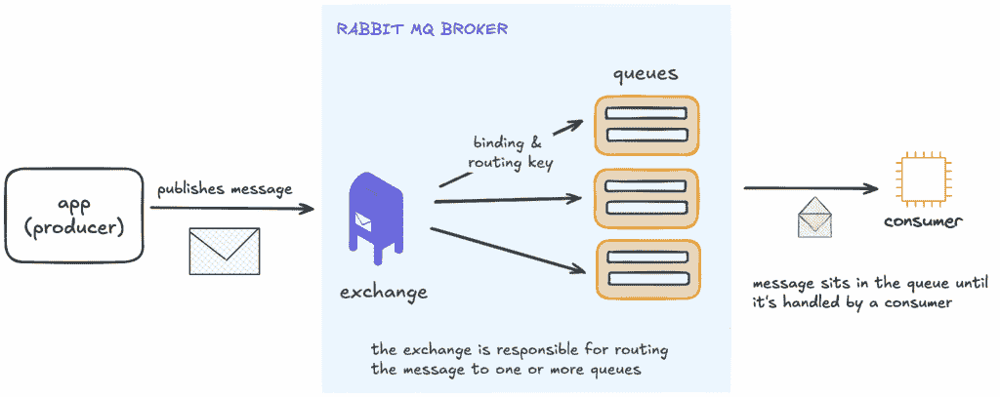
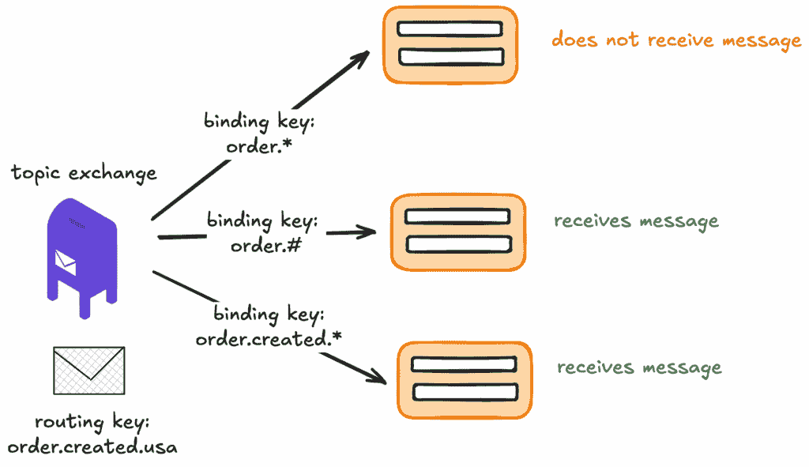
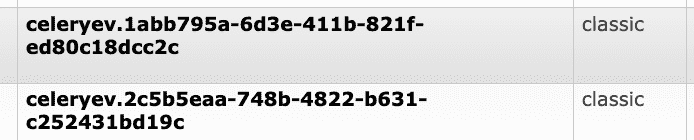

# 深入了解 RabbitMQ 与 Python 的 Celery：如何优化你的队列

> 原文：[`towardsdatascience.com/deep-dive-into-rabbitmq-pythons-celery-how-to-optimise-your-queues/`](https://towardsdatascience.com/deep-dive-into-rabbitmq-pythons-celery-how-to-optimise-your-queues/)

<mdspan datatext="el1756873996638" class="mdspan-comment">如果你是工程师</mdspan>，曾经与机器学习或大规模数据管道合作过，那么你很可能使用过某种队列系统。

队列让服务可以异步地相互通信：你发送任务，不必等待，让另一个系统在准备好时取走它。当你的任务不是即时完成时，这是非常重要的——想想长时间运行的模型训练作业、批量 ETL 管道，甚至是处理每查询需要几分钟的 LLM 请求。

我为什么要写这篇文章？我最近将生产队列设置迁移到了 RabbitMQ，遇到了一堆错误，并发现有关复杂部分的文档很少。经过一番尝试和错误，我认为分享我所学的东西是值得的。

希望你会觉得这个有用！

## 快速入门：队列与请求-响应模型

微服务通常以两种方式通信——经典的请求-响应模型，或更灵活的基于队列的模型。

想象一下订购披萨。在 **请求-响应模型** 中，你告诉服务员你的订单，然后等待。他消失了，三十分钟后你的披萨才出现——但你一直处于黑暗中。

在 **基于队列的模型** 中，服务员重复你的订单，给你一个号码，并将其放入厨房的队列。现在你知道它正在处理，你可以自由地做其他事情，直到厨师处理它。

这就是区别：请求-响应模式会一直阻塞你，直到工作完成，而队列会立即确认并允许工作在后台进行。

## 什么是 RabbitMQ？

RabbitMQ 是一个流行的开源消息代理，确保消息从生产者（发送者）可靠地传递到消费者（接收者）。首次发布于 2007 年，用 Erlang 编写，实现了 AMQP（高级消息队列协议），这是一个用于结构化、路由和确认消息的开放标准。

> 想象它就像分布式系统中的邮局：应用程序投递消息，RabbitMQ 将它们分类到队列中，消费者在准备好时取走它们。

在 Python 世界中，Celery + RabbitMQ 是一种常见的搭配：RabbitMQ 作为任务代理，而 Celery 工作者在后台执行它们。

在容器化设置中，RabbitMQ 通常在自己的容器中运行，而 Celery 工作者在独立的容器中运行，你可以独立扩展它们。

### 高级概述

你的应用程序想要异步运行一些工作。由于这项任务可能需要一段时间，你不想让应用程序空闲等待。相反，它创建一个描述任务的消息并将其发送到 RabbitMQ。

1.  **交换**：它存在于 RabbitMQ 中。它不存储消息，只是根据你设置的规则（路由键和绑定）决定每条消息应该去哪里。

    生产者向交换发布消息，该交换充当路由中介。

1.  **队列**：它们就像邮箱。一旦交换决定消息应该发送到哪个队列，它就会在那里等待，直到被取走。

1.  **消费者**：从队列中读取和处理消息的服务。在 Celery 设置中，Celery 工作进程是消费者——它从队列中拉取任务并执行实际工作。

Rabbit MQ 架构的高级概述。由作者绘制。

一旦消息被路由到队列中，RabbitMQ 代理**推送**它到消费者（如果有的话）通过 TCP 连接。

## Rabbit MQ 的核心组件

### 1. 路由和绑定键

路由键和绑定键协同工作，以决定消息最终会去哪里。

+   **路由键**是由生产者附加到消息上的。

+   **绑定键**是队列在连接（绑定）到交换时声明的规则。

    绑定定义了交换和队列之间的链接。

当消息发送时，交换会查看消息的路由键。如果该路由键与队列的绑定键匹配，则消息将被投递到该队列。

> 消息只能有一个**路由键**。
> 
> 一个队列可以有**一个或多个**绑定键，这意味着它可以监听几个不同的路由键或模式。

### 2. 交换

RabbitMQ 中的交换就像一个**交通控制器**。它接收消息，不存储消息，其主要任务是决定消息应该发送到哪个队列，基于规则。

*如果消息的路由键与任何队列的绑定键都不匹配，它将不会被投递。*

有几种类型的交换，每种都有其自己的路由风格。

#### 2a) 直接交换

将直接交换想象成精确地址投递。交换会寻找与路由键完全匹配的绑定键的队列。

+   如果只有一个队列匹配，则消息只会被发送到那里（1:1）。

+   如果多个队列有相同的绑定键，则消息将被复制到所有这些队列（1:多）。

#### 2b) 扇出交换

**扇出交换**就像是通过扩音器大声喊叫。

每条消息都会复制到与交换绑定的**所有**队列。路由键被忽略，它总是**1:多**广播。

当同一个消息需要发送到可能以不同方式处理相同消息的一个或多个队列时，扇出交换非常有用。

#### 2c) 主题交换

主题交换就像是一个带有类别的订阅系统。

每条消息都有一个路由键，例如 `"order.completed"`。队列可以订阅模式，如 `"order.*"`。这意味着每当有与订单相关的消息时，它将被投递到已订阅该类别的任何队列。

根据模式，一条消息可能最终只进入一个队列或同时进入多个队列。

绑定键有两个重要的特殊情况：

+   `*`（星号）匹配路由键中的**确切一个单词**。

+   `#`（散列）匹配**零个或多个单词**。

让我们通过示例来说明，使语法更加直观。

#### 2d）头部交换机

头部交换机就像按标签而不是地址对邮件进行分类。

与查看路由键（如 `"order.completed"`）不同，交换机会检查消息的**头部**：这些是作为元数据附加的关键值对。例如：

+   `x-match: all, priority: high, type: email` → 队列将只接收到具有**同时** `priority=high` 和 `type=email` 的消息。

+   `x-match: any, region: us, region: eu` → 队列将接收到满足**至少一个**条件的消息（`region=us` 或 `region=eu`）。

`x-match` 字段决定了是否必须匹配所有规则或只需匹配一条规则。

由于多个队列可以各自声明自己的头部规则，一条消息最终可能只进入一个队列（1:1）或同时进入多个队列（1:many）。

头部交换机在实践中较少使用，但当路由依赖于更复杂的业务逻辑时很有用。例如，你可能只想在 `customer_tier=premium`、`message_format=json` 或 `region=apac` 的情况下投递消息。

#### 2e）死信交换机

死信交换机是未投递消息的安全网。

### 3. 推送投递模型

这意味着一旦消息进入队列，代理就会将其推送到已订阅并准备好的消费者。**消费者不会请求消息**，而是简单地监听队列。

> 这种推送方法非常适合低延迟投递——消息尽可能快地到达消费者。

## RabbitMQ 中的有用特性

RabbitMQ 的架构允许你根据工作负载调整消息流。以下是一些有用的模式。

### 工作队列——竞争消费者模式

你可以将任务发布到**一个队列**，并且**多个消费者**（例如 celery 工作者）都会监听这个队列。代理将**每条消息精确地发送给一个消费者**，因此工作者“竞争”工作。这隐含地转化为简单的负载均衡。

如果你使用 celery，你将希望保持 `worker_prefetch_multiplier=1`。这意味着工作者一次只会获取一条消息，避免慢速工作者囤积任务。

### 发布/订阅模式

**多个队列**绑定到交换机，并且每个队列都会收到消息的**副本**（fanout 或 topic 交换机）。由于每个队列都收到自己的消息副本，因此不同的消费者可以以不同的方式处理相同的事件。

### 显式确认

RabbitMQ 使用显式确认（**ACKs**）来保证可靠投递。ACK 是消费者在成功处理消息后发送给代理的确认。

当消费者发送 ACK 时，代理将该消息从队列中删除。如果消费者**NACK**或在 ACK 之前死亡，RabbitMQ 可以**重新投递**（重新入队）该消息或将它路由到死信队列以供检查或重试。

然而，在使用 Celery 时有一个重要的细微差别。Celery 默认会发送确认，但它发送得**很早**——在工作者接收到任务后立即发送，在它实际执行之前。这种行为（`acks_late=False`，这是默认值）意味着如果工作者在运行任务中途崩溃，代理已经被告知消息已被处理，不会重新投递它。

### 优先级队列

RabbitMQ 自带优先级队列功能，允许高优先级消息跳过队列。在底层，代理为每个在队列上定义的优先级级别创建一个**内部子队列**。

例如，如果你配置了五个优先级级别，RabbitMQ 将维护五个内部子队列。在每个级别内，消息仍然按**FIFO 顺序**消费，但消费者准备好时，RabbitMQ 将始终尝试首先从高优先级子队列投递消息。

这样做如果有很多优先级级别，就会隐含地增加开销。[Rabbit MQ 的文档指出，尽管支持 1 到 255 之间的优先级，但**1 到 5 之间的值被高度推荐**。](https://www.rabbitmq.com/docs/priority)

### 消息 TTL 与计划投递

消息 TTL（按消息或按队列）自动过期过时消息；并且当需要计划执行时，通过插件（例如，延迟消息交换）提供延迟投递。

## 如何优化你的 Rabbit MQ 和 Celery 配置

当你使用 RabbitMQ 部署 Celery 时，你会在 RabbitMQ 管理仪表板上注意到一些“神秘”的队列和交换。这些并不是错误——它们是 Celery 内部的一部分。

经过几轮痛苦的试错后，我了解到 Celery 在底层真正如何使用 RabbitMQ，以及如何正确调整它。

### Kombu

Celery 依赖于 Kombu，一个 Python 消息框架。Kombu 抽象了低级别的 AMQP 操作，为 Celery 提供了一个高级 API 来：

+   声明队列和交换

+   发布消息（任务）

+   在工作者中消费消息

它还处理序列化（JSON、Pickle、YAML 或自定义格式），以便任务可以在网络中编码和解码。

### Celery 事件和`celeryev`交换

作者截图展示了 celeryev 队列在 RabbitMQ 管理仪表板上的显示方式

Celery 包含一个跟踪工作者和任务状态的事件系统。内部，事件被发布到一个特殊的**主题交换，称为`celeryev`**。

有两种这样的事件类型：

1.  **工作者事件**例如`worker.online`、`worker.heartbeat`、`worker.offline`始终开启，并且是轻量级的活力信号。

1.  **任务事件**，例如`task-received`、`task-started`、`task-succeeded`、`task-failed`，默认情况下是禁用的，除非添加了`-E`标志。

您可以对这两种类型的事件进行精细控制。您可以在关闭 gossip（下面将详细介绍）的同时打开任务事件。

### Gossip

Gossip 是工作者之间“聊天”关于集群状态的 Celery 机制——谁活着，谁刚刚加入，谁退出了，偶尔还会选举一个领导者以进行协调。这对于调试或临时的集群协调很有用。

默认情况下，Gossip 是启用的。当工作者启动时：

+   它为自己创建了一个**专用、自动删除的队列**。

+   该队列绑定到**`celeryev` 主题交换机**，路由键模式为`worker.#`。

因为每个工作者都订阅了每个`worker.*`事件，随着集群的扩展，流量会迅速增长。

> 有 N 个工作者时，每个工作者都会发布自己的心跳，RabbitMQ 会将该消息扇出到其他 N-1 个 gossip 队列。实际上，您得到了一个 N × (N-1)的扇出模式。

在我的 100 个工作者的配置中，这意味着单个心跳被复制了 99 次。在部署期间——当工作者启动和关闭，产生一系列加入、离开和心跳事件时——模式失控。**`celeryev` 交换机突然处理每秒 7-8k 条消息，将 RabbitMQ 推过其内存水位线，使集群处于降级状态**。

当超过此内存限制时，RabbitMQ 会阻止发布者直到使用量下降。一旦内存降至阈值以下，RabbitMQ 将恢复正常操作。

然而，这意味着在内存峰值期间，代理变得不可用——实际上导致停机。您不希望在生产中这样做！

解决方案是禁用 Gossip，这样工作者就不会绑定到`worker.#`。您可以在启动工作者的 docker compose 中这样做。

`celery -A myapp worker --without-gossip`

### Mingle

Mingle 是工作者启动步骤，其中新工作者联系其他工作者以同步状态——例如撤销的任务和逻辑时钟。这仅在工作者启动时发生一次。如果您不需要这种协调，您也可以使用`--without-mingle`禁用它。

### 偶尔的连接断开

在生产中，Celery 和 RabbitMQ 之间的连接有时会断开——例如，由于短暂的网络波动。如果您有监控，您可能会将这些视为瞬态错误。

> 好消息是，这些断开通常**是可恢复的**。Celery 依赖于 Kombu，它包括**自动连接重试逻辑**。当连接失败时，工作者将尝试重新连接并继续消费任务。

只要您的队列配置正确，消息**不会**丢失：

+   `durable=True`（队列在代理重启后存活）

+   `delivery_mode=2`（持久消息）

+   消费者发送显式的 ACK 以确认成功处理

如果在任务被确认之前连接断开，RabbitMQ 将在工作者重新连接后安全地重新入队该任务以进行交付。

一旦连接重新建立，工作者将继续正常操作。在实践中，偶尔的断开是可以接受的，只要它们保持不频繁，并且队列深度不会累积。

## 结束语

好了，朋友们，这些都是我在生产环境中运行 RabbitMQ + Celery 时学到的一些关键经验。希望这次深入探讨能帮助你更好地理解底层的工作原理。如果你有更多建议，我非常乐意在评论中听到它们，并且确实会联系你！！
