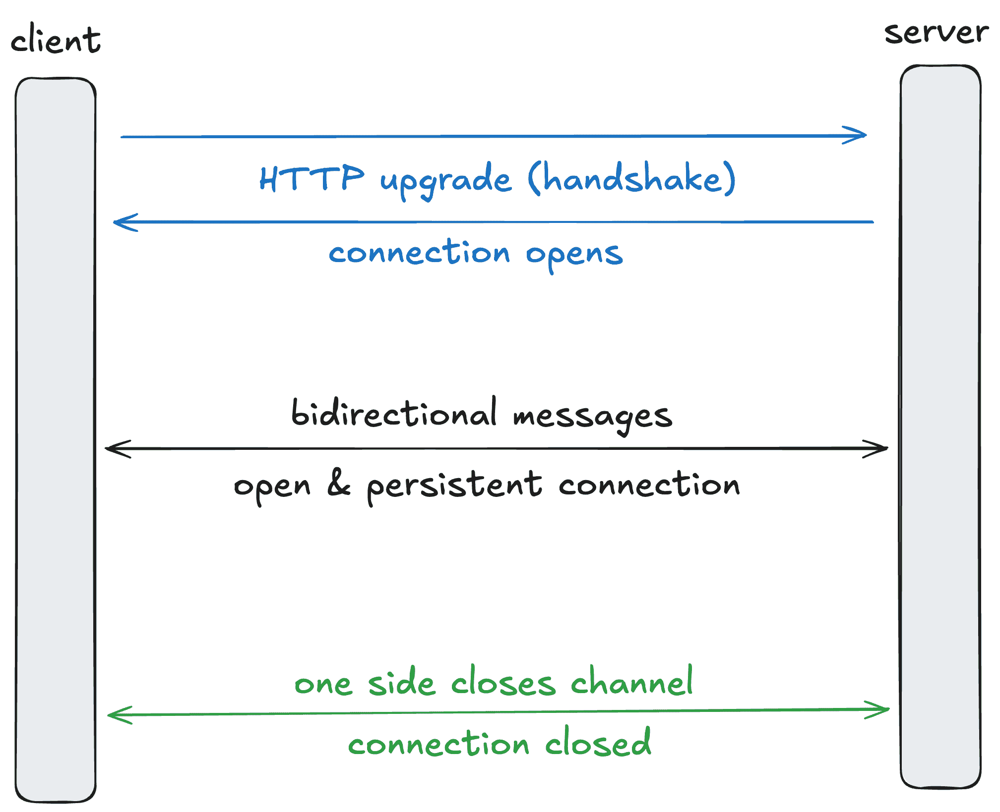
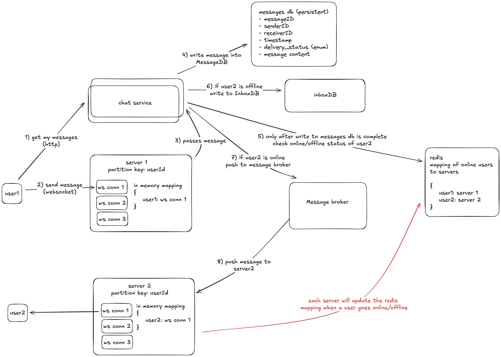

# 深入探讨 WebSockets 及其在客户端-服务器通信中的作用

> 原文：[`towardsdatascience.com/deep-dive-into-websockets-and-their-role-in-client-server-communication-aac387e10cb6/`](https://towardsdatascience.com/deep-dive-into-websockets-and-their-role-in-client-server-communication-aac387e10cb6/)


图片由 [Kelly](https://unsplash.com/@kellysikkema) 提供，来自 [Unsplash](https://unsplash.com/)

实时通信无处不在——实时聊天机器人、数据流或即时消息。WebSockets 是实现这一功能的强大工具，但何时应该使用它们？它们是如何工作的，以及它们与传统 HTTP 请求有何不同？

本文灵感来源于最近的一次系统设计面试——“设计一个实时消息应用”——我在其中遇到了一些概念。现在我已经深入研究了这些概念，我想与你分享我所学到的，以便你可以避免犯同样的错误。

在本文中，我们将探讨 WebSockets 如何融入客户端-服务器通信的更大图景。我们将讨论它们擅长什么，它们在哪里不足，以及——是的——如何设计一个实时消息应用。

## 客户端-服务器通信

在本质上，客户端-服务器通信是两个实体之间数据交换的过程：客户端和服务器。

客户端请求数据，服务器处理这些请求并返回响应。这些角色并非互斥——服务可以根据上下文同时充当客户端和服务器。

在深入探讨 WebSockets 的细节之前，让我们退一步，探讨客户端-服务器通信方法的更大图景。

### 1. 短轮询

短轮询是最简单、最熟悉的方法。

客户端会定期（例如，每隔几秒）向服务器发送 HTTP 请求以检查新数据。每个请求都是独立的且单向的（客户端 → 服务器）。

这种方法易于设置，但如果服务器很少提供新鲜数据，可能会浪费资源。适用于对时间敏感度较低的应用，偶尔轮询就足够了。

### 2. 长轮询

长轮询是短轮询的改进，旨在减少不必要的请求数量。服务器不会立即响应用户请求，而是**保持连接打开**，直到有新数据可用。一旦服务器有数据，它就会发送响应，客户端立即建立新的连接。

长轮询也是**无状态的**和**单向的**（客户端 → 服务器）。

一个典型的例子是打车应用，客户端等待匹配或预订更新。

### 3. Webhooks

Webhooks 通过使服务器成为发起者来改变规则。每当发生特定事件时，服务器都会向客户端定义的端点发送 **HTTP POST** 请求。

每个请求都是**独立的**，且不依赖于持久连接。Webhooks 也是**单向的**（服务器到客户端）。

Webhooks 被广泛用于异步通知，尤其是在与第三方服务集成时。例如，支付系统使用 webhooks 在交易状态改变时通知客户端。

### 4. 服务器发送事件（SSE）

SSE 是一种**基于 HTTP 的本地事件流协议**，允许服务器通过单个、**持久连接**向客户端推送实时更新。

SSE 使用`EventSource` API 进行工作，这使得它在现代 Web 应用中实现起来很简单。它是**单向的**（从服务器到客户端），非常适合客户端只需要接收更新的情况。

SSE 非常适合像交易平台或实时体育更新这样的应用，在这些应用中，服务器实时推送像股价或比分这样的数据。在这些情况下，客户端不需要向服务器发送数据。

### 但双向通信怎么办？

所有上述方法都关注单向流。对于真正的双向、实时交换，我们需要不同的方法。这正是 WebSocket 发光发热的地方。

让我们深入了解。

## WebSocket 是如何工作的？

WebSocket 允许**实时、双向通信**，使它们非常适合像聊天应用、实时通知和在线游戏这样的应用。与传统的 HTTP 请求-响应模型不同，WebSocket 创建了一个**持久**的连接，客户端和服务器都可以独立发送消息，而无需等待请求。

> 连接开始时是一个常规的 HTTP 请求，并通过握手升级到 WebSocket 连接。

一旦建立，它使用单个 TCP 连接，在相同的端口上运行 HTTP（80 和 443）。通过 WebSocket 发送的消息小而轻量，这使得它们对于低延迟、高交互性的用例非常高效。

WebSocket 连接遵循特定的 URI 格式：`ws://`用于常规连接，`wss://`用于安全、加密的连接。

**什么是握手？**

握手是两个系统之间**初始化连接**的过程。对于 WebSocket，它从客户端发起一个 HTTP GET 请求，请求协议升级。这确保在过渡到持久的 WebSocket 连接之前与 HTTP 基础设施兼容。

1.  **客户端发送请求，带有如下头信息：**

```py
GET /chat HTTP/1.1
Host: server.example.com
Upgrade: websocket
Connection: Upgrade
Sec-WebSocket-Key: dGhlIHNhbXBsZSBub25jZQ==
Origin: http://example.com
Sec-WebSocket-Protocol: chat, superchat
Sec-WebSocket-Version: 13
```

+   `Upgrade` – 表示请求切换协议

+   `Sec-WebSocket-Key` – 用于握手验证的随机生成、Base64 编码的字符串

+   `Sec-WebSocket-Protocol`（可选）- 列出客户端支持的子协议，允许服务器选择一个。

**2. 服务器响应请求**

如果服务器支持 WebSocket 并同意升级，它将以**101 Switching Protocols**状态响应。示例头信息：

```py
HTTP/1.1 101 Switching Protocols
Upgrade: websocket
Connection: Upgrade
Sec-WebSocket-Accept: s3pPLMBiTxaQ9kYGzzhZRbK+xOo=
Sec-WebSocket-Protocol: chat
```

+   `Sec-WebSocket-Accept` – 客户端`Sec-WebSocket-Key`的 Base64 编码哈希值和一个 GUID。这确保握手是安全和有效的。

**3. 握手验证**

使用 `101 Switching Protocols` 响应，WebSocket 连接成功建立，客户端和服务器可以开始实时交换消息。

此连接将保持开启状态，直到任一方明确关闭。

如果返回的不是 `101` 代码，客户端必须结束连接，WebSocket 握手将失败。

这里是一个总结。



WebSocket 概述（由我绘制）

## WebSocket 用例

我们已经讨论了 WebSocket 如何实现实时、双向通信，但这仍然是一个相当抽象的概念。让我们通过一些实际例子来具体化。

WebSocket 在实时协作工具和聊天应用中得到了广泛使用，例如 Excalidraw、Telegram、WhatsApp、Google Docs、Google Maps 以及 YouTube 或 TikTok 直播期间的实时聊天部分。

## 权衡

### 1. 如果连接终止，有回退策略

如果由于网络问题、服务器崩溃或其他故障导致连接终止，WebSocket 不会自动恢复。客户端必须显式检测断开连接并尝试重新建立连接。

**长轮询**通常在 WebSocket 连接尝试重新建立时作为备份使用。

### 2. 不适用于流式传输音频和视频数据

WebSocket 消息设计用于发送**小型、结构化的消息**。要流式传输大型媒体数据，WebRTC 等技术更适合这些场景。

### 3. WebSocket 是有状态的，因此横向扩展不是简单的事情

WebSockets 是**有状态的**，这意味着服务器必须为每个客户端维护一个活跃的连接。这使得与无状态的 HTTP 相比，横向扩展更加复杂，在无状态的 HTTP 中，任何服务器都可以处理客户端请求而不需要维护持久状态。

你需要额外的 pub/sub 机制层来实现这一点。

## 设计实时消息应用

现在让我们看看这是如何在系统设计中应用的。我已经涵盖了简单（不可扩展）解决方案和横向扩展解决方案。



横向扩展的实时 1-1 聊天端到端流程（由我绘制）

### 不可扩展的单服务器应用：两个用户如何实现实时聊天？

1.  所有用户都通过 WebSocket 连接到一个服务器。服务器保存一个内存映射，`userID : WebSocket conn 1`

1.  user1 通过其 WebSocket 连接向服务器发送消息。

1.  服务器将消息写入 MessageDB（首先进行持久化）。

1.  服务器随后在其内存映射中查找 `user2 : WebSocket conn 2`。如果用户 2 在线，它将实时传递消息。

1.  如果用户 2 不在线，服务器将消息写入 InboxDB（未投递消息的存储库）。当用户 2 返回在线状态时，服务器从 InboxDB 中检索所有离线消息。

### ***横向扩展系统：两个用户如何实现实时聊天？***

单个服务器只能处理这么多并发 WebSocket 连接。为了服务更多用户，您需要水平扩展您的 WebSocket 连接。

> 关键挑战：如果用户 1 连接到 server1 但用户 2 连接到 server2，系统如何知道将消息发送到何处？

Redis 可以用作全局数据存储，映射`userID : serverID`以表示活跃的 WebSocket 会话。每个服务器在用户连接（上线）或断开连接（下线）时更新 Redis。

例如：

+   user1 连接到 server1。server1 的内存映射：`user1 : WebSocket 连接` server1 还写入 Redis：`user1 : server1`

+   user2 连接到 server2。server2 的内存映射：`user2 : WebSocket 连接` server2 还写入 Redis：`user2 : server2`

**端到端聊天流程：用户 1 向用户 2 发送消息**

1.  user1 通过 server1 上的 WebSocket 发送消息。

1.  server1 将消息传递给聊天服务。

1.  聊天服务首先将消息写入消息数据库（MessageDB）以实现持久化。

1.  聊天服务随后检查 Redis 以获取用户 2 的在线/离线状态。

1.  **如果用户 2 在线**，聊天服务将消息发布到消息代理，并标记为："user2: server2"。

1.  代理然后将消息路由到 server2。

1.  server2 查找其本地内存映射以找到用户 2 的 WebSocket 连接，并通过该 WebSocket 实时推送消息。

1.  **如果用户 2 离线（Redis 中没有条目）**，聊天服务将消息写入收件箱数据库（InboxDB）。当用户 2 返回在线状态时，聊天服务将检索所有未交付的消息。

1.  每当打开或关闭一个新的 WebSocket 连接时，服务器都会更新 Redis。

1.  当用户首次加载应用或打开聊天时，聊天服务从消息数据库（MessageDB）获取历史消息（例如，过去 10 天的消息）。缓存层可以减少重复的数据库查询。

### 一些重要的设计考虑因素：

1.  **首先持久化** 所有消息在发送之前都先存储到数据库中。如果 WebSocket 推送失败，消息仍然安全地存储在数据库中。

1.  **Redis** 仅存储**活跃**连接以最小化开销。可以添加副本以防止单点故障。

1.  收件箱数据库有助于干净地处理离线情况。

1.  **聊天服务抽象** WebSocket 服务器处理实时连接和路由。聊天服务层处理 HTTP 请求和所有数据库写入。这种关注点的分离使得扩展或演进每个部分变得更加容易。

1.  **确保消息按顺序交付** 传统的“实时推送”工作流程可能会有网络变化，导致消息顺序混乱。许多消息代理也不**保证**严格的顺序。为了处理这种情况，每个消息在创建时都会分配一个时间戳。即使消息顺序混乱，客户端也可以根据时间戳重新排序它们。

1.  **负载均衡器** L4 负载均衡器（TCP）用于粘性 WebSocket 连接。L7 负载均衡器（HTTP）用于常规请求（CRUD、登录等）。

## 总结

就到这里吧！我们还有很多可以探索的内容，但我希望这已经为你提供了一个坚实的起点。欢迎在下面的评论中提出你的问题 :)

我经常撰写关于 Python、软件开发以及我构建的项目的内容，所以请关注我，以免错过。我们下篇文章再见。
