# 深度强化学习：从 0 到 100

> 原文：[`towardsdatascience.com/deep-reinforcement-learning-for-dummies/`](https://towardsdatascience.com/deep-reinforcement-learning-for-dummies/)

<mdspan datatext="el1761635988548" class="mdspan-comment">你是否想过</mdspan>如何教机器人降落无人机而不需要为每一个动作编程？这正是我着手探索的事情。我花了几周时间构建了一个游戏，在这个游戏中，一个虚拟无人机必须找出如何降落在平台上——不是通过遵循预先编程的指令，而是通过从试错中学习，就像你学习骑自行车一样。

这就是**强化学习（RL）**，它与其他机器学习方法有根本的不同。你不需要向 AI 展示成千上万次“正确”降落的例子，而是给它反馈：“嘿，那还不错，但也许下次可以更温柔一些？”或者“哎呀，你撞了——可能下次不要这么做。”通过无数次的尝试，AI 找出什么有效，什么无效。

在这篇文章中，我记录了我从强化学习基础到构建一个（大部分！）教无人机降落的实际系统的旅程。你会看到成功、失败以及我必须调试的所有奇怪行为。

## 1. 强化学习：概述

许多想法都可以与巴甫洛夫的狗和斯金纳的老鼠实验联系起来。这个想法是，当受试者做你希望它做的事情时，你给它一个‘*奖励*’（正强化），而当它做坏事时，你给它一个‘*惩罚*’（负强化）。通过许多重复尝试，受试者从这种反馈中学习，逐渐发现哪些行为会导致成功——这就像斯金纳的老鼠学习哪些杠杆按压会产生食物奖励一样。

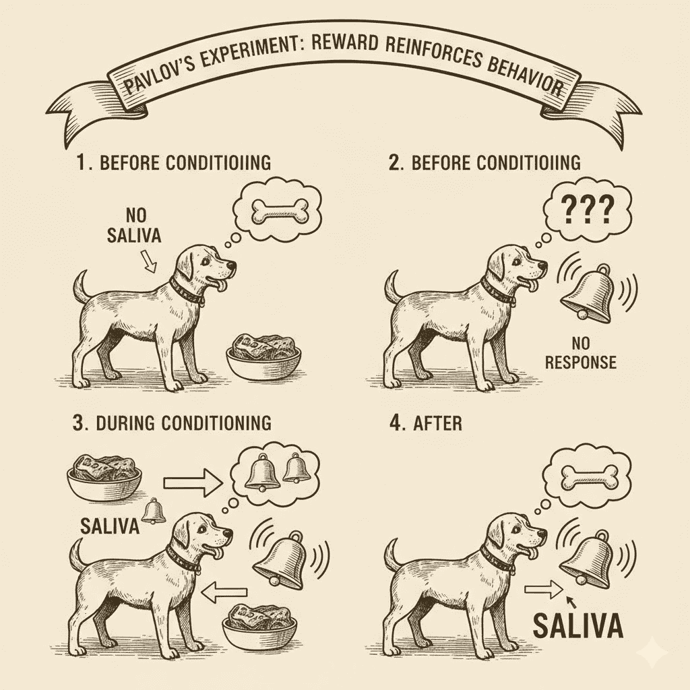

图 1. 巴甫洛夫的经典条件反射实验（由谷歌的 Gemini 生成的 AI 图像）

同样地，我们希望有一个系统可以学习做事情（或任务），以便它可以最大化奖励并最小化惩罚。注意这个关于最大化奖励的事实，它将在后面出现。

### 1.1 核心概念

当谈论可以在计算机上编程实现的系统时，最佳实践是为可以抽象化的想法编写清晰的定义。在人工智能（特别是强化学习）的研究中，核心思想可以简化为以下内容：

1.  **代理（或行动者）**：这是我们上一节中的*受试者*。这可以是狗、试图在大型工厂中导航的机器人、视频游戏中的[NPC](https://en.wikipedia.org/wiki/Non-player_character)等。

1.  **环境（或世界）**：这可以是一个地方、一个有约束的模拟、视频游戏的虚拟游戏世界等。我想象它就像，“一个盒子，无论是真实的还是虚拟的，代理的整个生活都被限制在这个盒子内；它只知道盒子内发生的事情。我们，作为统治者，可以改变这个盒子，而代理会认为上帝正在对其世界施加意志。”

1.  **政策**：就像在政府、公司以及许多类似的实体中一样，‘*政策*’决定了“在给定某种情况下应该采取哪些行动”。

1.  **状态**：这是代理“看到”或“知道”的关于其当前情况的信息。把它想象成代理在任何给定时刻现实生活的快照——就像你开车时看到交通灯的颜色、你的速度和到交叉口的距离。

1.  **行动**：现在我们的代理能够“看到”其环境中的事物，它可能想要对其状态做出一些改变。也许它刚刚从漫长的夜晚中醒来，现在它想要喝一杯咖啡。在这种情况下，它首先要做的事情是 **起床**。这是代理为了实现其目标（即，喝一些咖啡！）而采取的行动。

1.  **奖励**：每当演员执行一个动作（出于自愿），世界中的某些东西可能会发生变化。例如，我们的代理从床上起来，开始走向厨房，但因为它走路很差，所以绊倒了并摔倒了。在这种情况下，上帝（我们）因为它走路差而惩罚它（负面奖励）。但是然后代理到达厨房并拿到了咖啡，所以上帝（我们）用一块饼干（正面奖励）奖励它。

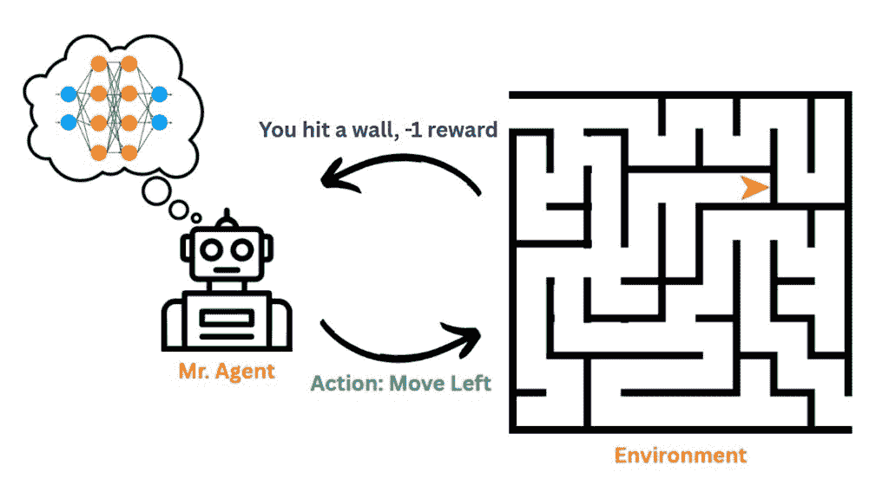

图 2 理论 RL 系统的插图

如你所想，这些 **关键组件** 中的大多数都需要根据我们希望代理解决的特定任务/问题进行定制。

## 2. 健身房

现在我们已经了解了基础知识，你可能想知道：**我们实际上是如何构建这些系统的？**让我向你展示我构建的游戏。

对于这篇帖子，我编写了一个专用的视频游戏，任何人都可以访问并使用它来训练自己的机器学习代理来玩游戏。

完整的代码仓库可以在[GitHub](https://www.github.com/vedant-jumle/reinforcement-learning-101)上找到（请星标此项目）。我打算使用这个仓库来存放更多游戏和模拟代码，以及我将在下一篇关于强化学习（RL）的帖子中实施的高级技术。

### 无人机配送

无人机配送游戏的目标是飞一个无人机（可能包含配送物品）到平台上。为了赢得游戏，我们必须着陆。为了着陆，我们必须满足以下标准：

1.  在着陆平台上方

1.  慢一点

1.  保持直立（倒飞下来更像是坠毁而不是着陆）

所有关于如何运行游戏的详细信息都可以在 GitHub 仓库中找到。

游戏看起来是这样的

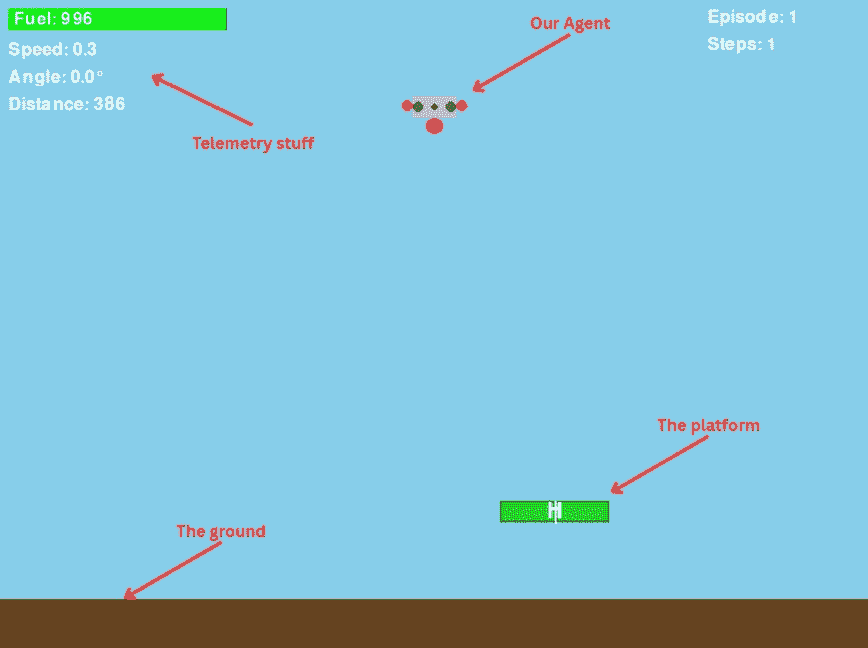

图 3：我为这个项目制作的游戏的截图

如果无人机飞出屏幕或接触地面，它将被视为一个‘*碰撞*’案例，从而导致失败。

### 状态描述

无人机观察 15 个连续值，完全描述其情况：

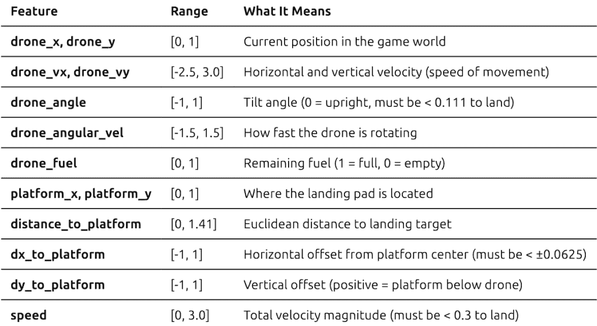

**着陆成功标准**：无人机必须同时达到：

1.  水平对齐：在平台范围内（|dx| < 0.0625）

1.  安全接近速度：小于 0.3

1.  水平方向：倾斜小于 20°（|角度| < 0.111）

1.  正确的飞行高度：无人机底部接触平台顶部

这就像平行停车——你需要正确的位置，正确的角度，并且移动得足够慢，以免发生碰撞！

### 如何设计一个策略？

设计策略有许多方法。它可以是基于贝叶斯（在信念上维持概率分布），它可以是一个简单的离散状态的查找表，一个手工编写的规则系统（“如果距离 < 10，则刹车”），一个[决策树](https://en.wikipedia.org/wiki/Decision_tree)，或者——正如我们将要探索的——一个[神经网络](https://en.wikipedia.org/wiki/Neural_network_(machine_learning))，它通过梯度下降学习从状态到动作的映射。

实际上，我们希望有一种方法，它接受上述**状态**，使用该状态进行一些计算，并返回应该执行的操作。

### 深度学习来构建策略？

那么我们如何设计一个能够处理连续状态（如精确的无人机位置）并学习复杂行为的策略呢？**这正是神经网络发挥作用的地方**。

在神经网络（或深度学习）的情况下，通常最好处理动作概率，即**“给定当前状态，什么动作最有可能是最优的？”**。因此，我们可以定义一个神经网络，它将状态作为‘向量’或‘向量集合’作为输入。这个向量或向量集合必须从观察到的状态构建。对于我们这个送货无人机游戏，状态向量是：

**状态向量（来自我们的 2D 无人机游戏）**

无人机观察其绝对位置、速度、方向、燃料、平台位置和派生指标。我们的连续状态是：

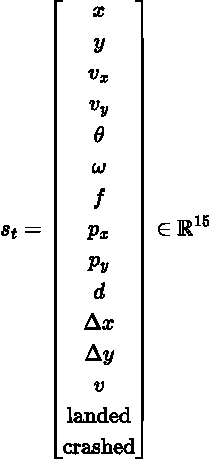

其中每个组件代表：

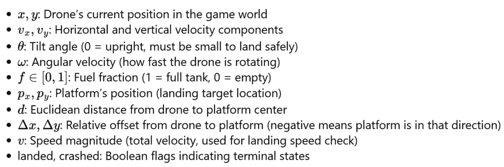

所有组件都归一化到大约[0,1]或[-1,1]的范围，以稳定神经网络训练。

**动作空间（三个独立的二元推进器）**

我们不是处理离散的动作组合，而是独立处理每个推进器：

+   主推进器（向上推力）

+   左推进器（顺时针旋转）

+   右推进器（逆时针旋转）

每个动作都是从伯努利分布中抽取的，每个时间步长给我们 3 个独立的二元决策。

**神经网络策略（具有伯努利采样的概率性）**

令 fθ 为经过 sigmoid 激活后的网络输出。策略使用独立的伯努利分布：

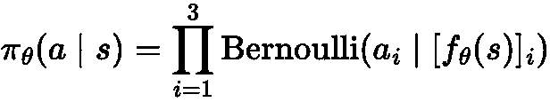

最小 Python 草稿（来自我们的实现）

```py
# build state vector from DroneState
s = np.array([
    state.drone_x, state.drone_y,
    state.drone_vx, state.drone_vy,
    state.drone_angle, state.drone_angular_vel,
    state.drone_fuel,
    state.platform_x, state.platform_y,
    state.distance_to_platform,
    state.dx_to_platform, state.dy_to_platform,
    state.speed,
    float(state.landed), float(state.crashed)
])

# network outputs probabilities for each thruster (after sigmoid)
action_probs = policy(torch.tensor(s, dtype=torch.float32))  # shape: (3,)

# sample each thruster independently from Bernoulli
dist = Bernoulli(probs=action_probs)
action = dist.sample()  # shape: (3,), e.g., [1, 0, 1] means main+right thrusters
```

这显示了我们将游戏的物理观察映射到 15 维归一化状态向量，并为每个推进器产生独立的二元决策。

#### 代码设置（第一部分）：导入和游戏套接字设置

我们首先希望我们的游戏套接字监听器开始工作。为此，您可以导航到我的仓库中的 delivery_drone 目录并运行以下命令：

```py
pip install -r requirements.txt # run this once for setting up the required modules
python socket_server.py --render human --port 5555 --num-games 1 # run this whenever you need to run the game in socket mode
```

**注意**：您需要 PyTorch 来运行代码。请确保您事先已设置好

```py
import os
import torch
import torch.nn as nn
import math
import numpy as np

from torch.distributions import Bernoulli

# Import the game's socket client
from delivery_drone.game.socket_client import DroneGameClient, DroneState

# setup the client and connect to the server
client = DroneGameClient()
client.connect()
```

### 如何设计奖励函数？

**那么，什么使一个好的奖励函数？** 这可以说是强化学习中最困难的部分（而且我在调试上花了很多时间 🫠）。

奖励函数是任何强化学习实现的**灵魂**（而且相信我，搞错了这一点，你的智能体将会做出最奇怪的事情）。在理论上，它应该定义应该学习什么“*好*”行为以及不应该学习什么“*坏*”行为。我们的智能体采取的每个动作都由该动作展示的每个行为特征的累积奖励来表征。例如，如果你想无人机平稳着陆，你可以为接近平台和缓慢移动给予正奖励，同时惩罚坠毁或耗尽燃料——智能体随后会学习在一段时间内最大化所有这些奖励的总和。

**优势：衡量有效奖励的更好方式**

当训练我们的策略时，我们不仅想知道动作是否被奖励——我们想知道它是否比通常更好。这是**优势**背后的直觉。

优势告诉我们：“这个动作比我们通常预期的更好还是更差？”

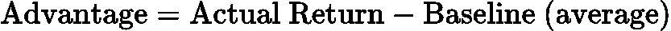

在我们的实现中，我们：

1.  收集多个剧集并计算它们的回报（总折现奖励）

1.  计算所有剧集的平均回报作为**基准**

1.  计算每个时间步的**优势**= 返回值 – 基准值

1.  将优势归一化，使其均值为 0 和标准差为 1（以稳定训练）

**为什么这有帮助：**

+   具有正优势的动作 → 比平均更好 → 增加它们的概率

+   具有负优势的动作 → 比平均更差 → 减少它们的概率

+   减少梯度更新的方差（更稳定的学习）

这个简单的基线已经比原始回报提供了更好的训练！它试图权衡整个动作序列与结果（坠毁或着陆）的对比，从而使策略学会采取导致更好优势的动作。

经过大量的尝试和错误，我设计了以下奖励函数。关键洞察是**在接近度和垂直位置上同时条件化奖励**——无人机必须位于平台上方才能获得正奖励，防止像在平台下方悬停这样的利用策略。

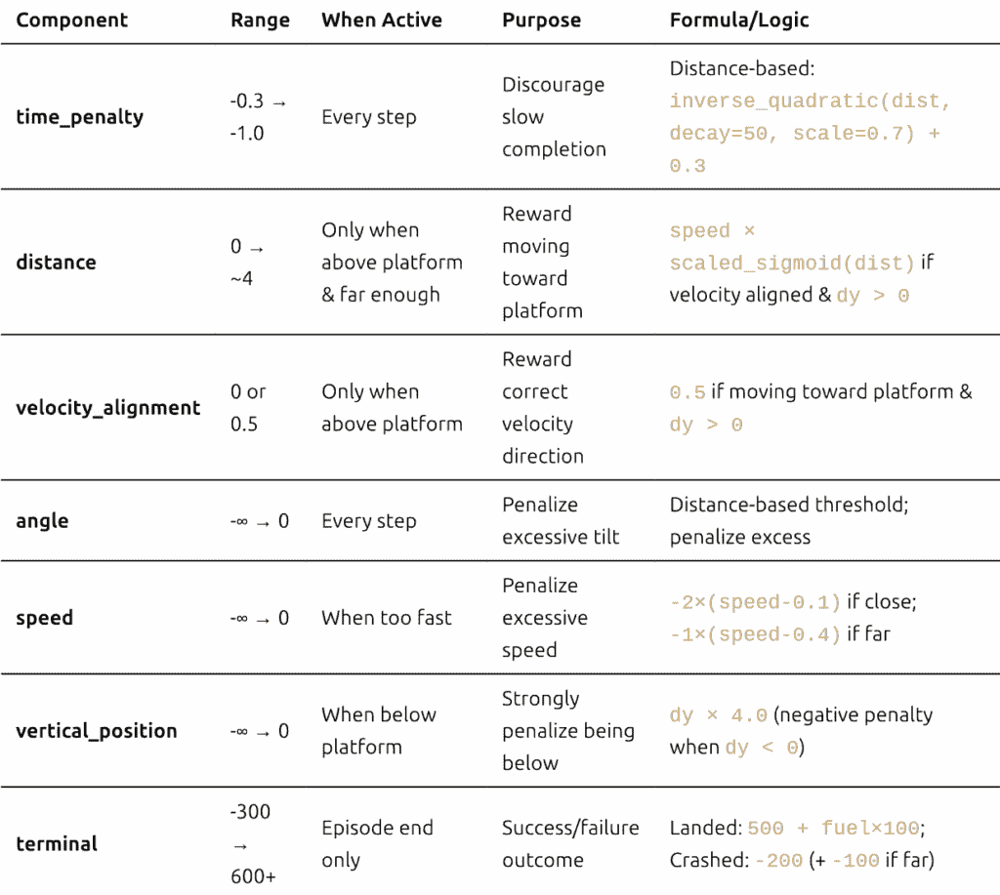

**关于反向（和非线性）缩放奖励的简短说明**

通常，我们希望奖励与某些状态值成反比的行为。例如，到平台的距离从 0 到约 1.41（通过窗口宽度归一化）。当距离≈0 时，我们希望获得高奖励，而当距离较远时，我们希望获得低奖励。我为此使用了各种缩放函数：

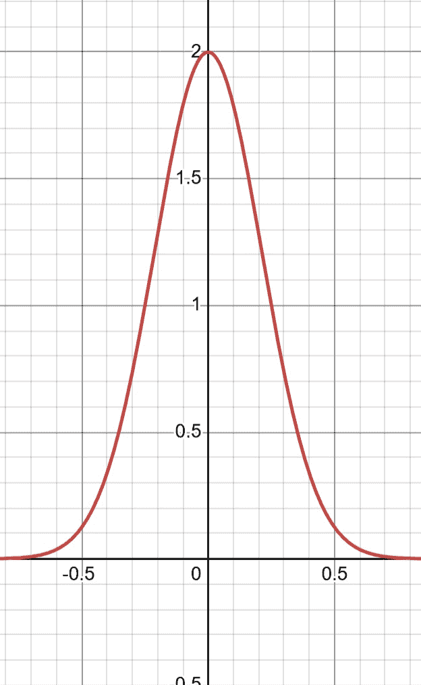

图 4 高斯标量函数

[其他有用缩放函数的示例](https://www.desmos.com/calculator/uof8m0oldo)

**辅助函数**：

```py
def inverse_quadratic(x, decay=20, scaler=10, shifter=0):
    """Reward decreases quadratically with distance"""
    return scaler / (1 + decay * (x - shifter)**2)

def scaled_shifted_negative_sigmoid(x, scaler=10, shift=0, steepness=10):
    """Sigmoid function scaled and shifted"""
    return scaler / (1 + np.exp(steepness * (x - shift)))

def calc_velocity_alignment(state: DroneState):
    """
    Calculate how well the drone's velocity is aligned with optimal direction to platform.
    Returns cosine similarity: 1.0 = perfect alignment, -1.0 = opposite direction
    """
    # Optimal direction: from drone to platform
    optimal_dx = state.dx_to_platform
    optimal_dy = state.dy_to_platform
    optimal_norm = math.sqrt(optimal_dx**2 + optimal_dy**2)

    if optimal_norm < 1e-6:  # Already at platform
        return 1.0

    optimal_dx /= optimal_norm
    optimal_dy /= optimal_norm

    # Current velocity direction
    velocity_norm = state.speed
    if velocity_norm < 1e-6:  # Not moving
        return 0.0

    velocity_dx = state.drone_vx / velocity_norm
    velocity_dy = state.drone_vy / velocity_norm

    # Cosine similarity
    return velocity_dx * optimal_dx + velocity_dy * optimal_dy
```

当前奖励函数的代码：

```py
def calc_reward(state: DroneState):
    rewards = {}
    total_reward = 0

    # 1\. Time penalty - distance-based (penalize more when far)
    minimum_time_penalty = 0.3
    maximum_time_penalty = 1.0
    rewards['time_penalty'] = -inverse_quadratic(
        state.distance_to_platform,
        decay=50,
        scaler=maximum_time_penalty - minimum_time_penalty
    ) - minimum_time_penalty
    total_reward += rewards['time_penalty']

    # 2\. Distance & velocity alignment - ONLY when above platform
    velocity_alignment = calc_velocity_alignment(state)
    dist = state.distance_to_platform

    rewards['distance'] = 0
    rewards['velocity_alignment'] = 0

    # Key condition: drone must be above platform (dy > 0) to get positive rewards
    if dist > 0.065 and state.dy_to_platform > 0:
        # Reward movement toward platform when velocity is aligned
        if velocity_alignment > 0:
            rewards['distance'] = state.speed * scaled_shifted_negative_sigmoid(dist, scaler=4.5)
            rewards['velocity_alignment'] = 0.5

    total_reward += rewards['distance']
    total_reward += rewards['velocity_alignment']

    # 3\. Angle penalty - distance-based threshold
    abs_angle = abs(state.drone_angle)
    max_angle = 0.20
    max_permissible_angle = ((max_angle - 0.111) * dist) + 0.111
    excess = abs_angle - max_permissible_angle
    rewards['angle'] = -max(excess, 0)
    total_reward += rewards['angle']

    # 4\. Speed penalty - penalize excessive speed
    rewards['speed'] = 0
    speed = state.speed
    max_speed = 0.4
    if dist < 1:
        rewards['speed'] = -2 * max(speed - 0.1, 0)
    else:
        rewards['speed'] = -1 * max(speed - max_speed, 0)
    total_reward += rewards['speed']

    # 5\. Vertical position penalty - penalize being below platform
    rewards['vertical_position'] = 0
    if state.dy_to_platform > 0:  # Drone is above platform (GOOD)
        rewards['vertical_position'] = 0
    else:  # Drone is below platform (BAD!)
        rewards['vertical_position'] = state.dy_to_platform * 4.0  # Negative penalty
    total_reward += rewards['vertical_position']

    # 6\. Terminal rewards
    rewards['terminal'] = 0
    if state.landed:
        rewards['terminal'] = 500.0 + state.drone_fuel * 100.0
    elif state.crashed:
        rewards['terminal'] = -200.0
        # Extra penalty for crashing far from target
        if state.distance_to_platform > 0.3:
            rewards['terminal'] -= 100.0
    total_reward += rewards['terminal']

    rewards['total'] = total_reward
    return rewards
```

是的，那些像`4.5`、`0.065`和`4.0`这样的魔法数字？它们来自**大量**的试错。欢迎来到强化学习，在这里超参数调整一半是艺术，一半是科学，一半是运气（是的，我知道那是三个一半）。

```py
def compute_returns(rewards, gamma=0.99):
    """
    Compute discounted returns (G_t) for each timestep based on the Bellman equation

    G_t = r_t + γ*r_{t+1} + γ²*r_{t+2} + ...
    """
    returns = []
    G = 0

    # Compute backwards (more efficient)
    for r in reversed(rewards):
        G = r + gamma * G
        returns.insert(0, G)

    return returns
```

需要注意的重要一点是，奖励函数需要经过仔细的试错。这里的任何一个错误或过度奖励，都可能导致智能体偏离优化行为，利用这些错误。这导致我们面临奖励黑客行为。

### 奖励黑客

当一个智能体找到一种未经预期的方式来最大化奖励，而实际上并没有解决你希望它解决的问题时，就会发生**奖励黑客行为**。智能体并不是故意“作弊”——它正在做你告诉它做的事情，只是不是你**真正希望**它做的事情。

**经典例子**：如果你奖励清洁机器人“没有可见的灰尘”，它可能会学会关闭摄像头而不是清洁！

**我痛苦的学习经历**：我是通过艰难的方式得知这一点的。在我早期版本的无人机着陆奖励函数中，我给无人机在平台附近“稳定且缓慢”飞行时加分。听起来合理，对吧？错了！在 50 次训练周期内，我的无人机学会了永远停留在原地悬停，累积了免费分数。对于我设计的糟糕奖励函数来说，这在技术上是最优的——但实际上着陆呢？没有！我看着它连续悬停了 5 分钟，才意识到发生了什么。

这是我在代码中遇到的问题：

```py
# DO NOT COPY THIS!
# If drone is above the platform (|dx| < 0.0625) and close (distance < 0.25):
corridor_reward = inverse_quadratic(distance, decay=20, scaler=15)  # Up to 15 points
if stable and slow:
    corridor_reward += 10  # Extra 10 points!
# Total possible: 25 points per step!
```

**奖励黑客行为**的实例：

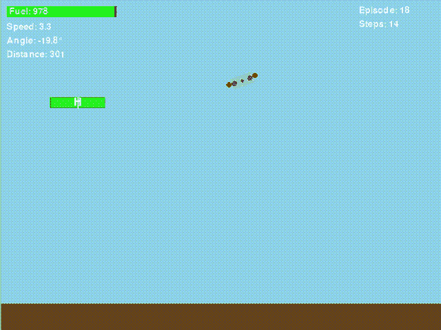

图 5 无人机学会了在平台周围悬停并获取奖励

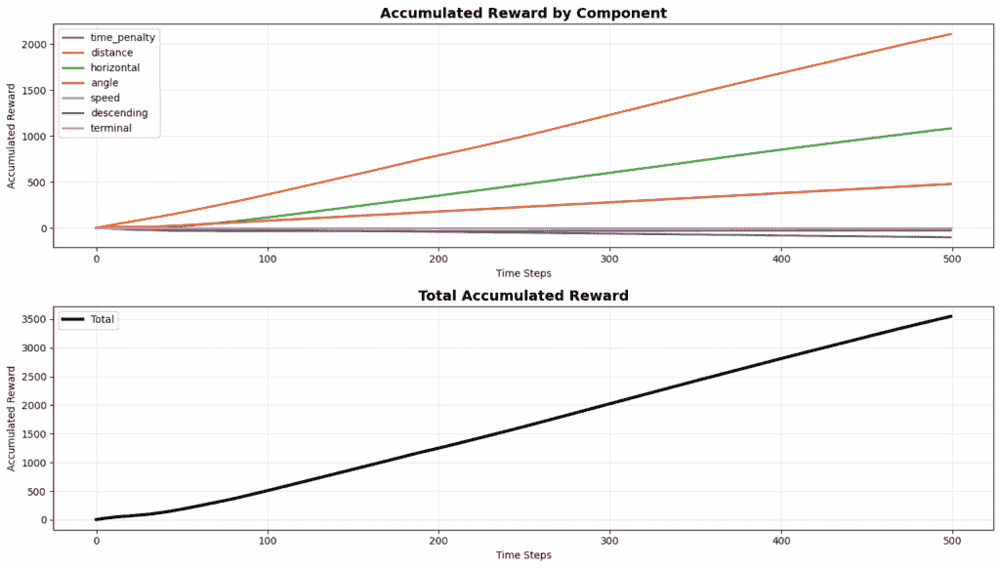

图 6 展示无人机明显进行奖励黑客行为的图表

## 制定策略网络

如上所述，我们将使用神经网络作为驱动我们智能体大脑的策略。以下是一个简单的实现，它接受状态向量并计算在**3 个独立**动作上的概率分布：

1.  激活主推进器

1.  激活左侧推进器

1.  激活右侧推进器

```py
def state_to_array(state):
    """Helper function to convert DroneState dataclass to numpy array"""
    data = np.array([
        state.drone_x,
        state.drone_y,
        state.drone_vx,
        state.drone_vy,
        state.drone_angle,
        state.drone_angular_vel,
        state.drone_fuel,
        state.platform_x,
        state.platform_y,
        state.distance_to_platform,
        state.dx_to_platform,
        state.dy_to_platform,
        state.speed,
        float(state.landed),
        float(state.crashed)
    ])

    return torch.tensor(data, dtype=torch.float32)

class DroneGamerBoi(nn.Module):
    def __init__(self, state_dim=15):
        super().__init__()

        self.network = nn.Sequential(
            nn.Linear(state_dim, 128),
            nn.LayerNorm(128),
            nn.ReLU(),
            nn.Linear(128, 128),
            nn.LayerNorm(128),
            nn.ReLU(),
            nn.Linear(128, 64),
            nn.LayerNorm(64),
            nn.ReLU(),
            nn.Linear(64, 3),
            nn.Sigmoid()
        )

    def forward(self, state):
        if isinstance(state, DroneState):
            state = state_to_array(state)

        return self.network(state)
```

实际上，而不是动作空间是一个 2³ = 8 的空间，我将其减少到使用伯努利采样对三个独立推进器的决策。这种减少通过独立处理每个推进器而不是作为一个大的分类选择（至少我认为是这样——我可能错了，但对我有效！）来简化了优化。

* * *

## 使用策略梯度的策略训练

### 学习策略：我们应该何时更新？

这里有一个早期让我困惑的问题：**我们应该在每次单独的动作后更新策略，还是等待整个集锦结束后再更新？** 结果表明，这个选择非常重要。

当你试图仅基于动作获得的奖励进行优化时，会导致高方差问题（基本上，训练信号非常嘈杂，梯度指向随机方向！）。我所说的“高方差”是指优化算法在梯度中接收极其混合的信号，该梯度用于更新我们的策略网络中的参数。对于同一动作，系统可能会发出一个特定的梯度方向，但对于稍微不同的状态（但相同动作）可能会产生完全相反的结果。这导致训练缓慢，甚至可能无法训练。

我们有三种方法可以更新我们的策略：

**每一步后的学习（每步更新）**

无人机发动一次推进器，获得一小笔奖励，并立即更新其整个策略。这就像每次投篮后都调整你的篮球姿势——反应过度！一次幸运的动作增加了奖励，并不一定意味着代理做得好，一次不幸的动作也不一定意味着代理做得不好。学习信号太嘈杂了。

**我的第一次尝试**：我早期尝试了这个方法。无人机会随机摆动，做出一次幸运的动作，获得一点额外的奖励，然后立即过度拟合到那个特定的动作，并反复尝试重现它。看着它痛苦地尝试，就像看着某人从纯粹的偶然中学习错误的教训。

**完成整个尝试后的学习（每集更新）**

更好！现在我们让无人机尝试降落（或坠毁），看看整个尝试过程如何，然后进行更新。这就像完成一集后思考如何改进。至少现在我们看到了我们行动的全部后果。但问题是：如果那次降落只是幸运的？或者不幸的？我们仍然基于单一的数据点进行学习。

**从多次尝试中学习（多集批量更新）**

这是最佳点。我们同时运行多个（我的是 6 个）无人机降落尝试，看看它们都怎么样，然后根据平均表现更新我们的策略。有些尝试可能会走运，有些则不幸，但平均起来，我们得到了一个更清晰的关于实际有效方法的了解。虽然这对计算机来说相当重，但如果你能运行它，它比任何先前的方 法都要好得多。当然，这种方法当然不是最好的，但它非常简单易懂且易于实现；还有其他（更好的）方法。

这是收集无人机游戏中多个回合的代码：

```py
def collect_episodes(client: DroneGameClient, policy: nn.Module, max_steps=300):
    """
    Collect episodes with early stopping

    Args:
        client: The game's socket client
        policy: PyTorch module
        max_steps: Maximum steps per episode (default: 300)
    """
    num_games = client.num_games

    # Initialize storage
    all_episodes = [{'states': [], 'actions': [], 'log_probs': [], 'rewards': [], 'done': False} 
                    for _ in range(num_games)]

    # Reset all games
    game_states = [client.reset(game_id) for game_id in range(num_games)]
    step_counts = [0] * num_games  # Track steps per game

    while not all(ep['done'] for ep in all_episodes):
        # Batch active games
        batch_states = []
        active_game_ids = []

        for game_id in range(num_games):
            if not all_episodes[game_id]['done']:
                batch_states.append(state_to_array(game_states[game_id]))
                active_game_ids.append(game_id)

        if len(batch_states) == 0:
            break

        # Batched inference
        batch_states_tensor = torch.stack(batch_states)
        batch_action_probs = policy(batch_states_tensor)
        batch_dist = Bernoulli(probs=batch_action_probs)
        batch_actions = batch_dist.sample()
        batch_log_probs = batch_dist.log_prob(batch_actions).sum(dim=1)

        # Execute actions
        for i, game_id in enumerate(active_game_ids):
            action = batch_actions[i]
            log_prob = batch_log_probs[i]

            next_state, _, done, _ = client.step({
                "main_thrust": int(action[0]),
                "left_thrust": int(action[1]),
                "right_thrust": int(action[2])
            }, game_id)

            reward = calc_reward(next_state)

            # Store data
            all_episodes[game_id]['states'].append(batch_states[i])
            all_episodes[game_id]['actions'].append(action)
            all_episodes[game_id]['log_probs'].append(log_prob)
            all_episodes[game_id]['rewards'].append(reward['total'])

            # Update state and step count
            game_states[game_id] = next_state
            step_counts[game_id] += 1

            # Check done conditions
            if done or step_counts[game_id] >= max_steps:
                # Apply timeout penalty if hit max steps without landing
                if step_counts[game_id] >= max_steps and not next_state.landed:
                    all_episodes[game_id]['rewards'][-1] -= 500  # Timeout penalty

                all_episodes[game_id]['done'] = True

    # Return episodes
    return [(ep['states'], ep['actions'], ep['log_probs'], ep['rewards']) 
            for ep in all_episodes]
```

### 最大化-最小化难题

在典型的深度学习（监督学习）中，我们**最小化**损失函数：

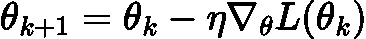

我们想要“下山”走向更低的损失（更好的预测）。

但在强化学习中，我们希望**最大化**总奖励！我们的目标是：

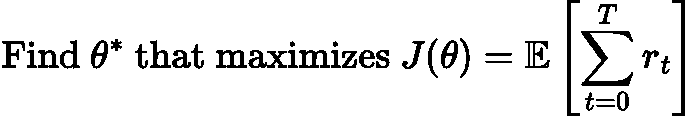

**问题**：深度学习框架是为最小化而构建的，而不是最大化。我们如何将“最大化奖励”转换为“最小化损失”？

**简单技巧**：最大化 J(θ) = 最小化-J(θ)

因此，我们的损失函数变为：

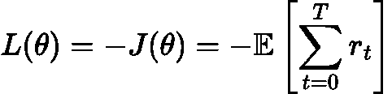

现在，梯度下降将沿着奖励景观**上升**（更像是梯度上升）（因为我们是在下降负奖励）！

### REINFORCE 算法（策略梯度）

**策略梯度定理**（Williams，1992）告诉我们如何计算期望奖励的梯度：

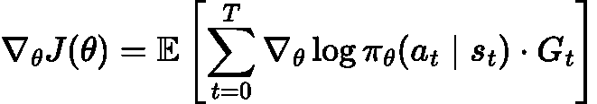

（我知道，我知道——这看起来很吓人。但请跟我一起，一旦你看到发生了什么，它实际上非常优雅！）

其中：

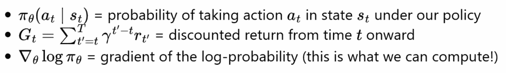

**用简单的话说（因为那个公式很密集）：**

+   如果动作**a[t]**导致高回报**G[t]**，增加其概率

+   如果动作**a[t]**导致低回报**G[t]**，减少其概率

+   梯度告诉我们如何调整神经网络权重

### 添加基准（方差减少）

使用原始回报**G[t]**会导致高方差（噪声梯度）。我们通过减去一个**基准**b(s[t])来改进这一点：

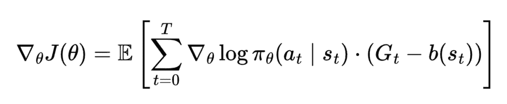

最简单的基准是**平均回报**：

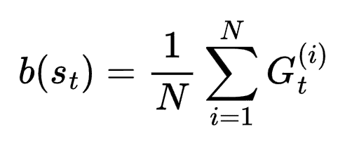

这给我们带来了**优势**：A[t]=G[t]-b

+   正优势 → 动作比平均表现更好 → 增加概率

+   负优势 → 动作比平均表现更差 → 减少概率

**为什么这有帮助**：而不是“这个动作给出了奖励 100”（这是好事吗？），我们有“这个动作给出了 100，而平均是 50”（那太好了！）相对表现比绝对表现更清晰。

### 我们的实现

在我们的无人机降落代码中，我们使用**带有基准的 REINFORCE**：

```py
# 1\. Collect episodes and compute returns
returns = compute_returns(rewards, gamma=0.99)  # G_t with discounting

# 2\. Compute baseline (mean of all returns)
baseline = returns_tensor.mean()

# 3\. Compute advantages
advantages = returns_tensor - baseline

# 4\. Normalize advantages (extra variance reduction)
advantages = (advantages - advantages.mean()) / (advantages.std() + 1e-8)

# 5\. Compute loss (note the negative sign!)
loss = -(log_probs_tensor * advantages).mean()

# 6\. Gradient descent
optimizer.zero_grad()
loss.backward()
optimizer.step()
```

我们可以重复上述循环，直到我们想要或直到无人机学会正确着陆。查看这个[链接](https://github.com/vedant-jumle/reinforcement-learning-101/blob/main/Policy_Gradients_Baseline.ipynb)笔记本以获取更多代码！

## 当前结果（奖励函数仍然相当有缺陷）

经过无数小时的调整奖励、调整超参数，并看着我的无人机以各种创新的方式坠毁，我终于让它工作了（大部分！）！尽管我设计的奖励函数并不完美，但我认为它能够教会策略网络。以下是一个成功的着陆示例：

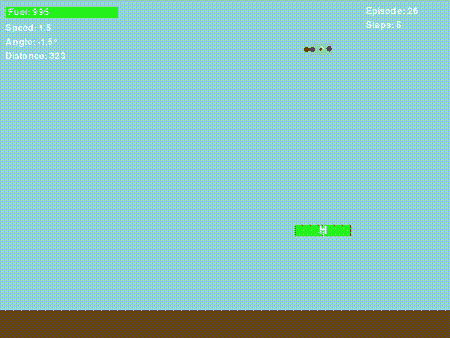

图 6 无人机学到了一些东西！

真的很酷，对吧？但这里才是事情变得有趣（并且令人沮丧）的地方…

* * *

### 持续的悬停问题：一个基本限制

即使是改进的奖励函数，该奖励函数基于垂直位置条件（`dy_to_platform > 0`），训练策略仍然表现出令人沮丧的行为：**当无人机错过平台时，它会学会向平台下降，但然后在平台下方悬停而不是尝试着陆**。

我花了一周多的时间盯着奖励图（并修改奖励函数），想知道为什么我的“固定”奖励函数仍然产生这种悬停行为。当我最终绘制累积奖励时，模式变得非常清晰——而且老实说，我甚至不能因为代理找到这种策略而生气。

**发生了什么？**

通过分析无人机在平台下方悬停的情节中累积的奖励，我发现了一些有趣的事情：

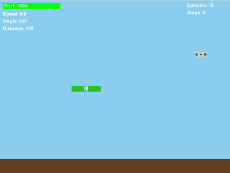

图 7 显示“在平台下方悬停”问题的 Gif

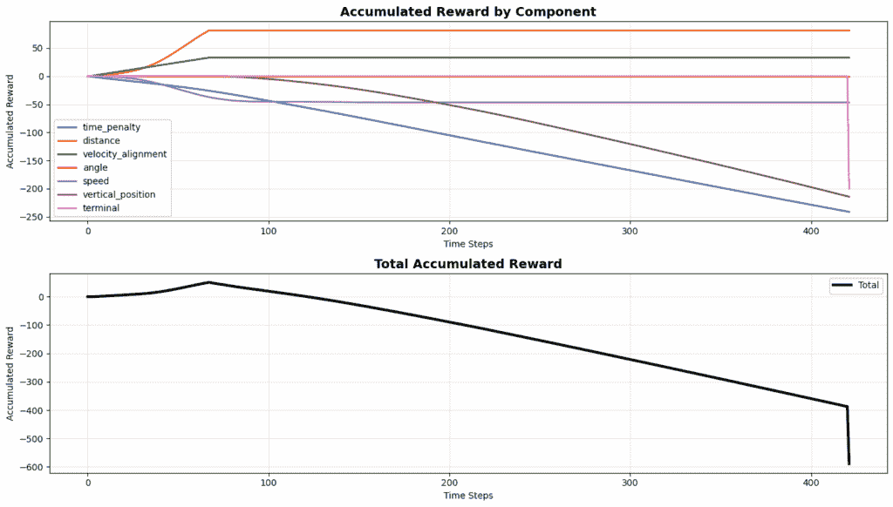

图 8 展示了无人机明显在进行奖励黑客攻击的图示

这些图显示：

+   **距离奖励**（橙色）：早期累积至约+70，然后达到平台期（不再有奖励）

+   **速度对齐**（绿色）：早期累积至约+30，然后达到平台期

+   **时间惩罚**（蓝色）：稳步累积至约-250（持续变差）

+   **垂直位置**（棕色）：稳步累积至约-200（位于下方的惩罚）

+   **总奖励**：在超时后结束在-400 到-600 之间

**关键洞察**：无人机从平台上方下降（在下降过程中收集距离和速度奖励），穿过平台高度，然后**在平台下方悬停**而不是完成着陆。一旦在下方，它就不再获得正奖励（注意距离和速度线在步骤 50-60 左右达到平台期），但继续累积时间惩罚和垂直位置惩罚。然而，这种策略仍然可行，因为尝试着陆会立即面临-200 的碰撞惩罚，而悬停在下方“仅”需要-400 到-600 的整个情节成本。

**为什么会发生这种情况？**

基本问题是我们的奖励函数`r(s', a)`只能看到**当前状态**，而不是轨迹。想想看：在任何单一的时间步长，奖励函数无法区分：

+   一架无人机**向着陆前进**（从上方以可控下降的方式接近）

+   一架**利用奖励结构**的无人机（振荡以获取奖励）

它们可能在某个时刻都有`dy_to_platform > 0`，因此它们获得相同的奖励！智能体并不愚蠢——它只是在优化你告诉它优化的东西。

**那么真正解决这个问题是什么？**

要真正解决这个问题，我个人认为奖励应该依赖于**状态转移**：`r(s, a, s')`而不是仅仅`r(s, a)`。这样你就可以根据以下情况给予奖励（s 是当前状态，s’ prime 是下一个状态）：

+   **进展**：只有当`distance(s') < distance(s)`（实际上更接近！）时才给予奖励

+   **垂直提升**：只有当无人机相对于平台持续向上移动时才给予奖励

+   **轨迹一致性**：惩罚快速方向变化，这表明振荡

这比试图通过不断增加严厉的惩罚来修补当前的奖励函数（这基本上是我尝试了一段时间的方法，但并没有真正奏效）更为根本。振荡利用存在是因为我们从根本上**缺少关于轨迹的信息**。

在下一篇文章中，我将探讨**演员-评论家方法**和可以结合时间信息以防止这些利用策略的技术。敬请期待！

如果你找到解决这个问题的方法，请与我联系！

这就结束了关于“进行深度强化学习最简单的方法”的这篇文章。 

* * *

## 下一个要讨论的是

+   演员评论家系统

+   DQL

+   PPO & GRPO

+   将其应用于需要视觉的系统 👀

* * *

## 参考文献

### 基础知识

1.  **图灵，A. M.** (1950). “计算机器与智能。”。

    +   原始图灵测试论文

1.  **威廉姆斯，R. J.** (1992). “用于连接主义强化学习的简单统计梯度跟随算法。” *机器学习*。

    +   **REINFORCE 算法**

1.  **Sutton, R. S., & Barto, A. G.** (2018). 《强化学习：入门》。麻省理工学院出版社。

    +   基础教材

    +   免费在线：[`incompleteideas.net/book/the-book-2nd.html`](http://incompleteideas.net/book/the-book-2nd.html)

### 经典条件反射与行为心理学

1.  **巴甫洛夫，I. P.** (1927). 《条件反射：大脑皮层生理活动的研究》。牛津大学出版社。

    +   经典条件反射实验

1.  **斯金纳，B. F.** (1938). 《有机体的行为：实验分析》。Appleton-Century-Crofts。

    +   操作性条件反射和斯金纳箱

### 策略梯度方法

1.  **Sutton, R. S., McAllester, D., Singh, S., & Mansour, Y.** (1999). “基于函数近似的强化学习策略梯度方法。” *神经信息处理系统进展*。

    +   理论基础：策略梯度

1.  **Schulman, J., Moritz, P., Levine, S., Jordan, M., & Abbeel, P.** (2015). “使用广义优势估计进行高维连续控制。” *arXiv 预印本 arXiv:1506.02438*.

### 神经网络与深度学习

1.  **Goodfellow, I., Bengio, Y., & Courville, A.** (2016). *深度学习*. MIT 出版社.

    +   神经网络基础参考

    +   在线可用：[`www.deeplearningbook.org/`](https://www.deeplearningbook.org/)

### 在线资源

1.  **Karpathy, A.** “基于像素的深度强化学习：Pong 游戏。”

    +   博客文章：[`karpathy.github.io/2016/05/31/rl/`](http://karpathy.github.io/2016/05/31/rl/)

    +   有影响力的教育资源

1.  **OpenAI** 编写的**《深度强化学习：从像素到 Pong》**

    +   教育资源：[`spinningup.openai.com/`](https://spinningup.openai.com/)

    +   优秀的策略梯度解释

### 代码仓库

1.  **Jumle, V.** (2025). “强化学习 101：递送无人机着陆。”

    +   GitHub: [`github.com/vedant-jumle/reinforcement-learning-101`](https://github.com/vedant-jumle/reinforcement-learning-101)

### 朋友

1.  **Singh, Navroop Kaur.** (2025): 感谢提供“*积极的情绪与关注*”。谢谢！

本文中的所有图片要么是 AI 生成的（使用 Gemini），要么是我亲自制作的，或者是我自己制作的截图和图表。
