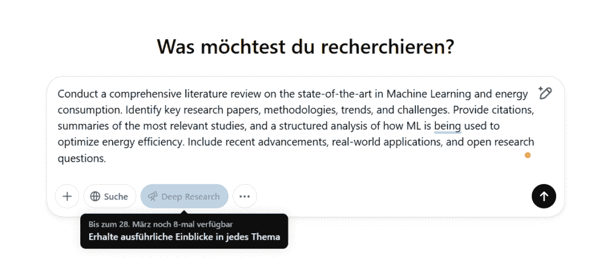
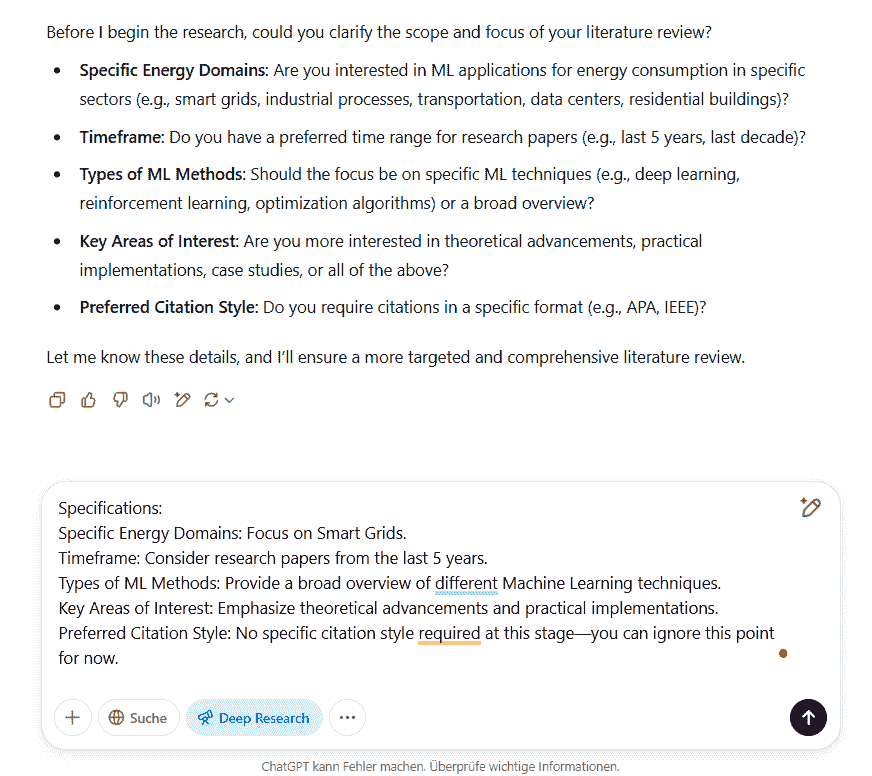

# OpenAI 的深度研究：人工智能驱动的文献综述的实际测试

> 原文：[`towardsdatascience.com/deep-research-by-openai-a-practical-test-of-ai-powered-literature-review/`](https://towardsdatascience.com/deep-research-by-openai-a-practical-test-of-ai-powered-literature-review/)

“对机器学习和能耗的最新进展进行全面的文献综述。 [...]”

使用这个提示，我测试了自 2 月底以来集成到 OpenAI o3 推理模型中的新深度研究功能，并在 6 分钟内完成了一项最先进的文献综述。

此功能超越了正常的网络搜索（例如，使用 ChatGPT 4o）：研究查询被分解和结构化，互联网被搜索以获取信息，然后对这些信息进行评估，最后创建一个结构化、全面的报告。

让我们更深入地了解一下。

> **目录**
> 
> 1. OpenAI 的深度研究是什么？你可以用它做什么？
> 
> 2. 深度研究是如何工作的？
> 
> 3. 如何使用深度研究？——实际案例
> 
> 4. 深度研究功能的挑战和风险
> 
> 最终思考
> 
> 你可以在哪里继续学习？

## 1. OpenAI 的深度研究是什么？你可以用它做什么？

如果你拥有 OpenAI Plus 账户（每月 20 美元的计划），你可以访问深度研究。这为你每月提供 10 个查询。通过 Pro 订阅（每月 200 美元），你可以扩展对深度研究的访问，并获得 GPT-4.5 的研究预览，每月提供 120 个查询。

[OpenAI](https://help.openai.com/en/articles/10500283-deep-research-faq)承诺我们可以使用来自公共网络的数据进行多步骤研究。

持续时间：5 到 30 分钟，具体取决于复杂程度。

以前，此类研究通常需要数小时。

它旨在处理需要深度搜索和彻底性的复杂任务。

具体的用例是什么样的？

+   进行文献综述：对最先进的机器学习和能耗进行文献综述。

+   市场分析：根据当前市场趋势和评估，为 2025 年的公司创建最佳营销自动化平台的比较报告。

+   技术与软件开发：调查用于人工智能应用开发的编程语言和框架，并进行性能和用例分析。

+   投资与财务分析：基于最近的报告和学术研究，对人工智能驱动的交易对金融市场的影响进行研究。

+   法律研究：对欧洲与美国的数据保护法律进行概述，包括相关裁决和最近的变化。

## 2. 深度研究是如何工作的？

深度研究使用各种深度学习方法对信息进行系统性和详细的分析。整个过程可以分为四个主要阶段：

### 1. 研究问题的分解和结构化

在第一步，工具使用自然语言处理（NLP）方法处理研究问题。它识别最重要的关键词、概念和子问题。

此步骤确保 AI 不仅从字面上理解问题，而且从内容上理解。

### 2. 获取相关信息

一旦工具已经结构化研究问题，它就会专门搜索相关信息。深入研究使用内部数据库、科学出版物、API 和网页抓取的混合。这些可以是如 arXiv、PubMed 或 Semantic Scholar 等开放获取数据库，也可以是如《卫报》、《纽约时报》或 BBC 等公共网站或新闻网站。最后，任何可以在线访问且公开可用的内容。

### 3. 数据分析与解释

下一步是让 AI 模型将大量文本总结成紧凑且易于理解的答案。Transformers 和注意力机制确保了最重要的信息被优先考虑。这意味着它不仅仅是对找到的所有内容进行总结。同时，还会评估来源的质量和可信度。通常使用交叉验证方法来识别错误或矛盾的信息。在这里，AI 工具会将几个来源相互比较。然而，在 Deep Research 中确切如何进行以及有哪些标准尚不公开。

### 4. 生成最终报告

最后，生成并显示最终报告。这是使用自然语言生成（NLG）完成的，以便我们能够看到易于阅读的文本。

如果在提示中请求，AI 系统会生成图表或表格，并将响应适应用户的风格。报告末尾也会列出主要来源。

## 3. 如何使用 Deep Research：一个实际例子

在第一步，最好使用其中一个标准模型来询问如何优化提示以进行深入研究。我已经用以下提示与 ChatGPT 4o 做了这个：

*“优化此提示以进行深入研究：

进行文献检索：对机器学习和能耗的最新研究状态进行文献检索。”*

4o 模型为 Deep Research 功能建议了以下提示：

作者截图

工具随后问我是否可以澄清文献综述的范围和重点。因此，我提供了以下一些额外的说明：

作者截图

ChatGPT 随后返回了澄清并开始研究。

同时，我可以看到进度以及更多来源逐渐被添加。

经过 6 分钟后，最新的文献综述已完成，包括所有来源的报告都可供我查阅。

### [Deep Research Example.mp4](https://drive.google.com/file/d/1GHAi1eMxlzW2YDpBqp5szTD78_hMf_jF/view?usp=sharing&source=post_page-----08c5c2395df4---------------------------------------)

## 4. 深度研究功能的挑战和风险

让我们来看看研究的两个定义：

> “对某一主题的详细研究，特别是为了发现新信息或达到新的理解。”
> 
> [*参考：剑桥词典*](https://dictionary.cambridge.org/de/worterbuch/englisch/research#google_vignette)
> 
> “研究是一种创造性和系统性的工作，旨在增加知识存量。它涉及收集、组织和分析证据，以增加对某一主题的理解，其特点是对控制偏差和错误的来源具有特别的关注。”
> 
> [*参考：维基百科研究*](https://en.wikipedia.org/wiki/Research)

这两个定义表明，研究是对某一主题的详细、系统性的调查——旨在发现新信息或达到更深入的理解。

深度研究功能基本上在某种程度上满足了这些定义：它收集现有信息，分析它，并以结构化的方式呈现。

然而，我认为我们还需要意识到一些挑战和风险：

+   **表面性的危险**：深度研究功能主要是为了高效地搜索、总结并以结构化的形式提供现有信息（至少在当前阶段是这样）。这对于概述研究来说绝对很棒。但深入挖掘呢？真正的科学研究不仅超越了简单的复制，而且对来源进行了批判性的审视。科学也依赖于生成新知识。

+   **研究和出版中现有偏见的强化**：如果论文有显著的结果，它们更有可能被发表。“非显著”或矛盾的结果则不太可能被发表。这被称为[发表偏差](https://en.wikipedia.org/wiki/Publication_bias)。如果 AI 工具现在主要评估被频繁引用的论文，它就会强化这一趋势。罕见或不太普遍但可能重要的发现就会丢失。可能的解决方案是实施一种加权源评估机制，同时考虑那些被引用较少但相关的论文。如果 AI 方法主要引用那些被频繁引用的来源，那么不太普遍但重要的发现可能会丢失。大概，这种效应也适用于我们人类。

+   **研究论文的质量**：虽然很明显，学士学位、硕士学位或博士学位论文不能仅仅基于 AI 生成的科研成果，但我所关心的问题是大学或科研机构如何处理这一发展。学生只需一个简单的提示就能获得一份扎实的研究报告。大概，这里的解决方案必须是对评估标准进行调整，以给予深入反思和方法论更大的权重。

## 最终思考

除了 OpenAI，其他公司和平台也集成了类似的功能（甚至在 OpenAI 之前）：例如，[Perplexity AI](https://www.perplexity.ai/de/hub/blog/introducing-perplexity-deep-research) 引入了一个独立进行和分析搜索的深度研究功能。同样，[Google 的 Gemini](https://blog.google/products/gemini/google-gemini-deep-research/) 也集成了这样的深度研究功能。

该函数为你提供了一个关于初始研究问题的非常快速的了解。目前（从 2025 年 3 月开始），[OpenAI 本身将其限制性描述为](https://openai.com/index/introducing-deep-research/)该功能仍处于早期阶段，有时会将事实错误地加入答案中或得出错误的结论，并且难以区分权威信息和谣言。此外，它目前无法准确传达不确定性。

但可以假设这个功能将进一步扩展并成为研究的有力工具。如果你有更简单的问题，最好使用标准的 GPT-4o 模型（带或不带搜索），你将立即得到答案。

## 你可以在哪里继续学习？

+   [DataCamp 博客 — OpenAI 的深度研究](https://www.datacamp.com/blog/deep-research-openai)

+   [IBM — OpenAI 的深度研究旨在超越分析师](https://www.ibm.com/think/news/openai-releases-deep-research)

+   [OpenAI — 深度研究常见问题解答](https://help.openai.com/en/articles/10500283-deep-research-faq)

+   [OpenAI — 系统卡片 PDF](https://cdn.openai.com/deep-research-system-card.pdf)

+   [OpenAI — 系统卡片深度研究](https://openai.com/index/deep-research-system-card/)

+   [OpenAI — 介绍深度研究](https://openai.com/index/introducing-deep-research/)

+   [freeCodeCamp 视频 — 深度学习研究教程理解](https://www.youtube.com/watch?v=onU5Hbb3qao)

+   [DataCamp 博客 — 如何 Transformer 工作](https://www.datacamp.com/tutorial/how-transformers-work)

*想要更多关于技术、Python、数据科学、数据工程、机器学习和人工智能的技巧和窍门？那么请定期在我的 Substack 上接收我最受欢迎文章的总结 — 精选且免费。*

[*点击此处订阅我的 Substack!*](https://sarahleaschrch.substack.com/)
