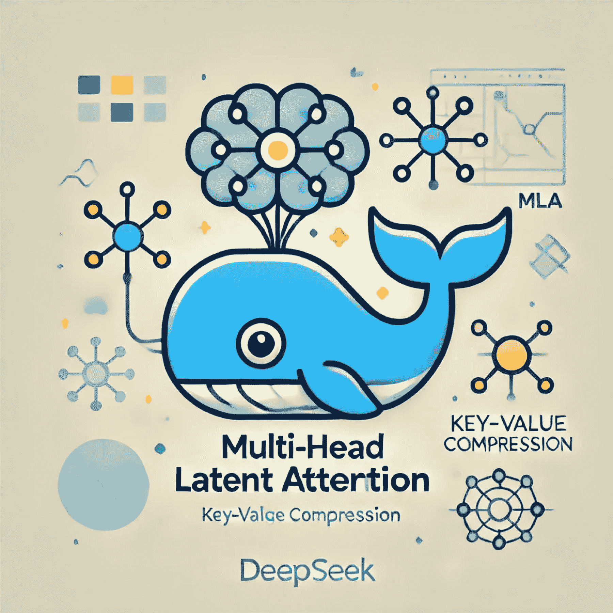
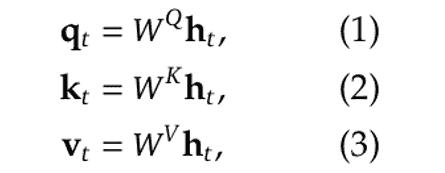
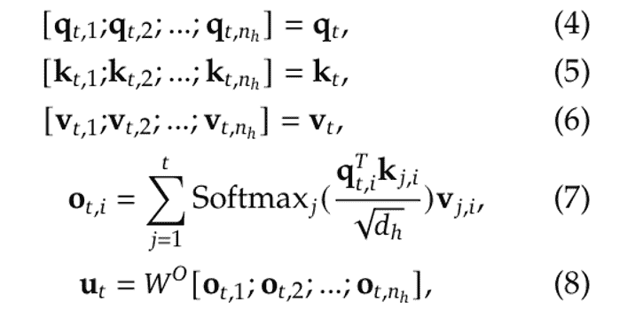
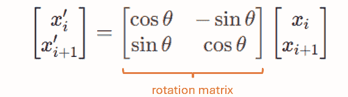
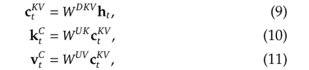
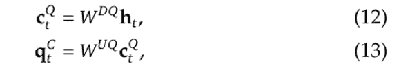

# DeepSeek-V3 Explained 1: Multi-head Latent Attention

> 原文：[`towardsdatascience.com/deepseek-v3-explained-1-multi-head-latent-attention-ed6bee2a67c4/`](https://towardsdatascience.com/deepseek-v3-explained-1-multi-head-latent-attention-ed6bee2a67c4/)

Image created by author using ChatGPT.

这是我们的新系列“DeepSeek-V3 Explained”的第一篇文章，我们将尝试揭开 DeepSeek-V3 [1, 2]，DeepSeek 最新开源模型的神秘面纱。

在这个系列中，我们旨在涵盖两个主要主题：

+   DeepSeek-V3 的主要架构创新，包括 MLA（多头潜在注意力）[3]、DeepSeekMoE [4]、无辅助损失负载均衡[5]和多标记预测训练。

+   DeepSeek-V3 的训练，包括预训练、微调和 RL 对齐阶段。

本文主要关注**多头潜在注意力**（Multi-head Latent Attention），它最初在 DeepSeek-V2 的开发中被提出，后来也被用于 DeepSeek-V3。

目录：

+   **背景**：我们从标准的 MHA 开始，解释为什么在推理阶段需要键值缓存，MQA 和 GQA 如何尝试优化它，以及 RoPE 是如何工作的等。

+   **多头潜在注意力**：对 MLA 的深入介绍，包括其动机、为什么需要解耦 RoPE，以及其性能。

+   **参考文献**。

* * *

## 背景

为了更好地理解 MLA（多头潜在注意力）并使本文内容自洽，在深入探讨 MLA 的细节之前，我们将回顾本节中的一些相关概念。

### 仅解码器 Transformer 中的 MHA

注意，MLA 是为了加速自回归文本生成的推理速度而开发的，因此在这个背景下我们讨论的 MHA 是针对仅解码器的 Transformer。

下图比较了用于解码的三个 Transformer 架构，其中（a）显示了在原始“Attention is All You Need”论文中提出的编码器和解码器。其解码部分随后被[6]简化，导致仅解码器 Transformer 模型在（b）中显示，该模型后来被用于许多生成模型，如 GPT [8]。

现在，LLMs 更倾向于选择（c）所示的架构进行更稳定的训练，在输入而不是输出上应用归一化，并将 LayerNorm 升级到 RMS Norm。这将成为本文中我们将讨论的基线架构。

![Figure 1\. Transformer architectures. (a) encoder-decoder proposed in [6]. (b) Decoder-only Transformer proposed in [7] and used in GPT [8]. (c) An optimized version of (b) with RMS Norm before attention. [3]](../Images/f6fb7dfc3dcf057c9de8a6ebf1c838dd.png)

Figure 1\. Transformer architectures. (a) encoder-decoder proposed in [6]. (b) Decoder-only Transformer proposed in [7] and used in GPT [8]. (c) An optimized version of (b) with RMS Norm before attention. [3]

在这个背景下，MHA 的计算过程在很大程度上遵循[6]中的过程，如图下所示：

![图 2. 缩放点积注意力与多头注意力。图片来自 [6]。](../Images/d984c4fe15272c1101f53997d21b596a.png)

图 2. 缩放点积注意力与多头注意力。图片来自 [6]。

假设我们有 **n_h** 个注意力头，每个注意力头的维度表示为 **d_h**，因此连接的维度将是（**h_n** · **d_h**）。

给定一个具有 **l** 层的模型，如果我们表示该层中第 t 个标记的输入为 **h_t**，其维度为 **d**，我们需要使用线性映射矩阵将 **h_t** 的维度从 **d** 映射到（**h_n** · **d_h**）。

更正式地说，我们有（来自 [3] 的方程）：

其中 **W^Q**、**W^K** 和 **W^V** 是线性映射矩阵：

在此映射之后，**q_t**、**k_t** 和 **v_t** 将被分成 **n_h** 个头以计算缩放点积注意力：

其中 **W^O** 是另一个投影矩阵，用于将维度从（**h_n** · **d_h**）逆映射到 **d**：

注意，上述方程（1）至（8）描述的过程仅针对单个标记。在推理过程中，我们需要为每个新生成的标记重复此过程，这涉及到大量的重复计算。这导致了一种称为键值缓存的技术。

### 键值缓存

如其名所示，键值缓存是一种通过缓存和重用之前的键和值来加速自回归过程的技巧，而不是在每次解码步骤中重新计算它们。

注意，KV 缓存通常仅在推理阶段使用，因为在训练过程中我们仍然需要并行处理整个输入序列。

KV 缓存通常实现为滚动缓冲区。在每次解码步骤中，仅计算新的查询 Q，而存储在缓存中的 K 和 V 将被重用，以便使用新的 Q 和重用的 K、V 来计算注意力。同时，新标记的 K 和 V 也将附加到缓存中供以后使用。

然而，KV 缓存带来的加速是以内存为代价的，因为 KV 缓存通常与 **batch size × sequence length × hidden size × number of heads** 成比例，当我们的批大小较大或序列较长时，这会导致内存瓶颈。

这进一步导致两种旨在解决这一局限性的技术：多查询注意力与分组查询注意力。

### 多查询注意力（MQA）与分组查询注意力（GQA）

下面的图显示了原始 MHA、分组查询注意力（GQA）[10] 和多查询注意力（MQA）[9] 之间的比较。

![图 3. MHA [6]，GQA [10] 和 MQA [9]。图片来自 [10]。](../Images/029cc14fb22ca90a88961eb7faa9c16b.png)

图 3. MHA [6]，GQA [10] 和 MQA [9]。图片来自 [10]。

MQA 的基本思想是在所有查询头之间共享单个键和单个值头，这可以显著减少内存使用，但也会影响注意力的准确性。

GQA 可以看作是 MHA 和 MQA 之间的插值方法，其中单个键和值头只由一组查询头共享，而不是所有查询。但即便如此，与 MHA 相比，这仍会导致结果较差。

在后面的章节中，我们将看到 MLA 如何在内存效率和建模精度之间寻求平衡。

### RoPE（旋转位置嵌入）

我们需要提到的最后一部分背景是 RoPE [11]，它通过使用正弦函数旋转多头注意力中的查询和键向量，将位置信息直接编码到注意力机制中。

更具体地说，RoPE 在每一个标记处对查询和键向量应用**位置相关的旋转矩阵**，并使用正弦和余弦函数作为其基函数，但以独特的方式应用它们以实现旋转。

要了解其位置依赖性，考虑一个只有 4 个元素的玩具嵌入向量，即(x_1, x_2, x_3, x_4)。

要应用 RoPE，我们首先将连续的维度分组为对：

+   (x_1, x_2) -> 位置 1

+   (x_3, x_4) -> 位置 2

然后，我们将旋转矩阵应用于每一对：

图 4.应用于一对标记的旋转矩阵的说明。图片由作者提供。

其中 θ = θ(p) = p ⋅ θ_0，θ_0 是**基本频率**。在我们的 4 维玩具示例中，这意味着(x_1, x_2)将旋转θ_0，而(x_3, x_4)将旋转 2 ⋅ θ_0。

这就是为什么我们称这个旋转矩阵为**位置相关的**：在每一个位置（或每一对），我们将应用不同的旋转矩阵，其中旋转角度由位置决定。

RoPE 因其编码长序列的高效性而在现代 LLMs 中得到广泛应用，但正如我们从前面的公式中可以看到的，它对 Q 和 K 都敏感于位置，因此在某些方面与 MLA 不兼容。

* * *

## 多头潜在注意力

最后，我们可以继续到 MLA 部分。在本节中，我们将首先介绍 MLA 的高级概念，然后深入探讨为什么它需要修改 RoPE。最后，我们将详细介绍 MLA 的详细算法及其性能。

### MLA：高级概念

MLA 的基本思想是将注意力输入**h_t**压缩成一个低维潜在向量，其维度为**d_c**，其中**d_c**远低于原始的（**h_n** · **d_h**）。当我们需要计算注意力时，我们可以将这个潜在向量映射回高维空间以恢复键和值。因此，只需要存储潜在向量，从而实现显著的内存减少。

这个过程可以用以下方程更正式地描述，其中 **c^{KV}_t** 是潜在向量，**W^{DKV}** 是压缩矩阵，它将 **h_t** 的维度从 (**h_n** · **d_h**) 映射到 **d_c**（这里上标中的 D 代表“下投影”，意味着压缩维度），而 **W^{UK}** 和 **W^{UV}** 都是上投影矩阵，它们将共享的潜在向量映射回高维空间。

同样，我们也可以将查询映射到一个潜在的低维向量，然后再将其映射回原始的高维空间：

### 为什么需要解耦 RoPE

如我们之前提到的，RoPE 是训练生成模型处理长序列的常见选择。如果我们直接应用上述 MLA 策略，那将不兼容 RoPE。

为了更清楚地了解这一点，考虑当我们使用公式 (7) 计算注意力时会发生什么：当我们用转置的 **q** 乘以 **k** 时，矩阵 **W^Q** 和 **W^{UK}** 将出现在中间，它们的组合相当于从 **d_c** 到 **d** 的单个映射维度。

在原始论文 [3] 中，作者们将此描述为 **W^{UK}** 可以被“**吸收**”到 **W^Q** 中，因此我们不需要在缓存中存储 **W^{UK}**，从而进一步减少内存使用。

然而，当我们考虑图 (4) 中的旋转矩阵时，情况并非如此，因为 RoPE 将在 **W^{UK}** 的左侧应用旋转矩阵，而这个旋转矩阵最终会位于转置的 **W^Q** 和 **W^{UK}** 之间。

正如我们在背景部分所解释的，这个旋转矩阵是位置相关的，意味着每个位置的旋转矩阵是不同的。因此，**W^{UK}** **不能再**被 **W^Q** **吸收**。

为了解决这种冲突，作者们提出了他们称之为“**解耦 RoPE**”的方法，通过引入额外的查询向量和共享密钥向量，并在 RoPE 过程中仅使用这些额外的向量，同时保持原始密钥与旋转矩阵**相对隔离**。

MLA 的整个过程可以总结如下（方程编号重用了 [3] 附录 C 中的编号）：

![图 5. MLA 过程。作者基于 [3] 中的方程编辑的图片。](../Images/5b3f39114c5faa19fbd84136686b7a4c.png)

图 5. MLA 过程。作者基于 [3] 中的方程编辑的图片。

其中

+   公式 (37) 到 (40) 描述了如何处理查询标记。

+   公式 (41) 和 (42) 描述了如何处理键标记。

+   公式 (43) 和 (44) 描述了如何使用额外的共享密钥进行 RoPE，请注意 (42) 的输出**不参与 RoPE**。

+   公式 (45) 描述了如何处理值标记。

在这个过程中，只需要缓存带有框的蓝色变量。这个过程可以用下面的流程图更清楚地说明：

![图 6. MLA 流程图。图片来自 [3]。](../Images/c6813845b33e3950fe5b63261ef6432d.png)

图 6. MLA 的流程图。图片来自 [3]。

### MLA 的性能

下表比较了 MHA、GQA、MQA 和 MLA 在 KV 缓存（每 token）所需元素数量以及建模能力之间的差异，表明 MLA 确实能够在内存效率与建模能力之间实现更好的平衡。

有趣的是，MLA 的建模能力甚至超过了原始的 MHA。

![[3]中的表 1](../Images/fa326bda9d50a996f8c6dd9c278a9d7e.png)

[3] 中的表 1。

更具体地说，下表显示了 MHA、GQA 和 MQA 在 7B 模型上的性能，其中 MHA 显著优于 MQA 和 GQA。

![[3]中的表 8](../Images/1d57346522aa3a5f93de3b112a7362d9.png)

[3] 中的表 8。

[3] 的作者还进行了 MHA 与 MLA 之间的分析，结果总结在下表中，其中 MLA 在整体上取得了更好的结果。

![[3]中的表 9](../Images/297634a9effb141fb064b058a03a1d9f.png)

[3] 中的表 9。

## 参考文献

+   [1] [DeepSeek](https://www.deepseek.com/)

+   [2] [DeepSeek-V3 技术报告](https://github.com/deepseek-ai/DeepSeek-V3/blob/main/DeepSeek_V3.pdf)

+   [3] [DeepSeek-V2：一个强大、经济、高效的混合专家语言模型](https://arxiv.org/abs/2405.04434)

+   [4] [DeepSeekMoE：混合专家语言模型中追求终极专家专业化的方法](https://arxiv.org/abs/2401.06066)

+   [5] [混合专家的辅助损失免费负载均衡策略](https://arxiv.org/abs/2408.15664)

+   [6] [Attention Is All You Need](https://arxiv.org/abs/1706.03762)

+   [7] [通过总结长序列生成维基百科](https://arxiv.org/pdf/1801.10198)

+   [8] [通过生成预训练改进语言理解](https://cdn.openai.com/research-covers/language-unsupervised/language_understanding_paper.pdf)

+   [9] [快速 Transformer 解码：只需一个写入头](https://arxiv.org/pdf/1911.02150)

+   [10] [GQA：从多头检查点训练通用多查询 Transformer 模型](https://arxiv.org/abs/2305.13245)

+   [11] [RoFormer：增强型 Transformer 带有旋转位置嵌入](https://arxiv.org/abs/2104.09864)
