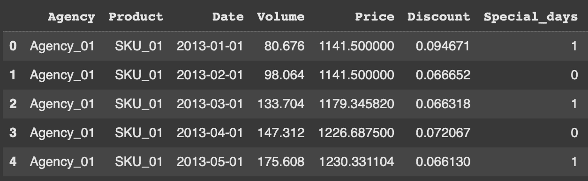
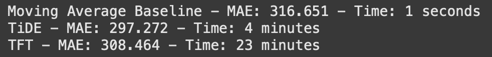
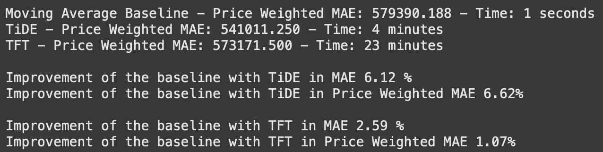

# 使用 Darts 进行需求预测：教程

> 原文：[`towardsdatascience.com/demand-forecasting-with-darts-a-tutorial-480ba5c24377/`](https://towardsdatascience.com/demand-forecasting-with-darts-a-tutorial-480ba5c24377/)


图片由 [Victoriano Izquierdo](https://unsplash.com/@victoriano?utm_source=medium&utm_medium=referral) 在 [Unsplash](https://unsplash.com?utm_source=medium&utm_medium=referral) 提供

对于零售公司来说，需求预测可能成为一个复杂任务，因为从项目的开始到最终的部署，需要考虑多个因素。本文概述了训练和部署需求预测模型所需的主要步骤，以及我在作为顾问的经验中获得的建议和技巧。

每个部分将包含两种主要类型的子部分。第一种子部分将致力于我从项目工作中收集到的建议和意见。另一种子部分被称为 ***让我们编码！***，将包括实际 Python 教程的代码片段。请注意，这个教程旨在简单易懂，展示如何使用 [Darts](https://unit8co.github.io/darts/README.html) 进行需求预测，并突出几个用于此任务的深度学习模型。

你可以在以下位置找到教程的完整源代码：**** [`github.com/egomezsandra/demand-forecasting-darts.git`](https://github.com/egomezsandra/demand-forecasting-darts.git)

## 为什么需求预测不像看起来那么简单

你刚刚在一家零售公司找到了你的第一份数据科学家工作。你的新老板听说每个大公司都使用人工智能来提高其库存管理效率，所以你的第一个项目是部署一个需求预测模型。你对时间序列预测了如指掌，但当你开始与交易数据库一起工作时，你感到不确定，不知道如何开始。

在商业领域，用例比简单的预测或预测机器学习任务具有更多层次和复杂性。这种差异是我们大多数人获得专业经验后才会了解到的事情。让我们来分解一下本指南将要涵盖的不同步骤：

1.  你收集了所有相关数据了吗？

1.  你检查过错误值了吗？你是预测销售还是需求？

1.  你需要预测所有产品吗？你能提取更多相关信息吗？

1.  你定义了基线预测集吗？你的模型是本地还是全局的？你选择了哪些库和模型？

1.  你是如何评估你模型的表现的？你的模型预测会随着时间的推移而恶化吗？

1.  你将如何提供预测？你会在公司的云服务中部署模型吗？

* * *

## 数据集

### 你收集了所有相关数据了吗？

假设你的公司已经为你提供了一个包含不同产品和不同销售地点销售的交易型数据库。这些数据被称为面板数据，这意味着你将同时处理许多时间序列。

事务型数据库可能具有以下格式：销售日期、销售发生的地点标识符、产品标识符、数量以及可能的货币成本。根据这些数据的收集方式，数据将被不同地汇总，按时间（每日、每周、每月）和按组（按客户或按地点和产品）汇总。

但这真的是你需要用于需求预测的所有数据吗？是的，也不是。当然，你可以使用这些数据并做出一些预测，如果序列之间的关系不复杂，一个简单的模型可能就足够了。但如果你正在阅读这篇教程，你很可能对在数据不那么简单的情况下预测需求感兴趣。在这种情况下，如果你能获取到以下额外信息，它可能会成为游戏规则的改变者：

+   **历史库存数据**：了解缺货发生的时间至关重要，因为即使销售数据没有反映出来，需求可能仍然很高。

+   **促销数据**：折扣和促销也可能影响需求，因为它们会影响顾客的购物行为。

+   **事件数据**：如后文所述，可以从日期索引中提取时间特征。然而，假日数据或特殊日期也可能影响消费。

+   **其他领域数据**：任何可能影响你正在处理的产品需求的数据都可能对任务相关。

### 让我们开始编码！

对于这篇教程，我们将使用按产品和销售地点汇总的月度销售数据。这个示例数据集来自[Stallion Kaggle 竞赛](https://www.kaggle.com/datasets/utathya/future-volume-prediction)，记录了通过批发商（代理商）分发给零售商的啤酒产品（SKU）。第一步是格式化数据集并选择我们想要用于训练模型的列。如代码片段所示，为了简化，我们将所有事件列合并为一个名为“特殊日”的列。如前所述，这个数据集缺少库存数据，因此如果发生缺货，我们可能会误解实际需求。

```py
# Load data with pandas
sales_data = pd.read_csv(f'{local_path}/price_sales_promotion.csv')
volume_data = pd.read_csv(f'{local_path}/historical_volume.csv')
events_data = pd.read_csv(f'{local_path}/event_calendar.csv')

# Merge all data
dataset = pd.merge(volume_data, sales_data, on=['Agency','SKU','YearMonth'], how='left')
dataset = pd.merge(dataset, events_data, on='YearMonth', how='left')

# Datetime
dataset.rename(columns={'YearMonth': 'Date', 'SKU': 'Product'}, inplace=True)
dataset['Date'] = pd.to_datetime(dataset['Date'], format='%Y%m')

# Format discounts
dataset['Discount'] = dataset['Promotions']/dataset['Price']
dataset = dataset.drop(columns=['Promotions','Sales'])

# Format events
special_days_columns = ['Easter Day','Good Friday','New Year','Christmas','Labor Day','Independence Day','Revolution Day Memorial','Regional Games ','FIFA U-17 World Cup','Football Gold Cup','Beer Capital','Music Fest']
dataset['Special_days'] = dataset[special_days_columns].max(axis=1)
dataset = dataset.drop(columns=special_days_columns)
```



图片由作者提供

## 预处理

### 你检查过错误值了吗？

虽然这部分内容更为明显，但仍有必要提及，因为它可以避免将错误数据输入我们的模型。在交易数据中，寻找零价交易、销售量超过剩余库存、已停售产品的交易以及类似情况。

### 你是在预测销售还是需求？

在预测需求时，我们应该做出一个关键的区别，因为目标是预见产品的需求以优化补货。如果我们只看销售额而不观察库存价值，当出现缺货时，我们可能会低估需求，从而在我们的模型中引入偏差。在这种情况下，我们可以忽略缺货后的交易，或者尝试正确地填补这些值，例如，使用需求的移动平均数。

### 让我们开始编码！

对于本教程所选的数据集，预处理相当简单，因为我们没有库存数据。我们需要通过填充正确的值来纠正零价交易，并填充折扣列的缺失值。

```py
# Fill prices
dataset.Price = np.where(dataset.Price==0, np.nan, dataset.Price)
dataset.Price = dataset.groupby(['Agency', 'Product'])['Price'].ffill()
dataset.Price = dataset.groupby(['Agency', 'Product'])['Price'].bfill()

# Fill discounts
dataset.Discount = dataset.Discount.fillna(0)

# Sort
dataset = dataset.sort_values(by=['Agency','Product','Date']).reset_index(drop=True)
```

## 特征提取

### 你需要预测所有产品吗？

根据一些条件，如预算、成本节约和使用的模型，你可能不想预测整个产品目录。比如说，经过实验，你决定使用神经网络。这些通常训练成本高昂，需要更多的时间和大量资源。如果你选择训练和预测完整的产品集，你的解决方案成本将会增加，甚至可能使你的公司投资不值得。在这种情况下，一个很好的替代方案是根据特定标准对产品进行细分，例如，使用你的模型来预测只产生最高收入的产品。剩余产品的需求可以使用更简单、更便宜的模式进行预测。

### 你能提取更多相关信息吗？

特征提取可以应用于任何时间序列任务，因为你可以从日期索引中提取一些有趣的变量。特别是在需求预测任务中，这些特征很有趣，因为一些消费者习惯可能是季节性的。提取星期几、月份的星期或年份的月份可能有助于你的模型识别这些模式。正确编码这些特征是关键，我建议你阅读有关周期性编码的内容，因为它在某些情况下可能更适合时间特征。

### 让我们开始编码！

在本教程中，我们首先要做的是对产品进行分类，只保留那些高周转率的产品。在进行特征提取之前完成这一步骤可以帮助你在有很多低周转率系列且不打算使用的情况下减少性能成本。对于计算周转率，我们只将使用训练数据。为此，我们事先定义了数据分割。请注意，我们有 2 个日期用于验证集，VAL_DATE_IN 表示那些也属于训练集但可以用作验证集输入的日期，而 VAL_DATE_OUT 表示从哪个点开始将时间步用于评估模型的输出。在这种情况下，我们将销售量占全年 75%的所有系列标记为高周转率，但你可以在源代码中实现的函数中尝试不同的设置。之后，我们进行第二次分割，以确保我们有足够的历史数据来训练模型。

```py
# Split dates 
TEST_DATE = pd.Timestamp('2017-07-01')
VAL_DATE_OUT = pd.Timestamp('2017-01-01')
VAL_DATE_IN = pd.Timestamp('2016-01-01')
MIN_TRAIN_DATE = pd.Timestamp('2015-06-01')

# Rotation 
rotation_values = rotation_tags(dataset[dataset.Date<VAL_DATE_OUT], interval_length_list=[365], threshold_list=[0.75])
dataset = dataset.merge(rotation_values, on=['Agency','Product'], how='left')
dataset = dataset[dataset.Rotation=='high'].reset_index(drop=True)
dataset = dataset.drop(columns=['Rotation'])

# History
first_transactions = dataset[dataset.Volume!=0].groupby(['Agency','Product'], as_index=False).agg(
    First_transaction = ('Date', 'min'),
)
dataset = dataset.merge(first_transactions, on=['Agency','Product'], how='left')
dataset = dataset[dataset.Date>=dataset.First_transaction]
dataset = dataset[MIN_TRAIN_DATE>=dataset.First_transaction].reset_index(drop=True)
dataset = dataset.drop(columns=['First_transaction'])
```

由于我们正在处理月度汇总数据，可提取的时间特征并不多。在这种情况下，我们包括位置，它只是系列顺序的数值索引。可以通过指定给 Darts 的编码器来计算时间特征。此外，我们还计算了前四个月的移动平均和指数移动平均。

```py
dataset['EMA_4'] = dataset.groupby(['Agency','Product'], group_keys=False).apply(lambda group: group.Volume.ewm(span=4, adjust=False).mean())
dataset['MA_4'] = dataset.groupby(['Agency','Product'], group_keys=False).apply(lambda group: group.Volume.rolling(window=4, min_periods=1).mean())

# Darts' encoders
encoders = {
    "position": {"past": ["relative"], "future": ["relative"]},
    "transformer": Scaler(),
}
```

## 训练模型

### 你是否定义了一组基线预测？

就像在其他用例中一样，在训练任何花哨的模型之前，你需要建立一个想要超越的基线。通常，在选择基线模型时，你应该选择一个简单到几乎没有成本的东西。在这个领域的一个常见做法是使用时间窗口内需求的移动平均作为基线。这个基线可以在不要求任何模型的情况下计算，但为了代码的简洁性，在本教程中，我们将使用 Darts 的基线模型*NaiveMovingAverage*。

### 你的模型是局部还是全局的？

你正在处理多个时间序列。现在，你可以选择为每个时间序列训练一个局部模型，或者只为所有系列训练一个全局模型。没有“正确”的答案，两者都取决于你的数据。如果你相信当你按商店、产品类型或其他分类特征分组时，数据具有相似的行为，那么全局模型可能会对你有所帮助。此外，如果你有非常高的系列数量，并且想要使用训练后存储成本更高的模型，你也可能更喜欢全局模型。然而，如果你在分析数据后认为系列之间没有共同模式，你的系列数量可管理，或者你没有使用复杂模型，选择局部模型可能更好。

### 你选择了哪些库和模型？

在处理时间序列方面有许多选择。在本教程中，我建议使用 Darts。假设你正在使用 Python，这个预测库非常易于使用。它提供了管理时间序列数据、分割数据、管理分组时间序列以及执行不同分析的工具。它提供了各种全局和局部模型，因此你可以运行实验而无需切换库。可用的选项示例包括基线模型、统计模型如 ARIMA 或 Prophet、基于 Scikit-learn 的模型、基于 Pytorch 的模型以及集成模型。有趣的选择包括像 Temporal Fusion Transformer (TFT) 或 Time Series Deep Encoder (TiDE) 这样的模型，它们可以学习分组序列之间的模式，支持分类协变量。

### 让我们开始编码！

开始使用不同的 Darts 模型的第一步是将 Pandas Dataframes 转换为时间序列 Darts 对象，并正确分割它们。为此，我实现了两个不同的函数，这些函数使用 Darts 的功能来执行这些操作。当进行预测时，价格、折扣和事件的特征将是已知的，而对于计算特征，我们只知道过去的价值。

```py
# Darts format
series_raw, series, past_cov, future_cov = to_darts_time_series_group(
    dataset=dataset,
    target='Volume',
    time_col='Date',
    group_cols=['Agency','Product'],
    past_cols=['EMA_4','MA_4'],
    future_cols=['Price','Discount','Special_days'],
    freq='MS', # first day of each month
    encode_static_cov=True, # so that the models can use the categorical variables (Agency &amp; Product)
)

# Split
train_val, test = split_grouped_darts_time_series(
    series=series,
    split_date=TEST_DATE
)

train, _ = split_grouped_darts_time_series(
    series=train_val,
    split_date=VAL_DATE_OUT
)

_, val = split_grouped_darts_time_series(
    series=train_val,
    split_date=VAL_DATE_IN
)
```

我们将要使用的第一个模型是 NaiveMovingAverage 基线模型，我们将将其与其他模型进行比较。这个模型非常快，因为它不学习任何模式，只是根据输入和输出维度执行移动平均预测。

```py
maes_baseline, time_baseline, preds_baseline = eval_local_model(train_val, test, NaiveMovingAverage, mae, prediction_horizon=6, input_chunk_length=12)
```

通常，在深入研究深度学习之前，你会尝试使用更简单且成本更低的模型，但在这个教程中，我想专注于两个对我效果很好的特殊深度学习模型。我使用了这两个模型，通过使用每日汇总的销售数据和不同的静态和连续协变量以及库存数据，来预测多个商店数百种产品的需求。重要的是要注意，这些模型在长期预测方面比其他模型表现更好。

第一个模型是 Temporal Fusion Transformer。这个模型允许你同时处理许多时间序列（即，它是一个全局模型），并且在处理协变量方面非常灵活。它使用静态、过去（值仅在过去已知）和未来（值在过去和未来都已知）的协变量。它设法学习复杂的模式，并支持概率预测。唯一的缺点是，尽管它得到了很好的优化，但调整和训练可能会很昂贵。在我的经验中，它可以给出非常好的结果，但如果资源有限，调整超参数的过程会花费太多时间。在本教程中，我们使用与基线模型相同的默认参数和输入输出窗口来训练 TFT。

```py
# PyTorch Lightning Trainer arguments
early_stopping_args = {
    "monitor": "val_loss",
    "patience": 50,
    "min_delta": 1e-3,
    "mode": "min",
}

pl_trainer_kwargs = {
    "max_epochs": 200,
    #"accelerator": "gpu", # uncomment for gpu use
    "callbacks": [EarlyStopping(**early_stopping_args)],
    "enable_progress_bar":True
}

common_model_args = {
    "output_chunk_length": 6,
    "input_chunk_length": 12,
    "pl_trainer_kwargs": pl_trainer_kwargs,
    "save_checkpoints": True,  # checkpoint to retrieve the best performing model state,
    "force_reset": True,
    "batch_size": 128,
    "random_state": 42,
}

# TFT params
best_hp = {
 'optimizer_kwargs': {'lr':0.0001},
 'loss_fn': MAELoss(),
 'use_reversible_instance_norm': True,
 'add_encoders':encoders,
 }

# Train
start = time.time()
## COMMENT TO LOAD PRE-TRAINED MODEL
fit_mixed_covariates_model(
    model_cls = TFTModel,
    common_model_args = common_model_args,
    specific_model_args = best_hp,
    model_name = 'TFT_model',
    past_cov = past_cov,
    future_cov = future_cov,
    train_series = train,
    val_series = val,
)
time_tft = time.time() - start

# Predict
best_tft = TFTModel.load_from_checkpoint(model_name='TFT_model', best=True)
preds_tft = best_tft.predict(
                    series            = train_val,
                    past_covariates   = past_cov,
                    future_covariates = future_cov,
                    n                 = 6
                )
```

第二个模型是时间序列深度编码器。这个模型比 TFT 模型稍微新一些，它使用的是密集层而不是 LSTM 层，这使得模型的训练时间大大减少。Darts 的实现也支持所有类型的协变量和概率预测，以及多个时间序列。关于这个模型的论文显示，它在预测基准测试中可以匹配或超越基于 Transformer 的模型。在我的情况下，由于调整成本较低，我设法在相同的时间或更短的时间内，使用 TiDE 模型比使用 TFT 模型获得了更好的结果。再次强调，对于这个教程，我们只是使用大部分默认参数进行第一次运行。请注意，对于 TiDE，所需的 epoch 数通常比 TFT 少。

```py
# PyTorch Lightning Trainer arguments
early_stopping_args = {
    "monitor": "val_loss",
    "patience": 10,
    "min_delta": 1e-3,
    "mode": "min",
}

pl_trainer_kwargs = {
    "max_epochs": 50,
    #"accelerator": "gpu", # uncomment for gpu use
    "callbacks": [EarlyStopping(**early_stopping_args)],
    "enable_progress_bar":True
}

common_model_args = {
    "output_chunk_length": 6,
    "input_chunk_length": 12,
    "pl_trainer_kwargs": pl_trainer_kwargs,
    "save_checkpoints": True,  # checkpoint to retrieve the best performing model state,
    "force_reset": True,
    "batch_size": 128,
    "random_state": 42,
}

# TiDE params
best_hp = {
 'optimizer_kwargs': {'lr':0.0001},
 'loss_fn': MAELoss(),
 'use_layer_norm': True,
 'use_reversible_instance_norm': True,
 'add_encoders':encoders,
 }

# Train
start = time.time()
## COMMENT TO LOAD PRE-TRAINED MODEL
fit_mixed_covariates_model(
    model_cls = TiDEModel,
    common_model_args = common_model_args,
    specific_model_args = best_hp,
    model_name = 'TiDE_model',
    past_cov = past_cov,
    future_cov = future_cov,
    train_series = train,
    val_series = val,
)
time_tide = time.time() - start

# Predict
best_tide = TiDEModel.load_from_checkpoint(model_name='TiDE_model', best=True)
preds_tide = best_tide.predict(
                    series            = train_val,
                    past_covariates   = past_cov,
                    future_covariates = future_cov,
                    n                 = 6
                )
```

## 评估模型

### 你是如何评估你的模型性能的？

虽然典型的时间序列指标对于评估你的模型在预测方面的好坏很有用，但建议更进一步。首先，当对测试集进行评估时，你应该丢弃所有出现缺货的序列，因为你不会将你的预测与真实数据进行比较。其次，将领域知识或 KPI 纳入评估也很有趣。一个关键指标可能是，如果你避免缺货，你的模型能赚多少钱。另一个关键指标可能是，通过避免过剩库存的短保质期产品，你节省了多少钱。根据你价格的不稳定性，你甚至可以使用自定义损失函数来训练你的模型，例如价格加权的平均绝对误差（MAE）损失。

### 你的模型预测会随着时间的推移而恶化吗？

将数据分为训练、验证和测试集不足以评估可能投入生产的模型的性能。仅仅通过使用测试集评估一个短时间窗口，你的模型选择会受到你的模型在非常具体的预测窗口中表现如何的偏见。Darts 提供了一个易于使用的回测实现，允许你通过预测移动时间窗口来模拟你的模型随时间如何表现。通过回测，你还可以模拟每 N 步重新训练模型。

### 让我们开始编码！

如果我们根据所有序列的 MAE 来看我们的模型结果，我们可以看到明显的赢家是 TiDE，因为它在保持时间成本相对较低的同时，成功地将基线误差降低最多。然而，假设我们啤酒公司的最佳利益是同样减少缺货和过剩库存的货币成本。在这种情况下，我们可以使用价格加权的 MAE 来评估预测。



作者图片

在计算了所有序列的价格加权 MAE 之后，尽管可能有所不同，TiDE 仍然是最好的模型。如果我们计算使用 TiDE 相对于基线模型的改进，在 MAE 方面是 6.11%，但在货币成本方面，改进略有增加。相反，当仅查看销售量而不是将价格纳入计算时，使用 TFT 的改进更大。



图片由作者提供

对于这个数据集，我们由于它是按月汇总的，数据量有限，因此没有使用回测来比较预测。然而，我鼓励你在可能的情况下在你的项目中执行回测。在源代码中，我包括了这个函数，以便轻松使用 Darts 进行回测：

```py
def backtesting(model, series, past_cov, future_cov, start_date, horizon, stride):
  historical_backtest = model.historical_forecasts(
    series, past_cov, future_cov,
    start=start_date,
    forecast_horizon=horizon,
    stride=stride,  # Predict every N months
    retrain=False,  # Keep the model fixed (no retraining)
    overlap_end=False,  
    last_points_only=False  
  )
  maes = model.backtest(series, historical_forecasts=historical_backtest, metric=mae)

  return np.mean(maes)
```

## 部署模型

### 你将如何提供预测？

在这个教程中，假设你已经在一个预定义的预测范围和频率上工作。如果这没有提供，这也是一个单独的使用案例，其中应考虑交付或供应商的提前期。了解你的模型预测需要多频繁是很重要的，因为它可能需要不同级别的自动化。如果你的公司每两个月需要一次预测，那么在这个任务上投入时间、金钱和资源可能不是必要的。然而，如果你的公司每周需要两次预测，而你的模型需要更长的时间来做出这些预测，自动化这个过程可以节省未来的努力。

### 你会在公司的云服务中部署模型吗？

遵循之前的建议，如果你和你的公司决定部署模型并将其投入生产，遵循 MLOps 原则是个好主意。这将允许任何人将来轻松地进行更改，而不会破坏整个系统。此外，在生产中监控模型的性能也很重要，因为可能会发生概念漂移或数据漂移。如今，许多云服务提供管理机器学习模型开发、部署和监控的工具。这些工具的例子包括 Azure Machine Learning 和 Amazon Web Services。

* * *

## 结论

现在你已经对需求预测的基础知识有了简要的了解。我们已经讨论了每个步骤：数据提取、预处理和特征提取、模型训练和评估，以及部署。我们仅使用 Darts 展示了不同有趣的需求预测模型选项，展示了简单基准模型的可用性，以及 TiDE 和 TFT 模型在首次运行中的潜力。

### 接下来要做什么？

现在轮到你了，将这些不同的提示应用到你的数据中，或者在这个教程和其他你可能在网上找到的数据集中进行实验。有无数种模型，每个需求预测数据集都有其独特性，所以可能性是无限的。

### 其他问题

在这篇文章中，还有一些我们没有涉及的问题。其中一个我遇到的问题是，有时产品会被停止生产，然后被一个略有不同的非常相似版本所替代。由于这会影响产品的历史数据量，你需要映射这些变化，而且由于所做的变化，通常无法比较这两个产品的需求。

如果你能想到与这个用例相关的其他问题，我鼓励你在评论中分享它们，并开始讨论。

* * *

## 参考文献

[1] N. Vandeput, 《如何：基于机器学习的需求预测》（https://towardsdatascience.com/how-to-machine-learning-driven-demand-forecasting-5d2fba237c19）(2021)，Towards Data Science

[2] N. Vandeput, 《需求预测中的数据科学与机器学习》（https://youtu.be/wfFy44Z5WhY?si=xAmhwTGpwfrjxPLu）(2023)，YouTube

[3] S. Saci, 《零售需求预测中的机器学习》（https://towardsdatascience.com/machine-learning-for-store-demand-forecasting-and-inventory-optimization-part-1-xgboost-vs-9952d8303b48）(2020)，Towards Data Science

[4] E. Ortiz Recalde, 《AI 前沿系列：供应链》（https://towardsdatascience.com/ai-frontiers-series-supply-chain-f5fa008570ad）(2023)，Towards Data Science

[5] B. Lim, S. O. Arik, N. Loeff 和 T. Pfister, 《用于可解释的多步时间序列预测的时序融合变换器》（https://arxiv.org/abs/1912.09363）(2019)，arXiv:1912.09363

[6] A. Das, W. Kong, A. Leach, S. Mathur, R. Sen 和 R. Yu, 《使用 TiDE 进行长期预测：时间序列密集编码器》（https://arxiv.org/abs/2304.08424）(2023)，arXiv:2304.08424
