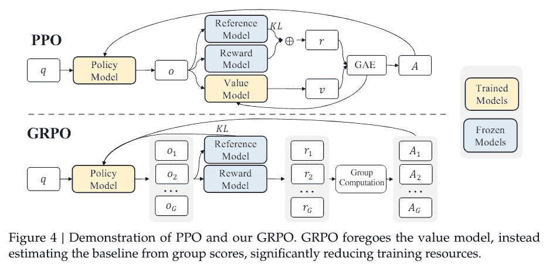

# 揭秘 RL 中的策略优化：PPO 和 GRPO 简介

> 原文：[`towardsdatascience.com/demystifying-policy-optimization-in-rl-an-introduction-to-ppo-and-grpo/`](https://towardsdatascience.com/demystifying-policy-optimization-in-rl-an-introduction-to-ppo-and-grpo/)

## 简介

<mdspan datatext="el1747093661926" class="mdspan-comment">现代强化学习（RL）在教会智能体解决复杂任务方面取得了显著的成功，从掌握 Atari 游戏和围棋到训练有用的语言模型。许多这些进步背后的两个重要技术是被称为**近端策略优化（PPO）**的**策略优化**算法和较新的**广义强化策略优化（GRPO）**。在这篇文章中，我们将解释这些算法是什么，为什么它们很重要，以及它们是如何工作的——用初学者友好的术语。我们将从强化学习和策略梯度方法的快速概述开始，然后介绍 GRPO（包括其动机和核心思想），并深入探讨 PPO 的设计、数学和优势。在这个过程中，我们将比较 PPO（和 GRPO）与其他流行的 RL 算法，如 DQN、A3C、TRPO 和 DDPG。最后，我们将查看一些代码，以了解 PPO 在实际中的应用。让我们开始吧！

**背景：强化学习和策略梯度**

强化学习是一个框架，其中**智能体**通过与环境交互并通过试错来学习。智能体观察环境的状况，采取**行动**，然后接收**奖励**信号，并可能获得一个新的状态。随着时间的推移，通过尝试行动并观察奖励，智能体调整其行为以最大化它收到的累积奖励。这个*状态 → 行动 → 奖励 → 下一个状态*的循环是 RL 的精髓，智能体的目标是发现一个好的**策略**（基于状态的行动选择策略），从而获得高奖励。

在**基于策略**的强化学习方法（也称为**策略梯度**方法）中，我们直接优化智能体的策略。与基于价值的策略（如 Q 学习）中为每个状态或状态-动作学习“价值”估计不同，策略梯度算法调整策略的参数（通常是神经网络）以改善性能的方向。一个经典的例子是 REINFORCE 算法，它按比例更新策略参数，以对数策略的奖励加权的梯度为依据。在实践中，为了减少方差，我们在计算梯度时使用**优势**函数（在状态 s 中采取动作 a 相对于平均奖励的额外奖励）或基线（如价值函数）。这导致了**演员-评论家**方法，其中“演员”是正在学习的策略，“评论家”是一个价值函数，它估计状态（或状态-动作对）的好坏，为演员的更新提供基线。许多高级算法，包括 PPO，都属于这个演员-评论家家族：它们维护一个策略（演员）并使用学习到的价值函数（评论家）来帮助策略更新。

**广义强化策略优化（GRPO**）

策略优化中的一项新进展是**广义强化策略优化（GRPO）**——有时在文献中被称为**组相对策略优化**。GRPO 最近的研究（特别是 DeepSeek 团队的研究）中提出，旨在解决 PPO 在训练大型模型（如用于推理的语言模型）时的一些局限性。在本质上，GRPO 是策略梯度强化学习的一个变体，**消除了对单独的评论家/价值网络的需求**，并通过比较一组动作结果来优化策略。

**动机**：为什么去掉评论家？在复杂环境中（例如，长文本生成任务），训练价值函数可能很困难且资源密集。通过“放弃评论家”，GRPO 避免了学习准确价值模型带来的挑战，并且由于我们不需要为评论家维护额外的模型参数，因此节省了大约一半的内存/计算。这使得在内存受限的环境中强化学习训练更加简单和可行。事实上，GRPO 已被证明将强化学习从人类反馈的计算需求减少了近一半，与 PPO 相比。

**核心思想：** 与依赖评论家告诉我们每个动作的好坏不同，GRPO 通过**比较多个动作的相对结果**来评估策略。想象一下，代理（策略）为相同的状态（或提示）生成一组可能的输出，这些输出由环境或奖励函数评估，产生奖励。GRPO 随后根据其奖励与其他奖励的比较，为每个动作计算一个优势。一种简单的方法是取每个动作的奖励减去组平均奖励（可选地除以组的奖励标准差以进行归一化）。这告诉我们哪些动作比平均水平做得更好，哪些做得更差。然后，策略被更新以赋予比平均水平更好的动作更高的概率，赋予较差的动作更低概率。本质上，*“模型学习变得更像被标记为正确答案的答案，而不是其他答案”*。

这在实际中看起来如何？结果发现，GRPO 中的**损失/目标**看起来与 PPO 的非常相似。GRPO 仍然使用“替代”目标的概念，使用概率比率（我们将在 PPO 下解释这一点），甚至使用相同的剪辑机制来限制策略在一次更新中的移动距离。关键的区别在于，**优势是从基于组的相对奖励而不是单独的价值估计器计算出来的**。此外，GRPO 的实现通常在损失中包含一个 KL 散度项，以保持新策略接近参考（或旧）策略，类似于 PPO 的可选 KL 惩罚。

PPO vs. GRPO — **顶部：** 在 PPO 中，代理的*策略模型*在辅助一个单独的*价值模型*（评论家）的帮助下进行训练，以估计优势，同时还有一个*奖励模型*和一个固定的*参考模型*（用于 KL 惩罚）。**底部：** GRPO 移除了价值网络，而是通过简单的“组计算”比较同一输入的一组采样结果的奖励分数来计算优势。策略更新随后使用这些相对分数作为优势信号。通过移除价值模型，GRPO 显著简化了训练流程并减少了内存使用，但代价是每次更新需要使用更多的样本（以形成组）。



图片来源：[`arxiv.org/pdf/2402.03300`](https://arxiv.org/pdf/2402.03300)

总结来说，GRPO 可以看作是一个没有学习评论家的类似 PPO 的方法。它在价值函数学习困难时，以牺牲一些样本效率（因为它需要从相同状态获取多个样本来比较奖励）为代价，换取**更大的简单性和稳定性**。最初是为大型语言模型训练和人类反馈（在获取可靠的价值估计很困难的情况下）设计的，GRPO 的想法更普遍地适用于其他 RL 场景，在这些场景中，可以在一批动作之间进行相对比较。通过高层次地理解 GRPO，我们也为理解 PPO 奠定了基础，因为 GRPO 本质上建立在 PPO 的基础上。

**近端策略优化（PPO）**

现在，让我们转向**近端策略优化（PPO）**——现代 RL 中最受欢迎和最成功的策略梯度算法之一。2017 年，OpenAI 提出了 PPO 作为对实际问题的回答：*我们如何尽可能多地使用我们拥有的数据来更新 RL 智能体，同时确保我们不会通过做出太大的改变而使训练不稳定？*换句话说，我们希望有大的改进步骤，而不会在性能上“跌入悬崖”。它的前辈，如信任区域策略优化（TRPO），通过强制执行策略更新的硬约束（使用复杂的二阶优化）来解决这个问题。PPO 以更简单的方式实现了类似的效果——使用巧妙剪裁的目标的一阶梯度更新——这更容易实现，并且在经验上同样出色。

在实践中，PPO 被实现为一个**策略-评论家算法**。一个典型的 PPO 训练迭代过程如下：

1.  在环境中运行当前策略以收集一批轨迹（状态、动作、奖励序列）。例如，玩 2048 步的游戏或让智能体模拟几个回合。

1.  使用收集到的数据计算每个状态-动作的优势（通常使用**广义优势估计（GAE）**或类似方法将评论家的价值预测与实际奖励相结合）。

1.  通过最大化上述 PPO 目标（通常通过梯度上升，在实践中意味着在收集的批次上进行几个随机梯度下降的周期）来更新策略。

1.  可选地，通过最小化价值损失来更新价值函数（评论家），因为 PPO 通常同时训练评论家以改进优势估计。

由于 PPO 是策略算法（它使用来自当前策略的新数据为每次更新），它放弃了像 DQN 这样的离策略算法的样本效率。然而，PPO 通常通过其稳定性和可扩展性来弥补这一点，它易于并行化（从多个环境实例收集数据）且不需要复杂的经验回放或目标网络。它已被证明在许多领域（如机器人、游戏等）中具有鲁棒性，并且相对需要最小的超参数调整。实际上，由于其可靠性，PPO 已成为许多强化学习问题的默认选择。

**PPO 变体:** 原始论文中讨论了 PPO 的两个主要变体[s](https://spinningup.openai.com/en/latest/algorithms/ppo.html#:~:text=There%20are%20two%20primary%20variants,Clip)：

+   *PPO-penalty:* 这会在目标函数中添加一个与新旧策略之间的 KL 散度成比例的惩罚（并在训练过程中调整这个惩罚系数）。这在精神上更接近 TRPO 的方法（通过显式惩罚来保持 KL 值小）。

+   *PPO-clip:* 这是我们上面提到的使用裁剪目标函数而没有显式 KL 项的变体。这无疑是更受欢迎的版本，也是人们通常所说的“PPO”所指。

这两个变体都旨在限制策略变化；PPO-clip 因其简单性和强大的性能而成为标准。PPO 通常还包括熵奖励正则化（通过不让策略过于快速地变得确定性来鼓励探索）和其他实用调整，但这些细节超出了我们讨论的范围。

**PPO 受欢迎的原因 – 优点:** 总结来说，PPO 提供了一种令人信服的**稳定性**和**简单性**的结合。由于裁剪更新，它不容易在训练过程中崩溃或发散，而且它比旧的有界区域方法更容易实现。研究人员和从业者已经使用 PPO 从控制机器人到训练游戏智能体等一切事情。值得注意的是，经过轻微修改的 PPO 被用于 OpenAI 的**InstructGPT**和其他大型规模基于人类反馈的 RL 项目，以微调语言模型，因为其在处理高维动作空间（如文本）方面的稳定性。它可能不是每个任务上绝对最有效的样本效率或最快学习的算法，但在不确定的情况下，PPO 通常是一个可靠的选择。

## PPO 和 GRPO 与其他 RL 算法的比较

为了更清晰地理解，让我们简要地比较一下 PPO（以及由此扩展的 GRPO）与其他一些流行的强化学习算法，并突出它们之间的关键差异：

+   **DQN (深度 Q 网络，2015):** DQN 是一种基于价值的**方法**，而不是政策梯度。它通过深度神经网络学习离散动作的 Q 值函数，策略隐式地是“选择具有最高 Q 值的动作”。DQN 使用技巧，如经验**重放缓冲区**（以重用过去经验并打破相关性）和**目标网络**（以稳定 Q 值更新）。与 PPO（按策略并直接更新参数化策略）不同，DQN 是离策略的，并且根本不参数化策略（策略对 Q 是贪婪的）。PPO 通常比 DQN 更好地处理大型或连续的动作空间，而 DQN 在离散问题（如 Atari）中表现出色，并且由于重放，可以更有效地使用样本。

+   **A3C (异步优势演员-评论家，2016):** A3C 是一个较早的政策梯度/演员-评论家算法，它使用多个并行工作的代理来收集经验和异步更新全局模型。每个工作代理在自己的环境实例上运行，并将它们的更新聚合到一组中心参数中。这种并行性解耦了数据并加速了学习，与单个代理顺序运行相比有助于稳定训练。A3C 使用优势演员-评论家更新（通常带有 n 步回报），但没有 PPO 的显式“剪辑”机制。实际上，PPO 可以被视为 A3C/A2C 理念的演变——它保留了按策略的优势演员-评论家方法，但添加了代理剪辑来提高稳定性。经验上，PPO 往往优于 A3C，正如它在许多 Atari 游戏中表现的那样，由于更有效地使用批量更新（A2C 是 A3C 的同步版本，加上 PPO 的剪辑等于强大的性能），其训练时间大大减少。现在 A3C 的异步方法不太常见，因为你可以通过批处理环境和稳定的算法（如 PPO）实现类似的好处。

+   **TRPO (信任区域策略优化，2015):** TRPO 是 PPO 的直接前身。它引入了在策略更新上施加“信任区域”约束的想法，通过强制执行它们之间 KL 散度的约束，确保新策略不会离旧策略太远。TRPO 使用复杂的优化（通过共轭梯度求解具有 KL 约束的约束优化问题）并需要计算近似二阶梯度。它在实现更大策略更新而不混乱方面是一个突破，并且比传统的策略梯度提高了稳定性和可靠性。然而，TRPO 的实现比较复杂，由于二阶数学的原因可能会更慢。PPO 作为一种更简单、更高效的替代方案诞生，它使用一阶方法实现了类似的结果。PPO 要么将硬 KL 约束软化成惩罚，要么用 clip 方法替换它。因此，PPO 更容易使用，并且在实践中在很大程度上取代了 TRPO。在性能方面，PPO 和 TRPO 通常能实现可比的回报，但 PPO 的简单性使其在开发速度上具有优势。（在 GRPO 的上下文中：GRPO 的更新规则本质上类似于 PPO 的更新，因此它也受益于这些见解，而无需 TRPO 的机制）。

+   **DDPG (深度确定性策略梯度，2015):** DDPG 是一种用于连续动作空间的**离策略 actor-critic**算法。它结合了 DQN 和策略梯度的思想。DDPG 维护两个网络：一个 critic（类似于 DQN 的 Q 函数）和一个确定性输出动作的 actor。在训练过程中，DDPG 使用重放缓冲区和目标网络（类似于 DQN）以提高稳定性，并使用 Q 函数的梯度来更新 actor（因此称为“确定性策略梯度”）。简单来说，DDPG 通过使用可微的策略（actor）来选择动作，将 Q 学习扩展到连续动作，并通过 Q critic 的梯度学习该策略。缺点是像 DDPG 这样的离策略 actor-critic 方法可能会有些挑剔——它们可能会陷入局部最优或在没有仔细调整的情况下发散（后来开发了 TD3 和 SAC 等改进来克服 DDPG 的一些弱点）。与 PPO 相比，DDPG 可能更节省样本（重放经验）并且可以收敛到在无噪声环境中可能最优的确定性策略，但 PPO 的在线性质和随机策略使其在需要探索的环境中更稳健。在实践中，对于连续控制任务，如果调整得当，可能会选择 PPO 以获得便利性和稳健性，或者选择 DDPG/TD3/SAC 以获得效率和性能。

总结来说，**PPO（和 GRPO）与其他方法的比较**：PPO 是一种基于策略的策略梯度方法，专注于稳定的更新，而 DQN 和 DDPG 是离策略的价值或演员-评论家方法，专注于样本效率。A3C/A2C 是较早的基于策略的演员-评论家方法，引入了多环境训练等有用的技巧，但 PPO 在稳定性方面进行了改进。TRPO 为安全策略更新奠定了理论基础，而 PPO 使其变得实用。GRPO 作为 PPO 的衍生品，与 PPO 具有相同的优势，但通过移除价值函数进一步简化了流程，使其成为在像大规模语言模型训练这样的场景中，使用价值网络可能存在问题的有趣选择。每种算法都有自己的利基市场，但 PPO 的通用可靠性是它在许多比较中经常成为基线选择的原因。

## PPO 实践：代码示例

为了巩固我们的理解，让我们快速看一下如何在实际中应用 PPO 的一个例子。我们将使用一个流行的 RL 库（Stable Baselines3）并在一个经典控制任务（CartPole）上训练一个简单的智能体。这个例子将在 Python 中使用 PyTorch 作为底层，但你不需要自己实现 PPO 更新方程——库会处理这些。

在上面的代码中，我们首先创建了 CartPole 环境（一个经典的平衡杆玩具问题）。然后，我们创建了一个具有 MLP（多层感知器）策略网络的`PPO`模型。在底层，这设置了策略（演员）和价值函数（评论家）网络。调用`model.learn(...)`启动训练循环：智能体将与环境交互，收集观察结果，计算优势，并使用 PPO 算法更新其策略。`verbose=1`只是打印出训练进度。训练完成后，我们进行快速测试：智能体使用其学习到的策略（`model.predict(obs)`）来选择动作，我们通过环境来观察其表现。如果一切顺利，CartPole 应该能够平衡相当多的步数。

```py
import gymnasium as gym
from stable_baselines3 import PPO

env = gym.make("CartPole-v1")

model = PPO(policy="MlpPolicy", env=env, verbose=1)

model.learn(total_timesteps=50000)

# Test the trained agent
obs, _ = env.reset()
for step in range(1000):
    action, _state = model.predict(obs, deterministic=True)
    obs, reward, terminated, truncated, info = env.step(action)
    if terminated or truncated:
        obs, _ = env.reset()
```

这个例子故意设计得简单且具有通用性。在更复杂的环境中，你可能需要调整超参数（如剪辑、学习率或使用奖励归一化）以使 PPO 能够良好工作。但高级使用方法保持不变：定义你的环境，选择 PPO 算法，然后进行训练。PPO 的相对简单性意味着你不需要调整重放缓冲区或其他机制，这使得它成为许多问题的便捷起点。

## 结论

在这篇文章中，我们通过**PPO**和**GRPO**的视角探讨了强化学习中策略优化的领域。我们首先回顾了 RL 的工作原理以及为什么策略梯度方法对于直接优化决策策略是有用的。然后我们介绍了**GRPO**，了解了它如何放弃评论家角色，而是从一组动作中的相对比较中学习——这种策略在某些设置中带来了效率和简单性。我们深入研究了**PPO**，理解了其剪裁代理目标以及为什么这有助于保持训练稳定性。我们还将这些算法与其他知名方法（DQN、A3C、TRPO、DDPG）进行了比较，以突出何时以及为什么可能会选择 PPO/GRPO 这样的策略梯度方法而不是其他方法。

PPO 和 GRPO 都是现代 RL 中的一个核心主题的例证：**找到在避免不稳定性的同时实现大学习改进的方法**。PPO 通过温和的推动（剪裁更新）来实现这一点，而 GRPO 则通过简化我们学习的内容（没有价值网络，只有相对奖励）来实现。随着你继续你的 RL 之旅，请记住这些原则。无论你是训练游戏代理还是对话 AI，方法如 PPO 已经成为了首选的得力工具，而像 GRPO 这样的新变体表明，在稳定性和效率方面仍有创新的空间。

**来源：**

1.  [Sutton, R. & Barto, A. *强化学习：入门*. (RL 基础知识背景)](https://web.stanford.edu/class/psych209/Readings/SuttonBartoIPRLBook2ndEd.pdf)

1.  [Schulman 等人 *近端策略优化算法*. arXiv:1707.06347](https://arxiv.org/abs/1707.06347) (PPO 原始论文)。

1.  [OpenAI Spinning Up – *PPO*](https://spinningup.openai.com/en/latest/algorithms/ppo.html) (PPO 解释和公式)。

1.  [RLHF 手册 – *策略梯度算法*](https://rlhfbook.com/c/11-policy-gradients.html) (GRPO 公式的细节和直觉)。

1.  [Stable Baselines3 文档(DQN 描述)](https://stable-baselines3.readthedocs.io/en/v1.0/modules/dqn.html) (PPO 与其他方法的比较)。
