# 将 OpenAI Agent Builder Chatbot 部署到你的网站

> 原文：[`towardsdatascience.com/deploy-an-openai-agent-builder-chatbot-to-a-website/`](https://towardsdatascience.com/deploy-an-openai-agent-builder-chatbot-to-a-website/)

<mdspan datatext="el1761240166455" class="mdspan-comment">OpenAI 最近的开发者日**主要**是由其新的代理工作流程产品 Agent Builder 主导。它允许你通过简单易用的图形用户界面创建代理过程。它理所当然地获得了大部分关注，但工作流程过程的另一面——部署——却受到了较少的关注。

我们所拥有的只是屏幕和代码的短暂一瞥，并且没有真正解释如何将使用 Agent Builder 构建的代理集成到自己的或企业的网站或应用程序中。

这就是 OpenAI 的另一个代理构建工具 Chatkit 应该出现的地方。它是一个与 Agent builder 一样重要的产品，甚至可能更重要。

为什么？那是因为 ChatKit 用于将使用 Agent builder 创建的任何代理过程部署到现实世界的 Web 应用程序和页面上。

你可能觉得不用担心，我会去阅读 OpenAI 关于 ChatKit 的文档。祝你好运。除了写得不好之外，它还需要相当多的编程知识以及对 GitHub 和其它技术流程的理解。

在本文的剩余部分，我将详细说明如何将使用 OpenAI 的 Agent Builder 构建的代理部署到公开可访问的网站上的具体步骤。

## 我们将要做什么

这篇文章将是你的**“缺失手册”**，关于 Agent Builder 部署。我们将首先创建两个简单的网站，一个使用 Lovable，另一个使用 HuggingFace (HF) spaces，并将它们部署到万维网上。

之后，我们将使用 OpenAI 的 Agent Builder 开发一个聊天机器人代理。然后，我们将使用 Agent Builder ChatKit 将其部署到我们新的 Lovable 和 HF 网站上。

## 你需要什么

有几个先决条件，但其中大部分都是免费的。

1.  OpenAI 账户和 API 密钥（付费计划）

1.  一个 Vercel 账户（免费）

1.  一个 HuggingFace 账户（免费）

1.  一个测试网站（免费和/或付费）

## ChatKit 部署

我们需要采取几个步骤，但它们都不复杂。慢慢来，按步骤有序进行，你会没事的。

### 第 1 步——创建我们的测试网站

如果你已经拥有一个网站并且可以编辑/更改其背后的代码，请随意使用这个工具。

否则，你可以使用像[lovable.dev](https://lovable.dev?via=tom-reid)这样的工具，它不仅可以为你创建网站，还可以使用它自己的域名或你提供的自定义域名将其部署到网络上。

> 注意，上面的 lovable 链接是一个联盟链接，这意味着如果你通过它注册付费计划，我会得到一小笔佣金。

这是我给 Lovable 的提示：

```py
I want a simple "Hello world" type  javascript, css, html react page
```

Lovable 大约需要 15 秒来生成一个网站，我使用 Lovable 的一个示例域名进行了部署。以下是它生成的结果。我将在文章末尾放置一个网站链接。

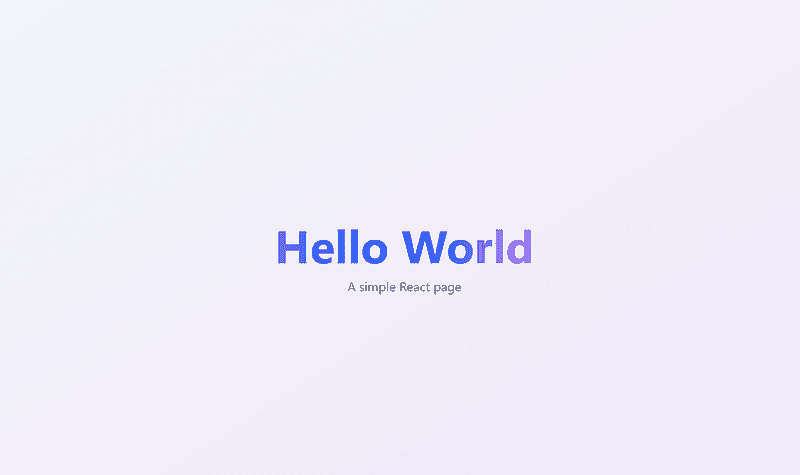

图片由作者提供

对于预算紧张的人来说，创建网页的一个免费选项是使用 HuggingFace (HF) Spaces。以下是如何操作的步骤。

+   创建一个 HF 账户并登录。

+   点击主页顶部的**Spaces**链接，然后点击页面右上角的**新建空间**按钮。

+   填写空间名称，选择许可证类型，并为 SDK 选择**‘静态’**，为模板选择**‘空白’**，为硬件选择**‘CPU 基本’**，为范围选择**‘公共’**。

+   当您准备好时，点击屏幕底部的**创建空间**按钮。您应该会看到一个类似这样的屏幕出现，

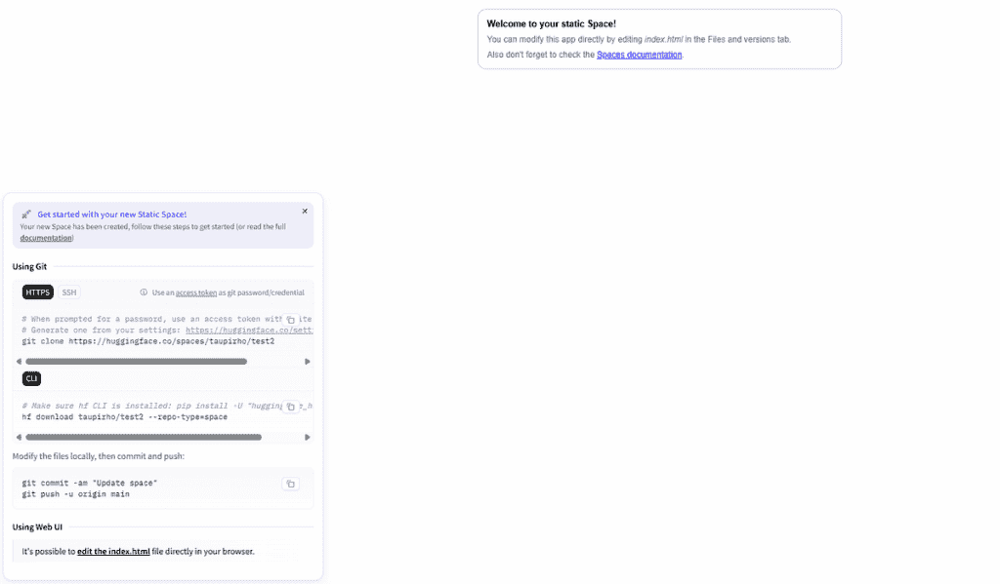

图片由作者提供

您的 HF 网站 URL 链接可能如下所示：

```py
https://huggingface.co/spaces/{Your_HF_username}/{your_HF_space_name}
```

到目前为止，您应该至少有一个可以公开访问的网站，您可以将代理构建器代理集成到该网站中。但首先，我们需要一个代理。

### 第 2 步—创建 OpenAI 代理构建器聊天机器人代理

我不会在这个步骤上花费太多时间，因为网上有大量关于如何操作的教程和演示。此外，OpenAI 团队在他们的开发者日上也很好地覆盖了这部分内容。

然而，我的代理构建器尽可能简单。它将是一个包含仅两个节点的简单聊天机器人：一个起始节点和一个代理节点。实际上，如果你在代理构建器主页上点击创建按钮，你将得到默认的设置。我对代理节点所做的唯一其他更改是选择 GPT5-nano 作为我的代理 LLM，并将代理指令更新为如下：

> 你是一位有用的助手。告诉用户关于提议主题的一个有趣事实，然后讲一个关于该主题的“爸爸笑话”

这里是一个聊天示例。

```py
Tell me an interesting fact about dogs 

Interesting fact: Dogs can "smell in stereo." They draw different scent 
information into each nostril, helping them locate the direction of an 
odor in 3D space. With up to ~300 million olfactory receptors 
(humans have ~6 million), some dogs can detect substances at 
parts-per-trillion-roughly like finding a teaspoon of sugar in two 
Olympic-sized pools. 

Joke: Why did the dog sit in the shade? Because he didn't want to 
be a hot dog!
```

要创建自己的代理，请转到[`platform.openai.com/agent-builder`](https://platform.openai.com/agent-builder)。根据您为代理选择的 LLM 模型，您可能还需要在运行任何代理之前通过身份验证，请记住这一点。

> 注意：请注意您在创建代理时使用的项目名称。它位于代理构建器主页的左上角。在创建我们的 OpenAI API 密钥时，我们需要这个项目名称，因为创建 API 密钥的项目**必须**与构建代理的项目相匹配。我所有的任务都是在**默认项目**下进行的。

点击页面右上角的**预览**按钮，以确保您的代理按预期工作。当您满意时，点击页面右上角附近的**发布**按钮。填写您代理的名称，然后再次点击发布按钮。这样做时，会出现一个类似这样的弹出窗口：

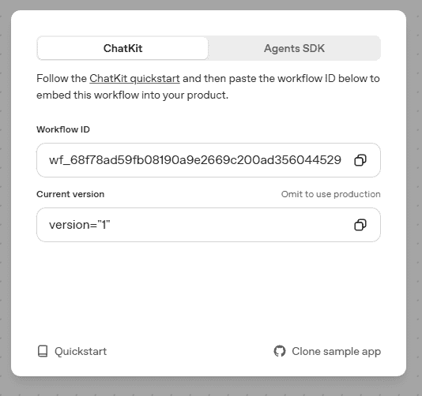

图片来自 OpenAI 网站

您稍后需要工作流程 ID，所以请现在就记下来。同时，注意弹出窗口底部附近的**克隆示例应用**链接。我们将在下一步中使用它。

### 第 3 步—将 OpenAI 的示例 ChatKit 应用程序分支到您自己的 GitHub 存储库

为了帮助使用 ChatKit 部署代理，OpenAI 在 GitHub 存储库中提供了一些示例入门套件代码。我们需要将其应用程序（即复制它）分支到我们自己的 GitHub 存储库中，并将其部署到网络上。

在部署阶段，我们将使用 Vercel。Vercel 是一个用于部署和托管 Web 应用的云平台。

要分支 OpenAI 应用程序，请使用步骤 2 中的弹出窗口中的**克隆示例应用**链接。这将带您到适当的 OpenAI GitHub 页面。现在，点击存储库中的**Fork**按钮。它在绿色**代码**按钮的上方和右侧。

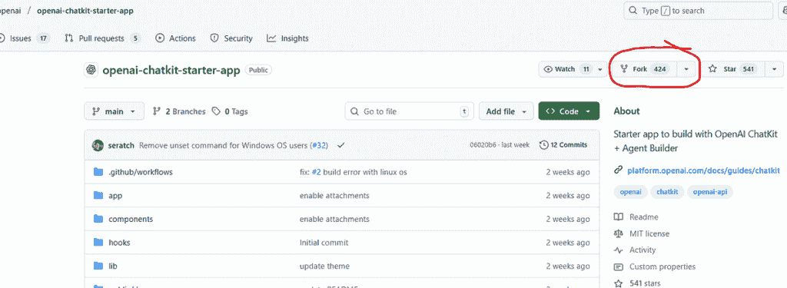

来自 OpenAI GitHub 存储库的图片

如果您愿意，您将被提示输入新存储库的名称，或者您也可以将其保留为默认设置。

### 第 4 步—将您对 OpenAI 的示例 ChatKit 应用程序的分支部署到 Vercel

如果您还没有 Vercel 账户，您将需要此步骤。对于我们将要展示的有限示例，设置和使用 Vercel 账户是免费的。请访问 [`vercel.com`](https://vercel.com) 并立即创建您的账户。

一旦您登录，请转到仪表板并点击**添加新项目**按钮以开始一个新的项目。您可以在页面左上角极左位置的用户个人资料图标下方找到仪表板的链接。

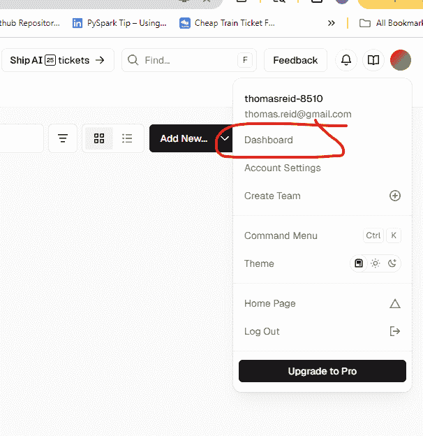

来自 Vercel 网站的图片

第一次时，您需要授权 Vercel 访问您的 GitHub 账户，因此请点击**使用 GitHub 继续操作**按钮。然后您将被要求授权 Vercel。选择允许 Vercel 访问您所有的存储库或单个存储库。一旦完成，您就能将您的 GitHub 存储库导入 Vercel。导入完成后，最终阶段是部署。但在您继续之前，您需要添加几个环境变量。执行此操作的链接就在部署按钮上方。

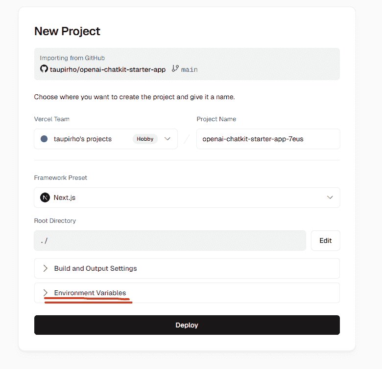

来自 Vercel 网站的图片

您需要添加的环境变量如下：

`OPENAI_API_KEY`—这必须是在与您的 Agent Builder 相同的项目中创建的 API 密钥。要获取您的 API 密钥，请转到

[`platform.openai.com/api-keys`](https://platform.openai.com/api-keys)

创建或重用 API 密钥，**确保项目名称与 Agent Builder 中的名称匹配**。

`NEXT_PUBLIC_CHATKIT_WORKFLOW_ID`—这是您在 Agent Builder 中创建的工作流程的 ID，以 wf_ 开头…

之后，您可以在 Vercel 上点击**部署**按钮。这可能需要一分钟左右，但一旦完成，我们就可以测试我们的聊天机器人。一旦部署完成，返回您的 Vercel 仪表板。确保您在正确的项目上，您应该看到一个标记为**访问**的按钮，这将带您到您的 ChatBot。在我们点击它之前，我们还有一件事要做。我们必须让 OpenAI 知道我们 Vercel 上聊天机器人应用的域名，出于安全原因。

复制您项目的 Vercel ***域名*** URL 并返回到您的 OpenAI 代理构建项目。

接下来，点击屏幕右上角附近的代码按钮以显示 Chatkit 详情弹出窗口。点击**“添加域名”**按钮。在出现的迷你弹出屏幕中，将 Vercel 域名 URL 输入到字段中，然后点击**“生成密钥”**按钮。

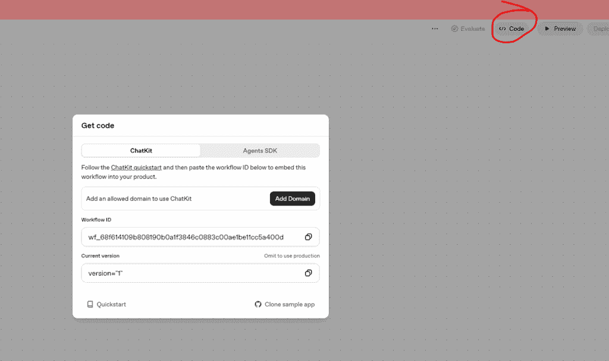

图片来自 OpenAI 网站

现在，回到 Vercel，点击**“访问”**按钮来测试您的聊天应用。这是我看起来像这样的。

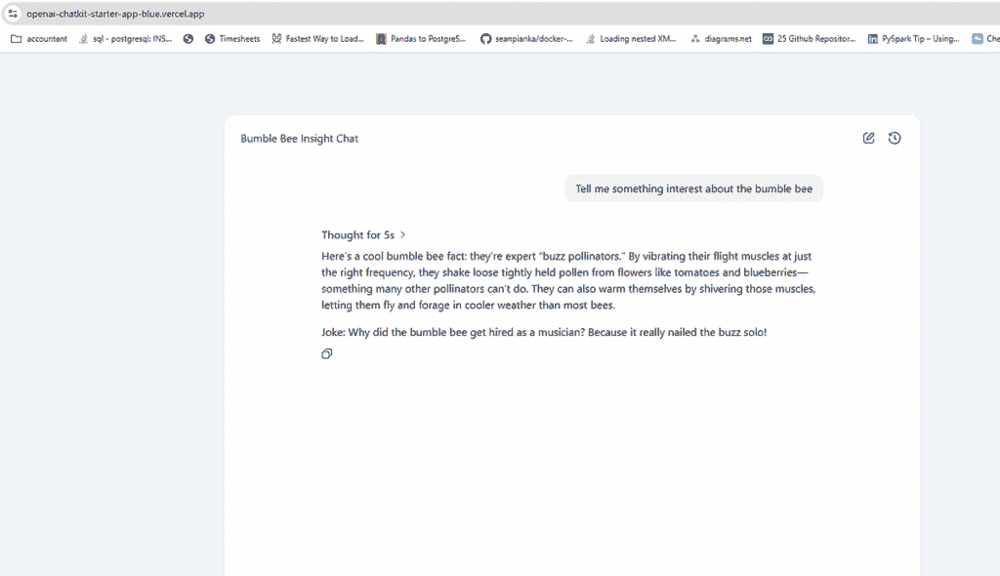

图片由作者提供

### 第 5 步—修改我们原始的 Lovable 和 HuggingFace 网站以集成新的聊天机器人。

这是我们的最后一步，涉及到生成我们可以插入我们自己的网页中的嵌入代码。我们通过修改我们 Web 应用的 index.html 文件来实现这一点。我让 ChatGPT 创建我们需要注入的代码。

您可以从 Vercel 仪表板获取聊天机器人的域名 URL。

这里是我的 ChatGPT 对话。用您自己的域名 URL 替换我的域名 URL。

```py
This is the domain URL of my chatbot: openai-chatkit-starter-app-blue.vercel.app 
I want some deployment code to go in my website's index.html page in the 
HEAD section that will enable me to run the chatbot on my website
```

GPT 的响应如下。

```py
Perfect 👌 - since your chatbot is hosted at 

https://openai-chatkit-starter-app-blue.vercel.app

the cleanest way to embed it in your website is to use an <iframe> and inject the embed script in your <head> so the widget loads automatically when your page loads. 

Below is a simple copy-paste snippet you can put inside the <head> of your index.html file. 
It creates a floating chat bubble in the bottom-right corner that opens your chatbot in an iframe panel: 

📄 Add this inside <head> of your index.html: 

<!-- Chatbot Embed --> 
<style> 
 .chat-fab { 
   position: fixed; 
   right: 20px; 
   bottom: 20px; 
   width: 56px; 
   height: 56px; 
   border-radius: 50%; 
   border: none; 
   cursor: pointer; 
   background: #111; 
   color: #fff; 
   font-size: 24px; 
   box-shadow: 0 6px 15px rgba(0,0,0,0.25); 
   z-index: 10000; 
 } 

 .chat-panel { 
   position: fixed; 
   right: 20px; 
   bottom: 90px; 
   width: 400px; 
   height: 600px; 
   max-width: calc(100% - 40px); 
   transform: translateY(20px); 
   opacity: 0; 
   pointer-events: none; 
   transition: opacity .2s ease, transform .2s ease; 
   border-radius: 12px; 
   overflow: hidden; 
   box-shadow: 0 12px 30px rgba(0,0,0,.25); 
   background: #fff; 
   z-index: 10000; 
 } 

 .chat-panel.open { 
   opacity: 1; 
   transform: translateY(0); 
   pointer-events: auto; 
 } 

 .chat-header { 
   height: 44px; 
   display: flex; 
   align-items: center; 
   justify-content: space-between; 
   padding: 0 12px; 
   background: #111; 
   color: #fff; 
   font: 14px/1.2 system-ui, sans-serif; 
 } 

 .chat-iframe { 
   border: 0; 
   width: 100%; 
   height: calc(100% - 44px); 
   display: block; 
 } 

 .chat-close { 
   background: none; 
   border: 0; 
   color: #fff; 
   font-size: 18px; 
   cursor: pointer; 
 } 
</style> 

<script> 
 document.addEventListener('DOMContentLoaded', function () { 
   const fab = document.createElement('button'); 
   fab.className = 'chat-fab'; 
   fab.textContent = '💬'; 
   fab.setAttribute('aria-label', 'Open chat'); 

   const panel = document.createElement('div'); 
   panel.className = 'chat-panel'; 
   panel.setAttribute('aria-hidden', 'true'); 

   const header = document.createElement('div'); 
   header.className = 'chat-header'; 
   header.innerHTML = `<span>Chatbot</span>`; 

   const closeBtn = document.createElement('button'); 
   closeBtn.className = 'chat-close'; 
   closeBtn.textContent = '✕'; 
   closeBtn.setAttribute('aria-label', 'Close chat'); 

   closeBtn.addEventListener('click', () => { 
     panel.classList.remove('open'); 
     panel.setAttribute('aria-hidden', 'true'); 
   }); 

   const iframe = document.createElement('iframe'); 
   iframe.className = 'chat-iframe'; 
   iframe.src = 'https://openai-chatkit-starter-app-blue.vercel.app'; 
   iframe.allow = 'clipboard-write; microphone; camera'; 
   iframe.referrerPolicy = 'strict-origin-when-cross-origin'; 

   header.appendChild(closeBtn); 
   panel.appendChild(header); 
   panel.appendChild(iframe); 
   document.body.appendChild(fab); 
   document.body.appendChild(panel); 

   fab.addEventListener('click', () => { 
     panel.classList.add('open'); 
     panel.setAttribute('aria-hidden', 'false'); 
   }); 
 }); 
</script> 
<!-- End Chatbot Embed -->
```

我将上述代码手动编辑了我仓库中的 index.html 文件，这是 Lovable 在生成我的原始网页时创建的。我将上述嵌入代码插入到 index.html 文件的<head>部分，并保存了文件内容。之后，我将仓库重新部署到了我的域名上，您可以看到下面的结果。正如预期的那样，在页面的右下角创建了一个小话泡图标，当我点击这个图标时，聊天机器人对话框屏幕出现，我能够与之互动。

**Lovable** [`little-react-wave.lovable.app/`](https://little-react-wave.lovable.app/)

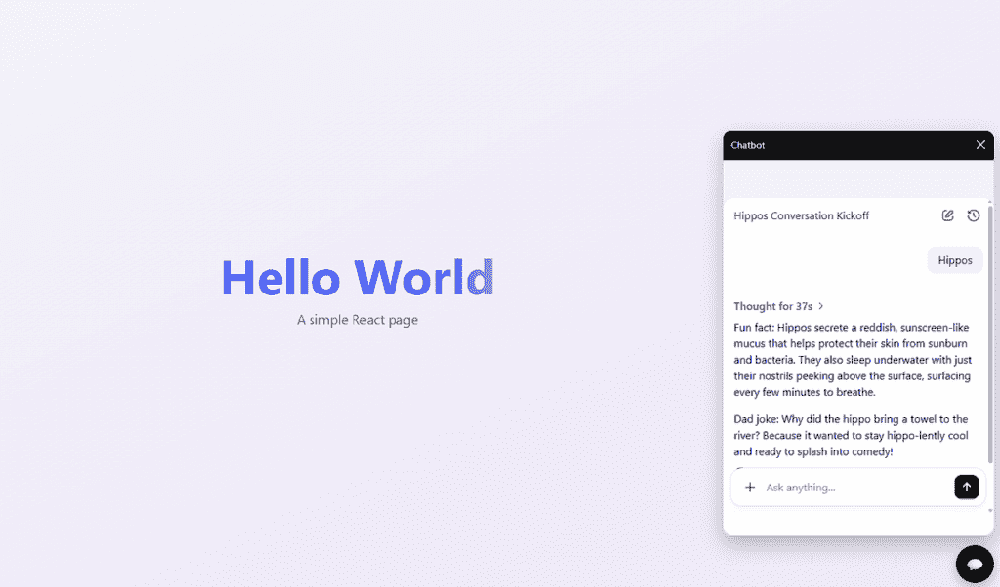

图片由作者提供

我在我的 HuggingFace 网页上也进行了类似的操作。您可以通过点击您空间中的**文件**链接，然后点击显示的 index.html 文件链接来编辑您 HF 网站上的 index.html 文件。

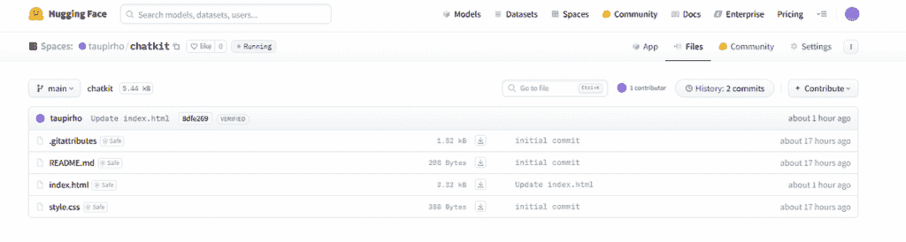

图片由作者提供

我将相同的嵌入代码添加到了我的 HF index.html 文件中，就像我在 lovable 中做的那样，并在提交更改后，我的新网页如下所示，具有相同的聊天机器人图标和功能。

**Hugging Face** [`huggingface.co/spaces/taupirho/chatkit`](https://huggingface.co/spaces/taupirho/chatkit)

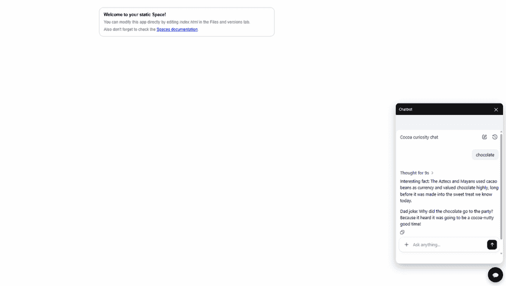

图片由作者提供

还不错！
