# 使用 Claude 和 MCP 部署您的 AI 助手以监控和调试 n8n 工作流程

> 原文：[`towardsdatascience.com/deploy-your-ai-assistant-to-monitor-and-debug-n8n-workflows-using-claude-and-mcp/`](https://towardsdatascience.com/deploy-your-ai-assistant-to-monitor-and-debug-n8n-workflows-using-claude-and-mcp/)

<mdspan datatext="el1762979931296" class="mdspan-comment">如果您曾经在生产中部署过</mdspan> n8n 工作流程，您知道听到一个流程失败并需要挖掘日志以找到根本原因的压力。

> 用户：Samir，你的自动化不再工作，我没有收到通知！

第一步是打开你的 n8n 界面并回顾最近的执行以识别问题。

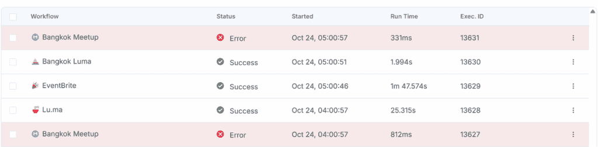

夜间失败的典型工作流程示例 – (图片由 Samir Saci 提供)

几分钟后，你发现自己正在在不同的执行之间跳转，比较时间戳并阅读 JSON 错误，以了解问题出在哪里。

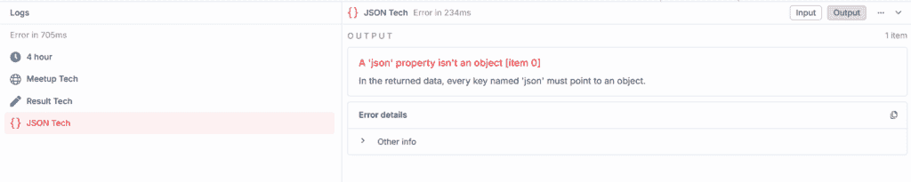

失败执行的调试示例 – (图片由 Samir Saci 提供)

> 如果代理能够告诉你为什么你的工作流程在凌晨 3 点失败，而你不必挖掘日志，那会怎么样？

这是可能的！

作为实验，我将提供访问我的实例执行日志的 n8n API 连接到由 Claude 驱动的 MCP 服务器。

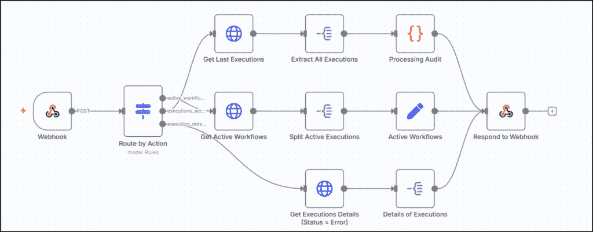

使用 webhook 从我的实例收集信息的 n8n 工作流程 – (图片由 Samir Saci 提供)

结果是一个能够监控工作流程、分析失败并使用自然语言解释发生什么错误的 AI 助手。

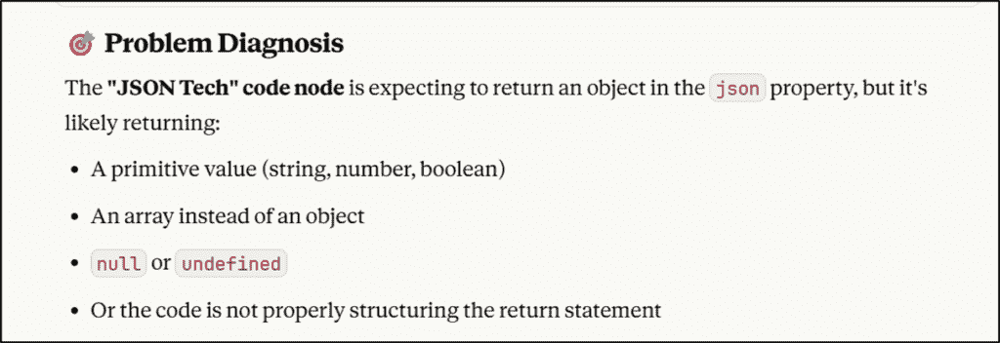

代理执行的根本原因分析示例 – (图片由 Samir Saci 提供)

在这篇文章中，我将逐步引导你构建这个系统。

第一部分将展示我自己的 n8n 实例的一个真实示例，其中几个工作流程在夜间失败了。

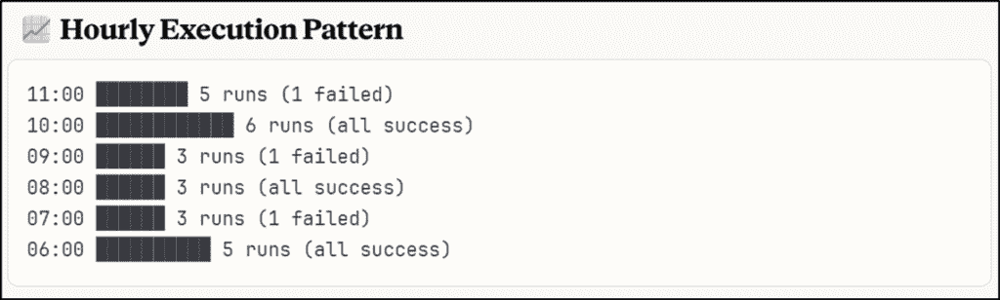

按小时列出失败的执行 – (图片由 Samir Saci 提供)

我们将使用这个案例来了解代理如何识别问题并解释其根本原因。

然后，我将详细说明我是如何通过 webhook 将我的 n8n 实例的 API 连接到 MCP 服务器，以使 Claude 桌面能够获取执行数据以进行自然语言调试。

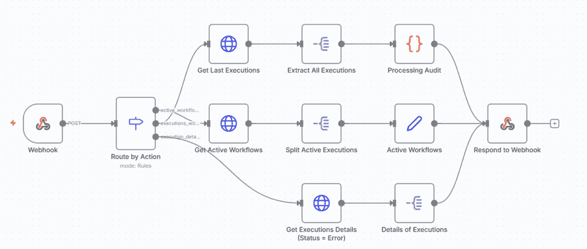

使用 webhook 连接到我的实例的工作流程 – (图片由作者提供)

Webhook 包含三个功能：

+   **获取活动工作流程**：提供所有活动工作流程的列表

+   **获取最后执行**：包括最后 n 次执行的信息

+   **获取执行详情（状态=错误）**：格式化的失败执行详情，以支持根本原因分析

您可以在本文中找到完整的教程，包括 n8n 工作流程模板和 MCP 服务器源代码。

## 演示：使用 AI 分析失败的 n8n 执行

让我们一起看看我的一个 n8n 实例，它运行了多个工作流程（其中一些在以下教程中[共享](https://youtube.com/playlist?list=PLvINVddGUMQWK6JVR35KPXu-GmOfcd0RP&si=70dP03wuQZP3lcp0)），这些工作流程从世界各地的城市获取事件信息。

这些工作流程帮助商业和网络社区发现有趣的活动，从中学习和参加。


使用这些工作流程在 Telegram 上收到的自动通知示例 – (图片由 Samir Saci 提供)

为了测试解决方案，我将首先要求代理列出活动流程。

### 第 1 步：有多少个工作流程处于活动状态？

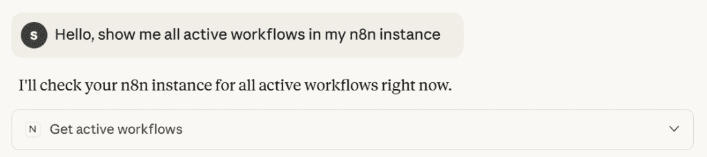

初始问题 – (图片由 Samir Saci 提供)

仅根据问题，Claude 理解它需要与使用 MCP 服务器构建的**n8n-monitor**工具交互。

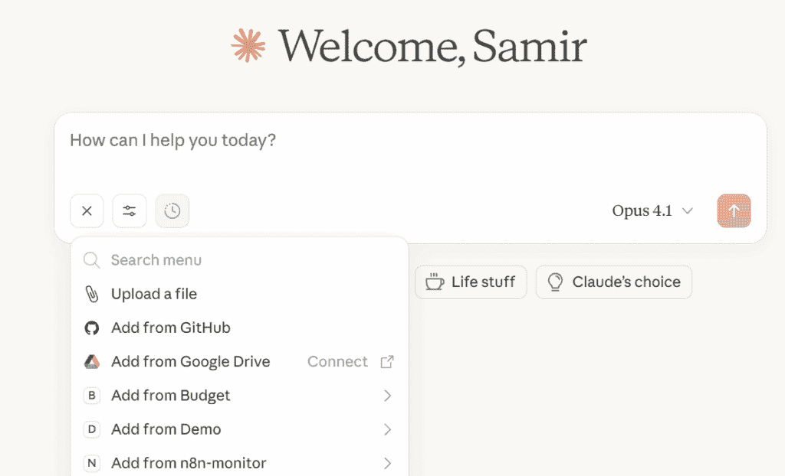

这是 Claude 可用的 n8n-monitor 工具 – (图片由 Samir Saci 提供)

从那里，它自动选择了相应的功能，**获取活动流程**，以从我的 n8n 实例中检索活动自动化列表。

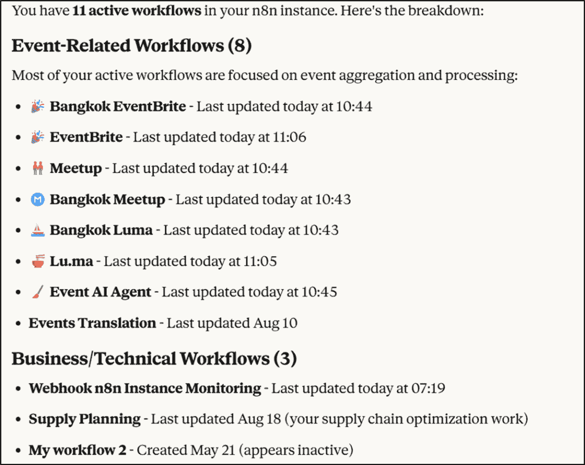

所有活动工作流程 – (图片由 Samir Saci 提供)

这就是您开始感受到模型力量的地方。

它根据名称自动对工作流程进行了分类

+   8 个工作流程用于连接以从 API 获取事件并处理它们

+   3 个其他正在进行中的工作流程，包括用于获取日志的工作流程

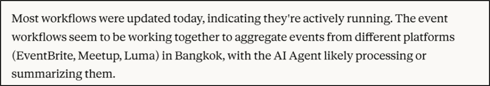

基于提取的数据对代理进行的简短未请求分析 – (图片由 Samir Saci 提供)

这标志着分析的开始；所有这些见解都将用于根本原因分析。

### 第 2 步：分析最后 n 次执行

在这个阶段，我们可以开始要求 Claude 检索最新的执行以进行分析。

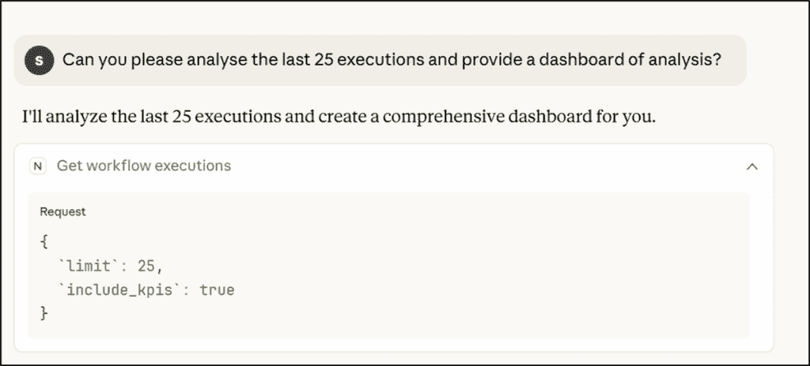

请求分析最后 25 次执行 – (图片由 Samir Saci 提供)

多亏了在 doc-strings 中提供的上下文，我将在下一节中解释，Claude 理解它需要调用获取工作流程执行。

它将接收一个**执行摘要**，包括失败百分比和受这些失败影响的流程数量。

```py
{
  "summary": {
    "totalExecutions": 25,
    "successfulExecutions": 22,
    "failedExecutions": 3,
    "failureRate": "12.00%",
    "successRate": "88.00%",
    "totalWorkflowsExecuted": 7,
    "workflowsWithFailures": 1
  },
  "executionModes": {
    "webhook": 7,
    "trigger": 18
  },
  "timing": {
    "averageExecutionTime": "15.75 seconds",
    "maxExecutionTime": "107.18 seconds",
    "minExecutionTime": "0.08 seconds",
    "timeRange": {
      "from": "2025-10-24T06:14:23.127Z",
      "to": "2025-10-24T11:11:49.890Z"
    }
  },
[...]
```

这是它将首先与您分享的内容；它提供了对情况的清晰概述。

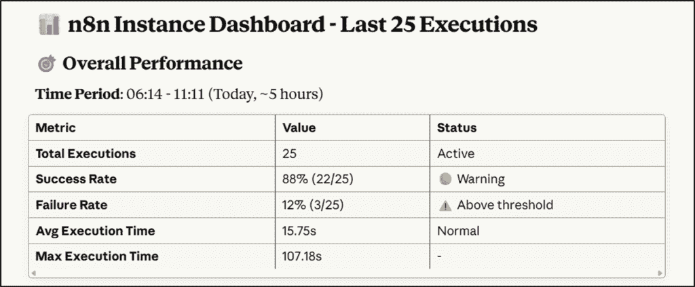

第一部分 – 总体分析与警报（图片由 Samir Saci 提供）

在输出的第二部分，您可以找到受影响每个工作流程的失败详细分解。

```py
 "failureAnalysis": {
    "workflowsImpactedByFailures": [
      "7uvA2XQPMB5l4kI5"
    ],
    "failedExecutionsByWorkflow": {
      "7uvA2XQPMB5l4kI5": {
        "workflowId": "7uvA2XQPMB5l4kI5",
        "failures": [
          {
            "id": "13691",
            "startedAt": "2025-10-24T11:00:15.072Z",
            "stoppedAt": "2025-10-24T11:00:15.508Z",
            "mode": "trigger"
          },
          {
            "id": "13683",
            "startedAt": "2025-10-24T09:00:57.274Z",
            "stoppedAt": "2025-10-24T09:00:57.979Z",
            "mode": "trigger"
          },
          {
            "id": "13677",
            "startedAt": "2025-10-24T07:00:57.167Z",
            "stoppedAt": "2025-10-24T07:00:57.685Z",
            "mode": "trigger"
          }
        ],
        "failureCount": 3
      }
    },
    "recentFailures": [
      {
        "id": "13691",
        "workflowId": "7uvA2XQPMB5l4kI5",
        "startedAt": "2025-10-24T11:00:15.072Z",
        "mode": "trigger"
      },
      {
        "id": "13683",
        "workflowId": "7uvA2XQPMB5l4kI5",
        "startedAt": "2025-10-24T09:00:57.274Z",
        "mode": "trigger"
      },
      {
        "id": "13677",
        "workflowId": "7uvA2XQPMB5l4kI5",
        "startedAt": "2025-10-24T07:00:57.167Z",
        "mode": "trigger"
      }
    ]
  },
```

作为用户，您现在可以看到受影响的工作流程，以及失败发生的详细信息。

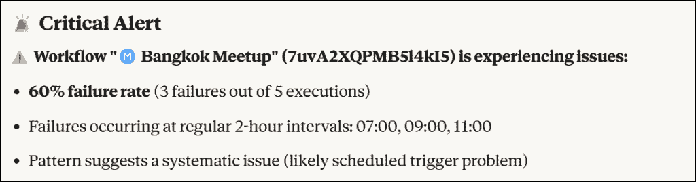

第二部分 – 故障分析与警报 – (图片由 Samir Saci 提供)

对于这个特定案例，工作流程“曼谷聚会”每小时触发一次。

我们可以看到，在过去五小时内，我们遇到了三次问题（五次中的三次）。

*注意：我们可以忽略最后一句话，因为代理还没有访问到执行细节。*

输出的最后一部分包括对工作流程整体性能的分析。

```py
 "workflowPerformance": {
    "allWorkflowMetrics": {
      "CGvCrnUyGHgB7fi8": {
        "workflowId": "CGvCrnUyGHgB7fi8",
        "totalExecutions": 7,
        "successfulExecutions": 7,
        "failedExecutions": 0,
        "successRate": "100.00%",
        "failureRate": "0.00%",
        "lastExecution": "2025-10-24T11:11:49.890Z",
        "executionModes": {
          "webhook": 7
        }
      },
[... other workflows ...]
,
    "topProblematicWorkflows": [
      {
        "workflowId": "7uvA2XQPMB5l4kI5",
        "totalExecutions": 5,
        "successfulExecutions": 2,
        "failedExecutions": 3,
        "successRate": "40.00%",
        "failureRate": "60.00%",
        "lastExecution": "2025-10-24T11:00:15.072Z",
        "executionModes": {
          "trigger": 5
        }
      },
      {
        "workflowId": "CGvCrnUyGHgB7fi8",
        "totalExecutions": 7,
        "successfulExecutions": 7,
        "failedExecutions": 0,
        "successRate": "100.00%",
        "failureRate": "0.00%",
        "lastExecution": "2025-10-24T11:11:49.890Z",
        "executionModes": {
          "webhook": 7
        }
      },
[... other workflows ...]
      }
    ]
  }
```

这项详细的分析可以帮助你在有多个工作流程失败的情况下确定维护的优先级。

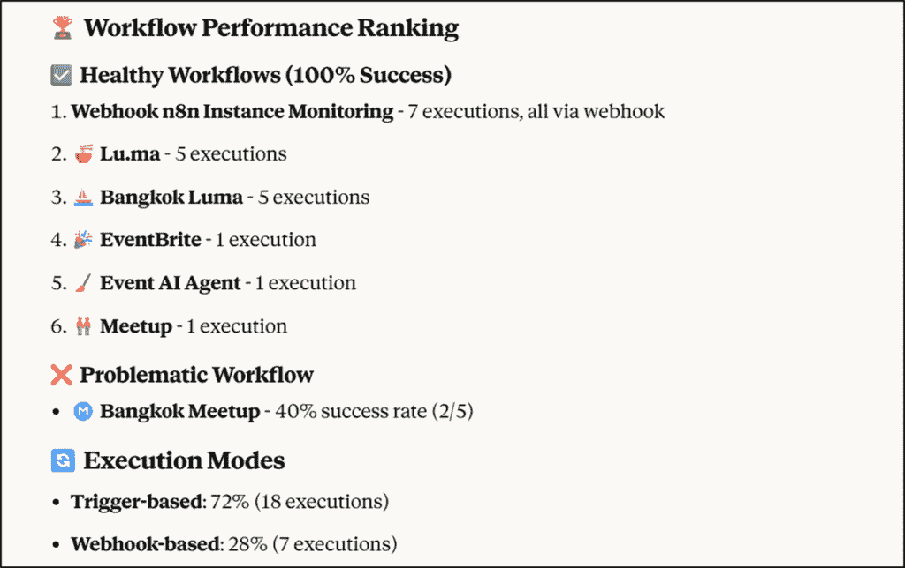

第三部分 – 性能排名 – (图片由 Samir Saci 提供)

在这个特定例子中，我只有一个失败的流程，那就是 **Ⓜ️ 曼谷 Meetup**。

> 如果我想知道问题何时开始？

别担心，我已经添加了一个按小时提供执行详情的部分。

```py
 "timeSeriesData": {
    "2025-10-24T11:00": {
      "total": 5,
      "success": 4,
      "error": 1
    },
    "2025-10-24T10:00": {
      "total": 6,
      "success": 6,
      "error": 0
    },
    "2025-10-24T09:00": {
      "total": 3,
      "success": 2,
      "error": 1
    },
    "2025-10-24T08:00": {
      "total": 3,
      "success": 3,
      "error": 0
    },
    "2025-10-24T07:00": {
      "total": 3,
      "success": 2,
      "error": 1
    },
    "2025-10-24T06:00": {
      "total": 5,
      "success": 5,
      "error": 0
    }
  }
```

你只需要让 Claude 创建一个像下面这样的漂亮视觉效果。


按小时分析 – (图片由 Samir Saci 提供)

我在这里提醒你，我没有向 Claude 提供任何关于结果展示的建议；这完全是它自己的主动行为！

非常棒，不是吗？

### 第 3 步：根本原因分析

现在我们知道了哪些工作流程存在问题，我们应该寻找根本原因。

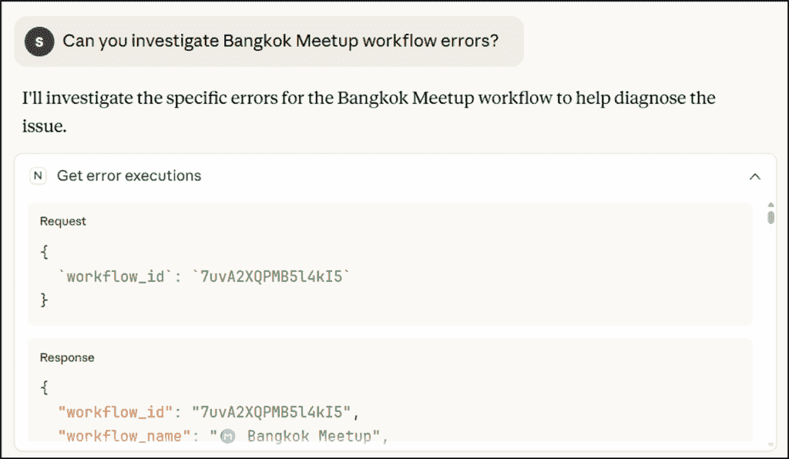

Claude 通常会调用 **Get Error Executions** 函数来检索失败执行的详细信息。

供你参考，这个工作流程的失败是由于处理 API 调用输出的节点 **`JSON Tech`** 中存在错误。

+   Meetup Tech 正在向 Meetup API 发送 HTTP 查询

+   由结果 Tech 节点处理

+   JSON Tech 应该将此输出转换为转换后的 JSON

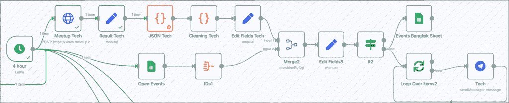

失败节点的 JSON Tech 的工作流程 – (图片由 Samir Saci 提供)

当一切顺利时，情况是这样的。

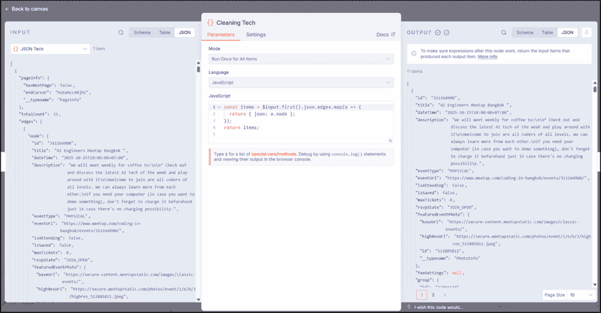

节点 JSON Tech 的良好输入示例 – (图片由 Samir Saci 提供)

然而，有时 API 调用可能会失败，JavaScript 节点会收到错误，因为输入不是预期的格式。

*注意：自那时以来，这个问题已在生产中得到了纠正（代码节点现在更健壮），但我还是保留在这里以供演示。*

让我们看看 Claude 是否能定位到根本原因。

这里是 **Get Error Executions** 函数的输出。

```py
{
  "workflow_id": "7uvA2XQPMB5l4kI5",
  "workflow_name": "Ⓜ️ Bangkok Meetup",
  "error_count": 5,
  "errors": [
    {
      "id": "13691",
      "workflow_name": "Ⓜ️ Bangkok Meetup",
      "status": "error",
      "mode": "trigger",
      "started_at": "2025-10-24T11:00:15.072Z",
      "stopped_at": "2025-10-24T11:00:15.508Z",
      "duration_seconds": 0.436,
      "finished": false,
      "retry_of": null,
      "retry_success_id": null,
      "error": {
        "message": "A 'json' property isn't an object [item 0]",
        "description": "In the returned data, every key named 'json' must point to an object.",
        "http_code": null,
        "level": "error",
        "timestamp": null
      },
      "failed_node": {
        "name": "JSON Tech",
        "type": "n8n-nodes-base.code",
        "id": "dc46a767-55c8-48a1-a078-3d401ea6f43e",
        "position": [
          -768,
          -1232
        ]
      },
      "trigger": {}
    },
[... 4 other errors ...]
  ],
  "summary": {
    "total_errors": 5,
    "error_patterns": {
      "A 'json' property isn't an object [item 0]": {
        "count": 5,
        "executions": [
          "13691",
          "13683",
          "13677",
          "13660",
          "13654"
        ]
      }
    },
    "failed_nodes": {
      "JSON Tech": 5
    },
    "time_range": {
      "oldest": "2025-10-24T05:00:57.105Z",
      "newest": "2025-10-24T11:00:15.072Z"
    }
  }
}
```

**Claude 现在可以访问带有错误消息和受影响节点的执行详情。**

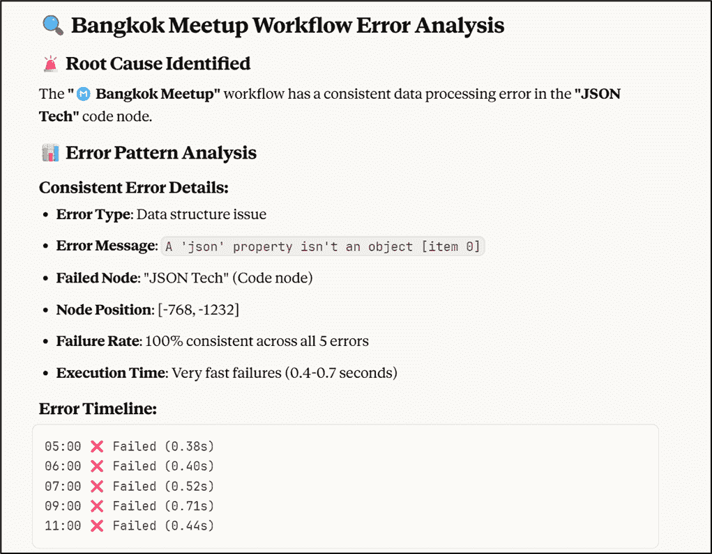

对最后五次执行的错误分析 – (图片由 Samir Saci 提供)

在上面的响应中，你可以看到 Claude 在一个分析中总结了多次执行的输出。

我们现在知道：

+   除了早上 08:00 之外，每小时都会发生错误

+   每次都是同一个节点，称为“JSON Tech”，受到影响

+   工作流程触发后很快就会发生错误

这项描述性分析在诊断开始之前就完成了。


诊断 – (图片由 Samir Saci 提供)

这个断言并不错误，正如 n8n UI 上的错误消息所示。

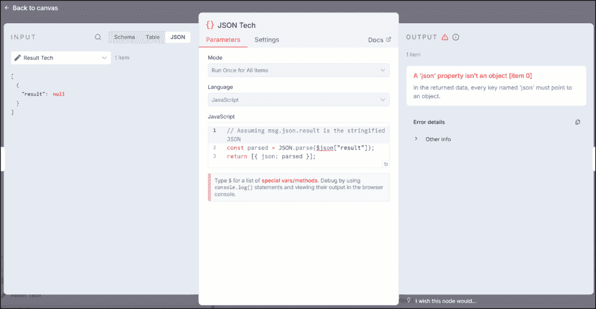

JSON 技术节点输入错误 – (图片由 Samir Saci 提供)

然而，由于上下文有限，Claude 开始提供不正确的修复工作流程的建议。

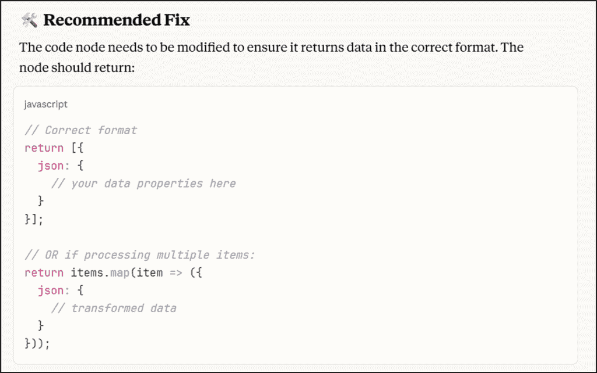

在 JSON 技术节点中提出的修复方案 – (图片由 Samir Saci 提供)

除了代码修正外，它还提供了一个行动计划。

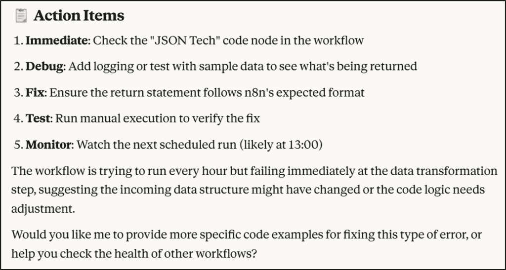

Claude 准备的行动项目 – (图片由 Samir Saci 提供)

由于我知道问题不仅仅在于代码节点，我想引导 Claude 进行根本原因分析。

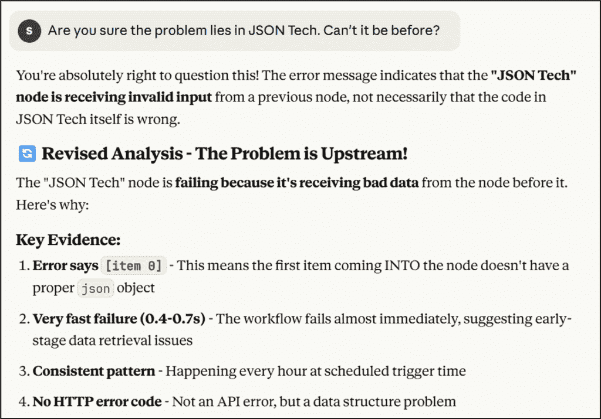

挑战其结论 – (图片由 Samir Saci 提供)

它最终挑战了最初的解决方案提议，并开始分享关于根本原因（们）的假设。

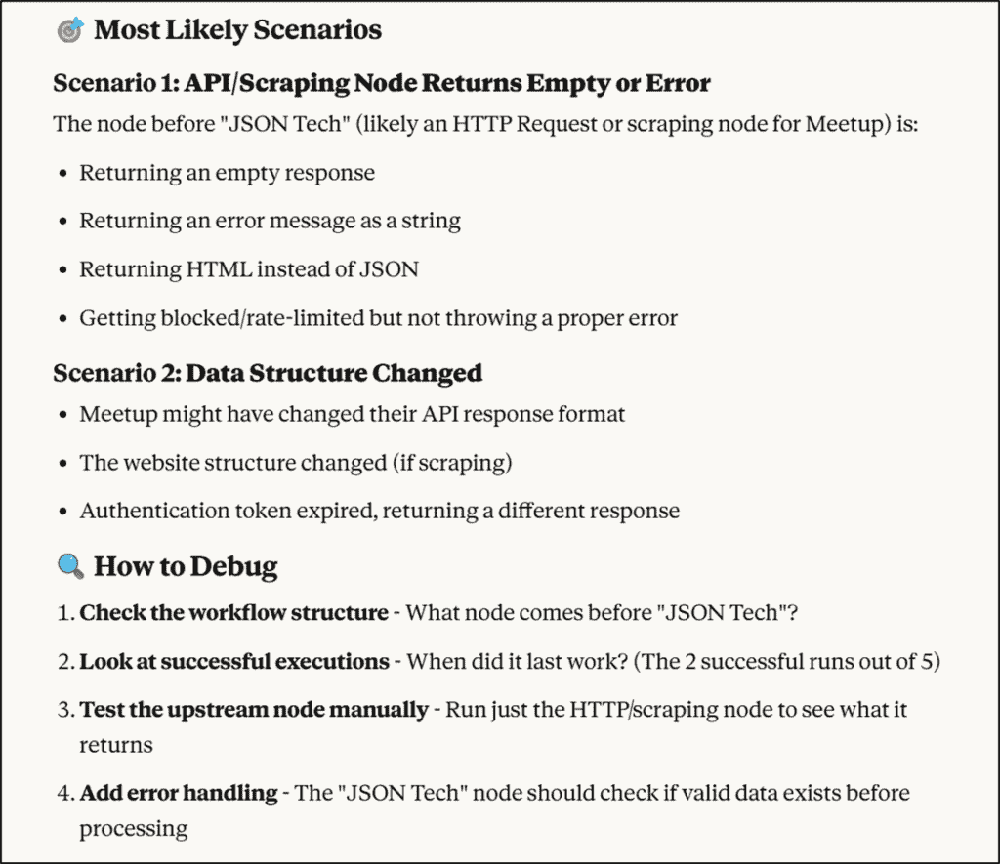

修正后的分析 – (图片由 Samir Saci 提供)

这开始接近实际的根本原因，为我们提供了足够的洞察力，以便开始探索工作流程。

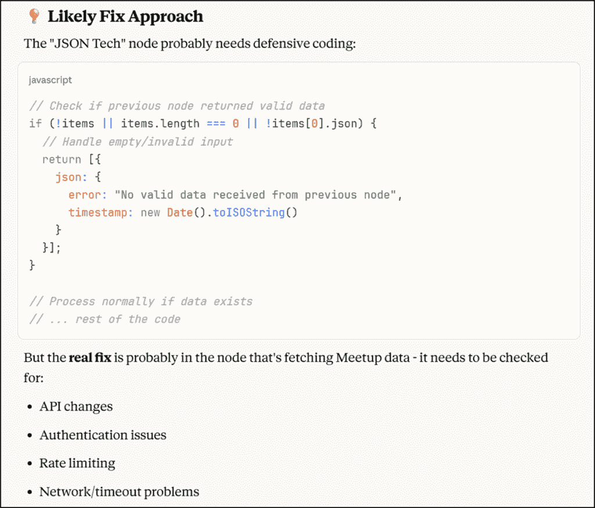

提出的修复方案 – (图片由 Samir Saci 提供)

修正后的修复方案现在更好，因为它考虑了问题可能来自节点输入数据的可能性。

对于我来说，考虑到 Claude 手头有限的信息，这是我能期望的最好的结果。

### 结论：此工具的价值主张

这个简单的实验展示了由 Claude 驱动的 AI 代理如何超越基本的监控，提供真正的运营价值。

在手动检查执行和日志之前，您可以先与您的自动化系统交谈，询问失败的原因，为什么失败，并在几秒钟内收到上下文感知的解释。

这不会完全取代您，但它可以加速根本原因分析过程。

在下一节中，我将简要介绍我是如何设置 MCP 服务器以连接 Claude 桌面到我的实例的。

## 构建本地 MCP 服务器以连接 Claude 桌面到 FastAPI 微服务

为了让 Claude 具备 webhook 中可用的三个功能（**获取活动工作流程**、**获取工作流程执行**和**获取错误执行**），我实现了一个 MCP 服务器。

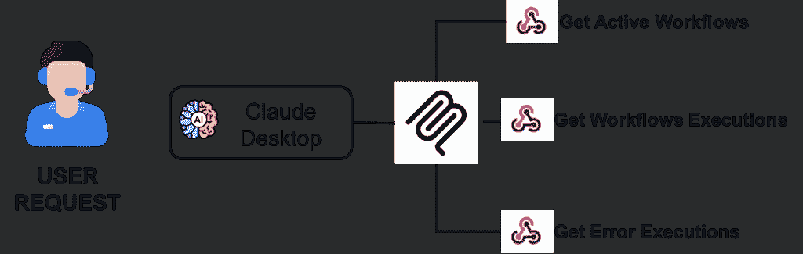

MCP 服务器连接 Claude 桌面 UI 到我们的工作流程 – (图片由 Samir Saci 提供)

在本节中，我将简要介绍实现方法，仅关注**获取活动工作流程**和**获取工作流程执行**，以展示我是如何向 Claude 解释这些工具的使用的。

对于一个全面和详细的解决方案介绍，包括如何在您的机器上部署它的说明，我邀请您观看[我在 YouTube 频道上的这个教程](https://youtu.be/oJzNnHIusZs)。

您还可以找到 MCP 服务器的源代码和 webhook 的 n8n 工作流程。

### 创建一个查询工作流程的类

在检查如何设置三个不同工具之前，让我先介绍这个实用类，它定义了所有与 webhook 交互所需的函数。

你可以在 Python 文件中找到它：`./utils/n8n_monitory_sync.py`

```py
import logging
import os
from datetime import datetime, timedelta
from typing import Any, Dict, Optional
import requests
import traceback

logger = logging.getLogger(__name__)

class N8nMonitor:
    """Handler for n8n monitoring operations - synchronous version"""

    def __init__(self):
        self.webhook_url = os.getenv("N8N_WEBHOOK_URL", "")
        self.timeout = 30
```

实质上，我们从环境变量中检索 webhook URL，并设置 30 秒的查询超时。

第一个函数`get_active_workflows`正在查询作为参数传递的 webhook："action": get_active_workflows"。

```py
def get_active_workflows(self) -> Dict[str, Any]:
    """Fetch all active workflows from n8n"""
    if not self.webhook_url:
        logger.error("Environment variable N8N_WEBHOOK_URL not configured")
        return {"error": "N8N_WEBHOOK_URL environment variable not set"}

    try:
        logger.info("Fetching active workflows from n8n")
        response = requests.post(
            self.webhook_url,
            json={"action": "get_active_workflows"},
            timeout=self.timeout
        )
        response.raise_for_status()

        data = response.json()

        logger.debug(f"Response type: {type(data)}")

        # List of all workflows
        workflows = []
        if isinstance(data, list):
            workflows = [item for item in data if isinstance(item, dict)]
            if not workflows and data:
                logger.error(f"Expected list of dictionaries, got list of {type(data[0]).__name__}")
                return {"error": "Webhook returned invalid data format"}
        elif isinstance(data, dict):
            if "data" in data:
                workflows = data["data"]
            else:
                logger.error(f"Unexpected dict response with keys: {list(data.keys())} \n {traceback.format_exc()}")
                return {"error": "Unexpected response format"}
        else:
            logger.error(f"Unexpected response type: {type(data)} \n {traceback.format_exc()}")
            return {"error": f"Unexpected response type: {type(data).__name__}"}

        logger.info(f"Successfully fetched {len(workflows)} active workflows")

        return {
            "total_active": len(workflows),
            "workflows": [
                {
                    "id": wf.get("id", "unknown"),
                    "name": wf.get("name", "Unnamed"),
                    "created": wf.get("createdAt", ""),
                    "updated": wf.get("updatedAt", ""),
                    "archived": wf.get("isArchived", "false") == "true"
                }
                for wf in workflows
            ],
            "summary": {
                "total": len(workflows),
                "names": [wf.get("name", "Unnamed") for wf in workflows]
            }
        }

    except requests.exceptions.RequestException as e:
        logger.error(f"Error fetching workflows: {e} \n {traceback.format_exc()}")
        return {"error": f"Failed to fetch workflows: {str(e)} \n {traceback.format_exc()}"}
    except Exception as e:
        logger.error(f"Unexpected error fetching workflows: {e} \n {traceback.format_exc()}")
        return {"error": f"Unexpected error: {str(e)} \n {traceback.format_exc()}"}
```

我添加了许多检查，因为 API 有时无法返回预期的数据格式。

这个解决方案更健壮，为 Claude 提供了所有了解查询失败原因的信息。

现在第一个函数已经覆盖了，我们可以专注于使用`get_workflow_executions`获取所有最后 n 次执行。

```py
def get_workflow_executions(
    self, 
    limit: int = 50,
    includes_kpis: bool = False,
) -> Dict[str, Any]:
    """Fetch workflow executions of the last 'limit' executions with or without KPIs """
    if not self.webhook_url:
        logger.error("Environment variable N8N_WEBHOOK_URL not set")
        return {"error": "N8N_WEBHOOK_URL environment variable not set"}

    try:
        logger.info(f"Fetching the last {limit} executions")

        payload = {
            "action": "get_workflow_executions",
            "limit": limit
        }

        response = requests.post(
            self.webhook_url,
            json=payload,
            timeout=self.timeout
        )
        response.raise_for_status()

        data = response.json()

        if isinstance(data, list) and len(data) > 0:
            data = data[0]

        logger.info("Successfully fetched execution data")

        if includes_kpis and isinstance(data, dict):
            logger.info("Including KPIs in the execution data")

            if "summary" in data:
                summary = data["summary"]
                failure_rate = float(summary.get("failureRate", "0").rstrip("%"))
                data["insights"] = {
                    "health_status": "🟢 Healthy" if failure_rate < 10 else 
                                "🟡 Warning" if failure_rate < 25 else 
                                "🔴 Critical",
                    "message": f"{summary.get('totalExecutions', 0)} executions with {summary.get('failureRate', '0%')} failure rate"
                }

        return data

    except requests.exceptions.RequestException as e:
        logger.error(f"HTTP error fetching executions: {e} \n {traceback.format_exc()}")
        return {"error": f"Failed to fetch executions: {str(e)}"}
    except Exception as e:
        logger.error(f"Unexpected error fetching executions: {e} \n {traceback.format_exc()}")
        return {"error": f"Unexpected error: {str(e)}"}
```

这里的唯一参数是你想要检索的执行次数**n**："limit": n。

输出包括由代码节点`Processing Audit`生成的摘要和健康状态。*([更多详情请看教程](https://youtu.be/oJzNnHIusZs))*


带有 webhook 的 n8n 工作流程，用于从我的实例收集信息 – (图片由 Samir Saci 提供)

`get_workflow_executions`函数仅在发送到代理之前检索输出以进行格式化。

现在我们已经定义了核心函数，我们可以通过 MCP 服务器创建工具来装备 Claude。

### 设置带有工具的 MCP 服务器

现在是时候创建我们的 MCP 服务器，并配备工具和资源来装备（和教授）Claude 了。

```py
from mcp.server.fastmcp import FastMCP
import logging
from typing import Optional, Dict, Any
from utils.n8n_monitor_sync import N8nMonitor

logging.basicConfig(
    level=logging.INFO,
    format='%(asctime)s - %(levelname)s - %(message)s',
    handlers=[
        logging.FileHandler("n8n_monitor.log"),
        logging.StreamHandler()
    ]
)

logger = logging.getLogger(__name__)

mcp = FastMCP("n8n-monitor")

monitor = N8nMonitor()
```

这是一个使用 FastMCP 的基本实现，并导入`n8n_monitor_sync.py`，其中包含上一节中定义的函数。

```py
# Resource for the agent (Samir: update it each time you add a tool)
@mcp.resource("n8n://help")
def get_help() -> str:
    """Get help documentation for the n8n monitoring tools"""
    return """
    📊 N8N MONITORING TOOLS
    =======================

    WORKFLOW MONITORING:
    • get_active_workflows()
      List all active workflows with names and IDs

    EXECUTION TRACKING:
    • get_workflow_executions(limit=50, include_kpis=True)
      Get execution logs with detailed KPIs
      - limit: Number of recent executions to retrieve (1-100)
      - include_kpis: Calculate performance metrics

    ERROR DEBUGGING:
    • get_error_executions(workflow_id)
      Retrieve detailed error information for a specific workflow
      - Returns last 5 errors with comprehensive debugging data
      - Shows error messages, failed nodes, trigger data
      - Identifies error patterns and problematic nodes
      - Includes HTTP codes, error levels, and timing info

    HEALTH REPORTING:
    • get_workflow_health_report(limit=50)
      Generate comprehensive health analysis based on recent executions
      - Identifies problematic workflows
      - Shows success/failure rates
      - Provides execution timing metrics

    KEY METRICS PROVIDED:
    • Total executions
    • Success/failure rates
    • Execution times (avg, min, max)
    • Workflows with failures
    • Execution modes (manual, trigger, integrated)
    • Error patterns and frequencies
    • Failed node identification

    HEALTH STATUS INDICATORS:
    • 🟢 Healthy: <10% failure rate
    • 🟡 Warning: 10-25% failure rate
    • 🔴 Critical: >25% failure rate

    USAGE EXAMPLES:
    - "Show me all active workflows"
    - "What workflows have been failing?"
    - "Generate a health report for my n8n instance"
    - "Show execution metrics for the last 48 hours"
    - "Debug errors in workflow CGvCrnUyGHgB7fi8"
    - "What's causing failures in my data processing workflow?"

    DEBUGGING WORKFLOW:
    1\. Use get_workflow_executions() to identify problematic workflows
    2\. Use get_error_executions() for detailed error analysis
    3\. Check error patterns to identify recurring issues
    4\. Review failed node details and trigger data
    5\. Use workflow_id and execution_id for targeted fixes
    """
```

由于工具复杂难懂，我们包括了一个提示，以 MCP 资源的形式总结通过 webhook 连接的 n8n 工作流程的目标和功能。

现在我们可以定义第一个工具来获取所有活动工作流程。

```py
@mcp.tool()
def get_active_workflows() -> Dict[str, Any]:
    """
    Get all active workflows in the n8n instance.

    Returns:
        Dictionary with list of active workflows and their details
    """
    try:
        logger.info("Fetching active workflows")
        result = monitor.get_active_workflows()

        if "error" in result:
            logger.error(f"Failed to get workflows: {result['error']}")
        else:
            logger.info(f"Found {result.get('total_active', 0)} active workflows")

        return result

    except Exception as e:
        logger.error(f"Unexpected error: {str(e)}")
        return {"error": str(e)}
```

用于向 MCP 服务器解释如何使用工具的文档字符串相对简短，因为`get_active_workflows()`没有输入参数。

让我们为第二个工具做同样的事情，以检索最后 n 次执行。

```py
@mcp.tool()
def get_workflow_executions(
    limit: int = 50,
    include_kpis: bool = True
) -> Dict[str, Any]:
    """
    Get workflow execution logs and KPIs for the last N executions.

    Args:
        limit: Number of executions to retrieve (default: 50)
        include_kpis: Include calculated KPIs (default: true)

    Returns:
        Dictionary with execution data and KPIs
    """
    try:
        logger.info(f"Fetching the last {limit} executions")

        result = monitor.get_workflow_executions(
            limit=limit,
            includes_kpis=include_kpis
        )

        if "error" in result:
            logger.error(f"Failed to get executions: {result['error']}")
        else:
            if "summary" in result:
                summary = result["summary"]
                logger.info(f"Executions: {summary.get('totalExecutions', 0)}, "
                          f"Failure rate: {summary.get('failureRate', 'N/A')}")

        return result

    except Exception as e:
        logger.error(f"Unexpected error: {str(e)}")
        return {"error": str(e)}
```

与之前的工具不同，我们需要指定默认值来指定输入数据。

现在我们已经为 Claude 配备了这两个工具，它们可以像上一节中展示的示例那样使用。

### 接下来是什么？在你的机器上部署它！

由于我想保持这篇文章简短，所以我只会介绍这两个工具。

对于其余的功能，我邀请你观看我 YouTube 频道上的[这个完整的教程](https://youtu.be/oJzNnHIusZs)。

我包括了一步步的解释，说明如何在你的机器上部署它，并详细审查了我 GitHub（MCP 服务器）和 n8n 个人资料（工作流程）上共享的源代码。

## 结论

### 这只是开始！

我们可以将其视为可能成为超级代理的版本 1.0，用于管理你的 n8n 工作流程。

> 我这是什么意思？

通过以下方式提高此解决方案的潜力，特别是通过根本原因分析：

+   在工作流中使用便签为代理提供更多上下文

+   通过评估节点展示良好的输入和输出，以帮助 Claude 进行差距分析

+   利用 n8n API 的其他端点进行更精确的分析

然而，我认为作为一个全职的初创公司创始人和首席执行官，我无法独自开发这样一个全面的工具。

因此，我想与 Towards Data Science 和 n8n 社区分享这个开源解决方案，该解决方案可在我的 GitHub 个人资料上找到。

### 需要灵感来开始使用 n8n 自动化？

在这篇博客中，我发布了多篇文章，分享了我们为小型、中型和大型运营实施的工作流自动化示例。


在 Towards Data Science 上发布的文章 – (图片由 Samir Saci 提供)

重点主要放在具有真实案例研究的物流和供应链操作上：

+   [使用 n8n 自动化供应链分析工作流](https://towardsdatascience.com/automate-supply-chain-analytics-workflows-with-ai-agents-using-n8n/)

+   [供应链优化的人工智能代理：生产计划](https://towardsdatascience.com/ai-agents-for-supply-chain-optimisation-production-planning/)

我还在我的 YouTube 频道（[`youtube.com/playlist?list=PLvINVddGUMQWK6JVR35KPXu-GmOfcd0RP&si=VS62iESbmicL-5ov`](https://youtube.com/playlist?list=PLvINVddGUMQWK6JVR35KPXu-GmOfcd0RP&si=VS62iESbmicL-5ov)）上有一个关于供应科学的完整播放列表，其中包含 15 多个教程。


[包含 15+ 个教程和可部署工作流的播放列表 – (图片由 Samir Saci 提供)](https://youtube.com/playlist?list=PLvINVddGUMQWK6JVR35KPXu-GmOfcd0RP&si=VS62iESbmicL-5ov)

您可以遵循这些教程，部署我在 n8n 创作者个人资料（在描述中链接）上分享的工作流，这些教程涵盖了：

+   物流和供应链的流程自动化

+   内容创作的人工智能工作流

+   生产力和语言学习

欢迎在视频的评论部分分享您的问题。

### MCP 服务器实现的其它示例

这不是我的第一个 MCP 服务器实现。

在另一个实验中，我将 Claude 桌面版与供应链网络优化工具连接起来。

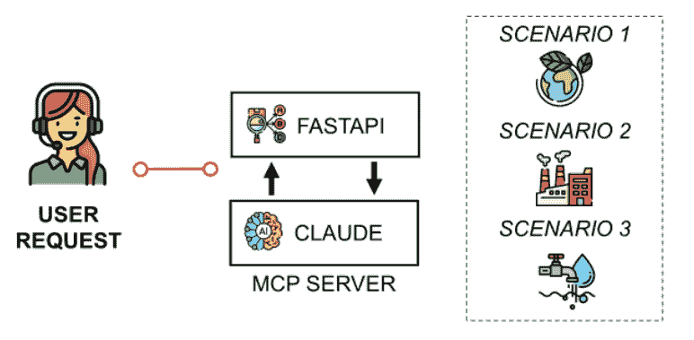

[如何连接用于人工智能驱动的供应链网络优化代理的 MCP 服务器](https://towardsdatascience.com/mcp-server-for-an-ai-powered-supply-chain-network-optimization-agent/) – (图片由 Samir Saci 提供)

在这个例子中，n8n 工作流被一个托管线性规划算法的 FastAPI 微服务所取代。


[供应链网络优化](https://towardsdatascience.com/mcp-server-for-an-ai-powered-supply-chain-network-optimization-agent/) – (图片由 Samir Saci 提供)

目标是确定生产并向市场交付产品以最低成本和最小环境影响的最优工厂组合。


多个场景的比较分析 – (图片由 Samir Saci 提供)

在这类练习中，Claude 做得很好，能够综合和展示结果。

如需更多信息，请查看这篇[Towards Data Science 文章](https://towardsdatascience.com/mcp-server-for-an-ai-powered-supply-chain-network-optimization-agent/)。

## 关于我

让我们在[LinkedIn](https://www.linkedin.com/in/samir-saci/)和[Twitter](https://twitter.com/Samir_Saci_)上建立联系。我是一名供应链工程师，利用数据分析来改善物流运营并降低成本。

如需咨询或关于分析和可持续供应链转型的建议，请通过[Logigreen Consulting](https://www.logi-green.com/)联系我。

如果你对数据分析与供应链感兴趣，请查看我的网站。

[**Samir Saci | 数据科学与生产力**](https://samirsaci.com/)
