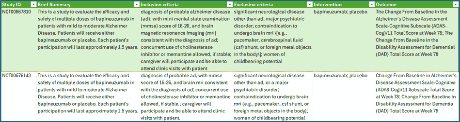
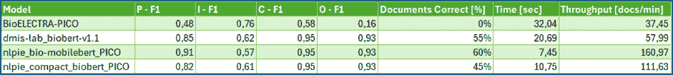
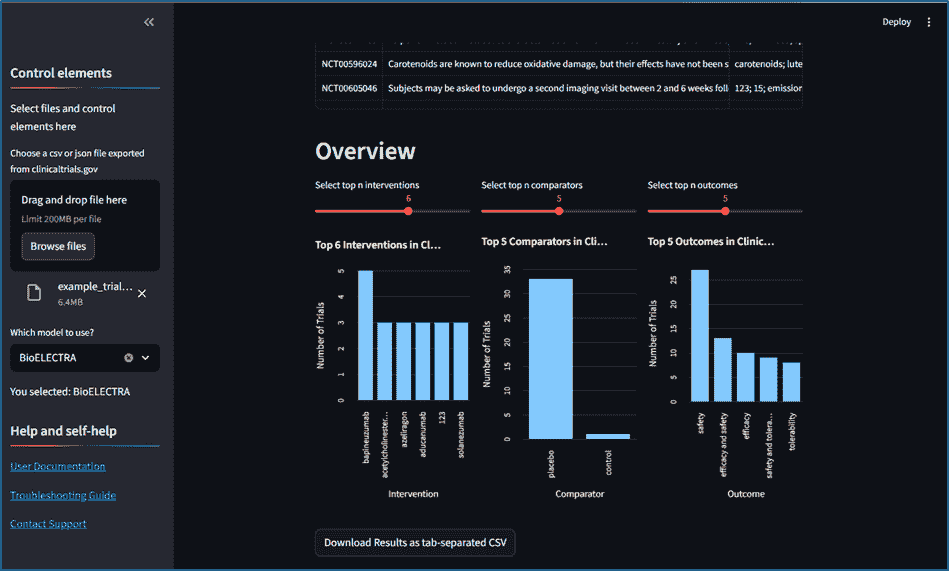

# 五步部署 PICO 提取器

> 原文：[`towardsdatascience.com/deploying-a-pico-extractor-in-five-steps-lessons-learned-deploying-a-domain-specific-ner-model/`](https://towardsdatascience.com/deploying-a-pico-extractor-in-five-steps-lessons-learned-deploying-a-domain-specific-ner-model/)

大型语言模型的兴起使得许多自然语言处理（NLP）任务看起来毫不费力。像 ChatGPT 这样的工具有时会生成令人印象深刻的好回答，甚至让经验丰富的专业人士怀疑某些工作是否可能比预期更早地交给算法。然而，尽管这些模型令人印象深刻，它们在需要精确、领域特定提取的任务上仍然会遇到困难。

## 动机：为什么构建 PICO 提取器？

这个想法是在与一位即将毕业的国际医疗管理专业学生交谈中产生的，这位学生着手分析帕金森病治疗的未来趋势，并计算如果当前试验成功转化为产品，保险公司将面临的潜在成本。第一步是经典且费时的：从临床 trials.gov 上发布的正在进行的试验描述中隔离 PICO 元素——人群、干预措施、对照和结果描述。这个 PICO 框架常用于循证医学中结构化临床试验数据。由于她既不是程序员也不是 NLP 专家，她完全手动完成这项工作，使用电子表格。对我来说，即使是在 LLM 时代，对简单、可靠的生物医学信息提取工具的需求仍然是真实存在的。

## 第 1 步：理解数据和设定目标

与每个数据项目一样，首要任务是设定明确的目标并确定谁将使用结果。在这里，目标是提取 PICO 元素用于下游预测分析或元研究。受众：任何对系统分析临床试验数据感兴趣的人，无论是研究人员、临床医生还是数据科学家。考虑到这个范围，我开始了从临床 trials.gov 的 JSON 格式导出的工作。初始字段提取和数据清洗提供了一些结构化信息（表 1）——特别是对于干预措施——但其他关键字段对于下游自动化分析仍然难以管理。这正是 NLP 大放异彩的地方：它使我们能够从非结构化文本中提炼关键细节，例如资格标准或测试药物。命名实体识别（NER）使我们能够自动检测和分类关键实体——例如，识别资格部分中描述的人群组，或确定研究摘要中的结果指标。因此，项目自然地从基本预处理过渡到实施领域自适应 NER 模型。

表 1：从临床 trials.gov 网站上下载的数据中提取的两个阿尔茨海默病研究的核心要素。（图片由作者提供）

## 第 2 步：基准测试现有模型

我的下一步是对现成的 NER 模型进行了调查，特别是那些在生物医学文献上训练并通过 Huggingface（transformer 模型的中央存储库）提供的模型。在 19 个候选者中，只有 BioELECTRA-PICO（110 百万参数）[1]可以直接用于提取 PICO 元素，而其他模型虽然训练于 NER 任务，但并非专门用于 PICO 识别。在测试 BioELECTRA 在我自己的“黄金标准”的 20 个手动注释试验集上时，表现可接受但远非理想，特别是在“比较者”元素上表现较弱。这可能是由于比较者在试验摘要中很少被描述，迫使回归到基于规则的实用方法，直接在干预文本中搜索标准比较关键词，如“安慰剂”或“常规护理”。

## 第 3 步：使用特定领域数据进行微调

为了进一步提高性能，我转向了微调，这得益于 BIDS-Xu-Lab 提供的注释 PICO 数据集，包括针对阿尔茨海默病的特定样本[2]。为了在精度、效率和可扩展性之间取得平衡，我选择了三个模型进行实验。**BioBERT-v1.1**，拥有 110 百万参数[3]，由于其强大的生物医学 NLP 任务记录，被选为主要模型。我还包括两个较小的衍生模型以优化速度和内存使用：**CompactBioBERT**，65 百万参数，是 BioBERT-v1.1 的蒸馏版本；以及**BioMobileBERT**，仅 25 百万参数，是进一步压缩的变体，在压缩后还经历了一轮额外的持续学习[4]。我使用 Google Colab GPU 对所有三个模型进行了微调，这允许高效训练——每个模型在不到两小时内就准备好测试。

## 第 4 步：评估和见解

结果总结在表 2 中，揭示了明显的趋势。所有变体在提取人口方面表现强劲，其中 BioMobileBERT 以 F1 = 0.91 领先。所有模型的输出提取接近上限。然而，提取干预措施更具挑战性。尽管召回率相当高（0.83–0.87），但精确度落后（0.54–0.61），模型经常标记出在自由文本中发现的额外药物提及——通常因为试验描述中提到了药物或“干预类似”的关键词来描述背景，但并不一定专注于计划的主要干预措施。

仔细检查后，这突显了生物医学命名实体识别的复杂性。干预措施偶尔会以“use of whole”、“week”、“top”或“tissues with”等短而破碎的字符串形式出现，对于试图理解研究列表的研究者来说价值不大。同样，检查人口会得出相当令人沮丧的例子，如“percent of”或“states with”，这表明需要额外的清理和管道优化。同时，模型可以提取令人印象深刻的详细人口描述符，如“qualifying adults with a diagnosis of cognitively unimpaired, or probable Alzheimer’s disease, frontotemporal dementia, or dementia with Lewy bodies”。虽然这样的长字符串可能是正确的，但它们往往过于冗长，不适合实际摘要，因为每个试验的参与者描述都非常具体，通常需要某种形式的抽象或标准化。

这强调了生物医学自然语言处理中的一个经典挑战：上下文很重要，特定领域的文本往往抗拒纯粹的通用提取方法。对于比较元素，基于规则的策略（匹配显式的比较关键词）效果最佳，这提醒我们，将统计学习与实用启发式方法相结合通常是现实应用中最可行的策略。

这些“恶作剧”提取的一个主要来源是更广泛背景下对试验的描述方式。展望未来，可能的改进包括添加后处理过滤器以丢弃短或模糊的片段，纳入特定领域的受控词汇表（因此只保留已识别的干预措施术语），或应用概念链接到已知本体。这些步骤可以帮助确保管道产生更干净、更标准化的输出。

表 2：提取 PICO 元素时的 F1 分数，所有 PICO 元素部分正确的文档百分比，以及处理持续时间。（图片由作者提供）

关于性能的一点说明：对于任何面向最终用户的工具，速度和准确性同样重要。BioMobileBERT 的紧凑尺寸转化为更快的推理，使其成为我的首选模型，尤其是在它对人口、比较和结果元素表现最优的情况下。

## 第 5 步：使工具可用——部署

技术解决方案的价值仅在于其可访问性。我将最终管道封装在一个 Streamlit 应用程序中，允许用户上传 clinicaltrials.gov 数据集，在模型之间切换，提取 PICO 元素，并下载结果。快速总结图提供了对顶级干预措施和结果的快速查看（见图 1）。我故意保留了表现不佳的 BioELECTRA 模型，让用户比较性能持续时间，以便欣赏使用较小架构带来的效率提升。尽管这个工具来得太晚，无法节省我的学生在手动数据提取上的时间，但我希望它能帮助那些面临类似任务的人。

为了使部署简单，我已经使用 Docker 容器化了应用程序，以便追随者和合作者可以快速启动。我还投入了大量精力到 GitHub 仓库 [5] 中，提供了详尽的文档，以鼓励进一步的贡献或适应新领域。

## 经验教训

该项目展示了开发真实世界提取管道的完整过程——从设定明确的目标和基准测试现有模型，到在专用数据上微调和部署用户友好的应用程序。尽管模型和数据可用于微调，但将它们转化为真正有用的工具比预期的更具挑战性。处理复杂的多词生物医学实体（这些实体通常只部分识别）凸显了一刀切解决方案的局限性。提取文本中的抽象不足也成为了任何试图识别全局趋势的人的障碍。展望未来，需要更多针对性的方法和管道优化，而不是依赖于简单的现成解决方案。

图 1。运行 BioMobileBERT 和 BioELECTRA 进行 PICO 提取的 Streamlit 应用程序的示例输出（图片由作者提供）。

如果你对扩展这项工作或将其方法应用于其他生物医学任务感兴趣，我邀请你探索存储库 [5] 并做出贡献。只需分叉项目并**快乐编码**！

## 参考文献

+   [1] S. Alrowili 和 V. Shanker，“BioM-Transformers：使用 BERT、ALBERT 和 ELECTRA 构建大型生物医学语言模型”，在 *第 20 届生物医学语言处理研讨会论文集* 中，D. Demner-Fushman，K. B. Cohen，S. Ananiadou 和 J. Tsujii 编，在线：计算语言学协会，2021 年 6 月，第 221–227 页。[doi: 10.18653/v1/2021.bionlp-1.24.](https://aclanthology.org/2021.bionlp-1.24/)

+   [2] *BIDS-Xu-Lab/section_specific_annotation_of_PICO*。 (Aug. 23, 2025)。Jupyter Notebook。临床自然语言处理实验室。访问日期：2025 年 9 月 13 日。[在线]。可获得：[`github.com/BIDS-Xu-Lab/section_specific_annotation_of_PICO`](https://github.com/BIDS-Xu-Lab/section_specific_annotation_of_PICO)

+   [3] J. Lee 等人，“BioBERT：一种用于生物医学文本挖掘的预训练生物医学语言表示模型”，*Bioinformatics*，第 36 卷，第 4 期，第 1234–1240 页，2020 年 2 月，[doi: 10.1093/bioinformatics/btz682.](https://doi.org/10.1093/bioinformatics/btz682)

+   [4] O. Rohanian，M. Nouriborji，S. Kouchaki 和 D. A. Clifton，“关于紧凑型生物医学变换器的有效性”，*Bioinformatics*，第 39 卷，第 3 期，p. btad103，2023 年 3 月，[doi: 10.1093/bioinformatics/btad103.](https://doi.org/10.1093/bioinformatics/btad103)

+   [5] ElenJ，*ElenJ/biomed-extractor*。 (Sept. 13, 2025)。Jupyter Notebook。访问日期：2025 年 9 月 13 日。[在线]。可获得：[`github.com/ElenJ/biomed-extractor`](https://github.com/ElenJ/biomed-extractor)
