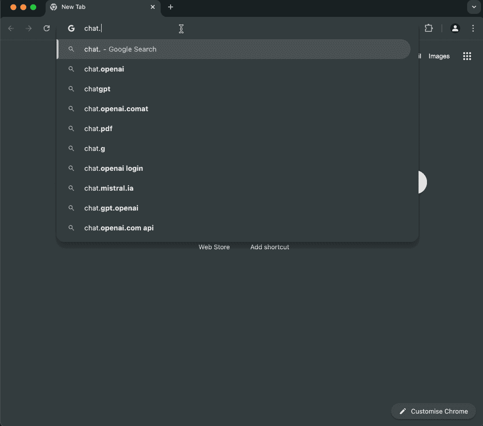
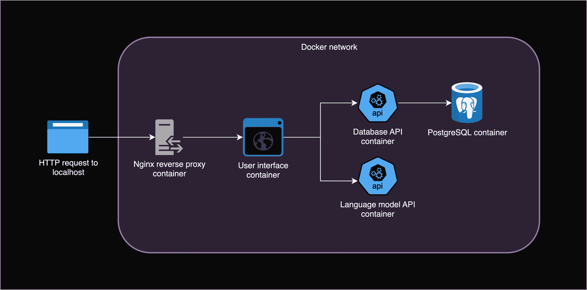
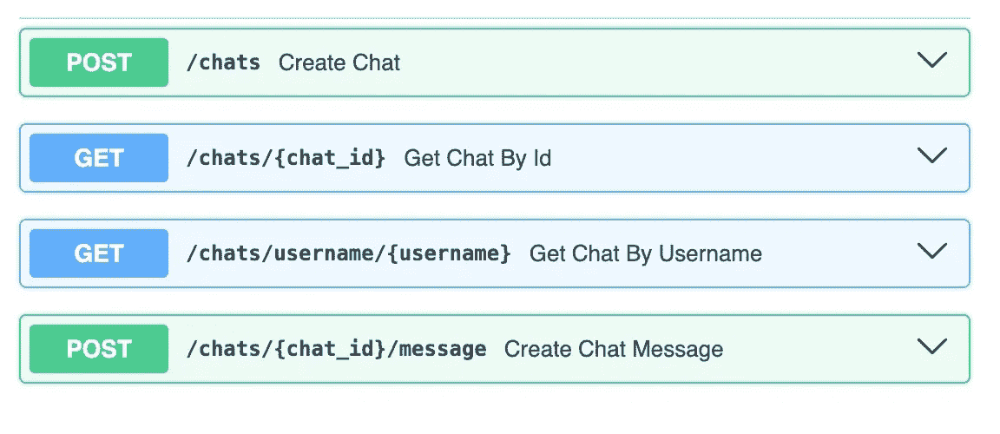
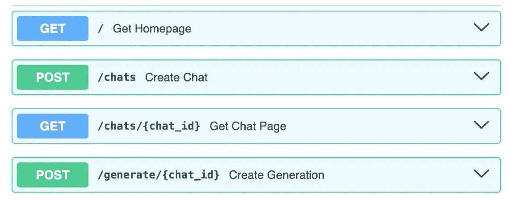

# 从零开始设计、构建和部署 AI 聊天应用程序（第一部分）

> 原文：[`towardsdatascience.com/designing-building-deploying-an-ai-chat-app-from-scratch-part-1-f1ebf5232d4d/`](https://towardsdatascience.com/designing-building-deploying-an-ai-chat-app-from-scratch-part-1-f1ebf5232d4d/)


图片由[Danist Soh](https://unsplash.com/@danist07?utm_source=medium&utm_medium=referral)在[Unsplash](https://unsplash.com?utm_source=medium&utm_medium=referral)提供

## 简介

本项目的目的是通过设计、构建和部署一个从头开始的 AI 聊天应用程序，来学习现代、可扩展的 Web 应用程序的基本原理。我们不会使用花哨的框架或像 ChatGPT 这样的商业平台。这将更好地理解现实世界系统在底层可能如何工作，并让我们完全控制语言模型、基础设施、数据和成本。重点将放在工程、后端和云部署上，而不是语言模型或花哨的前端。

这是第一部分。我们将设计和构建一个云原生应用程序，具有多个 API、数据库、私有网络、反向代理和带有会话的简单用户界面。所有这些都在我们的本地计算机上运行。在[第二部分](https://towardsdatascience.com/designing-building-deploying-an-ai-chat-app-from-scratch-part-2-c75f712eebe5)中，我们将把我们的应用程序部署到 AWS、GCP 或 Azure 等云平台，重点是可扩展性，以便实际用户可以通过互联网访问它。



应用程序的快速演示[.](https://chat.jorisbaan.nl.) 我们开始一个新的聊天，回到那个相同的聊天，然后开始另一个聊天。现在我们将本地构建这个应用程序，并在 localhost 上提供它。

您可以在[`github.com/jsbaan/ai-app-from-scratch`](https://github.com/jsbaan/ai-app-from-scratch)找到代码库。在这篇文章中，我将通过这个超链接机器人[🤖](https://github.com/jsbaan/ai-app-from-scratch)链接到特定的代码行（试试看！）

## 微服务和 API

现代 Web 应用程序通常使用微服务构建——具有特定角色的小型、独立的软件组件。每个服务都在自己的 Docker 容器中运行——一个独立的环境，不依赖于底层操作系统和硬件。服务通过 REST API 在网络中相互通信。

你可以将 REST API 视为通过定义*端点*来定义如何通过服务进行交互的接口——代表可能资源或动作的特定 URL，格式如下：[`hostname`](http://hostname):port/endpoint-name。端点，也称为路径或路由，可以通过具有各种类型的 HTTP 请求访问，如 GET 用于检索数据或 POST 用于创建数据。参数可以包含在 URL 本身中或在请求体或头中。

## 架构

让我们使这个概念更具体。我们想要一个网页，用户可以在其中与语言模型聊天并返回到之前的聊天。我们的架构将看起来像这样：



应用程序的本地架构。每个服务都在自己的 Docker 容器中运行，并通过私有网络进行通信。由作者在 draw.io 中制作。

上述架构图展示了用户向左侧的[localhost](http://localhost)发送的 HTTP 请求是如何通过系统的。我们将讨论并设置每个独立的服务，从右侧的后端服务开始。最后，我们将讨论通信、网络和容器编排。

这篇帖子的结构遵循我们架构中的组件（点击跳转到该部分）：

1.  **[语言模型 API](https://towardsdatascience.com/designing-building-deploying-an-ai-chat-app-from-scratch-part-1-f1ebf5232d4d#35f8)**。一个运行量化 Qwen2.5–0.5B-Instruct 模型的 llama.cpp 语言模型推理服务器[🤖](https://github.com/jsbaan/ai-app-from-scratch/tree/main/lm-api)。

1.  **[PostgreSQL 数据库服务器](https://towardsdatascience.com/designing-building-deploying-an-ai-chat-app-from-scratch-part-1-f1ebf5232d4d#65d7)**。一个存储聊天和消息的数据库[🤖](https://github.com/jsbaan/ai-app-from-scratch/tree/main/db)。

1.  **[数据库 API](https://towardsdatascience.com/designing-building-deploying-an-ai-chat-app-from-scratch-part-1-f1ebf5232d4d#7e22)**。一个 FastAPI 和 Uvicorn Python 服务器，用于查询 PostgreSQL 数据库[🤖](https://github.com/jsbaan/ai-app-from-scratch/tree/main/db-api)。

1.  **[用户界面](https://towardsdatascience.com/designing-building-deploying-an-ai-chat-app-from-scratch-part-1-f1ebf5232d4d#b75e)**。一个 FastAPI 和 Uvicorn Python 服务器，用于提供 HTML 和基于会话的身份验证[🤖](https://github.com/jsbaan/ai-app-from-scratch/tree/main/chat-ui)。

1.  **[私有 Docker 网络](https://towardsdatascience.com/designing-building-deploying-an-ai-chat-app-from-scratch-part-1-f1ebf5232d4d#e572)**。用于微服务之间的通信[🤖](https://github.com/jsbaan/ai-app-from-scratch/blob/main/compose.yaml#L2)。

1.  **Nginx 反向代理**。外部世界和网络隔离服务之间的网关[🤖](https://github.com/jsbaan/ai-app-from-scratch/tree/main/nginx)。

1.  **[Docker Compose](https://towardsdatascience.com/designing-building-deploying-an-ai-chat-app-from-scratch-part-1-f1ebf5232d4d#c29f)**。一个容器编排工具，可以轻松地一起运行和管理我们的服务[🤖.](https://github.com/jsbaan/ai-app-from-scratch/blob/main/compose.yaml)

## 1. 语言模型 API

设置实际的语言模型相当简单，很好地说明了 ML 工程通常更多地是关于工程而不是 ML。由于我想让我们的应用程序在笔记本电脑上运行，模型推理应该是快速且基于 CPU 的，内存占用低。

我查看了几种推理引擎，如[Fastchat with vLLM](https://github.com/lm-sys/FastChat/blob/main/docs/vllm_integration.md)或[Huggingface TGI](https://huggingface.co/docs/text-generation-inference/en/index)，但选择了[llama.cpp](https://github.com/ggerganov/llama.cpp/tree/master)，因为它受欢迎、快速、轻量级，并支持基于 CPU 的推理。Llama.cpp 是用 C/C++编写的，并且[方便地提供了一个带有其推理引擎和实现流行[OpenAI API 规范](https://github.com/openai/openai-openapi?tab=readme-ov-file)的简单 Web 服务器的 Docker 镜像](https://github.com/ggerganov/llama.cpp/blob/master/examples/server/README.md)。它附带了一个基本的 UI 用于实验，但我们将很快构建自己的 UI。

至于实际的语言模型，我选择了来自阿里巴巴云的量化[Qwen2.5–0.5B-Instruct](https://huggingface.co/Qwen/Qwen2.5-0.5B-Instruct-GGUF)模型，鉴于其体积之小，其响应出奇地连贯。

## 1.1 运行语言模型 API

容器化应用程序的美丽之处在于，给定一个 Docker 镜像，我们可以在几秒钟内启动它，而无需安装任何包。下面的`docker run`命令拉取了 llama.cpp 服务器镜像，将我们之前下载的模型文件挂载到容器的文件系统上，并运行一个容器，其中 llama.cpp 服务器在端口 80 上监听 HTTP 请求。它使用闪速注意力，最大生成长度为 512 个标记。

```py
docker run
    --name lm-api 
    --volume $PROJECT_PATH/lm-api/gguf_models:/models 
    --publish 8000:80  # add this to make the API accessible on localhost
    ghcr.io/ggerganov/llama.cpp:server 
        -m /models/qwen2-0_5b-instruct-q5_k_m.gguf --port 80 --host 0.0.0.0 --predict 512 --flash-attn
```

最终，我们将使用 Docker Compose 来运行这个容器以及其他容器[🤖.](https://github.com/jsbaan/ai-app-from-scratch/blob/main/compose.yaml#L52)

## 1.2 访问容器

由于 Docker 容器与其主机机上的其他所有内容完全隔离，即我们的电脑，所以我们还不能访问我们的语言模型 API。

然而，我们可以通过在`docker run`命令中使用`--publish 8000:80`将容器的端口 80 发布到主机机的端口 8000 来突破一点网络隔离。这使得 llama.cpp 服务器在[`localhost:8000`](http://localhost:8000)可用。

主机名 [localhost](http://localhost) 解析为回环 IP 地址 127.0.0.1，它是回环网络接口的一部分，允许计算机与自身通信。当我们访问 [`localhost:8000`](http://localhost:8000) 时，我们的浏览器向自己的计算机端口 8000 发送 HTTP GET 请求，该请求被转发到监听端口 80 的 llama.cpp 容器。

## 1.3 测试语言模型 API

让我们通过发送包含简短聊天历史的 POST 请求来测试语言模型服务器。

```py
curl -X POST <http://localhost:8000/v1/chat/completions> 
-H "Content-Type: application/json" 
-d '{
    "messages": [
    {"role": "system", "content": "You are a helpful assistant."},
    {"role": "assistant", "content": "Hello, how can I assist you today?"},
    {"role": "user", "content": "Hi, what is an API?"}
    ],
    "max_tokens": 10
    }'
```

响应是 JSON 格式，生成的文本位于 `choices.message.content` 下：“一个 API（应用程序编程接口）是一个规范……”。

完美！最终，我们的 UI 服务将是向语言模型 API 发送请求并定义系统提示和开篇消息 [🤖.](https://github.com/jsbaan/ai-app-from-scratch/blob/main/chat-ui/app/main.py#L216)

## 2. PostgreSQL 数据库服务器

接下来，让我们看看如何存储聊天和消息。[PostgreSQL](https://www.postgresql.org/) 是一个强大、开源的关系型数据库，在本地运行 PostgreSQL 服务器只需使用其官方镜像的另一个 `docker run` 命令。我们将传递一些额外的环境变量来配置数据库名称、用户名和密码。

```py
docker run --name db --publish 5432:5432 --env POSTGRES_USER=myuser --env POSTGRES_PASSWORD=mypassword postgres
```

在发布端口 5432 后，数据库服务器在 localhost:5432 上可用。PostgreSQL 使用自己的通信协议，不理解 HTTP 请求。我们可以使用数据库客户端如 [psql](https://www.postgresql.org/docs/current/app-psql.html) 来测试连接。

```py
pg_isready -U joris -h localhost -d postgres
> localhost:5432 - accepting connections
```

当我们在 [第二部分](https://medium.com/towards-data-science/designing-building-deploying-an-ai-chat-app-from-scratch-part-2-c75f712eebe5) 中部署我们的应用程序时，我们将使用云提供商管理的数据库来简化我们的工作并增加安全性、可靠性和可扩展性。然而，像这样在本地设置一个数据库对于本地开发和可能以后的集成测试是有用的。

## 3. 数据库 API

数据库通常有一个独立的 API 服务器位于前端，用于控制访问、加强安全性和提供一个简单、标准化的接口，该接口抽象出数据库的复杂性。

我们将从头开始使用 [FastAPI](https://fastapi.tiangolo.com/) 构建这个 API，这是一个用于构建快速、生产就绪的 Python API 的现代框架。我们将使用 [Uvicorn](https://www.uvicorn.org/) 运行 API，这是一个高性能的 Python 网络服务器，处理诸如网络通信和并发请求等问题。

## 3.1 快速 FastAPI 示例

让我们快速了解 FastAPI，并查看一个具有单个 GET 端点 `/hello` 的最小示例应用。

```py
from fastapi import FastAPI

# FastAPI app object that the Uvicorn web server will load and serve
my_app = FastAPI()

# Decorator telling FastAPI that function below handles GET requests to /hello
@my_app.get("/hello") 
def read_hello():
  # Define this endpoint's response
    return {"Hello": "World"}
```

我们可以通过运行 Uvicorn 服务器来在 [`localhost:8080`](http://localhost:8080) 上提供服务。

```py
uvicorn main.py:my_app --host 0.0.0.0 --port 8080
```

如果我们现在通过在浏览器中访问 [`localhost:8080/hello`](http://localhost:8080/hello) 来向我们的端点发送 GET 请求，我们将收到 JSON 响应 `{"Hello": "World"}` !

## 3.2 连接到数据库

接下来是实际的数据库 API。我们在 [main.py 🤖](https://github.com/jsbaan/ai-app-from-scratch/blob/main/db-api/app/main.py) 中定义了四个端点，用于创建或检索聊天和消息。在自动生成的文档中，你可以看到这些端点的良好视觉总结，如下所示。UI 将调用这些端点来处理用户数据。



FastAPI 的一个酷特性是它根据 [OpenAPI 规范](https://www.openapis.org/)和 [Swagger](https://swagger.io/) 自动生成交互式文档。如果 Uvicorn 服务器正在运行，我们可以在 `http://hostname:port/docs` 找到它。这是文档网页的截图。

我们需要做的第一件事是将数据库 API 连接到数据库服务器。我们使用 [SQLAlchemy](https://docs.sqlalchemy.org/en/13/orm/tutorial.html)，这是一个流行的 Python SQL 工具包和对象关系映射器（ORM），它抽象了编写手动 SQL 查询的过程。

我们在 [database.py 🤖](https://github.com/jsbaan/ai-app-from-scratch/blob/main/db-api/app/database.py) 中通过创建包含数据库主机名、用户名和密码的连接 URL 的 SQLAlchemy 引擎来建立这个连接（记住，我们通过将这些作为环境变量传递给 PostgreSQL 服务器来配置了这些）。我们还创建了一个会话工厂，它为数据库 API 的每个请求创建一个新的数据库会话。

## 3.3 与数据库交互

现在让我们设计我们的数据库。我们在 [models.py 🤖](https://github.com/jsbaan/ai-app-from-scratch/blob/main/db-api/app/models.py) 中定义了两个 SQLAlchemy 数据模型，它们将被映射到实际的数据库表中。第一个是一个 M[essage 模型 🤖 w](https://github.com/jsbaan/ai-app-from-scratch/blob/main/db-api/app/models.py#L43)，它包含一个 id、内容、说话者角色、owner_id 和 session_id（稍后会有更多介绍）。第二个是 Ch[at 模型 🤖, w](https://github.com/jsbaan/ai-app-from-scratch/blob/main/db-api/app/models.py#L21)，我将在这里展示它，以便更好地了解 SQLAlchemy 模型：

```py
class Chat(Base):
  __tablename__ = "chats"

  # Unique identifier for each chat that will be generated automatically.
  id = Column(UUID(as_uuid=True), primary_key=True, default=uuid.uuid4)

  # Username associated with the chat. Index is created for faster lookups.
  username = Column(String, index=True)

  # Session ID associated with the chat. 
  # Used to "scope" chats, i.e., users can only access chats from their session.
  session_id = Column(String, index=True)

  # The relationship function links the Chat model to the Message model.
  # The back_populates flag creates a bidirectional relationship.
  messages = relationship("Message", back_populates="owner")
```

通常使用迁移工具如 Alembic 来创建数据库表，但我们将简单地要求 SQLAlchemy 在 [main.py 🤖](https://github.com/jsbaan/ai-app-from-scratch/blob/main/db-api/app/main.py#L19) 中创建它们。

接下来，我们在 [crud[.](https://github.com/jsbaan/ai-app-from-scratch/blob/main/db-api/app/main.py#L56)py 🤖](https://github.com/jsbaan/ai-app-from-scratch/blob/main/db-api/app/crud.py) 中定义了 CRUD（创建、读取、更新、删除）方法。这些方法使用来自我们工厂的新鲜数据库会话来查询数据库并在我们的表中创建新行。main.py 中的端点将导入并使用这些 CRUD 方法 🤖。

## 3.4 端点请求和响应验证

FastAPI 严重依赖于 [Python 的类型注解](https://fastapi.tiangolo.com/python-types/) 和数据验证库 [Pydantic](https://docs.pydantic.dev/latest/). 对于每个端点，我们可以定义一个请求和响应模式，该模式定义了我们期望的输入/输出格式。每个对端点的请求或从端点的响应都会自动验证并转换为正确的数据类型，并包含在我们的 API 自动生成的文档中。如果请求或响应中缺少或错误的信息，则会抛出一个有信息的错误。

我们在 [schemas.py 🤖](https://github.com/jsbaan/ai-app-from-scratch/blob/main/db-api/app/schemas.py) 中定义了数据库-api 的 Pydantic 模式，并在 [main.py 🤖](https://github.com/jsbaan/ai-app-from-scratch/blob/main/db-api/app/main.py#L45) 的端点定义中也使用了它们。例如，这是创建新聊天的端点：

```py
@app.post("/chats", response_model=schemas.Chat)
async def create_chat(chat: schemas.ChatCreate, db: Session = Depends(get_db)):
    db_chat = crud.create_chat(db, chat)
    return db_chat
```

我们可以看到它期望一个 ChatCreate 请求体和一个 Chat 响应体。FastAPI 根据这些模式验证和转换请求和响应体 [🤖:](https://github.com/jsbaan/ai-app-from-scratch/blob/main/db-api/app/schemas.py)

```py
class ChatCreate(BaseModel):
    username: str
    messages: List[MessageCreate] = []
    session_id: str

class Chat(ChatCreate):
    id: UUID
    messages: List[Message] = []
```

注意：我们数据库的 SQLAlchemy 模型不应与这些用于端点输入/输出验证的 Pydantic 模式混淆。

## 3.5 运行数据库 API

我们可以使用 Uvicorn 来提供数据库 API，使其在 [`localhost:8001`](http://localhost:8001) 可用。

```py
cd $PROJECT_PATH/db-api
uvicorn app.main.py:app --host 0.0.0.0 --port 8001
```

要在单独的 Docker 容器中运行 Uvicorn 服务器，我们创建一个 [Dockerfile 🤖](https://github.com/jsbaan/ai-app-from-scratch/blob/main/db-api/Dockerfile)，该文件指定了如何逐步构建 Docker 镜像。然后我们可以构建镜像并运行容器，在将容器的端口 80 发布到主机端口 8001 后，再次使数据库 API 在 [`localhost:8001`](http://localhost:8001) 可用。我们将数据库凭据和主机名作为环境变量传递。

```py
docker build --tag db-api-image $PROJECT_PATH/db-api
docker run --name db-api --publish 8001:80 --env POSTGRES_USERNAME=<username> --env POSTGRES_PASSWORD=<password> --env POSTGRES_HOST=<hostname> db-api-image
```

## 4. 用户界面

后端就绪后，让我们构建前端。一个网络界面通常由 HTML 构成结构，CSS 用于样式，JavaScript 用于交互性。React、Vue 和 Angular 等框架使用如 JSX 的高级抽象，这些最终可以转换为 HTML、CSS 和 JS 文件，并由像 Nginx 这样的网络服务器打包和提供。

由于我想专注于后端，我使用 FastAPI 编写了一个简单的用户界面。与 JSON 响应不同，它的端点现在返回基于模板文件的 HTML，这些文件由 [Jinja](https://jinja.palletsprojects.com/en/stable/) 渲染，这是一个模板引擎，它将模板中的变量替换为实际数据，如聊天消息。

为了处理用户输入并与后端交互（例如，从数据库 API 检索聊天历史或通过语言模型 API 生成回复），我完全避免了 JavaScript，而是使用[HTML 表单 🤖](https://github.com/jsbaan/ai-app-from-scratch/blob/main/chat-ui/app/templates/home.html#L15)来触发内部的 POST 端点。然后这些端点简单地使用 Python 的[h[ttpx](https://www.python-httpx.org/)库来发送 HTTP 请求 🤖。

端点在 [main.py 🤖,](https://github.com/jsbaan/ai-app-from-scratch/blob/main/chat-ui/app/main.py) 中定义，HTML 模板位于 [app/templates 目录 🤖,](https://github.com/jsbaan/ai-app-from-scratch/tree/main/chat-ui/app/templates) ，用于页面样式的静态 CSS 文件位于 [app/static 目录 🤖.](https://github.com/jsbaan/ai-app-from-scratch/tree/main/chat-ui/app/static) FastAPI 提供 CSS 文件在 [`hostname/static/style.css`](https://hostname/static/style.css) 以供浏览器查找。



UI 交互文档的截图。

## 4.1 首页

首页允许用户输入他们的名字以开始或返回一个聊天 [🤖.](https://github.com/jsbaan/ai-app-from-scratch/blob/main/chat-ui/app/main.py#L76) 提交按钮触发一个 POST 请求到内部的 /`chats` 端点，其中用户名作为表单参数，这会调用数据库 API 创建一个新的聊天，然后重定向到 C[hat Page 🤖.](https://github.com/jsbaan/ai-app-from-scratch/blob/main/chat-ui/app/main.py#L89)

## 4.2 聊天页面

聊天页面调用数据库 API 来检索聊天历史 [🤖[.](https://github.com/jsbaan/ai-app-from-scratch/blob/main/chat-ui/app/main.py#L184)](https://github.com/jsbaan/ai-app-from-scratch/blob/main/chat-ui/app/main.py#L143) 用户可以输入一条消息，这将触发一个 POST 请求到内部的 /`generate/{chat_id}` 端点，其中消息作为表单参数 🤖。

生成端点调用数据库 API 将用户的消息添加到聊天历史中，然后使用语言模型 API 和完整的聊天历史生成回复 [🤖.](https://github.com/jsbaan/ai-app-from-scratch/blob/main/chat-ui/app/main.py#L216) 在将回复添加到聊天历史后，端点重定向到聊天页面，该页面再次检索并显示最新的聊天历史。我们使用 httpx 向 LM API 发送 POST 请求，但我们可以使用更标准化的 LM API 包，如 langchain 来调用其完成端点。

## 4.3 认证与用户会话

到目前为止，所有用户都可以访问所有端点和所有数据。这意味着任何人都可以通过你的用户名或聊天 ID 看到你的聊天记录。为了解决这个问题，我们将使用基于会话的认证和授权。

我们将在用户的浏览器中存储一个第一方且符合 GDPR 规定的签名会话 cookie [🤖.](https://github.com/jsbaan/ai-app-from-scratch/blob/main/chat-ui/app/main.py#L61)。这只是一个加密的类似字典的对象，位于请求/响应头中。用户的浏览器将随每个请求将此会话 cookie 发送到我们的主机名，这样我们就可以识别和验证用户，并仅显示他们的聊天内容。

作为额外的一层安全性，我们将数据库 API“范围”化，使得数据库中的每个聊天行和每个消息行都包含一个会话 ID。对于对数据库 API 的每个请求，我们在请求头中包含当前用户的会话 ID，并使用聊天 ID（或用户名）以及该会话 ID 查询数据库。这样，数据库只能返回具有其唯一会话 ID 的当前用户的聊天内容 [🤖.](https://github.com/jsbaan/ai-app-from-scratch/blob/main/db-api/app/crud.py#L65)

## 4.4 运行 UI

要在 Docker 容器中运行 UI，我们遵循与数据库 API 相同的配方，将数据库 API 和语言模型 API 的主机名添加为环境变量。

```py
docker build --tag chat-ui-image $PROJECT_PATH/chat-ui
docker run --name chat-ui --publish 8002:80 --env LM_API_URL=<hostname1> --env DB_API_URL=<hostname2> chat-ui-image
```

我们如何知道两个 API 的主机名？我们将接下来查看网络和通信。

## 5. 私有 Docker 网络

让我们再次放大并查看我们的架构。到目前为止，我们已经有四个容器：UI、DB API、LM API 和 PostgreSQL 数据库。缺少的是网络、反向代理和容器编排。


我们应用程序的微服务架构。由作者在 draw.io 中制作。

到目前为止，我们使用计算机的[localhost](http://localhost)回环网络向单个容器发送请求。这是因为我们将其端口发布到 localhost。然而，为了容器之间能够通信，它们必须连接到同一网络，并且知道对方的主机名/IP 地址和端口。

我们将创建一个[用户定义的桥接 Docker 网络](https://docs.docker.com/network/drivers/bridge/#differences-between-user-defined-bridges-and-the-default-bridge)，它提供自动 DNS 解析。这意味着容器名称将被解析为其动态容器的 IP 地址。该网络还提供隔离，因此具有安全性：你必须处于同一网络才能访问我们的容器。

```py
docker network create --driver bridge chat-net
```

我们通过在它们的 docker run 命令中添加`--network chat-net`将所有容器连接到它。现在，数据库 API 可以访问数据库的 db:5432 端口，UI 可以访问数据库 API 的[`db-api`](http://db-api)和语言模型 API 的[`lm-api`](http://lm-api)。HTTP 请求的默认端口是 80，因此我们可以省略它。

## 6. Nginx 反向代理

现在，我们用户如何到达我们的网络隔离容器？在开发过程中，我们发布了 UI 容器的端口到我们的[localhost](http://localhost)，但在一个现实场景中，你通常使用反向代理。这是一个充当网关的另一个 Web 服务器，将 HTTP 请求转发到其私有网络中的容器，强制执行安全和隔离。

[Nginx](https://nginx.org/en/)是一个常用于反向代理的 Web 服务器。我们可以很容易地使用其官方[Docker 镜像](https://hub.docker.com/_/nginx)来运行它。我们还挂载了一个[配置文件🤖](https://github.com/jsbaan/ai-app-from-scratch/blob/main/nginx/nginx.conf)，在其中我们指定 Nginx 应该如何路由传入请求。例如，最简单的配置将所有请求（location /）从 Nginx 容器的端口 80 转发到 UI 容器，即[`chat-ui.`](http://chat-ui)

```py
http { server { listen 80; location / { proxy_pass http://chat-ui } } }
```

由于 Nginx 容器位于同一私有网络中，我们同样无法访问它。然而，我们可以发布其端口，使其成为我们整个应用的唯一访问点[🤖](https://github.com/jsbaan/ai-app-from-scratch/blob/main/compose.yaml#L64)。现在对[localhost](http://localhost)的请求将转到 Nginx 容器，它将请求转发到 UI，并将 UI 的响应返回给我们。

```py
docker run --network chat-net --publish 80:80 --volume $PROJECT_PATH/nginx.conf:/etc/nginx/nginx.conf nginx
```

在[第二部分](https://medium.com/towards-data-science/designing-building-deploying-an-ai-chat-app-from-scratch-part-2-c75f712eebe5)中，我们将看到这些网关服务器也可以通过相同容器的副本（负载均衡）来分配传入请求，以实现可扩展性；启用安全的 HTTPS 流量；并执行高级路由和缓存。我们将使用 Azure 管理的反向代理而不是 Nginx 容器，但我认为了解它们的工作原理以及如何自己设置它们是非常有用的。与托管反向代理相比，它也可能显著便宜。

## 7. Docker Compose

让我们把这些东西放在一起。在整个帖子中，我们手动拉取或构建了每个镜像并运行了其容器。然而，在我的代码库中，我实际上使用的是[Docker Compose](https://docs.docker.com/compose/)：一个设计用来在单个主机（如我们的计算机）上定义、运行和停止多容器应用的工具。

要使用 Docker Compose，我们只需指定一个[compose.yml 文件🤖](https://github.com/jsbaan/ai-app-from-scratch/blob/main/compose.yaml)，其中包含每个服务的构建和运行说明。一个酷炫的功能是它自动创建一个用户定义的桥接网络来连接我们的服务。Docker DNS 将解析服务名称到容器 IP 地址。

在项目目录内，我们可以使用单个命令启动所有服务：

```py
docker compose up --build
```

## 最后的想法

这就结束了！我们构建了一个运行在我们本地计算机上的 AI 聊天 Web 应用，学习了微服务、REST API、FastAPI、Docker（Compose）、反向代理、PostgreSQL 数据库、SQLAlchemy 和 llama.cpp。我们考虑到云原生架构来构建它，这样我们就可以在不更改代码行的情况下部署我们的应用。

我们将在[第二部分](https://medium.com/towards-data-science/designing-building-deploying-an-ai-chat-app-from-scratch-part-2-c75f712eebe5)中讨论部署，并涵盖 Kubernetes，这是跨多个主机的大规模应用程序的行业标准容器编排工具；Azure Container Apps，这是一个无服务器平台，它抽象了一些 Kubernetes 的复杂性；以及诸如负载均衡、水平扩展、HTTPS 等概念。

## 路线图

我们可以为此应用程序做很多事情来改进它。以下是我如果有多一些时间会着手的一些事情。

**语言模型。** 我们现在使用一个非常通用的指令微调语言模型作为虚拟助手。我最初开始这个项目是为了在我的网站上为访客提供一个“我的虚拟代表”，以便他们可以根据我的科学出版物与我讨论我的研究。对于这种用例，一个重要的方向是改进和调整语言模型的输出。也许这将成为本系列的第三部分。

**前端。** 我不会仅仅构建一个快速的 FastAPI UI，而是会使用类似 React、Angular 或 Vue 这样的工具来构建一个合适的前端，以便实现诸如流式传输 LM 响应和动态视图等功能，而不是每次都重新加载页面。我还想尝试一个更轻量级的替代方案，那就是 htmx，这是一个库，它直接从 HTML 而不是 JavaScript 提供现代浏览器功能。例如，实现 LM 响应流式传输将会非常简单。

**可靠性。** 为了使系统更加成熟，我将添加单元和集成测试，以及一个更好的数据库设置，如 Alembic，允许进行迁移。

## 致谢

感谢 Dennis Ulmer、Bryan Eikema 和 David Stap 提供的初步反馈或校对。

## AI 使用

我使用了 Pycharm 的 CoPilot 插件进行代码补全，以及 ChatGPT 来生成 HTML 和 CSS 模板文件的第一个版本。在项目后期，我开始尝试更多的调试和对抗练习，这出人意料地很有用。例如，我使用它来学习 Nginx 配置和 FastAPI 中的会话 cookie。尽管我没有使用 AI 来撰写这篇文章，但我确实使用 ChatGPT 来改写了一些运行不良的句子。

在这个项目期间，我找到了一些有用的额外资源。

+   [由 Patrick Loeber 拍摄的 Django vs Flask vs FastAPI YouTube 视频](https://www.youtube.com/watch?v=3vfum74ggHE)。

+   [FastAPI 教程](https://fastapi.tiangolo.com/tutorial/)到目前为止最有帮助。

+   [Docker 文档](https://docs.docker.com/)，特别是[网络概述](https://docs.docker.com/network/)、[网桥网络简介](https://docs.docker.com/network/drivers/bridge/)、[docker-compose 快速入门](https://docs.docker.com/compose/gettingstarted/)和[docker-compose 中的网络](https://docs.docker.com/compose/networking/)。

+   [SQLAlchemy 文档及其对象关系映射（ORM）教程](https://docs.sqlalchemy.org/en/13/orm/tutorial.html)。

+   [PostgreSQL 快速参考](https://www.postgresqltutorial.com/postgresql-cheat-sheet/)。
