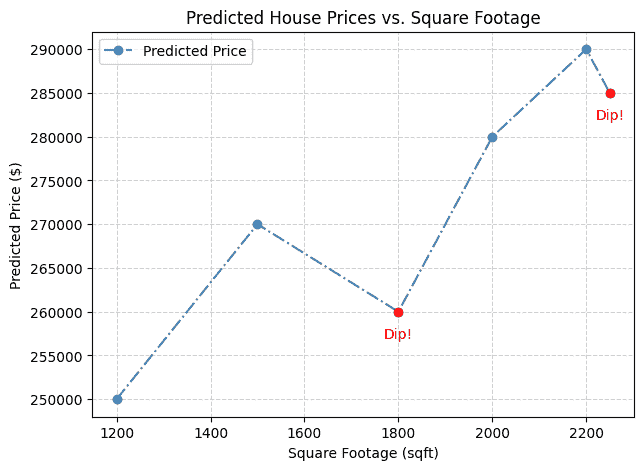
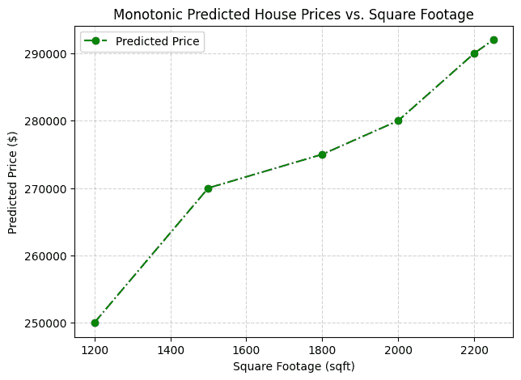

# 设计可信赖的机器学习模型：艾伦与艾达发现机器学习中的单调性

> 原文：[`towardsdatascience.com/designing-trustworthy-ml-models-alan-aida-discover-monotonicity-in-machine-learning/`](https://towardsdatascience.com/designing-trustworthy-ml-models-alan-aida-discover-monotonicity-in-machine-learning/)

## <mdspan datatext="el1755805211291" class="mdspan-comment">简介</mdspan>

机器学习模型很强大，但有时它们会产生违反人类直觉的预测。

想象一下：你正在预测房价。一个 2000 平方英尺的房子预测的价格比 1500 平方英尺的房子便宜。听起来不对，对吧？

这就是**单调性约束**介入的地方。它们确保模型遵循我们期望的逻辑业务规则。

让我们跟随两位同事，**艾伦**和**艾达**，了解他们在机器学习中为什么单调性很重要。

## 故事：艾伦与艾达的发现

艾伦是一位务实的工程师。艾达是一位有原则的科学家。他们一起构建了一个房价预测模型。

艾伦自豪地向艾达展示他的模型结果：

“看！R² 值很好，误差很低。我们准备部署了！”

艾达将模型拿出进行测试：

+   对于面积为**1500 平方英尺**的房屋→模型预测**$300,000**

+   对于面积为**2000 平方英尺**的房屋→模型预测**$280,000** 😮

艾达看着预测结果皱起了眉头：

“等等…为什么这个 2000 平方英尺的房子预测的价格比 1500 平方英尺的房子便宜？这说不通。”

艾伦耸了耸肩：

“那是因为模型在训练数据中发现了噪声。它并不总是合乎逻辑的。但是，整体上准确率是好的。这还不够吗？”

艾达摇了摇头：

“不尽然。一个可信赖的模型不仅必须是准确的，还必须遵循人们可以信赖的逻辑。如果大房子有时看起来更便宜，客户就不会信任我们。我们需要保证。这是一个**单调性问题**。”

就这样，艾伦学到了他的下一个重要机器学习课程：指标并非一切。

## 机器学习中的单调性是什么？

艾达解释说：

**“单调性”意味着随着输入的变化，预测结果会朝着一致的方向移动。这就像告诉模型：随着面积的增大，价格永远不会下降。我们称之为**单调递增**。或者，以另一个例子来说，随着房屋年龄的增长，预测价格不应上升。我们称之为**单调递减**。”

艾伦总结说：

“所以这里的单调性很重要，因为它：

+   与**业务逻辑**一致，

+   提高信任度和**可解释性**。”

艾达点了点头：

+   “是的，而且它有助于满足**公平性与监管期望**。”

## 可视化问题

Aida 在 Pandas 中创建了一个玩具数据集来展示问题：

```py
import pandas as pd

# Example toy dataset
data = pd.DataFrame({
   "sqft": [1200, 1500, 1800, 2000, 2200, 2250],
   "predicted_price": [250000, 270000, 260000, 280000, 290000, 285000]  # Notice dip at 1800 sqft and 2250 sqft
})

# Sort by sqft
data_sorted = data.sort_values("sqft")

# Check differences in target
data_sorted["price_diff"] = data_sorted["predicted_price"].diff()

# Find monotonicity violations (where price decreases as sqft increases)
violations = data_sorted[data_sorted["price_diff"] < 0]
print("Monotonicity violations:\n", violations)
```

```py
Monotonicity violations:
    sqft   price  price_diff
2  1800  260000    -10000.0
5  2250  285000     -5000.0
```

然后，她绘制了违规情况：

```py
import matplotlib.pyplot as plt
plt.figure(figsize=(7,5))
plt.plot(data["sqft"], data["predicted_price"], marker="o", linestyle="-.", color="steelblue", label="Predicted Price")

# Highlight the dips
for sqft, price, price_diff in violations.values:
 plt.scatter(sqft, price, color="red", zorder=5)
 plt.text(x=sqft, y=price-3000, s="Dip!", color="red", ha="center")

# Labels and title
plt.title("Predicted House Prices vs. Square Footage")
plt.xlabel("Square Footage (sqft)")
plt.ylabel("Predicted Price ($)")
plt.grid(True, linestyle="--", alpha=0.6)
plt.legend()
```



艾达指向低谷：“这里的问题是：**1800 平方英尺的价格低于 1500 平方英尺，而 2250 平方英尺的价格低于 2200 平方英尺**。”

## 在 XGBoost 中使用单调性约束来修复问题

Alan 重新训练模型，并对*面积*设置**单调递增约束**，对*房屋年龄*设置**单调递减约束**。

这迫使模型始终

+   当所有其他特征固定时，给定*面积*增加（或保持不变）。

+   当房屋年龄增加（或保持不变）时，给定所有其他特征固定。

他使用 XGBoost，这使得强制单调性变得容易：

```py
import xgboost as xgb
from sklearn.model_selection import train_test_split

df = pd.DataFrame({
   "sqft": [1200, 1500, 1800, 2000, 2200],
   "house_age": [30, 20, 15, 10, 5],
   "price": [250000, 270000, 280000, 320000, 350000]
})

X = df[["sqft", "house_age"]]
y = df["price"]

X_train, X_test, y_train, y_test = train_test_split(X, y, 
                                    test_size=0.2, random_state=42)

monotone_constraints = {
   "sqft": 1,        # Monotone increasing
   "house_age": -1   # Monotone decreasing
}

model = xgb.XGBRegressor(
   monotone_constraints=monotone_constraints,
   n_estimators=200,
   learning_rate=0.1,
   max_depth=4,
   random_state=42
)

model.fit(X_train, y_train)

print(X_test)
print("Predicted price:", model.predict(X_test.values))
```

```py
 sqft  house_age
1  1500         20
Predicted price: [250000.84]
```

Alan 将新模型交给 Aida。“现在模型尊重领域知识。对于更大的房屋的预测**永远不会低于**较小的房屋。”

Aida 再次测试模型：

+   1500 平方英尺 → $300,000

+   2000 平方英尺 → $350,000

+   2500 平方英尺 → $400,000

现在，她看到了更平滑的房价与面积的关系图。

```py
import matplotlib.pyplot as plt

data2 = pd.DataFrame({
  "sqft": [1200, 1500, 1800, 2000, 2200, 2250],
  "predicted_price": [250000, 270000, 275000, 280000, 290000, 292000]
})

plt.figure(figsize=(7,5))
plt.plot(data2["sqft"], data2["predicted_price"], marker="o", 
                     linestyle="-.", color="green", label="Predicted Price")

plt.title("Monotonic Predicted House Prices vs. Square Footage")
plt.xlabel("Square Footage (sqft)")
plt.ylabel("Predicted Price ($)")
plt.grid(True, linestyle="--", alpha=0.6)
plt.legend()
```



**Aida:** “完美！当房屋年龄相同时，更大的面积始终会导致更高的或相等的房价。相反，如果房屋面积相同，那么较旧的房屋价格总是会低一些。”

**Alan:** “是的——我们给模型提供了与领域知识一致的*限制条件*。”

### 现实世界案例

**Alan:** 哪些其他领域可以从单调性约束中受益？

**Aida:** 在任何涉及客户或金钱的地方，单调性都可能影响信任。一些单调性真正重要的领域包括：

+   **房屋定价** → 更大的房屋不应定价低于。

+   **贷款批准** → 更高的收入不应降低批准概率。

+   **信用评分** → 更长的还款历史不应降低评分。

+   **客户终身价值 (CLV)** → 更多购买不应降低 CLV 预测。

+   **保险定价** → 更多的保险范围不应降低保费。

* * *

## 吸收要点

+   仅准确性并不能保证**可靠性**。

+   单调性确保预测与**常识和商业规则**一致。

+   客户、监管机构和利益相关者更有可能接受和使用既**准确又合理**的模型。

正如 Aida 提醒 Alan 的：

“让模型不仅聪明，而且明智。”

* * *

## 结束语

下次你构建模型时，不要只问：“它的准确度如何？”也要问：“它对使用它的人有意义吗？”

单调性约束是设计**可信赖的机器学习模型**的许多工具之一——与可解释性、公平性约束和透明度并列。

. . .

感谢阅读！我经常分享关于实用 AI/ML 技术的见解——如果你想要继续对话，请通过[LinkedIn](https://linkedin.com/in/mehdimo)与我联系。
