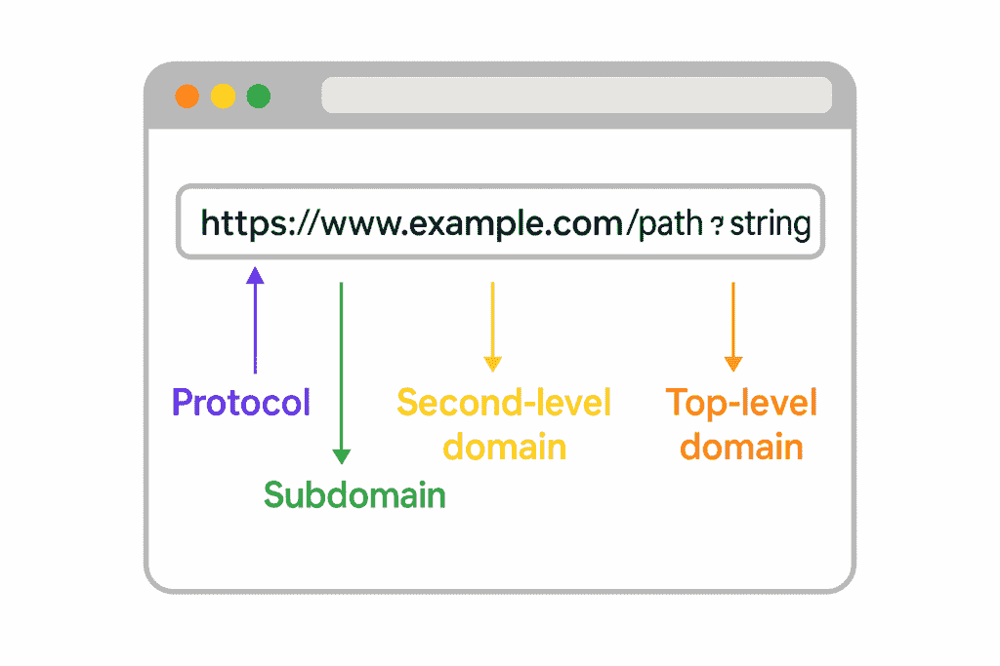
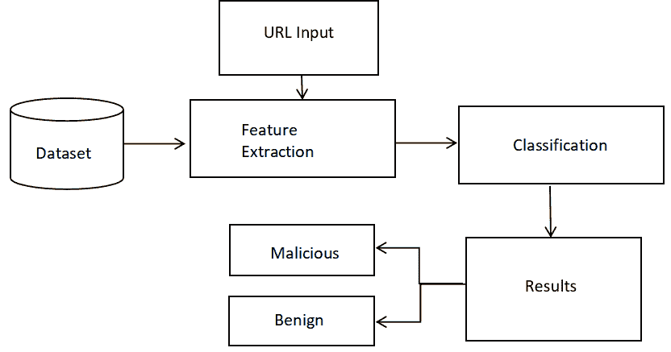
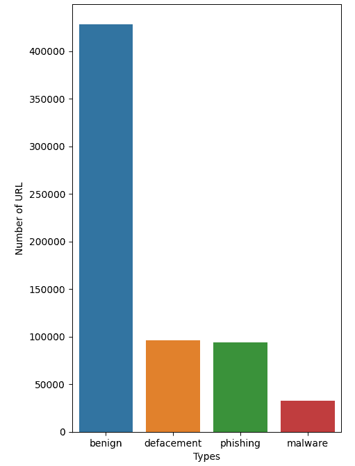
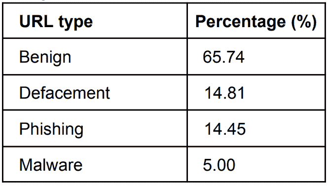
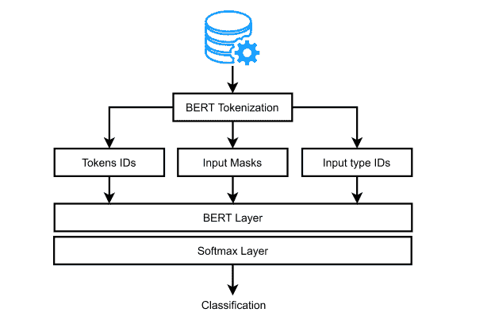
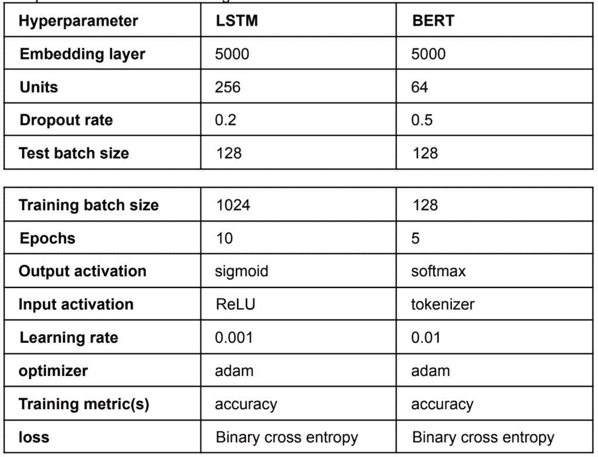
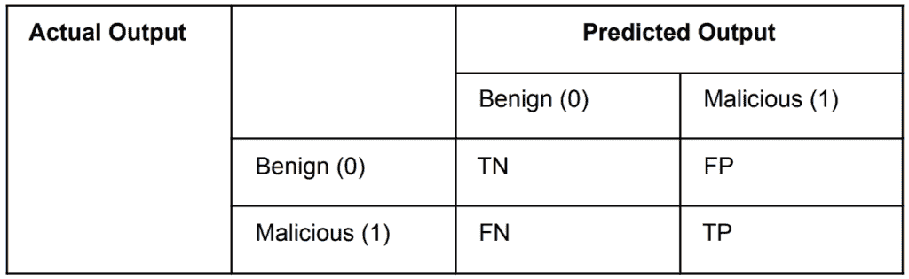
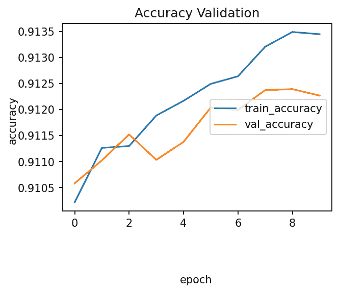
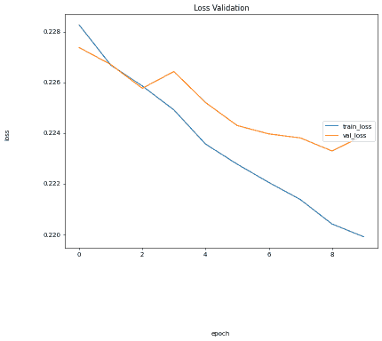
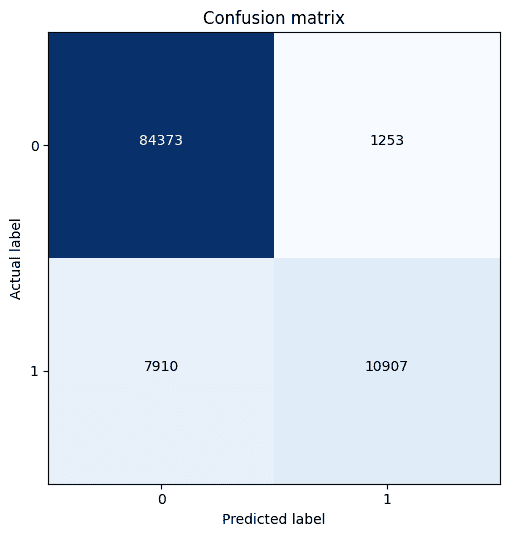

# 使用 LSTM 和 Google 的 BERT 模型检测恶意 URL

> 原文：[`towardsdatascience.com/detecting-malicious-urls-using-lstm-and-googles-bert-models/`](https://towardsdatascience.com/detecting-malicious-urls-using-lstm-and-googles-bert-models/)

## <mdspan datatext="el1743654994608" class="mdspan-comment">概述</mdspan>

网络犯罪的兴起使得欺诈网页检测成为确保互联网安全的重要任务。显然，这些风险，如私人信息的盗窃、恶意软件和病毒，与电子邮件、社交媒体应用程序和网站上的在线活动有关。这些被称为恶意 URL 的网络威胁被网络犯罪分子用来诱使用户访问看似真实或合法的网页。

本文探讨了涉及转换器算法的深度学习系统的发展，旨在通过改进现有方法，如长短期记忆（LSTM）来检测恶意 URL。Devlin 等人（2019 年）介绍了由 Google Brain 在 2017 年开发的自然语言建模算法（BERT）。该模型能够做出更准确的预测，从而超越长短期记忆（LSTM）和门控循环单元（GRU）等循环神经网络系统。在本项目中，我比较了 BERT 的性能与 LSTM 作为文本分类技术。使用包含超过 600,000 个 URL 的处理数据集，开发了一个预训练模型，并使用性能指标如 r2 分数、准确率、召回率等进行了比较。（Y. E. Seyyar 等人，2022 年）。该 LSTM 算法在异常和常见请求的分类中实现了 91.36% 的准确率和 0.90 的 F1 分数（高于 BERT 的）。关键词：恶意 URL、长短期记忆、钓鱼、良性、从转换器中提取的双向编码器表示（BERT）。

## 1.0 引言

随着互联网的可用性，多年来用户数量不断增加。由于所有数字设备都连接到互联网，这也导致了通过网站、社交媒体、电子邮件、应用程序等途径的钓鱼威胁不断增加。（Morgan, S., 2024 年）报告称，由于私人信息泄露，全球损失超过 9.5 万亿美元。

因此，多年来已经引入了创新方法来自动化确保更安全的互联网使用和数据保护的任务。Symantec 2016 年互联网安全报告（Vanhoenshoven 等人，2016 年）显示，诈骗者造成了大多数涉及企业数据泄露的浏览器和网站上的网络攻击，以及通过诱饵用户使用统一资源定位符进行的其他纯粹恶意软件尝试。

URL 结构（作者图片）

近年来，网络安全专业人士已经使用黑名单、基于声誉的系统以及机器学习算法来提高恶意软件检测并使网络更安全。谷歌的统计数据显示，每天有超过 9,500 个可疑网页被列入黑名单并阻止。这些恶意网页的存在对网络应用程序的信息安全构成了重大风险，尤其是那些处理敏感数据的应用程序（Sankaran 等人，2021 年）。由于实施起来非常简单，黑名单已经成为标准方式。此外，使用这种策略，误报率也显著降低。然而，问题在于，保持一个广泛的恶意 URL 列表更新非常困难，尤其是考虑到新 URL 通常每天都会创建。为了绕过滤器和欺骗用户，网络犯罪分子想出了巧妙的方法，例如混淆 URL，使其看起来像是真实的。人工智能（AI）领域在这一领域取得了显著进步和应用，包括网络安全。网络安全的一个关键方面是检测和防止恶意 URL，这可能导致严重后果，如数据泄露、身份盗窃和财务损失。鉴于网络威胁的动态和不断变化的特点，检测恶意 URL 是一项艰巨的任务。

本项目旨在开发一个名为“恶意 URL 检测”的文本分类深度学习系统，该系统使用预训练的 Transformer 双向编码器表示（BERT）。BERT 模型能否在恶意 URL 检测中优于现有技术？本研究的预期成果是证明 BERT 模型在检测恶意 URL 方面的有效性，并将其性能与 LSTM 等循环神经网络技术进行比较。我使用了准确率、精确率、召回率和 F1 分数等评估指标来比较模型的性能。

## 2.0. 背景

机器学习方法，如随机森林和多层感知器、支持向量机，以及深度学习方法如 LSTM 和其他 CNN，只是现有文献中提出用于检测有害 URL 的少数方法之一。然而，这些方法存在一些缺点，例如它们需要传统特征，因为它们无法处理复杂数据，从而导致过度拟合。

### 2.1. 相关工作

为了提高获取页面内容或处理文本的时间，(Kan 和 Thi，2005)使用了一种基于 URL 对网站进行分类的方法。在将 URL 解析成几个标记后，收集了分类特征。通过特征对时间顺序中的标记依赖性进行了建模。他们得出结论，当将高质量的 URL 分割与特征提取相结合时，分类率会提高。这种方法为开发用于文本分类的复杂深度学习模型的研究开辟了道路。作为二元文本分类问题，(Vanhoenshoven 等人，2016)开发了用于检测恶意 URL 的模型，并评估了包括朴素贝叶斯、支持向量机、多层感知器等分类器的性能。随后，实现 transformers 的文本嵌入方法在 NLP 任务中产生了最先进的结果。(Maneriker 等人，2021)提出了一个类似的模型，其中他们仅使用 URL 数据预训练和微调了一个现有的 transformer 架构。URL 数据集包括 129 万条训练条目和 178 万条测试条目。最初，BERT 架构支持掩码语言建模框架，在本报告中将不再需要。

在分类过程中，对 BERT 和 RoBERTa 算法进行了微调，并对结果进行了评估和比较，提出了一个名为 URLTran（URL 变压器）的模型，该模型使用变压器显著提高了恶意 URL 检测的性能，与其它深度学习网络相比，具有非常低的误报率。使用这种方法，URLTran 模型实现了 86.8%的真正阳性率（TPR），与最佳基线的 71.20%的 TPR 相比，提高了 21.9%。这种方法能够对检测到的 URL 进行分类和预测，判断其是良性还是恶意。

此外，(Ren 等人，2019)提出了一种基于 RNN 的模型，其中使用预训练的 Word2Vec 将提取的 URL 转换为词向量（字符），并通过 Bi-LSTM（双向长短期记忆）进行分类。经过验证和评估后，该模型达到了 98%的准确率和 95.9%的 F1 分数。该模型几乎优于所有 NLP 技术，但只能一次处理一个文本特征。然而，需要开发一个改进的模型，使用 BERT 一次性处理序列输入。尽管这些模型在大数据方面已经显示出一些改进，但它们并非没有局限性。例如，文本数据的序列特性可能对 RNN 来说比较困难，而 CNN 大多数时候无法捕捉数据中的长期依赖性（Alzubaidi 等人，2021）。随着网络中文本数据量和复杂性的持续增加，当前模型可能变得不适用。

## 3.0\. 目标

本项目阐述了双向预训练模型在文本分类中的重要性。（Radford 等人，2018）实现了单向语言模型来预训练 BERT。与这一不同，创建了一个浅层连接的独立训练的从左到右和从右到左的线性模型（Devlin 等人，2019；Peters 等人，2018）。在这里，我使用预训练的 BERT 模型在大型句子级和标记级任务上实现最先进的性能（Han 等人，2021），目的是超越许多 RNN 架构，从而减少对这些框架的需求。在这种情况下，LSTM 算法的超参数将不会进行微调。

具体来说，这篇研究论文强调：

1.  开发 LSTM 和预训练 BERT 模型来检测（分类）URL 是否不安全。

1.  使用诸如召回率、准确率、F1 分数、精确度等评估指标来比较基础模型（LSTM）和预训练 BERT 的结果。这将有助于确定基础模型的表现是否更好。

1.  BERT 自动学习上下文中单词和字符的潜在表示。唯一任务是微调 BERT 模型以改进基线性能。这提出了一种计算上简单的方法来替代资源密集型和计算昂贵的 RNN 架构。

1.  分析和模型开发及评估大约花费了 7 周时间，目标是使用 Google 的 BERT 模型显著减少训练运行时间。

## 4.0. 方法论

本节解释了实现用于检测恶意 URL 的深度学习系统所涉及的所有过程。在这里，从 NLP 序列角度开发了一个基于转换器的框架（Rahali 和 Akhloufi，2021），并用于对公共数据集进行统计分析。

图 4.0. 方法论流程（改编自[Rahali 和 Akhloufi，2021](https://arxiv.org/abs/2103.03806))

### 4.1. 数据集

本报告使用的[数据集](https://www.kaggle.com/datasets/sid321axn/malicious-urls-dataset)是从 Kaggle 编译和提取的([许可信息](https://creativecommons.org/publicdomain/zero/1.0/))。该数据集是为了执行网页（URL）的恶意或良性分类而准备的。收集了用于训练、验证和测试的 URL 条目数据集。

图片由作者提供([代码可视化](https://github.com/xbabs/Detecting-Malicious-URLs-using-Google-s-BERT-and-LSTM-models/blob/main/detecting_malicious_urls_using%20BERT.ipynb))

为了使用深度学习模型研究数据，从 Phishtank、PhishStorm 和恶意域名黑名单中检索了 651,191 个 URL 条目。它包含：

+   无害 URL：这些是安全的网页供浏览。已知有 428,103 个条目是安全的。

+   篡改 URL：这些网页被网络犯罪分子或黑客用来克隆真实和安全的网站。这些包含 96,457 个 URL。

+   钓鱼 URL：它们伪装成真正的链接来欺骗用户提供个人信息和敏感信息，这可能导致资金损失。整个数据集中有 94,111 个条目被标记为钓鱼 URL。

+   恶意软件 URL：它们被设计成诱导用户将其作为软件和应用程序下载，从而利用漏洞。数据集中有 32,520 个恶意网页链接。

表 4.1. URL 类型及其在数据集中的比例（图片由作者提供）

### 4.2. 特征提取

对于 URL 数据集，特征提取被用于将原始输入数据转换为机器学习算法支持的形式（Li 等，2020 年）。它将分类数据转换为数值特征，而特征选择则从原始数据集中选择相关特征的一个子集（Dash 和 Liu，1997 年；Tang 和 Liu，2014 年）。

查看数据分析和模型开发文件[此处](https://github.com/xbabs/Detecting-Malicious-URLs-using-Google-s-BERT-and-LSTM-models/blob/main/detecting_malicious_urls_using%20BERT.ipynb)。以下步骤被采取：

1. 将钓鱼、恶意软件和篡改 URL 合并为恶意 URL 类型，以进行更好的选择。然后，所有 URL 都被标记为良性或恶意。

2. 将 URL 类型从分类变量转换为数值。这是一个关键过程，因为深度学习模型训练只需要数值。良性 URL 和钓鱼 URL 分别被分类为 0 和 1，并传递到一个名为“Category”的新列中。

3. 使用‘url_len’特征来计算 URL 长度，从数据集中的 URL 中提取特征。使用‘process_tld’函数，提取每个 URL 的最高级域名（TLD）。

4. 一些用于 URL 分类的潜在特征包括特定字符[‘@’，‘？’，‘-’，‘=’，‘.’，‘#’，‘%’，‘+’，‘$’，‘!’，‘*’，‘,’，‘//’]的存在，这些特征被表示并添加到数据集中作为列，使用的是‘abnormal_url’特征。此特征（函数）使用二进制分类来验证每个 URL 字符是否存在异常。5. 对数据集进行了另一项选择，例如字符数（字母和数字）、https、短链接服务和所有条目的 IP 地址。这些提供了更多用于训练模型的信息。

### 4.3. 分类 - 模型开发和训练

使用预先标记的特征，训练数据学习标签和文本之间的关联。这一阶段涉及在数据集中识别 URL 类型。作为一种 NLP 技术，需要将文本（单词）分配到句子和查询中（Minaee 等人，2021 年）。循环神经网络模型架构定义了一个优化的模型。为了确保数据集平衡，数据被分为 80%的训练集和 20%的测试集。文本使用词嵌入对 LSTM 和预训练的 BERT 模型进行了标记。因考虑其为自动二元分类，所以依赖变量包括编码的 URL 类型（类别）。

#### 4.3.1. 长短期记忆模型

由于其能够使用 word2vec（Mikolov 等人，2013 年）捕获长期依赖性并在数十亿个单词上训练，LSTM 被发现是最受欢迎的架构。在预处理和特征提取后，数据被设置为 LSTM 模型的训练、测试和验证。在训练模型之前，提出了序列长度、层数（输入层和输出层）的数量和大小。为了实现最佳性能，调整了超参数，如 epoch、学习率、批量大小等。

典型的 LSTM 单元的内存单元有三个门（输入门、遗忘门和输出门）（Feng 等人，2020 年）。与“前馈神经网络中任何时刻的神经元输出”不同，任何时刻的输出可以是与输入相同的神经元（Do 等人，2021 年）。为了防止过拟合，在多个层中依次实现了 dropout 函数。首先添加的是嵌入层，用于创建输入文本数据中单词的密集向量表示。然而，由于训练时间较长，这个架构中只使用了单个 LSTM 层。

#### 4.3.2. BERT 模型

研究人员提出了 BERT 架构用于 NLP 任务，因为它在整体性能上优于 RNN 和 LSTM。在这个项目中实现了预训练的 BERT 模型来处理文本序列并捕获输入的语义信息，这有助于提高恶意 URL 检测的训练时间和准确性。在预处理 URL 数据后，它们被转换为标记序列，然后输入 BERT 模型进行处理（Chang 等人，2021 年）。由于这个项目中的数据条目很大，BERT 模型被微调以学习每种类型 URL 的相关特征。一旦模型训练完成，它被用来以改进的准确性和性能将 URL 分类为恶意（钓鱼）或良性。

[谷歌的 BERT 模型架构](https://arxiv.org/abs/2012.15524)（Song 等人，2021 年）

（图 4.3.2）描述了使用 BERT 算法进行模型训练所涉及的过程。需要一个分词阶段来将文本分割成字符。最初，原始文本被分割成单词，然后通过一个

查找表。使用 BertTokenizer 类实现了 WordPiece 分词（Song 等人，2021 年）。分词器包括 BERT 分词算法和 WordPieceTokenizer（Rahali 和 Akhloufi，2023 年）。它接受单词（句子）作为输入，并输出标记 ID。

## 5.0\. 实验

对于 BERT，使用了特定的超参数，而基于验证集上的性能，对具有单个隐藏层的 LSTM 模型进行了调整。由于数据集不平衡，只解析了 522,214 条条目，包括 417,792 个训练数据和 104,422 个测试数据，训练-测试分割为 70%至 30%。

下面描述了用于训练的参数：

表 5.0\. Keras 库中用于 LSTM 和 BERT 模型的超参数（图片由作者提供）

### 5.1\. LSTM（基线）

结果表明，为了实现 91.23%的训练准确率和 91.36%的验证准确率，相应的 dropout 率为 0.2，批大小为 1024。然而，由于训练时间过长（平均 25.8 分钟），在架构中只使用了单个 LSTM 层。但是，向神经网络中添加更多层会导致性能显著下降。

计算问题，从而降低了模型的总体性能。

（Do 等人，2021 年）

### 5.2\. 预训练 BERT 模型

此模型进行了分词，但缺点是分类器无法在检查点初始化。因此，一些层受到了影响。该模型在预训练之前需要进一步进行序列分类。由于计算复杂，期望未能实现。然而，它被提出具有出色的性能。

## 6.0\. 结果

使用性能指标对使用两种模型开发的实验结果进行了评估。这些指标旨在展示测试数据在模型上的表现。它们被用来评估所提出的方法在检测恶意网页方面的有效性。

### 6.1\. 性能指标

为了评估所提出指标的性能，使用了混淆矩阵，因为它具有评估措施。

表 6.1 实际和预测结果的二元分类

+   真阳性（TP）：被准确预测为恶意（钓鱼）的样本（Amanullah 等人，2020 年）。

+   真阴性（TN）：被准确预测为良性 URL 的样本。

+   假阳性（FP）：被错误预测为钓鱼 URL 的样本。

+   假阴性（FN）：被错误预测为良性 URL 的实例。

    **准确率** = (TP + TN) / (TP + TN + FP + FN)

    **精确率** = TP / (TP + FP)

    **召回率** = TP / (TP + FN)

    **F1 分数** = (2 × 精确率 × 召回率) / (精确率 + 召回率)

[LSTM 的准确率验证和损失验证](https://github.com/xbabs/Detecting-Malicious-URLs-using-Google-s-BERT-and-LSTM-models/blob/main/detecting_malicious_urls_using%20BERT.ipynb)。图片由作者提供

然而，由于数据不平衡和数据集较大，预训练的 BERT 无法达到更高的期望。

[LSTM 和 BERT 模型的混淆矩阵](https://github.com/xbabs/Detecting-Malicious-URLs-using-Google-s-BERT-and-LSTM-models/blob/main/detecting_malicious_urls_using%20BERT.ipynb)（图片由作者提供）

## 7.0. 结论

总体而言，LSTM 模型可以成为建模时序数据和基于时间依赖性进行预测的有力工具。然而，在决定使用 LSTM 模型之前，仔细考虑数据的性质和问题的本质非常重要，同时还需要正确设置和调整模型以获得最佳结果。由于数据集较大，增加批大小（1024）缩短了训练时间并提高了模型的验证准确率。这可能是因为在训练和测试过程中没有对模型进行分词。BERT 的最大序列长度为 512 个标记，这可能对某些应用来说不太方便。如果序列长度将短于限制，则需要向其中添加标记，否则应将其截断（Rahali 和 Akhloufi，2021）。此外，为了更好地理解单词和句子，BERT 需要修改嵌入来表示字符中的上下文。尽管这些功能与复杂的单词嵌入一起表现良好，但使用更大的数据集时，这也可能导致更长的训练时间。然而，需要进一步的研究来检测恶意 URL 检测过程中的模式。

## 参考文献

+   Alzubaidi, L., Zhang, J., Humaidi, A. J., Duan, Y., Santamaría, J., Fadhel, M. A., & Farhan, L. (2021). 深度学习综述：概念、CNN 架构、挑战、应用、未来方向。大数据杂志，8(1)，1-74。https://doi.org/10.1186/s40537-021-00444-8

+   Amanullah, M. A., Habeeb, R. A. A., Nasaruddin, F. H., Gani, A., Ahmed, E., Nainar, A. S. M., Akim, N. M., & Imran, M. (2020). 物联网安全中的深度学习和大数据技术。计算机通信，151，495-517。https://doi.org/10.1016/j.comcom.2020.01.016

+   Chang, W., Du, F., and Wang, Y. (2021). “基于 BERT 模型的恶意 URL 检测技术研究，” IEEE 第 9 届信息、通信和网络国际会议（ICICN），中国西安，第 340-345 页，doi: 10.1109/ICICN52636.2021.9673860.

+   Dash, M., & Liu, H. (1997). 用于分类的特征选择. 智能数据分析，1(1-4), 131-156\. https://doi.org/10.1016/S1088-467X(97)00008-5

+   Do, N.Q., Selamat, A., Krejcar, O., Yokoi, T. and Fujita, H. (2021). 基于深度学习算法的钓鱼网页分类：一项实证研究. Applied Sciences, 11(19), p.9210.

+   Devlin, J., Chang, M. W., Lee, K., & Toutanova, K. (2019). BERT: 用于语言理解的深度双向变换器预训练. arXiv preprint arXiv:1810.04805.

+   Feng, J., Zou, L., Ye, O., and Han, Han. (2020) “Web2Vec: 基于深度学习的多维特征驱动的钓鱼网页检测方法,” in IEEE Access, vol. 8, pp. 221214-221224, doi: 10.1109/ACCESS.2020.3043188

+   Han, X., Zhang, Z., Ding, N., Gu, Y., Liu, X., Huo, Y., Qiu, J., Yao, Y., Zhang, A., Zhang, L., Han, W., Huang, M., Jin, Q., Lan, Y., Liu, Y., Liu, Z., Lu, Z., Qiu, X., Song, R., . . . Zhu, J. (2021). 预训练模型：过去、现在和未来. AI Open，2，225- 250\. https://doi.org/10.1016/j.aiopen.2021.08.002

+   Morgan, S. (2024). 2024 网络安全年鉴：100 个事实、数据、预测和统计. Cybersecurity Ventures. https://cybersecurityventures.com/2024-cybersecurity-almanac/ Kan, M-Y., and Thi, H. (2005). 使用 URL 特征进行快速网页分类. 325- 326\. 10.1145/1099554.1099649\.

+   Li, Q., Peng, H., Li, J., Xia, C., Yang, R., Sun, L., Yu, P.S. and He, L. (2020). 文本分类综述：从浅层到深度学习. arXiv preprint arXiv:2008.00364\. Maneriker, P., Stokes, J. W., Lazo, E. G., Carutasu, D., Tajaddodianfar, F., & Gururajan, A. (2021). URLTran：使用 Transformer 提高钓鱼 URL 检测. ArXiv. /abs/2106.05256

+   Mikolov, T., Sutskever, I., Chen, K., Corrado, G.S. and Dean, J. (2013). 词和短语的分布式表示及其组合性. 神经信息处理系统进展，26\.

+   Minaee, S., Kalchbrenner, N., Cambria, E., Nikzad, N., Chenaghlu, M. and Gao, J. (2021). 基于深度学习的文本分类. ACM 计算机评论，54(3), pp.1–40\. doi:https://doi.org/10.1145/3439726\.

+   Peters, M.E., Ammar, W., Bhagavatula, C. and Power, R. (2017). 基于双向语言模型的半监督序列标记. arXiv:1705.00108 [cs]. [online] Available at: https://arxiv.org/abs/1705.00108.

+   Radford, A., Narasimhan, K., Salimans, T. and Sutskever, I. (2018). 通过生成预训练改进语言理解. [online] Available at: https://www.cs.ubc.ca/~amuham01/LING530/papers/radford2018improving.pdf.

+   Rahali, A. & Akhloufi, M. A. (2021) MalBERT：使用 Transformer 进行网络安全和恶意软件检测. arXiv Preprint arXiv:2103.03806

+   Ren, F., Jiang, Z., & Liu, J. (2019). 用于恶意 URL 检测的双向 LSTM 模型与注意力机制. 2019 IEEE 第四届高级信息技术、电子与自动化控制会议 (IAEAC), 1, 300-305\.

+   Sankaran, M., Mathiyazhagan, S., ., P., Dharmaraj, M. (2021). ‘使用机器学习技术检测恶意网址’，国际水生科学杂志，第 12 卷，第 3 期，第 1980-1989 页

+   Song, X., Salcianu, A., Song, Y., Dopson, D., and Zhou, D. (2020). 快速 WordPiece 分词。ArXiv. /abs/2012.15524 Tang, J., Alelyani, S. and Liu, H. (2014). 用于分类的特征选择：综述。数据分类：算法与应用，第 37 页。

+   Vanhoenshoven, F., Napoles, G., Falcon, R., Vanhoof, K. & Koppen, M. (2016) 使用机器学习技术检测恶意网址。IEEE。

+   Y. E. Seyyar, A. G. Yavuz and H. M. Ünver. (2022) 基于 BERT 和深度学习的攻击检测框架。IEEE Access，第 10 卷，第 68633-68644 页，2022 年，doi: 10.1109/ACCESS.2022.3185748.
