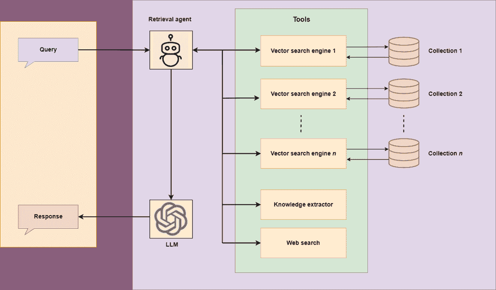
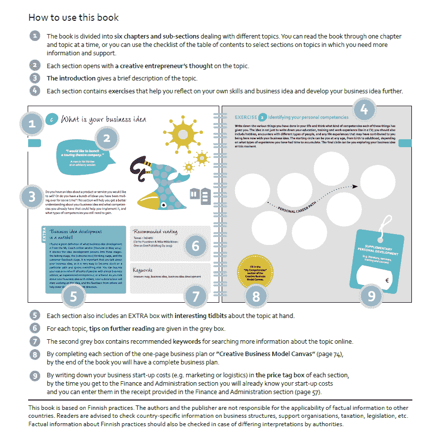
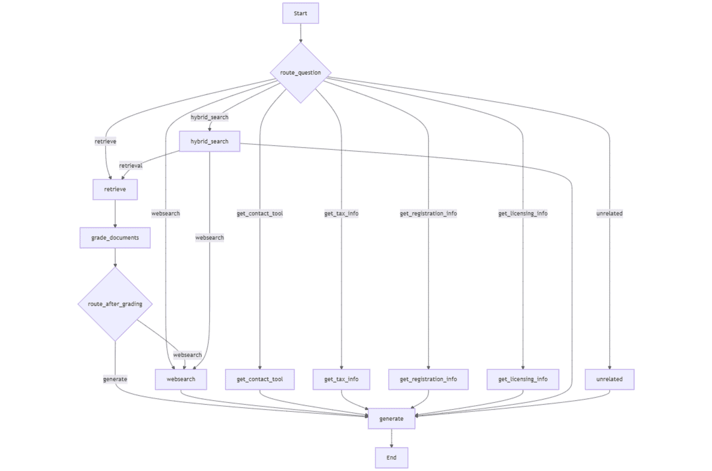
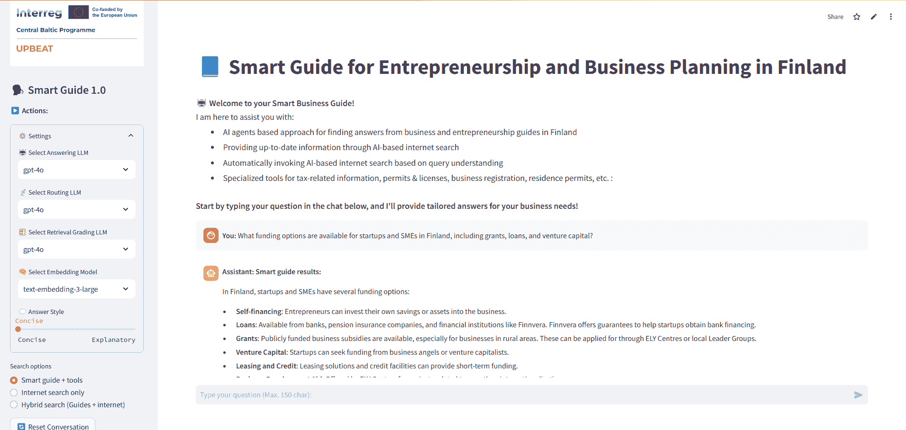
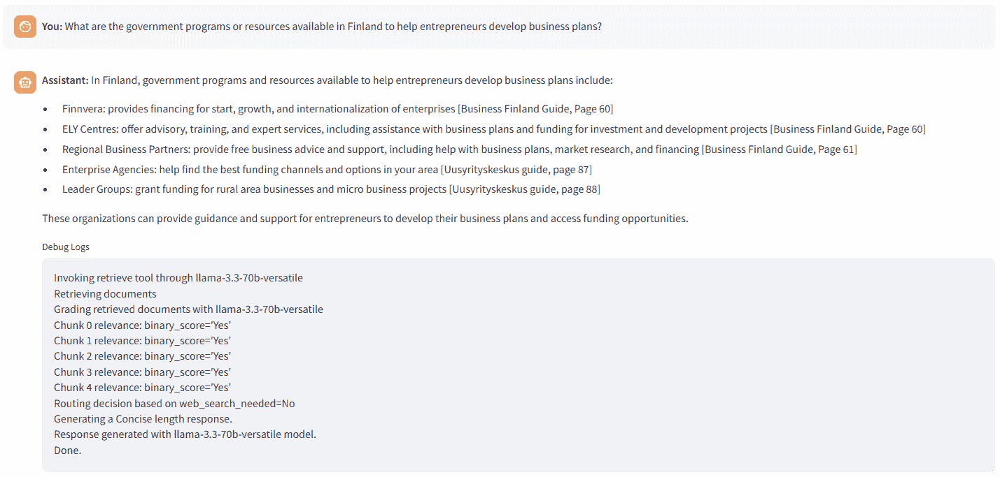
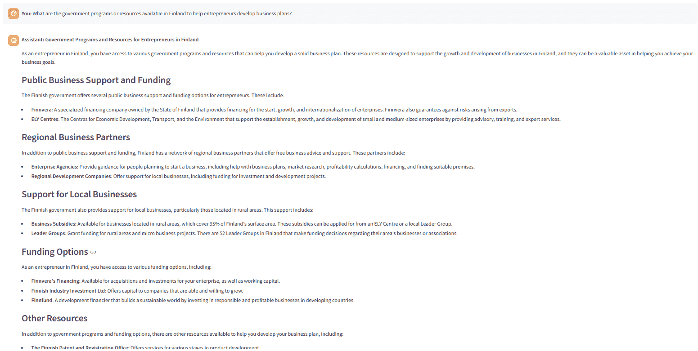
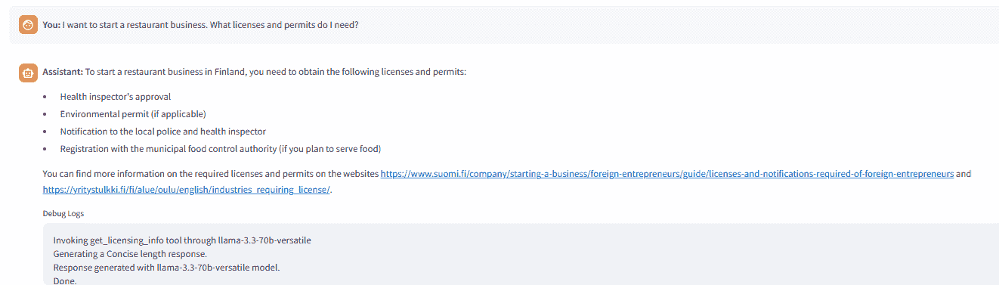
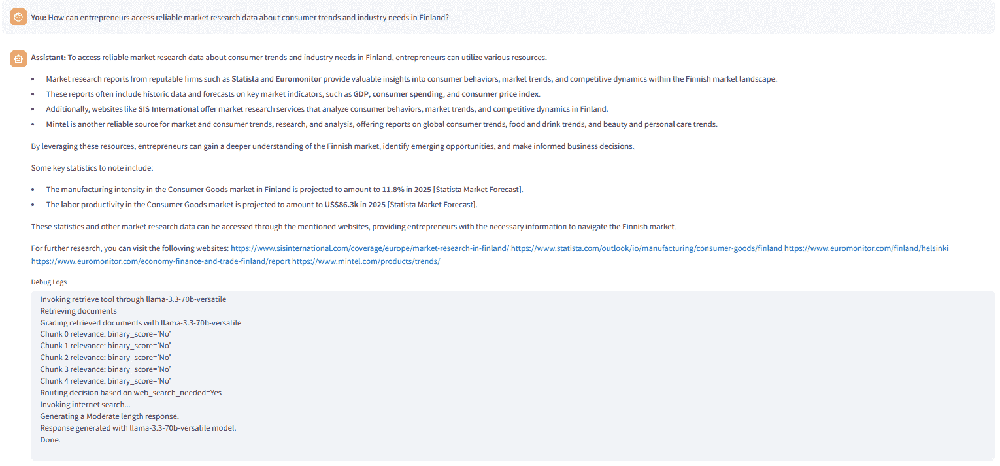
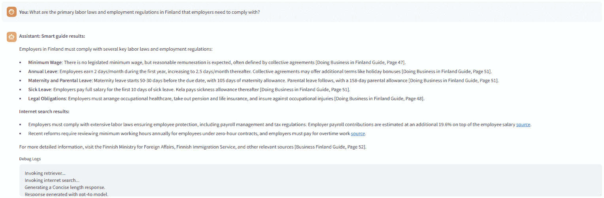

# 开发一个用于商业规划和创业的 AI 智能指南

> 原文：[`towardsdatascience.com/developing-an-ai-powered-smart-guide-for-business-planning-entrepreneurship-ea1bc328ff01/`](https://towardsdatascience.com/developing-an-ai-powered-smart-guide-for-business-planning-entrepreneurship-ea1bc328ff01/)

### ***如果您不是 Medium 会员，您可以通过[此链接](https://towardsdatascience.com/developing-an-ai-powered-smart-guide-for-business-planning-entrepreneurship-ea1bc328ff01?sk=bd83c4049d77992bc5ef32bfc3cdb14a)阅读完整故事。***

在 ChatGPT 推出以及随后大型语言模型（LLMs）的激增之后，它们固有的幻觉、知识截止日期以及无法提供组织或个人特定信息的局限性很快变得明显，并被视为主要缺点。为了解决这些问题，检索增强生成（RAG）方法很快获得了关注，这些方法将外部数据集成到 LLMs 中，并指导其行为以回答给定知识库中的问题。

有趣的是，关于 RAG 的第一篇论文于 2020 年由 Facebook AI Research（现 Meta AI）的研究人员发表，但直到 ChatGPT 的出现，其潜力才得到充分实现。从那时起，就没有停止过。引入了更多先进和复杂的 RAG 框架，这不仅提高了该技术的准确性，还使其能够处理多模态数据，扩大了其在广泛应用中的潜力。我在以下文章中详细讨论了这一主题，特别是讨论了上下文多模态 RAG、多模态 AI 搜索在商业应用中的研究以及信息提取和匹配平台。

> [**将多模态数据集成到大型语言模型中**](https://towardsdatascience.com/integrating-multimodal-data-into-a-large-language-model-d1965b8ab00c)
> 
> [**多模态 AI 搜索在商业应用中的研究**](https://towardsdatascience.com/multimodal-ai-search-for-business-applications-65356d011009)
> 
> [**AI 驱动的信息提取和匹配**](https://towardsdatascience.com/ai-powered-information-extraction-and-matchmaking-0408c93ec1b9)

随着 RAG 技术领域的扩展和新兴的数据访问需求，人们意识到，仅提供静态知识库问答功能的检索器 RAG 的功能可以通过整合其他多样化的知识来源和工具来扩展，例如：

+   多个数据库（例如，包含向量数据库和知识图谱的知识库）

+   实时网络搜索以获取最新信息

+   用于收集特定数据的外部 API，例如股市趋势或来自公司特定工具（如 Slack 频道或电子邮件账户）的数据

+   用于数据分析、报告撰写、文献综述和人物搜索等任务的工具

+   比较和整合来自多个来源的信息。



描述检索代理根据用户查询选择工具的情况（图片由作者提供）

要实现这一点，一个 RAG 应该能够根据查询选择最佳的知识源和/或工具。AI 代理的出现引入了“*代理 RAG*”的概念，它可以根据查询选择最佳的行动方案。

在本文中，我们将开发一个特定的代理 RAG 应用程序，称为***智能商业指南（SBG）-***这是我们正在进行的名为[UPBEAT](https://www.haaga-helia.fi/fi/hankkeet/upbeat)项目的第一个版本，该项目由[Interreg Central Baltic](https://interreg.eu/programme/interreg-finland-estonia-latvia-sweden/)资助。该项目专注于利用 AI 提高芬兰和爱沙尼亚移民的创业和商业计划技能。SBG 是该项目提升技能过程中打算使用的工具之一。该工具专注于为打算创业或已经从事商业的人提供来自真实来源的精确和快速信息。

SBG 的代理 RAG 包括：

+   商业和创业指南作为知识库，包含有关商业计划、创业、公司注册、税收、商业想法、规则和法规、商业机会、许可证和执照、商业指南等方面的信息。

+   网络搜索以获取带有来源的最新信息。

+   知识提取工具从可信来源获取信息。这些信息包括相关当局的联系方式、最新的税收规则、最新的商业注册规则和最新的许可法规。

***这个代理 RAG 有什么特别之处？***

+   在整个代理工作流程中，可以选择**不同的开源模型**（*Llama、Mistral、Gemma*）以及**专有模型**（_gpt-4o、gpt-4o-min_i）。

+   强制知识库搜索、网络搜索和混合搜索的选项。

+   对检索到的文档进行评分以改进响应质量，并基于评分智能调用网络搜索。

+   选择响应类型的选项：**简洁的**、**适中的**或**解释性的**。

**具体来说，文章围绕以下主题结构：**

1.  使用 LlamaParse 解析数据以构建知识库。

1.  使用 LangGraph 开发代理工作流程。

1.  使用免费、开源的模型开发高级代理 RAG（以下简称智能商业指南或 SBG）。

***本应用程序的完整代码可以在 [GitHub](https://github.com/umairalipathan1980/Smart-Agentic-Guide) 上找到。***

应用程序代码结构在两个 .*py* 文件中：_agentic*rag.py* 实现整个代理工作流程，*app.py* 实现了 *Streamlit* 图形用户界面。

让我们深入探讨。

### 使用 LlamaParsing 和 LangChain 构建知识库

SBG 的知识库由芬兰机构发布的真实商业和创业指南组成。由于这些指南内容庞大，从中查找所需信息并不简单，因此目的是开发一个代理 RAG，它不仅可以从这些指南中提供精确信息，还可以通过芬兰的网页搜索和其他可信来源更新信息。

[LlamaParse](https://docs.llamaindex.ai/en/stable/llama_cloud/llama_parse/) 是一个专为 LLM 使用案例构建的 genAI-native 文档解析平台。我在上面引用的文章中解释了 LlamaParse 的使用。这次，我直接在 [LlamaCloud](https://cloud.llamaindex.ai/) 上解析了文档。LlamaParse 每天提供 1000 个免费积分。这些积分的使用取决于解析模式。对于仅文本的 PDF，‘*快速*’ 模式（1 积分 / 3 页）效果很好，它跳过了 OCR、图像提取和表格/标题识别。还有其他更高级的模式，每页的积分点数更高。我选择了‘*高级*’模式，该模式执行 OCR、图像提取和表格/标题识别，非常适合包含图像的复杂文档。

我定义了以下解析指令。

```py
You are given a document containing text, tables, and images. Extract all the contents in their correct format. Extract each table in a correct format and include a detailed explanation of each table before its extracted format. 
If an image contains text, extract all the text in the correct format and include a detailed explanation of each image before its extracted text. 
Produce the output in markdown text. Extract each page separately in the form of an individual node. Assign the document name and page number to each extracted node in the format: [Creativity and Business, page 7]. 
Include the document name and page number at the start and end of each extracted page.
```

从 LlamaCloud 下载了解析后的文档，格式为 Markdown。同样的解析也可以通过 LlamaCloud API 进行，如下所示。

```py
import os
from llama_parse import LlamaParse
from llama_index.core import SimpleDirectoryReader

# Define parsing instructions
parsing_instructions = """
Extract the text from the document using proper structure.
"""
def save_to_markdown(output_path, content):
    """
    Save extracted content to a markdown file.

    Parameters:
    output_path (str): The path where the markdown file will be saved.
    content (list): The extracted content to be saved.
    """
    with open(output_path, "w", encoding="utf-8") as md_file:
        for document in content:
            # Extract the text content from the Document object
            md_file.write(document.text + "nn")  # Access the 'text' attribute

def extract_document(input_path):
    # Initialize the LlamaParse parser
    parsing_instructions = """You are given a document containing text, tables, and images. Extract all the contents in their correct format. Extract each table in a correct format and include a detailed explanation of each table before its extracted format. 
    If an image contains text, extract all the text in the correct format and include a detailed explanation of each image before its extracted text. 
    Produce the output in markdown text. Extract each page separately in the form of an individual node. Assign the document name and page number to each extracted node in the format: [Creativity and Business, page 7]. 
    Include the document name and page number at the start and end of each extracted page.
    """
    parser = LlamaParse(
        result_type="markdown",
        parsing_instructions=parsing_instructions,
        premium_mode=True,
        api_key=LLAMA_CLOUD_API_KEY,
        verbose=True
    )

    file_extractor = {".pdf": parser}
    documents = SimpleDirectoryReader(
        input_path, file_extractor=file_extractor
    ).load_data()
    return documents

input_path = r"C:Usersh02317Downloadsdocs"  # Replace with your document path
output_file = r"C:Usersh02317Downloadsextracted_document.md"  # Output markdown file name

# Extract the document
extracted_content = extract_document(input_path)
save_to_markdown(output_file, extracted_content)
```

这里是来自 Pikkala, A. 等人（2015）的指南 [创造力和商业](https://www.humak.fi/wp-content/uploads/2015/04/2015-04-Luovuus-ja-liiketoiminta-_tyokirja_englanti_netti.pdf) 的一个示例页面（“*免费复制用于非商业私人或公共用途，需注明出处*”）。



来自商业指南的一个示例页面（来源：[`www.humak.fi/wp-content/uploads/2015/04/2015-04-Luovuus-ja-liiketoiminta-_tyokirja_englanti_netti.pdf`](https://www.humak.fi/wp-content/uploads/2015/04/2015-04-Luovuus-ja-liiketoiminta-_tyokirja_englanti_netti.pdf))

这是本页面的解析输出。LlamaParse 高效地从页面中的所有结构中提取信息。页面中显示的笔记本是图像格式。

```py
[Creativity and Business, page 8]

# How to use this book

1\. The book is divided into six chapters and sub-sections dealing with different topics. You can read the book through one chapter and topic at a time, or you can use the checklist of the table of contents to select sections on topics in which you need more information and support.

2\. Each section opens with a creative entrepreneur's thought on the topic.

3\. The introduction gives a brief description of the topic.

4\. Each section contains exercises that help you reflect on your own skills and business idea and develop your business idea further.

## What is your business idea

"I would like to launch 
a touring theatre company."

Do you have an idea about a product or service you would like 
to sell? Or do you have a bunch of ideas you have been mull-
ing over for some time? This section will help you get a better 
understanding about your business idea and what competen-
cies you already have that could help you implement it, and 
what types of competencies you still need to gain.

### EXTRA
Business idea development 
in a nutshell

I found a great definition of what business idea development 
is from the My Coach online service (Youtube 27 May 2014). 
It divides the idea development process into three stages: 
the thinking - stage, the (subconscious) talking - stage, and the 
customer feedback stage. It is important that you talk about 
your business idea, as it is very easy to become stuck on a 
particular path and ignore everything else. You can bounce 
your idea around with all sorts of people: with a local business 
advisor; an experienced entrepreneur; or a friend. As you talk 
about your business idea with others, your subconscious will 
start working on the idea, and the feedback from others will 
help steer the idea in the right direction.

### Recommended reading
Taivas + helvetti 
(Terho Puustinen &amp; Mika Mäkeläinen: 
One on One Publishing Oy 2013)

### Keywords
treasure map; business idea; business idea development

## EXERCISE: Identifying your personal competencies

Write down the various things you have done in your life and think what kind of competencies each of these things has 
given you. The idea is not just to write down your education, 
training and work experience like in a CV; you should also 
include hobbies, encounters with different types of people, and any life experiences that may have contributed to you 
being here now with your business idea. The starting circle can be you at any age, from birth to adulthood, depending 
on what types of experiences you have had time to accumulate. The final circle can be you at this moment.

PERSONAL CAREER PATH

SUPPLEMENTARY 
PERSONAL DEVELOPMENT
(e.g. training courses; 
literature; seminars)

Fill in the 
"My Competencies" 
section of the 
Creative Business 
Model Canvas:

5\. Each section also includes an EXTRA box with interesting tidbits about the topic at hand.

6\. For each topic, tips on further reading are given in the grey box.

7\. The second grey box contains recommended keywords for searching more information about the topic online.

8\. By completing each section of the one-page business plan or "Creative Business Model Canvas" (page 74), 
by the end of the book you will have a complete business plan.

9\. By writing down your business start-up costs (e.g. marketing or logistics) in the price tag box of each section, 
by the time you get to the Finance and Administration section you will already know your start-up costs 
and you can enter them in the receipt provided in the Finance and Administration section (page 57).

This book is based on Finnish practices. The authors and the publisher are not responsible for the applicability of factual information to other 
countries. Readers are advised to check country-specific information on business structures, support organisations, taxation, legislation, etc. 
Factual information about Finnish practices should also be checked in case of differing interpretations by authorities.

[Creativity and Business, page 8]
```

使用 LangChain 的 *RecursiveCharacterTextSplitter* 将解析后的 Markdown 文档分割成块，CHUNK_SIZE = 3000 和 CHUNK_OVERLAP = 200。

```py
def staticChunker(folder_path):
    docs = []
    print(f"Creating chunks. CHUNK_SIZE: {CHUNK_SIZE}, CHUNK_OVERLAP: {CHUNK_OVERLAP}")

    # Loop through all .md files in the folder
    for file_name in os.listdir(folder_path):
        if file_name.endswith(".md"):
            file_path = os.path.join(folder_path, file_name)
            print(f"Processing file: {file_path}")
            # Load documents from the Markdown file
            loader = UnstructuredMarkdownLoader(file_path)
            documents = loader.load()
            # Add file-specific metadata (optional)
            for doc in documents:
                doc.metadata["source_file"] = file_name
            # Split loaded documents into chunks
            text_splitter = RecursiveCharacterTextSplitter(chunk_size=CHUNK_SIZE, chunk_overlap=CHUNK_OVERLAP)
            chunked_docs = text_splitter.split_documents(documents)
            docs.extend(chunked_docs)
    return docs
```

随后，在 Chroma 数据库中使用嵌入模型（如开源的*all-MiniLM-L6-v2*模型或 OpenAI 的*text-embedding-3-large*）创建向量存储。

```py
def load_or_create_vs(persist_directory):
    # Check if the vector store directory exists
    if os.path.exists(persist_directory):
        print("Loading existing vector store...")
        # Load the existing vector store
        vectorstore = Chroma(
            persist_directory=persist_directory,
            embedding_function=st.session_state.embed_model,
            collection_name=collection_name
        )
    else:
        print("Vector store not found. Creating a new one...n")
        docs = staticChunker(DATA_FOLDER)
        print("Computing embeddings...")
        # Create and persist a new Chroma vector store
        vectorstore = Chroma.from_documents(
            documents=docs,
            embedding=st.session_state.embed_model,
            persist_directory=persist_directory,
            collection_name=collection_name
        )
        print('Vector store created and persisted successfully!')

    return vectorstore
```

### 创建代理工作流程

> AI 代理是工作流程和决策逻辑的组合，可以智能地回答问题或执行需要分解为更简单子任务的其他复杂任务。

我使用 LangGraph 为我们的 AI 代理设计了一个以图形形式表示的动作或决策序列的工作流程。我们的代理必须决定是否从向量数据库（知识库）、网络搜索、混合搜索或使用工具来回答问题。

在我接下来的文章中，我解释了使用 LangGraph 创建代理工作流程的过程。

> [**如何使用自动网络搜索免费开发 AI 代理**](https://ai.gopubby.com/how-to-develop-a-free-ai-agent-with-automatic-internet-search-5ea24928d26b)

我们需要创建代表工作流程决策（例如，网络搜索或向量数据库搜索）的图**节点**。节点通过**边**连接，这些边定义了决策和动作的流程（例如，检索后的下一个状态是什么）。图**状态**跟踪信息在图中的移动，以便代理使用每一步的正确数据。

工作流程的入口是一个路由函数，它通过分析用户的查询来确定工作流程中要执行的初始节点。整个工作流程包含以下节点。

+   ***retrieve***: 从向量存储中检索语义上相似的信息块。

+   _**grade_documents**_: 根据用户的查询对检索到的片段的相关性进行评分。

+   _**route_after_grading**_: 根据评分，确定是否使用检索到的文档生成响应或继续进行网络搜索。

+   ***websearch***: 使用[Tavily](https://tavily.com/)搜索引擎的 API 从网络来源获取信息。

+   ***generate***: 使用提供的上下文（从向量存储和/或网络搜索中检索到的信息）生成对用户查询的响应。

+   _**get_contact_tool**_: 从与芬兰移民服务相关的预定义可信 URL 中获取联系信息。

+   _**get_tax_info**_: 从预定义的可信 URL 中获取与税收相关的信息。

+   _**get_registration_info**_: 从预定义的可信 URL 中获取芬兰公司注册流程的详细信息。

+   _**get_licensing_info**_: 从预定义的可信 URL 中获取有关在芬兰开展业务所需的许可证和许可的信息。

+   _**hybrid_search**_: 将文档检索和网络搜索结果结合起来，为回答查询提供更广泛的上下文。

+   ***unrelated***: 处理与工作流程焦点无关的问题。

这里是工作流程中的边。

+   _**retrieve → grade_documents**_: 将检索到的文档发送进行评分。

+   _**grade_documents → websearch**_: 如果检索到的文档被认为是不相关的，则调用网络搜索。

+   _**grade_documents → generate**_: 如果检索到的文档相关，则继续响应生成。

+   ***websearch → generate***: 将网络搜索的结果传递给响应生成。

+   **_get_contact_tool, get_tax*info*, _get_registration*info*, _get_licensing*info → generate***: 从这些四个工具到 *generate* 节点的边传递从特定可信来源获取的信息以生成响应。

+   **_hybrid*search* → *generate***: 将结合结果（向量存储 + 网络搜索）传递给响应生成。

+   ***unrelated* → *generate***: 为无关问题提供备用响应。

图状态结构作为维护工作流程状态的容器，包括以下元素：

+   ***question***: 驱动工作流程的用户查询或输入。

+   ***generation***: 对用户查询的最终生成响应，在处理之后填充。

+   _**web_search_needed**_: 根据检索到的文档的相关性，指示是否需要网络搜索的标志。

+   ***documents***: 与查询相关的检索或处理文档列表。

+   _**answer_style**_: 指定所需答案的风格，例如“简洁”、“适中”或“解释性”。

图状态结构定义如下：

```py
class GraphState(TypedDict):
    question: str
    generation: str
    web_search_needed: str
    documents: List[Document]
    answer_style: str
```

路由功能分析查询并将其路由到相关节点进行处理。该链包括从工具选择字典中选择工具/节点并包含查询的提示。该链调用路由器 LLM 以选择相关工具。

```py
def route_question(state):
    question = state["question"]

    # check whether one of these two options has been selected in the user interface
    hybrid_search_enabled = state.get("hybrid_search", False)
    internet_search_enabled = state.get("internet_search", False)

    if hybrid_search_enabled: 
        return "hybrid_search"

    if internet_search_enabled:
        return "websearch"

    tool_selection = {
      "get_tax_info": (
          "Questions specifically related to tax matters, including current tax rates, taxation rules, taxable incomes, tax exemptions, the tax filing process, or similar topics. "
      ),
      "get_contact_tool": (
          "Questions specifically asking for the contact information of the Finnish Immigration Service (Migri). "
      ),
      "get_registration_info": (
          "Questions specifically about the process of company registration."
          "This excludes broader questions about starting a business or similar processes."
      ),
      "get_licensing_info": (
          "Questions related to licensing, permits, and notifications required for starting a business, especially for foreign entrepreneurs. "
          "This excludes questions about residence permits or licenses."
      ),
      "websearch": (
          "Questions related to residence permits, visas, moving to Finland, or those requiring current statistics or real-time information. "
      ),
      "retrieve": (
          "Questions broadly related to business, business planning, business opportunities, startups, entrepreneurship, employment, unemployment, pensions, insurance, social benefits, and similar topics"
          "This includes questions about specific business opportunities (e.g., for specific expertise, area, topic) or suggestions. "
      ),
      "unrelated": (
          "Questions not related to business, entrepreneurship, startups, employment, unemployment, pensions, insurance, social benefits, or similar topics, "
          "or those related to other countries or cities instead of Finland."
      )
    }

    SYS_PROMPT = """Act as a router to select specific tools or functions based on user's question. 
                 - Analyze the given question and use the given tool selection dictionary to output the name of the relevant tool based on its description and relevancy with the question. 
                   The dictionary has tool names as keys and their descriptions as values. 
                 - Output only and only tool name, i.e., the exact key and nothing else with no explanations at all. 
                 - For questions mentioning any other country except Finland, or any other city except a Finnish city, output 'unrelated'.
                """

    # Define the ChatPromptTemplate
    prompt = ChatPromptTemplate.from_messages(
        [
            ("system", SYS_PROMPT),
            ("human", """Here is the question:
                        {question}
                        Here is the tool selection dictionary:
                        {tool_selection}
                        Output the required tool.
                    """),
        ]
    )

    # Pass the inputs to the prompt
    inputs = {
        "question": question,
        "tool_selection": tool_selection
    }

    # Invoke the chain
    tool = (prompt | st.session_state.router_llm | StrOutputParser()).invoke(inputs)
    tool = re.sub(r"['"`]", "", tool.strip()) # Remove backslashes and extra spaces
    if not "unrelated" in tool:
        print(f"Invoking {tool} tool through {st.session_state.router_llm.model_name}")
    if "websearch" in tool:
        print("I need to get recent information from this query.")
    return tool
```

与工作流程无关的问题被路由到 _handle*unrelated* 节点，该节点通过 *generate* 节点提供备用响应。

```py
def handle_unrelated(state):
    question = state["question"]
    documents = state.get("documents",[])
    response = "I apologize, but I'm designed to answer questions specifically related to business and entrepreneurship in Finland. Could you please rephrase your question to focus on these topics?"
    documents.append(Document(page_content=response))
    return {"generation": response, "documents": documents, "question": question}
```

整个工作流程如下所示。



LangGraph 代理工作流程（作者图片）

### 检索和评分

*retrieve* 节点使用问题调用检索器，从向量存储中检索相关信息块。这些块（"*documents*"）被发送到 _grade*documents* 节点以评估其相关性。根据评分的块（"_filtered*docs*"），_route_after*grading* 节点决定是否使用检索信息进行生成，还是调用网络搜索。辅助函数 _initialize_grader*chain* 使用引导评分器 LLM 评估每个块相关性的提示初始化评分器链。_grade*documents* 节点分析每个块以确定它是否与问题相关。对于每个块，它输出 "*Yes*" 或 "*No*"，取决于该块是否与问题相关。

```py
def initialize_grader_chain():
    # Data model for LLM output format
    class GradeDocuments(BaseModel):
        """Binary score for relevance check on retrieved documents."""
        binary_score: str = Field(
            description="Documents are relevant to the question, 'yes' or 'no'"
        )

    # LLM for grading
    structured_llm_grader = st.session_state.grader_llm.with_structured_output(GradeDocuments)

    # Prompt template for grading
    SYS_PROMPT = """You are an expert grader assessing relevance of a retrieved document to a user question.
      Follow these instructions for grading:
      - If the document contains keyword(s) or semantic meaning related to the question, grade it as relevant.
      - Your grade should be either 'Yes' or 'No' to indicate whether the document is relevant to the question or not."""

    grade_prompt = ChatPromptTemplate.from_messages([
        ("system", SYS_PROMPT),
        ("human", """Retrieved document:
    {documents}
    User question:
    {question}
    """),
    ])

    # Build grader chain
    return grade_prompt | structured_llm_grader

def grade_documents(state):
    question = state["question"]
    documents = state.get("documents", [])
    filtered_docs = []

    if not documents:
        print("No documents retrieved for grading.")
        return {"documents": [], "question": question, "web_search_needed": "Yes"}

    print(f"Grading retrieved documents with {st.session_state.grader_llm.model_name}")

    for count, doc in enumerate(documents):
        try:
            # Evaluate document relevance
            score = st.session_state.doc_grader.invoke({"documents": [doc], "question": question})
            print(f"Chunk {count} relevance: {score}")
            if score.binary_score == "Yes":
                filtered_docs.append(doc)
        except Exception as e:
            print(f"Error grading document chunk {count}: {e}")

    web_search_needed = "Yes" if not filtered_docs else "No"
    return {"documents": filtered_docs, "question": question, "web_search_needed": web_search_needed}

def route_after_grading(state):
    web_search_needed = state.get("web_search_needed", "No")
    print(f"Routing decision based on web_search_needed={web_search_needed}")
    if web_search_needed == "Yes":
        return "websearch"
    else:
        return "generate"

def retrieve(state):
    print("Retrieving documents")
    question = state["question"]
    documents = st.session_state.retriever.invoke(question)
    return {"documents": documents, "question": question}
```

### 网络和混合搜索

当检索到的信息中没有找到相关片段时，通过 _route_after*grading*节点到达 _web*search*节点，或者当 _internet_search*enabled*状态标志为"*True*"（在用户界面中通过单选按钮选择）时，或者路由函数决定将查询路由到 _web*search*以获取最新和更相关的信息。

通过在 Tavily 搜索引擎的网站上创建账户，可以获得其免费的 API。免费计划每月提供 1000 个积分。Tavily 搜索结果附加到状态变量"*document*"，然后传递给带有状态变量"*question*"的*generate*节点。

混合搜索结合了检索器和 Tavily 搜索的结果，填充"*document*"状态变量，该变量随后带有"*question*"状态变量传递给生成节点。

```py
def web_search(state):
    if "tavily_client" not in st.session_state:
        st.session_state.tavily_client = TavilyClient()
    question = state["question"]
    question = re.sub(r'bw+|Internet searchb', '', question).strip()
    question = question + " in Finland"
    documents = state.get("documents", [])
    try:
        print("Invoking internet search...")
        search_result = st.session_state.tavily_client.get_search_context(
            query=question,
            search_depth="advanced",
            max_tokens=4000
        )
        # Handle different types of results
        if isinstance(search_result, str):
            web_results = search_result
        elif isinstance(search_result, dict) and "documents" in search_result:
            web_results = "n".join([doc.get("content", "") for doc in search_result["documents"]])
        else:
            web_results = "No valid results returned by TavilyClient."
        web_results_doc = Document(page_content=web_results)
        documents.append(web_results_doc)
    except Exception as e:
        print(f"Error during web search: {e}")
        # Ensure workflow can continue gracefully
        documents.append(Document(page_content=f"Web search failed: {e}"))
    return {"documents": documents, "question": question}

def hybrid_search(state):
    question = state["question"]
    print("Invoking retriever...")
    vector_docs = st.session_state.retriever.invoke(question)
    web_docs = web_search({"question": question})["documents"]

    # Add headings to distinguish between vector and web search results
    vector_results = [Document(page_content="Smart guide results:nn" + doc.page_content) for doc in vector_docs]
    web_results = [Document(page_content="nnInternet search results:nn" + doc.page_content) for doc in web_docs]

    combined_docs = vector_results + web_results
    return {"documents": combined_docs, "question": question}
```

### 调用工具

在这个代理工作流程中使用的工具是抓取函数，用于从预定义的受信任 URL 中获取信息。Tavily 与这些工具的区别在于，Tavily 执行更广泛的互联网搜索，以从不同来源获取结果。而这些工具使用 Python 的 Beautiful Soup 网络抓取库从受信任来源（预定义 URL）中提取信息。这样，我们确保有关某些查询的信息是从已知、受信任的来源提取的。此外，这种信息检索是完全免费的。

下面是 _get_tax*info*节点与一些辅助函数一起工作的方式。这类工具（节点）的其他工具也以相同的方式工作。

```py
# Helper function to remove unwanted tags
def remove_tags(soup):
    for element in soup(["script", "style", "header", "footer", "nav", "aside", "noscript"]):
        element.decompose()

    # Extract text while preserving structure
    content = ""
    for element in soup.find_all(['h1', 'h2', 'h3', 'h4', 'h5', 'h6', 'p', 'li']):
        text = element.get_text(strip=True)
        if element.name.startswith('h'):
            level = int(element.name[1])
            content += '#' * level + ' ' + text + 'nn'  # Markdown-style headings
        elif element.name == 'p':
            content += text + 'nn'
        elif element.name == 'li':
            content += '- ' + text + 'n'
    return content

# Helper function to fetch and return information from predefined URLs.
def get_info(URLs):
    combined_info = ""
    for url in URLs:
        try:
            response = requests.get(url)
            if response.status_code == 200:
                soup = BeautifulSoup(response.text, "html.parser")
                combined_info += "URL: " + url + ": " + remove_tags(soup) + "nn" 
            else:
                combined_info += f"Failed to retrieve information from {url}nn"
        except Exception as e:
            combined_info += f"Error fetching URL {url}: {e}nn"
    return combined_info

# Tool or node to return updated tax-related information from predefined URLs
def get_tax_info(state):
    """
    Execute the 'get_contact_info' tool to fetch information.
    """
    tax_rates_url = [
        'https://www.vero.fi/en/businesses-and-corporations/taxes-and-charges/vat/rates-of-vat/',
        'https://www.expat-finland.com/living_in_finland/tax.html?utm_source=chatgpt.com',
        'https://finlandexpat.com/tax-in-finland/?utm_source=chatgpt.com'
    ]
    question = state["question"]
    documents = state.get("documents", [])
    try:
        tax_info = get_info(tax_rates_url)
        web_results_doc = Document(page_content=tax_info)
        documents.append(web_results_doc)
        return {
            "generation": tax_info,
            "documents": documents,
            "question": question
        }
    except Exception as e:
        return {
            "generation": f"Error fetching contact information: {e}",
            "documents": [],
            "question": question
        }
```

### 生成响应

节点*generate*通过调用一个包含预定义提示（LangChain 的*PromptTemplate*类）的链来创建最终响应，如下所述。_rag*prompt*接收状态变量 _"questio*n"、"contex*t"和*answer_styl_e*，并指导整个响应生成过程，包括关于响应风格、对话语气、格式指南、引用规则、混合上下文处理和仅上下文关注的说明。

```py
rag_prompt = PromptTemplate(
    template = r"""<|begin_of_text|><|start_header_id|>system<|end_header_id|>
    You are a highly accurate and trustworthy assistant specialized in answering questions related to business and entrepreneurship in Finland. 
    Your responses must strictly adhere to the provided context, answer style, using the follow these rules:

    1\. **Context-Only Answers with a given answer style**:
    - Always base your answers on the provided context and answer style.
    - If the context does not contain relevant information, respond with: 'No information found. Switch to internet search.'
    - If the context contains some pieces of the required information, answer with that information and very briefly mention that the answer to other parts could not be found.
    - If the context explicitly states 'I apologize, but I'm designed to answer questions specifically related to business and entrepreneurship in Finland,' output this context verbatim.

    2\. **Response style**:
    - Address the query directly without unnecessary or speculative information.
    - Do not draw from your knowledge base; strictly use the given context. However, take some liberty to provide more explanations and illustrations for better clarity and demonstration from your knowledge and experience only if answer style is "Moderate" or "Explanatory". 
    3\. **Answer style**
    - If answer style = "Concise", generate a concise answer. 
    - If answer style = "Moderate", use a moderate approach to generate answer where you can provide a little bit more explanation and elaborate the answer to improve clarity, integrating your own experience. 
    - If answer style = "Explanatory", elaborate the answer to provide more explanations with examples and illustrations to improve clarity in best possible way, integrating your own experience.
      However, the explanations, examples and illustrations should be strictly based on the context. 

    3\. **Conversational tone**
     - Maintain a conversational and helping style which should tend to guide the user and provide him help, hints and offers to further help and information. 
     - Use simple language. Explain difficult concepts or terms wherever needed. Present the information in the best readable form.

    4\. **Formatting Guidelines**:
    - Use bullet points for lists.
    - Include line breaks between sections for clarity.
    - Highlight important numbers, dates, and terms using **bold** formatting.
    - Create tables wherever appropriate to present data clearly.
    - If there are discrepancies in the context, clearly explain them.

    5\. **Citation Rules**:
    - Citation information may be present in the context in the form of [document name, page number] or URLs. It is very important to cite references if you find them in the context.
    - For responses based on vectorstore retrieval, cite the document name and page number with each piece of information in the format: [document_name, page xx].
    - For the answer compiled from the context from multiple documents, use the format: document_name 1 [page xx, yy, zz, ...], document_name 2 [page xx, yy, zz, ...].
    - For responses derived from websearch results and containing cited URLs, include all the URLs in hyperlink form returned by the websearch, each on a new line.
    - Do not invent any citation or URL. Only use the citation or URL in the context. 

    6\. **Hybrid Context Handling**:
    - If the context contains two different sections with the names 'Smart guide results:' and 'Internet search results:', structure your response in corresponding sections with the following headings:
        - **Smart guide results**: Include data from vectorstore retrieval and its citations in the format: [document_name, page xx].
        - **Internet search results**: Include data from websearch and its citations (URLs). This does not mean only internet URLs, but all the data in 'Internet search results:' along with URLs.
        - Do not combine the data in the two sections. Create two separate sections. 

    7\. **Integrity and Trustworthiness**:
    - Ensure every part of your response complies with these rules.

    <|eot_id|><|start_header_id|>user<|end_header_id|>
    Question: {question} 
    Context: {context} 
    Answer style: {answer_style}
    Answer: <|eot_id|><|start_header_id|>assistant<|end_header_id|>""",
    input_variables=["question", "context", "answer_style"]
)
```

*generate*节点首先检索状态变量"*question*"、"*documents*"和"_answer*style*"，并将"*documents*"格式化为一个字符串，作为上下文。随后，它调用生成链，使用 _rag*prompt*和响应生成 LLM _ *来生成最终答案，该答案填充在"generatio_n"状态变量中。此状态变量由 _app.p_y 用于在*Streamlit*用户界面中显示生成的响应。

使用 Groq 的免费 API，有可能达到模型速率或上下文窗口限制。在这种情况下，我扩展了*generate*节点，以循环方式从模型名称列表中动态切换模型，并在生成响应后恢复到当前模型。

```py
 # Helper function to format documents into a single string for context.
def format_documents(documents):
    return "nn".join(doc.page_content for doc in documents)

# Graph node to generate the final response
def generate(state):
    question = state["question"]
    documents = state.get("documents", [])
    answer_style = state.get("answer_style", "Concise")

    if "llm" not in st.session_state:
        st.session_state.llm = initialize_llm(st.session_state.selected_model, answer_style)

    rag_chain = rag_prompt | st.session_state.llm | StrOutputParser()

    if not documents:
        print("No documents available for generation.")
        return {"generation": "No relevant documents found.", "documents": documents, "question": question}

    tried_models = set()
    original_model = st.session_state.selected_model
    current_model = original_model

    while len(tried_models) < len(model_list):
        try:
            tried_models.add(current_model)
            st.session_state.llm = initialize_llm(current_model, answer_style)
            rag_chain = rag_prompt | st.session_state.llm | StrOutputParser()
            context = format_documents(documents)
            generation = rag_chain.invoke({"context": context, "question": question, "answer_style": answer_style})
            print(f"Generating a {answer_style} length response.")
            print(f"Response generated with {st.session_state.llm.model_name} model.")
            print("Done.")

            if current_model != original_model:
                print(f"Reverting to original model: {original_model}")
                st.session_state.llm = initialize_llm(original_model, answer_style)
            return {"documents": documents, "question": question, "generation": generation}

        except Exception as e:
            error_message = str(e)
            if "rate_limit_exceeded" in error_message or "Request too large" in error_message or "Please reduce the length of the messages or completion" in error_message:
                print(f"Model's rate limit exceeded or request too large.")
                current_model = model_list[(model_list.index(current_model) + 1) % len(model_list)]
                print(f"Switching to model: {current_model}")
            else:
                return {
                    "generation": f"Error during generation: {error_message}",
                    "documents": documents,
                    "question": question,
                }

    return {
        "generation": "Unable to process the request due to limitations across all models.",
        "documents": documents,
        "question": question,
    }
```

### 辅助函数

在 _agentic*rag.py* 中还有其他帮助函数用于初始化应用程序、LLM、嵌入模型和会话变量。在应用程序初始化期间，从 *app.py* 中调用 _initialize*app* 函数，并且每次通过 *Streamlit* 应用程序更改模型或状态变量时都会触发 __。该函数重新初始化组件并保存更新后的状态。此函数还跟踪各种会话变量并防止重复初始化。

```py
def initialize_app(model_name, selected_embedding_model, selected_routing_model, selected_grading_model, hybrid_search, internet_search, answer_style):
    """
    Initialize embeddings, vectorstore, retriever, and LLM for the RAG workflow.
    Reinitialize components only if the selection has changed.
    """
    # Track current state to prevent redundant initialization
    if "current_model_state" not in st.session_state:
        st.session_state.current_model_state = {
            "answering_model": None,
            "embedding_model": None,
            "routing_model": None,
            "grading_model": None,
        }

    # Check if models or settings have changed
    state_changed = (
        st.session_state.current_model_state["answering_model"] != model_name or
        st.session_state.current_model_state["embedding_model"] != selected_embedding_model or
        st.session_state.current_model_state["routing_model"] != selected_routing_model or
        st.session_state.current_model_state["grading_model"] != selected_grading_model
    )

    # Reinitialize components only if settings have changed
    if state_changed:
        st.session_state.embed_model = initialize_embedding_model(selected_embedding_model)

        # Update vectorstore
        persist_directory = persist_directory_openai if "text-" in selected_embedding_model else persist_directory_huggingface
        st.session_state.vectorstore = load_or_create_vs(persist_directory)
        st.session_state.retriever = st.session_state.vectorstore.as_retriever(search_kwargs={"k": 5})

        st.session_state.llm = initialize_llm(model_name, answer_style)
        st.session_state.router_llm = initialize_router_llm(selected_routing_model)
        st.session_state.grader_llm = initialize_grading_llm(selected_grading_model)
        st.session_state.doc_grader = initialize_grader_chain()

        # Save updated state
        st.session_state.current_model_state.update({
            "answering_model": model_name,
            "embedding_model": selected_embedding_model,
            "routing_model": selected_routing_model,
            "grading_model": selected_grading_model,
        })

    print(f"Using LLM: {model_name}, Router LLM: {selected_routing_model}, Grader LLM:{selected_grading_model}, embedding model: {selected_embedding_model}")

    return workflow.compile()
```

以下辅助函数初始化了一个回答 LLM、嵌入模型、路由 LLM 和评分 LLM。模型名称列表 _model*list* 用于在 *generate* 节点动态切换模型时跟踪模型。

```py
model_list = [
    "llama-3.1-8b-instant",
    "llama-3.3-70b-versatile",
    "llama3-70b-8192",   
    "llama3-8b-8192", 
    "mixtral-8x7b-32768", 
    "gemma2-9b-it",
    "gpt-4o-mini",
    "gpt-4o"
    ]

# Helper function to initialize the selected answering LLM
def initialize_llm(model_name, answer_style):
    if "llm" not in st.session_state or st.session_state.llm.model_name != model_name:
        if answer_style == "Concise":
            temperature = 0.0
        elif answer_style == "Moderate":
            temperature = 0.2
        elif answer_style == "Explanatory":
            temperature = 0.4

        if "gpt-" in model_name:
            st.session_state.llm = ChatOpenAI(model=model_name, temperature=temperature)
        else:
            st.session_state.llm = ChatGroq(model=model_name, temperature=temperature)

    return st.session_state.llm

# Helper function to initialize the selected embedding model
def initialize_embedding_model(selected_embedding_model):
    # Check if the embed_model exists in session_state
    if "embed_model" not in st.session_state:
        st.session_state.embed_model = None

    # Check if the current model matches the selected one
    current_model_name = None
    if st.session_state.embed_model:
        if hasattr(st.session_state.embed_model, "model"):
            current_model_name = st.session_state.embed_model.model
        elif hasattr(st.session_state.embed_model, "model_name"):
            current_model_name = st.session_state.embed_model.model_name

    # Initialize a new model if it doesn't match the selected one
    if current_model_name != selected_embedding_model:
        if "text-" in selected_embedding_model:
            st.session_state.embed_model = OpenAIEmbeddings(model=selected_embedding_model)
        else:
            st.session_state.embed_model = HuggingFaceEmbeddings(model_name=selected_embedding_model)

    return st.session_state.embed_model

# Helper function to initialize the selected router LLM
def initialize_router_llm(selected_routing_model):
    if "router_llm" not in st.session_state or st.session_state.router_llm.model_name != selected_routing_model:
        if "gpt-" in selected_routing_model:
            st.session_state.router_llm = ChatOpenAI(model=selected_routing_model, temperature=0.0)
        else:
            st.session_state.router_llm = ChatGroq(model=selected_routing_model, temperature=0.0)

    return st.session_state.router_llm

# Helper function to initialize the selected grading LLM
def initialize_grading_llm(selected_grading_model):
    if "grader_llm" not in st.session_state or st.session_state.grader_llm.model_name != selected_grading_model:
        if "gpt-" in selected_grading_model:
            st.session_state.grader_llm = ChatOpenAI(model=selected_grading_model, temperature=0.0)
        else:
            st.session_state.grader_llm = ChatGroq(model=selected_grading_model, temperature=0.0)

    return st.session_state.grader_llm
```

### 建立工作流程

现在已经定义了图状态、节点、使用 _route*question* 的条件入口点和边，以建立节点之间的流程。最后，工作流程被编译成一个可执行的 *app*，用于在 *Streamlit* 接口中使用。工作流程中的条件入口点使用 _route*question* 函数根据查询选择工作流程中的第一个节点。条件边 (_workflow.add_conditional*edges*) 描述了根据 _grade*documents* 节点确定的块的相关性，决定是否过渡到 *websearch* 或 *generate* 节点。

```py
workflow = StateGraph(GraphState)

# Add nodes
workflow.add_node("retrieve", retrieve)
workflow.add_node("grade_documents", grade_documents)
workflow.add_node("route_after_grading", route_after_grading)
workflow.add_node("websearch", web_search)
workflow.add_node("generate", generate)
workflow.add_node("get_contact_tool", get_contact_tool)
workflow.add_node("get_tax_info", get_tax_info)
workflow.add_node("get_registration_info", get_registration_info)
workflow.add_node("get_licensing_info", get_licensing_info)
workflow.add_node("hybrid_search", hybrid_search)
workflow.add_node("unrelated", handle_unrelated)

# Set conditional entry points
workflow.set_conditional_entry_point(
    route_question,
    {
        "retrieve": "retrieve",
        "websearch": "websearch",
        "get_contact_tool": "get_contact_tool",
        "get_tax_info": "get_tax_info",
        "get_registration_info": "get_registration_info",
        "get_licensing_info": "get_licensing_info",
        "hybrid_search": "hybrid_search",
        "unrelated": "unrelated"
    },
)

# Add edges
workflow.add_edge("retrieve", "grade_documents")
workflow.add_conditional_edges(
    "grade_documents",
    route_after_grading,
    {"websearch": "websearch", "generate": "generate"},
)
workflow.add_edge("websearch", "generate")
workflow.add_edge("get_contact_tool", "generate")
workflow.add_edge("get_tax_info", "generate")
workflow.add_edge("get_registration_info", "generate")
workflow.add_edge("get_licensing_info", "generate")
workflow.add_edge("hybrid_search", "generate")
workflow.add_edge("unrelated", "generate")

# Compile app
app = workflow.compile()
```

### Streamlit 接口

在 *app.py* 中的 Streamlit 应用程序提供了一个交互式界面，用于使用动态设置（模型选择、回答风格和针对特定查询的工具）来提问和显示响应。从 _agentic*rag.py* 导入的 _initialize*app* 函数初始化所有会话变量，包括所有 LLM、嵌入模型以及其他从左侧边栏选择的选项。

在 _agentic_rag.p_y 中的打印语句通过将 *sys.stdout* 重定向到 *io.stringIO* 缓冲区来捕获。然后，使用 Streamlit 中的 _text*area* 组件在调试占位符中显示此缓冲区的内容。

```py
import streamlit as st
from agentic_rag import initialize_app
import sys
import io
import os
import time

# Configure the Streamlit page layout
st.set_page_config(
    page_title="Smart Business Guide",
    layout="wide",
    initial_sidebar_state="expanded",
    page_icon = "🧠"
)

# Initialize session state for messages
if "messages" not in st.session_state:
    st.session_state.messages = []

# Sidebar layout
with st.sidebar:
    try:
        st.image("LOGO_UPBEAT.jpg", width=150, use_container_width=True)
    except Exception as e:
        st.warning("Unable to load image. Continuing without it.")

    st.title("🗣 ️ Smart Guide 1.0")
    st.markdown("**▶️ Actions:**")

    # Initialize session state for the model if it doesn't exist
    if "selected_model" not in st.session_state:
        st.session_state.selected_model = "gpt-4o"

    if "selected_routing_model" not in st.session_state:
        st.session_state.selected_routing_model = "gpt-4o"

    if "selected_grading_model" not in st.session_state:
        st.session_state.selected_grading_model = "gpt-4o"

    if "selected_embedding_model" not in st.session_state:
        st.session_state.selected_embedding_model = "text-embedding-3-large"

    model_list = [
        "llama-3.1-8b-instant",
        "llama-3.3-70b-versatile",
        "llama3-70b-8192",   
        "llama3-8b-8192", 
        "mixtral-8x7b-32768", 
        "gemma2-9b-it",
        "gpt-4o-mini",
        "gpt-4o"
    ]

    embed_list = [
        "text-embedding-3-large",
        "sentence-transformers/all-MiniLM-L6-v2"
    ]

    with st.expander("⚙️ Settings", expanded=False):
        st.session_state.selected_model = st.selectbox(
            "🤖 Select Answering LLM",
            model_list,
            key="model_selector",
            index=model_list.index(st.session_state.selected_model)
        )

        st.session_state.selected_routing_model = st.selectbox(
            "📡  Select Routing LLM",
            model_list,
            key="routing_model_selector",
            index=model_list.index(st.session_state.selected_routing_model)
        )

        st.session_state.selected_grading_model = st.selectbox(
            "🧮 Select Retrieval Grading LLM",
            model_list,
            key="grading_model_selector",
            index=model_list.index(st.session_state.selected_grading_model)
        )

        st.session_state.selected_embedding_model = st.selectbox(
            "🧠 Select Embedding Model",
            embed_list,
            key="embedding_model_selector",
            index=embed_list.index(st.session_state.selected_embedding_model)
        )
        # Add the slider for answer style
        answer_style = st.select_slider(
            "💬  Answer Style",
            options=["Concise", "Moderate", "Explanatory"],
            value="Concise",
            key="answer_style_slider",
            disabled=False
        )

    search_option = st.radio(
        "Search options",
        ["Smart guide + tools", "Internet search only", "Hybrid search (Guides + internet)"],
        index=0
    )

    # Set the corresponding boolean values based on the selected option
    hybrid_search = search_option == "Hybrid search (Guides + internet)"
    internet_search = search_option == "Internet search only"

    reset_button = st.button("🔄  Reset Conversation", key="reset_button")

    # Initialize the app with the selected model
    app = initialize_app(st.session_state.selected_model, st.session_state.selected_embedding_model, st.session_state.selected_routing_model, st.session_state.selected_grading_model, hybrid_search, internet_search, answer_style)
    if reset_button:
        st.session_state.messages = []
# Title
st.title("📘  Smart Guide for Entrepreneurship and Business Planning in Finland")
st.markdown(
    """
    <div style="text-align: left; font-size: 18px; margin-top: 20px; line-height: 1.6;">
        🤖 <b>Welcome to your Smart Business Guide!</b><br>
        I am here to assist you with:<br>
        <ul style="list-style-position: inside; text-align: left; display: inline-block;">
            <li>AI agents based approach for finding answers from business and entrepreneurship guides in Finland</li>
            <li>Providing up-to-date information through AI-based internet search</li>
            <li>Automatically invoking AI-based internet search based on query understanding </li>
            <li>Specialized tools for tax-related information, permits &amp; licenses, business registration, residence permits, etc. :</li>
        </ul>
        <p style="margin-top: 10px;"><b>Start by typing your question in the chat below, and I'll provide tailored answers for your business needs!</b></p>
    </div>
    """,
    unsafe_allow_html=True
)

# Display conversation history
for message in st.session_state.messages:
    if message["role"] == "user":
        with st.chat_message("user"):
            st.markdown(f"**You:** {message['content']}")
    elif message["role"] == "assistant":
        with st.chat_message("assistant"):
            st.markdown(f"**Assistant:** {message['content']}")

# Input box at the bottom for new messages
if user_input := st.chat_input("Type your question (Max. 150 char):"):
    if len(user_input) > 150:
        st.error("Your question exceeds 100 characters. Please shorten it and try again.")
    else:
        # Add user's message to session state and display it
        st.session_state.messages.append({"role": "user", "content": user_input})
        with st.chat_message("user"):
            st.markdown(f"**You:** {user_input}")

        # Capture print statements from agentic_rag.py
        output_buffer = io.StringIO()
        sys.stdout = output_buffer  # Redirect stdout to the buffer

        try:
            with st.chat_message("assistant"):
                response_placeholder = st.empty()
                debug_placeholder = st.empty()
                streamed_response = ""

                # Show spinner while streaming the response
                with st.spinner("Thinking..."):
                    #inputs = {"question": user_input}
                    inputs = {"question": user_input, "hybrid_search": hybrid_search, "internet_search":internet_search, "answer_style":answer_style}
                    for i, output in enumerate(app.stream(inputs)):
                        # Capture intermediate print messages
                        debug_logs = output_buffer.getvalue()
                        debug_placeholder.text_area(
                            "Debug Logs",
                            debug_logs,
                            height=100,
                            key=f"debug_logs_{i}"
                        )

                        if "generate" in output and "generation" in output["generate"]:
                            # Append new content to streamed response
                            streamed_response += output["generate"]["generation"]
                            # Update the placeholder with the streamed response so far
                            response_placeholder.markdown(f"**Assistant:** {streamed_response}")

                # Store the final response in session state
                st.session_state.messages.append({"role": "assistant", "content": streamed_response or "No response generated."})
        except Exception as e:
            # Handle errors and display in the conversation history
            error_message = f"An error occurred: {e}"
            st.session_state.messages.append({"role": "assistant", "content": error_message})
            with st.chat_message("assistant"):
                st.error(error_message)
        finally:
            # Restore stdout to its original state
            sys.stdout = sys.__stdout__
```

这里是 Streamlit 接口的快照：



智能指南的 Streamlit 接口（作者图片）

以下图像展示了选择“*简洁*”回答风格时由 *llama-3.3–70b-versatile* 生成的回答。查询路由器 (_route*question*) 调用检索器（向量搜索），评分函数找到所有相关的检索块。因此，通过 _route_after*grading* 节点，决定通过 *generate* 节点生成答案。



由 llama-3.3–70b-versatile 生成的“*简洁*”回答（作者图片）

以下图像展示了使用“*解释性*”回答风格对同一问题的回答。根据 _rag*prompt* 的指示，LLM 通过更多的解释来详细阐述答案。



由 llama-3.3–70b-versatile 生成的“解释性”答案（图片由作者提供）

以下图片显示了路由器在响应问题时触发了 _get_license*info* 工具。



通过调用“get_licensing_info”工具从可信来源获取许可信息的查询。llama-3.3–70b-versatile 的“简洁”响应（图片由作者提供）

以下图片显示了在向量搜索中没有找到相关片段时，由 _route_after*grading* 节点触发的网络搜索。



触发互联网搜索的查询。llama-3.3–70b-versatile 的“适度”响应（图片由作者提供）

以下图片显示了在 *Streamlit* 应用程序中选择混合搜索选项时生成的响应。_route*qustion* 节点找到 _internet_search*enabled* 状态标志 ‘*True*‘ 并将问题路由到 _hybrid*search* 节点。



gpt-4 的“简洁”响应（图片由作者提供）

### 扩展方向

此应用程序可以从几个方向进行增强，例如，

+   多语言（例如，俄语、爱沙尼亚语、阿拉伯语等）的语音搜索和问答。

+   选择响应的不同部分并请求更多信息或解释。

+   添加最后 *n* 条消息的记忆。

+   在问题答案中包含其他模态（例如图片）。

+   增加更多代理用于头脑风暴、写作和创意生成。

* * *

*这就是全部了！* *如果您喜欢这篇文章，请为文章鼓掌（多次* 👏 *），写评论，并关注我的[Medium](https://medium.com/@umairali.khan)和[LinkedIn](http://www.linkedin.com/in/uakhan80)。*
