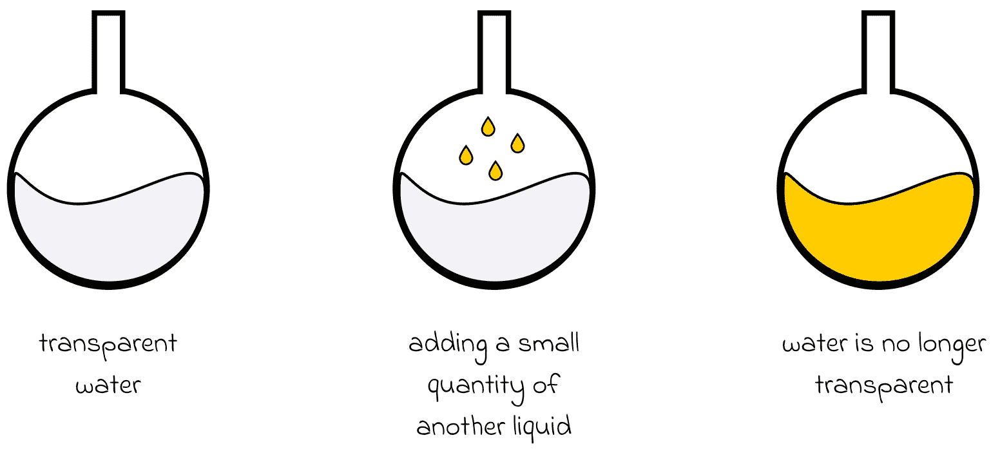
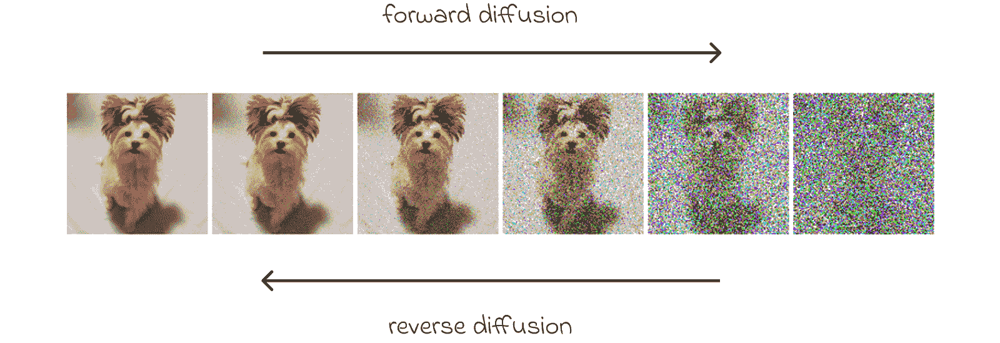
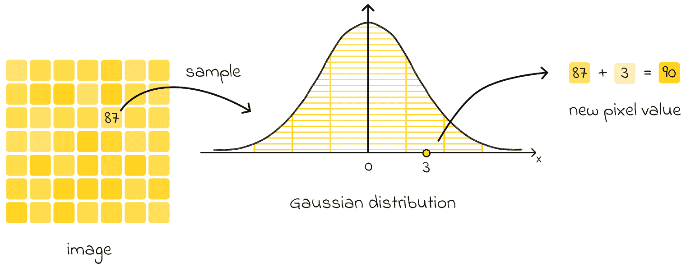
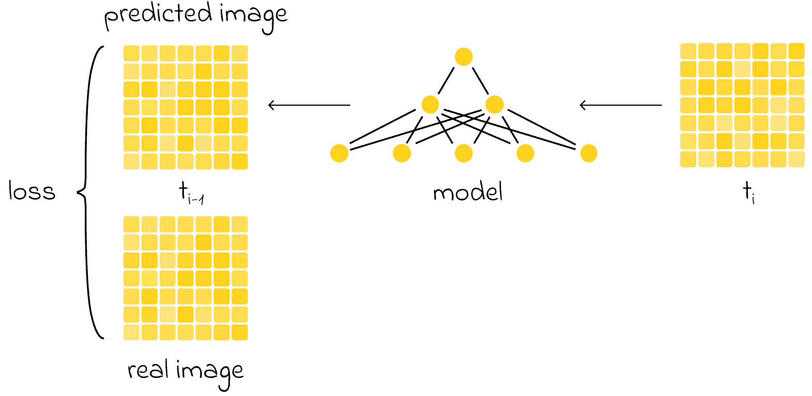
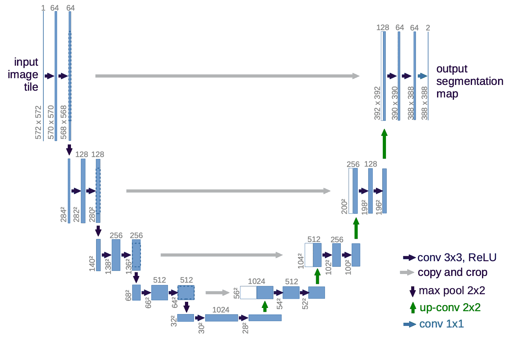
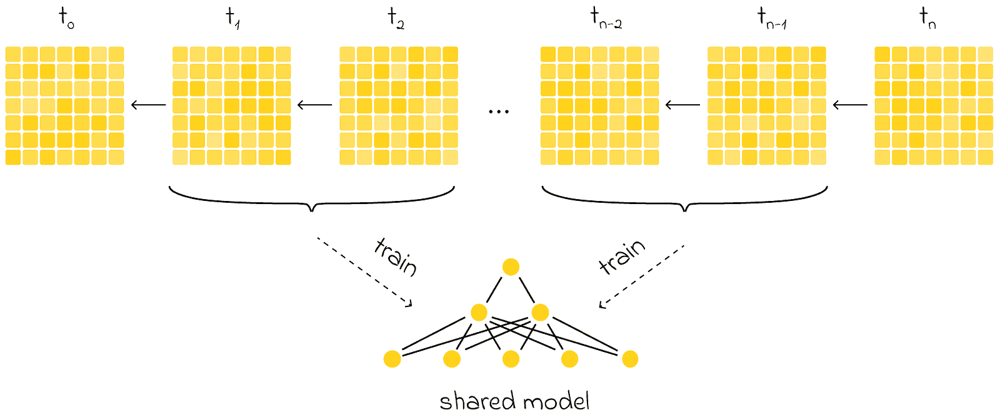

# 简单解释扩散模型

> 原文：[`towardsdatascience.com/diffusion-models-explained-simply/`](https://towardsdatascience.com/diffusion-models-explained-simply/)

## <mdspan datatext="el1746495094742" class="mdspan-comment">引言</mdspan>

**生成式 AI**是我们今天听到的最流行术语之一。最近，涉及文本、图像、音频和视频生成的生成式 AI 应用激增。

当涉及到图像创作时，扩散模型已成为内容生成领域最先进的技巧。尽管它们最初是在 2015 年提出的，但它们已经取得了显著的进步，现在成为 DALLE、Midjourney 和 CLIP 等知名模型的核心机制。

> *本文的目的是介绍扩散模型背后的核心思想。这种基础理解将有助于掌握复杂扩散变体中使用的更高级概念，以及在训练自定义扩散模型时解释超参数的作用。*

## 扩散

### 物理学类比

让我们想象一个透明的玻璃杯水。如果我们添加一小部分另一种液体，比如黄色的液体，会发生什么？黄色液体将逐渐均匀地扩散到整个玻璃杯中， resulting mixture will take on a slightly transparent yellow tint.

描述的过程被称为**正向扩散**：我们通过添加少量另一种液体来改变环境的状况。然而，执行**反向扩散**——将混合物恢复到原始状态——是否同样容易呢？事实证明并非如此。在最佳情况下，实现这一点需要高度复杂的机制。

### 将类比应用于机器学习

扩散也可以应用于图像。想象一下一张高质量的狗的照片。我们可以通过逐渐添加随机噪声轻松地转换这张图片。结果，像素值将发生变化，使得图像中的狗变得不那么明显，甚至无法辨认。这个转换过程被称为**正向扩散**。

来源：[扩散模型：方法和应用的综合调查](https://arxiv.org/pdf/2209.00796)

我们还可以考虑逆操作：给定一个噪声图像，目标是重建原始图像。这个任务要困难得多，因为与可能的噪声变化数量相比，**可识别的图像状态要少得多**。使用前面提到的相同的物理学类比，这个过程被称为**反向扩散**。

## 扩散模型的架构

*为了更好地理解扩散模型的结构，让我们分别检查两种扩散过程。*

### 正向扩散

如前所述，正向扩散涉及逐步向图像添加噪声。然而，在实践中，这个过程要复杂一些。

最常见的方法是，从均值为 0 的**高斯分布**中为每个像素采样一个随机值。这个采样值（可以是正数或负数）然后加到像素的原始值上。在整个像素上重复此操作，结果得到原始图像的噪声版本。

对于图像中的每个像素，都会从高斯分布中采样一个随机值并加到像素的值上。

> *所选的高斯分布通常具有相对较小的方差，这意味着采样值通常很小。因此，在每一步只对图像引入微小的变化。*

前向扩散是一个迭代过程，其中多次对图像应用噪声。随着每次迭代的进行，生成的图像与原始图像的差异越来越大。在真实扩散模型中，通常经过数百次迭代后，图像最终变得无法从纯噪声中识别出来。

### 反向扩散

现在你可能会问：*进行所有这些前向扩散变换的目的是什么？答案是，每个迭代的生成的图像被用来训练一个神经网络。

具体来说，假设我们在前向扩散中应用了 100 次连续的噪声变换。然后我们可以取每一步的图像，并训练神经网络从前一步重建图像。使用损失函数计算预测图像和实际图像之间的差异，例如，*均方误差（MSE）*，它衡量两个图像之间平均像素级的差异。

模型的目标是检测添加的噪声并重建之前的图像。然后，将预测图像与实际图像进行比较，以计算损失。

> *这个例子展示了扩散模型重建原始图像。同时，扩散模型可以被训练来预测添加到图像中的噪声。在这种情况下，为了重建原始图像，只需要从前一迭代的图像中减去预测的噪声即可。*
> 
> *虽然这两个任务可能看起来很相似，但预测添加的噪声与图像重建相比要简单一些。*

## 模型设计

在对扩散技术有一个基本的直觉之后，探索几个更高级的概念对于更好地理解扩散模型设计至关重要。

### 迭代次数

迭代次数是扩散模型中的关键参数之一：

> **一方面，使用更多的迭代意味着相邻步骤的图像对差异更小，使得模型的学习任务更容易。另一方面，更高的迭代次数会增加计算成本。**

尽管较少的迭代可以加快训练速度，但模型可能无法学习步骤之间的平滑过渡，从而导致性能不佳。

> *通常，迭代次数会选择在 50 到 1000 之间。*

### 神经网络架构

最常见的是，U-Net 架构被用作扩散模型的主干。以下是其中一些原因：

+   U-Net 保留了输入和输出图像的维度，确保在整个反向扩散过程中图像大小保持一致。

+   其瓶颈架构使得在压缩到潜在空间后能够重建整个图像。同时，通过跳过连接保留了关键图像特征。

+   U-Net 最初是为生物医学图像分割设计的，其中像素级精度至关重要，U-Net 的优势很好地转化为需要精确预测单个像素值的扩散任务。

U-Net 架构。来源：[U-Net：用于生物医学图像分割的卷积网络](https://arxiv.org/pdf/1505.04597)

### 共享网络

初看起来，可能似乎有必要在扩散过程中的每个迭代中训练一个单独的神经网络。虽然这种方法是可行的，并且可以导致高质量的推理结果，但从计算角度来看，它非常低效。例如，如果扩散过程由一千步组成，我们就需要训练一千个 U-Net 模型——这是一个耗时且资源密集的任务。

然而，我们可以观察到**不同迭代之间的任务配置基本上是相同的**：在每种情况下，我们需要重建一个具有相同维度且经过类似噪声程度修改的图像。这个重要的洞察力导致了使用单个、共享神经网络跨越所有迭代的思想。

在实践中，这意味着我们使用一个具有共享权重的单个 U-Net 模型，该模型在来自不同扩散步骤的图像对上进行训练。在推理过程中，带噪声的图像被多次通过相同的训练 U-Net，逐渐细化，直到生成高质量的图像。

单个共享模型用于所有迭代中的图像预测任务。

> *尽管由于仅使用单个模型，生成质量可能会略有下降，但训练速度的提升变得非常显著。*

## 结论

在这篇文章中，我们探讨了扩散模型的核心概念，这些模型在图像生成中扮演着关键角色。这些模型有很多变体——其中，**稳定扩散**模型变得尤为流行。虽然基于相同的基本原理，稳定扩散还允许整合文本或其他类型的输入来引导和约束生成的图像。

## 资源

+   [U-Net：用于生物医学图像分割的卷积网络](https://arxiv.org/pdf/1505.04597)

+   [扩散模型：方法和应用的综合调查](https://arxiv.org/pdf/2209.00796)

*除非另有说明，所有图像均为作者所有。*
