# 欧洲 M&Ms 真的比美国 M&Ms 好吃吗？

> 原文：[`towardsdatascience.com/do-european-mms-actually-taste-better-than-american-mms/`](https://towardsdatascience.com/do-european-mms-actually-taste-better-than-american-mms/)

*(哦，我是唯一一个问这个问题的人……？嗯。好吧，如果你有时间，请享受这个探索性数据分析——包括实验设计、统计学和交互式可视化——它被过于认真地应用于解决一场国际辩论。)*

## 1. 简介

### 1.1 背景

巧克力是全球范围内都受欢迎的。从在亚马逊盆地收获有机可可豆的古老实践，到瑞士山区的巧克力师雕刻可食用的艺术品，再到宾夕法尼亚州赫希的巨大工厂每天生产 7000 万颗接吻巧克力，巧克力的细腻形式和风味已经融入了许多文化和习俗。尽管巧克力的质量可能有很大的差异，但 M&Ms 作为一种知名、货架稳定、易于分享的巧克力形式，是非常受欢迎的零食，其包装被重新设计以适应几乎任何可商业化的美国假日。

2022 年居住在丹麦时，我听到了一个令人担忧的说法：在欧洲制造的 M&Ms 与在美国制造的 M&Ms 的味道不同，并且可以说是“更好”。虽然我承认高级欧洲巧克力确实非常美味，并且通常比美国巧克力更优越，但我并不清楚这个说法是否也适用于 M&Ms。我了解到许多欧洲人认为美国巧克力有一种“不愉快”或“酸味”，这主要归因于[丁酸](https://www.chemistryworld.com/podcasts/butyric-acid/1017662.article)，这是一种在将牛奶加入牛奶巧克力之前如何处理牛奶而产生的化合物。

但说实话，这对 M&Ms 来说能有多大区别呢？M&Ms!? 我想象 M&Ms 无论在哪个地方生产，都会保持相对加工/大规模生产/便宜糖果的风味。作为唯一一个访问这个由国际科学家组成的多样化实验室的美国访客，他们正在追求生物可持续性的尖端研究，我受到启发，拿出我的数据科学工具箱，来调查这个 M&M 风味现象。

### 1.2 前期工作

引用一位在欧洲旅行的匿名欧洲女性的话，当她品尝了在纽约的美国 M&M 后：

> “它们尝起来太恶心了。就像呕吐物一样。我不明白人们怎么能吃这种东西。我把剩下的袋子都扔掉了。”

呕吐？真的吗？根据我的经验，在美国长大的孩子对吃 M&Ms 毫无顾忌。在我成长的过程中，我习惯于在我家的高流量区域放置装满 M&Ms 的碗，以提供随时可用的糖。显然，美国 M&Ms 是可以食用的。但它们与欧洲的同类产品相比，是否有显著的不同或劣质？

作为对匿名欧洲女性尖锐报告的回应，我和另外两个访问丹麦的美国人在 Lyngby Storcenter Føtex 购买的当地 M&M 进行了品尝。我们希望体验那种在我们整个青年时期显然被隐藏的 M&M 口味的巨大改进。但奇怪的是，我们没有发现明显的口味改进。

不幸的是，这两项初步研究都无法进行带有适当控制和随机 M&M 抽样的面对面味觉测试。因此，我们转向科学。

### 1.3 研究目标

本研究旨在弥补之前研究的不足，并调查以下问题：

1.  是否有一个**全球共识**认为欧式 M&M 实际上比美式 M&M 更好？

1.  **欧洲人实际上能否在不知道自己吃的是哪个时，检测出美式和欧洲购买的 M&M 之间的差别**？或者这是欧洲人之间的一场**宏伟的、协调一致的谎言**，目的是让美国人感到尴尬？

1.  **美国人实际上对美式和欧式 M&M 是否真的味觉迟钝**？或者他们能尝出差别，但只是没有将这种差别描述为“口味上的改进”？

1.  这些所谓的味觉差异能否被其他大陆的公民**感知到**？如果是的话，他们是否发现其中一种口味明显优于其他？

## 2. 方法

### 2.1 实验设计和数据收集

参与者是通过吸引——或者说，*邀请*他们参加一个有免费食物承诺的社会聚会（该聚会方便地与测试地点同地举行）来招募的。一旦参与者同意暂停社交并加入研究，他们就会被安排在测试站，由一位受过培训的实验者引导他们完成以下步骤：

+   参与者坐在桌子旁，收到两个杯子：1 个空杯和 1 个装满水的杯子。参与者用一只手拿一个杯子，被要求闭上眼睛，并保持闭眼直到实验结束。

+   实验者随机用勺子取出一个 M&M，递给参与者空杯子，然后要求参与者吃掉这个 M&M（眼睛仍然闭着）。

+   吃掉每个 M&M 后，实验者通过询问参与者他们认为 M&M 的味道是：特别好吃、特别难吃还是正常来收集味觉反应。

+   每个参与者总共收到 10 个 M&M（5 个欧洲的，5 个美国的），一次一个，顺序由 random.org 随机确定。

+   在每次吃 M&M 之间，参与者被要求喝一口水以帮助“清洁他们的味蕾。”

+   **收集的数据**：对于每位参与者，实验者记录了参与者的**出生大陆（如果不确定，参与者被要求列出他们童年时吃糖果记忆最深刻的大陆）**。对于每个提供的 10 颗 M&M 巧克力，实验者记录了**M&M 的产地**（“丹麦”或“美国”）、**M&M 的颜色**以及参与者的**味觉反应**。实验者还被鼓励记录下测试期间参与者说的任何有趣的话语，记录在**备注**下（数据可在[此处](https://github.com/erinhwilson/mnm-taste-test/tree/main/data)找到）。

### 2.2 材料来源和招募参与者

为了这项研究，购买了两种 M&M 巧克力。美国产地的 M&M（“USA M&M”）是在旧金山国际机场购买的，由作者的家长在访问丹麦时带来。欧洲产地的 M&M（“Denmark M&M”）是在哥本哈根以北的林比的一家当地 Føtex 杂货店购买的。

实验在两个主要时间点进行。前 14 名参与者于 2022 年 8 月在丹麦林比接受测试。他们主要是作者在丹麦技术大学（DTU）的诺沃·诺迪斯克基金会生物可持续性中心遇到的朋友和室友，他们参加了一个“告别派对”，实验程序被插入其中。在丹麦访问的几位额外朋友和家人也在他们的旅行期间接受了测试（例如，在火车上）。

剩余的 37 名参与者于 2022 年 10 月在华盛顿州西雅图接受测试，主要是在华盛顿大学计算机科学博士项目的研究生举办的“TGIF 欢乐时光”期间。这批参与者主要由保罗·G·艾伦计算机科学与工程学院（UW CSE）的学生和员工组成，他们响应每周五的召唤前往艾伦中心大堂享用免费的小吃和饮料。

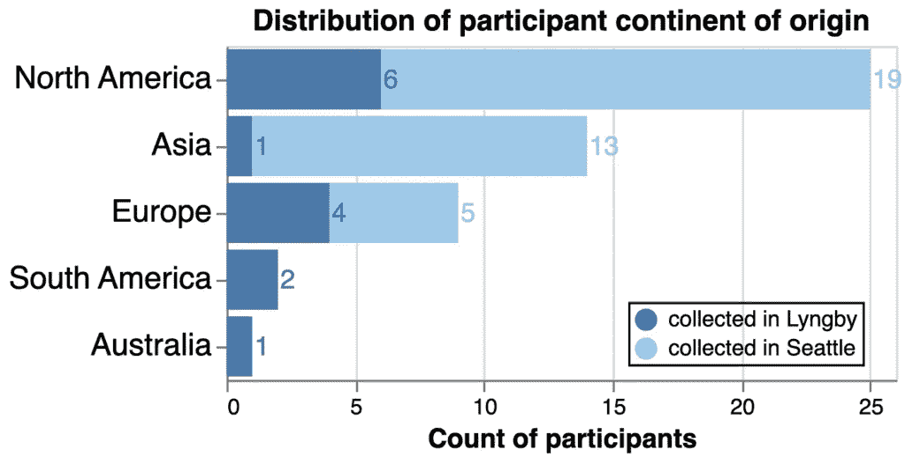

图 1. 研究中招募的参与者的分布。在林比的第一次抽样活动中，参与者主要来自北美和欧洲，还有少数来自亚洲、南美洲或澳大利亚。我们在西雅图的第二次抽样活动中大幅增加了参与者数量，主要来自北美和亚洲，还有少数来自欧洲。两次活动都没有招募到来自非洲的参与者。图由 Altair 制作。

尽管这项研究旨在分析全球趋势，但遗憾的是，数据仅收集自作者能够吸引到研究地点的 51 名参与者，数据并不均衡，也不能代表地球上的 6 个居住大陆（图 1）。我们希望在未来的工作中改进我们的招募策略。目前，我们使用这个数据集的分析能力仅限于来自北美、欧洲和亚洲个人的响应趋势，这些趋势高度受到作者在 2022 年底偶然参与的子社区的影响。

## 2.3 风险

尽管我们没有获得正式批准进行以人类测试对象为实验对象的实验，但这项实验仍存在一些风险：参与者被告知，他们可能会因为参与这项研究而面临糖分增加和可能的“不愉快的味道”。没有预料到其他风险。

然而，实验之后，我们不幸地观察到一些情况，当参与者得知他们的味道响应偏向他们未预期的 M&M 类型时，他们的自豪感受到了打击。这种自豪感的下降在欧洲参与者中似乎最为严重，他们得知自己的或未婚夫的偏好偏向美国 M&M，尽管这并没有进行定量测量，也不能仅凭轶事证据来确认。

## 3. 结果与讨论

### 3.1 对“美国 M&M”与“丹麦 M&M”的整体响应

#### **3.1.1 分类响应分析 — 整个数据集**

在我们的第一次分析中，我们计算了“差”、“正常”和“好”味道响应的总数，并报告了每种 M&M 类型收到的每种响应的百分比。丹麦 M&M 比美国 M&M 更频繁地收到“好”的响应，但也更频繁地收到“差”的响应。美国 M&M 最频繁地被报告为味道“正常”（图 2）。这可能是因为来自北美洲的参与者数量增加，那里的美国 M&M 是默认的，因此更“正常”，而丹麦 M&M 则更常被感知为比基准更好或更差。

^（图 2. 整个数据集中定性味道响应的分布。计算了每种 M&M 类型的“差”、“正常”或“好”味道响应的百分比。图由 Altair 制作。）

现在让我们来看看一些统计数据，比如一个*卡方*（χ²）检验来比较我们观察到的分类味道响应的分布。使用 scipy.stats 的[chi2_contingency](https://docs.scipy.org/doc/scipy/reference/generated/scipy.stats.chi2_contingency.html)函数，我们构建了观察到的“好”、“正常”和“差”响应的每个 M&M 类型的列联表。使用 X²检验来评估两个 M&M 之间没有差异的零假设，我们发现检验统计量的 p 值为 0.0185，这在常见的 p 值截止值 0.05 上是显著的，但在 0.01 上则不是。所以这是一个“可能”，这取决于你是否希望这个结果具有显著性。

#### **3.1.2 定量响应分析 — 整个数据集。**

X²检验有助于评估分类响应是否存在差异，但接下来，我们想要确定两种 M&M 类型之间的相对味道*排名*。为此，我们将味道响应转换为定量分布，并计算了一个**味道分数**。简而言之，“差”= 1，“正常”= 2，“好”= 3。对于每个参与者，我们平均了他们品尝的每种类型的 5 个 M&M 的味道分数，并为每种 M&M 类型保留了独立的味道分数。

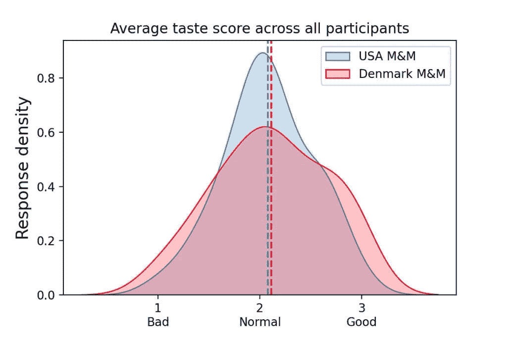

图 3. 整个数据集中的定量味觉评分分布。为每个参与者计算每种 M&M 类型的平均味觉评分的核密度估计。图由 Seaborn 制作。

在手头有了每种 M&M 类型的平均味觉评分后，我们转向 scipy.stats [ttest_ind](https://docs.scipy.org/doc/scipy/reference/generated/scipy.stats.ttest_ind.html) （“T 检验”）来评估美国和丹麦 M&M 味觉评分的平均值是否有差异（零假设是平均值相同）。如果平均值有显著差异，这将提供证据表明一种 M&M 比另一种被认为味道显著更好。

我们发现美国 M&M 和丹麦 M&M 的平均味觉评分相当接近（图 3），并且没有显著差异（T 检验：*p* = 0.721）。因此，在所有参与者中，我们没有观察到两种 M&M 类型的感知味道之间存在差异（或者如果你喜欢解析三重否定：“我们*不能***拒绝**零假设，即没有差异”）。

但如果我们按出生地划分参与者，这种变化会发生吗？

### 3.2 按大陆划分对“美国 M&M”与“丹麦 M&M”的反应

我们在按参与者出生地分组后重复了上述 X2 和 T 检验分析。将澳大利亚和南美洲组合并作为一个最小尝试来保护数据隐私。由于即使是合并后的澳大利亚/南美洲组的样本量相对较小（n=3），我们将避免分析该组趋势，但为了完整性和让可能最终阅读此文档的参与者享受，我们将包括几个图中的数据。

#### **3.2.1 按大陆进行的分类反应分析**

在图 4 中，我们展示了每个大陆组味觉反应的计数（上部分，*注意交互式图例*）和反应百分比（下部分）。北美和亚洲的趋势与整个数据集相似：参与者报告丹麦 M&M 比美国 M&M 更频繁地被认为是“好”，但也更频繁地报告丹麦 M&M 是“坏”。美国 M&M 最频繁地被报告为“正常”（图 4）。

相反，欧洲参与者有近 50%的时间报告美国 M&M 是“坏”，只有 18%的时间报告是“好”，这是最负面的和最积极反应模式，分别（排除采样不足的澳大利亚/南美洲组）。

^（图 4. 按大陆划分的定性味觉反应分布。上部分：味觉反应计数 — 点击图例可交互过滤！下部分：每种 M&M 类型的味觉反应百分比。图由 Altair 制作。）

这在条形图中看起来很引人注目，然而，只有北美在评估两个 M&M 巧克力豆类型之间口感反应特征差异时，具有显著的 X2 *p* 值（***p* = 0.0058**）。欧洲的 *p* 值在某些圈子中可能“接近显著性”，但我们即将积累更多的假设检验，应该注意多重假设检验（见表 1）。这里的假阳性结果将是灾难性的。

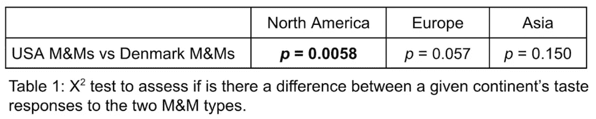

当比较两个大洲对同一款 M&M 巧克力豆的口感反应特征时，有几个有趣的观察点。首先，当我们评估丹麦 M&M 巧克力豆时，观察到所有大洲对它们的口感差异并不大——世界似乎在评价来自欧洲的 M&M 巧克力豆时普遍保持一致（见表 2 中右列的 X2 *p* 值）。为了更方便地可视化这种比较，我们将图 4 中的条形重新组织，按 M&M 巧克力豆的类型分组（见图 5）。

^（图 5.按 M&M 巧克力豆类型报告的定性口感反应分布，以百分比表示。（与图 4 相同的数据，但重新排列）。图由 Altair 制作。）

然而，当比较大洲对美国的 M&M 巧克力豆的反应时，我们发现差异更大。我们发现有一对组合具有显著差异：欧洲和北美参与者在评价美国 M&M 巧克力豆时差异很大（***p* = 0.000007**）（见表 2）。这种观察到的差异不太可能是随机事件（见表 2 左列）。

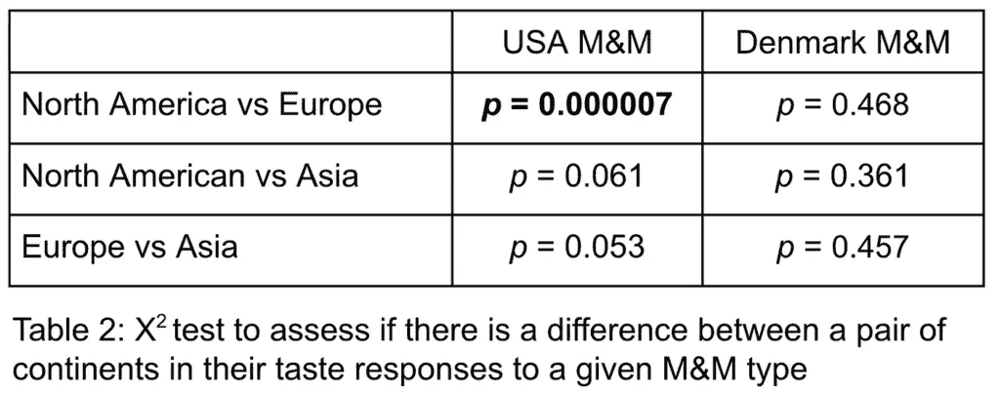

#### **3.2.2 按大洲进行的定量反应分析**

我们再次将分类特征转换为定量分布，以评估大洲对 M&M 巧克力豆类型的相对偏好。对于北美地区，我们看到两种 M&M 巧克力豆的口感评分平均值实际上非常相似，但美国 M&M 巧克力豆在“正常”评分周围的密度更高（见图 6A）。欧洲的分布在其平均值上保持更多的分离（尽管并不十分显著），美国 M&M 巧克力豆的评分较低（见图 6B）。亚洲参与者的口感评分分布最为相似（见图 6C）。

将比较重新定位，以比较大洲之间对同一款 M&M 巧克力豆的口感评分的定量平均值，仅北美和欧洲参与者在评价美国 M&M 巧克力豆时，基于 T 检验的结果具有显著差异（***p* = 0.001**）（见图 6D），尽管现在我们真的面临多重假设检验的风险！如果你对这个分析非常认真，请谨慎行事。

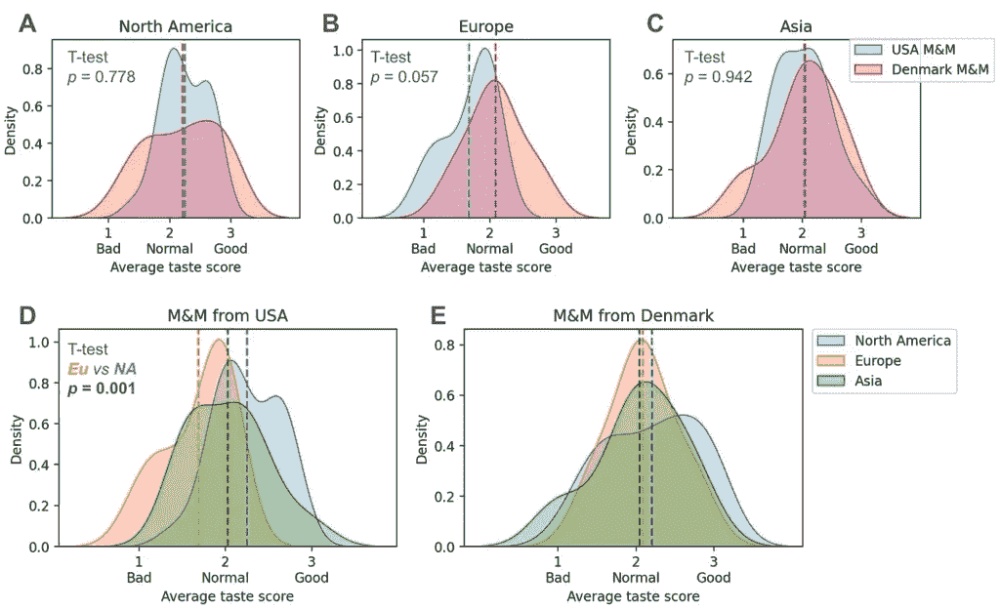

图 6.按洲际的定量口味评分分布。每个洲际每种 M&M 类型的平均口味评分的核密度估计。 **A.** 北美对每种 M&M 的反应比较。 **B.** 欧洲对每种 M&M 的反应比较。 **C.** 亚洲对每种 M&M 的反应比较。 **D.** 美国 M&M 的洲际比较。 **E.** 丹麦 M&M 的洲际比较。图由 Seaborn 制作。

在这一点上，我感觉自己在考虑，也许欧洲人并不是在胡编乱造。我并不是说它像他们中的一些人声称的那样戏剧化，但也许确实存在某种差异……在一定程度上，北美参与者也感知到了差异，但欧洲来源的 M&M 的评价并不始终是积极的或消极的。

### 3.3 M&M 口味对齐图

在我们迄今为止的分析中，我们没有考虑到参与者之间 M&M 欣赏的基线差异。例如，假设第 1 个人将所有丹麦 M&M 评分均为“好”，而所有美国 M&M 评分均为“正常”，而第 2 个人将所有丹麦 M&M 评分均为“正常”，而所有美国 M&M 评分均为“坏”。他们会有相同的相对偏好，即丹麦 M&M 相对于美国 M&M，但第 2 个人可能只是不像第 1 个人那样喜欢 M&M，而相对偏好的信号被平均原始分数所模糊。

受桌面角色扮演游戏如《龙与地下城》©™中使用的合法/混乱与善良/邪恶对齐图启发，在图 7 中，我们建立了一个 M&M 对齐图，以帮助确定参与者在不同 M&M 喜好类别中的分布。

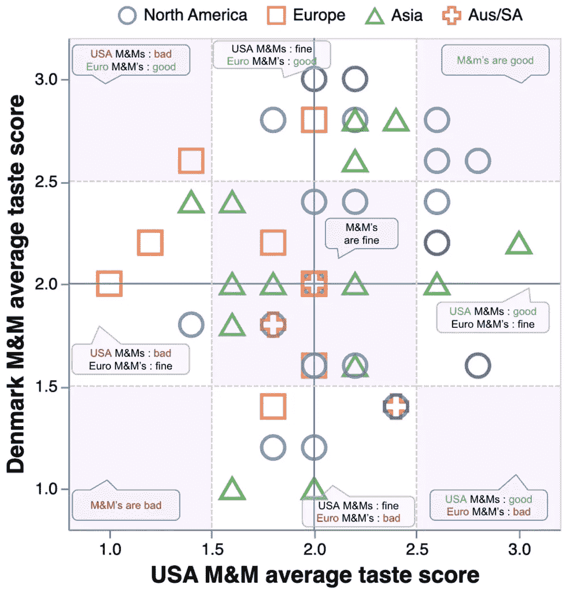

图 7. M&M 喜好对齐图。横轴代表参与者对美国 M&M 的平均口味评分；纵轴是参与者对丹麦 M&M 的平均口味评分。图由 Altair 制作。

显然，右上象限，两种 M&M 类型都被认为是“好”到“正常”，主要由北美参与者和少数亚洲参与者占据。所有欧洲参与者都落在图形的左半部分，其中美国 M&M 是“正常”到“坏”，但欧洲人在上半部和下半部分之间有所分歧，其中丹麦 M&M 的感知从“好”到“坏”。

下面提供了一个图 7 的交互式版本，供读者探索各种 M&M 对齐区域的数量。

^（图 7（交互式）：点击并在散点图上刷鼠标，查看不同 M&M 喜好区域的洲际数量。图由 Altair 制作。）

### 3.4 参与者口味反应比率

接下来，为了排除基线 M&M 喜好并关注参与者对两种 M&M 类型的相对偏好，我们取了每个人 **美国 M&M 口味评分平均值** 除以他们的 **丹麦 M&M 口味评分平均值** 的对数比率。

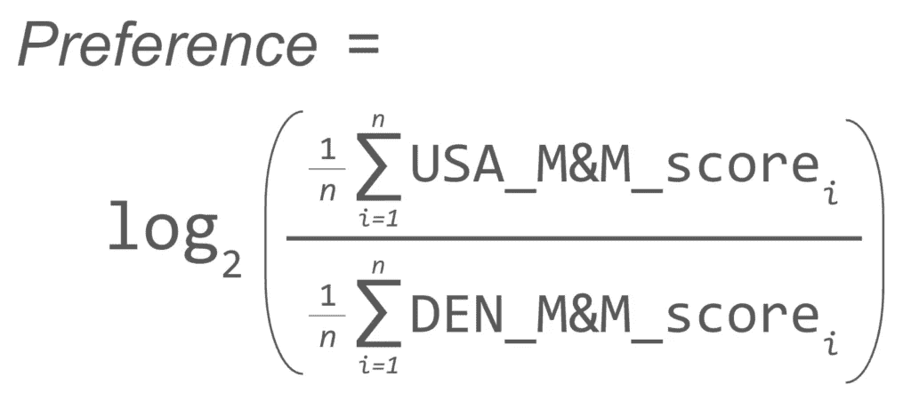

方程式 1：计算每个参与者整体 M&M 偏好比率的方程。

因此，正分表示倾向于美国 M&M，而负分表示倾向于丹麦 M&M。

平均而言，欧洲参与者在丹麦 M&M 上的偏好最强，亚洲人也表现出对丹麦 M&M 的轻微偏好（图 8）。对于那两位在得知他们轻微偏好美国 M&M 后表现出泄气的骄傲的欧洲人，不用担心：你们并没有认为美国 M&M 是“好”的，只是将它们排名为比丹麦 M&M 差（参见图 7 的交互式版本中的参与者 id 4 和 17）。如果你断言 M&M 是一种不值得复制的糟糕的美国发明，并转而消费手工欧洲巧克力，你的荣誉可能有望恢复。

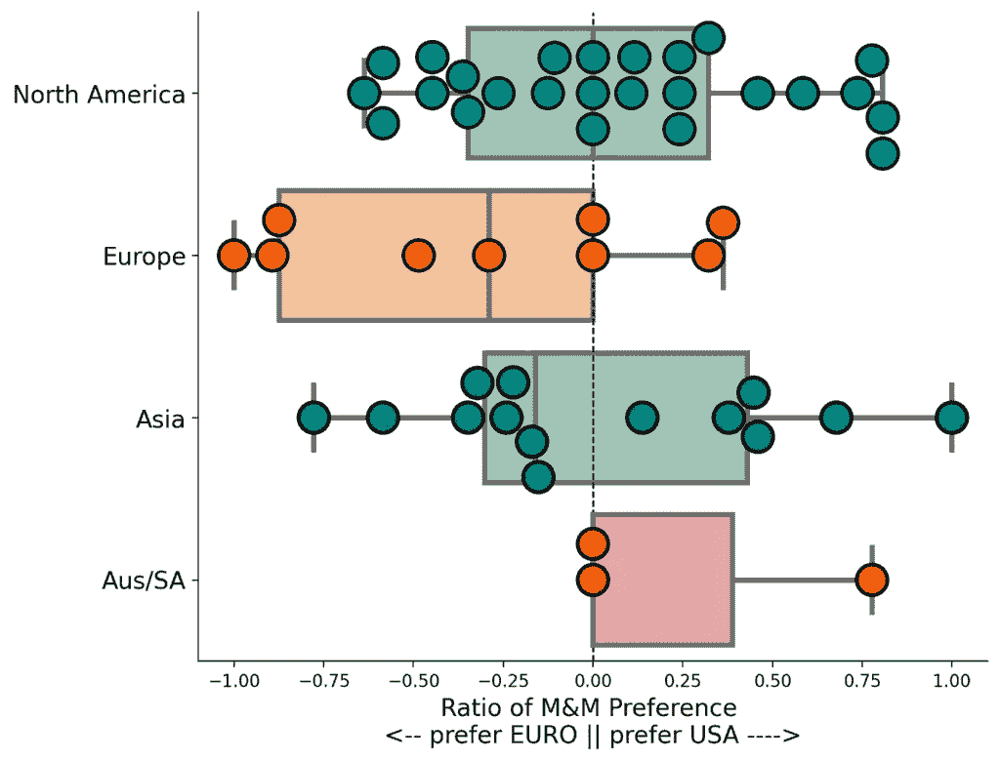

图 8。按大陆划分的参与者 M&M 偏好比率的分布。偏好比率按方程 1 计算。正数表示相对偏好美国 M&M，而负数表示相对偏好丹麦 M&M。使用 Seaborn 制作的图。

北美参与者在偏好比率上相当分裂：一些人相当中性地围绕 0，其他人强烈偏好熟悉的美国 M&M，而少数人适度偏好丹麦 M&M。据传闻，那些了解到他们的偏好偏向欧洲 M&M 的北美人表现出膨胀的骄傲，好像他们的结果标志着奢华的精致。

总体而言，比较 M&M 偏好比率的 T 检验显示，欧洲和北美参与者在平均值之间可能存在显著差异（***p=0.049**），但看在老天的份上，这已经是我报告的第 20 个 p 值了——这个可能太接近无法判断。

### 3.5 味道的不一致性和“完美分类器”

对于每个参与者，我们通过平均他们对每种 M&M 类型的反应的标准差来评估他们的味道分数一致性，并将这个值与他们的偏好比率（图 9）进行对比。

^(图 9。参与者的偏好比率和味道一致性。x 轴是参与者的相对 M&M 偏好比率。y 轴是他们美国 M&M 分数和丹麦 M&M 分数的标准差的平均值。y 轴上的 0 值表示反应的完美一致性，而更高的值表示更不一致的反应。使用 Altair 制作的图。)

大多数参与者在评分上有些不一致，对同一 M&M 类型的 5 个样本给出了不同的排名。如果欧洲来源和美国来源的 M&M 之间的味道差异实际上并不那么明显，这是可以预料的。最不一致的是那些对同一 M&M 类型给出“好”、“正常”和“坏”反应（例如，y 轴上的点较高，味道分数的标准差较宽）的参与者，这表明他们的味道感知能力较低。

令人好奇的是，有四位参与者——每个大陆组各有一位——非常一致：他们对每种 M&M 类型的 5 种 M&M 都报告了相同的味觉反应，结果平均标准差为 0.0（图 9 底部）。排除其中一位将所有 10 种 M&M 都评为“正常”的人，其他三位似乎像是“完美分类者”——要么将一种类型的所有 M&M 评为“好”，另一种评为“正常”，要么将一种类型的所有 M&M 评为“正常”，另一种评为“差”。或许这些人就是“超级味觉者”。

### 3.6 M&M 颜色

另一个可能解释个体味觉反应不一致的原因是，基于 M&M 颜色的可感知味觉差异。从视觉上看，美国 M&M 比丹麦 M&M 明显更光滑和鲜艳，而丹麦 M&M 则有些“斑驳”的外观（图 10A）。在实验中记录了 M&M 颜色，尽管平衡采样并未正式纳入实验设计，但颜色似乎大致均匀采样，除了蓝色的美国 M&M，它们被过度采样（图 10B）。

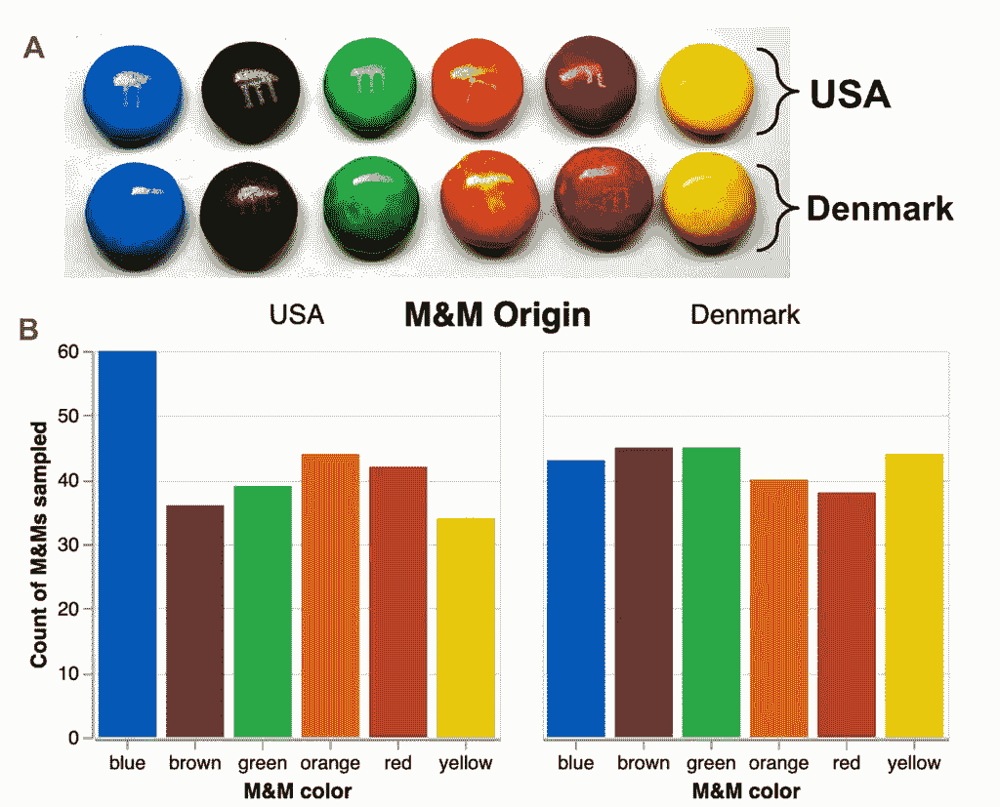

图 10. M&M 颜色。 **A. **每种类型的 M&M 颜色的照片。在我的非专业照明照片中，可能在屏幕上难以察觉，但用肉眼来看，美国 M&M 似乎更亮、颜色更均匀，而丹麦 M&M 则颜色较暗、斑驳。这只是我个人的感觉吗？你能否已经听到欧洲人在说“它们之所以更亮，是因为你们在食物中添加了所有那些我们这里禁止的额外化学物质！” **B. **实验过程中采样的每种颜色 M&M 的分布。蓝色的美国 M&M 并非有意过度采样——它们可能对实验者特别明亮/诱人。图由 Altair 制作。

我们简要地可视化了基于颜色的味觉反应差异（图 11），然而我们并不认为有足够的数据来支持明确的结论。毕竟，平均每个参与者可能只会尝试 6 种 M&M 颜色中的 5 种，有一种颜色根本没尝试。我们将进一步对 M&M 颜色进行研究的工作留待未来进行。

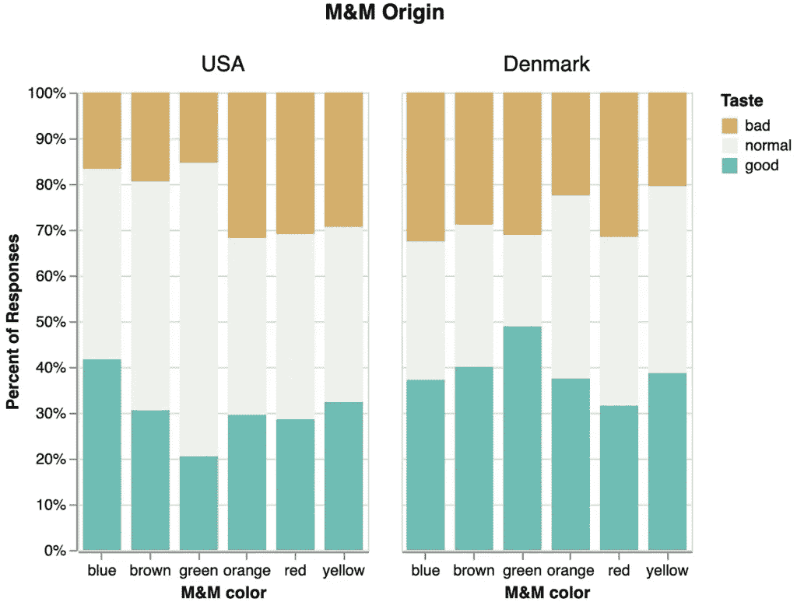

图 11. 每种颜色和类型的 M&M 的味觉反应曲线。曲线以“差”、“正常”和“好”反应的百分比表示，尽管并非所有 M&M 都是均匀采样的。图由 Altair 制作。

### 3.7 多彩评论

我们向每位参与者保证，在这个实验中没有“正确”的“答案”，所有感受都是有效的。虽然一些参与者对此深信不疑，偶尔会花上超过一分钟的时间深深品尝每种 M&M，并像品酒师一样评价它们，但许多参与者似乎将实验视为一场比赛（这偶尔会导致自尊心受挫或膨胀）。实验者记录了与 M&M 反应相关的引言和笔记，其中一些有点“色彩丰富”。我们为了娱乐目的迅速制作了每种 M&M 类型的词云（图 12），但我们警告不要在没有进行勤奋的情感分析的情况下过分解读它们。

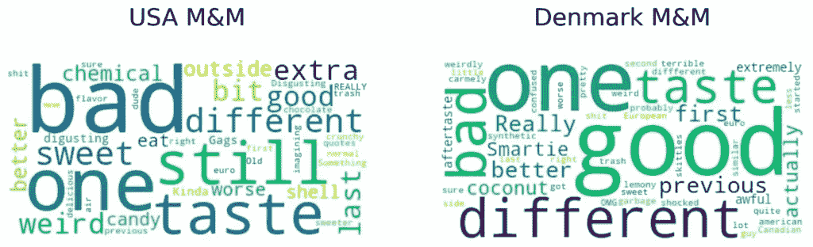

图 11。从每种 M&M 类型的笔记列生成的简单词云。提前警告——这些词云尚未进行适当的情感分析，并记录了一些不适当的语言。图是用 WordCloud 制作的。

## 4. 结论

总体来看，似乎并没有一个“全球共识”认为欧洲 M&Ms 比美国 M&Ms 更好。然而，欧洲参与者倾向于更强烈地表达对美国 M&Ms 的负面反应，而北美参与者似乎在是否更喜欢来自美国的 M&Ms 还是来自欧洲的 M&Ms 上相对分裂。亚洲参与者的偏好趋势通常介于北美人和欧洲人之间。

因此，我承认欧洲人可能并没有在 M&Ms 上撒一个大型的协调谎言。大多数欧洲参与者倾向于丹麦 M&Ms，这一点很有说服力，尤其是考虑到我是那个亲自收集了大量口味反应数据的实验者。如果他们找到了作弊的方法，那么他们的作弊手法足够高明，以至于超出了我的被动感知范围，我没有注意到。然而，根据这项研究，似乎强烈的负面“呕吐味”并不是普遍感知的，并且当同时品尝两种 M&Ms 时，这种味道并没有对非欧洲人明显。

我们希望这项研究能有所启发！我们期待这项工作的扩展，包括改进的参与者抽样、来自其他大陆的额外 M&M 类型，以及更深入的调查，以了解由于颜色引起的可能的口味差异。

感谢所有参与并为了科学而品尝 M&Ms 的人！

图表和分析可以在 github 上找到：[`github.com/erinhwilson/mnm-taste-test`](https://github.com/erinhwilson/mnm-taste-test)

*本文由 Erin H. Wilson 博士[1,2,3]撰写，她决定在答辩她的论文和开始她的下一份工作之间，最好把时间花在这项非常有价值的分析上。希望这篇文章是幽默的——我实际上并没有对不喜欢美国 M&Ms 的欧洲人持有任何负面情绪，但我享受有机会表现得俏皮，并用过度热情的数据分析来取笑我们热烈的辩论。*

*向 Matt、Galen、Ameya 和 Gian-Marco 表示感谢，他们在数据收集方面提供了帮助！*

*[1] 美国华盛顿大学保罗·G·艾伦计算机科学与工程学院的博士生*

*[2] 丹麦技术大学 Novo Nordisk Foundation 生物可持续性中心的访问博士生*

*[3] LanzaTech 的未来数据科学家*
