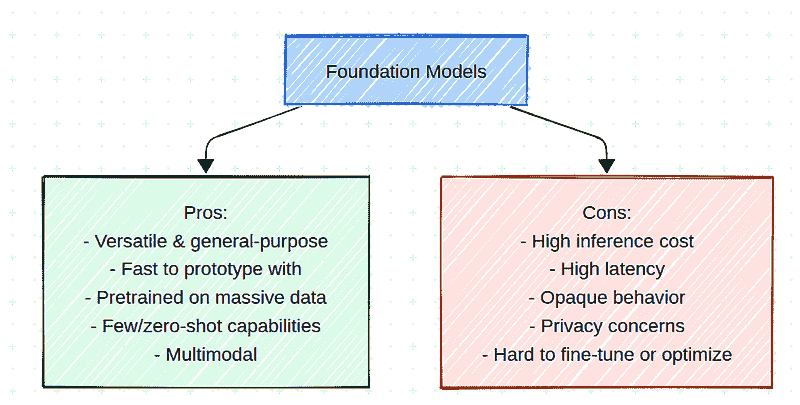
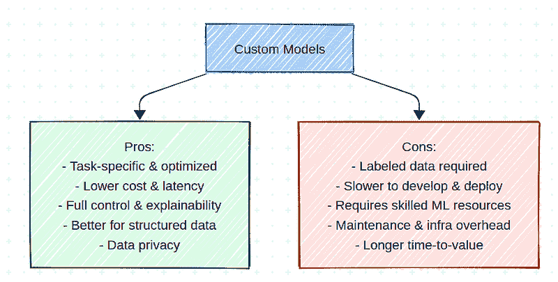
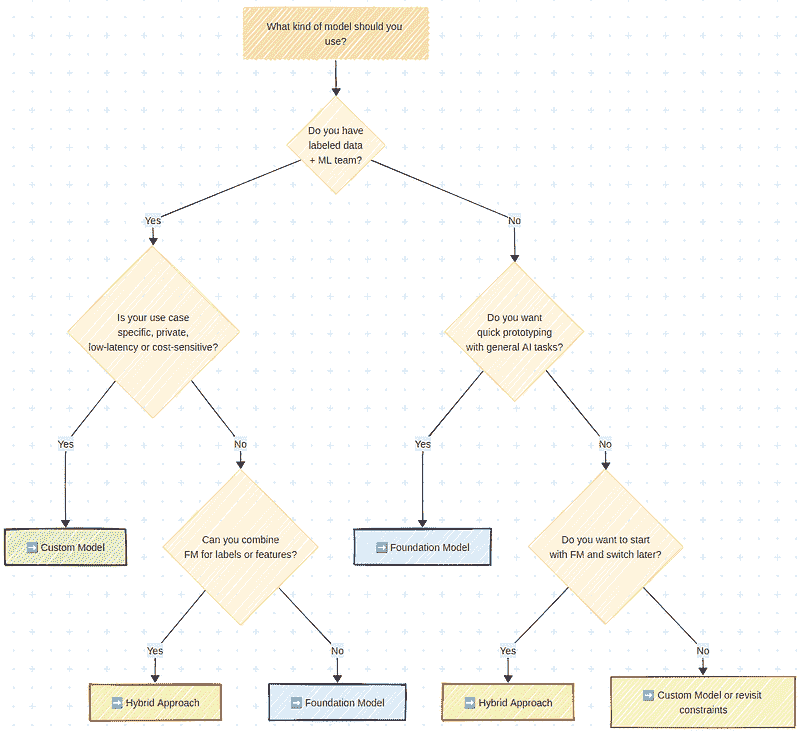

# 你真的需要基础模型吗？

> 原文：[`towardsdatascience.com/do-you-really-need-a-foundation-model/`](https://towardsdatascience.com/do-you-really-need-a-foundation-model/)

<mdspan datatext="el1752602330074" class="mdspan-comment">基础模型</mdspan>无处不在——但它们是否总是最佳选择？在今天的 AI 世界中，似乎每个人都想使用基础模型和代理。

从 GPT 到 CLIP 到 SAM，公司都在竞相围绕大型通用模型构建应用程序。而且有很好的理由：这些模型强大、灵活，并且通常很容易进行原型设计。但你真的需要吗？

在许多情况下——尤其是在生产场景中——一个更简单、定制训练的模型可以表现得同样好，甚至更好。具有更低的成本、更低的延迟和更多的控制。

本文旨在通过涵盖以下内容来帮助您做出这一决策：

+   基础模型是什么，以及它们的优缺点。

+   定制模型是什么，以及它们的优缺点。

+   如何根据您的需求选择正确的方法，并辅以现实世界的例子。

+   一个视觉决策框架来总结所有内容。

让我们深入探讨。

### 基础模型

基础模型是一种在多个领域上使用大量数据集进行预训练的大型模型。这些模型设计得足够灵活，可以解决广泛的下游任务，而无需或仅需少量额外的训练。它们可以被视为通用模型。

它们有多种类型：

+   **大型语言模型**（LLMs），如 GPT-4、Claude、Gemini、LLaMA、Mistral……自从 ChatGPT 发布以来，我们听到了很多关于它们的消息。

+   **视觉-语言模型**（VLMs），例如 CLIP、Flamingo、Gemini Vision……它们现在越来越被使用，甚至在 ChatGPT 这样的解决方案中也是如此。

+   **视觉特定模型**，例如 SAM、DINO、Stable Diffusion、FLUX。它们更加专业化，主要被从业者使用，但非常强大。

+   **视频特定模型**，例如 RunwayML、SORA、Veo……这个领域在过去几年中取得了惊人的进步，现在正取得令人印象深刻的成果。

大多数都可以通过 API 或开源库访问，许多支持零样本或少样本学习。

这些模型通常是在数据量和计算能力上大多数公司都无法达到的规模上训练的。这使得它们在很多方面都非常有吸引力：

+   **通用且多才多艺：**一个模型可以处理许多不同的任务。

+   **快速原型设计：**无需自己的数据集或训练流程。

+   **在广泛且多样化的数据上预训练：**它们编码了世界知识和通用推理。

+   **零样本/少样本能力：**它们开箱即用就能合理地工作。

+   **多模态和灵活：**它们有时可以处理文本、图像、代码、音频等，这对于小型团队来说可能难以复制。

虽然它们很强大，但也有一些缺点和限制：

+   **高运营成本：**推理成本高昂，尤其是在大规模上。

+   **不透明的行为：**结果可能难以调试或解释。

+   **延迟限制**：这些模型通常非常大，延迟很高，可能不适合实时应用。

+   **隐私和合规问题**：数据通常需要发送到第三方 API。

+   **缺乏控制**：难以针对特定用例进行微调或优化，有时甚至没有选择。

基础模型的优缺点。图片由作者提供。

回顾一下，基础模型非常强大：它们在大量数据集上训练，可以处理文本、图像、视频等。它们不需要在您的数据上训练即可工作。但它们通常成本效益不高，可能延迟高，可能需要将您的数据发送给第三方。

选择的另一种方法是使用自定义模型。现在让我们看看这意味着什么。

### 自定义模型

自定义模型是专门为定义的任务使用您自己的数据构建和训练的模型。这可能只是一个逻辑回归，也可能是一个针对您独特问题的深度学习架构。

它们通常需要更多前期工作，但提供更大的控制、更低的成本和针对特定任务的更好性能。许多强大且具有商业驱动力的模型实际上是自定义模型，一些著名且广泛使用，一些解决真正利基问题：

+   Netflix 的推荐引擎，被数十亿人使用，是一个自定义模型

+   大多数客户流失预测模型，在许多基于订阅的公司中广泛使用，都是自定义模型（有时只是经过良好调整的逻辑回归）。

+   信用评分模型

当使用自定义模型时，您掌握每个步骤，这使得它们在几个方面都非常强大：

+   **针对特定任务优化**：您控制模型、训练数据和评估。

+   **更低的延迟和成本**：自定义模型通常更小且成本更低。在边缘或实时环境中至关重要。

+   **完全控制和可解释性**：它们更容易调试、重新训练和监控。

+   **更适合表格或结构化数据**：基础模型在非结构化数据方面表现出色。自定义模型在表格数据上通常表现更好。

+   **提高数据隐私性**：无需将数据发送到外部 API。

另一方面，您必须自己训练和部署自定义模型才能从中获得商业价值。这带来了一些缺点：

+   **可能需要标记数据**：这可能很昂贵或耗时。

+   **发展较慢**：自定义模型需要训练模型、实施管道、部署和维护。这很耗时。

+   **需要专业技能**：内部机器学习专业知识是必需的。

*在本文中，您可以自由地深入了解部署策略以及如何选择最佳方法：*

> [如何选择最佳的机器学习部署策略：云与边缘](https://towardsdatascience.com/how-to-choose-the-best-ml-deployment-strategy-cloud-vs-edge-7b62d9db9b20/)

自定义模型的优缺点。图片由作者提供。

一句话，定制模型提供了更多的控制，并且通常在扩展上成本更低。但这也意味着更昂贵、更长的开发阶段——更不用说所需的技能。那么，如何明智地选择是否使用定制模型或基础模型呢？让我们尝试回答这个问题。

### 基础模型或定制模型：如何选择？

#### 何时选择定制模型

我会说我必须选择定制模型。但为了更公平，让我们看看在哪些具体情况下，它明显比基础模型是一个更好的解决方案。这归结为几个要求：

+   **团队与资源**：你有一个机器学习工程师或数据团队，你可以标记或生成训练数据，并且你有能力花费时间训练和优化你的模型

+   **商业**：要么你有一个非常具体的案例需要解决，要么你有隐私需求，需要低基础设施成本，或者你需要低延迟甚至边缘部署

+   **长期目标**：你想要控制权，并且不希望依赖于第三方 API

如果你发现自己处于这些情况之一或多个，定制模型可能是你的最佳选择。在我的职业生涯中，我遇到过一些典型的情况，例如：

+   为 YouTube 视频收入构建内部、定制的预测模型：你无法在隐私上妥协，而且没有基础模型能够在这样的特定用例上做得足够好

+   在智能手机上部署实时视频解决方案：当你需要每秒超过 30 帧的工作时，还没有 VLM 能够处理这项任务

+   银行的信用评分：你无法在隐私上妥协，也不能使用第三方解决方案

*如果你想要深入了解，这里有一篇关于如何预测 YouTube 视频收入的文章：*

[**如何使用预测算法将 Jellysmack 的 YouTube 视频货币化**](https://medium.datadriveninvestor.com/how-jellysmack-monetized-youtube-videos-with-predictive-algorithms-0b241e9688c2)

*创作者经济中的一个革命性想法*](https://medium.datadriveninvestor.com/how-jellysmack-monetized-youtube-videos-with-predictive-algorithms-0b241e9688c2)

说到这里，虽然在一些情况下基础模型不是解决方案，但让我们看看它们实际上何时是一个可行的选择。

#### 何时选择基础模型

让我们对基础模型进行等效的练习：首先检查使它们成为好选择的要求，然后看看一些它们会繁荣发展的典型商业案例：

+   **团队与资源**：你不一定有标记的数据，也没有机器学习工程师或数据科学家，但你确实有 AI 或软件工程师

+   **商业**：你想要快速测试一个想法或发布 MVP，你对外部 API 的使用没有问题，延迟或扩展成本不是主要问题

+   **任务特征**：你的任务是开放式的，或者你正在探索一个新颖或创造性的问题空间

这里有一些典型的例子，其中基础模型已经证明是有价值的

+   为内部支持或知识管理原型设计聊天机器人：你面临的是一个开放式的任务，对延迟和扩展的要求较低

+   许多早期 MVPs 没有长期基础设施的担忧都是合适的选择

到目前为止，基础模型在许多围绕文本和图像的 MVP 中非常流行，而定制模型已在许多商业案例中证明了其价值。但为什么不结合两者呢？在某些情况下，混合方法可以带来最佳解决方案。让我们看看这意味着什么。

#### 何时使用混合解决方案

在许多现实世界的流程中，最佳答案是两种方法的**组合**。例如，以下是一些可以充分利用双方优势的常见混合模式。

+   **基础模型作为标注工具**：使用 SAM 或 GPT 创建标注数据，然后训练一个更小的模型。

+   **知识蒸馏**：训练一个定制模型来模仿基础模型的输出。

+   **自举**：从基础模型开始测试，然后切换到定制模型。

+   **特征提取**：使用 CLIP 或 GPT 嵌入作为输入到更简单的下游模型。

在我的职业生涯中，我曾在一些项目中使用过这些方法，它们有时允许获得最先进的解决方案，利用基础模型的一般化力量和定制模型的灵活性和可扩展性。

+   在计算机视觉项目中，我使用了 Stable Diffusion 来创建多样化和逼真的数据集，以及 SAM 来快速高效地标注数据。

+   小型语言模型正在获得关注，有时可以利用知识蒸馏从 LLMs 中获得最佳效果，同时保持更小、更专业和更可扩展。

+   一个人也可以使用 ChatGPT 等工具在训练定制模型之前轻松地大规模标注数据。

*这里是一个使用基础模型在计算机视觉混合解决方案中的具体示例：*

> [如何在没有训练数据的情况下训练实例分割模型](https://towardsdatascience.com/how-to-train-an-instance-segmentation-model-with-no-training-data-190dc020bf73/)

总而言之，在处理非结构化数据的情况下，混合方法可以非常强大，并且可以兼得双方之所长。

### 结论：决策框架

现在让我们用一个决策图总结一下何时选择基础模型，何时选择定制模型，以及何时探索混合方法。

决策图以选择正确的途径：定制模型、基础模型或混合模型。图片由作者提供。

简而言之，一切都取决于项目和需求。当然，基础模型目前很热门，它们是当前代理革命的核心。然而，许多非常有价值的企业问题可以通过定制模型来解决，而基础模型在许多非结构化数据问题中已被证明非常强大。为了明智地选择，与利益相关者和工程师一起进行适当的需求和需求分析，并辅以决策框架，仍然是一个好方法。

你呢：你是否遇到过最佳解决方案并非你所想的情况？

### 参考文献

+   提到的 LLM：由 OpenAI 开发的[GPT](https://openai.com/fr-FR/index/gpt-4-research/)，由 Anthropic 开发的[Claude](https://www.anthropic.com/claude)，由 Meta 开发的[Llama](https://www.llama.com/)，由 Google 开发的[Gemini](http://gemini.google.com/)，以及我们还可以提及更多，例如[Mistral](https://mistral.ai/)，[DeepSeek](https://www.deepseek.com/)等…

+   与视觉相关的模型：由 Meta 开发的[SAM](https://ai.meta.com/sam2/)，由 OpenAI 开发的[CLIP](https://openai.com/index/clip/)，由 Meta 开发的[DINO](https://dinov2.metademolab.com/)，由 StabilityAI 开发的 StableDiffusion，以及由 Black Forest Labs 开发的[FLUX](https://bfl.ai/models/flux-kontext)

+   视频特定模型：由 Google 开发的[Veo](https://deepmind.google/models/veo/)，[RunwayML](https://runwayml.com/)，由 OpenAI 开发的[SORA](https://openai.com/sora/)…
