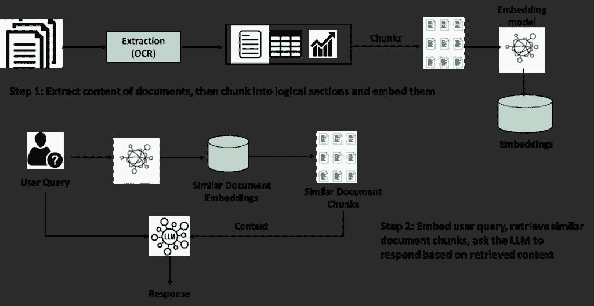
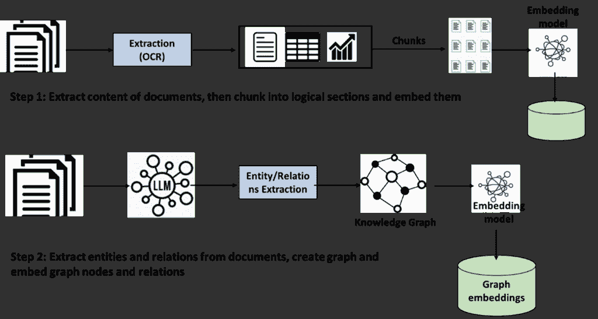
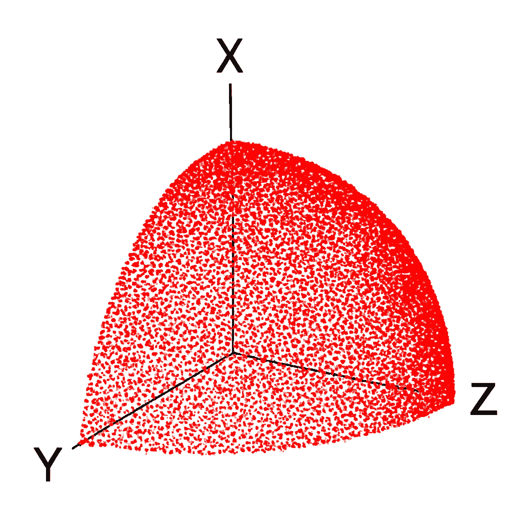
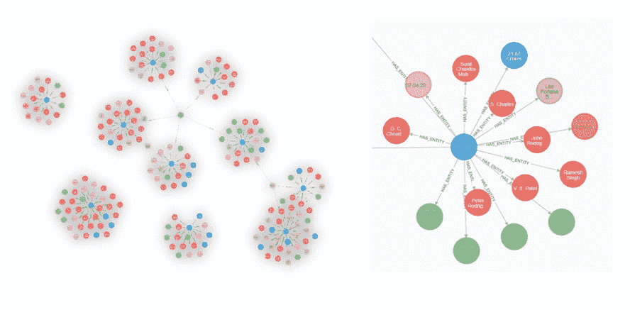
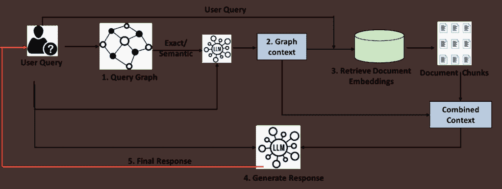

# 你真的需要 GraphRAG 吗？超越炒作的实践指南

> 原文：[`towardsdatascience.com/do-you-really-need-graphrag-a-practitioners-guide-beyond-the-hype/`](https://towardsdatascience.com/do-you-really-need-graphrag-a-practitioners-guide-beyond-the-hype/)

<mdspan datatext="el1762807196428" class="mdspan-comment">GraphRAG 自从 2024 年初由微软引入以来，一直是一个备受关注的话题。虽然网上大部分内容都集中在技术实现上，但从实践者的角度来看，探讨 GraphRAG 相对于朴素 RAG 的增量价值何时足以证明额外的架构复杂性和投资是很有价值的。因此，在这里，我将尝试回答以下对于可扩展和健壮的 GraphRAG 设计至关重要的几个问题：

1.  何时需要 GraphRAG？哪些因素会帮助你做出决定？

1.  如果你决定实现 GraphRAG，你应该牢记哪些设计原则来平衡复杂性和价值？

1.  一旦你实现了 GraphRAG，你能否以相同的准确性回答关于你的文档存储的任何问题？或者，你是否应该意识到某些限制并实施方法来克服它们，只要可能的话？

## GraphRAG 与朴素 RAG 的管道比较

*在这篇文章中，所有图表都是我绘制的，图像使用 Copilot 生成，文档（对于图）使用 ChatGPT 生成。*

一个典型的朴素 RAG 管道看起来如下所示：

朴素 RAG 的嵌入和检索

相比之下，GraphRAG 嵌入管道如下。检索和响应生成步骤将在稍后章节讨论。

GraphRAG 的嵌入管道

虽然 GraphRAG 管道的构建方式和响应生成中的上下文检索可能会有所不同，但与朴素 RAG 的关键差异可以总结如下：

+   在数据准备期间，文档被解析以提取实体和关系，然后存储在图中

+   可选的，但最好是，使用嵌入模型和存储来嵌入节点值和关系，以进行语义匹配

+   最后，文档被分块、嵌入，并存储索引以进行相似性检索。这一步骤与朴素 RAG 是通用的。

## 何时需要 GraphRAG？

考虑一个执法部门的搜索助手案例，其语料库是多年来提交的大量文档中的调查报告。每份报告在文档第一页顶部都提到了报告 ID。文档的其余部分描述了涉及的人员及其角色（被告、受害者、证人、执法人员等）、适用的法律条款、事件描述、证人陈述、查获的资产等。

虽然我将在这里关注设计原则，但在技术实现上，我使用了*Neo4j*作为图数据库，*GPT-4o*进行实体和关系提取、推理和响应，以及*text-embedding-3-small*进行嵌入。

在决定是否需要 GraphRAG 时，应考虑以下因素：

### 长文档

一个简单的 RAG 会因为分块过程而丢失数据点之间的上下文或关系。因此，如果汽车编号没有位于与报告 ID 相同的块中，那么查询“*哪个报告 ID 涉及了汽车编号 PYT1234？*”不太可能给出正确答案，在这种情况下，报告 ID 将位于第一个块中。因此，如果你**有包含大量实体（人物、地点、机构、资产标识符等）的文档，并且希望查询它们之间的关系**，请考虑使用 GraphRAG。

### 跨文档上下文

简单的 RAG 无法连接多文档中的信息。如果你的查询需要跨文档连接实体或在整个语料库上进行聚合，你需要 GraphRAG。例如，查询如下：

*“有多少起盗窃报告来自孟买？”*

*“有个人在多个案件中受到指控吗？相关的报告 ID 是什么？”*

*“告诉我与 ABC 银行相关的案例的详细信息”*

这类基于分析的查询在相关文档语料库中是预期的，并能够识别无关事件之间的模式。另一个例子可以是医院管理系统，给定一组症状，应用应该响应与之前患者案例和采用的疗法相似的情况。

考虑到大多数实际应用都需要这种能力，是否存在 GraphRAG 过度且简单的 RAG 就足够好的应用场景？可能存在，例如对于公司人力资源政策等数据集，每个文档都处理一个独特的话题（休假、工资、健康保险等），内容结构使得实体及其关系以及跨文档链接通常不是查询的重点。

### 搜索空间优化

虽然 GraphRAG 的上述功能通常是众所周知的，但不太明显的是，它是一个**出色的过滤器**，可以通过它将查询的搜索空间缩小到最相关的文档。这对于包含数千或数百万文档的大型语料库来说非常重要。随着块数量的增加，向量余弦相似度搜索将简单地失去粒度，从而降低查询上下文中选择的块的质量。

这并不难可视化，从几何学的角度来看，代表一个块的标准化的单位向量只是一个 N 维球面上的点（N 是嵌入模型生成的维度数），随着越来越多的点被压缩到该区域，它们会相互重叠并变得密集，以至于在计算给定查询的余弦匹配时，很难区分任何一个点与其邻居。

标准化单位向量的密集嵌入分布

### 可解释性

这是密集嵌入搜索空间的推论。为什么某些块与查询匹配而不是其他块，这一点并不容易解释，因为使用余弦相似度进行语义匹配的准确性达到阈值后，在匹配之前查询提示的丰富技术将停止提高检索到的块的质量。

## GraphRAG 设计原则

为了平衡复杂性、努力和成本，在设计图时应该考虑以下原则：

### 应该提取哪些节点和关系？

将整个文档发送给 LLM 并要求它提取所有实体及其关系是很诱人的。确实，如果你在 Neo4j 中调用‘*LLMGraphTransformer’*而没有自定义提示，它将尝试这样做。然而，对于大型文档（10 页以上），这个查询将花费很长时间，并且由于任务的复杂性，结果也可能不是最优的。当你有数千个文档要处理时，这种方法将不起作用。相反，关注那些在查询中将被频繁引用的最重要实体和关系，并创建一个星形图，将这些实体连接到中心节点（对于犯罪数据库，可能是患者 ID，对于医院应用程序等）。

例如，对于犯罪报告数据，人与报告 ID 的关系很重要（嫌疑人、证人等），而两个人是否属于同一个家庭可能不那么重要。然而，对于家谱搜索，家族关系是构建应用程序的核心原因。

从数学上讲，也容易看出为什么星形图是一个更好的方法。一个包含 K 个实体的文档可能具有潜在的 ***^K******C[2]**** 关系*，假设两个实体之间只存在一种关系。对于一个包含 20 个实体的文档，这意味着 190 个关系。另一方面，将 19 个节点连接到 1 个关键节点的星形图将意味着 19 个关系，复杂度降低了 90%。

采用这种方法，我只提取了人员、地点、车牌号码、金额和机构名称（但不包括法律部门 ID 或被没收的资产），并将它们与报告 ID 连接起来。10 个案例报告的图看起来如下，并且只需要几分钟就能生成。

犯罪报告数据的星系群

### 逐步采用复杂性

在项目的第一个阶段（或 MVP）中，关注最有价值和最频繁的查询。并为这些实体和关系构建图。这应该能满足 ~70-80% 的搜索需求。对于剩余的，你可以在后续迭代中增强图，找到额外的节点和关系，并与现有图集群合并。需要注意的是，随着新数据的不断生成（新案例、新病人等），这些文档必须一次性解析所有实体和关系。例如，在一个 20 个实体的图集群中，最小的星形集群有 19 个关系和 1 个关键节点。假设在下一个迭代中，你添加了被没收的资产，并创建了 5 个额外的节点和 15 个额外的关系。然而，如果这份文档作为新文档出现，你将需要在一次提取作业中创建 25 个实体和它们之间 34 个关系。

### 使用图进行分类和上下文，而不是直接用于用户响应

根据是否以及如何使用图节点和元素的语义匹配，检索和增强管道可能会有一些变化。经过一些实验，我开发了以下方法：

GraphRAG 的检索和增强管道

步骤如下：

+   用户查询用于从图中检索相关的节点和关系。这分为两个步骤。首先，LLM 从给定的用户查询中构建一个 Neo4j cypher 查询。如果查询成功，我们将得到用户查询中给出的标准的精确匹配。例如：在我创建的图中，一个像“*从孟买有多少份报告？*”的查询将得到精确匹配，因为在我的数据中，孟买与多个报告集群相连。

+   如果 cypher 没有返回任何记录，查询将回退到与图节点值和关系进行语义匹配，以找到最相似的匹配。这在查询类似于“*从孟买有多少份报告？*”的情况下很有用，这将导致得到与孟买相关的报告 ID，这是正确的结果。然而，语义匹配需要仔细控制，可能会导致假阳性，我将在下一节中进一步解释。

+   注意，在上述两种方法中，我们都试图提取与查询节点相连的 Report ID 的完整集群，以便在片段检索步骤中尽可能提供准确的上下文。逻辑如下：

+   如果用户查询是关于具有其 ID 的报告（例如：告诉我关于报告 SYN-REP-1234 的详细信息*），我们获取与该 ID 相连的实体（人、人员、机构等）。因此，虽然这个查询本身很少得到正确的片段（因为 LLM 不会将任何意义附加到像报告 ID 这样的字母数字字符串），但有了附加的人、人员以及报告 ID 的上下文，我们就可以得到这些片段的确切文档。

+   如果用户查询是“*告诉我关于汽车编号 PYT1234 参与的事故？*”，我们首先从图中获取该汽车编号所附着的报告 ID，然后针对该报告 ID，我们获取该簇中的所有实体，再次为片段检索提供完整的上下文。

+   从步骤 1 或 2 得到的图结果随后作为上下文与用户查询一起提供给 LLM，以用自然语言而不是由 Cypher 查询生成的 JSON 或语义匹配的节点->关系->节点格式来制定答案。在用户查询仅询问聚合指标或连接实体（如与汽车相连的报告 ID）的情况下，LLM 输出通常足以作为此阶段的用户查询响应。然而，我们将此保留为一个名为图上下文的中间结果。

+   接下来，使用图上下文和用户查询来查询片段嵌入，并提取最接近的片段。

+   我们将图上下文与检索到的片段结合起来，形成一个完整的组合上下文，并将其提供给 LLM 以综合生成对用户查询的最终响应。

注意，在上面的方法中，我们使用图作为**分类器**，以缩小用户查询的搜索空间，并快速找到相关的文档簇，然后将其作为片段检索的上下文。这使我们可以从大量语料库中高效且准确地检索，同时提供图数据库固有的跨实体和跨文档链接能力。

## 挑战和局限性

与任何架构一样，当付诸实践时，都会有一些限制变得明显。其中一些已经在上面讨论过，比如设计平衡复杂性和成本的图。还有一些其他需要注意的，如下所述：

+   如前文所述，图节点和关系的语义检索有时会导致不可预测的结果。考虑这样一个案例，当你查询一个尚未提取到图簇中的实体时。首先，精确的 Cypher 匹配失败，这是预期的，然而，回退的语义匹配仍然会检索出它认为相似的匹配项，尽管它们与你的查询无关。这会产生一个不正确的图上下文，从而检索出错误的文档片段和事实错误的响应。这种行为比 RAG 回复“我不知道”更糟糕，需要在生成图上下文时通过详细的负面提示来严格控制 LLM，使得 LLM 在这种情况下输出“无记录”。

+   在使用 LLM 构建图的同时，从整个文档的单次遍历中提取所有实体和关系，通常会因为**注意力下降**而错过其中的一些，即使经过详细的提示调整也是如此。这是因为当文档超过一定长度时，LLM 会失去召回能力。为了减轻这一点，最好采用基于片段的实体提取策略，如下所述：

    +   首先，提取一次报告 ID。

    +   然后将文档分割成块

    +   分块提取实体，因为我们正在创建星型图，所以将提取的实体附加到报告 ID 上。

这也是为什么星型图是构建图的一个好起点。

+   **去重和标准化**：在将名称插入到图中之前进行去重非常重要，这样可以在多个报告集群之间正确创建常见的实体链接。例如；警官约翰逊和检查员约翰逊在插入到图中之前应该被标准化为约翰逊。

+   如果你想运行像“*在 10 万到 100 万之间的欺诈报告有多少？*”这样的查询，那么*数量的标准化*就更加重要了。对于这个查询，LLM 会正确地创建一个如(amount > 100000 and amount < 1000000)的 Cypher 查询。然而，从文档中提取到图集群中的实体通常是像‘5 百万’这样的字符串，如果它在文档中是这样呈现的。因此，在插入之前，这些必须被标准化为数值。

+   节点应该有一个文档名称属性，以便在结果中提供基础信息。

+   图数据库，例如 Neo4j，提供了一种优雅、低代码的方式来构建、嵌入和从图中检索信息。但是，在某些情况下，行为可能异常且难以解释。例如，在执行某些类型的查询时，预期结果中会有多个报告集群，LLM 会形成一个完美的 Cypher 查询。当在 Neo4j 浏览器中运行时，这个 Cypher 查询可以正确地检索多个记录集群，然而，在管道中运行时，它只会检索一个。

## 结论

最终，一个精确且详细地表示文档中每个实体及其所有关系的图，能够以相同的准确性回答用户的所有查询，这很可能是一个过于昂贵以至于难以构建和维护的目标。在 GraphRAG 项目中，在复杂性、时间和成本之间找到正确的平衡将是关键成功因素。

还应该记住，虽然 RAG 用于从非结构化文本中提取见解，但实体的完整配置文件通常也分布在结构化（关系）数据库中。例如，一个人的地址、电话号码和其他细节可能存在于企业数据库或 ERP 中。获取一个事件的完整详细配置文件可能需要使用 LLM 通过 MCP 代理查询这些数据库，并将这些信息与 RAG 结合。但这将是另一篇文章的主题。

## 接下来是什么

尽管我在这篇文章中关注了 GraphRAG 的架构和设计方面，但我打算在下一篇文章中解决技术实现。它将包括提示、关键代码片段以及管道工作、结果和局限性的说明。

考虑将 GraphRAG 管道扩展以包含多模态信息（图像、表格、图表），以实现完整的用户体验是值得的。请参阅我关于构建真正的 [多模态 RAG](https://towardsdatascience.com/building-a-multimodal-rag-with-text-images-tables-from-sources-in-response/) 的文章，该文章不仅返回文本，还返回图像。

*在 [www.linkedin.com/in/partha-sarkar-lets-talk-AI](http://www.linkedin.com/in/partha-sarkar-lets-talk-AI) 上与我联系并分享您的评论*
