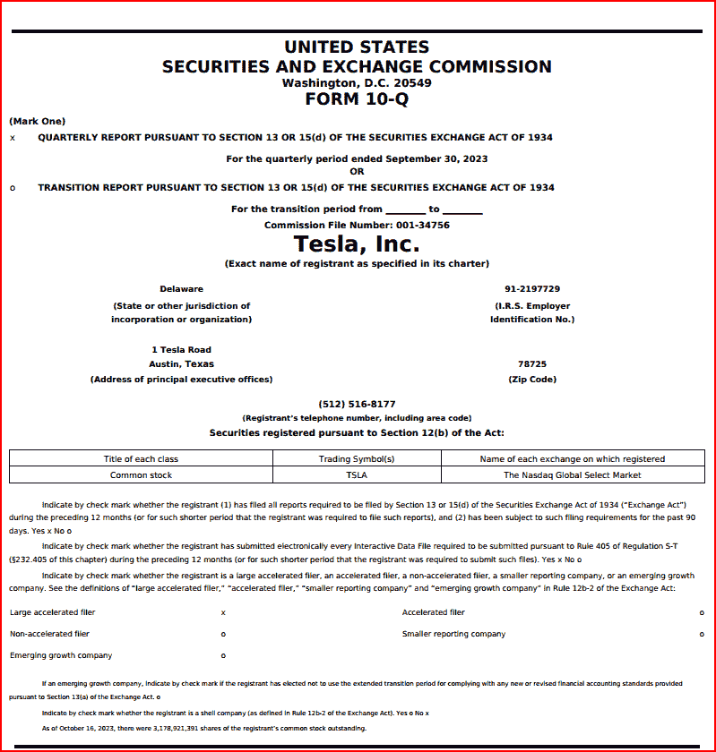
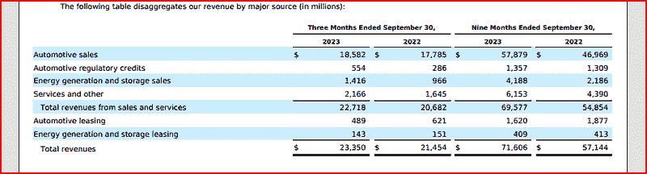
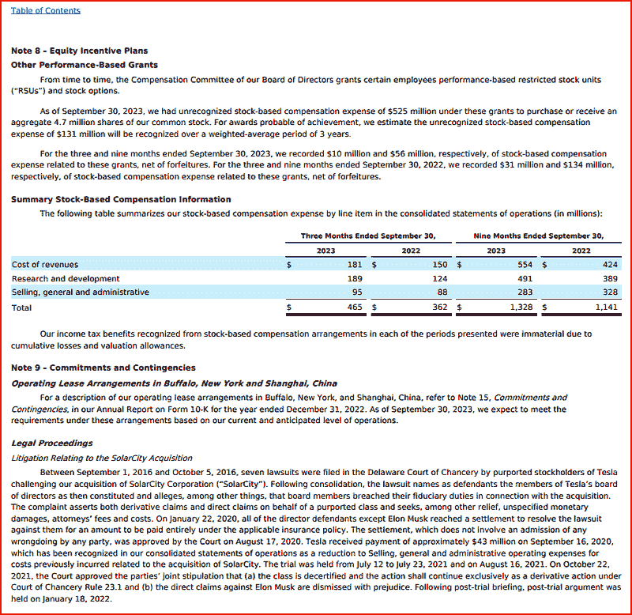

# Docling：文档炼金术士

> 原文：[`towardsdatascience.com/docling-the-document-alchemist/`](https://towardsdatascience.com/docling-the-document-alchemist/)

## 为什么我们还在 2025 年与文档搏斗？

<mdspan datatext="el1757616610680" class="mdspan-comment">花些时间</mdspan>在任何一个数据驱动型组织中，你都会遇到大量的 PDF 文件、Word 文档、PowerPoint 演示文稿、半扫描的图片、手写笔记，以及偶尔隐藏在 SharePoint 文件夹中的 CSV 文件。商业和数据分析师们浪费了数小时将这些格式转换、拆分和诱导成 Python 管道可以接受的形式。即使是最新的生成式 AI 堆栈，当底层文本被包裹在图形中或散布在不规则的表格网格中时，也会窒息。

Docling 就是为了解决这种痛苦而诞生的。作为 IBM 苏黎世研究实验室的一个开源项目发布，现在由 Linux Foundation AI & Data Foundation 托管，这个库将解析、布局理解、OCR、表格重建、多模态导出甚至音频转录抽象化，通过一个相对直接的 API 和 CLI 命令。

虽然 docling 支持处理 HTML、MS Office 格式文件、图像格式和其他格式，但我们主要会关注如何用它来处理 PDF 文件。

## 作为数据科学家或机器学习工程师，我为什么要关心 Docling？

通常，真正的瓶颈不在于构建模型——而在于给它喂食。我们花费大量时间在数据处理上，没有什么比拿到一个锁在 100 页 PDF 中的关键数据集更快地摧毁生产力。这正是 Docling 解决的问题，它作为从非结构化文档世界直接通往结构化理智的 Markdown、JSON 或 Pandas DataFrame 的桥梁。

但它的力量不仅限于数据提取，还直接扩展到现代、AI 辅助开发的领域。想象一下将 docling 指向 API 规范的一个 HTML 页面；它能够轻松地将这个复杂的网页布局转换成干净的、结构化的 Markdown——这是直接输入 AI 编码助手如 Cursor、ChatGPT 或 Claude 的完美上下文。

## Docling 的起源

该项目起源于 IBM 的深度搜索团队，该团队正在开发用于长专利 PDF 的检索增强生成（RAG）管道。他们在 2024 年底以 MIT 许可证开源核心代码，并自那时起每周发布更新。一个充满活力的社区迅速围绕其统一的**DoclingDocument**模型形成，这是一个 Pydantic 对象，它将文本、图像、表格、公式和布局元数据保持在一起，这样下游工具如 LangChain、LlamaIndex 或 Haystack 就不必猜测页面的阅读顺序。

今天，Docling 集成了视觉语言模型（VLMs），例如 **SmolDocling**，用于图注。它还支持 Tesseract、EasyOCR 和 RapidOCR 进行文本提取，并提供了用于分块、序列化和向量存储摄取的食谱。换句话说：你指向一个文件夹，你就能得到 Markdown、HTML、CSV、PNG、JSON 或一个可直接嵌入的 Python 对象——无需额外的脚手架代码。

## 我们将做什么

为了展示 Docling，我们首先安装它，然后使用三个不同的示例来展示其作为文档解析器和处理器的多功能性和实用性。请注意，使用 Docling 非常计算密集，所以如果你能访问系统上的 GPU，那将非常有帮助。

然而，在我们开始编码之前，我们需要设置一个开发环境。

### 设置开发环境

我现在开始使用 UV 包管理器，但请随意使用你最熟悉的工具。注意，我将在 Windows 的 WSL2 Ubuntu 下工作，并使用 Jupyter Notebook 运行我的代码。

注意，即使使用 UV，下面的代码在我的系统上完成也花了几分钟的时间，因为它是一套相当庞大的库安装。

```py
$ uv init docling
Initialized project `docling` at `/home/tom/docling`
$ cd docling
$ uv venv
Using CPython 3.11.10 interpreter at: /home/tom/miniconda3/bin/python
Creating virtual environment at: .venv
Activate with: source .venv/bin/activate
$ source .venv/bin/activate
(docling) $ uv pip install docling pandas jupyter
```

现在输入以下命令，

```py
(docling) $ jupyter notebook
```

你应该在浏览器中打开一个笔记本。如果自动打开失败，你可能会在运行 **Jupyter Notebook** 命令后看到一屏的信息。在底部附近，你会找到一个可以复制并粘贴到浏览器中以启动 Jupyter Notebook 的 URL。

你的 URL 将与我的不同，但它应该看起来像这样：-

```py
http://127.0.0.1:8888/tree?token=3b9f7bd07b6966b41b68e2350721b2d0b6f388d248cc69d
```

#### 示例 1：将任何 PDF 或 DOCX 转换为 Markdown 或 JSON

最简单的用例也是你将大量使用的一个用例：将文档的文本转换为 Markdown

对于我们的大部分示例，我们的输入 PDF 将是我之前用于不同测试的文档副本。它是特斯拉 2023 年 9 月的 10-Q SEC 文件，大约有五十页，主要包含与特斯拉相关的财务信息。完整文档可在证券交易委员会（SEC）网站上公开获取，并可通过此 [链接](https://www.sec.gov/Archives/edgar/data/1318605/000162828023034847/tsla-20230930.htm) 查看/下载。

这里是那份文档第一页的图片供你参考。



来自特斯拉 10-Q PDF 的图片

让我们回顾一下需要转换为 Markdown 的 docling 代码。它设置了输入 PDF 的文件路径，对其运行 DocumentConverter 函数，然后将解析结果导出为 Markdown 格式，以便内容可以更容易地阅读、编辑或分析。

```py
from docling.document_converter import DocumentConverter
import time
from pathlib import Path

inpath = "/mnt/d//tesla"
infile = "tesla_q10_sept_23.pdf"

data_folder = Path(inpath)

doc_path = data_folder / infile

converter = DocumentConverter()
result    = converter.convert(doc_path)     # → DoclingResult

# Markdown export still works
markdown_text = result.document.export_to_markdown()
```

这是运行上述代码（仅第一页）所得到的输出。

```py
## UNITED STATES SECURITIES AND EXCHANGE COMMISSION

Washington, D.C. 20549 FORM 10-Q

(Mark One)

- x QUARTERLY REPORT PURSUANT TO SECTION 13 OR 15(d) OF THE SECURITIES EXCHANGE ACT OF 1934

For the quarterly period ended September 30, 2023

OR

- o TRANSITION REPORT PURSUANT TO SECTION 13 OR 15(d) OF THE SECURITIES EXCHANGE ACT OF 1934

For the transition period from \_\_\_\_\_\_\_\_\_ to \_\_\_\_\_\_\_\_\_

Commission File Number: 001-34756

## Tesla, Inc.

(Exact name of registrant as specified in its charter)

Delaware

(State or other jurisdiction of incorporation or organization)

1 Tesla Road Austin, Texas

(Address of principal executive offices)

## (512) 516-8177

(Registrant's telephone number, including area code)

## Securities registered pursuant to Section 12(b) of the Act:

| Title of each class   | Trading Symbol(s)   | Name of each exchange on which registered   |
|-----------------------|---------------------|---------------------------------------------|
| Common stock          | TSLA                | The Nasdaq Global Select Market             |

Indicate by check mark whether the registrant (1) has filed all reports required to be filed by Section 13 or 15(d) of the Securities Exchange Act of 1934 ('Exchange Act') during the preceding 12 months (or for such shorter period that the registrant was required to file such reports), and (2) has been subject to such filing requirements for the past 90 days. Yes x No o

Indicate by check mark whether the registrant has submitted electronically every Interactive Data File required to be submitted pursuant to Rule 405 of Regulation S-T (§232.405 of this chapter) during the preceding 12 months (or for such shorter period that the registrant was required to submit such files). Yes x No o

Indicate by check mark whether the registrant is a large accelerated filer, an accelerated filer, a non-accelerated filer, a smaller reporting company, or an emerging growth company. See the definitions of 'large accelerated filer,' 'accelerated filer,' 'smaller reporting company' and 'emerging growth company' in Rule 12b-2 of the Exchange Act:

Large accelerated filer

x

Accelerated filer

Non-accelerated filer

o

Smaller reporting company

Emerging growth company

o

If an emerging growth company, indicate by check mark if the registrant has elected not to use the extended transition period for complying with any new or revised financial accounting standards provided pursuant to Section 13(a) of the Exchange Act. o

Indicate by check mark whether the registrant is a shell company (as defined in Rule 12b-2 of the Exchange Act). Yes o No x

As of October 16, 2023, there were 3,178,921,391 shares of the registrant's common stock outstanding.
```

随着 AI 代码编辑器的兴起以及 LLMs 的普遍使用，这项技术变得更有价值和相关性。通过提供适当的上下文，可以显著提高 LLMs 和代码编辑器的效率。通常，这包括向它们提供特定工具或框架文档、API 和编码示例的文本表示。

将 PDF 的输出转换为 JSON 格式也很简单。只需添加这两行代码。你可能会遇到 JSON 输出大小的限制，因此相应地调整打印语句。

```py
json_blob = result.document.model_dump_json(indent=2)

print(json_blob[10000], "…")
```

#### 示例 2：从 PDF 中提取复杂表格

许多 PDF 通常将表格存储为独立的文本块，或者更糟糕的是，作为扁平化的图像。Docling 的表格结构模型重新组装行、列和跨单元格，为你提供 Pandas DataFrame 或可直接保存的 CSV 文件。我们的测试输入 PDF 有很多表格。看看 PDF 的第 11 页，下面就是表格，



来自特斯拉 10-Q PDF 的图像

让我们看看我们是否能提取这些数据。这比我们第一个例子中的代码稍微复杂一些，但它做了更多的工作。PDF 再次使用 Docling 的 DocumentConverter 函数进行转换，生成结构化文档表示。然后，对于检测到的每个表格，它将表格转换为 Pandas DataFrame，并从文档的来源元数据中检索表格的页码。如果表格来自第 11 页，它将以 Markdown 格式打印出来，然后中断循环（因此只显示第一个匹配的表格）。

```py
import pandas as pd
from docling.document_converter import DocumentConverter
from time import time
from pathlib import Path

inpath = "/mnt/d//tesla"
infile = "tesla_q10_sept_23.pdf"
data_folder = Path(inpath)
input_doc_path = data_folder / infile

doc_converter = DocumentConverter()
start_time = time()
conv_res = doc_converter.convert(input_doc_path)

# Export table from page 11
for table_ix, table in enumerate(conv_res.document.tables):
    page_number = table.prov[0].page_no if table.prov else "Unknown"
    if page_number == 11:
        table_df: pd.DataFrame = table.export_to_dataframe()
        print(f"## Table {table_ix} (Page {page_number})")
        print(table_df.to_markdown())
        break

end_time = time() - start_time
print(f"Document converted and tables exported in {end_time:.2f} seconds.")
```

输出还不错。

```py
## Table 10 (Page 11)
|    |                                        | Three Months Ended September 30,.2023   | Three Months Ended September 30,.2022   | Nine Months Ended September 30,.2023   | Nine Months Ended September 30,.2022   |
|---:|:---------------------------------------|:----------------------------------------|:----------------------------------------|:---------------------------------------|:---------------------------------------|
|  0 | Automotive sales                       | $ 18,582                                | $ 17,785                                | $ 57,879                               | $ 46,969                               |
|  1 | Automotive regulatory credits          | 554                                     | 286                                     | 1,357                                  | 1,309                                  |
|  2 | Energy generation and storage sales    | 1,416                                   | 966                                     | 4,188                                  | 2,186                                  |
|  3 | Services and other                     | 2,166                                   | 1,645                                   | 6,153                                  | 4,390                                  |
|  4 | Total revenues from sales and services | 22,718                                  | 20,682                                  | 69,577                                 | 54,854                                 |
|  5 | Automotive leasing                     | 489                                     | 621                                     | 1,620                                  | 1,877                                  |
|  6 | Energy generation and storage leasing  | 143                                     | 151                                     | 409                                    | 413                                    |
|  7 | Total revenues                         | $ 23,350                                | $ 21,454                                | $ 71,606                               | $ 57,144                               |
Document converted and tables exported in 33.43 seconds.
```

要从 PDF 中检索所有表格，你需要从我的代码中省略**if page_number =…**这一行。

我注意到关于 Docling 的一个问题是它不够快。如上所示，从一份 50 页的 PDF 中提取那张单独的表格几乎花了 34 秒。

#### 示例 3：对图像执行 OCR

在这个例子中，我扫描了特斯拉 10-Q PDF 的随机一页并将其保存为 PNG 文件。让我们看看 Docling 如何处理读取这张图片并将其找到的内容转换为 Markdown。下面是我的扫描图像。



来自特斯拉 10-Q PDF 的图像

以及我们的代码。我们使用 Tesseract 作为我们的 OCR 引擎（其他选项也适用）

```py
from pathlib import Path
import time
import pandas as pd

from docling.document_converter import DocumentConverter, ImageFormatOption
from docling.models.tesseract_ocr_cli_model import TesseractCliOcrOptions

def main():
    inpath = "/mnt/d//tesla"
    infile = "10q-image.png"

    input_doc_path = Path(inpath) / infile

    # Configure OCR for image input
    image_options = ImageFormatOption(
        ocr_options=TesseractCliOcrOptions(force_full_page_ocr=True),
        do_table_structure=True,
        table_structure_options={"do_cell_matching": True},
    )

    converter = DocumentConverter(
        format_options={"image": image_options}
    )

    start_time = time.time()

    conv_res = converter.convert(input_doc_path).document

    # Print all tables as Markdown
    for table_ix, table in enumerate(conv_res.tables):
        table_df: pd.DataFrame = table.export_to_dataframe(doc=conv_res)
        page_number = table.prov[0].page_no if table.prov else "Unknown"
        print(f"\n--- Table {table_ix+1} (Page {page_number}) ---")
        print(table_df.to_markdown(index=False))

    # Print full document text as Markdown
    print("\n--- Full Document (Markdown) ---")
    print(conv_res.export_to_markdown())

    elapsed = time.time() - start_time
    print(f"\nProcessing completed in {elapsed:.2f} seconds")

if __name__ == "__main__":
    main() 
```

下面是我们的输出。

```py
--- Table 1 (Page 1) ---
|                          |   Three Months Ended September J0,. | Three Months Ended September J0,.2022   | Nine Months Ended September J0,.2023   | Nine Months Ended September J0,.2022   |
|:-------------------------|------------------------------------:|:----------------------------------------|:---------------------------------------|:---------------------------------------|
| Cost ol revenves         |                                 181 | 150                                     | 554                                    | 424                                    |
| Research an0 developrent |                                 189 | 124                                     | 491                                    | 389                                    |
|                          |                                  95 |                                         | 2B3                                    | 328                                    |
| Total                    |                                 465 | 362                                     | 1,328                                  | 1,141                                  |

--- Full Document (Markdown) ---
## Note 8 Equity Incentive Plans

## Other Pertormance-Based Grants

("RSUs") und stock optlons unrecognized stock-based compensatian

## Summary Stock-Based Compensation Information

|                          | Three Months Ended September J0,   | Three Months Ended September J0,   | Nine Months Ended September J0,   | Nine Months Ended September J0,   |
|--------------------------|------------------------------------|------------------------------------|-----------------------------------|-----------------------------------|
|                          |                                    | 2022                               | 2023                              | 2022                              |
| Cost ol revenves         | 181                                | 150                                | 554                               | 424                               |
| Research an0 developrent | 189                                | 124                                | 491                               | 389                               |
|                          | 95                                 |                                    | 2B3                               | 328                               |
| Total                    | 465                                | 362                                | 1,328                             | 1,141                             |

## Note 9 Commitments and Contingencies

## Operating Lease Arrangements In Buffalo, New York and Shanghai, China

## Legal Proceedings

Between september 1 which 2021 pald has

Processing completed in 7.64 seconds
```

如果你将这个输出与原始图像进行比较，结果令人失望。图像中的很多文本都被遗漏或乱码了。这正是 AWS Textract 这类产品大显身手的地方，因为它擅长从各种来源提取文本。

然而，Docling 确实提供了各种 OCR 选项，所以如果你从一个系统中得到较差的结果，你总是可以切换到另一个。

我尝试使用 EasyOCR 执行同样的任务，但结果与使用 Tesseract 获得的结果没有显著差异。如果你想尝试，以下是代码。

```py
from pathlib import Path
import time
import pandas as pd

from docling.document_converter import DocumentConverter, ImageFormatOption
from docling.models.easyocr_model import EasyOcrOptions  # Import EasyOCR options

def main():
    inpath = "/mnt/d//tesla"
    infile = "10q-image.png"

    input_doc_path = Path(inpath) / infile

    # Configure image pipeline with EasyOCR
    image_options = ImageFormatOption(
        ocr_options=EasyOcrOptions(force_full_page_ocr=True),  # use EasyOCR
        do_table_structure=True,
        table_structure_options={"do_cell_matching": True},
    )

    converter = DocumentConverter(
        format_options={"image": image_options}
    )

    start_time = time.time()

    conv_res = converter.convert(input_doc_path).document

    # Print all tables as Markdown
    for table_ix, table in enumerate(conv_res.tables):
        table_df: pd.DataFrame = table.export_to_dataframe(doc=conv_res)
        page_number = table.prov[0].page_no if table.prov else "Unknown"
        print(f"\n--- Table {table_ix+1} (Page {page_number}) ---")
        print(table_df.to_markdown(index=False))

    # Print full document text as Markdown
    print("\n--- Full Document (Markdown) ---")
    print(conv_res.export_to_markdown())

    elapsed = time.time() - start_time
    print(f"\nProcessing completed in {elapsed:.2f} seconds")

if __name__ == "__main__":
    main() 
```

## 摘要

生成式 AI 的繁荣重新点燃了一个古老的真理：垃圾输入，垃圾输出。只有当 LLM 摄入语义和空间上连贯的输入时，它们才能产生更少的幻觉。Docling 在多个源格式上提供了连贯性（大多数时候），这些格式是您的利益相关者可以提供的，并且这样做是本地和可重复的。

Docling 在 AI 世界之外也有其用途。考虑一下全球存储在银行保险库、律师办公室和保险公司等地的庞大文件数量。如果这些文件要数字化，Docling 可能提供一些解决方案。

它最大的弱点可能是图像中的文本光学字符识别。我尝试使用 Tesseract 和 EasyOCR，但两者的结果都令人失望。如果您想从这些类型的来源可靠地重现文本，您可能需要使用像 AWS Textract 这样的商业产品。

它也可能很慢。我有一台配置相当高的桌面电脑，配备了 GPU，在大多数我设定的任务上都需要一些时间。然而，如果您的输入文档主要是 PDF 文件，Docling 可能是您文本处理工具箱中的一个宝贵补充。

我只是触及了 Docling 所能做到的一小部分，我鼓励您访问他们的主页，您可以通过以下[链接](https://docling-project.github.io/docling/)访问，以了解更多信息。
