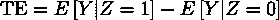
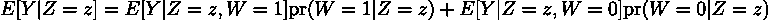
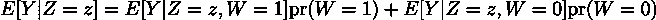
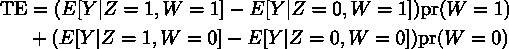
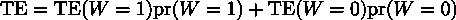
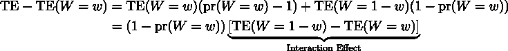
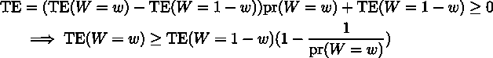
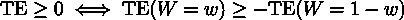

# 网上实验交互是否重要？

> 原文：[`towardsdatascience.com/does-it-matter-that-online-experiments-interact-9c4012b75fbd/`](https://towardsdatascience.com/does-it-matter-that-online-experiments-interact-9c4012b75fbd/)

由[Uriel Soberanes](https://unsplash.com/@soberanes?utm_content=creditCopyText&utm_medium=referral&utm_source=unsplash)在[Unsplash](https://unsplash.com/photos/two-bisons-fighting-head-L1bAGEWYCtk?utm_content=creditCopyText&utm_medium=referral&utm_source=unsplash)上的照片

实验不是一次一个地运行的。在任何时候，成熟网站上都有数百到数千个实验在进行。问题是：如果这些实验相互交互呢？这是否是一个问题？正如许多有趣的问题一样，答案是“是和否”。继续阅读以获得更明确、可操作、完全清晰和自信的看法！

定义：当某个实验的处理效果取决于单位被分配到另一个实验的哪个变体时，实验**交互**。

例如，假设我们有一个测试新搜索模型的实验，另一个测试新推荐模型的实验，用于“人们也买了”模块。这两个实验最终都是为了帮助客户找到他们想要购买的东西。分配给更好的推荐算法的单位在搜索实验中可能具有较小的处理效果，因为它们不太可能受到搜索算法的影响：他们是因为更好的推荐而做出购买的。

一些实证研究表明，典型的交互效应[很小](https://www.microsoft.com/en-us/research/articles/a-b-interactions-a-call-to-relax/)。也许你并不觉得这特别令人安慰。我也不确定。毕竟，交互效应的大小取决于我们进行的实验。对于你的特定组织，实验可能更多地或更少地交互。可能在你所处的环境中，交互效应比在这些类型分析中通常概述的公司要大。

因此，这篇博客文章不是实证论点。它是理论性的。这意味着它包括数学。所以就这样。我们将尝试通过一个明确的模型来理解交互问题，而不参考特定公司的数据。即使交互效应相对较大，我们也会发现它们很少对*决策*产生影响。交互效应必须非常巨大，并且具有独特的模式，才能影响哪个实验获胜。博客的目的是让你放心。

## 交互并不那么特别，也不那么糟糕

假设我们有两个 A/B 测试实验。令 Z = 1 表示第一个实验中的处理，W = 1 表示第二个实验中的处理。Y 是我们感兴趣的指标。

第一个实验的处理效果是：

让我们分解这些项，看看交互作用如何影响治疗效果。

一个随机实验的桶划分与另一个随机实验的桶划分是独立的，因此：

因此，治疗效果是：

或者，更简洁地说，治疗效果是 W=1 和 W=0 群体内治疗效果的加权平均值：

只写下数学表达式的一个好处是它使我们的问题具体化。我们可以确切地看到交互作用偏差的形式以及什么将决定其大小。

问题在于：只有在第二个实验结束后，W = 1 或 W = 0 才会启动。因此，第一个实验的环境将不会与实验后的环境相同。这引入了以下的治疗效果偏差：

假设 W = w 启动，那么第一个实验的实验后治疗效果，TE(W=w)，被实验治疗效果，TE，错误地衡量，导致偏差：

如果第二个实验和第一个实验之间存在交互作用，那么 TE(W=1-w) – TE(W=w) != 0，因此存在偏差。

**所以，*是的*，交互作用导致偏差。**偏差与交互作用的大小成正比。

但**交互作用并非特殊**。**任何**与实验环境与影响治疗效果的将来环境之间不同的因素都会导致具有相同形式的偏差。你的产品有季节性需求吗？是否发生了大规模的供应冲击？通货膨胀是否急剧上升？韩国的蝴蝶如何？它们是否振翅？

在线实验**不是**实验室实验。我们无法控制环境。经济不在我们的控制之下（遗憾的是）。我们总是面临这样的偏差。

因此，在线实验不是关于估计永久存在的治疗效果。它们是关于**做出决策**。A 是否比 B 好？这个答案不太可能因为交互作用而改变，同样的原因，我们通常不会担心它因为我们在 3 月而不是在一年中的其他月份进行实验而翻转。

为了使交互作用对决策产生影响，我们需要，比如说，TE ≥ 0（因此我们会在第一个实验中启动 B）和 TE(W=w) < 0（但根据第二个实验发生的情况，我们应该启动 A）。

TE ≥ 0 当且仅当：

以典型的分配 pr(W=w) = 0.50 为例，这意味着：

因为 TE(W=w) < 0，这只有在 TE(W=1-w) > 0 的情况下才成立。这很有道理。为了使交互成为决策的问题，交互效应必须足够大，以至于在一个治疗方案下为负的实验在另一个治疗方案下为正。

在典型的 50-50 分配下，交互效应必须非常**极端**。如果在一个治疗方案下，治疗效应为每单位+$2，那么在另一个治疗方案下，治疗效应必须小于每单位-$2，以便交互效应影响决策。为了从标准治疗效应中做出错误的决定，我们不得不遭受巨大的交互效应，这些效应会改变治疗的符号并保持相同的幅度！

这就是为什么我们不会担心交互以及所有那些我们无法在实验期间和实验后保持不变的因素（季节性等）。环境的变化将不得不彻底改变用户对功能的体验。可能不会。

当你的最终结论包括“可能”时，总是一个好兆头。

* * *

感谢阅读！

扎克

联系方式：[`linkedin.com/in/zlflynn`](https://linkedin.com/in/zlflynn)
