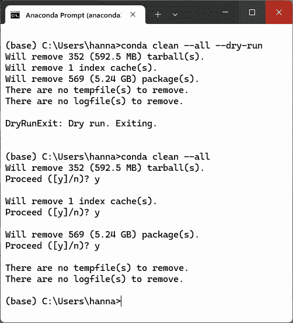
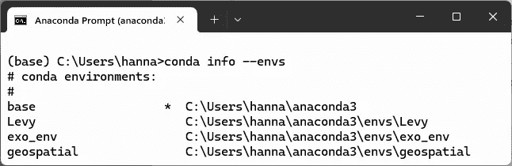
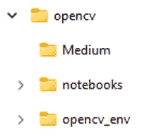

# 不要让 conda 吃掉你的硬盘

> 原文：[`towardsdatascience.com/dont-let-conda-eat-your-hard-drive/`](https://towardsdatascience.com/dont-let-conda-eat-your-hard-drive/)

如果你是一个 Anaconda 用户，你就会知道[*conda 环境*](https://docs.anaconda.com/working-with-conda/environments/)可以帮助你管理包依赖关系，避免兼容性冲突，并与他人共享你的项目。不幸的是，它们也可能占用你的电脑硬盘空间。

我写了很多计算机教程，为了保持它们的组织，每个教程都有一个专门的文件夹结构，包括 conda 环境。一开始这效果很好，但很快我的电脑性能就下降了，我注意到我的 SSD 空间快满了。一度我只有 13GB 的空闲空间。


C:驱动器内存使用情况（作者提供）

Conda 通过将下载的包文件存储在单个“缓存”（`pkgs_dirs`）中，帮助管理这个问题。当你安装一个包时，conda 会在包缓存中检查它，然后再下载。如果没有找到，conda 将下载并提取该包，并将文件链接到活动环境。因为缓存是“共享”的，不同的环境可以重复使用相同的下载文件，而不需要重复。

因为 conda 缓存了*每个下载的包*，`pkgs_dirs`可以增长到几个 GB。虽然 conda 链接到缓存中的共享包，但仍需要将一些包存储在环境文件夹中。这主要是为了避免*版本冲突*，不同环境需要不同版本的相同*依赖项*（运行另一个包所需的包）。

此外，像[OpenCV](https://opencv.org/)这样的大型、编译后的二进制文件可能需要在环境的目录中保留*完整副本*，每个环境都需要 Python 解释器的副本（大约 100-200MB）。所有这些问题都可能使 conda 环境膨胀到几个 GB。

在这个*快速成功数据科学*项目中，我们将探讨一些减少 conda 环境存储需求的技巧，包括存储在默认位置和专用文件夹中的环境。

* * *

## 内存管理技巧

以下是一些内存管理技巧，可以帮助你减少 conda 在你的机器上的存储占用。我们将逐一讨论。

1.  缓存清理

1.  分享基于任务的 环境

1.  使用环境和规格文件进行存档

1.  使用 conda-pack 存档环境

1.  在外部驱动器上存储环境

1.  重新定位包缓存

1.  使用虚拟环境(`venv`)

### 1. 清理包缓存

清理包缓存是释放内存的第一步，也是最容易的一步。即使删除了环境，conda 也会在缓存中保留相关的包文件。你可以通过删除这些未使用的包及其关联的*tarballs*（压缩包文件）、日志、*索引缓存*（存储在 conda 中的元数据）和临时文件来释放空间。

Conda 允许一个可选的“dry run”，以查看将回收多少内存。你将想要从你的**base**环境中的终端或 Anaconda Prompt 运行此操作：

```py
conda clean --all --dry-run
```

要提交，请运行：

```py
conda clean --all
```

这里是如何在我的机器上显示的：



Conda dry run 和 clean 命令在 Anaconda Prompt（作者）

这个过程减少了健康的 6.28 GB，并且运行了几分钟。

### 2. 分享基于任务的 环境

为**专门的任务**创建几个环境，例如计算机视觉或地理空间工作，比为每个**项目**使用专用环境更节省内存。这些环境将包括基本包以及特定任务的包（例如，用于计算机视觉的 OpenCV、scikit-image 和 PIL）。

这种方法的优点是你可以轻松地保持所有包的最新状态并将环境链接到多个项目。然而，如果某些项目需要共享包的不同版本，则这种方法将不起作用。

### 3. 使用环境和规格文件存档

如果你没有足够的存储位置或者想要高效地保留旧项目，考虑使用**环境**或**规格**文件。这些小文件记录了环境的**内容**，允许你稍后重建它。

以这种方式保存 conda 环境将减少它们在磁盘上的大小，从几吉字节减少到几千字节。当然，你必须重新创建环境才能使用它。所以，如果你经常回顾链接到存档环境的旧项目，你将想要避免这种技术。

> 注意：考虑使用[Mamba](https://mamba.readthedocs.io/en/latest/)，它是 conda 的替代品，用于更快的重建。正如文档所说，“如果你知道 conda，你就知道 Mamba！”

**使用环境文件**：一个**环境文件**是一个小文件，列出了环境中安装的所有包和版本，包括使用 Python 的包安装程序([pip](https://pypi.org/project/pip/))安装的包。这有助于你恢复环境并与他人共享。

环境文件是用[*YAML*](https://en.wikipedia.org/wiki/YAML)（*.yml*）编写的，这是一种用于数据存储的人可读数据序列化格式。要生成环境文件，你必须激活并导出环境。以下是如何为名为**my_env**的环境创建文件的示例：

```py
 conda activate my_env
 conda env export > my_env.yml
```

你可以命名文件为任何有效的文件名，但请注意，具有相同名称的现有文件将被覆盖。

默认情况下，环境文件写入**用户**目录。以下是文件内容的截断示例：

```py
name: C:\Users\hanna\quick_success\fed_hikes\fed_env
channels:
  - defaults
  - conda-forge
dependencies:
  - asttokens=2.0.5=pyhd3eb1b0_0
  - backcall=0.2.0=pyhd3eb1b0_0
  - blas=1.0=mkl
  - bottleneck=1.3.4=py310h9128911_0
  - brotli=1.0.9=ha925a31_2
  - bzip2=1.0.8=he774522_0
  - ca-certificates=2022.4.26=haa95532_0
  - certifi=2022.5.18.1=py310haa95532_0
  - colorama=0.4.4=pyhd3eb1b0_0
  - cycler=0.11.0=pyhd3eb1b0_0
  - debugpy=1.5.1=py310hd77b12b_0
  - decorator=5.1.1=pyhd3eb1b0_0
  - entrypoints=0.4=py310haa95532_0

  ------SNIP------
```

你现在可以移除你的 conda 环境，并使用这个文件重新生成它。要移除环境，首先将其停用，然后运行`remove`命令（其中`ENVNAME`是你的环境名称）：

```py
conda deactivate
conda remove -n ENVNAME --all
```

如果 conda 环境存在于 Anaconda 默认的**envs**文件夹之外，那么请包含环境的目录路径，如下所示：

```py
conda remove -p PATH\ENVNAME --all
```

注意，这种归档技术只有在您继续使用相同的操作系统，例如 Windows 或 macOS 时才能完美工作。这是因为解决依赖关系可能会引入可能在不同平台之间不兼容的包。

要使用文件恢复 conda 环境，请运行以下命令，其中 `my_env` 代表您的 conda 环境名称，`environment.yml` 代表您的环境文件：

```py
 conda env create -n my_env -f \directory\path\to\environment.yml
```

您还可以使用环境文件在您的 D: 驱动器上重新创建环境。只需在使用文件时提供新的路径。以下是一个示例：

```py
conda create --prefix D:\my_envs\my_new_env --file environment.yml
```

更多关于环境文件的信息，包括如何手动创建它们，请访问 [docs](https://docs.conda.io/projects/conda/en/latest/user-guide/tasks/manage-environments.html)。

**使用规范文件：**如果您没有使用 pip 安装任何包，您可以使用 *规范文件* 在相同的操作系统上重新创建 conda 环境。要创建规范文件，激活环境，例如 *my_env*，然后输入以下命令：

```py
 conda list --explicit > exp_spec_list.txt
```

这将产生以下输出，为了简洁起见已截断：

```py
 # This file may be used to create an environment using:
 # $ conda create --name <env> --file <this file>
 # platform: win-64
 @EXPLICIT
 https://conda.anaconda.org/conda-forge/win-64/ca-certificates-202x.xx.x-h5b45459_0.tar.bz2
 https://conda.anaconda.org/conda-forge/noarch/tzdata-202xx-he74cb21_0.tar.bz2

------snip------
```

注意，`--explicit` 标志确保目标平台在文件中进行了注释，在本例中为第三行的 *# platform: win-64*。

您现在可以按照上一节所述删除环境。

要使用此文本文件重新创建 *my_env*，请运行以下命令，并确保提供正确的目录路径：

```py
conda create -n my_env -f \directory\path\to\exp_spec_list.txt
```

### 4. 使用 conda-pack 归档环境

`conda-pack` 命令允许在删除之前归档 conda 环境。它将整个环境打包成一个扩展名为 *.tar.gz* 的压缩归档文件。这对于备份、共享和移动环境而不需要重新安装包非常有用。

以下命令将保留环境，但将其从您的系统中删除（其中 *my_env* 代表您环境的名称）：

```py
conda install -c conda-forge conda-pack
conda pack -n my_env -o my_env.tar.gz
```

要稍后恢复环境，请运行此命令：

```py
mkdir my_env && tar -xzf my_env.tar.gz -C my_env
```

这种技术不会像文本文件选项那样节省内存。然而，在恢复环境时，您不需要重新下载包，这意味着在没有互联网连接的情况下也可以使用。

### 5. 在外部驱动器上存储环境

默认情况下，conda 将所有环境存储在默认位置。对于 Windows，这是在 *…\anaconda3\envs* 文件夹下。您可以通过在提示窗口或终端中运行命令 `conda info --envs` 来查看这些环境。以下是在我的 C: 驱动器上的视图（这是一个截断视图）：



作者在我的 C:\ 驱动器上的 conda 环境的截断视图

**使用单个环境文件夹：**如果您的系统支持外部或辅助驱动器，您可以配置 conda 将环境存储在那里，以释放主磁盘的空间。以下是命令；您需要替换您的特定路径：

```py
conda config --set envs_dirs /path/to/external/drive
```

如果您输入 D 驱动的路径，例如 *D:\conda_envs*，conda 将在此位置创建新的环境。

当你的外部驱动器是一个快速的 SSD，并且你存储的是像 TensorFlow 这样的具有大型依赖项的包时，这种技术效果很好。缺点是性能较慢。如果你的操作系统和笔记本仍然在主驱动器上，当运行 Python 时，你可能会遇到一些读写延迟。

此外，一些操作系统设置可能会关闭空闲的外部驱动器，当它们重新启动时增加延迟。如果驱动器字母发生变化，像 Jupyter 这样的工具可能难以定位 conda 环境，因此你想要使用固定的驱动器字母并确保设置了正确的内核路径。

**使用多个环境文件夹：** 而不是为 *所有* 环境使用单个`envs_dirs`目录，你可以将每个环境存储在其各自的 *项目* 文件夹中。这样，你可以将与项目相关的所有内容存储在一个地方。



示例项目文件结构，包含嵌入的（1.7 GB）conda 环境（opencv_env）（作者提供）

例如，假设你在 Windows D: 驱动器上的一个名为 *D:\projects\geospatial* 的文件夹中有一个项目。要将项目的 conda 环境放置在这个文件夹中，并加载`ipykernel`以供 JupyterLab 使用，你需要运行以下命令：

```py
conda create -p D:\projects\geospatial\env ipykernel
```

当然，你可以将*env*命名为更具描述性的名称，例如*geospatial_env*。

与前面的示例一样，存储在不同磁盘上的环境可能会导致性能问题。

**关于 JupyterLab 的特殊说明：** 根据你如何启动 JupyterLab，它的默认行为可能是打开在您的 *用户* 目录中（例如，*C:\Users\your_user_name*）。由于它的文件浏览器仅限于启动它的目录，你将看不到其他驱动器上的目录，如`D:\`。处理这个问题有很多方法，但其中最简单的一种是从 D: 驱动器启动 JupyterLab。

例如，在 Anaconda Prompt 中，输入以下命令：

```py
D:
```

接着：

```py
jupyter lab
```

现在，你将能够从 D: 驱动器上的内核中进行选择。

关于更改 JupyterLab 的工作目录的更多选项，询问 AI 关于“如何更改 Jupyter 的默认工作目录”或“如何在用户文件夹中创建到`D:\`的符号链接。”

**移动现有环境：** 你永远不应该手动移动 conda 环境，例如通过剪切和粘贴到新位置。这是因为 conda 依赖于内部路径和元数据，这些路径和元数据在位置变化时可能会变得无效。

相反，你应该将现有的环境克隆到另一个驱动器上。这将 *复制* 环境副本，因此你需要手动从原始位置删除它。

在以下示例中，我们使用`--clone`标志在 D: 驱动器上创建 C: 驱动器环境（称为*my_env*）的精确副本：

```py
conda create -p D:\new_envs\my_env --clone C:\path\to\old\env
```

> **注意：** 在克隆之前，考虑将你的环境导出到一个 *YAML* 文件中（如上节 3 所述）。这允许你在克隆过程中出现问题时重新创建环境。

现在，当你运行 `conda env list` 时，你会在 C: 和 D: 驱动器上看到列出的环境。你可以通过在 *base* 环境中运行以下命令来删除旧环境：

```py
conda remove --name my_env --all -y
```

再次提醒，如果你在两个磁盘之间工作，延迟问题可能会影响这些设置。

你可能会想知道，是使用环境（YAML）文件移动 conda 环境，还是使用 `--clone`？简短的回答是，`--clone` 是将环境移动到同一台机器上不同驱动器的最佳和最快选项。环境文件最适合在 *不同* 机器上重新创建相同的环境。虽然文件保证了在不同系统之间的一致环境，但它可能需要更长的时间来运行，尤其是在大型环境中。

### 6. 移动包缓存

如果你主驱动器的空间不足，你可以使用此命令将包缓存移动到更大的外部或辅助驱动器：

```py
conda config --set pkgs_dirs D:\conda_pkgs
```

在这个例子中，包现在存储在 D 驱动器上（*D:\conda_pkgs*），而不是默认位置。

如果你正在主驱动器上工作，并且两个驱动器都是 SSD，那么延迟问题不应该很重要。然而，如果其中一个驱动器是较慢的 HDD，那么在创建或更新环境时可能会出现减速。如果 D: 是通过 USB 连接的外部驱动器，你可能会看到大型环境的大幅减速。

你可以通过将包缓存（`pkgs_dirs`）和常用环境保存在较快的 SSD 上，其他环境保存在较慢的 HDD 上来减轻这些问题。

最后要考虑的一件事是 *备份*。主驱动器可能有计划进行常规备份，但辅助或外部驱动器可能没有。这使你面临丢失所有环境的风险。

### 7. 使用虚拟环境

如果你的项目不需要 conda 的广泛包管理系统来处理重型依赖（如 TensorFlow 或 GDAL），你可以使用 Python 的 *虚拟环境* (`venv`) 显著减少磁盘使用量。这代表了一个轻量级的 conda 环境替代方案。

要创建名为 *my_env* 的 `venv`，请运行以下命令：


这种类型的虚拟环境具有较小的基本安装。一个最小的 conda 环境大约占用 200 MB，包括多个实用程序，如 `conda`、`pip`、`setuptools` 等。`venv` 要轻得多，最小安装大小仅为 5–10 MB。

Conda 还会在 `pkgs_dirs` 中缓存包的 tarball 文件。这些文件随着时间的推移可能会增长到几个 GB。因为 `venv` 直接将包安装到环境中，所以不会保留额外的副本。

通常，当你只需要像 NumPy、pandas 或 Scikit-learn 这样的基本 Python 包时，你会想要考虑使用 `venv`。对于 conda 强烈推荐的包，如 Geopandas，仍然应该放在 conda 环境中。如果你使用了很多环境，你可能想要继续使用 conda 并从中受益于其包链接功能。

你可以在 `venv` [文档](https://docs.python.org/3/library/venv.html) 中找到有关如何激活和使用 Python 虚拟环境的详细信息。

* * *

## 概述

conda 环境的高影响/低干扰内存管理技术包括清理包缓存和将不常用的环境存储为 YAML 或文本文件。这些方法可以在保留 Anaconda 默认目录结构的同时节省许多吉字节内存。

其他高影响的方法包括将包缓存和/或 conda 环境移动到辅助或外部驱动器。这将解决内存问题，但可能会引入延迟问题，尤其是如果新驱动器是慢速 HDD 或使用 USB 连接。

对于简单环境，你可以使用 Python 虚拟环境 (`venv`) 作为 conda 的轻量级替代方案。
