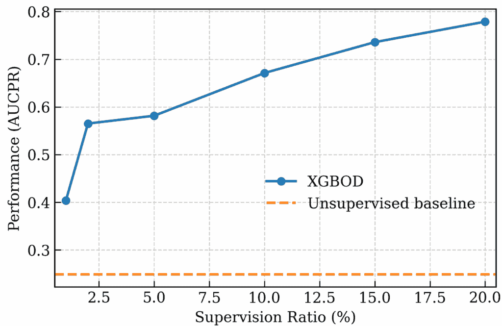
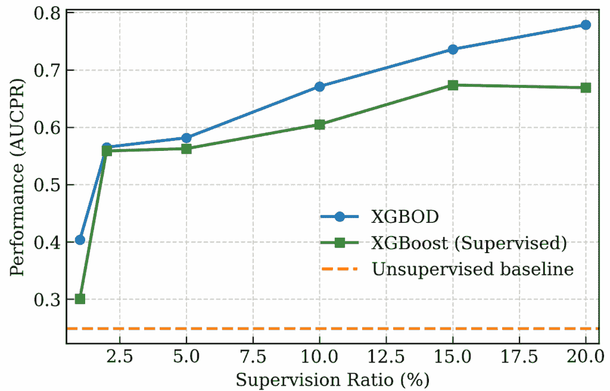

# 不要浪费你的标记异常：提升异常检测性能的 3 个实用策略

> 原文：[`towardsdatascience.com/dont-waste-your-labeled-anomalies-3-practical-strategies-to-boost-anomaly-detection-performance/`](https://towardsdatascience.com/dont-waste-your-labeled-anomalies-3-practical-strategies-to-boost-anomaly-detection-performance/)

<mdspan datatext="el1752705956504" class="mdspan-comment">大多数异常检测</mdspan>算法假设你正在处理完全未标记的数据。

但如果你实际上处理过这些问题，你知道现实往往不同。在实践中，异常检测任务通常至少带有几个标记的示例，可能来自过去的调查，或者你的主题专家标记了一些异常来帮助你更清楚地定义问题。

在这种情况下，如果我们忽略这些宝贵的标记示例，坚持使用那些纯粹的无监督方法，我们就是在错失机会。

因此，问题是如何真正利用那些少数标记的异常？

如果你搜索学术文献，你会发现它充满了巧妙的解决方案，尤其是在所有新的深度学习方法出现之后。但让我们面对现实，大多数这些解决方案都需要采用全新的框架，学习曲线陡峭。它们通常涉及大量不直观的超参数调整，而且可能仍然无法在你特定的数据集上表现良好。

在这篇文章中，我想分享三个你可以立即开始使用的实用策略，以提升你的异常检测性能。无需复杂的框架。我还会通过一个关于欺诈检测数据的实例来具体说明，这样你可以看到这些方法在实际中的应用。

到最后，你将拥有几种可操作的方法来更好地利用你有限的标记数据，以及一个你可以根据自己用例进行调整的实际应用案例。

* * *

**1. 阈值调整**

让我们从最简单的方法开始。

大多数无监督模型输出一个连续的**异常分数**。完全取决于你决定在哪里划线来区分“正常”和“异常”类别。

这对于实用的异常检测解决方案来说是一个重要的步骤，因为选择错误的阈值可能会导致错过关键异常或让操作员被虚假警报淹没。幸运的是，那些少数标记的异常示例可以提供一些指导，以正确设置这个阈值。

关键的洞见是，你可以使用那些标记的异常作为验证集，以量化在不同阈值选择下的检测性能。

这里是如何在实际中工作的：

**步骤（1）**：在数据集**排除**那些标记异常的情况下，继续进行你通常的模型训练和阈值设置。如果你已经整理了一个纯正常数据集，你可能希望将阈值设置为在正常数据中观察到的最大异常分数。如果你正在处理未标记的数据，你可以通过选择一个百分位数（例如，第 95 百分位数或第 99 百分位数）来设置阈值，这个百分位数对应于你容忍的误报率。

**步骤（2）**：将你的标记异常放在一边，你可以在你选择的阈值下计算具体的检测指标。这些包括召回率（已知异常中会被捕获的百分比）、精确度和召回率@k（当你只能调查前 k 个警报时很有用）。这些指标给你一个量化的衡量标准，以确定你当前的阈值是否产生可接受的检测性能。

> 💡**专业技巧**：如果你的标记异常数量很少，估计的指标（例如，召回率）会有很高的方差。这里更稳健的方法是通过**重抽样**来报告其不确定性。本质上，你通过随机替换已知异常来创建许多“伪数据集”，为每个复制计算指标，并从分布（例如，抓取第 2.5 百分位数和第 97.5 百分位数，这给你一个 95%的置信区间）中推导出置信区间。这些不确定性估计将给你提示，这些计算出的指标有多可靠。

**步骤（3）**：如果你对当前的检测性能不满意，你现在可以根据这些指标主动调整阈值。如果你的召回率太低（意味着你错过了太多已知的异常），你可以降低阈值。如果你捕捉到大多数异常，但误报率高于可接受的范围，你可以提高阈值并衡量权衡。底线是，你现在可以根据实际性能数据，找到适合你特定用例的假阳性与假阴性之间的最佳平衡。

**✨ 启示**

这种方法的优点在于其简单性。你并没有改变你的异常检测算法——你只是使用你的标记示例来智能地调整一个你无论如何都需要设置的阈值。有了少量标记的异常，你可以将阈值选择从猜测变成一个具有可测量结果的优化问题。

* * *

**2. 模型选择**

除了调整阈值，标记的异常还可以指导选择更好的模型选择和配置。

模型选择是每个从业者都会遇到的一个常见痛点：有这么多异常检测算法，每个都有自己的超参数，你怎么知道哪个组合实际上会对你特定的问题工作得很好？

为了有效地回答这个问题，我们需要一个具体的方法来衡量我们在调查的数据集上，不同的模型和配置表现如何。

这正是那些标记的异常变得非常有价值的地方。以下是工作流程：

**步骤（1）**：在数据集上训练候选模型（具有特定的配置），排除那些标记的异常，就像我们在阈值调整中所做的那样。

**步骤（2）**：对整个数据集进行评分，并计算已知异常的平均异常分数百分位数。具体来说，对于每个标记的异常，您计算它在分数分布中的百分位数（例如，如果已知异常的分数高于所有数据点的 95%，则位于第 95 百分位数）。然后，您将这些百分位数平均到所有标记的异常上。这样，您就获得了一个单一指标，该指标可以捕捉模型将已知异常推向排名顶端的效果。这个指标越高，模型的性能就越好。

**步骤（3）**：您可以将这种方法应用于确定您心中特定模型类型（例如，局部异常因子、高斯混合模型、自动编码器等）的最有潜力的超参数配置，或者选择与您的异常模式最匹配的模型类型。

> 💡**专业提示**：集成学习在生产异常检测系统中越来越常见。这种范式意味着不是依赖于一个单一的检测模型，而是多个检测器（可能具有不同的模型类型和不同的模型配置）同时运行，以捕获不同类型的异常。在这种情况下，那些标记的异常样本可以帮助您判断哪些候选模型实例真正值得在最终的集成中占有一席之地。

**✨ 吸收点**

与之前的阈值调整策略相比，当前的模型选择策略是从“调整你所拥有的”转变为“选择你要使用的”。

具体来说，通过使用已知异常的平均百分位数排名作为性能指标，您可以客观地比较不同算法和配置在识别您实际遇到的异常类型方面的表现。因此，您的模型选择不再是试错过程，而是一个数据驱动的决策过程。

* * *

**3. 监督集成**

到目前为止，我们一直在讨论的策略主要是将标记的异常值作为验证工具，用于调整阈值或选择有潜力的模型。当然，我们也可以将这些方法更直接地应用于检测过程本身。

正是这种想法促成了**监督集成**。

为了更好地理解这种方法，让我们首先讨论一下这种策略背后的直觉。

我们知道，不同的异常检测方法往往对可疑数据的看法不一致。一个算法可能会在数据点上标记“异常”，而另一个算法可能会说它完全正常。但问题是：这些分歧非常有信息量，因为它们告诉我们很多关于该数据点**异常特征**的信息。

让我们考虑以下场景：假设我们有两个数据点，A 和 B。对于数据点 A，它在**基于密度的方法**（例如，高斯混合模型）中触发警报，但通过了一个**基于隔离的方法**（例如，隔离森林）。然而，对于数据点 B，两个检测器都设置了警报。那么，我们通常会认为这两个点具有完全不同的签名，对吧？

现在的问题是，如何以系统化的方式捕捉这些签名。

幸运的是，我们可以求助于**监督学习**。以下是方法：

**步骤 (1)**: 首先在你的未标记数据上（当然不包括你宝贵的标记示例）训练多个基础异常检测器。

**步骤 (2)**: 对于每个数据点，收集所有这些检测器的异常分数。这成为你的特征向量，这实际上是我们要从中学到的“异常签名”。为了给出一个具体的例子，假设你使用了三个基础检测器（例如，隔离森林、高斯混合模型和主成分分析），那么单个数据点`i`的特征向量将看起来像这样：

`X_i=[iForest_score, GMM_score, PCA_score]`

每个数据点的标签很简单：已知异常为`1`，其余样本为`0`。

**步骤 (3)**: 使用这些新组成的特征向量作为输入，并将标签作为目标输出，训练一个标准的**监督分类器**。虽然原则上任何现成的分类算法都可以工作，但一个常见的建议是使用**梯度提升树模型**，例如**XGBoost**，因为它们擅长学习特征中的复杂、非线性模式，并且对“噪声”标签具有鲁棒性（记住，可能并非所有未标记的样本都是正常的）。

一旦训练完成，这个监督的“元模型”就是你的最终异常检测器。在推理时间，你将新数据通过所有基础检测器，并将它们的输出传递给你的训练好的元模型进行最终决策，即正常或异常。

**✨ 吸收要点**

使用监督集成策略，我们正在将范式从使用标记异常作为被动验证工具转变为使它们成为检测过程中的积极参与者。我们构建的元分类器模型学习不同检测器如何响应异常。这不仅提高了检测精度，更重要的是，为我们提供了一个结合多个算法优势的原则性方法，使异常检测系统更加稳健和可靠。

如果你正在考虑实施这种策略，好消息是**PyOD 库**已经提供了这个功能。让我们接下来看看它。

* * *

**4. 案例研究：欺诈检测**

在本节中，让我们通过一个具体的案例研究来观察监督集成策略的实际应用。在这里，我们考虑一种称为**[XGBOD](https://arxiv.org/abs/1912.00290)**（极端梯度提升异常检测）的方法，它在 PyOD 库中实现。

对于案例研究，我们考虑了一个来自[Kaggle](https://www.kaggle.com/datasets/mlg-ulb/creditcardfraud)的信用卡欺诈检测数据集（数据库内容许可）。该数据集包含 2013 年 9 月欧洲持卡人通过信用卡进行的交易。总共有 284,807 笔交易，其中 492 笔是欺诈交易。请注意，由于保密问题，数据集中的特征不是原始的，而是 PCA 变换的结果。特征‘Class’是响应变量。欺诈时取值为 1，否则为 0。

在这个案例研究中，我们考虑了三种学习范式，即无监督学习、XGBOD 和完全监督学习，以执行异常检测。我们将改变 XGBOD 和监督学习方法中的“**监督比率**”（训练期间可用的异常百分比）来观察利用标记异常对检测性能的影响。

**4.1 导入库**

对于无监督异常检测，我们考虑了 4 种算法：主成分分析（PCA）、隔离森林、基于聚类的局部离群因子（CBLOF）和基于直方图的离群检测（HBOS），这是一种高效的检测方法，它假设特征独立性，并通过构建直方图来计算离群程度。所有算法都在 PyOD 库中实现。

对于监督学习方法，我们使用 XGBoost 分类器。

```py
import pandas as pd
import numpy as np

# PyOD imports
# !pip install pyod
from pyod.models.xgbod import XGBOD
from pyod.models.pca import PCA
from pyod.models.iforest import IForest
from pyod.models.cblof import CBLOF
from pyod.models.hbos import HBOS

from sklearn.model_selection import train_test_split
from sklearn.preprocessing import StandardScaler
from sklearn.metrics import (precision_recall_curve, average_precision_score,
                             roc_auc_score)
# !pip install xgboost
from xgboost import XGBClassifier
```

**4.2 数据准备**

记得从[Kaggle](https://www.kaggle.com/datasets/mlg-ulb/creditcardfraud)下载数据集，并将其本地存储为“creditcard.csv”。

```py
# Load data
df = pd.read_csv('creditcard.csv')      
X, y = df.drop(columns='Class').values, df['Class'].values

# Scale features
scaler = StandardScaler()
X_scaled = scaler.fit_transform(X)

# Split into train/test
X_train, X_test, y_train, y_test = train_test_split(
    X_scaled, y, test_size=0.3, random_state=42, stratify=y
)

print(f"Dataset shape: {X.shape}")
print(f"Fraud rate (%): {y.mean()*100:.4f}")
print(f"Training set: {X_train.shape[0]} samples")
print(f"Test set: {X_test.shape[0]} samples")
```

在这里，我们创建一个辅助函数来生成 XGBOD/XGBoost 学习的标记数据。

```py
def create_supervised_labels(y_train, supervision_ratio=0.01):
    """
    Create supervised labels based on supervision ratio.
    """

    fraud_indices = np.where(y_train == 1)[0]
    n_labeled_fraud = int(len(fraud_indices) * supervision_ratio)

    # Randomly select labeled samples
    labeled_fraud_idx = np.random.choice(fraud_indices, 
                                         n_labeled_fraud, 
                                         replace=False)

    # Create labels
    y_labels = np.zeros_like(y_train)
    y_labels[labeled_fraud_idx] = 1

    # Calculate how many true frauds are in the "unlabeled" set
    unlabeled_fraud_count = len(fraud_indices) - n_labeled_fraud

    return y_labels, labeled_fraud_idx, unlabeled_fraud_count
```

注意，这个函数模拟了一个现实场景，其中我们有一些已知的异常（标记为 1），而所有其他未标记的样本都被视为正常（标记为 0）。这意味着我们的标签实际上是*噪声的*，因为一些真正的欺诈案例隐藏在未标记的数据中，但仍然被标记为 0。

在我们开始分析之前，让我们定义一个用于评估模型性能的辅助函数：

```py
def evaluate_model(model, X_test, y_test, model_name):
    """
    Evaluate a single model and return metrics.
    """
    # Get anomaly scores
    scores = model.decision_function(X_test)

    # Calculate metrics
    auc_pr = average_precision_score(y_test, scores)

    return {
        'model': model_name,
        'auc_pr': auc_pr,
        'scores': scores
    }
```

在 PyOD 框架中，每个训练好的模型实例都公开了一个`decision_function()`方法。通过在推理样本上调用它，我们可以获得相应的异常分数。

为了比较性能，我们使用 AUCPR，即精确-召回曲线下的面积。由于我们处理的是一个高度不平衡的数据集，因此通常更倾向于使用 AUCPR 而不是 AUC-ROC。此外，使用 AUCPR 消除了测量模型性能时需要显式阈值的必要性。此指标已经包含了各种阈值条件下的模型性能。

**4.3 无监督异常检测**

```py
models = {
    'IsolationForest': IForest(random_state=42),
    'CBLOF': CBLOF(),
    'HBOS': HBOS(),
    'PCA': PCA(),
}

for name, model in models.items():
    print(f"Training {name}...")
    model.fit(X_train)
    result = evaluate_model(model, X_test, y_test, name)
    print(f"{name:20} - AUC-PR: {result['auc_pr']:.4f}")
```

我们获得的结果如下：

IsolationForest：– AUC-PR：0.1497

CBLOF：– AUC-PR：0.1527

HBOS：– AUC-PR：0.2488

PCA：– AUC-PR：0.1411

在没有超参数调整的情况下，没有任何算法提供了非常令人鼓舞的结果，因为它们的 AUCPR 值（约 0.15-0.25）可能低于在欺诈检测环境中通常所需的高精度/召回率。

然而，我们应该注意，与 AUC-ROC 不同，AUC-ROC 的基线值为 0.5，而 AUCPR 的基线值取决于**正类出现的频率**。对于我们的当前数据集，由于只有 0.17%的样本是欺诈，一个随机猜测的朴素分类器会有 AUCPR ≈ 0.0017。从这个意义上讲，所有检测器都已经远远超过了随机猜测。

**4.4 XGBOD 方法**

现在我们转向 XGBOD 方法，我们将利用少量标记异常来指导我们的异常检测。

```py
supervision_ratios = [0.01, 0.02, 0.05, 0.1, 0.15, 0.2]

for ratio in supervision_ratios:

    # Create supervised labels
    y_labels, labeled_fraud_idx, unlabeled_fraud_count = create_supervised_labels(y_train, ratio)

    total_fraud = sum(y_train)
    labeled_fraud = sum(y_labels)

    print(f"Known frauds (labeled as 1): {labeled_fraud}")
    print(f"Hidden frauds in 'normal' data: {unlabeled_fraud_count}")
    print(f"Total samples treated as normal: {len(y_train) - labeled_fraud}")
    print(f"Fraud contamination in 'normal' set: {unlabeled_fraud_count/(len(y_train) - labeled_fraud)*100:.3f}%")

    # Train XGBOD models
    xgbod = XGBOD(estimator_list=[PCA(), CBLOF(), IForest(), HBOS()],
                  random_state=42, 
                  n_estimators=200, learning_rate=0.1, 
                  eval_metric='aucpr')

    xgbod.fit(X_train, y_labels)
    result = evaluate_model(xgbod, X_test, y_test, f"XGBOD_ratio_{ratio:.3f}")
    print(f"xgbod - AUC-PR: {result['auc_pr']:.4f}")
```

获得的结果显示在下图，同时展示了最佳无监督检测器（HBOS）的性能作为参考。



图 1. XGBOD 与监督比例对比（图片由作者提供）

我们可以看到，仅使用 1%标记的异常，XGBOD 方法就已经击败了最好的无监督检测器，实现了 0.4 的 AUCPR 分数。随着更多标记的异常变得可用于训练，XGBOD 的性能持续提升。

**4.5 监督学习**

最后，我们考虑了直接在带有标记异常的数据集上训练二元分类器的场景。

```py
for ratio in supervision_ratios:

    # Create supervised labels
    y_label, labeled_fraud_idx, unlabeled_fraud_count = create_supervised_labels(y_train, ratio)

    clf = XGBClassifier(n_estimators=200, random_state=42, 
                        learning_rate=0.1, eval_metric='aucpr')
    clf.fit(X_train, y_label)

    y_pred_proba = clf.predict_proba(X_test)[:, 1]
    auc_pr = average_precision_score(y_test, y_pred_proba)
    print(f"XGBoost - AUC-PR: {auc_pr:.4f}")
```

结果显示在下图，同时展示了上一节中获得的 XGBOD 性能：



图 2. 考虑的方法之间的性能比较。（图片由作者提供）

通常情况下，我们发现，仅使用有限标记数据，标准的监督分类器（本例中为 XGBoost）在有效区分正常样本和异常样本方面存在困难。这在监督比例极低（即 1%）时尤为明显。虽然随着更多标记示例的可用，XGBoost 的性能有所提升，但我们看到它在所检查的监督比例范围内始终劣于 XGBOD 方法。

***

**5. 结论**

在本文中，我们讨论了三种利用少量标记异常来提升异常检测器性能的实际策略：

+   **阈值调整**：使用标记异常将阈值设置从猜测转变为数据驱动的优化问题。

+   **模型选择**：客观比较不同的算法和超参数设置，以找到真正适用于您特定问题的解决方案。

+   **监督集成学习**：训练一个元模型，系统地提取多个无监督检测器揭示的异常特征。

此外，我们还通过一个具体的欺诈检测案例研究，展示了监督集成方法（XGBOD）如何显著优于纯无监督模型和标准监督分类器，尤其是在标记数据稀缺的情况下。

关键要点：在异常检测中，几个标签就能走很长的路。是时候让这些标签发挥作用了。
