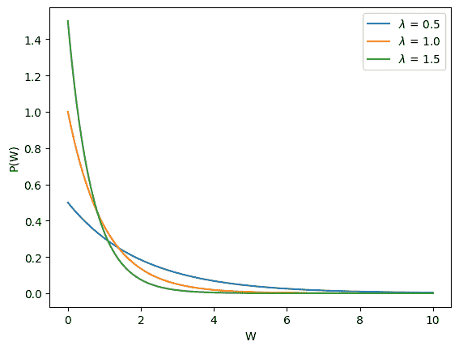
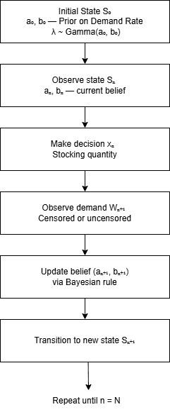
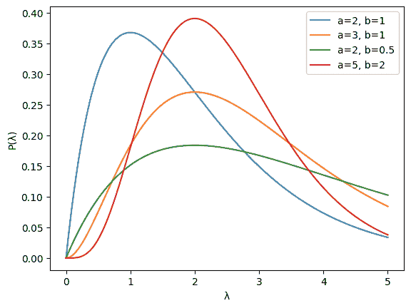
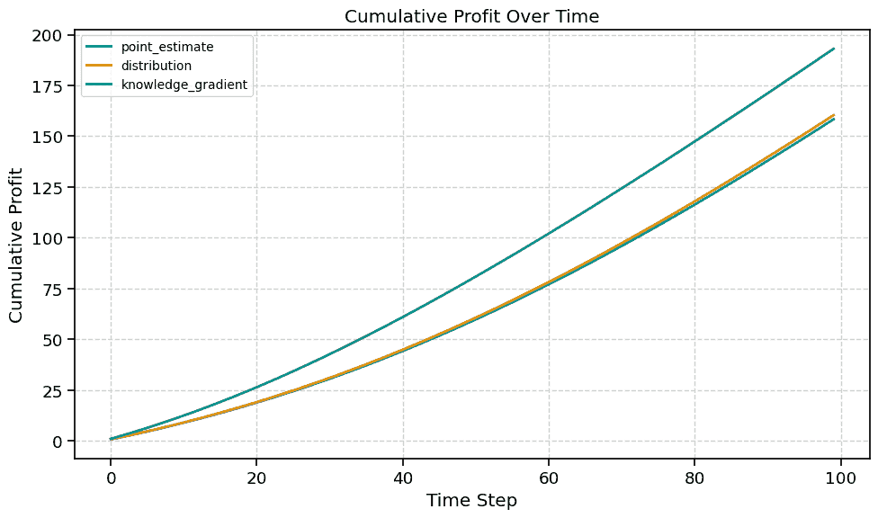
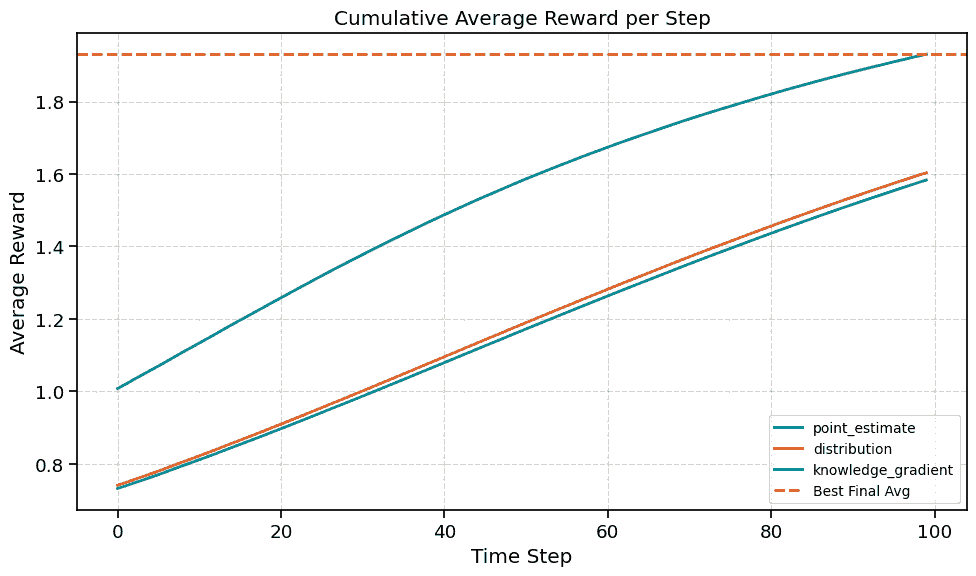
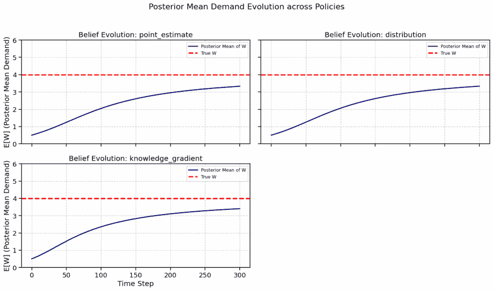

# 受限制需求的动态库存优化

> 原文：[`towardsdatascience.com/dynamic-inventory-optimization-with-censored-demand-2/`](https://towardsdatascience.com/dynamic-inventory-optimization-with-censored-demand-2/)

<mdspan datatext="el1752530776655" class="mdspan-comment">我们经常在不确定性下做出决策</mdspan>。不仅一次，而是在一段时间内连续做出决策。我们依靠我们的过去经验和对未来预期的期望来做出最明智和最优化选择。

想象一家提供多种产品的企业。这些产品以成本采购并以利润出售。然而，未售出的库存可能会产生补货费用，可能具有残值，或者在某些情况下，必须完全报废。

因此，企业面临一个关键问题：要储备多少？这个决定通常在需求完全知晓之前就必须做出；也就是说，在受限制的需求下。如果企业库存过多，它会观察到全部需求，因为所有客户请求都得到了满足。但如果它库存不足，它只能看到需求超过了供应，而实际需求仍然未知，这使得它成为一个受限制的观察。


由作者通过 DALL-E 生成的图像

这种类型的问题通常被称为**新闻销售商模型**。在运筹学和应用数学等领域，最优库存决策是通过将其表述为经典报纸库存问题来研究的；因此得名。

在本文中，我们探讨了一种在不确定性下的库存问题**顺序决策**框架，并开发了一种使用贝叶斯学习的动态优化算法。

我们的方法紧密遵循 [Warren B. Powell, 强化学习与随机优化 (2019)](https://castle.princeton.edu/wp-content/uploads/2019/10/Powell-Reinforcement-Learning-and-Stochastic-Optimization.pdf) 中提出的框架，并实现了 [Negoescu, Powell, 和 Frazier (2011)，《具有受限制需求和不可观察丢失销售的新闻销售商问题的最优学习策略》](https://people.orie.cornell.edu/pfrazier/pub/learning_newsvendor.pdf)，该论文发表在《运筹学》杂志上。

## 问题设置

沿用 Negoescu 等人的类似设置，我们将问题表述为在一系列时间步骤中优化单一商品的库存水平。成本和销售价格被认为是固定的。未售出的库存没有残值，而每单位销售的生成收入。需求是未知的，当可用库存少于实际需求时，需求观察被认为是受限制的。

每个时期的**需求 \( W \)**是从一个具有未知速率参数的指数分布中抽取的，用于模拟目的。

\[

\begin{aligned}

\( x \in \mathbb{R}_+ \) &&: 订单数量（决策变量） \\

\( W \sim \mathrm{Exponential}(\lambda) \) &&: 具有未知速率参数 \( \lambda \) 的随机需求 \\

\lambda &&&: \text{需求率（未知，待估计）} \\

c &&&: \text{采购或生产该物品的单位成本} \\

p &&&: \text{单位售价（假设 } p > c \text{ 以保证盈利）}

\end{aligned}

\]

指数分布中的参数 \(\lambda\) 代表了**需求率**；也就是说，需求事件发生的速度。**平均需求**由 \(\mathbb{E}[W] = \frac{1}{\lambda}\) 给出。



图片由作者提供

我们可以从指数分布的**概率密度函数**（PDF）中观察到，需求 \(W\) 的较高值变得不太可能。因此，指数分布是需求建模的一个合适选择。

## 顺序决策表述

我们将库存控制问题表述为在不确定性下的顺序决策过程。目标是最大化在有限时间范围 \( N \) 内的总期望利润，同时通过应用贝叶斯学习原理来学习未知的需求率。

我们定义了一个具有初始状态和随时间变化的概率模型，该模型代表其对未来状态的信念。在每一个时间步，模型根据将当前信念映射到行动的策略做出决策。目标是找到**最优策略**，以最大化预定义的奖励函数。

在采取行动后，模型观察到的结果状态并相应地更新其信念，从而继续这一决策、观察和信念更新的循环。



### 1) 状态变量

我们在每个期间将需求建模为一个从具有未知速率参数 \(\lambda\) 的指数分布中抽取的随机变量。由于 \(\lambda\) 不能直接观察到，我们使用伽马先验来编码对其值的不确定性：

\[

\lambda \sim \mathrm{Gamma}(a_0, b_0)

\]

参数 \( a_0 \) 和 \( b_0 \) 定义了我们对于需求率的初始信念的形状和速率。这两个参数作为我们的**状态变量**。在每一个时间步，它们总结所有过去的信息，并在新的需求观察数据可用时进行更新。

随着我们收集更多的数据，关于 \(\lambda\) 的后验分布从宽泛且不确定的形状逐渐变为更窄且更自信的形状，逐渐集中在真实的需求率周围。

这个过程自然地被伽马分布所捕捉，它可以根据我们所看到的信息量灵活调整其形状。一开始，分布是扩散的，表明高度的不确定性。随着观察数据的积累，信念变得更加清晰，允许做出更可靠和响应迅速的决策。伽马分布的概率密度函数（PDF）如下所示：



图片由作者提供

我们将后来定义一个**转移函数**，该函数根据新的观测数据更新状态，即 \( (a_n, b_n) \) 如何演变到 \( (a_{n+1}, b_{n+1}) \)，这允许模型持续改进其对需求的信念，并在时间上做出更明智的库存决策。

注意，伽马分布的期望值定义为：

\[

\mathbb{E}[\lambda] = \frac{a}{b}

\]

### 2) 决策变量

时间 \( n \) 的**决策变量**是库存水平：

\[

x_n \in \mathbb{R}_+

\]

这是需求 \( W_{n+1} \) 实现之前需要订购的单位数量。该决策仅取决于当前的信念 \( (a_n, b_n) \)。

### 3) 外生信息

在选择 \( x_n \) 后，需求 \( W_{n+1} \) 被揭示：

\[

W_{n+1} \sim \text{Exp}(\lambda)

\]

由于 \( \lambda \) 是未知的，需求是随机的。观测值如下：

+   **未截断**如果 \( W_{n+1} < x_n \)（我们观察到实际需求）

+   **截断**如果 \( W_{n+1} \ge x_n \)（我们只知道需求超过供应水平）

这种截断限制了可用于信念更新的信息。即使没有观察到完整的需求，截断观测仍然携带有价值的信息，并且不应在我们的建模方法中被忽视。

### 4) 转移函数

转移函数定义了模型信念（由状态变量表示）随时间更新的方式。它将先验状态映射到预期的未来状态，在我们的情况下，这种更新由贝叶斯学习控制。

#### 贝叶斯不确定性建模

贝叶斯定理将先验信念与观察数据相结合，形成后验分布。这个更新的分布反映了先验知识和新观察到的信息。

\[

p_{n+1}(\lambda \mid w_{n+1}) = \frac{p(w_{n+1} \mid \lambda) \cdot p_n(\lambda)}{p(w_{n+1})}

\]

其中：

\[

p(w_{n+1} \mid \lambda) : \text{在时间 } n+1 \text{ 的新观测值的似然性}

\]

\[

p_n(\lambda) : \text{时间 } n \text{ 的先验分布}

\] \[

p(w_{n+1}) : \text{在时间 } n+1 \text{ 的边际似然性（归一化常数）}

\] \[

p_{n+1}(\lambda \mid w_{n+1}) : \text{观察 } w_{n+1} \text{ 后的后验分布}

\]

我们设定问题，使得在每个周期，需求 \( W \) 从指数分布中抽取。对 \( \lambda \) 的先验信念将使用伽马分布来建模。

\[

p_{n+1}(\lambda \mid w_{n+1})

=

\frac{

\underbrace{\lambda e^{-\lambda w_{n+1}}}_{\text{似然性}}

\cdot

\underbrace{\frac{b_n^{a_n}}{\Gamma(a_n)} \lambda^{a_n – 1} e^{-b_n \lambda}}_{\text{先验（伽马分布）}}

}{

\underbrace{

\int_0^\infty \lambda e^{-\lambda w_{n+1}} \cdot \frac{b_n^{a_n}}{\Gamma(a_n)} \lambda^{a_n – 1} e^{-b_n \lambda} \, d\lambda

}_{\text{边际（证据）}}

}

\]

高斯分布和指数分布是贝叶斯统计中一个著名的**共轭先验**。当使用高斯先验和指数似然时，得到的后验也是一个高斯分布。先验和后验属于同一分布族的性质定义了共轭先验。后验也属于高斯族；这是一个显著简化贝叶斯更新的性质。

为了参考，可以找到类似的标准共轭先验表中的封闭形式共轭更新，例如[维基百科](https://en.wikipedia.org/wiki/Conjugate_prior)上的那个。使用这个参考，我们可以将后验表示为：

Let:

\[

\(\lambda \mid w_1, \dots, w_n \sim \mathrm{Gamma}\left(a_0 + n,\ b_0 + \sum_{i=1}^n w_i\right)\)

\]

\[

\(\lambda \sim \mathrm{Gamma}(a_0, b_0)\) \quad : \text{ 先验}

\]

\[

\( w \sim \mathrm{Exp}(\lambda) \quad : \text{ 似然}\)

\]

对于 *n* 个独立的观察 \( w_1, \dots, w_n \)，高斯先验和指数似然导致高斯后验：

在观察到单个（未过滤）需求 \( w \) 后，通过利用共轭先验，后验简化为以下内容：

\[

\(\lambda \mid w \sim \mathrm{Gamma}(a_0 + 1,\ b_0 + w)\)

\]

+   形状参数增加**1**，因为已经观察到一个新的数据点。

+   速率参数增加**\( w \)**，因为指数似然包括 \( e^{-\lambda w} \) 这一项，它与先验的指数项结合并加到总指数上。

#### 更新函数

后验参数（状态变量）根据观察的性质进行更新：

+   **未过滤** (\( W_{n+1} < x_n \)):

\[

a_{n+1} = a_n + 1, \quad b_{n+1} = b_n + W_{n+1}

\]

+   **过滤** (\( W_{n+1} \ge x_n \)):

\[

\( a_{n+1} = a_n, \quad b_{n+1} = b_n + x_{n} \)

\]

这些更新反映了每个观察（完整或部分）如何影响对 \( \lambda \) 的后验信念。

我们可以在 Python 中将转移函数定义为以下内容：

```py
from typing import Tuple

def transition_a_b(
    a_n: float,
    b_n: float,
    x_n: float,
    W_n1: float
) -> Tuple[float, float]:
    """
    Updates the posterior parameters (a, b) after observing demand.

    Args:
        a_n (float): Current shape parameter of Gamma prior.
        b_n (float): Current rate parameter of Gamma prior.
        x_n (float): Order quantity at time n.
        W_n1 (float): Observed demand at time n+1 (may be censored).

    Returns:
        Tuple[float, float]: Updated (a_{n+1}, b_{n+1}) values.
    """
    if W_n1 < x_n:
        # Uncensored: full demand observed
        a_n1 = a_n + 1
        b_n1 = b_n + W_n1
    else:
        # Censored: only know that W >= x
        a_n1 = a_n
        b_n1 = b_n + x_n

    return a_n1, b_n1
```

### 5) 目标函数

模型寻求一个策略 \( \pi \)，将信念映射到库存决策，以最大化总预期利润。

+   订购 \( x_n \) 单位并面对需求 \( W_{n+1} \) 的利润：

\[

\( F(x_n, W_{n+1}) = p \cdot \min(x_n, W_{n+1}) – c \cdot x_n \)

\]

+   累积目标函数为：

\[

\(\max_\pi \mathbb{E} \left[ \sum_{n=0}^{N-1} F(x_n, W_{n+1}) \right]\)

\]

+   \( \pi \) 将 \( (a_n, b_n) \) 映射到 \( x_n \)

+   \( p \) 是每单位销售的售价

+   \( c \) 是订购的单位成本

+   未售出的单位没有回收价值

注意，这个目标函数仅在整个时间范围内最大化预期的即时奖励。在下一节中，我们将介绍一个扩展版本，该版本结合了未来学习的价值。这鼓励模型进行探索，考虑到过滤需求随时间可能揭示的信息。

我们可以在 Python 中将利润函数定义为以下内容：

```py
def profit_function(x: float, W: float, p: float, c: float) -> float:
    """
    Profit function defined as:

        F(x, W) = p * min(x, W) - c * x

    This represents the reward received when fulfilling demand W with inventory x,
    earning price p per unit sold and incurring cost c per unit ordered.

    Args:
        x (float): Inventory level / decision variable.
        W (float): Realized demand.
        p (float, optional): Unit selling price.
        c (float, optional): Unit cost.

    Returns:
        float: The profit (reward) for this period.
    """
    return p * min(x, W) - c * x
```

## 政策函数

我们将定义几个策略函数，如 Negoescu 等人所定义，这些函数将根据我们对当前状态 \((a_{n}, b_{n})\) 的信念更新 \(x_{n+1}\)（库存水平）的值。

### 1) 点估计策略

在此策略下，模型使用当前后验估计未知的需求率 \(\lambda\)，并选择一个订单数量 \( x_{n+1} \) 以最大化即时预期利润。

在时间 \(n\)，关于 \(\lambda ~ Gamma(a_{n}, b_{n})\) 的当前后验概率是：

\[

\hat{\lambda}_n = \frac{a_n}{b_n}

\]

我们将这个估计视为“真实”的 \(\lambda\) 值，并假设需求 \(W \sim \text{Exp}(\hat{\lambda}_n)\)。

#### 期望值

订单数量 \(x\) 和实际需求 \(W\) 的利润为：

\[

F(x, W) = p \cdot \min(x, W) – c \cdot x

\]

我们寻求最大化预期利润。

\[

\max_{x \geq 0} \quad \mathbb{E}_W \left[ p \min(x, W) – c x \right]

\]

随机变量的期望值是：

\[

\mathbb{E}[X] = \int_{-\infty}^{\infty} x \cdot f(x) \, dx

\]

因此，目标函数可以写成：

\[

\max_{x \geq 0} \left[ p \left( \int_0^x w f_W(w) \, dw + x \int_x^\infty f_W(w) \, dw \right) – c x \right]

\]

Where:

+   \(f_W(x)\)：在 \(x\) 处评估的需求的概率密度函数（PDF）

指数分布 \(Exponential(\lambda)\) 的概率密度函数（PDF）是：

\[

f_W(w) = \hat{\lambda}_n e^{-\hat{\lambda}_n w}

\]

这可以通过以下方式解决：

\[

\mathbb{E}[F(x, W)] = p \cdot \frac{1 – e^{-\hat{\lambda}_n x}}{\hat{\lambda}_n} – c x

\]

#### 一阶最优性条件

我们将预期利润函数的导数设为零，并解出 \(x\) 以找到最大化预期利润的库存值：

\[

\frac{d}{dx} \mathbb{E}[F(x, W)] = p e^{-\hat{\lambda}_n x} – c = 0

\]

\[

e^{-\hat{\lambda}_n x^*} = \frac{c}{p}

\quad \Rightarrow \quad

x^* = \frac{1}{\hat{\lambda}_n} \log\left( \frac{p}{c} \right)

\]

将 \(\hat{\lambda}_n = \frac{a_n}{b_n}\) 代入：

\[

x_n = \frac{b_n}{a_n} \log\left( \frac{p}{c} \right)

\]

Python 实现：

```py
import math

def point_estimate_policy(
    a_n: float,
    b_n: float,
    p: float,
    c: float
) -> float:
    """
    Point Estimate Policy, chooses x_n based on posterior mean at time n.

    Args:
        a_n (float): Gamma shape parameter at time n.
        b_n (float): Gamma rate parameter at time n.
        p (float): Selling price per unit.
        c (float): Unit cost.

    Returns:
        float: Stocking level x_n
    """
    lambda_hat = a_n / b_n
    return (1 / lambda_hat) * math.log(p / c)
```

### 2) 分配策略

分配策略通过在整个当前需求率 \(\lambda\) 的信念分布上积分来优化预期即时利润。与点估计策略不同，它不会将后验概率合并为一个单一值。

在时间 \(n\)，关于 \(\lambda\) 的信念是：

\[

\lambda \sim \text{Gamma}(a_n, b_n)

\]

需求被建模为：

\[

W \sim \text{Exp}(\lambda)

\]

这种策略通过最大化预期即时利润，并平均考虑需求的不确定性和 \(\lambda\) 的不确定性来选择订单数量 \(x_{n}\)。

\[

x_n = \arg\max_{x \ge 0} \ \mathbb{E}_{\lambda \sim \text{Gamma}(a_n, b_n)} \left[ \mathbb{E}_{W \sim \text{Exp}(\lambda)} \left[ p \cdot \min(x, W) – c x \right] \right]

\]

这是平均考虑需求的不确定性和 \(\lambda\) 的不确定性的预期即时利润。

#### 期望值

从先前的策略中，我们知道：

\[

\mathbb{E}_W[\min(x, W)] = \frac{1 – e^{-\hat{\lambda}_n x}}{\hat{\lambda}_n}

\]

因此：

\[

\mathbb{E}_{\lambda} \left[ \mathbb{E}_{W \mid \lambda}[\min(x, W)] \right]

= \mathbb{E}_{\lambda} \left[ \frac{1 – e^{-\lambda x}}{\lambda} \right]

\]

如果我们用伽马密度表示：

\[

f(\lambda) = \frac{b^a}{\Gamma(a)} \lambda^{a – 1} e^{-b \lambda}

\]

然后，期望变为：

\[

\mathbb{E}_\lambda \left[ \frac{1 – e^{-\lambda x}}{\lambda} \right]

=\int_0^\infty \frac{1 – e^{-\lambda x}}{\lambda} f(\lambda) \, d\lambda

= \frac{b^a}{\Gamma(a)} \int_0^\infty (1 – e^{-\lambda x}) \lambda^{a – 2} e^{-b \lambda} \, d\lambda

\]

不展开完整的证明，期望变为：

\[

\mathbb{E}[\text{利润}] = p \cdot \mathbb{E}_{\lambda} \left[ \frac{1 – e^{-\lambda x}}{\lambda} \right] – c x

= p \cdot \frac{b}{a – 1} \left(1 – \left( \frac{b}{b + x} \right)^{a – 1} \right) – c x

\]

#### 首阶最优条件

再次，我们将期望利润函数的导数设为零，求解 \(x\) 以找到最大化期望利润的库存价值：

\[

\frac{d}{dx} \mathbb{E}[\text{利润}]

= \frac{d}{dx} \left[ p \cdot \frac{b}{a – 1} \left(1 – \left( \frac{b}{b + x} \right)^{a – 1} \right) – c x \right] = 0

\]

不展开证明，基于 Negoescu 等人的论文的闭式表达式为：

\[

x_n = b_n \left( \left( \frac{p}{c} \right)^{1/a_n} – 1 \right)

\]

Python 实现：

```py
def distribution_policy(
    a_n: float,
    b_n: float,
    p: float,
    c: float
) -> float:
    """
    Distribution Policy, chooses x_n by integrating over full posterior at time n.

    Args:
        a_n (float): Gamma shape parameter at time n.
        b_n (float): Gamma rate parameter at time n.
        p (float): Selling price per unit.
        c (float): Unit cost.

    Returns:
        float: Stocking level x_n
    """
    return b_n * ((p / c) ** (1 / a_n) - 1)
```

### 知识梯度（KG）策略

知识梯度（KG）策略是一种贝叶斯学习策略，它平衡了 *利用*（最大化即时利润）和 *探索*（订购以获取关于未来决策需求的信息）。

KG 策略不是仅仅最大化今天的利润，而是选择一个订单量，以最大化：

**当前利润 + 未来获得的信息价值**

\[

x_n = \arg\max_x \ \mathbb{E}\left[ p \cdot \min(x, W_{n+1}) – c x + V(a_{n+1}, b_{n+1}) \mid a_n, b_n, x \right]

\]

其中：

+   \(W_{n+1} \sim \text{Exp}(\lambda)\) (with \(\lambda \sim \text{Gamma}(a_n, b_n)\))

+   \(V(a_{n+1}, b_{n+1})\) 是在观察 \(W_{n+1}\) 后更新信念下的预期未来利润的价值

在时间 \(n\)，我们不知道 \(a_{n+1}, b_{n+1}\)，因为我们还没有观察到需求。因此，我们根据可能的观察结果（截尾与非截尾）计算它们的期望值。

知识梯度（KG）策略随后评估每个候选库存量 \(x\)：

+   模拟其对后验信念的影响

+   计算即时利润

+   基于信念更新计算未来学习价值

#### 目标函数

我们定义在时间 \(n\) 选择 \(x\) 的总价值为：

\[

F_{\text{KG}}(x) = \underbrace{\mathbb{E}[p \cdot \min(x, W) – c x]}_{\text{即时利润}} + \underbrace{(N – n) \cdot \mathbb{E}_{\text{posterior}} \left[ \max_{x’} \mathbb{E}_{\lambda \sim \text{posterior}}[ p \cdot \min(x’， W) – c x’ ] \right]}_{\text{学习价值}}

\]

+   第一项只是预期即时利润。

+   第二项解释了这种选择如何通过加强我们对 \(\lambda\) 的信念来提高未来的利润。

+   预期时间因子 \((N-n)\): 我们将在未来做出 \((N-n)\) 个更多决策。因此，由于今天的学习而做出的更好决策的价值将乘以这个因子。

+   后验平均 \(\mathbb{E}_{\text{posterior}}[⋅]\): 这意味着我们在观察需求结果后可能得到的所有可能的后验信念上进行平均；因为需求是随机的，可能被截断，我们不会得到完美的信息，但我们会更新我们的信念。

论文使用之前讨论的分配策略作为估计未来价值函数的代理。因此：

\[

x^*(a, b) = V(a, b) = \frac{b p}{a – 1} \left( 1 – \left( \frac{b}{b + x^*} \right)^{a – 1} \right) – c x^* = b \left( \left( \frac{p}{c} \right)^{1/a} – 1 \right)

\]

#### 期望值

根据 Negoescu 等人的表述，\(V\) 的期望值如下。由于这个方程的证明相当复杂，我们不会深入探讨细节。

\[

\begin{align*}

\mathbb{E}[V] &= \mathbb{E} \left[ \mathbb{E} \left[ b^{n+1} \left( \frac{p}{a^{n+1} – 1} \left( 1 – \left( \frac{c}{p} \right)^{1 – \frac{1}{a^{n+1}}} \right) – c \left( \left( \frac{c}{p} \right)^{-\frac{1}{a^{n+1}}} – 1 \right) \right) \Big| \lambda \right] \Big| a^n, b^n, x^n \right] \\

&= \mathbb{E} \left[ \int_0^{x^n} \left( b^n + y \right) \left( \frac{p}{a^n} \left( 1 – \left( \frac{c}{p} \right)^{1 – \frac{1}{a^{n+1}}} \right) – c \left( \left( \frac{c}{p} \right)^{-\frac{1}{a^{n+1}}} – 1 \right) \right) \lambda e^{-\lambda y} \, dy \right. \\

&\quad + \left. \int_{x^n}^{\infty} \left( b^n + x^n \right) \left( \frac{p}{a^n – 1} \left( 1 – \left( \frac{c}{p} \right)^{1 – \frac{1}{a^n}} \right) – c \left( \left( \frac{c}{p} \right)^{-\frac{1}{a^n}} – 1 \right) \right) \lambda e^{-\lambda y} \, dy \right].

\end{align*}

\]

由于我们已经知道在先前策略下描述的即时利润函数的期望值，我们可以将 KG 策略的加性期望值表示为求和。由于这个方程相当长，我们不会深入探讨细节，但它可以在论文中找到。

#### 一阶最优性条件

在这个策略中，我们同样将期望利润函数的导数设为零，并求解 \(x\) 以找到最大化期望利润的库存价值。基于论文的方程的闭式解如下：

\[

\(x_n = b_n \left[ \left( \frac{r}{1 + (N – n) \cdot \left( 1 + \frac{a_n r}{a_n – 1} – \frac{(a_n + 1) r}{a_n} \right)} \right)^{-1 / a_n} – 1 \right]

\]

假设：

+   \(r = \frac{c}{p}\): 成本与价格比

Python 实现：

```py
def knowledge_gradient_policy(
    a_n: float,
    b_n: float,
    p: float,
    c: float,
    n: int,
    N: int
) -> float:
    """
    Knowledge Gradient Policy, one-step lookahead policy for exponential demand
    with Gamma(a_n, b_n) posterior.

    Args:
        a_n (float): Gamma shape parameter at time n.
        b_n (float): Gamma rate parameter at time n.
        p (float): Selling price per unit.
        c (float): Unit cost per unit.
        n (int): Current period index (0-based).
        N (int): Total number of periods in the horizon.

    Returns:
        float: Stocking level x_n
    """
    a = max(a_n, 1.001)  # Avoid division by zero for small shape values
    r = c / p

    future_factor = (N - (n + 1)) / N
    adjustment = 1.0 - future_factor * (1.0 / a)
    adjusted_r = min(max(r * adjustment, 1e-4), 0.99)

    return b_n * ((1 / adjusted_r) ** (1 / a) - 1)
```

### 蒙特卡洛策略评估

为了评估一个策略 \(\pi\) 在随机环境中的性能，我们模拟其在多个样本需求路径上的表现。

让：

+   \(M\) 为独立模拟（需求路径）的数量，每个用 \(\omega^m\) 表示，其中 \(m = 1, 2, \dots, M\)

+   \(N\) 为时间范围

+   \(p_n(\omega^m)\) 是在路径 \(m\) 时刻模拟的价格

+   \(x_n(\omega^m)\) 是在策略 \(\pi\) 下，在路径 \(n\) 时刻做出的决策

#### 单一路径上的累积奖励

对于每个样本路径 \(\omega^m\)，计算总奖励：

\[

\hat{F}^\pi(\omega^m) = \sum_{n=0}^{N-1} \left[ p \cdot \min\left(x_n(\omega^m), W_{n+1}(\omega^m)\right) – c \cdot x_n(\omega^m) \right]

\]

这代表了沿特定轨迹的政策 \(\pi\) 的实现价值。

Python 实现：

```py
import numpy as np

def simulate_policy(
    N: int,
    a_0: float,
    b_0: float,
    lambda_true: float,
    policy_name: str,
    p: float,
    c: float,
    seed: int = 42
) -> float:
    """
    Simulates the sequential inventory decision-making process using a specified policy.

    Args:
        N (int): Number of time periods.
        a_0 (float): Initial shape parameter of Gamma prior.
        b_0 (float): Initial rate parameter of Gamma prior.
        lambda_true (float): True exponential demand rate.
        policy_name (str): One of {'point_estimate', 'distribution', 'knowledge_gradient'}.
        p (float): Selling price per unit.
        c (float): Procurement cost per unit.
        seed (int): Random seed for reproducibility.

    Returns:
        float: Total cumulative reward over N periods.
    """
    np.random.seed(seed)
    a_n, b_n = a_0, b_0
    rewards = []

    for n in range(N):
        # Choose order quantity based on specified policy
        if policy_name == "point_estimate":
            x_n = point_estimate_policy(a_n=a_n, b_n=b_n, p=p, c=c)
        elif policy_name == "distribution":
            x_n = distribution_policy(a_n=a_n, b_n=b_n, p=p, c=c)
        elif policy_name == "knowledge_gradient":
            x_n = knowledge_gradient_policy(a_n=a_n, b_n=b_n, p=p, c=c, n=n, N=N)
        else:
            raise ValueError(f"Unknown policy: {policy_name}")

        # Sample demand
        W_n1 = np.random.exponential(1 / lambda_true)

        # Compute profit and update belief
        reward = profit_function(x_n, W_n1, p, c)
        rewards.append(reward)

        a_n, b_n = transition_a_b(a_n, b_n, x_n, W_n1)

    return sum(rewards)
```

#### 通过平均估计期望值

政策 \(\pi\) 的期望奖励是通过对所有 \(M\) 次模拟的样本平均来近似的：

\[

\bar{F}^\pi = \frac{1}{N} \sum_{m=1}^{N} \hat{F}^\pi(\omega^m)

\]

这个 \(\bar{F}^\pi\) 是在政策 \(\pi\) 下真实期望奖励的无偏估计器。

Python 实现：

```py
import numpy as np

def policy_monte_carlo(
    N_sim: int,
    N: int,
    a_0: float,
    b_0: float,
    lambda_true: float,
    policy_name: str,
    p: float = 10.0,
    c: float = 4.0,
    base_seed: int = 42
) -> float:
    """
    Runs multiple Monte Carlo simulations to evaluate the average cumulative reward
    for a given inventory policy under exponential demand.

    Args:
        N_sim (int): Number of Monte Carlo simulations to run.
        N (int): Number of time steps in each simulation.
        a_0 (float): Initial Gamma shape parameter.
        b_0 (float): Initial Gamma rate parameter.
        lambda_true (float): True rate of exponential demand.
        policy_name (str): Name of the policy to use: {"point_estimate", "distribution", "knowledge_gradient"}.
        p (float): Selling price per unit.
        c (float): Procurement cost per unit.
        base_seed (int): Seed offset for reproducibility across simulations.

    Returns:
        float: Average cumulative reward across all simulations.
    """
    total_rewards = []

    for i in range(N_sim):
        reward = simulate_policy(
            N=N,
            a_0=a_0,
            b_0=b_0,
            lambda_true=lambda_true,
            policy_name=policy_name,
            p=p,
            c=c,
            seed=base_seed + i
        )
        total_rewards.append(reward)

    return np.mean(total_rewards)
```

```py
# Parameters
N_sim = 10000 # Number of simulations
N = 100 # Number of time periods
a_0 = 10.0 # Initial shape parameter of Gamma prior
b_0 = 5.0 # Initial rate parameter of Gamma prior
lambda_true = 0.25 # True rate of exponential demand
p = 26.0 # Selling price per unit
c = 20.0 # Unit cost
base_seed = 1234 # Base seed for reproducibility

results = {
    policy: policy_monte_carlo(
        N_sim=N_sim,
        N=N,
        a_0=a_0,
        b_0=b_0,
        lambda_true=lambda_true,
        policy_name=policy,
        p=p,
        c=c,
        base_seed=base_seed
    )
    for policy in ["point_estimate", "distribution", "knowledge_gradient"]
}

print(results)
```

### 结果



左图显示了平均累积利润随时间的变化，而右图显示了每一步的平均奖励。从这个模拟中，我们可以观察到知识梯度（KG）策略显著优于其他两种策略，因为它不仅优化了即时奖励，还优化了累积奖励的未来价值。点估计和分布策略的表现相似。



我们可以从上面的图中观察到贝叶斯学习算法逐渐收敛到真实平均需求 \(W\)。

这些发现突出了在不确定性下的顺序决策中纳入信息价值的重要性。虽然像点估计和分布策略这样的简单启发式方法只关注即时收益，但知识梯度策略利用了未来的学习潜力，从而实现了更优越的长期性能。
