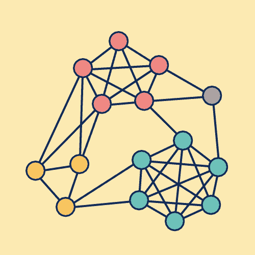
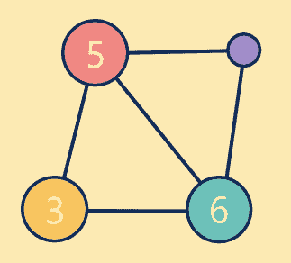

# 使用基于图的压缩方法进行实体解析的高效图存储

> 原文：[`towardsdatascience.com/efficient-graph-storage-for-entity-resolution-using-clique-based-compression/`](https://towardsdatascience.com/efficient-graph-storage-for-entity-resolution-using-clique-based-compression/)

在实体解析（ER）的世界中，一个核心挑战是管理和维护记录之间的复杂关系。在核心上，[Tilores](https://tilores.io) 将实体建模为图：每个节点代表一条记录，边代表那些记录之间的基于规则的匹配。这种方法为我们提供了灵活性、可追溯性和高度的准确性，但也伴随着显著的存储和计算挑战，尤其是在扩展规模上。本文解释了使用基于图的压缩方法高效存储高度连接的图的细节。

## 实体图模型

在 Tilores 中，一个有效的实体是一个图，其中每个记录至少通过一个匹配规则与其他记录相连。例如，如果记录`a`根据规则`R1`与记录`b`匹配，我们将其存储为边`"a:b:R1"`。如果另一个规则，比如`R2`，也连接了`a`和`b`，我们存储一个额外的边`"a:b:R2"`。这些边被保留为一个简单的列表，但也可以使用邻接表结构进行建模，以实现更高效的存储。

### 为什么保留所有边？

大多数实体解析系统或主数据管理系统不保留记录之间的关系，而只存储底层数据的表示和通常一个通用的匹配分数，这使得用户对实体是如何形成的感到不确定。更糟糕的是，用户没有纠正自动匹配系统所犯错误的方法。

因此，保留实体图中的所有边具有多重目的：

+   **可追溯性**：使用户能够理解为什么两条记录被分组到同一个实体中。

+   **分析**：可以从边元数据中提取诸如规则有效性和数据相似性之类的见解。

+   **数据删除与重新计算**：当删除记录或修改规则时，必须重新计算图。边信息对于理解实体是如何形成的以及如何更新至关重要。

## 扩展问题：二次增长

当讨论实体解析中的潜在扩展问题时，这通常指的是将每条记录与所有其他记录匹配的挑战。虽然这本身就是一个[挑战](https://tilores.io/content/The-Complexities-of-Entity-Resolution-Implementation)，但保留实体的所有边在存储方面会导致类似的问题。许多记录相互连接的实体会产生大量的边。在最坏的情况下，每条新记录都与所有现有记录相连。这种二次增长可以用以下公式表示：

`n * (n - 1) / 2`

对于小型实体，这并不是一个问题。例如，具有 3 条记录的实体可以有最多 3 条边。对于 n = 100，这增加到 4,950 条边，对于 n = 1,000，这会导致最多 499,500 条边。

这会产生巨大的存储和计算开销，尤其是在实体解析图通常表现出这种密集连接的情况下。

## 解决方案：基于图的压缩（CBGC）

图中的团是一组节点，其中每个节点都连接到该组中的其他每个节点。团也可以称为完全子图。可能的最小团包含一个节点和没有边。通过边连接的两个节点也形成一个团。例如，下面有三个节点形成一个三角形形状的团。


简单团：三角形

（图片由作者提供）

最大团是一个不能通过添加任何相邻节点来扩展的团，最大团是整个图中节点数量最多的团。为了本文的目的，我们将使用术语“团”仅指至少有三个节点的团。

之前显示的三角形可以用 Tilores 中的以下边来表示：

```py
[
  "a:b:R1",
  "a:c:R1",
  "b:c:R1"
]
```

因为三角形是一个团，我们也可以通过只存储这个团中的节点和相关的规则 ID 来表示这个图：

```py
{
  "R1": [
    ["a", "b", "c"]
  ]
}
```

让我们考虑以下稍微复杂一些的图：


包含 6 个节点的完整子图

（图片由作者提供）

根据其外观，我们可以轻松地发现所有节点都相互连接。因此，我们不必列出所有 15 条边[记住 `n*(n-1)/2`]，我们可以简单地以以下形式存储这个团：

```py
{
  "R1":[
    ["a", "b", "c", "d", "e", "f"]
  ]
}
```

然而，在现实世界的图中，并非所有记录都相互连接。考虑以下图：



有三个突出显示的团的复杂图

（图片由作者提供）

有三个较大的团被突出显示：黄色、红色和蓝色（如果你挑剔，则是青色）。还有一个单独的剩余节点。虽然那些可能是最大的团，但你可能会发现几十个其他的。例如，你注意到两个红色节点和两个黄色节点之间的 4 节点团吗？

坚持使用着色团，我们可以按以下方式存储它们（使用 y、r 和 b 分别代表黄色、红色和蓝色）：

```py
{
  "R1": [
    ["y1", "y2", "y3"],
    ["r1", "r2", "r3", "r4", "r5"],
    ["b1", "b2", "b3", "b4", "b5", "b6"]
  ]
}
```

此外，我们还可以存储剩余的 10 条边（p 代表紫色）：

```py
[
  "y1:r1:R1",
  "y1:r2:R1",
  "y2:r1:R1",
  "y2:r2:R1",
  "r4:p1:R1",
  "r5:p1:R1",
  "r5:b1:R1",
  "b2:p1:R1",
  "y3:b5:R1",
  "y3:b6:R1"
]
```

这意味着整个图现在可以用只有三个团和十个边来表示，而不是原来的 38 条边。



压缩图

（图片由作者提供）

这种基于团的图压缩（CBGC）是无损的（除非你需要边属性）。在一个现实的数据集中，我们发现了巨大的存储节省。对于一位客户，CBGC 将边存储减少了 99.7%，用几百个团和稀疏边替换了数十万条边。

## 不仅仅是存储性能的好处

CBGC 不仅仅是关于压缩。它还使操作更快，尤其是在处理记录和边删除时。

任何理智的实体解析引擎都应该在两个子图之间唯一的链接被删除时，例如，由于监管或合规原因，将实体分割成多个实体。通常使用连通分量算法来识别独立的、不连接的子图。简而言之，它是通过将所有通过边连接的节点分组到单独的子图中来工作的。因此，每个边至少需要检查一次。

然而，如果图以压缩图的形式存储，那么就没有必要遍历完全图的全部边。相反，只需为每个完全图添加有限数量的边就足够了，例如，在完全图的节点之间添加传递路径，将每个完全图视为一个预连接的子图。

## 权衡：完全图检测的复杂性

存在权衡：完全图检测在计算上代价高昂，尤其是在尝试找到最大完全图时，这是一个已知的 NP 难问题。

在实践中，通常足以简化这项工作负载。完全图检测的近似算法（例如贪婪启发式算法）对于大多数用途来说表现良好。此外，CBGC 是选择性重新计算的，通常在实体的边数超过阈值时。这种混合方法在压缩效率和可接受的处理成本之间取得了平衡。

## 超越完全图

争议地说，实体解析中最常见的模式是完全子图。然而，通过识别其他重复出现的模式，例如

+   stars: 将节点列表存储为节点列表，其中第一个条目表示中心节点

+   paths: 将路径存储为一个有序节点列表

+   communities: 类似于完全图进行存储并标记缺失的边

## 结束语

实体解析系统通常面临着管理密集、高度互联的图的挑战。天真地存储所有边很快就会变得不可持续。CBGC 通过利用数据的结构特性提供了一种有效的方式来建模实体。

它不仅减少了存储开销，还提高了系统性能，尤其是在数据删除和重新处理期间。虽然完全图检测有其计算成本，但谨慎的工程选择使我们能够在不牺牲可扩展性的情况下获得这些好处。
