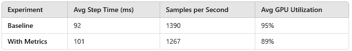
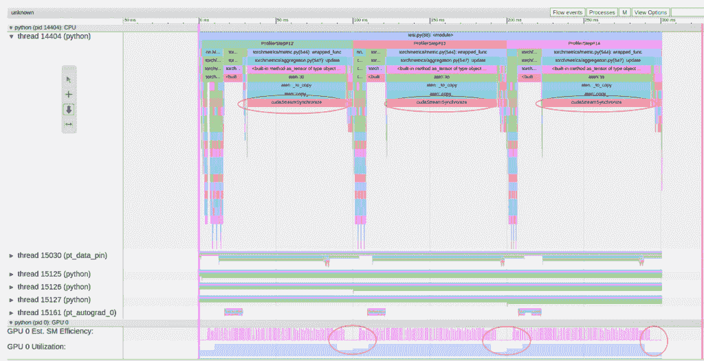
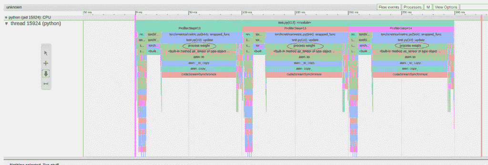
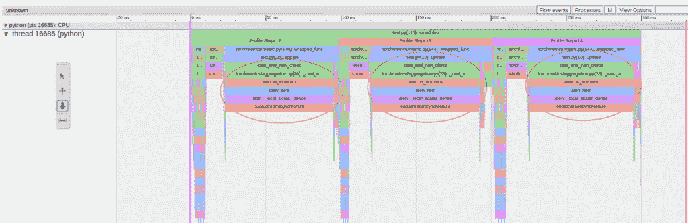
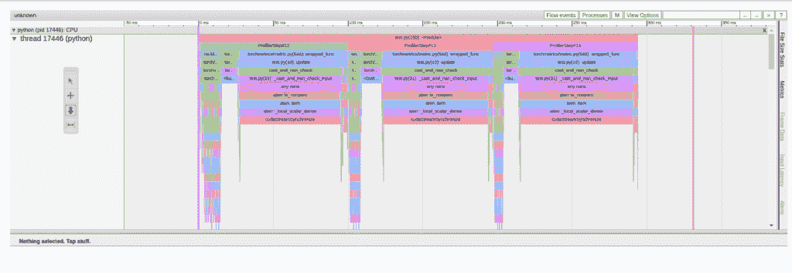
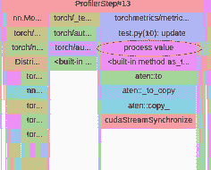

# PyTorch 中的高效指标收集：避免 TorchMetrics 的性能陷阱

> 原文：[`towardsdatascience.com/efficient-metric-collection-in-pytorch-avoiding-the-performance-pitfalls-of-torchmetrics/`](https://towardsdatascience.com/efficient-metric-collection-in-pytorch-avoiding-the-performance-pitfalls-of-torchmetrics/)

指标收集是每个机器学习项目的关键部分，使我们能够跟踪模型性能和监控训练进度。理想情况下，指标应该在不引入任何额外开销的情况下收集和计算。然而，就像训练循环的其他组件一样，低效的指标计算可能会引入不必要的开销，增加训练步骤时间并增加训练成本。

本文是我们关于 PyTorch 中性能分析和优化系列的第 7 篇。该系列旨在强调性能分析和优化在机器学习开发中的关键作用。每一篇都专注于训练管道的不同阶段，展示了分析和提高资源利用率和运行效率的实用工具和技术。

在本篇中，我们专注于指标收集。我们将演示指标收集的简单实现如何对运行时性能产生负面影响，并探讨其分析和优化的工具和技术。

为了实现我们的指标收集，我们将使用 [TorchMetrics](https://pypi.org/project/torchmetrics/)，这是一个流行的库，旨在简化并标准化 PyTorch 中的指标计算。我们的目标将是：

1.  **演示指标收集的运行时开销**。

1.  **使用 PyTorch Profiler** 确定由指标计算引入的性能瓶颈。

1.  **演示优化技术**以减少指标收集的开销。

为了便于讨论，我们将定义一个玩具 PyTorch 模型，并评估指标收集如何影响其运行时性能。我们的实验将在 NVIDIA A40 GPU 上进行，使用 [PyTorch 2.5.1 docker](https://hub.docker.com/layers/pytorch/pytorch/2.5.1-cuda12.4-cudnn9-devel/images/sha256-14611869895df612b7b07227d5925f30ec3cd6673bad58ce3d84ed107950e014) 镜像和 [TorchMetrics 1.6.1](https://pypi.org/project/torchmetrics/)。

重要的是要注意，指标收集的行为可能因硬件、运行时环境和模型架构而大不相同。本文中提供的代码片段仅用于演示目的。请勿将我们对任何工具或技术的提及解释为对其使用的认可。

### 玩具 Resnet 模型

在下面的代码块中，我们定义了一个简单的图像分类模型，其骨干网络为 [ResNet-18](https://pytorch.org/vision/main/models/generated/torchvision.models.resnet18)。

```py
import time
import torch
import torchvision

device = "cuda"

model = torchvision.models.resnet18().to(device)
criterion = torch.nn.CrossEntropyLoss()
optimizer = torch.optim.SGD(model.parameters())
```

我们定义了一个合成数据集，我们将用它来训练我们的玩具模型。

```py
from torch.utils.data import Dataset, DataLoader

# A dataset with random images and labels
class FakeDataset(Dataset):
    def __len__(self):
        return 100000000

    def __getitem__(self, index):
        rand_image = torch.randn([3, 224, 224], dtype=torch.float32)
        label = torch.tensor(data=index % 1000, dtype=torch.int64)
        return rand_image, label

train_set = FakeDataset()

batch_size = 128
num_workers = 12

train_loader = DataLoader(
    dataset=train_set,
    batch_size=batch_size,
    num_workers=num_workers,
    pin_memory=True
)
```

我们定义了来自 TorchMetrics 的一组标准指标，以及一个控制标志来启用或禁用指标计算。

```py
from torchmetrics import (
    MeanMetric,
    Accuracy,
    Precision,
    Recall,
    F1Score,
)

# toggle to enable/disable metric collection
capture_metrics = False

if capture_metrics:
        metrics = {
        "avg_loss": MeanMetric(),
        "accuracy": Accuracy(task="multiclass", num_classes=1000),
        "precision": Precision(task="multiclass", num_classes=1000),
        "recall": Recall(task="multiclass", num_classes=1000),
        "f1_score": F1Score(task="multiclass", num_classes=1000),
    }

    # Move all metrics to the device
    metrics = {name: metric.to(device) for name, metric in metrics.items()}
```

接下来，我们定义了一个 [PyTorch Profiler](https://pytorch.org/tutorials/recipes/recipes/profiler_recipe.html) 实例，以及一个控制标志，允许我们启用或禁用分析。有关使用 PyTorch Profiler 的详细教程，请参阅本系列的[第一篇文章](https://medium.com/towards-data-science/pytorch-model-performance-analysis-and-optimization-10c3c5822869)。

```py
from torch import profiler

# toggle to enable/disable profiling
enable_profiler = True

if enable_profiler:
    prof = profiler.profile(
        schedule=profiler.schedule(wait=10, warmup=2, active=3, repeat=1),
        on_trace_ready=profiler.tensorboard_trace_handler("./logs/"),
        profile_memory=True,
        with_stack=True
    )
    prof.start()
```

最后，我们定义了一个标准的训练步骤：

```py
model.train()

t0 = time.perf_counter()
total_time = 0
count = 0

for idx, (data, target) in enumerate(train_loader):
    data = data.to(device, non_blocking=True)
    target = target.to(device, non_blocking=True)
    optimizer.zero_grad()
    output = model(data)
    loss = criterion(output, target)
    loss.backward()
    optimizer.step()

    if capture_metrics:
        # update metrics
        metrics["avg_loss"].update(loss)
        for name, metric in metrics.items():
            if name != "avg_loss":
                metric.update(output, target)

        if (idx + 1) % 100 == 0:
            # compute metrics
            metric_results = {
                name: metric.compute().item() 
                    for name, metric in metrics.items()
            }
            # print metrics
            print(f"Step {idx + 1}: {metric_results}")
            # reset metrics
            for metric in metrics.values():
                metric.reset()

    elif (idx + 1) % 100 == 0:
        # print last loss value
        print(f"Step {idx + 1}: Loss = {loss.item():.4f}")

    batch_time = time.perf_counter() - t0
    t0 = time.perf_counter()
    if idx > 10:  # skip first steps
        total_time += batch_time
        count += 1

    if enable_profiler:
        prof.step()

    if idx > 200:
        break

if enable_profiler:
    prof.stop()

avg_time = total_time/count
print(f'Average step time: {avg_time}')
print(f'Throughput: {batch_size/avg_time:.2f} images/sec')
```

#### 指标收集开销

为了测量指标收集对训练步骤时间的影响，我们在有和无指标计算的情况下分别运行了我们的训练脚本。结果总结在以下表格中。



简单指标收集的开销（作者）

我们简单的指标收集导致了运行时性能下降了近 10%！！虽然指标收集对于机器学习开发至关重要，但它通常涉及相对简单的数学运算，几乎不值得产生如此大的开销。发生了什么？！！

## 使用 PyTorch Profiler 识别性能问题

为了更好地理解性能下降的原因，我们重新运行了训练脚本，并开启了 PyTorch Profiler。生成的跟踪结果如下所示：



指标收集实验跟踪（作者）

跟踪结果显示，与 GPU 利用率明显下降同时发生的“cudaStreamSynchronize”操作是反复出现的。这类“CPU-GPU 同步”事件在我们的系列文章的第二部分中进行了详细讨论。在典型的训练步骤中，CPU 和 GPU 并行工作：CPU 管理诸如将数据传输到 GPU 和内核加载等任务，而 GPU 在输入数据上执行模型并更新其权重。理想情况下，我们希望最小化 CPU 和 GPU 之间的同步点以最大化性能。然而，在这里我们可以看到，指标收集通过执行 CPU 到 GPU 的数据复制触发了同步事件。这需要 CPU 暂停其处理，直到 GPU 赶上进度，反过来又导致 GPU 等待 CPU 继续加载后续的内核操作。结果是，这些同步点导致 CPU 和 GPU 的效率低下。我们的指标收集实现为每个训练步骤增加了八个这样的同步事件。

仔细检查追踪结果，我们发现同步事件来自[MeanMetric](https://github.com/Lightning-AI/torchmetrics/blob/v1.6.1/src/torchmetrics/aggregation.py#L494)TorchMetric 的[update](https://github.com/Lightning-AI/torchmetrics/blob/v1.6.1/src/torchmetrics/aggregation.py#L547)调用。对于经验丰富的性能分析专家，这可能足以识别根本原因，但我们将更进一步，使用[torch.profiler.record_function](https://pytorch.org/tutorials/beginner/profiler.html#performance-debugging-using-profiler)实用工具来识别确切的错误代码行。

### 使用[record_function](https://pytorch.org/tutorials/beginner/profiler.html#performance-debugging-using-profiler)进行性能分析

为了精确定位同步事件的来源，我们扩展了[MeanMetric](https://github.com/Lightning-AI/torchmetrics/blob/v1.6.1/src/torchmetrics/aggregation.py#L494)类，并使用[record_function](https://pytorch.org/tutorials/beginner/profiler.html#performance-debugging-using-profiler)上下文块覆盖了[update](https://github.com/Lightning-AI/torchmetrics/blob/v1.6.1/src/torchmetrics/aggregation.py#L547)方法。这种方法使我们能够对方法中的单个操作进行性能分析，并识别性能瓶颈。

```py
class ProfileMeanMetric(MeanMetric):
    def update(self, value, weight = 1.0):
        # broadcast weight to value shape
        with profiler.record_function("process value"):
            if not isinstance(value, torch.Tensor):
                value = torch.as_tensor(value, dtype=self.dtype,
                                        device=self.device)
        with profiler.record_function("process weight"):
            if weight is not None and not isinstance(weight, torch.Tensor):
                weight = torch.as_tensor(weight, dtype=self.dtype,
                                         device=self.device)
        with profiler.record_function("broadcast weight"):
            weight = torch.broadcast_to(weight, value.shape)
        with profiler.record_function("cast_and_nan_check"):
            value, weight = self._cast_and_nan_check_input(value, weight)

        if value.numel() == 0:
            return

        with profiler.record_function("update value"):
            self.mean_value += (value * weight).sum()
        with profiler.record_function("update weight"):
            self.weight += weight.sum()
```

我们随后更新了我们的 avg_loss 指标，使用新创建的 ProfileMeanMetric，并重新运行了训练脚本。



使用[record_function](https://pytorch.org/tutorials/beginner/profiler.html#performance-debugging-using-profiler)进行指标收集的追踪（作者）

更新的追踪结果显示，同步事件起源于以下行：

```py
weight = torch.as_tensor(weight, dtype=self.dtype, device=self.device)
```

此操作将默认标量值`weight=1.0`转换为 PyTorch 张量，并将其放置在 GPU 上。同步事件发生是因为此操作触发了 CPU 到 GPU 的数据复制，这需要 CPU 等待 GPU 处理复制的值。

### 优化 1：指定权重值

现在我们已经找到了问题的来源，我们可以通过在*update*调用中指定*weight*值来轻松克服它。这防止了运行时将默认标量`weight=1.0`转换为 GPU 上的张量，从而避免了同步事件：

```py
# update metrics
 if capture_metric:
     metrics["avg_loss"].update(loss, weight=torch.ones_like(loss))
```

应用此更改后重新运行脚本，我们发现我们已经成功地消除了初始的同步事件……然而，我们又发现了新的一个，这次来自[_cast_and_nan_check_input](https://github.com/Lightning-AI/torchmetrics/blob/v1.6.1/src/torchmetrics/aggregation.py#L76)函数：



优化 1 后的指标收集追踪（作者）

### 使用[record_function](https://pytorch.org/tutorials/beginner/profiler.html#performance-debugging-using-profiler)进行性能分析——第二部分

为了探索我们新的同步事件，我们扩展了我们的自定义指标，添加了额外的性能分析探针，并重新运行了脚本。

```py
class ProfileMeanMetric(MeanMetric):
    def update(self, value, weight = 1.0):
        # broadcast weight to value shape
        with profiler.record_function("process value"):
            if not isinstance(value, torch.Tensor):
                value = torch.as_tensor(value, dtype=self.dtype,
                                        device=self.device)
        with profiler.record_function("process weight"):
            if weight is not None and not isinstance(weight, torch.Tensor):
                weight = torch.as_tensor(weight, dtype=self.dtype,
                                         device=self.device)
        with profiler.record_function("broadcast weight"):
            weight = torch.broadcast_to(weight, value.shape)
        with profiler.record_function("cast_and_nan_check"):
            value, weight = self._cast_and_nan_check_input(value, weight)

        if value.numel() == 0:
            return

        with profiler.record_function("update value"):
            self.mean_value += (value * weight).sum()
        with profiler.record_function("update weight"):
            self.weight += weight.sum()

    def _cast_and_nan_check_input(self, x, weight = None):
        """Convert input ``x`` to a tensor and check for Nans."""
        with profiler.record_function("process x"):
            if not isinstance(x, torch.Tensor):
                x = torch.as_tensor(x, dtype=self.dtype,
                                    device=self.device)
        with profiler.record_function("process weight"):
            if weight is not None and not isinstance(weight, torch.Tensor):
                weight = torch.as_tensor(weight, dtype=self.dtype,
                                         device=self.device)
            nans = torch.isnan(x)
            if weight is not None:
                nans_weight = torch.isnan(weight)
            else:
                nans_weight = torch.zeros_like(nans).bool()
                weight = torch.ones_like(x)

        with profiler.record_function("any nans"):
            anynans = nans.any() or nans_weight.any()

        with profiler.record_function("process nans"):
            if anynans:
                if self.nan_strategy == "error":
                    raise RuntimeError("Encountered `nan` values in tensor")
                if self.nan_strategy in ("ignore", "warn"):
                    if self.nan_strategy == "warn":
                        print("Encountered `nan` values in tensor."
                              " Will be removed.")
                    x = x[~(nans | nans_weight)]
                    weight = weight[~(nans | nans_weight)]
                else:
                    if not isinstance(self.nan_strategy, float):
                        raise ValueError(f"`nan_strategy` shall be float"
                                         f" but you pass {self.nan_strategy}")
                    x[nans | nans_weight] = self.nan_strategy
                    weight[nans | nans_weight] = self.nan_strategy

        with profiler.record_function("return value"):
            retval = x.to(self.dtype), weight.to(self.dtype)
        return retval
```

最终的追踪结果如下：



使用 [record_function](https://pytorch.org/tutorials/beginner/profiler.html#performance-debugging-using-profiler) 的指标收集跟踪——第二部分（作者）

跟踪点直接指向有问题的代码行：

```py
anynans = nans.any() or nans_weight.any()
```

这个操作检查输入张量中的 `NaN` 值，但它引入了一个昂贵的 CPU-GPU 同步事件，因为该操作涉及从 GPU 到 CPU 的数据复制。

在仔细检查 TorchMetric 的 [BaseAggregator](https://github.com/Lightning-AI/torchmetrics/blob/v1.6.1/src/torchmetrics/aggregation.py#L31) 类后，我们发现有几个选项可以处理 NAN 值更新，所有这些选项都会通过有问题的代码行。然而，对于我们的用例——计算平均损失指标——这个检查是不必要的，也不足以证明运行时性能的惩罚。

### 优化 2：禁用 NAN 值检查

为了消除开销，我们提出通过覆盖 `_cast_and_nan_check_input` 函数来禁用 `NaN` 值检查。而不是静态覆盖，我们实现了一个灵活的动态解决方案，可以应用于 [BaseAggregator](https://github.com/Lightning-AI/torchmetrics/blob/v1.6.1/src/torchmetrics/aggregation.py#L31) 类的任何后代。

```py
from torchmetrics.aggregation import BaseAggregator

def suppress_nan_check(MetricClass):
    assert issubclass(MetricClass, BaseAggregator), MetricClass
    class DisableNanCheck(MetricClass):
        def _cast_and_nan_check_input(self, x, weight=None):
            if not isinstance(x, torch.Tensor):
                x = torch.as_tensor(x, dtype=self.dtype, 
                                    device=self.device)
            if weight is not None and not isinstance(weight, torch.Tensor):
                weight = torch.as_tensor(weight, dtype=self.dtype,
                                         device=self.device)
            if weight is None:
                weight = torch.ones_like(x)
            return x.to(self.dtype), weight.to(self.dtype)
    return DisableNanCheck

NoNanMeanMetric = suppress_nan_check(MeanMetric)

metrics["avg_loss"] = NoNanMeanMetric().to(device)
```

### 优化后结果：成功

在实施这两个优化——指定权重值和禁用 `NaN` 检查后，我们发现步骤时间性能和 GPU 利用率与我们的基线实验相匹配。此外，生成的 PyTorch Profiler 跟踪显示，与指标收集相关联的所有添加的“cudaStreamSynchronize”事件都已消除。通过一些小的改动，我们没有改变指标收集的行为，却将训练成本降低了约 10%。

在下一节中，我们将探讨额外的指标收集优化。

## 示例 2：优化指标设备放置

在前面的章节中，指标值位于 GPU 上，因此存储和计算指标在 GPU 上是合理的。然而，在我们要聚合的值位于 CPU 上的场景中，可能更倾向于在 CPU 上存储指标，以避免不必要的设备传输。

在下面的代码块中，我们修改了我们的脚本，使用 [MeanMetric](https://github.com/Lightning-AI/torchmetrics/blob/v1.6.1/src/torchmetrics/aggregation.py#L494) 在 CPU 上计算平均步骤时间。这个更改对我们的训练步骤的运行时性能没有影响：

```py
avg_time = NoNanMeanMetric()
t0 = time.perf_counter()

for idx, (data, target) in enumerate(train_loader):
    # move data to device
    data = data.to(device, non_blocking=True)
    target = target.to(device, non_blocking=True)

    optimizer.zero_grad()
    output = model(data)
    loss = criterion(output, target)
    loss.backward()
    optimizer.step()

    if capture_metrics:
        metrics["avg_loss"].update(loss)
        for name, metric in metrics.items():
            if name != "avg_loss":
                metric.update(output, target)

        if (idx + 1) % 100 == 0:
            # compute metrics
            metric_results = {
                name: metric.compute().item()
                    for name, metric in metrics.items()
            }
            # print metrics
            print(f"Step {idx + 1}: {metric_results}")
            # reset metrics
            for metric in metrics.values():
                metric.reset()

    elif (idx + 1) % 100 == 0:
        # print last loss value
        print(f"Step {idx + 1}: Loss = {loss.item():.4f}")

    batch_time = time.perf_counter() - t0
    t0 = time.perf_counter()
    if idx > 10:  # skip first steps
        avg_time.update(batch_time)

    if enable_profiler:
        prof.step()

    if idx > 200:
        break

if enable_profiler:
    prof.stop()

avg_time = avg_time.compute().item()
print(f'Average step time: {avg_time}')
print(f'Throughput: {batch_size/avg_time:.2f} images/sec')
```

当我们尝试扩展我们的脚本以支持分布式训练时，问题出现了。为了展示这个问题，我们修改了我们的模型定义，以使用 [DistributedDataParallel (DDP)](https://pytorch.org/tutorials/intermediate/ddp_tutorial.html)：

```py
# toggle to enable/disable ddp
use_ddp = True

if use_ddp:
    import os
    import torch.distributed as dist
    from torch.nn.parallel import DistributedDataParallel as DDP
    os.environ["MASTER_ADDR"] = "127.0.0.1"
    os.environ["MASTER_PORT"] = "29500"
    dist.init_process_group("nccl", rank=0, world_size=1)
    torch.cuda.set_device(0)
    model = DDP(torchvision.models.resnet18().to(device))
else:
    model = torchvision.models.resnet18().to(device)

# insert training loop

# append to end of the script:
if use_ddp:
    # destroy the process group
    dist.destroy_process_group()
```

DDP 修改导致以下错误：

```py
RuntimeError: No backend type associated with device type cpu
```

默认情况下，分布式训练中的度量被编程为跨所有使用的设备进行同步。然而，DDP 使用的同步后端不支持存储在 CPU 上的度量。

解决这个问题的一种方法是不启用跨设备度量同步：

```py
avg_time = NoNanMeanMetric(sync_on_compute=False)
```

在我们测量平均时间的情况下，这个解决方案是可以接受的。然而，在某些情况下，度量同步是必不可少的，我们可能别无选择，只能将度量移动到 GPU 上：

```py
avg_time = NoNanMeanMetric().to(device)
```

不幸的是，这种情况导致了来自[update](https://github.com/Lightning-AI/torchmetrics/blob/v1.6.1/src/torchmetrics/aggregation.py#L547)函数的新 CPU-GPU 同步事件。



avg_time 度量收集的跟踪（作者）

这个同步事件几乎不会让人感到惊讶——毕竟，我们正在用位于 CPU 上的值更新 GPU 度量，这应该需要内存复制。然而，在标量度量的情况下，这种数据传输可以通过简单的优化完全避免。

### 优化 3：使用 Tensor 而不是标量执行度量更新

解决方案很简单：在调用`update`之前，我们不是用浮点值更新度量，而是将其转换为 Tensor。

```py
batch_time = torch.as_tensor(batch_time)
avg_time.update(batch_time, torch.ones_like(batch_time))
```

这个小小的改动绕过了有问题的代码行，消除了同步事件，并将步骤时间恢复到基线性能。

初看这个结果可能会觉得惊讶：我们本以为用 CPU Tensor 更新 GPU 度量仍然需要内存复制。然而，PyTorch 通过使用一个执行加法而不进行显式数据传输的专用内核来优化标量 Tensor 的操作。这避免了否则会发生的高昂的同步事件。

## 摘要

在这篇文章中，我们探讨了简单的方法如何引入 CPU-GPU 同步事件，并显著降低 PyTorch 训练性能。使用 PyTorch Profiler，我们确定了导致这些同步事件的代码行，并应用了有针对性的优化来消除它们：

+   在调用`MeanMetric.update`函数时，明确指定一个权重 Tensor，而不是依赖默认值。

+   在基`Aggregator`类中禁用 NaN 检查，或用更有效的替代方案替换它们。

+   仔细管理每个度量的设备放置，以最小化不必要的传输。

+   当不需要时，禁用跨设备度量同步。

+   当度量位于 GPU 上时，在将它们传递给`update`函数之前，将浮点标量转换为 Tensor，以避免隐式同步。

我们在[TorchMetrics github](https://github.com/Lightning-AI/torchmetrics/tree/master)页面上创建了一个专门的[pull request](https://github.com/Lightning-AI/torchmetrics/pull/2943)，涵盖了一些本文中讨论的优化。请随时贡献您自己的改进和优化！
