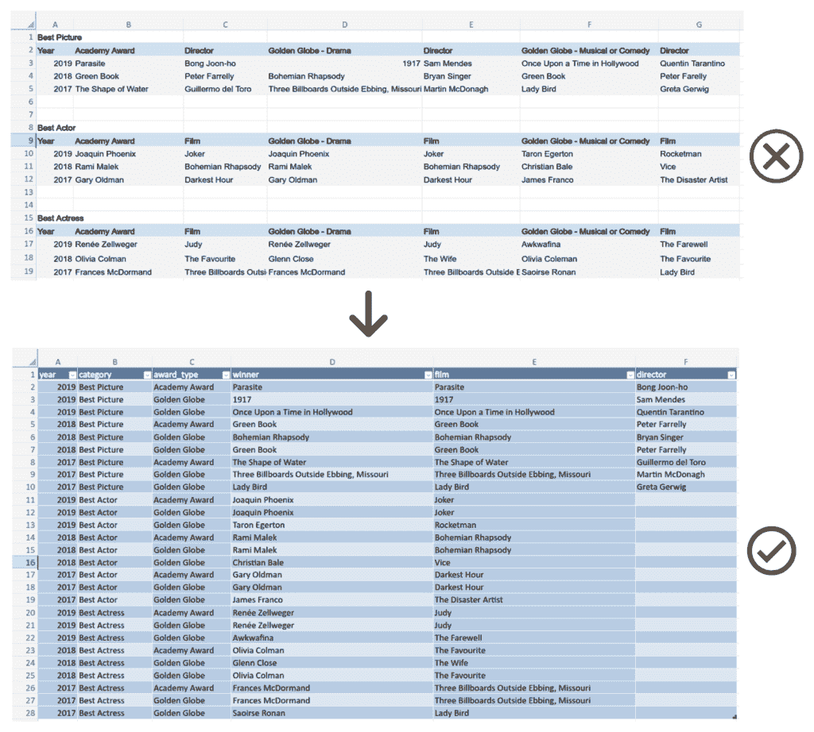
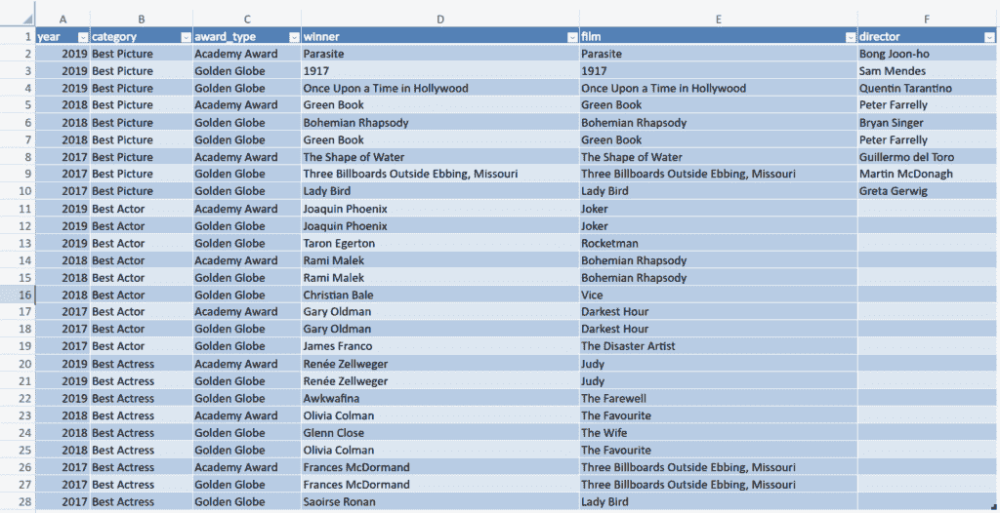
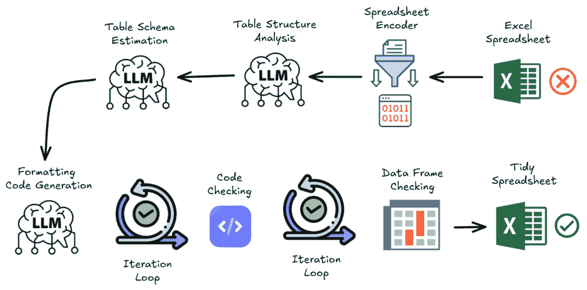

# 使用 LLM 轻松实现电子表格归一化

> 原文：[`towardsdatascience.com/effortless-spreadsheet-normalisation-with-llm/`](https://towardsdatascience.com/effortless-spreadsheet-normalisation-with-llm/)

本文是关于自动化任何表格数据集数据清洗的一系列文章之一。

您可以使用[CleanMyExcel.io](https://cleanmyexcel.io/)服务在自己的数据集上测试本文中描述的功能，该服务免费且无需注册。

## 从为什么开始

让我们考虑这个 Excel 电子表格，其中包含关于电影奖项的信息。它来自书籍[*《有效数据科学的数据清洗》*](https://github.com/PacktPublishing/Cleaning-Data-for-Effective-Data-Science)，并可在[这里](https://www.gnosis.cx/cleaning/Film_Awards.xlsx)找到。

这是一个典型且常见的电子表格，每个人可能在日常任务中都会拥有并处理它。但问题出在哪里？

为了回答这个问题，让我们首先回顾使用数据的目标：为了得出有助于指导我们个人或商业生活的决策的见解。这个过程至少需要两个关键要素：

+   可靠的数据：没有问题、不一致性、重复、缺失值等的清洁数据。

+   整理数据：一个良好归一化的数据框，便于处理和操作。

第二点是任何分析的基础，包括处理数据质量。

返回我们的例子，假设我们想要执行以下操作：

1. 对于参与多个奖项的每部电影，列出其相关的奖项和年份。

2. 对于每个获得多个奖项的演员/女演员，列出他们相关的电影和奖项。

3. 检查所有演员/女演员的名字是否正确且标准化良好。

自然地，这个示例数据集足够小，可以通过结构化（就像编码一样快速）通过肉眼或手工得出这些见解。但现在想象一下，数据集包含整个奖项历史；如果没有任何自动化，这将是一个耗时、痛苦且容易出错的过程。

通过机器直接读取这个电子表格并理解其结构是困难的，因为它没有遵循良好的数据排列实践。这就是为什么整理数据如此重要的原因。通过确保数据以机器友好的方式结构化，我们可以简化解析、自动化质量检查，并增强业务分析——而无需更改数据集的实际内容。

本数据重塑的示例：

现在，任何人都可以使用低/无代码工具或基于代码的查询（SQL、Python 等）轻松地与这个数据集交互并得出见解。

主要挑战是如何将一个光鲜亮丽、人眼愉悦的电子表格转换成机器可读的整洁版本。

# 接下来是什么？整洁数据指南

什么是整洁数据？一个形状良好的数据框？

“整洁数据”这个术语在 Hadley Wickham 的一篇著名文章《Tidy Data》中有所描述，该文章于 2014 年发表在《统计软件杂志》上。以下是理解其基本概念所需的关键引言。

**数据整理**

“构建数据集以方便操作、可视化和建模。”

“整洁数据集提供了一种标准化的方式，将数据集的结构（其物理布局）与其语义（其意义）联系起来。”

**数据结构**

“大多数统计数据集是由行和列组成的矩形表格。列几乎总是有标签的，行有时也有标签。”

**数据语义**

“数据集是一组值，通常是数字（如果是定量数据）或字符串（如果是定性数据）。值以两种方式组织。每个值都属于一个变量和一个观测值。变量包含所有测量相同潜在属性（如身高、温度或持续时间）的值。观测值包含在相同单位（例如，一个人、一天或一场比赛）上测量的所有属性值。”

“在给定分析中，可能会有多个观测级别。例如，在一个新过敏药物试验中，我们可能会有三种类型的观测：

+   从每个人收集的 *人口统计数据*（年龄、性别、种族），

+   *医学数据* 每天从每个人收集（打喷嚏次数、眼睛发红），以及

+   *气象数据* 每天收集（温度、花粉计数）。”

**整洁数据**

“整洁数据是一种将数据集的意义映射到其结构的标准方式。一个数据集被认为是杂乱无章的还是整洁的，取决于其行、列和表格如何对应于观测值、变量和类型。在整洁数据中：

+   每个变量构成一列。

+   每个观测值构成一行。

+   每种观测单位类型构成一个表。”

### 杂乱数据集的常见问题

**列标题可能是值而不是变量名。**

+   **杂乱示例:** 列标题是年份（2019、2020、2021）而不是“Year”列。

+   **整洁版本:** 包含“Year”列的表格，每行代表给定年份的观测值。

**多个变量可能存储在一个列中。**

+   **杂乱示例:** 一个名为“Age_Gender”的列，包含如 28_Female 这样的值

+   **整洁版本:** 分别为“Age”和“Gender”设置单独的列

**变量可能存储在行和列中。**

+   **杂乱示例:** 一个跟踪学生考试成绩的数据集，其中科目（数学、科学、英语）既作为列标题又重复在行中，而不是使用单一的“Subject”列。

+   **整洁版本：** 一个包含“学生 ID”、“科目”和“分数”列的表格，其中每一行代表一个学生对一个科目的分数。

**可能存储在同一个表中的多种类型的观测单位。**

+   **杂乱示例：** 一个包含客户信息和商店库存的同一张表的销售数据集。

+   **整洁版本：** 为“客户”和“库存”分别创建单独的表。

**单个观测单位可能存储在多个表中。**

+   **杂乱示例：** 一个患者的医疗记录分散在多个表（诊断表、药物表）中，没有共同的病人 ID 将它们链接起来。

+   **整洁版本：** 使用唯一的“病人 ID”的单个表或正确链接的表。

现在我们已经更好地理解了整洁数据是什么，让我们看看如何将一个杂乱的数据集转换成一个整洁的数据集。

## 思考如何

*“整洁的数据集都是相似的，但每个杂乱的数据集都有其独特的方式。” 哈代·维克汉姆（参见列夫·托尔斯泰）*

虽然这些指南在理论上听起来很清晰，但在实践中，它们很难轻易地推广到任何类型的数据集。换句话说，从杂乱的数据开始，没有简单或确定性的过程或算法可以重塑数据。这主要是由每个数据集的独特性所解释的。确实，在一般情况下精确定义变量和观测值是令人惊讶的困难，然后在不丢失内容的情况下自动转换数据更是如此。这就是为什么，尽管在过去十年中数据处理取得了巨大的进步，数据清洗和格式化仍然大部分是“手动”完成的。

因此，当复杂的、难以维护的基于规则的系统不适用时（即通过提前描述决策来精确处理所有上下文），机器学习模型可能带来一些好处。这赋予了系统更多的自由度，通过推广它在训练期间学到的知识来适应任何数据。许多大型语言模型（LLMs）已经接触到了大量的数据处理示例，使它们能够分析输入数据并执行诸如电子表格结构分析、表模式估计和代码生成等任务。

然后，让我们描述一个由代码和基于 LLM 的模块以及业务逻辑组成的流程，以重塑任何电子表格。

**电子表格编码器**

此模块旨在将电子表格数据中所需的主要信息序列化为文本。仅保留对表格布局有贡献的必要单元格子集，删除非必要或过度重复的格式化信息。通过仅保留必要信息，此步骤最小化了标记的使用，降低了成本，并提高了模型性能。当前版本是一个受论文[SpreadsheetLLM：为大型语言模型编码电子表格](https://arxiv.org/abs/2407.09025)启发的确定性算法，该算法依赖于启发式方法。更多关于它的细节将是下一篇文章的主题。

**表结构分析**

在继续前进之前，让 LLM 提取电子表格结构是构建下一步行动的关键步骤。以下是一些处理的问题的例子：

+   电子表格中有多少个表格，它们的位置（区域）在哪里？

+   每个表格的边界是什么（例如，空行/列，特定的标记）？

+   哪些行/列作为标题，是否有任何表格具有多级标题？

+   是否需要过滤或单独处理元数据部分、聚合统计信息或注释？

+   是否有合并的单元格，如果有，应该如何处理？

**表模式估计**

一旦完成电子表格结构的分析，现在就到了开始考虑理想的目标表模式的时候了。这涉及到让 LLM 通过以下方式迭代处理：

+   识别所有潜在的列（多行标题、元数据等）

+   根据列名和数据语义比较列以确定领域相似性

+   将相关列分组

该模块输出一个最终的模式，其中包含每个保留列的名称和简短描述。

**生成代码以格式化电子表格**

考虑到先前的结构分析和表模式，这个最后的基于 LLM 的模块应该起草代码，将电子表格转换为符合表模式的适当数据框。此外，不得省略任何有用的内容（例如，聚合或计算值可能仍然可以从其他变量中导出）。

由于从头开始生成在第一次迭代中工作良好的代码具有挑战性，因此添加了两个内部迭代过程，以便在需要时修订代码：

+   **代码检查**：每当代码无法编译或执行时，将提供跟踪错误以供模型更新其代码。

+   **数据框验证**：检查创建的数据框的元数据（例如列名、第一行和最后一行以及每个列的统计数据），以验证表格是否符合预期。否则，将相应地修订代码。

**将数据框转换为 Excel 文件**

最后，如果所有数据都适当地放入单个表格中，则从这个数据框创建一个工作表以遵守表格格式。最终返回的资产是一个 Excel 文件，其活动工作表包含整洁的电子表格数据。

Et voilà！充分利用您整理好的新数据集，天空才是极限。

您可以自由地使用 [CleanMyExcel.io](https://cleanmyexcel.io/) 服务测试您的数据集，该服务免费且无需注册。

**关于工作流程的最终说明**

为什么提出工作流程而不是 [代理](https://www.anthropic.com/research/building-effective-agents) 来实现这个目的？

在撰写本文时，我们认为基于 LLMs 的精确子任务工作流程比更自主的代理更稳健、更稳定、可迭代且易于维护。代理可能提供优势：在执行任务时拥有更多的自由和灵活性。然而，在实践中它们可能仍然难以处理；例如，如果目标不够明确，它们可能会迅速偏离。我相信这是我们的情况，但这并不意味着这个模型在未来不会以与 [SWE-agent](https://arxiv.org/abs/2405.15793) 编码执行相同的方式适用。

## 系列文章的下一篇文章

在即将到来的文章中，我们计划探讨相关主题，包括：

+   对之前提到的电子表格编码器的详细描述。

+   数据有效性：确保每一列都符合预期。

+   数据唯一性：防止数据集中出现重复实体。

+   数据完整性：有效处理缺失值。

+   评估数据重塑、有效性以及其他数据质量的关键方面。

请保持关注！

感谢 Marc Hobballah 审阅本文并提供反馈。

*所有图像，除非另有说明，均为作者所有。*
