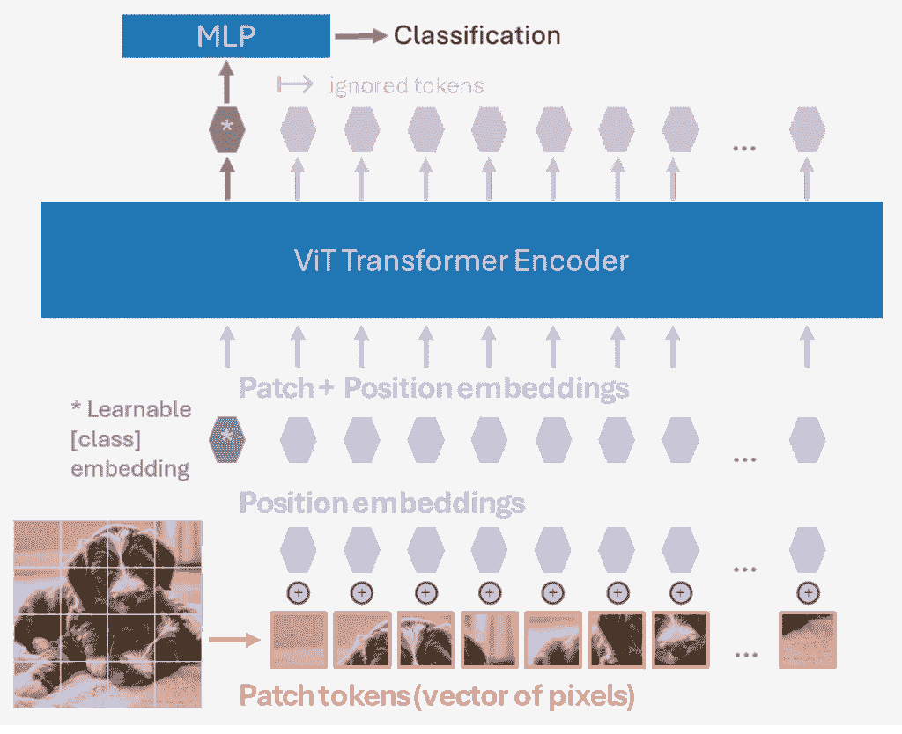
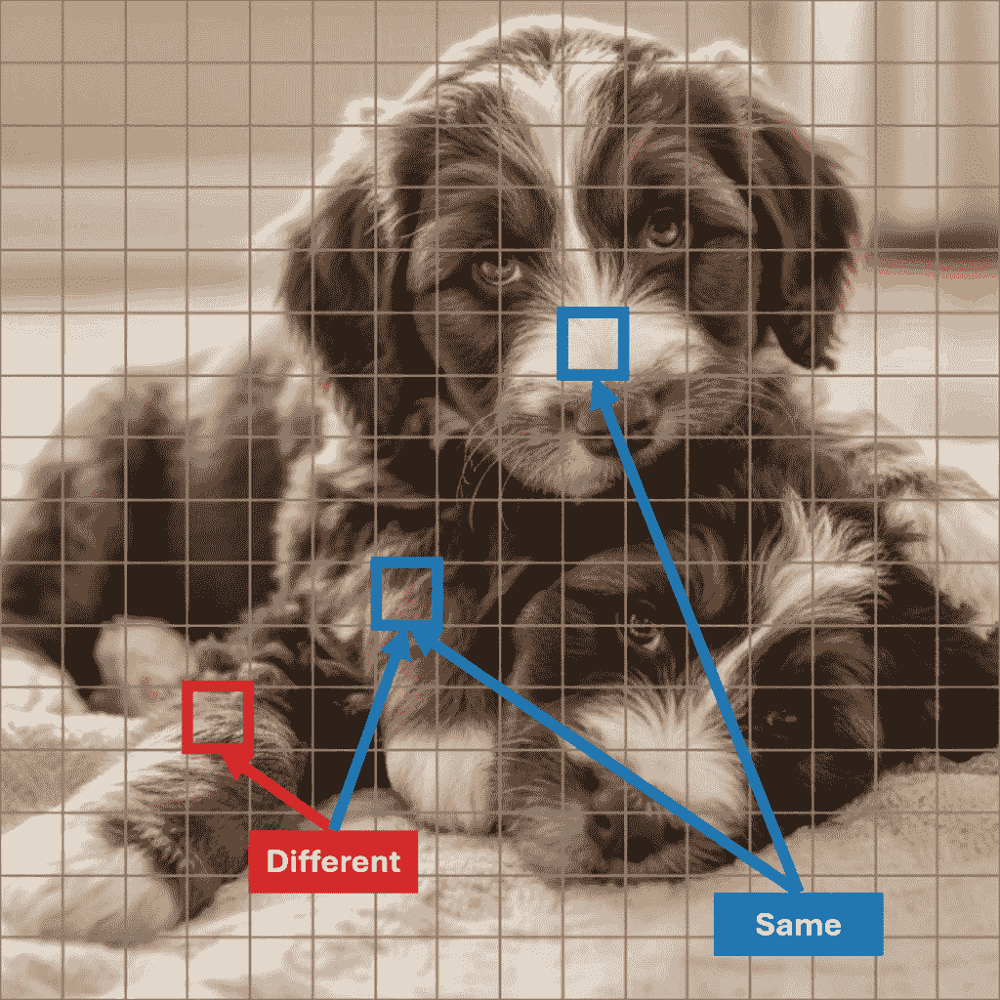
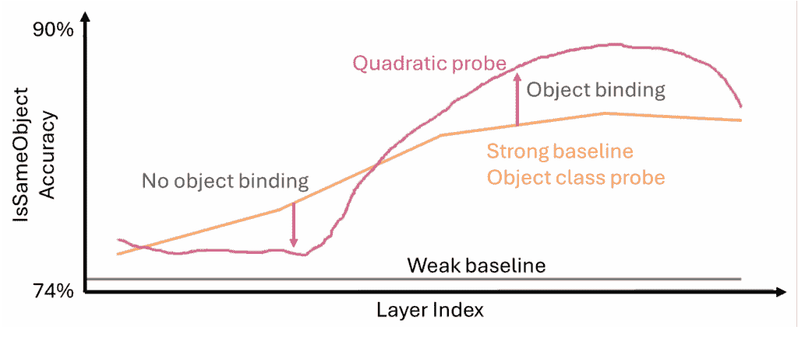

# 标签让 AI 失明？自监督解决了古老的绑定问题

> 原文：[`towardsdatascience.com/emergent-object-binding-from-self-supervised-not-supervised-learning/`](https://towardsdatascience.com/emergent-object-binding-from-self-supervised-not-supervised-learning/)

<mdspan datatext="el1764652546313" class="mdspan-comment">一篇来自 Konrad Körding 实验室的新 NeurIPS 2025 论文[1]，“在大规模预训练视觉 Transformer 中，对象绑定是否自然出现？”为视觉神经科学中的一个基础问题提供了见解：将视觉元素和纹理绑定在一起作为对象需要什么？本文的目标是为您介绍这个问题，回顾这篇 NeurIPS 论文，并希望让您对人工和生物神经网络都有所了解。我还会回顾一些深度学习自监督学习方法和视觉 Transformer，同时突出当前深度学习系统与我们的大脑之间的差异。

## 1. 引言

当我们观察一个场景时，我们的视觉系统不仅向我们的意识提供对象和组成的高级总结；我们还能够有意识地访问整个视觉层次。

我们可以在更高层次区域，如颞下叶（IT）皮层和梭状面皮层（FFA）中，“抓住”一个对象，并访问所有在底层区域（如 V1 和 V2）中编码的轮廓和纹理。

如果我们缺乏访问整个视觉层次的能力，我们要么无法有意识地访问视觉系统的底层细节，要么在尝试传达所有这些信息的更高层次区域中，维度会爆炸。这将需要我们的大脑显著增大并消耗更多能量。

这种在视觉系统中分配视觉场景信息的方式意味着场景的组成部分或对象需要以某种方式绑定在一起。多年来，关于如何做到这一点，主要有两个主要派别：一方认为对象绑定使用神经振荡（或更普遍地，同步性）将对象部分绑定在一起，而另一方认为神经放电的增加足以绑定所关注的对象。我的学术背景使我坚定地站在后一派，在 Rüdiger von der Heydt、Ernst Niebur 和 Pieter Roelfsema 的指导下。

1986 年，冯·德·马尔堡和施奈德提出了神经振荡绑定假说（参见[2]以获取综述），他们提出每个对象都有自己的时间标签。

在这个框架中，当你看一张有两只小狗的图片时，整个视觉系统中编码第一只小狗的所有神经元会在振荡的一个阶段放电，而编码另一只小狗的神经元会在不同的阶段放电。这种绑定类型的证据在麻醉猫中找到，然而，麻醉会增加大脑中的振荡。

在放电率框架中，编码注意到的对象的神经元以更高的频率放电，而编码未注意到的对象的神经元则以更高的频率放电，编码注意到的或未注意到的对象的神经元也会以更高的频率放电，而编码背景的神经元则不会。这一点在清醒的动物中已被反复和稳健地证明 [3]。

最初，有更多实验支持神经同步或振荡假设，但随时间推移，有更多证据支持增加的放电率绑定假设。

李的论文关注的是深度学习模型是否表现出对象绑定。他们有说服力地论证，通过自监督学习训练的 ViT 网络自然地学会了绑定对象，但通过监督分类（ImageNet）训练的则没有。在我看来，监督训练未能教会对象绑定，表明单个全局损失的反向传播存在根本性的弱点。如果不仔细调整这种训练范式，你将得到一个走捷径的系统，例如，它学会纹理而不是对象，正如 Geirhos 等人 [4] 所展示的那样。最终结果是，你得到的是对对抗攻击脆弱的模型，并且只有在它对最终损失函数有显著影响时才会学习到一些东西。幸运的是，自监督学习在我更激进的看法之外表现得相当好，并且能够可靠地学习对象绑定。

## 2\. 方法

### 2.1\. 架构：视觉变压器（ViT）

我将在本节中回顾视觉变压器（ViT；[5]），如果你不需要复习这个架构，请随意跳过。自从其介绍以来，已经出现了许多额外的视觉变压器架构，如 Swin 变压器和多种混合卷积变压器，例如 CoAtNet 和卷积视觉变压器（CvT）。然而，研究社区始终回到 ViT。部分原因是因为 ViT 非常适合当前的自我监督方法，例如掩码自动编码（MAE）和 I-JEPA（图像联合嵌入预测架构）。

**图 1.** ViT 架构，展示分类过程。由作者创建，小狗照片由 Nano Banana 提供。

ViT 将图像分割成一系列的补丁网格，这些补丁被转换成标记。ViT 中的标记仅仅是特征向量，而其他变压器中的标记可以是离散的。对于李的论文，作者将图像调整大小到 \(224\times 224\) 像素，然后将它们分割成 \(16\times 16\) 的补丁网格（每个补丁 \(14\times 14\) 像素）。然后通过简单地展平补丁将补丁转换成标记。

图像中补丁的位置通过逐元素加法添加为位置嵌入。对于分类，将特殊的学习分类标记添加到标记序列的开头。因此，如果有 \(W \times H\) 个补丁，那么就有 \(1 + W \times H\) 个输入标记。核心 ViT 模型也有 \(1 + W \times H\) 个输出标记。输出序列的第一个标记，即分类标记，被传递到分类头以产生分类。所有剩余的输出标记在分类任务中都被忽略。通过训练，网络学会将用于分类的图像全局上下文编码到这个标记中。

标记在保持序列长度不变的同时通过 Transformer 的编码器。从输入标记到网络中相同标记的隐含对应关系存在。虽然不能保证网络中间的标记将编码什么，但这可以受到训练方法的影响。密集任务，如 MAE，强制执行输入序列的第 \(i\) 个标记与输出序列的第 \(i\) 个标记之间的对应关系。具有粗糙信号的分类任务可能不会教会网络保持这种对应关系。

### 2.2. 训练制度：自监督学习（SSL）

您不一定需要了解 Li 等人在 NeurIPS 2025 论文中使用的自监督学习方法的细节，就能欣赏到结果。他们认为这些结果适用于他们尝试的所有自监督学习方法：DINO、MAE 和 CLIP。

**DINOv2** 是作者测试的第一个 SSL 方法，也是他们关注的方法。DINO 通过裁剪和数据增强来降低图像质量。基本思想是模型学会从降质的图像中提取重要信息，并将其与完整原始图像匹配。其中有一些复杂性，因为有一个教师网络，它是学生网络的指数移动平均（EMA）。如果使用学生网络生成训练信号，这种情况不太可能崩溃。

**MAE** 是一种掩码图像建模（MIM）类型。它从输入序列中删除一定百分比的标记或补丁。由于标记包括位置编码，这很容易做到。然后，这个减少的标记集被传递到编码器。标记随后通过一个 Transformer 解码器传递，以尝试“修复”缺失的标记。损失信号来自将输入与所有标记（真实值）与预测标记进行比较。

**CLIP**依赖于带标题的图像，例如从网络上抓取的图像。它将文本编码器和图像编码器对齐，同时训练它们。我不会在这里花太多时间描述它，但有一点需要指出的是，这个训练信号是粗略的（基于整个图像和整个标题）。训练数据是网络规模的，而不是仅限于 ImageNet，尽管信号是粗略的，但特征向量并不是*稀疏的*（例如，one-hot 编码）。因此，虽然它被认为是自监督的，但它确实使用了标题形式的弱监督信号。

### 2.3. 探针

**图 2**。两个在不同和相同“对象”（小狗）上带有斑点的幼犬。由作者创作，图片由 Nano Banana 提供。

如图 2 所示，一个能够区分对象结合的探针或测试需要确定蓝色斑片是否来自同一只小狗，以及红色和蓝色斑片是否来自不同的小狗。因此，你可能会创建一个测试，比如斑片之间的余弦相似度，并发现这在你的测试集中表现相当不错。但是……它真的检测到的是对象结合而不是低级或基于类别的特征吗？大多数图像可能并不那么复杂。因此，你需要一些像余弦相似度测试一样的探针，同时也需要某种强大的基线，能够例如判断斑片是否属于同一语义类别，但不一定是否属于同一实例。

他们使用的与使用余弦相似度最相似的探针是**对角线二次探针**和**二次探针**，后者本质上添加了另一个线性层（有点像线性探针，但你有两个线性探针，然后取它们的点积）。这两个探针是我认为有可能检测到结合的探针。他们还有一些基于对象类的探针，我认为这些是强大的基线。

**图 3**。我对论文图 2 的简化（较差）再现。使用 DINOv2 训练的模型的结果。

在他们的图 2（我的图 3）中，我会关注二次探针洋红色曲线和重叠的对象类橙色曲线。二次曲线直到大约 23 层的第 10-11 层才超过对象类曲线。对角线二次曲线从未达到这些曲线之上（见论文中的原始图），这意味着绑定信息至少需要一个线性层将其投影到“IsSameObject”子空间。

我在附录部分对探针进行了更详细的说明，我建议跳过这部分内容，除非你阅读了论文。

## 3. 核心主张：Li 等（2025）

他们论文的主要论点是，使用自监督学习（SSL）训练的 ViT 模型自然地学习对象绑定，而使用 ImageNet 监督分类训练的 ViT 模型表现出较弱的对象绑定。总的来说，我发现他们的论据很有说服力，尽管，就像所有论文一样，他们可以在某些方面进行改进。

他们使用总是猜测两个补丁未绑定的弱基线来削弱了论点，如图 2 所示。幸运的是，他们使用了一系列广泛的探针，包括更强的基于类别的基线，并且他们的二次探针仍然比它们表现得好。我确实相信可以创建更好的测试和/或基线，例如将位置感知添加到基于类别的方 法中。然而，我认为这是吹毛求疵，基于对象的探针确实提供了一个相当好的基线。他们的图 4 提供了额外的保证，表明它正在执行对象绑定，尽管探针距离仍然可能发挥作用。

他们的监督 ViT 模型仅比弱基线高出 3.7%的准确率，我认为这意味着没有任何对象绑定。这个结果有一个复杂之处在于，使用 DINOv2（和 MAE）训练的模型强制输入标记和输出标记之间的对应关系，而 ImageNet 分类只训练与学习到的“分类”任务标记相对应的第一个标记；剩余的输出标记被监督训练损失所忽略。因此，探针假设在给定级别的第\(i\)个标记对应于输入序列的第\(i\)个标记，这对于 DINOv2 训练的模型来说可能比 ImageNet 训练的分类模型更准确。

我认为，如果与更强的基线进行比较，CLIP 和 MAE 是否能够展示出对象绑定，这仍然是一个开放的问题。他们附录中的图 7 并没有让 CLIP 的绑定信号看起来特别强。尽管 CLIP，就像监督分类训练一样，并没有在整个处理过程中强制执行标记对应。值得注意的是，在监督学习和 CLIP 中，具有最高准确率的同一对象预测层都位于网络的前端（0.13 和 0.39/1），而保留标记对应关系的网络在网络的较后端显示出峰值（0.65-1/1）。

回到模糊的生物大脑，绑定成为一个问题的原因之一是对象表示分布在视觉层次结构中。ViT 架构在这一点上本质上是不同的，因为它没有信息的双向性；所有信息都沿着单一方向流动，一旦信息传递出去，较低层次的表现就不再需要。附录 A3 确实显示，二次探针在估计来自第 15 层和第 18 层的补丁是否绑定方面具有相对较高的准确性，因此似乎这种信息至少是存在的，即使它不是一个双向的、循环的架构。

## 4. 结论：一个新的“理解”基线？

我认为这篇论文真的很酷，因为它是我所知的第一篇展示深度学习模型表现出对象绑定涌现特性的论文。如果其他 SSL 方法（如 MAE）的结果能够与更强的基线一起展示，那就太好了，但至少这篇论文展示了 ViTs 通过 DINO 训练表现出对象绑定的强有力证据。先前的研究已经表明情况并非如此。在 ImageNet 分类上训练的 ViTs 对象绑定信号的弱性（或缺失）也很有趣，这与那些提出使用 ImageNet 分类训练的 CNN 倾向于纹理而不是对象形状的论文[4]是一致的，尽管 ViTs 的纹理偏差较少[6]，而 DINO 自监督也减少了纹理偏差（但可能不是 MAE）[7]。

论文中总是有可以改进的地方，这就是为什么科学和科研建立在过去研究的基础上，并扩展和测试先前的发现。区分对象绑定和其他特征是困难的，可能需要像人工几何刺激这样的测试来证明对象绑定确实被找到，没有任何疑问。然而，所提供的证据仍然相当有力。

即使你对对象绑定本身不感兴趣，无监督和监督方法训练的 ViT 之间的行为差异也相当明显，这让我们对训练制度有了更深的了解。它表明我们正在构建的基础模型是以更接近真实智能的黄金标准——人类的方式学习的。

## 链接

+   NeurIPS 同行评审：[`openreview.net/forum?id=5BS6gBb4yP`](https://openreview.net/forum?id=5BS6gBb4yP)

+   代码：https://github.com/liyihao0302/vit-object-binding

+   https://kording.substack.com/

## 附录

### 探测细节

我将这一部分添加为附录，因为如果你要更详细地阅读这篇论文，它可能是有用的。然而，我怀疑对于阅读这篇帖子的大多数人来说，这些细节可能太多了。确定两个标记是否绑定的一种方法可能是计算这些标记的余弦相似度。这仅仅是计算 L2 归一化向量的点积。不幸的是，在我看来，他们没有尝试对向量标记进行 L2 归一化，但他们确实尝试了一个加权点积，他们称之为**对角二次探测**。

$$\phi_\text{diag} (x,y) = x ^ \top\mathrm{diag} (w) y$$

权重 \( w \) 是学习的，因此探测可以学习关注与绑定更相关的维度。虽然他们没有执行 L2 归一化，但他们确实对标记应用了层归一化，这包括每个标记的 L1 归一化和白化。

没有理由相信物体绑定属性会很好地在它们的当前形式的特征向量中分离，因此首先将它们投影到一个新的“IsSameObject”子空间，然后计算它们的点积是有意义的。这就是他们发现的非常有效的**二次探针**：

$$\begin{align}

\phi_\text{quad} (x,y) &= W x \cdot W y \\

&= \left( W x \right) ^ \top W y \\\

&= x ^\top W ^\top W y

\end{align}

$$

其中 \(W \in \mathbb R ^{k \times d}, k \ll d\).

二次探针在提取绑定方面比对角二次探针要好得多。事实上，我会争辩说，二次探针是他们唯一展示的可以提取关于物体是否绑定信息的探针，因为它是有唯一一个超过基于物体类探针的强大基线。

我跳过了他们的线性探针，这是一个我觉得他们必须在论文中包含，但实际上并没有太多意义的探针。为此，他们应用了一个线性探针（一个他们单独训练的额外层）到两个标记上，然后添加结果。正是这种添加让我认为这个探针是一个干扰。为了比较标记，需要进行乘法。当比较两个特征向量时，二次探针是线性探针的更好等价物。

## 参考文献

[1] 李宇，萨利希，昂加，科丁，杨凯平，物体绑定是否自然出现在大型预训练视觉 Transformer 中？(2025)，arXiv 预印本 arXiv:2510.24709

[2] 罗尔塞马，解决绑定问题：当神经元增强其放电率时，它们不需要振荡或同步，组装体就会形成（2023），神经元，111(7)，1003-1019

[3] 威利福德，冯·德·海特，边界所有权编码（2013），Scholarpedia 期刊，8(10)，30040

[4] 盖尔霍斯，鲁比施，迈克尔里斯，贝特格，维希曼，布伦德尔，ImageNet 训练的 CNN 倾向于纹理；增加形状偏差可以提高准确性和鲁棒性（2018），学习表示国际会议

[5] 多索维茨基，贝耶尔，科列斯尼科夫，魏森博恩，赵，一张图片等于 16×16 个单词：大规模图像识别的 Transformer（2020），arXiv 预印本 arXiv:2010.11929

[6] 纳赛尔，拉纳辛赫，汗，海亚特，沙巴兹·汗，杨，视觉 Transformer 的有趣特性（2021），神经信息处理系统进展，34，23296-23308

[7] 帕克，金，何，金，尹，自监督视觉 Transformer 学习了什么？(2023)，arXiv 预印本 arXiv:2305.00729
