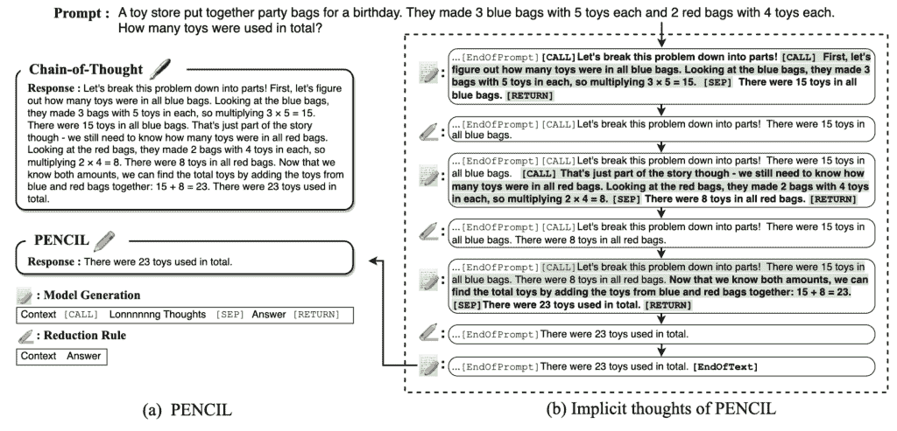
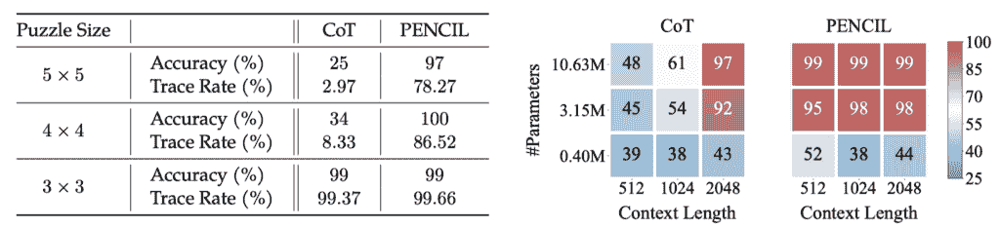
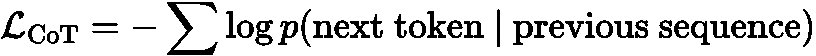
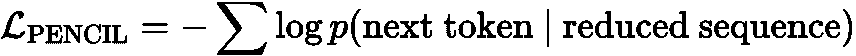
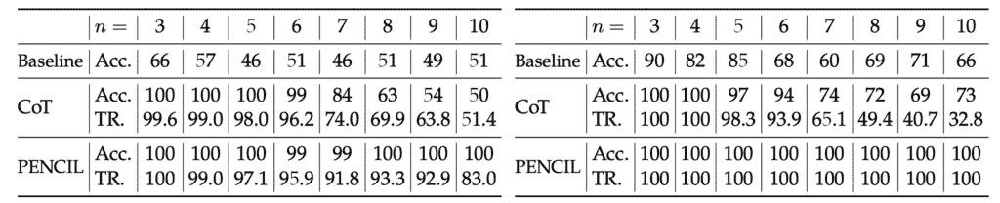
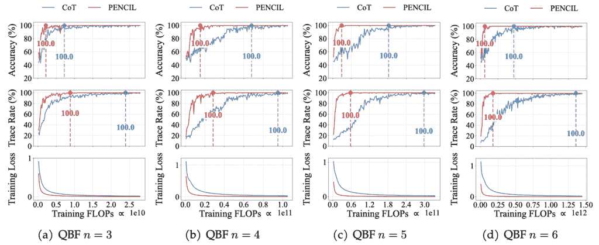
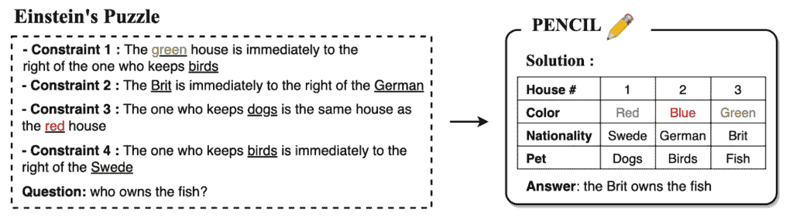
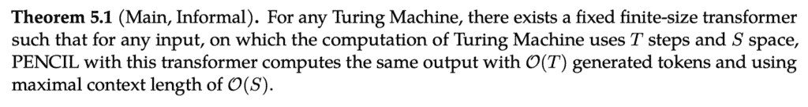
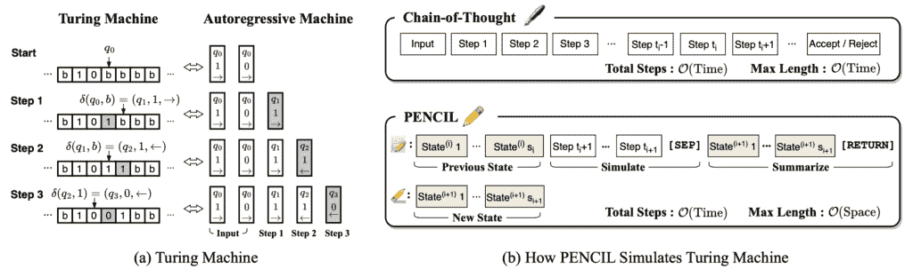

# 通过消除思维赋予 LLMs 更深入的思考能力

> 原文：[`towardsdatascience.com/empowering-llms-to-think-deeper-by-erasing-thoughts/`](https://towardsdatascience.com/empowering-llms-to-think-deeper-by-erasing-thoughts/)

## <mdspan datatext="el1747095842970" class="mdspan-comment">引言</mdspan>

近期**大型语言模型（LLMs）**，例如[OpenAI 的 o1/o3](https://openai.com/index/learning-to-reason-with-llms/)、DeepSeek 的 R1 和 Anthropic 的 Claude 3.7，展示了允许模型在测试时进行更深、更长时间的思考可以显著增强模型的推理能力。其深层次思考能力背后的核心方法被称为**[思维链（CoT）](https://proceedings.neurips.cc/paper_files/paper/2022/file/9d5609613524ecf4f15af0f7b31abca4-Paper-Conference.pdf）**，其中模型迭代地生成中间推理步骤并将它们附加到当前上下文中，直到生成最终答案。

然而，随着任务的日益复杂，解决它们所需的步骤会急剧增加。例如，考虑使用 CoT 解决 NP-hard 问题——推理轨迹不可避免地会跨越指数级步骤，假设固定大小的 Transformer 作为基础模型，且 P ≠ NP。这引发了一个重要问题：

***基于 CoT 的测试时间缩放是否会触及硬性上限？***

不幸的是，可能确实如此。对于更困难的任务，将出现各种限制：**（1）**链将不可避免地超出模型上下文窗口，**（2）**关键信息被埋没，几乎不可能从众多前缀标记中检索出来，以及**（3）**自注意力复杂度使得生成每个新标记的成本过高。

由 ChatGPT 生成，由作者提示

在这篇文章中，我们从理论和实践两个角度挑战了目前 LLM 架构中占主导地位的传统的“只写”CoT 推理范式。此外，我们将探讨一种根本不同的推理方法，该方法不仅允许 LLM 生成思维，还可以消除思维。这种消除思维的能力不仅为性能和效率提供了显著的实际效益，而且从计算理论的角度来看，对于实现最佳推理效率是基本的。

这篇文章基于 C. Yang 等人于 2025 年国际机器学习会议接受的论文*[“PENCIL：短记忆中的长思维”](https://arxiv.org/pdf/2503.14337?)*，与 Nathan Srebro、David McAllester、Zhiyuan Li 合作。[代码](https://github.com/chr26195/PENCIL)也可用。

* * *

## 并非所有事物都需要被记住

选择性地丢弃信息的思想在计算机科学历史中有着深厚的根源，从最早的计算模型到现代系统。经典的图灵机在其磁带上覆盖符号而不是保留每个状态；编程语言通过在函数执行完成后自动释放的堆栈帧来回收内存；现代垃圾收集器持续识别并移除程序不再可访问的对象。这些机制不仅仅是效率优化——它们是使复杂计算在有限资源内成为可能的基本设计选择。

这个想法也适用于人类推理。在定理证明中，一旦一个引理被建立，我们就丢弃其详细的推导过程，同时保留结果；在探索解决问题的方法时，我们只需将无用的路径标记为“失败”，而不保留它们的完整轨迹。在整个复杂的推理过程中，我们自然会压缩信息，保留结论，丢弃达到它们的支撑结构。

## ✏️ PENCIL：一种新的推理范式

因此，我们提出了✏️ PENCIL，一种新的 LLM 推理范式。与✒️ CoT 仅生成思维不同，PENCIL 递归地生成和消除思维，直到达到最终答案。它只维护生成未来思维所需的最小上下文，因此模型可以思考更长、更深入，使用较短的工作内存来解决更难的任务。以下图示说明了 PENCIL 的工作原理

思维链（左）在上下文中保留所有推理步骤，创建冗长的输出。PENCIL（右）在生成（粗体）和简化（蓝色）之间交替：当不再需要时丢弃中间思维。在达到解决方案后，PENCIL 只返回最终答案，隐藏思考过程。

### 怎样让模型消除思维？

PENCIL 的消除机制借鉴了两个经典思想。首先，来自**逻辑和经典自动定理证明中的重写规则**，这些规则持续应用预定义的规则来简化复杂的逻辑或算术表达式到规范形式，直到达到最终答案。其次，来自**函数式编程语言**，它在调用函数时创建堆栈帧来存储局部变量，并在函数返回时释放相应的内存，自动丢弃不再需要的中间状态。

具体来说，我们引入了三个特殊的标记，称为[CALL]、[SEP]和[RETURN]，并使用以下简化规则来实现消除：

其中 **C** 代表上下文，**T** 代表中间思想，**A** 代表答案。每当生成的序列完全匹配左侧的模式时，PENCIL 触发缩减规则，擦除思想并将答案合并回上下文。重要的是要注意，**C**、**T** 和 **A** 本身可以包含特殊标记，从而支持类似于嵌套函数调用的**递归**结构——例如，**C** 可能包含另一个 [CALL] 标记，表示已启动一个新的思考子程序。

### 如何使用 PENCIL？

PENCIL 的擦除机制灵活支持各种推理模式，例如：

1️⃣ **任务分解**：使用 [CALL] 来启动子问题，生成中间结果，然后使用 [SEP] 和 [RETURN] 来合并输出并擦除子问题推理细节；

2️⃣ **分支和回溯**：使用 [CALL]、[SEP]、[RETURN] 三联组来管理搜索树中的探索分支，在冲突或失败时擦除无效路径。

3️⃣ **总结/尾递归**：将漫长的推理轨迹压缩成简洁的总结，类似于编程中的尾递归优化：

其中 **T** 代表原始的复杂推理过程（或一个更难的问题），而 **T’** 代表总结或简化的内容（或一个等效的、更易处理的问题）。

### NP-Complete 任务示例

例如，考虑一个经典的 NP-Complete 问题布尔可满足性（SAT）：给定一个布尔公式，确定是否存在一个变量赋值使其为真。这个问题（广泛认为）需要**指数时间**但只需**多项式空间**来解决，最简单的方法是遍历深度为 n 的二叉搜索树。

传统的 CoT 会累积中间计算，导致上下文长度与搜索树中的节点数成比例增长，这是指数时间复杂度 O(2^n)。相比之下，PENCIL 可以递归地分支尝试变量的 True/False，在冲突时回溯并擦除该分支内的所有思想。因此，这保持了上下文长度与搜索深度成比例，空间复杂度仅为 O(n)。

下图比较了没有缩减的原始 CoT（蓝色）和具有缩减的 PENCIL（红色）的最大上下文长度。随着问题复杂性的增加，PENCIL 实现了显著的空间效率，特别是将爱因斯坦难题的上下文长度从 151,192 减少到仅为 3,335 个标记。

带和不带缩减规则的序列最大长度。

* * *

## 训练和实验

训练期间 CoT 和 PENCIL 的核心区别在于损失函数的计算：

对于 CoT，每个新标记的损失基于完整的上下文历史；对于 PENCIL，在每次“写入-擦除”迭代后，模型仅对缩短的序列计算新标记的损失。尽管两者生成的标记数量相同，但 PENCIL 显著缩短了每个标记对应的上下文长度，因此效率更高。

值得注意的是，每次减少后，共享前缀 **C** 的 KV 缓存可以直接重用，只需重新计算较短的 **A** 部分的缓存。

### 实验结果

我们的实验专注于三个固有的困难推理任务：3-SAT（NP-Complete）、QBF（PSPACE-Complete）和爱因斯坦的谜题（自然语言推理）。对于每个任务，我们编写了一个生成器来生成包含特殊标记的训练集。我们为这些任务训练了一个小型变压器（SAT/QBF 参数量为 10.6M；爱因斯坦的谜题参数量为 25.2M），从随机初始化开始。

📊 与 CoT 相比，我们发现 PENCIL 可以解决更大规模的推理问题。如图所示，在 SAT（左）和 QBF（右）任务中，当问题规模较小时，CoT 和 PENCIL 都能完美解决问题；但随着规模的增加，传统的 CoT 准确率显著下降（例如，在 n=10 时 SAT 的准确率仅为约 50%），而 PENCIL 保持高准确率 ≥ 99%。这主要是因为 CoT 的上下文序列长度呈指数级爆炸，而 PENCIL 通过动态减少避免了爆炸。

3-SAT（左）和 QBF（右）的性能比较

⚡️ 此外，PENCIL 显著节省了计算资源。如图所示，对于 QBF (n=3–6) 任务，我们在相同的 FLOPs 预算下比较了 CoT（蓝色）和 PENCIL（红色）的收敛速度。PENCIL 快速达到 100% 的准确率，而 CoT 由于持续扩展上下文长度，需要更多的 FLOPs 来接近最优解。随着问题规模的增加，两者之间的差距变得更加明显。

在 QBF 问题（n 范围从 3 到 6）上训练的收敛速度比较

（到 6）。圆圈和垂直线表示每种方法首次达到最佳性能的时间。

🧩 我们进一步考虑了一个非常困难的逻辑推理问题：[爱因斯坦难题](https://en.wikipedia.org/wiki/Zebra_Puzzle)。每个问题由 5 座房屋和 5 个人群属性类别组成——颜色、国籍、饮料、香烟和宠物（例如，红/绿/蓝，英/德/瑞典，鸟/狗/鱼等）。给定诸如“绿色房子紧挨着鸟主人”和“狗主人住在红色房子里”这样的线索，任务是推断“谁拥有鱼？”这个问题对现有的 LLMs 提出了极端挑战：[甚至 GPT-4 也难以解决它](https://proceedings.neurips.cc/paper_files/paper/2023/file/deb3c28192f979302c157cb653c15e90-Paper-Conference.pdf)。下面的图显示了只有 3 座房屋和 3 个属性类别的简化版本：

爱因斯坦难题的示意图。

如下所示，对于这个即使是大型模型也难以解决的问题，PENCIL 仅使用一个小的 25.2M 参数模型就达到了 97%的准确率，而传统的 CoT 仅达到 25%的准确率（接近随机猜测）。

爱因斯坦难题的性能

* * *

## 理论：通用高效计算

我们进一步从理论上的**表达能力**角度展示了 PENCIL 相对于传统 CoT 的基本优势：PENCIL 具有最优的空间复杂度，并且因此可以有效地解决任意可计算任务。这是 CoT 所无法做到的！

### 主要结果

具体来说，我们证明：*使用一个固定、有限大小的 Transformer，PENCIL 可以在最优的时间和空间复杂度下模拟任何图灵机，从而有效地解决所有可计算问题。*

换句话说，对于任何在 T 时间内运行并在 S 空间内运行的图灵机，PENCIL 只需要 O(T)个标记，同时保持最大上下文长度为 O(S)以产生相同的结果。虽然[先前的工作](https://arxiv.org/pdf/2310.07923)已经证明传统的 CoT 可以使 Transformer 图灵完备，但它需要 O(T)的上下文长度，每个标记代表一个中间计算步骤。这种最大上下文长度的区别变得至关重要，因为对于大多数算法，空间复杂度 S 远小于时间复杂度 T，尤其是在更难的问题中。

考虑 NP-完全问题，如旅行商问题或哈密顿回路问题，这些问题普遍认为需要指数时间，但可以在多项式空间内解决。传统的 CoT 无法在多项式上下文长度约束内解决这些问题，并且至少需要超过任何实际系统内存限制的指数长度。相比之下，PENCIL 可以使用仅多项式最大上下文长度来解决这些问题，使得以前难以处理的推理任务变得可行。

### 证明草图

我们现在简要介绍我们的证明思路，关键洞察是让 PENCIL 使用一系列“模拟-总结”迭代来清理内存。

PENCIL 通过两个阶段迭代地模拟图灵机：从上一个状态模拟计算步骤，并使用简化规则总结到新状态。

**步骤 1：使用 CoT 对图灵机转换进行编码** 如上图左侧所示，我们将每个图灵机状态转换编码为嵌入中的“新状态”、“写入符号”和“头移动方向”三元组令牌。模型可以使用自注意力来计算当前头位置并确定该位置的符号。没有简化，这个过程生成 T 个令牌，上下文长度为 O(T)。

**步骤 2：交替“模拟-总结”** PENCIL 通过交替来实现空间/时间最优性：

1.  **模拟**：持续生成图灵机状态转换令牌，模拟多个计算步骤；

1.  **总结**：当新令牌超过所需空间的两倍时，使用 S 个令牌总结计算。然后简化规则丢弃之前的想法，只保留下一轮的最新图灵机状态。

该策略保持总令牌生成在 O(T) 的同时，将上下文长度限制在 O(S)。

**步骤 3：Transformer 实现** 为了证明这个过程可以通过 Transformers 实现，我们开发了 Full-Access Sequence Processing (FASP) 编程语言，并证明了任何用 FASP 编写的算法都可以通过固定大小的 Transformer 实现。在 FASP 程序中，每个变量对应一个 Transformer 子模块，每行代码通过预定义的函数将现有变量转换为新的变量，这相当于基于子模块构建一个更复杂的 Transformer。程序返回的变量是编码算法的所需 Transformer。我们编写了一个 FASP 程序来实现“模拟-总结”操作，这意味着存在一个固定大小的 Transformer 可以执行相同的功能

* * *

## 结论

总之，我们提出了一种新的推理范式 PENCIL，它在生成和擦除之间交替，使模型能够进行更深入的思考以解决更复杂的问题。从理论上讲，我们证明了 PENCIL 以最优的时间和空间效率实现了图灵完备性，因此可以有效地解决任何可计算问题。展望未来，一个有希望的方向是将 LLMs 微调以结合 PENCIL 的内存高效推理能力。我们希望这些发现能够启发从计算理论的角度重新审视当前的推理模型。

