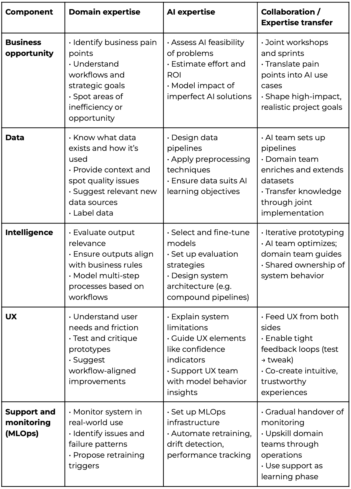

# 企业 AI：从构建或购买到合作与成长

> 原文：[`towardsdatascience.com/enterprise-ai-from-build-or-buy-to-partner-and-grow/`](https://towardsdatascience.com/enterprise-ai-from-build-or-buy-to-partner-and-grow/)

<mdspan datatext="el1745367295948" class="mdspan-comment">不久前</mdspan>，一位合作伙伴偶然向我提出他们组织中的一个 AI 用例。他们希望通过使用 AI 来回答新员工的重复性问题，从而使新员工入职流程更加高效。我建议了一种实用的聊天方法，该方法将整合他们的内部文档，他们带着自信的氛围离开了，计划“与他们的 IT 团队”讨论以推进工作。

从经验来看，我知道这种乐观是脆弱的。平均而言，IT 团队没有能力独立实施一个完整的端到端 AI 应用。结果也是如此：几个月后，他们陷入了困境。他们的系统运行缓慢，而且在开发过程中也变得明显，他们对用户的实际需求理解有误。新员工提出的问题与系统调整的问题不同。大多数用户尝试了几次后就放弃了，再也没有回来。解决这些问题需要重新思考他们的整个架构和数据策略，但损害已经造成。员工感到沮丧，管理层已经注意到了这一点，围绕 AI 的最初兴奋已经转变为怀疑。为另一个广泛的发展阶段辩护将是困难的，因此这个案例被悄悄地存档了。

这个故事远非独一无二。AI 公司的出色营销在 AI 周围创造了一种可及性的错觉，公司在没有完全掌握前方挑战的情况下就跳进了这些倡议。实际上，需要专业的知识来制定一个坚实的 AI 策略，并在公司中实施任何更多或更少的定制用例。如果这种专业知识内部不可用，你需要从外部合作伙伴或提供商那里获得。

这并不意味着你需要购买一切——那就像有 100 美元却选择在餐厅消费而不是去超市一样。第一个选择可以立即解决你的饥饿，但第二个选择将确保你一周都有东西吃。

那么，您如何开始，谁应该实施您的第一个 AI 项目？以下是我的看法：忘记构建或购买，而是专注于合作和学习。我坚信，大多数公司应该内部建立 AI 专业知识——这将为他们未来的 AI 战略和活动提供更多带宽。同时，AI 是一项复杂的技艺，需要时间来掌握，失败无处不在（根据兰德公司[`www.rand.org/pubs/research_reports/RRA2680-1.html`](https://www.rand.org/pubs/research_reports/RRA2680-1.html)的报告，超过 80%的 AI 项目失败）。从失败中学习在理论上很好，但在现实中，它会导致时间、资源和信誉的浪费。为了有效地实现 AI 成熟度，公司应考虑与愿意分享其专业知识的可信合作伙伴合作。一个现实且谨慎的设置不仅将确保更平滑的技术实施，还将解决您 AI 战略中与人和业务相关的问题。

在以下内容中，我将首先概述 AI 构建或购买决策的粗略基础（输入、输出和权衡）。然后，您将了解一种更差异化的合作方法。它结合了构建和购买，同时加强您的内部学习曲线。最后，我将总结一些关于 AI 合作的实用观察和建议。

*注意：如果您对更多可操作的 AI 见解感兴趣，请查看我的通讯录[*AI for Business*](https://jannalipenkova.substack.com)!*

## AI 构建或购买决策的基础

首先，让我们将经典的构建或购买决策分解为两部分：输入——您应该提前评估的内容——和输出——每个选择将如何影响您的业务。

### 输入

为了做出决策，您需要评估您的内部能力和用例的要求。这些因素将决定每个选项可能有多现实、多风险或多有益：

+   **您组织的 AI 成熟度：**考虑您的内部技术能力，例如熟练的 AI 人才、现有的可重用 AI 资产（例如数据集、预构建模型、知识图谱），以及可以转移到 AI 领域的相邻技术技能（例如数据工程、分析）。还要考虑用户与 AI 互动和处理其不确定性的熟练程度。随着您的 AI 成熟度提高，投资于技能提升并敢于构建更多。

+   **领域专业知识需求：**解决方案必须多大程度上反映您行业特定的知识？在需要专家人类直觉或监管熟悉度的用例中，您的内部领域专家将发挥关键作用。他们应该参与开发过程，无论是通过内部构建还是与外部提供商紧密合作。

+   **用例的技术复杂性**：并非所有 AI 都是相同的。依赖于现有 API 或基础模型的项目远比从头开始训练自定义模型架构的项目简单得多。高复杂性增加了构建优先方法的风险、资源需求和潜在延迟。

+   **价值和战略差异化**：用例是否对你的战略优势至关重要，或者更多的是支持功能？如果它是你行业（甚至公司）独有的，并且将增加竞争优势，那么构建或共同开发可能提供更多价值。相比之下，对于标准用例（例如，文档分类、预测），购买可能带来更快、更经济的成果。

### 构建或购买决策的后果

一旦你评估了你的输入，你将想要绘制出你的构建或购买选择的下游影响，并评估权衡。以下七个维度将影响你的时间表、成本、风险和结果：

1.  **定制化**：AI 解决方案可以根据组织的特定工作流程、目标和领域需求进行定制化的程度。定制化通常决定了解决方案如何适应独特的商业需求。

1.  **所有权**：知识产权（IP）和对其基础 AI 模型、代码和战略方向的掌控。内部构建提供完全的所有权，而购买通常涉及许可另一方的技术。

1.  **数据安全**：涵盖数据如何处理、存储位置以及谁可以访问。在受监管或敏感的环境中，数据隐私和合规性是核心关注点，尤其是在数据可能与外部供应商共享或处理时。

1.  **成本**：包括初始投资和持续运营费用。构建涉及研发、人才、基础设施和长期维护，而购买可能需要许可、订阅或云使用费。

1.  **上市时间**：衡量解决方案可以部署并开始创造价值所需的时间。在竞争或动态市场中，快速部署通常至关重要；延迟可能导致错失机会。

1.  **支持与维护**：涉及谁负责更新、扩展、错误修复和持续模型性能。内部构建需要专门资源进行维护，而外部解决方案通常包括支持服务。

1.  **AI 学习曲线**：反映了在组织内部获取 AI 专业知识和实施它的复杂性。内部构建通常伴随着大量的试错和脆弱的结果，因为团队缺乏基础 AI 知识。另一方面，购买或合作可以通过指导专家和成熟的工具加速学习，并为未来的 AI 活动奠定坚实的基础。

现在，在实践中，二元构建或购买思维往往导致无法解决的权衡。以之前提到的入职用例为例。团队倾向于*构建*的一个原因是需要保持公司数据的机密性。同时，他们没有内部人工智能专业知识来开发一个生产就绪的聊天系统。他们可能会通过外包聊天架构和持续支持，同时内部构建数据库而取得更大的成功。因此，你不应该在整个 AI 系统层面做出构建或购买的决定。相反，将其分解为组件，并根据你的能力、约束和战略优先级评估每个组件。

## 向领域与人工智能专业知识握手

在组件层面，我鼓励你通过专业知识需求的角度来区分构建或购买决策。大多数 B2B 人工智能系统结合了两种专业知识：领域专业知识，它存在于你的公司内部；以及技术人工智能专业知识，如果你（尚未）拥有专门的 AI 技能，可以通过外部合作伙伴引入。以下，我将检查人工智能系统每个核心组件的专家需求（参见[这篇文章](https://towardsdatascience.com/building-ai-products-with-a-holistic-mental-model-33f8729e3ad9/)来解释组件）。

表 1：人工智能系统组件的专家需求和协作格式

### 商业机会：构建合适的 AI 问题

你知道吗，导致人工智能项目失败的第一大原因不是技术问题——而是选择了错误的问题去解决（参见[**人工智能项目失败的根本原因及其成功之道**](https://www.rand.org/pubs/research_reports/RRA2680-1.html)）？你可能感到惊讶——毕竟，你的专家团队对问题理解得很深。关键在于，他们没有手段将痛点与人工智能技术之间的联系串联起来。以下是一些最常见的失败模式：

+   **模糊或不合适的问题界定**：这是否是人工智能真正擅长的任务？

+   **缺失的努力/投资回报率估算**：结果值得投入时间和资源进行 AI 开发和部署吗？

+   **不切实际的期望**：对于不完美的 AI，“足够好”意味着什么？

另一方面，许多组织为了使用人工智能而使用人工智能，并为了解决问题而创造解决方案。这浪费了资源，并损害了内部信心。

一个好的 AI 合作伙伴可以帮助评估哪些业务流程适合 AI 干预，估算潜在影响，并模拟 AI 可能带来的价值。双方可以通过联合发现研讨会、设计冲刺和探索性原型设计来塑造一个专注、高影响力的用例。

### 数据：你人工智能系统的燃料

清洁、结构良好的领域数据是核心资产。它编码了你的流程知识、客户行为、系统性能等。但仅仅原始数据是不够的——它需要被转换成有意义的学习信号。这就是人工智能专业知识发挥作用的地方，设计管道、选择合适的数据表示，并将一切与人工智能的学习目标对齐。

通常，这包括数据标注——用模型需要学习的信号标注示例。这可能看起来很繁琐，但请抵制外包的诱惑。标注是管道中最具上下文敏感性的部分之一，并且需要领域专业知识才能正确完成。事实上，许多微调任务今天在小型但高质量的数据集上表现最佳——因此，与你的 AI 合作伙伴紧密合作，保持努力集中且可管理。

数据清洗和预处理是另一个经验至上的领域。你可能听说过这样的话：“数据科学家的大部分时间都花在数据清洗上。” 这并不意味着它应该缓慢。拥有经验丰富的工程师（文本、数字、图像等），这个过程可以显著加速。他们会本能地知道何时应用哪些预处理技术，将数周的努力和错误变成数小时的生产性设置。

### 智能化：AI 模型和架构

这就是大多数人认为人工智能项目开始的地方——但这只是故事的中段。选择或微调模型、评估性能和设计系统架构需要深厚的深度人工智能专业知识。例如，你的用例应该使用预训练模型吗？你需要多模型设置吗？哪些评估指标是有意义的？在更复杂的系统中，不同的 AI 组件，如模型和知识库，可以组合成一个多步骤的工作流程。

在系统验证和评估期间，领域专业知识至关重要。专家和未来的用户需要检查 AI 输出是否有意义并且符合他们的现实世界期望。如果模型的输出没有映射到业务逻辑，那么即使模型在统计上很强，在操作上也可能毫无用处。在设计复合系统时，领域专家还需要确保系统设置反映了他们的现实世界流程和需求。

定制 AI 模型和构建自定义 AI 架构是你的“副驾驶”阶段：AI 团队负责架构和优化，而领域团队根据业务目标进行指导和细化。随着时间的推移，目标是建立对系统行为的共同所有权。

> **案例研究：在保险领域利用 AI 专业知识进行构建**
> 
> 在一家领先的保险公司，数据科学团队被委以建立索赔风险预测系统的任务——这是一个他们希望内部完成的项目，以保留完全所有权并紧密与专有数据和流程对齐。然而，早期的原型遇到了性能和可扩展性问题。这就是我的公司[Anacode](https://www.notion.so/Description-of-Anacode-s-trend-process-old-e73926b8118d488d9fe6c0370ac048c1?pvs=21)作为架构和战略合作伙伴介入的地方。我们帮助内部团队评估模型候选者，设计模块化架构，并建立可重复的 ML 管道。同样重要的是，我们进行了针对模型评估、MLOps 和负责任 AI 实践的定向技能提升课程。随着时间的推移，内部团队增强了信心，将早期的原型重新工作成稳健的解决方案，并完全接管了运营。结果是，他们完全拥有这个系统，而我们在这个项目期间提供的专家指导也提升了他们内部的 AI 能力。

### 用户体验：通过用户界面交付 AI 价值

这一点比较棘手。除了少数例外，既不是领域专家也不是深度 AI 工程师可能会设计出真正直观、高效且对真实用户友好的体验。理想情况下，你可以引入专门的 UX 设计师。如果这些人不具备，可以寻找对用户体验有天然感觉的相邻学科的人。如今，许多 AI 工具可用于支持 UX 设计和原型制作，因此品味比技术工艺更重要。一旦有了合适的人选，你需要从两方面为他们提供输入：

+   **后端**：AI 专家提供对系统内部工作方式的见解——其优势、局限性、确定性水平——并支持设计解释、不确定性指标和置信度评分（参考[这篇文章](https://medium.com/user-experience-design-1/building-and-calibrating-trust-in-ai-717d996652ef)关于通过 UX 建立对 AI 的信任）。

+   **前端**：领域专家了解用户、他们的工作流程和他们的痛点。他们帮助验证用户流程，突出摩擦点，并根据人们实际与系统互动的方式提出改进建议。

专注于快速迭代，并准备好进行一些错误尝试。AI UX 是一个新兴领域，目前还没有关于“优秀”的固定公式。最佳体验来自于紧密的、迭代的反馈循环，其中设计、测试和改进持续进行，吸收来自领域专家和 AI 专家的输入。

### 支持和维护：让 AI 保持活力

一旦部署，AI 系统需要密切监控和持续改进。现实世界的用户行为往往与测试环境不同，并且随着时间的推移而变化。这种固有的不确定性意味着你的系统需要被积极监控，以便及早发现和解决问题。

监控的技术基础设施——包括性能跟踪、漂移检测、自动再训练和 MLOps 管道——通常由你的 AI 合作伙伴设置。一旦到位，许多日常监控任务不需要深厚的专业技能。它们需要的是领域专业知识：理解模型输出是否仍然有意义，注意到使用模式中的微妙变化，并知道何时感觉“不对”。

一个精心设计的支持阶段不仅仅是操作性的——它还可以成为你内部团队的关键学习阶段。它为逐步建立技能、更深入的系统理解以及最终更平滑地走向对 AI 系统更大程度的所有权创造了空间。

因此，与其将 AI 实施视为一个构建或购买的二元决策，你应将其视为一系列活动的马赛克。其中一些活动非常技术性，而其他一些则与你的业务背景紧密相关。通过在 AI 生命周期中映射责任，你可以：

+   明确哪些角色和技能对于成功至关重要

+   识别你内部已有的能力

+   发现外部专业知识最有价值的差距

+   制定知识转移和长期所有权的计划

如果你想要深入了解领域专业知识与 AI 系统的整合，请查看我的文章[将领域专业知识注入你的 AI 系统](https://towardsdatascience.com/injecting-domain-expertise-into-your-ai-system-792febff48f0/)。重要的是，“领域”和“AI”专业知识之间的界限并非固定。你可能已经有一些团队成员在尝试机器学习，或者其他人渴望成长为更技术性的角色。通过合适的合作伙伴模式和提升技能策略，你可以逐步向 AI 自主性发展，随着内部成熟度的增长，逐渐承担更多责任和控制权。

## 在合作伙伴关系中，尽早开始并专注于沟通

到现在为止，你知道在 AI 系统的各个组件层面做出构建或购买的决定。但如果你团队中还没有 AI 专业知识，你如何设想你的系统和其组件最终会是什么样子？答案是：尽早开始合作。当你开始塑造你的 AI 战略和设计时，引入一个值得信赖的合作伙伴来指导这个过程。选择一个你可以轻松、开放沟通的人。从一开始就进行正确的合作，你会增加顺利且成功导航 AI 挑战的机会。

### 选择一个具有基础 AI 专业知识的 AI 合作伙伴

你的 AI 合作伙伴不仅应该提供代码和技术资产，还应在合作期间帮助你的组织学习和成长。以下是一些常见的外部合作伙伴类型以及你可以期待得到的内容：

+   **外包**：这种模型抽象掉了复杂性——你能够快速得到结果，就像快速碳水化合物的摄入。虽然它很高效，但很少能带来长期战略价值。你最终得到的是一个工具，而不是更强的能力。

+   **学术合作**：非常适合前沿创新和长期研究，但通常不太适合 AI 系统的实际部署和采用。

+   **咨询合作**：在我看来，这是最有前途的道路，特别是对于已经拥有技术团队并希望发展其 AI 洞察力的公司。一个好的顾问能够赋予你的工程师权力，帮助他们避免代价高昂的错误，并为诸如“针对我们的用例，正确的技术堆栈是什么？”、“我们如何整理数据以提升质量并启动强大的数据飞轮？”以及“我们如何在不损害信任和治理的情况下进行扩展？”等问题提供基于经验的实用见解。

详细的合作伙伴选择框架超出了本文的范围，但这里有一条来之不易的经验之谈：对 2022 年通用人工智能热潮后突然将“AI”添加到其服务中的 IT 外包公司和咨询公司保持警惕。他们可能会用花哨的术语吸引你，但如果 AI 不是他们的基因，你可能会为他们的学习曲线付费，而不是从互补的专业知识中受益。选择一个已经完成了艰苦工作并准备好将这种专业知识转移到你这里的合作伙伴。

### 加倍重视沟通和一致性

在合作伙伴模式中，有效的沟通和利益相关者一致至关重要。以下是在您的公司中需要做对的一些重要沟通角色：

+   领导者和领域专家必须识别并清楚地传达值得解决的商业问题（关于 AI 创意最佳实践的更多信息[这里](https://jannalipenkova.substack.com/publish/posts/detail/150407072?referrer=%2Fpublish%2Fposts))。

+   最终用户需要尽早分享他们的需求，在使用过程中提供反馈，并理想情况下成为塑造 AI 体验的共同创造者。

+   IT 和治理团队必须在启用而非阻碍 AI 创新的同时确保合规性、安全性和安全性。请记住：这些能力并非完全成熟。

在 AI 项目中，脱节和无效率的孤岛风险很高。AI 仍然是一个相对较新的领域，仅术语本身就能造成混淆。如果你曾经发现自己陷入关于“AI”和“机器学习”之间区别的辩论，你就知道我的意思了。如果你还没有，我鼓励你在下次与同事聚会时尝试一下。它可能和你与伴侣开始的对话一样难以捉摸，那句话是“我们得谈谈。”

力求双方接近，消除模糊性和脱节。您的内部团队应投资于技能提升，并建立对 AI 概念的基本理解。另一方面，您的 AI 合作伙伴必须做出相应的努力。他们应避免使用行话，并使用清晰、以业务为导向的语言，以便您的团队能够实际操作。有效的合作始于共同的理解。

## 结论

真正的问题不是“我们应该构建还是购买人工智能？”——而是“我们如何以平衡速度、控制和长期价值的方式增长我们的人工智能能力？”答案在于将人工智能视为技术和专长的结合，成功取决于将正确的资源与正确的任务相匹配。

对于大多数组织来说，最明智的前进道路是**合作**——结合您的领域优势与外部人工智能专业知识，以更快地构建、更快地学习，并最终拥有更多您的人工智能之旅。

您接下来可以做什么：

+   **将您的 AI 用例与您的内部能力进行映射**。要诚实地面对差距。

+   **选择那些不仅提供成果，而且能够传授知识的合作伙伴**。

+   **确定要构建、购买或共同创建哪些组件**。您不需要做出二选一的选择。

+   **在前进的过程中提升团队技能**。每个项目都应该使您更有能力、更自主，而不是更依赖合作伙伴的资产和技能。

+   **从具有价值创造和内部学习动力的试点项目开始**。

通过今天采取战略性的能力建设方法，您为长期成为具有人工智能能力——并最终由人工智能驱动的组织——奠定了基础。

## 进一步阅读

+   Singla, A., Sukharevsky, A., Ellencweig, B., Krzyzaniak, M., & Song, J. (2024, May 22). [*为通用人工智能建立战略联盟：如何构建它们并使它们发挥作用*](https://www.mckinsey.com/capabilities/quantumblack/our-insights/strategic-alliances-for-gen-ai-how-to-build-them-and-make-them-work). 麦肯锡公司。

+   Liebl, A., Hartmann, P., & Schamberger, M. (2023, November 23). [*企业制造或购买决策指南*](https://www.appliedai.de/en/insights/make-or-buy-decisions/) [白皮书]. appliedAI 创新计划。

+   Gartner. (n.d.). [*部署人工智能：您的组织应该构建、购买还是混合？*](https://www.gartner.com/en/articles/deploying-ai) Gartner。
