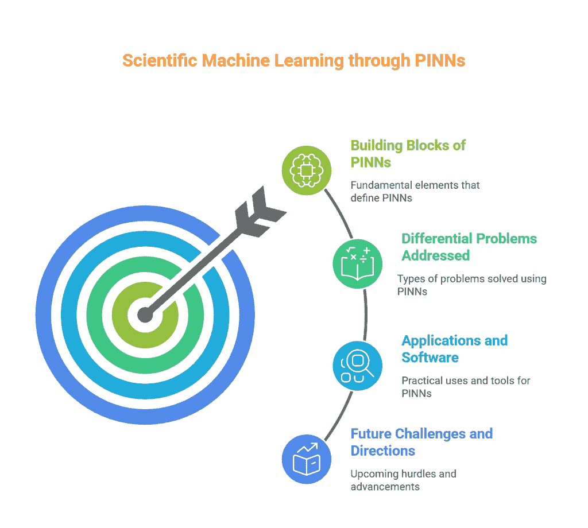
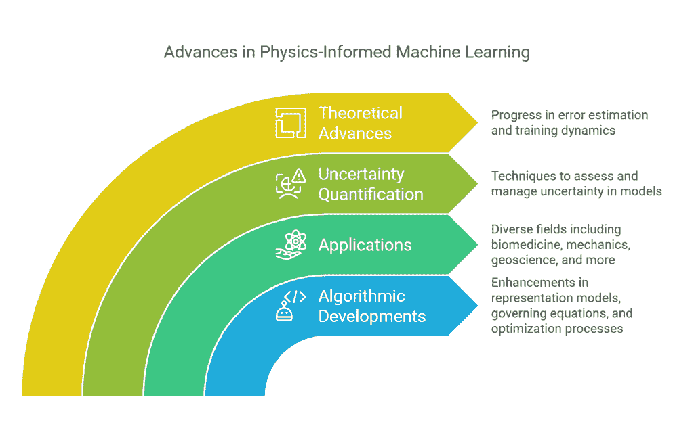
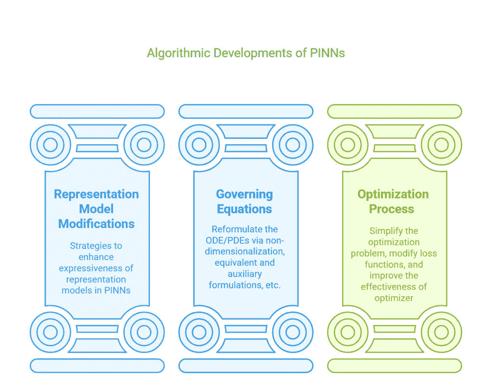
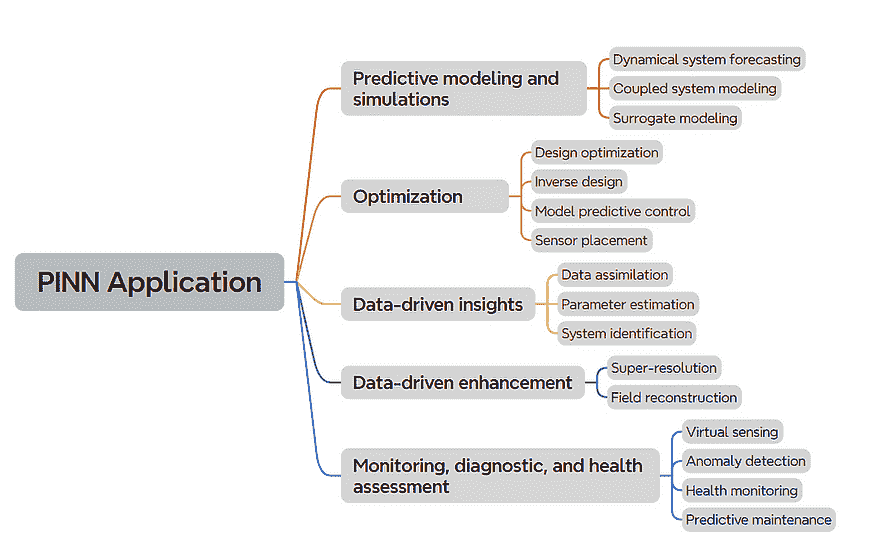
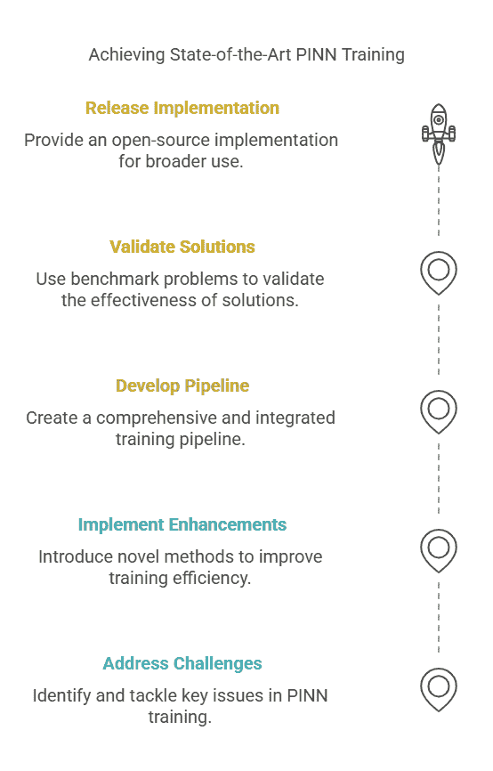

# 物理信息神经网络：必备综述论文集：实践者的精选指南

> 原文：[`towardsdatascience.com/essential-review-papers-on-physics-informed-neural-networks-a-curated-guide-for-practitioners/`](https://towardsdatascience.com/essential-review-papers-on-physics-informed-neural-networks-a-curated-guide-for-practitioners/)

跟踪快速发展的研究领域从来都不容易。

作为物理信息神经网络（PINNs）的实践者，我亲自面临这个挑战。无论是算法进步还是尖端应用，学术界和工业界都以越来越快的速度发表新论文。虽然看到这种快速发展令人兴奋，但它不可避免地提出了一个紧迫的问题：

*如何在不花费无数小时筛选论文的情况下保持信息更新？*

这是我发现综述论文特别有价值的地方。好的综述论文是有效的工具，可以提炼出关键见解并突出重要趋势。它们是节省大量时间的指南，引导我们穿越信息洪流。

在这篇博客文章中，我想与你分享我**个人精选的 PINNs 必备综述论文列表**，这些论文对我的 PINNs 理解和应用特别有影响力。这些论文涵盖了 PINNs 的关键方面，包括算法发展、实施最佳实践和现实世界应用。

除了现有文献中可用的内容之外，我还包括了我自己的一篇综述论文，它对**PINNs 的常见功能使用模式**进行了全面分析——这是学术评论中经常缺失的实用视角。这项分析基于我对过去三年中约 200 篇关于 PINNs 的 arXiv 论文的回顾，涵盖了各种工程领域的应用，可以作为希望将这些技术部署来解决现实世界挑战的实践者的必备指南。

对于每一篇综述论文，我将通过解释其独特的视角和指出你可以立即从中受益的实用要点来解释为什么它值得你的关注。

无论你是刚开始接触 PINNs，使用它们来解决实际问题，还是探索新的研究方向，我希望这个精选集能让你在 PINNs 研究繁忙的领域中更容易地导航。

让我们共同简化复杂性，关注真正重要的事情。

## 1️⃣ 通过物理信息神经网络进行科学机器学习：我们现在在哪里以及下一步是什么

### 📄 简要概述

### 🔍 涵盖内容

+   **作者**：S. Cuomo, V. Schiano di Cola, F. Giampaolo, G. Rozza, M. Raissi, and F. Piccialli

+   **年份**：2022

+   **链接**：[arXiv](https://arxiv.org/abs/2201.05624)

这篇综述围绕 PINNs 的关键主题构建：定义其架构的基本组件、学习过程的理论方面以及它们在工程计算挑战中的应用。论文还探讨了可用的工具集、新兴趋势和未来方向。

图 1\. #1 综述论文概述。（作者提供图片）

### ✨ 独特之处

这篇综述论文在以下方面脱颖而出：

+   **PNN 基础知识的最佳入门之一**。本文以稳健的节奏从基础开始解释 PNN，*第二部分* 系统地剖析了 PNN 的构建块，包括各种底层神经网络架构及其相关特性、如何融入偏微分方程约束、常见的训练方法以及 PNN 的学习理论（收敛性、误差分析等）。

+   **将 PNN 放入历史背景中**。本文不是简单地将 PNN 作为一种独立的解决方案来介绍，而是追溯了其从早期使用深度学习求解微分方程的工作中的发展。这种历史框架很有价值，因为它通过显示 PNN 是先前想法的演变，有助于消除 PNN 的神秘感，并使从业者更容易看到可用的替代方案。

+   **以方程为中心的组织**。与许多其他综述不同，本文不是按科学领域（例如，地球科学、材料科学等）对 PNN 研究进行分类，而是根据它们解决的微分方程类型（例如，扩散问题、对流问题等）对 PNN 进行分类。这种*方程优先的视角*鼓励知识转移，因为同一组偏微分方程可以跨越多个科学领域使用。此外，它使从业者更容易看到处理不同类型的微分方程时 PNN 的优势和劣势。

### 🛠 实用技巧

除了其理论洞察力之外，这篇综述论文还为从业者提供了立即有用的资源：

+   **完整的实现示例**。在 *第 3.4 节*，本文详细介绍了如何使用 PNN 解决一维非线性薛定谔方程的完整实现。它涵盖了将方程转换为 PNN 公式、处理边界和初始条件、定义神经网络架构、选择训练策略、选择配置点和应用优化方法。所有实现细节都进行了清晰的文档记录，以便于轻松复现。本文通过改变不同的超参数来比较 PNN 的性能，这可以为你的 PNN 实验提供立即可应用的见解。

+   **可用的框架和软件工具**。*表 3* 汇编了一个全面的 PNN 工具包列表，其中在第 4.3 节中提供了详细的工具描述。考虑的后端不仅包括 Tensorflow 和 PyTorch，还包括 Julia 和 Jax。这种不同框架的并列比较对于选择满足你需求正确的工具特别有用。

### 💡 受益人群

+   这篇综述论文对任何刚开始接触 PNN 并寻求清晰、结构化介绍的人来说都大有裨益。

+   **工程师和开发者**寻找实际实施指导的人会发现现实、实用的演示以及现有 PINN 框架的全面比较最有兴趣。此外，他们还可以找到与当前问题类似微分方程的相关先前工作，这为他们自己的问题解决提供了可以利用的见解。

+   **研究人员**在研究 PINN 收敛、优化或效率的理论方面也可以从这篇论文中受益良多。

## 2️⃣ 从 PINNs 到 PIKANs：物理信息机器学习的最新进展

### 📄 概览论文

+   **作者**：J. D. Toscano, V. Oommen, A. J. Varghese, Z. Zou, N. A. Daryakenari, C. Wu, 和 G. E. Karniadakis

+   **年份**：2024

+   **链接**：[arXiv](https://arxiv.org/abs/2410.13228)

### 🔍 涵盖内容

这篇论文提供了对 PINNs 最新进展的*最新*概述。它强调了网络设计、特征扩展、优化策略、不确定性量化以及理论洞察力的改进。论文还概述了跨多个领域的关键应用。

图 2. #2 综述论文概述。（图片由作者提供）

### ✨ 独特之处

这篇综述论文在以下方面脱颖而出：

+   **算法发展的结构化分类法**。本文最引人注目的贡献之一是其算法进步的分类法。这个新的分类方案巧妙地将所有进步分为三个核心领域：(1) *表示模型*，(2) *处理控制方程*，和(3) *优化过程*。这种结构为理解当前的发展以及未来研究的潜在方向提供了一个清晰的框架。此外，论文中使用的插图质量上乘，易于理解。

图 3. #2 论文提出的 PINNs 算法发展分类法。（图片由作者提供）

+   **聚焦于物理信息 Kolmogorov–Arnold 网络（KAN）**。基于 Kolmogorov–Arnold 表示定理的新架构 KAN，目前在深度学习中是一个热门话题。在 PINN 社区中，一些工作已经完成，用 KANs 替换多层感知器（MLP）表示，以获得更多的表达能力和训练效率。社区缺乏对这个新研究方向的综合回顾。这篇综述论文（第 3.1 节）正好填补了这个空白。

+   **对 PINNs 中不确定性量化（UQ）的评论**。UQ 对于处理实际工程应用中的 PINNs 至关重要。在*第五部分*中，本文提供了一个关于 UQ 的专门部分，解释了解决微分方程时 PINNs 中不确定性的常见来源，并回顾了量化预测置信度的策略。

+   **PINN 训练动态的理论进展**。在实践中，训练 PINNs 并非易事。从业者常常困惑于为什么 PINNs 的训练有时会失败，或者应该如何最优地训练。在*第 6.2 节*中，本文提供了关于这一方面的最详细和最新的讨论，涵盖了 PINNs 的神经切线核(NTK)分析、信息瓶颈理论和多目标优化挑战。

### 🛠 实用技巧

尽管这篇综述论文偏向于理论，但从实际角度来看，有两个特别有价值的方面脱颖而出：

+   **PINNs 算法进展的时间线**。在*附录 A 表格*中，本文追踪了 PINNs 关键进展的里程碑，从最初的 PINN 公式到最新的 KAN 扩展。如果你在算法改进方面工作，这个时间线为你提供了一个清晰的视图，了解已经做了什么。如果你在 PINN 训练或准确性方面遇到困难，你可以使用这个表格来找到可能解决你问题的现有方法。

+   **跨领域 PINN 应用的广泛概述**。与所有其他综述相比，本文力求提供对 PINN 应用的最全面和最新的覆盖，不仅包括工程领域，还包括其他较少涉及的领域，如金融。从业者可以轻松找到他们领域内已完成的工作，并从中获得灵感。

### 💡 受益者

+   对于在需要对其 PINN 预测的置信区间或可靠性估计的安全关键领域工作的**从业者**，关于 UQ 的讨论将是有用的。如果你在 PINN 训练不稳定、收敛缓慢或意外失败方面遇到困难，关于 PINN 训练动态的讨论可以帮助你理解这些问题的理论原因。

+   **研究人员**可能会因为新的分类法而特别感兴趣，这使他们能够看到模式，并识别出新颖贡献的差距和机会。此外，对 PI-KAN 前沿工作的回顾也可能很有启发性。

## 3️⃣ 物理信息神经网络：以应用为中心的指南

### 📄 概览

+   **作者**：S. Guo（本文作者）

+   **年份**：2024

+   **链接**：[Medium](https://medium.com/towards-data-science/physics-informed-neural-networks-an-application-centric-guide-dc1013526b02?sk=b40ab4e08c2c93034161da8e9be72e30)

### 🔍 涵盖内容

本文回顾了如何使用 PINNs 来解决不同类型的工程任务。对于每个任务类别，文章讨论了问题陈述、为什么 PINNs 是有用的、如何实现 PINNs 以解决问题，并随后是文献中发表的特定用例。

图 4. 第 3 篇综述论文概述。（图片由作者提供）

### ✨ 独特之处

与大多数基于解决微分方程的类型或特定工程领域对 PINN 应用进行分类的综述不同，本文选取了一个实践者最关心的角度：PINNs 解决的**工程任务**。这项工作基于对散布在各种工程领域的 PINN 案例研究论文的回顾。结果是 PINNs 的提炼出的重复功能使用模式列表：

+   **预测建模和模拟**，其中 PINNs 被用于动态系统预测、耦合系统建模和代理建模。

+   **优化**，其中 PINNs 通常被用于实现高效的设计优化、逆向设计、模型预测控制和优化传感器放置。

+   **数据驱动洞察**，其中 PINNs 用于识别系统的未知参数或函数形式，以及将观测数据同化以更好地估计系统状态。

+   **数据驱动增强**，其中 PINNs 用于重建场并增强观测数据的分辨率。

+   **监测、诊断和健康评估**，其中 PINNs 被利用作为虚拟传感器、异常检测器、健康监控器和预测维护者。

### 🛠实用好物

本文将实践者的需求放在首位。虽然大多数现有的综述论文仅仅回答了“*PINN 在我的领域被使用过吗？*”的问题，但实践者通常寻求更具体的指导：“*PINN 被用于我试图解决的问题类型吗？*”。这正是本文试图解决的问题。

通过使用提出的五类功能分类，实践者可以方便地将他们的问题映射到这些类别，了解其他人是如何解决它们的，以及什么有效什么无效。无需重新发明轮子，实践者可以利用既定的用例，并将经过验证的解决方案适应到他们自己的问题上。

### 💡受益者是谁

这篇综述最适合那些想了解 PINNs 在现实世界中实际应用情况的实践者。它对于跨学科创新也特别有价值，因为实践者可以从其他领域开发的解决方案中学习。

## 4️⃣ 物理信息神经网络训练专家指南

### 📄快速浏览论文

+   **作者**：S. Wang, S. Sankaran, H. Wang, P. Perdikaris

+   **年份**：2023

+   **链接**：[arXiv](https://arxiv.org/abs/2308.08468)

### 🔍涵盖内容

尽管这篇文章没有将自己宣传为“标准”综述，但它全面地提供了一本关于训练 PINNs 的综合手册。它提出了一套详细的最佳实践，用于训练物理信息神经网络（PINNs），解决诸如频谱偏差、不平衡损失项和因果关系违反等问题。它还介绍了具有挑战性的基准和广泛的消融研究来展示这些方法。

图 5. #4 综述论文概述。（图片由作者提供）

### ✨独特之处

+   **统一的“专家指南”**. 主要作者是在 PINNs 领域活跃的研究人员，过去几年一直在广泛研究提高 PINN 训练效率和模型精度。这篇论文是作者过去工作的提炼总结，将一系列最新的 PINN 技术（例如，傅里叶特征嵌入、自适应损失加权、因果训练）综合成一个连贯的训练流程。这感觉就像有一个导师，会告诉你 PINNs 中哪些方法有效，哪些无效。

+   **全面的超参数调整研究**. 这篇论文进行了各种实验，展示了不同的调整（例如，不同的架构、训练方案等）在不同 PDE 任务上的表现。他们的消融研究精确地显示了哪些方法有效，以及效果如何。

+   **偏微分方程（PDE）基准**. 论文汇编了一套具有挑战性的 PDE 基准，并提供了 PINNs 可以达到的最先进结果。

### 🛠实用资源

+   **问题-解决方案速查表**. 这篇论文详细记录了各种解决常见 PINN 训练痛点的技术。每个技术都使用结构化格式清晰地展示：为什么（动机）、如何（该方法如何解决问题）以及什么（实现细节）。这使得实践者根据在 PINN 训练过程中观察到的“症状”轻松识别“治疗方法”。令人高兴的是，作者透明地讨论了每种方法的潜在陷阱，使实践者能够做出明智的决定和有效的权衡。

+   **经验洞察**. 这篇论文分享了从广泛的超参数调整实验中获得的有价值的经验洞察。它提供了选择合适超参数的实用指导，例如网络架构和学习率调度，并展示了这些参数如何与提出的先进 PINN 训练技术相互作用。

+   **现成库**. 论文附带了一个优化的 JAX 库，实践者可以直接采用或定制。该库支持多 GPU 环境，并已准备好扩展到大规模问题。

### 💡受益人群

+   **实践者**在处理不稳定或缓慢的 PINN 训练时，可以找到许多实用的策略来解决常见的病理问题。他们还可以从直接模板（在 JAX 中）中受益，以快速将 PINNs 适应到自己的 PDE 设置中。

+   **研究人员**寻找具有挑战性的基准问题，并旨在将新的 PINN 想法与经过良好记录的基线进行基准测试的人会发现这篇论文特别有用。

## 5️⃣特定领域的综述论文

除了 PINNs 的一般性综述之外，还有一些优秀的综述论文专注于特定的科学和工程领域。如果你在这些领域工作，这些综述可以提供对最佳实践和尖端应用的更深入了解。

### 1. 热传递问题

论文：[用于传热问题的物理信息神经网络](https://www.researchgate.net/publication/350146453_Physics-Informed_Neural_Networks_PINNs_for_Heat_Transfer_Problems)

论文提供了一种以应用为中心的讨论，说明 PINNs 如何用于解决各种热工程问题，包括逆传热、对流主导流动和相变建模。它突出了现实世界的挑战，如缺失边界条件、传感器驱动的逆问题和自适应冷却系统设计。与电力电子相关的工业案例研究对于理解 PINNs 在实际中的应用特别有洞察力。

### 2. 电力系统

论文：[物理信息神经网络在电力系统中的应用综述](https://ieeexplore.ieee.org/document/9743327)

本文提供了一个结构化的概述，说明了 PINNs 如何应用于关键电力系统挑战，包括状态/参数估计、动态分析、电力流计算、最优电力流（OPF）、异常检测和模型合成。对于每种应用类型，本文讨论了传统电力系统解决方案的不足，并解释了为什么 PINNs 在解决这些不足方面可能具有优势。这个比较总结有助于理解采用 PINNs 的动机。

### 3. 流体力学

论文：[物理信息神经网络在流体力学中的应用：综述](https://arxiv.org/abs/2105.09506)

本文探讨了三个详细的案例研究，展示了 PINNs 在流体动力学中的应用：(1) 使用稀疏二维速度数据重建 3D 尾流流动，(2) 可压缩流动中的逆问题（例如，使用最小边界数据预测激波），以及(3) 生物医学流动建模，其中 PINNs 从相场数据中推断血栓材料属性。本文突出了 PINNs 如何克服传统 CFD 的局限性，例如网格依赖性、昂贵的数据同化以及处理病态逆问题的困难。

### 4. 添加制造

论文：[关于监测金属增材制造过程的物理信息机器学习的综述](https://www.researchgate.net/publication/381368027_A_review_on_physics-informed_machine_learning_for_monitoring_metal_additive_manufacturing_process)

本文探讨了 PINNs 如何解决特定于增材制造过程预测或监测的关键挑战，包括温度场预测、流体动力学建模、疲劳寿命估计、加速有限元模拟和过程特性预测。

## 6️⃣ 结论

在这篇博客文章中，我们回顾了一系列关于 PINNs 的综述论文，涵盖了基本理论洞察、最新的算法进展以及面向实际应用的视角。对于每一篇论文，我们都突出了其独特的贡献、关键要点以及从这些洞察中受益最大的受众。我希望这个精选集合能帮助您更好地导航 PINNs 这一不断发展的领域。
