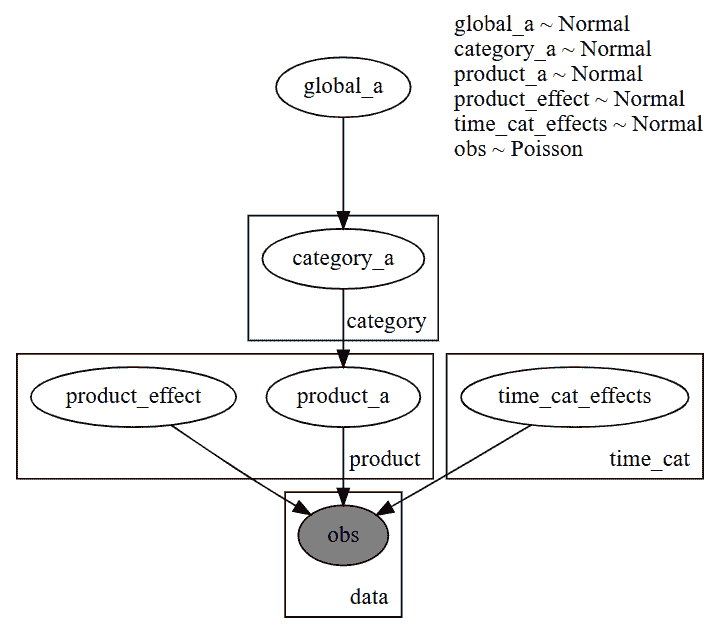
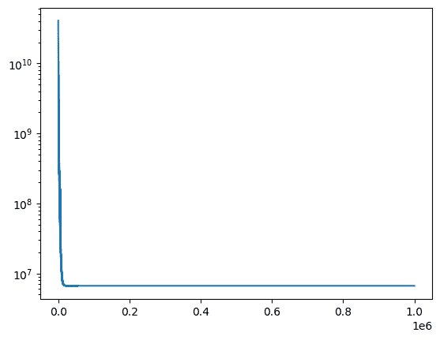
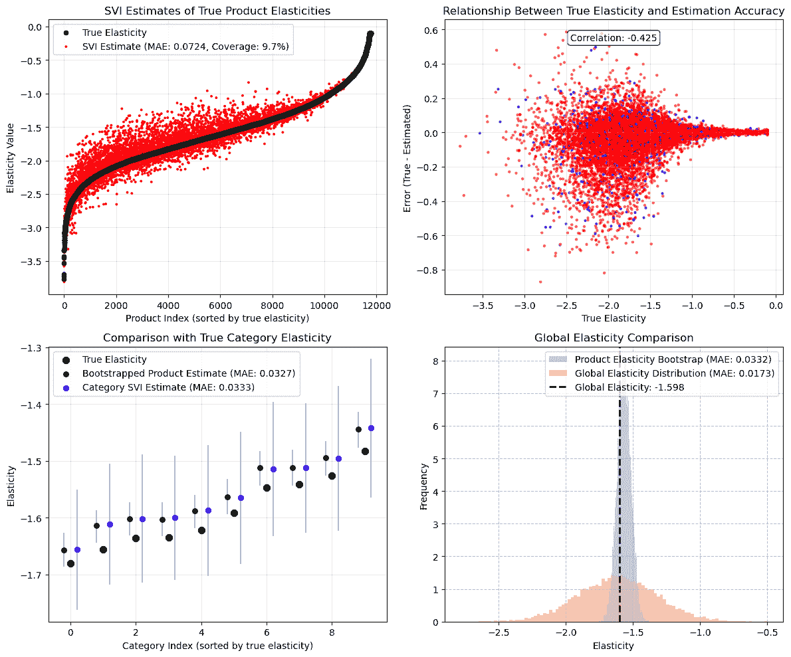

# 使用分层贝叶斯估计产品级价格弹性

> 原文：[`towardsdatascience.com/estimating-product-level-price-elasticities-using-hierarchical-bayesian/`](https://towardsdatascience.com/estimating-product-level-price-elasticities-using-hierarchical-bayesian/)

在本文中，我将向您介绍分层贝叶斯（HB）建模，这是一种灵活的方法，可以自动结合多个子模型的结果。这种方法通过贝叶斯更新，最优地结合不同数据分组的信息来估计个体层面的效应。当个体单位观察有限但与其他单位共享共同特征/行为时，这一点尤其有价值。

以下部分将介绍该方法的理念、实施和替代用例。

### 传统方法的局限性

作为应用，想象一下我们是一家大型杂货店，试图通过设定价格来最大化产品级收入。我们需要估计每个产品的需求曲线（弹性），然后优化一些利润最大化函数。作为这项工作的第一步，我们需要估计给定 $i \in N$ 个产品在 $t \in T$ 个时期的长序列数据中的需求价格弹性（需求对价格 1%变化的反应程度）。记住，需求价格弹性定义为：

$$\beta=\frac{\partial \log{\textrm{Units}}_{it}}{\partial \log \textrm{Price}_{it}}$$

假设没有混杂因素，我们可以使用对数线性[固定效应回归模型](https://theeffectbook.net/ch-FixedEffects.html)来估计我们感兴趣的参数：

$$\log(\textrm{Units}_{it})= \beta \log(\textrm{Price})_{it} +\gamma_{c(i),t}+ \delta_i+ \epsilon_{it}$$

<mdspan datatext="el1748030373035" class="mdspan-comment">其中</mdspan> $\gamma_{c(i),t}$ 是一组按类别-时间虚拟变量，用于捕捉每个类别-时间期间的平均需求，而 $\delta_i$ 是一组产品虚拟变量，用于捕捉每个产品的需求位移。这种“固定效应”公式在许多基于回归的模型中是标准且常见的，用于控制不可观测的混杂因素。这个（合并的）回归模型使我们能够恢复所有 $N$ 个单位的平均弹性 $\beta$。这意味着商店可以针对其店内所有产品的平均价格水平进行定位，以最大化收入：

$$\underset{\textrm{Price}_t}{\max} \;\;\; \textrm{Price}_{t}\cdot\mathbb{E}(\textrm{Quantity}_{t} | \textrm{Price}_{t}, \beta)$$

如果这些单位有自然的分组（产品类别），我们可能可以通过为每个类别运行单独的回归（或交互价格弹性和产品类别）来识别每个类别的平均弹性，仅使用该类别的单位。这意味着商店可以针对每个类别的平均价格进行定位，以最大化特定类别的收入，从而：

$$\underset{\textrm{Price}_{c(i),t}}{\max} \;\;\; \textrm{Price}_{c(i),t}\cdot\mathbb{E}(\textrm{Quantity}_{c(i),t} | \textrm{Price}_{c(i),t}, \beta_{c(i)})$$

如果数据足够充分，我们甚至可以为每个产品运行单独的回归，以获得更细粒度的弹性。

然而，现实世界的数据常常带来挑战：一些产品价格变化最小，销售历史短暂，或类别之间存在不平衡。在这些限制下，运行单独的回归以识别产品弹性可能会导致标准误差很大，并且对 $\beta$ 的识别较弱。HB 模型通过允许我们在不同分组之间共享统计力量，同时保持异质性，从而解决了这些问题，使我们能够获得感兴趣系数的细粒度估计。使用 HB 公式，我们可以在产品级别恢复弹性，同时运行一个单一的回归（如合并案例），从而允许进行细粒度优化。

### 理解层次贝叶斯模型

在其核心，HB 是关于识别我们数据中的自然结构。我们不是将所有观察值视为完全独立（许多单独的回归）或强迫它们遵循相同的模式（一个合并回归），而是承认观察值可以聚集成组，每个组内的产品共享相似的模式。“层次”方面指的是我们如何在不同级别组织我们的参数。在其最基本的形式中，我们可能有：

+   适用于所有数据的全局参数。

+   适用于该组内观察值的组级参数。

+   适用于每个特定个体的个体级参数。

这种方法足够灵活，可以根据需要添加或删除层次结构，取决于所需的合并水平。例如，如果我们认为类别之间没有相似性，我们可以移除全局参数。如果我们认为这些产品没有自然的分组，我们可以移除组级参数。如果我们只关心组级效应，我们可以移除个体级参数，并将组级系数作为我们最细粒度的参数。如果组内存在嵌套的子组，我们可以添加另一个层次层。可能性是无限的！

“贝叶斯”方面指的是我们如何根据观察到的数据更新对这些参数的信念。我们首先从一个代表我们对这些参数初始信念的先验分布开始，然后迭代地更新它们以恢复一个后验分布，该分布结合了数据的信息。在实践中，这意味着我们使用全局级别的估计来告知我们的组级别估计，以及组级别参数来告知单位级别参数。观察数量较多的单位允许有更大的偏差，而观察数量有限的单位则被拉向平均值。

让我们通过我们的价格弹性示例来正式化这一点，其中我们（理想情况下）想要恢复单位级别的价格弹性。我们估计：

$$\log(\textrm{Units}_{it})= \beta_i \log(\textrm{Price})_{it} +\gamma_{c(i),t} + \delta_i + \epsilon_{it}$$

其中：

+   $\beta_i \sim \textrm{Normal}(\beta_{c\left(i\right)},\sigma_i)$

+   $\beta_{c(i)}\sim \textrm{Normal}(\beta_g,\sigma_{c(i)})$

+   $\beta_g\sim \textrm{Normal}(\mu,\sigma)$

与第一个方程的唯一区别是我们将全局 $\beta$ 项替换为产品级别的 $\beta_i$。我们指定单位级别的弹性 $\beta_i$ 是从围绕类别级别弹性平均值 $\beta_{c(i)}$ 的正态分布中抽取的，而 $\beta_{c(i)}$ 是从为所有组共享的全局弹性 $\beta_g$ 中抽取的。对于分布的 $\sigma$ 范围，我们也可以假设一个分层结构，但在本例中，我们只为它们设置基本的先验，以保持简单。对于这个应用，我们假设先验信念为：${ \mu= -2, \sigma= 1, \sigma_{c(i)}=1, \sigma_i=1}$。这种先验公式的假设是全球弹性是弹性的，95% 的弹性介于 -4 和 0 之间，每个分层级别的标准差为 1。为了测试这些先验是否正确指定，我们会进行 [先验预测检查](https://www.pymc.io/projects/docs/en/stable/learn/core_notebooks/posterior_predictive.html)（本文未涉及）以查看我们的先验信念是否可以恢复我们观察到的数据。

这种分层结构允许同一类别和跨类别之间的信息流动。如果一个特定产品的价格变动数据有限，其弹性将趋向于该类别的弹性 $\beta_{c(i)}$。同样，产品较少的类别将更多地受到全球弹性的影响，其平均值来自所有类别的弹性。这种方法的优点在于，“汇总”的程度是自动根据数据发生的。价格变动较多的产品将保持更接近其个别数据模式的估计，而数据稀疏的产品将从其群体中借用更多的力量。

## 实现

在本节中，我们使用 Python 中的 Numpyro 包实现上述模型，这是一个由 JAX 提供自动微分和 JIT 编译到 GPU/TPU/CPU 的轻量级概率编程语言。我们首先生成我们的合成数据，定义模型，并将模型拟合到数据中。我们以一些结果的可视化结束。

### 数据生成过程

我们模拟的销售数据中，需求遵循与价格的对数线性关系，产品级别的弹性由高斯分布 $\beta_i \sim \textrm{Normal}(-2, 0.7)$ 生成。我们每次周期以 50%的概率添加随机价格变化，类别特定的时间趋势和随机噪声。这通过乘法添加以生成我们的对数预期需求。从对数预期需求中，我们进行指数运算以获得实际需求，并从泊松分布中抽取实际销售单位。然后我们过滤掉只销售超过 100 个单位的单位（有助于估计的准确性，但不是必要步骤），剩下 $N=11,798$ 个产品在 $T = 156$ 个周期内（3 年的周数据）。从这个数据集中，真正的全球弹性是 $\beta_g = -1.6$，类别级别的弹性范围在 $\beta_{c(i)} \in [-1.68, -1.48]$。

请记住，这个数据生成过程忽略了现实世界中的许多复杂性。我们没有对可能同时影响价格和需求的因素（如促销）进行建模，也没有对混杂因素进行建模。这个例子纯粹是为了说明，在模型规定良好的情况下，我们可以恢复特定产品的弹性，并不旨在涵盖如何正确识别价格是外生的。然而，我建议感兴趣的读者参考[Causal Inference for the Brave and True](https://matheusfacure.github.io/python-causality-handbook/landing-page.html)以了解因果推断的介绍。

```py
 import numpy as np
import pandas as pd

def generate_price_elasticity_data(N: int = 1000,
                                   C: int = 10,
                                   T: int = 50,
                                   price_change_prob: float = 0.2,
                                   seed = 42) -> pd.DataFrame:
    """
    Generate synthetic data for price elasticity of demand analysis.
    Data is generated by
    """
    if seed is not None:
        np.random.seed(seed)

    # Category demand and trends
    category_base_demand = np.random.uniform(1000, 10000, C)
    category_time_trends = np.random.uniform(0, 0.01, C)
    category_volatility = np.random.uniform(0.01, 0.05, C)  # Random volatility for each category
    category_demand_paths = np.zeros((C, T))
    category_demand_paths[:, 0] = 1.0
    shocks = np.random.normal(0, 1, (C, T-1)) * category_volatility[:, np.newaxis]
    trends = category_time_trends[:, np.newaxis] * np.ones((C, T-1))
    cumulative_effects = np.cumsum(trends + shocks, axis=1)
    category_demand_paths[:, 1:] = category_demand_paths[:, 0:1] + cumulative_effects

    # product effects
    product_categories = np.random.randint(0, C, N)
    product_a = np.random.normal(-2, .7, size=N)
    product_a = np.clip(product_a, -5, -.1)

    # Initial prices for each product
    initial_prices = np.random.uniform(100, 1000, N)
    prices = np.zeros((N, T))
    prices[:, 0] = initial_prices

    # Generate random values and whether prices changed
    random_values = np.random.rand(N, T-1)
    change_mask = random_values < price_change_prob

    # Generate change factors (-20% to +20%)
    change_factors = 1 + np.random.uniform(-0.2, 0.2, size=(N, T-1))

    # Create a matrix to hold multipliers
    multipliers = np.ones((N, T-1))

    # Apply change factors only where changes should occur
    multipliers[change_mask] = change_factors[change_mask]

    # Apply the changes cumulatively to propagate prices
    for t in range(1, T):
        prices[:, t] = prices[:, t-1] * multipliers[:, t-1]

    # Generate product-specific multipliers
    product_multipliers = np.random.lognormal(3, 0.5, size=N)
    # Get time effects for each product's category (shape: N x T)
    time_effects = category_demand_paths[product_categories][:, np.newaxis, :].squeeze(1)

    # Ensure time effects don't go negative
    time_effects = np.maximum(0.1, time_effects)

    # Generate period noise for all products and time periods
    period_noise = 1 + np.random.uniform(-0.05, 0.05, size=(N, T))

    # Get category base demand for each product
    category_base = category_base_demand[product_categories]

    # Calculate base demand
    base_demand = (category_base[:, np.newaxis] *
                   product_multipliers[:, np.newaxis] *
                   time_effects *
                   period_noise)

    # log demand
    alpha_ijt = np.log(base_demand)

    # log price
    log_prices = np.log(prices)

    # log expected demand
    log_lambda = alpha_ijt + product_a[:, np.newaxis] * log_prices

    # Convert back from log space to get rate parameters
    lambda_vals = np.exp(log_lambda)

    # Generate units sold
    units_sold = np.random.poisson(lambda_vals)  # Shape: (N, T)

    # Create index arrays for all combinations of products and time periods
    product_indices, time_indices = np.meshgrid(np.arange(N), np.arange(T), indexing='ij')
    product_indices = product_indices.flatten()
    time_indices = time_indices.flatten()

    # Get categories for all products
    categories = product_categories[product_indices]

    # Get all prices and units sold
    all_prices = np.round(prices[product_indices, time_indices], 2)
    all_units_sold = units_sold[product_indices, time_indices]

    # Calculate elasticities
    product_elasticity = product_a[product_indices]

    df = pd.DataFrame({
        'product': product_indices,
        'category': categories,
        'time_period': time_indices,
        'price': all_prices,
        'units_sold': all_units_sold,
        'product_elasticity': product_elasticity
    })

    return df

# Keep only units with >X sales
def filter_dataframe(df, min_units = 100):
    temp = df[['product','units_sold']].groupby('product').sum().reset_index()
    unit_filter = temp[temp.units_sold>min_units]['product'].unique()
    filtered_df = df[df['product'].isin(unit_filter)].copy()

    # Summary
    original_product_count = df['product'].nunique()
    remaining_product_count = filtered_df['product'].nunique()
    filtered_out = original_product_count - remaining_product_count

    print(f"Filtering summary:")
    print(f"- Original number of products: {original_product_count}")
    print(f"- Products with > {min_units} units: {remaining_product_count}")
    print(f"- Products filtered out: {filtered_out} ({filtered_out/original_product_count:.1%})")

    # Global and category elasticity
    global_elasticity = filtered_df['product_elasticity'].mean()
    filtered_df['global_elasticity'] = global_elasticity

    # Category elasticity
    category_elasticities = filtered_df.groupby('category')['product_elasticity'].mean().reset_index()
    category_elasticities.columns = ['category', 'category_elasticity']
    filtered_df = filtered_df.merge(category_elasticities, on='category', how='left')

    # Summary
    print(f"\nElasticity Information:")
    print(f"- Global elasticity: {global_elasticity:.3f}")
    print(f"- Category elasticities range: {category_elasticities['category_elasticity'].min():.3f} to {category_elasticities['category_elasticity'].max():.3f}")

    return filtered_df

df = generate_price_elasticity_data(N = 20000, T = 156, price_change_prob=.5, seed=42)
df = filter_dataframe(df)
df.loc[:,'cat_by_time'] = df['category'].astype(str) + '-' + df['time_period'].astype(str)
df.head() 
```

过滤摘要：

+   原始产品数量：20000

+   单位数超过 100 的产品：11798

+   过滤掉的产品数量：8202（41.0%）

弹性信息：

+   全球弹性：-1.598

+   类别弹性范围：-1.681 至-1.482

| product | category | time_period | price | units_sold | product_elasticity | category_elasticity | global_elasticity | cat_by_time |
| --- | --- | --- | --- | --- | --- | --- | --- | --- |
| 0 | 8 | 0 | 125.95 | 550 | -1.185907 | -1.63475 | -1.597683 | 8-0 |
| 0 | 8 | 1 | 125.95 | 504 | -1.185907 | -1.63475 | -1.597683 | 8-1 |
| 0 | 8 | 2 | 149.59 | 388 | -1.185907 | -1.63475 | -1.597683 | 8-2 |
| 0 | 8 | 3 | 149.59 | 349 | -1.185907 | -1.63475 | -1.597683 | 8-3 |
| 0 | 8 | 4 | 176.56 | 287 | -1.185907 | -1.63475 | -1.597683 | 8-4 |

### 模型

我们首先使用 `pd.factorize()` 创建产品、类别以及类别-时间组合的索引。这使我们能够为每个观测值选择正确的参数。然后，我们将价格（取对数）和单位序列转换为 JAX 数组，然后创建与我们的参数组相对应的板。这些板存储了每个层级参数的值，以及表示固定效应的参数。

该模型使用 NumPyro 的板来定义参数组：

+   `global_a`：1 个全局价格弹性参数，具有 $\textrm{Normal}(-2, 1)$ 先验。

+   `category_a`：$C=10$ 个类别级弹性参数，其先验值以全局参数为中心，标准差为 1。

+   `product_a`：$N=11,798$ 个产品特定的弹性参数，其先验值以各自的类别参数为中心，标准差为 1。

+   `product_effect`：$N=11,798$ 个产品特定的基线需求效应，标准差为 3。

+   `time_cat_effects`：$(T=156)\cdot(C=10)$ 每个类别-时间组合的时间变化效应，标准差为 3。

然后，我们使用 `LocScaleReparam()` 参数重新参数化参数，以提高采样效率并避免漏斗效应。在创建参数后，我们计算对数预期需求，然后将其转换回一个带有剪辑的率参数，以保持数值稳定性。最后，我们调用数据板从具有计算出的率参数的泊松分布中进行采样。优化算法然后将找到最佳拟合数据的参数值，使用随机梯度下降。以下是对模型进行图形表示，以展示参数之间的关系。



```py
 import jax
import jax.numpy as jnp
import numpyro
import numpyro.distributions as dist
from numpyro.infer.reparam import LocScaleReparam

def model(df: pd.DataFrame, outcome: None):
    # Define indexes
    product_idx, unique_product = pd.factorize(df['product'])
    cat_idx, unique_category = pd.factorize(df['category'])
    time_cat_idx, unique_time_cat = pd.factorize(df['cat_by_time'])

    # Convert the price and units series to jax arrays
    log_price = jnp.log(df.price.values)
    outcome = jnp.array(outcome) if outcome is not None else None

    # Generate mapping
    product_to_category = jnp.array(pd.DataFrame({'product': product_idx, 'category': cat_idx}).drop_duplicates().category.values, dtype=np.int16)

    # Create the plates to store parameters
    category_plate = numpyro.plate("category", unique_category.shape[0])
    time_cat_plate = numpyro.plate("time_cat", unique_time_cat.shape[0])
    product_plate = numpyro.plate("product", unique_product.shape[0])
    data_plate = numpyro.plate("data", size=outcome.shape[0])

    # DEFINING MODEL PARAMETERS
    global_a = numpyro.sample("global_a", dist.Normal(-2, 1), infer={"reparam": LocScaleReparam()})

    with category_plate:
        category_a = numpyro.sample("category_a", dist.Normal(global_a, 1), infer={"reparam": LocScaleReparam()})

    with product_plate:
        product_a = numpyro.sample("product_a", dist.Normal(category_a[product_to_category], 2), infer={"reparam": LocScaleReparam()})
        product_effect = numpyro.sample("product_effect", dist.Normal(0, 3))

    with time_cat_plate:
        time_cat_effects = numpyro.sample("time_cat_effects", dist.Normal(0, 3))

    # Calculating expected demand
    def calculate_demand():
        log_demand = product_a[product_idx]*log_price + time_cat_effects[time_cat_idx] + product_effect[product_idx]
        expected_demand = jnp.exp(jnp.clip(log_demand, -4, 20)) # clip for stability 
        return expected_demand

    demand = calculate_demand()

    with data_plate:
        numpyro.sample(
            "obs",
            dist.Poisson(demand),
            obs=outcome
        )

numpyro.render_model(
    model=model,
    model_kwargs={"df": df,"outcome": df['units_sold']},
    render_distributions=True,
    render_params=True,
) 
```

### 估计

虽然有多种方法可以估计这个方程，但我们在这次特定应用中使用了 [Stochastic Variational Inference](https://jmlr.org/papers/volume14/hoffman13a/hoffman13a.pdf)（SVI）。作为一个概述，SVI 是一种基于梯度的优化方法，通过最小化 ELBO 来最小化提议的后验分布与真实后验分布之间的 KL 散度。这与 [Markov-Chain Monte Carlo](https://www.publichealth.columbia.edu/research/population-health-methods/markov-chain-monte-carlo)（MCMC）不同，MCMC 直接从真实后验分布中采样。在实际应用中，SVI 更高效，并且可以轻松扩展到大型数据集。对于这个应用，我们设置了一个随机种子，初始化了指南（后验分布的家族，假设为对角正态分布），在 Optax 中定义了学习率计划和优化器，并运行了 1,000,000 次迭代（大约需要 1 小时）。虽然模型可能在此之前已经收敛，但在运行了 1,000,000 次迭代后，损失仍然略有改善。最后，我们绘制了（对数）损失图。



```py
 from numpyro.infer import SVI, Trace_ELBO, autoguide, init_to_sample
import optax
import matplotlib.pyplot as plt

rng_key = jax.random.PRNGKey(42)
guide = autoguide.AutoNormal(model, init_loc_fn=init_to_sample)
# Define a learning rate schedule
learning_rate_schedule = optax.exponential_decay(
    init_value=0.01,
    transition_steps=1000,
    decay_rate=0.99,
    staircase = False,
    end_value = 1e-5,
)

# Define the optimizer
optimizer = optax.adamw(learning_rate=learning_rate_schedule)
svi = SVI(model, guide, optimizer, loss=Trace_ELBO(num_particles=8, vectorize_particles = True))

# Run SVI
svi_result = svi.run(rng_key, 1_000_000, df, df['units_sold'])
plt.semilogy(svi_result.losses); 
```

**恢复后验样本**

一旦模型训练完成，我们可以通过输入结果参数和初始数据集来恢复参数的后验分布。由于 Numpyro 在非正态分布的后端使用仿射变换，我们不能直接调用参数`svi_result.params`。因此，我们从后验分布中采样 1000 次，并计算我们模型中每个参数的均值和标准差。以下代码的最后一部分创建了一个包含每个产品在每个层级上估计弹性的 dataframe，然后我们将它合并回原始 dataframe 以测试算法是否恢复了真实的弹性。

```py
 predictive = numpyro.infer.Predictive(
    autoguide.AutoNormal(model, init_loc_fn=init_to_sample),
    params=svi_result.params,
    num_samples=1000
)

samples = predictive(rng_key, df, df['units_sold'])

# Extract means and std dev
results = {}
excluded_keys = ['product_effect', 'time_cat_effects']
for k, v in samples.items():
    if k not in excluded_keys:
        results[f"{k}"] = np.mean(v, axis=0)
        results[f"{k}_std"] = np.std(v, axis=0)

# product elasticity estimates
prod_elasticity_df = pd.DataFrame({
    'product': df['product'].unique(),
    'product_elasticity_svi': results['product_a'],
    'product_elasticity_svi_std': results['product_a_std'],
})
result_df = df.merge(prod_elasticity_df, on='product', how='left')

# Category elasticity estimates
prod_elasticity_df = pd.DataFrame({
    'category': df['category'].unique(),
    'category_elasticity_svi': results['category_a'],
    'category_elasticity_svi_std': results['category_a_std'],
})
result_df = result_df.merge(prod_elasticity_df, on='category', how='left')

# Global elasticity estimates
result_df['global_a_svi'] = results['global_a']
result_df['global_a_svi_std'] = results['global_a_std']
result_df.head() 
```

| 产品 | 类别 | 时间段 | 价格 | 销售单位 | 产品弹性 | 类别弹性 | 全球弹性 | 按时间分类 | 产品弹性 _svi | 产品弹性 _svi_std | 类别弹性 _svi | 类别弹性 _svi_std | 全球 _a_svi | 全球 _a_svi_std |
| --- | --- | --- | --- | --- | --- | --- | --- | --- | --- | --- | --- | --- | --- | --- |
| 0 | 8 | 0 | 125.95 | 550 | -1.185907 | -1.63475 | -1.597683 | 8-0 | -1.180956 | 0.000809 | -1.559872 | 0.027621 | -1.5550271 | 0.2952548 |
| 0 | 8 | 1 | 125.95 | 504 | -1.185907 | -1.63475 | -1.597683 | 8-1 | -1.180956 | 0.000809 | -1.559872 | 0.027621 | -1.5550271 | 0.2952548 |
| 0 | 8 | 2 | 149.59 | 388 | -1.185907 | -1.63475 | -1.597683 | 8-2 | -1.180956 | 0.000809 | -1.559872 | 0.027621 | -1.5550271 | 0.2952548 |
| 0 | 8 | 3 | 149.59 | 349 | -1.185907 | -1.63475 | -1.597683 | 8-3 | -1.180956 | 0.000809 | -1.559872 | 0.027621 | -1.5550271 | 0.2952548 |
| 0 | 8 | 4 | 176.56 | 287 | -1.185907 | -1.63475 | -1.597683 | 8-4 | -1.180956 | 0.000809 | -1.559872 | 0.027621 | -1.5550271 | 0.2952548 |

### 结果

下面的代码绘制了每个产品的真实和估计弹性。每个点按其真实弹性值（黑色）排序，并显示了模型估计的弹性。我们可以看到估计的弹性遵循真实弹性的路径，平均绝对误差约为 0.0724。红色点表示 95%置信区间不包含真实弹性的产品，而蓝色点表示 95%置信区间包含真实弹性的产品。鉴于全局平均值为-1.598，这表示在产品层面的平均误差为 4.5%。我们可以看到 SVI 估计紧密遵循真实弹性的模式，但有一些噪声，尤其是在弹性越来越负的情况下。在右上角的面板中，我们绘制了估计弹性误差与真实弹性值之间的关系。随着真实弹性变得越来越负，我们的模型变得越来越不准确。

对于类别级和全局级弹性，我们可以使用两种方法来创建后验。我们可以在类别内对所有产品级弹性进行[bootstrap](https://en.wikipedia.org/wiki/Bootstrapping_(statistics))，或者直接从后验参数中获得类别级估计。当我们查看左下角的类别级弹性估计时，我们可以看到，从模型中恢复的类别级估计和从产品级弹性中 bootstrap 的样本都略微偏向于零，MAE 约为 0.033。然而，类别级参数给出的置信区间覆盖了真实参数，而与 bootstrap 的产品级估计不同。这表明在确定组级弹性时，我们应该直接使用组级参数，而不是对更细粒度的估计进行 bootstrap。当查看全局级时，两种方法都包含在 95%置信区间内的真实参数估计，全局参数的表现优于产品级 bootstrap，但代价是标准误差更大。

**考虑事项**

1.  **HB 低估后验方差：** 使用 SVI 进行估计的一个缺点是它[低估了后验方差](https://arxiv.org/pdf/1903.00617)。虽然我们将在后面的文章中详细讨论这个话题，但 SVI 的目标函数只考虑了我们假设的分布与真实分布之间期望值的差异。这意味着它没有考虑后验中参数之间的完整相关性结构。SVI 中常用到的均值场近似假设条件（基于先前层次抽样的）参数之间是独立的，这忽略了同一层次内产品之间的任何协方差。这意味着如果有任何溢出效应（如侵占或交叉价格弹性），则不会在置信区间中考虑。由于这种均值场假设，不确定性估计往往过于自信，导致置信区间过窄，无法以预期的速率正确捕捉真实参数值。我们可以在左上角的图中看到，只有 9.7%的产品级弹性覆盖了它们的真实弹性。在后续的文章中，我们将包括一些[解决方案](https://proceedings.neurips.cc/paper_files/paper/2015/file/4b0a59ddf11c58e7446c9df0da541a84-Paper.pdf)来解决这个问题。

1.  **先验的重要性**：在使用 HB（Hierarchical Bayesian）模型时，与标准贝叶斯方法相比，先验信息的重要性显著增加。虽然大型数据集通常允许似然函数在估计全局参数时主导先验，但层次结构会改变这种动态，并减少每个层次的有效样本量。在我们的模型中，全局参数只能看到 10 个类别级别的观测值（而不是完整的数据集），类别仅从其包含的产品中抽取，而产品则完全依赖于它们自己的观测值。这种减少的有效样本量导致收缩效应，其中异常估计（如非常负的弹性）会被拉向其类别均值。这突出了[先验预测检查](https://www.pymc.io/projects/docs/en/stable/learn/core_notebooks/posterior_predictive.html)的重要性，因为错误的先验设定将对结果产生不成比例的影响。



```py
 def elasticity_plots(result_df, results=None):
    # Create the figure with 2x2 grid
    fig = plt.figure(figsize=(12, 10))
    gs = fig.add_gridspec(2, 2)

    # product elasticity
    ax1 = fig.add_subplot(gs[0, 0])

    # Data prep
    df_product = result_df[['product','product_elasticity','product_elasticity_svi','product_elasticity_svi_std']].drop_duplicates()
    df_product['product_elasticity_svi_lb'] = df_product['product_elasticity_svi'] - 1.96*df_product['product_elasticity_svi_std']
    df_product['product_elasticity_svi_ub'] = df_product['product_elasticity_svi'] + 1.96*df_product['product_elasticity_svi_std']
    df_product = df_product.sort_values('product_elasticity')
    mae_product = np.mean(np.abs(df_product.product_elasticity-df_product.product_elasticity_svi))
    colors = []
    for i, row in df_product.iterrows():
        if (row['product_elasticity'] >= row['product_elasticity_svi_lb'] and 
            row['product_elasticity'] <= row['product_elasticity_svi_ub']):
            colors.append('blue')  # Within CI bounds
        else:
            colors.append('red')   # Outside CI bounds

    # Percentage of points within bounds
    within_bounds_pct = colors.count('blue') / len(colors) * 100

    # Plot data
    ax1.scatter(range(len(df_product)), df_product['product_elasticity'], 
                color='black', label='True Elasticity', s=20, zorder=3)

    ax1.scatter(range(len(df_product)), df_product['product_elasticity_svi'], 
                color=colors, label=f'SVI Estimate (MAE: {mae_product:.4f}, Coverage: {within_bounds_pct:.1f}%)', 
                s=3, zorder=2)
    ax1.set_xlabel('Product Index (sorted by true elasticity)')
    ax1.set_ylabel('Elasticity Value')
    ax1.set_title('SVI Estimates of True Product Elasticities')
    ax1.legend()
    ax1.grid(alpha=0.3)

    # Relationship between MAE and true elasticity
    ax2 = fig.add_subplot(gs[0, 1])

    # Calculate MAE for each product
    temp = result_df[['product','product_elasticity', 'product_elasticity_svi']].drop_duplicates().copy()
    temp['product_error'] = temp['product_elasticity'] - temp['product_elasticity_svi']
    temp['product_mae'] = np.abs(temp['product_error'])
    correlation = temp[['product_mae', 'product_elasticity']].corr()

    # Plot data
    ax2.scatter(temp['product_elasticity'], temp['product_error'], alpha=0.5, s=5, color = colors)
    ax2.set_xlabel('True Elasticity')
    ax2.set_ylabel('Error (True - Estimated)')
    ax2.set_title('Relationship Between True Elasticity and Estimation Accuracy')
    ax2.grid(alpha=0.3)
    ax2.text(0.5, 0.95, f"Correlation: {correlation.iloc[0,1]:.3f}", 
                transform=ax2.transAxes, ha='center', va='top',
                bbox=dict(boxstyle='round', facecolor='white', alpha=0.7))

    # Category Elasticity
    ax3 = fig.add_subplot(gs[1, 0])

    # Unique categories and elasticities
    category_data = result_df[['category', 'category_elasticity', 'category_elasticity_svi', 'category_elasticity_svi_std']].drop_duplicates()
    category_data = category_data.sort_values('category_elasticity')

    # Bootstrapped means from product elasticities within each category
    bootstrap_means = []
    bootstrap_ci_lower = []
    bootstrap_ci_upper = []

    for cat in category_data['category']:
        # Get product elasticities for this category
        prod_elasticities = result_df[result_df['category'] == cat]['product_elasticity_svi'].unique()

        # Bootstrap means
        boot_means = [np.mean(np.random.choice(prod_elasticities, size=len(prod_elasticities), replace=True)) 
                     for _ in range(1000)]

        bootstrap_means.append(np.mean(boot_means))
        bootstrap_ci_lower.append(np.percentile(boot_means, 2.5))
        bootstrap_ci_upper.append(np.percentile(boot_means, 97.5))

    category_data['bootstrap_mean'] = bootstrap_means
    category_data['bootstrap_ci_lower'] = bootstrap_ci_lower
    category_data['bootstrap_ci_upper'] = bootstrap_ci_upper

    # Calculate MAE
    mae_category_svi = np.mean(np.abs(category_data['category_elasticity_svi'] - category_data['category_elasticity']))
    mae_bootstrap = np.mean(np.abs(category_data['bootstrap_mean'] - category_data['category_elasticity']))

    # Plot the data
    left_offset = -0.2
    right_offset = 0.2
    x_range = range(len(category_data))
    ax3.scatter(x_range, category_data['category_elasticity'], 
                color='black', label='True Elasticity', s=50, zorder=3)

    # Bootstrapped product elasticity
    ax3.scatter([x + left_offset for x in x_range], category_data['bootstrap_mean'], 
                color='green', label=f'Bootstrapped Product Estimate (MAE: {mae_bootstrap:.4f})', s=30, zorder=2)
    for i in x_range:
        ax3.plot([i + left_offset, i + left_offset], 
                [category_data['bootstrap_ci_lower'].iloc[i], category_data['bootstrap_ci_upper'].iloc[i]], 
                color='green', alpha=0.3, zorder=1)

    # category-level SVI estimates
    ax3.scatter([x + right_offset for x in x_range], category_data['category_elasticity_svi'], 
                color='blue', label=f'Category SVI Estimate (MAE: {mae_category_svi:.4f})', s=30, zorder=2)
    for i in x_range:
        ci_lower = category_data['category_elasticity_svi'].iloc[i] - 1.96 * category_data['category_elasticity_svi_std'].iloc[i]
        ci_upper = category_data['category_elasticity_svi'].iloc[i] + 1.96 * category_data['category_elasticity_svi_std'].iloc[i]
        ax3.plot([i + right_offset, i + right_offset], [ci_lower, ci_upper], color='blue', alpha=0.3, zorder=1)

    ax3.set_xlabel('Category Index (sorted by true elasticity)')
    ax3.set_ylabel('Elasticity')
    ax3.set_title('Comparison with True Category Elasticity')
    ax3.legend()
    ax3.grid(alpha=0.3)

    # global elasticity
    ax4 = fig.add_subplot(gs[1, 1])
    temp = result_df[['product','product_elasticity_svi','global_elasticity']].drop_duplicates()
    bootstrap_means = [np.mean(np.random.choice(np.array(temp['product_elasticity_svi']), 100)) for i in range(10000)]
    global_means = np.random.normal(result_df['global_a_svi'].iloc[0], result_df['global_a_svi_std'].iloc[0], 10000)
    true_global = np.unique(temp.global_elasticity)[0]
    p_mae = np.abs(np.mean(bootstrap_means) - true_global)
    g_mae = np.abs(np.mean(global_means) - true_global)

    # Plot data
    ax4.hist(bootstrap_means, bins=100, alpha=0.3, density=True, 
             label=f'Product Elasticity Bootstrap (MAE: {p_mae:.4f})')
    ax4.hist(global_means, bins=100, alpha=0.3, density=True, 
             label=f'Global Elasticity Distribution (MAE: {g_mae:.4f})')
    ax4.axvline(x=true_global, color='black', linestyle='--', linewidth=2, 
                label=f'Global Elasticity: {true_global:.3f}', zorder=0)
    ax4.set_xlabel('Elasticity')
    ax4.set_ylabel('Frequency')
    ax4.set_title('Global Elasticity Comparison')
    ax4.legend()
    ax4.grid(True, linestyle='--', alpha=0.7)

    # Show
    plt.tight_layout()
    plt.show()

elasticity_plots(result_df) 
```

## 结论

**其他用途**：除了估计需求的价格弹性外，HB 模型在数据科学中还有各种其他用途。在零售领域，HB 模型可以预测现有商店的需求，并通过从已经建立并处于同一层次结构中的商店/网络借用信息来解决新商店的冷启动问题。对于推荐系统，HB 可以从用户和项目级别的特征组合中估计用户级别的偏好。这种结构使得可以根据群体行为向新用户提供相关推荐，随着用户历史记录的积累，逐渐过渡到个性化推荐。如果无法轻松获得群体分组，可以使用 K-means 根据其特征对相似单位进行分组。

最后，这些模型也可以用来结合实验研究和观察研究的结果。科学家可以使用历史观察提升估计（广告提升）并补充以新开发的 A/B 测试，通过结合先验知识来减少实验所需的样本量。这种方法创建了一个持续的学习框架，其中每个新的实验都是基于之前的发现而不是从头开始。对于面临资源限制的团队来说，这意味着更快的洞察时间（尤其是当与[代理模型](https://www.nber.org/system/files/working_papers/w26463/w26463.pdf)结合使用时）和更高效的实验流程。

**结语**：虽然本介绍已经强调了层次贝叶斯模型的一些应用，但我们只是触及了表面。我们没有深入探讨诸如先验和后验预测检查、正式的拟合优度评估、计算缩放、分布式训练、估计策略的性能（MCMC vs. SVI）和非嵌套层次结构等细粒度实现方面，每个方面都值得一篇单独的文章。

尽管如此，这个概述应该为将层次贝叶斯方法融入您的工具箱提供一个实用的起点。这些模型提供了一个框架来处理（通常）混乱的多级数据结构，这在现实世界的商业问题中经常遇到。随着您开始实施这些方法，我很乐意了解您的经验、挑战、成功以及这类模型的新应用案例，因此请通过我的电子邮件或[LinkedIn](https://www.linkedin.com/in/derek-tran-ab75ab64/)与我联系。如果您对这篇文章有任何反馈，或者想要请求因果推理/机器学习方面的其他主题，也请随时与我联系。感谢您阅读！

**注意：** 本文中所使用的所有图片均由作者生成。
