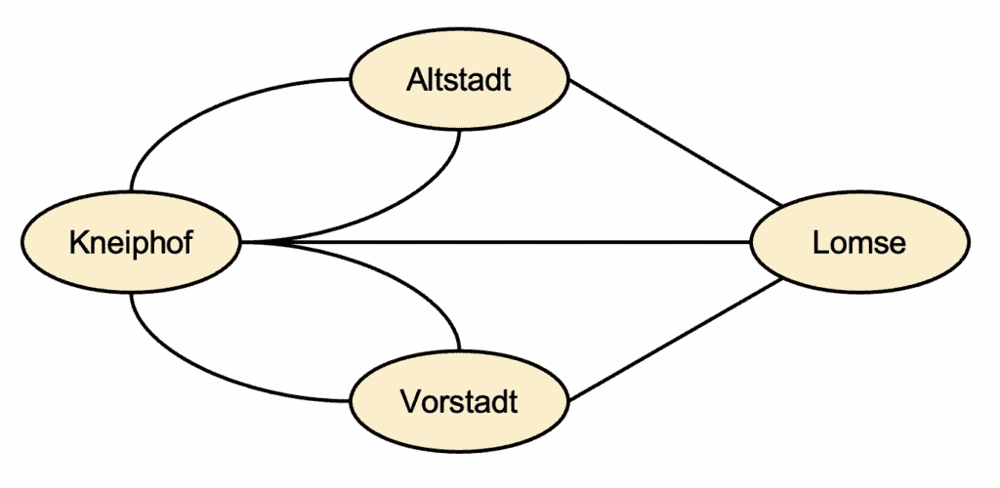
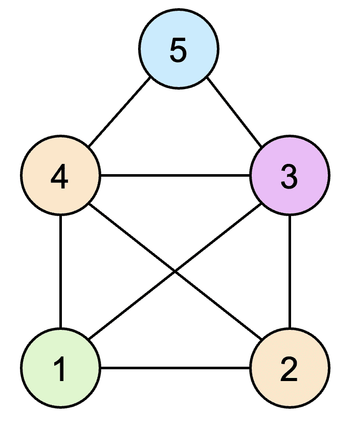

# 欧拉旋律：音乐作曲的图算法

> 原文：[`towardsdatascience.com/eulerian-melodies-graph-algorithms-for-music-composition/`](https://towardsdatascience.com/eulerian-melodies-graph-algorithms-for-music-composition/)

<mdspan datatext="el1758814015495" class="mdspan-comment">音乐</mdspan>作曲家通常会在他们的作品中重复使用主题（即特征音符进行或旋律片段）。例如，著名的好莱坞作曲家如约翰·威廉姆斯（**超人**，*星球大战*，*哈利·波特*）和汉斯·季默（*盗梦空间*，*星际穿越*，*黑暗骑士*）巧妙地回收主题以创造立即可识别的标志性配乐。

在本文中，我们展示了如何使用数据科学来完成类似的事情。具体来说，我们将通过利用图论中的欧拉路径概念来组装随机生成的音乐主题，从而创作出悦耳的旋律。在提供理论概念概述和典型用例以巩固我们对基础知识的理解之后，我们将逐步介绍算法音乐作曲过程的端到端 Python 实现。

**注意**：以下各节中的所有图表均由本文作者创建。

## 欧拉路径入门

假设我们有一个由节点和边组成的图。在无向图中，一个节点的度数指的是连接到该节点的边的数量。在有向图中，一个节点的入度和出度分别指的是该节点的进入和出去的边的数量。一个**欧拉路径**是指沿着图的节点和边进行的一次遍历，它从一个节点开始，到达另一个节点，并且恰好访问每条边一次；如果我们从同一个节点开始和结束，这被称为**欧拉回路**。

在无向图中，如果且仅当零个或两个节点具有奇数度数，并且所有非零度数的节点都是图中单个连通分量的一部分时，才存在欧拉路径。同时，在有向图中，如果且仅当最多一个节点（起始节点）的出度比入度多一条边，最多一个节点（结束节点）的入度比出度多一条边，所有其他节点的入度和出度相等，并且所有非零入度或出度的节点都是单个连通分量的一部分时，才存在欧拉路径。与单个连通分量相关的约束确保了图中所有边都是可达的。

下面的图 1 和图 2 分别显示了[柯尼斯堡七桥](https://en.wikipedia.org/wiki/Seven_Bridges_of_K%C3%B6nigsberg)和[尼古拉斯之家](https://de.wikipedia.org/wiki/Haus_vom_Nikolaus)的图形表示。这两个都是涉及寻找欧拉路径的著名谜题。



图 1：柯尼斯堡问题

在图 1 中，两个岛屿（Kneiphof 和 Lomse）通过普鲁士柯尼斯堡城市的七个桥梁连接到彼此和两个大陆部分（Altstadt 和 Vorstadt）。问题是是否有可能通过每个桥梁恰好一次访问城市的所有四个部分；换句话说，我们想知道图 1 中所示的无向图是否存在欧拉路径。1736 年，著名的数学家莱昂哈德·欧拉——欧拉路径和回路以此命名——表明对于这个问题，这样的路径是不可能存在的。我们可以使用之前概述的定义来理解这一点：柯尼斯堡城市的所有四个部分（节点）都有奇数个桥梁（边），即不是零个或两个节点具有奇数度数。



图 2：尼古劳斯之家谜题

在图 2 中，目标是从一个任意角落（标记为 1-5 的节点）开始绘制尼古劳斯之家，并精确地追踪每条线（边）。在这里，我们可以看到有两个节点具有四个度数，有两个节点具有三个度数，并且有一个节点具有两个度数，因此必须存在一条欧拉路径。实际上，正如以下动画所示，对于这个谜题，显然可以构建 44 条不同的欧拉路径：

<https://upload.wikimedia.org/wikipedia/commons/f/f0/Haus_vom_Nikolaus_eulerian_hori.webm?_=1>

[`upload.wikimedia.org/wikipedia/commons/f/f0/Haus_vom_Nikolaus_eulerian_hori.webm`](https://upload.wikimedia.org/wikipedia/commons/f/f0/Haus_vom_Nikolaus_eulerian_hori.webm)

来源：维基百科（CC0 1.0 通用）

如下视频所述，可以使用 Hierholzer 算法通过编程方式推导出欧拉路径：

Hierholzer 算法使用了一种称为*回溯*的搜索技术，该技术在这篇文章[`towardsdatascience.com/a-gentle-introduction-to-backtracking/`](https://towardsdatascience.com/a-gentle-introduction-to-backtracking/)中有更详细的介绍。

## 片段组装的欧拉路径

给定一组代表信息片段的节点，我们可以使用欧拉路径的概念以有意义的方式将这些片段拼接在一起。

为了了解这如何工作，让我们先考虑一个不需要太多领域知识的问题：给定一个正两位整数的列表，是否可以排列这些整数，形成一个序列 *x[1]*, *x[2]*, …, *x[n]*，使得整数 **x[i]** 的十位数字与整数 **x[i+1]** 的个位数字相匹配？假设我们有以下列表：[22, 23, 25, 34, 42, 55, 56, 57, 67, 75, 78, 85]。通过检查，我们发现，例如，如果 *x[i]* = 22（个位数为 2），则 *x[i+1]* 可以是 23 或 25（十位数为 2），而如果 *x[i]* = 78，则 *x[i+1]* 只能是 85。现在，如果我们把整数列表转换成一个有向图，其中每个数字是一个节点，每个两位整数被建模为从其十位数到个位数的有向边，那么在这个有向图中找到欧拉路径将给出我们所需问题的一个可能解。下面是这种方法的 Python 实现：

```py
from collections import defaultdict

def find_eulerian_path(numbers):
    # Initialize graph
    graph = defaultdict(list)
    indeg = defaultdict(int)
    outdeg = defaultdict(int)

    for num in numbers:
        a, b = divmod(num, 10)  # a = tens digit, b = units digit
        graph[a].append(b)
        outdeg[a] += 1
        indeg[b] += 1

    # Find start node
    start = None
    start_nodes = end_nodes = 0
    for v in set(indeg) | set(outdeg):
        outd = outdeg[v]
        ind = indeg[v]
        if outd - ind == 1:
            start_nodes += 1
            start = v
        elif ind - outd == 1:
            end_nodes += 1
        elif ind == outd:
            continue
        else:
            return None  # No Eulerian path possible

    if not start:
        start = numbers[0] // 10  # Arbitrary start if Eulerian circuit

    if not ( (start_nodes == 1 and end_nodes == 1) or (start_nodes == 0 and end_nodes == 0) ):
        return None  # No Eulerian path

    # Use Hierholzer's algorithm
    path = []
    stack = [start]
    local_graph = {u: list(vs) for u, vs in graph.items()}

    while stack:
        u = stack[-1]
        if local_graph.get(u):
            v = local_graph[u].pop()
            stack.append(v)
        else:
            path.append(stack.pop())

    path.reverse()  # We get the path in reverse order due to backtracking

    # Convert the path to a solution sequence with the original numbers
    result = []
    for i in range(len(path) - 1):
        result.append(path[i] * 10 + path[i+1])

    return result if len(result) == len(numbers) else None

given_integer_list = [22, 23, 25, 34, 42, 55, 56, 57, 67, 75, 78, 85]
solution_sequence = find_eulerian_path(given_integer_list)
print(solution_sequence)
```

结果：

```py
[23, 34, 42, 22, 25, 57, 78, 85, 56, 67, 75, 55]
```

DNA 片段组装是生物信息学领域中上述过程的一个典型用例。本质上，在 DNA 测序过程中，科学家们获得几个短的 DNA 片段，这些片段必须拼接起来以获得完整的 DNA 序列的可行候选者，这可以通过使用欧拉路径的概念相对高效地完成（有关更多详细信息，请参阅[这篇](https://arep.med.harvard.edu/pdf/pevzner%20euler%20method%20for%20assembly.pdf)论文）。每个 DNA 片段，称为*k*-mer，由从集合 { *A*, *C*, *G*, *T* } 中选取的*k*个字母组成，表示可以组成 DNA 分子的核苷酸基础；例如，*ACT*和*CTG*是 3-mer。现在可以构建一个所谓的*德布鲁因图*，其中节点代表(*k*-1)-mer 前缀（例如，*AC*代表*ACT*，*CT*代表*CTG*），有向边表示源节点和目标节点之间的重叠（例如，由于重叠字母*C*，会有从*AC*到*CT*的边）。推导出完整的 DNA 序列的可行候选者相当于在德布鲁因图中找到欧拉路径。下面的视频展示了工作示例：

## 生成旋律的算法

如果我们有一组代表音乐动机的片段，我们可以使用上一节中概述的方法，通过将它们转换为德布鲁因图并识别欧拉路径，以合理的顺序排列这些动机。在下面的内容中，我们将通过 Python 的端到端实现来展示这一过程。代码已在 macOS Sequoia 15.6.1 上测试过。

### 第一部分：安装和项目设置

首先，我们需要安装[FFmpeg](https://ffmpeg.org/download.html)和[FluidSynth](https://github.com/FluidSynth/fluidsynth/wiki/Download)，这两个工具对于处理音频数据非常有用。以下是在 Mac 上使用 Homebrew 安装这两个工具的方法：

```py
brew install ffmpeg
brew install fluid-synth
```

我们还将使用`uv`进行 Python 项目管理。安装说明可以在[这里](https://docs.astral.sh/uv/getting-started/installation/)找到。

现在，我们将创建一个名为 `eulerian-melody-generator` 的项目文件夹，一个 `main.py` 文件来存放旋律生成逻辑，以及一个基于 Python 3.12 的虚拟环境：

```py
mkdir eulerian-melody-generator
cd eulerian-melody-generator
uv init --bare
touch main.py
uv venv --python 3.12
source .venv/bin/activate
```

接下来，我们需要创建一个包含以下依赖关系的 `requirements.txt` 文件，并将其放置在 `eulerian-melody-generator` 目录中：

```py
matplotlib==3.10.5
midi2audio==0.1.1
midiutil==1.2.1
networkx==3.5
```

需要的包有 `midi2audio` 和 `midiutil`，用于音频处理，而 `matplotlib` 和 `networkx` 将用于可视化 de Bruijn 图。现在我们可以在我们的虚拟环境中安装这些包：

```py
uv add -r requirements.txt
```

执行 `uv pip list` 以验证已安装的包。

最后，我们需要一个 SoundFont 文件来根据 MIDI 数据渲染音频输出。为了本文的目的，我们将使用文件 `TimGM6mb.sf2`，该文件可以在 [这个](https://musescore.org/en/handbook/3/soundfonts-and-sfz-files#list) MuseScore 网站上找到或直接从 [这里](https://sourceforge.net/p/mscore/code/HEAD/tree/trunk/mscore/share/sound/TimGM6mb.sf2?format=raw)下载。我们将文件放在 `eulerian-melody-generator` 目录中与 `main.py` 文件相邻：

### 第二部分：旋律生成逻辑

现在，我们将在 `main.py` 中实现旋律生成逻辑。让我们先添加相关的导入语句并定义一些有用的查找变量：

```py
import os
import random
import subprocess
from collections import defaultdict
from midiutil import MIDIFile
from midi2audio import FluidSynth
import networkx as nx
import matplotlib.pyplot as plt

# Resolve the SoundFont path (assume this is same as working directory)
BASE_DIR = os.path.dirname(os.path.abspath(__file__))
SOUNDFONT_PATH = os.path.abspath(os.path.join(BASE_DIR, ".", "TimGM6mb.sf2"))

# 12‑note chromatic reference
NOTE_TO_OFFSET = {
    "C": 0, "C#":1, "D":2, "D#":3, "E":4,
    "F":5, "F#":6, "G":7, "G#":8, "A":9,
    "A#":10, "B":11
}

# Popular pop‑friendly interval patterns (in semitones from root)
MAJOR          = [0, 2, 4, 5, 7, 9, 11]
NAT_MINOR      = [0, 2, 3, 5, 7, 8, 10]
MAJOR_PENTA    = [0, 2, 4, 7, 9]
MINOR_PENTA    = [0, 3, 5, 7, 10]
MIXOLYDIAN     = [0, 2, 4, 5, 7, 9, 10]
DORIAN         = [0, 2, 3, 5, 7, 9, 10]
```

我们还将定义一些辅助函数来创建所有十二个键的音阶字典：

```py
def generate_scales_all_keys(scale_name, intervals):
    """
    Build a given scale in all 12 keys.
    """
    scales = {}
    chromatic = [*NOTE_TO_OFFSET]  # Get dict keys
    for i, root in enumerate(chromatic):
        notes = [chromatic[(i + step) % 12] for step in intervals]
        key_name = f"{root}-{scale_name}"
        scales[key_name] = notes
    return scales

def generate_scale_dict():
    """
    Build a master dictionary of all keys.
    """
    scale_dict = {}
    scale_dict.update(generate_scales_all_keys("Major", MAJOR))
    scale_dict.update(generate_scales_all_keys("Natural-Minor", NAT_MINOR))
    scale_dict.update(generate_scales_all_keys("Major-Pentatonic", MAJOR_PENTA))
    scale_dict.update(generate_scales_all_keys("Minor-Pentatonic", MINOR_PENTA))
    scale_dict.update(generate_scales_all_keys("Mixolydian", MIXOLYDIAN))
    scale_dict.update(generate_scales_all_keys("Dorian", DORIAN))
    return scale_dict
```

接下来，我们将实现生成 *k*-mers 和它们对应的 de Bruijn 图的函数。请注意，*k*-mer 的生成是受约束的，以保证 de Bruijn 图中的欧拉路径。我们还在 *k*-mer 生成过程中使用随机种子以确保可重复性：

```py
def generate_eulerian_kmers(k, count, scale_notes, seed=42):
    """
    Generate k-mers over the given scale that form a connected De Bruijn graph with a guaranteed Eulerian path.
    """
    random.seed(seed)
    if count < 1:
        return []

    # pick a random starting (k-1)-tuple
    start_node = tuple(random.choice(scale_notes) for _ in range(k-1))
    nodes = {start_node}
    edges = []
    out_deg = defaultdict(int)
    in_deg = defaultdict(int)

    current = start_node
    for _ in range(count):
        # pick a next note from the scale
        next_note = random.choice(scale_notes)
        next_node = tuple(list(current[1:]) + [next_note])

        # add k-mer edge
        edges.append(current + (next_note,))
        nodes.add(next_node)
        out_deg[current] += 1
        in_deg[next_node] += 1

        current = next_node  # walk continues

    # Check degree imbalances and retry to meet Eulerian path degree condition
    start_candidates = [n for n in nodes if out_deg[n] - in_deg[n] > 0]
    end_candidates   = [n for n in nodes if in_deg[n] - out_deg[n] > 0]
    if len(start_candidates) > 1 or len(end_candidates) > 1:
        # For simplicity: regenerate until condition met
        return generate_eulerian_kmers(k, count, scale_notes, seed+1)

    return edges

def build_debruijn_graph(kmers):
    """
    Build a De Bruijn-style graph.
    """
    adj = defaultdict(list)
    in_deg = defaultdict(int)
    out_deg = defaultdict(int)
    for kmer in kmers:
        prefix = tuple(kmer[:-1])
        suffix = tuple(kmer[1:])
        adj[prefix].append(suffix)
        out_deg[prefix] += 1
        in_deg[suffix]   += 1
    return adj, in_deg, out_deg
```

我们将实现一个函数来可视化和保存 de Bruijn 图以供以后使用：

```py
def generate_and_save_graph(graph_dict, output_file="debruijn_graph.png", seed=100, k=1):
    """
    Visualize graph and save it as a PNG.
    """
    # Create a directed graph
    G = nx.DiGraph()

    # Add edges from adjacency dict
    for prefix, suffixes in graph_dict.items():
        for suffix in suffixes:
            G.add_edge(prefix, suffix)

    # Layout for nodes (larger k means more spacing between nodes)
    pos = nx.spring_layout(G, seed=seed, k=k)

    # Draw nodes and edges
    plt.figure(figsize=(10, 8))
    nx.draw_networkx_nodes(G, pos, node_size=1600, node_color="skyblue", edgecolors="black")
    nx.draw_networkx_edges(
        G, pos, 
        arrowstyle="-|>", 
        arrowsize=20, 
        edge_color="black",
        connectionstyle="arc3,rad=0.1",
        min_source_margin=20,
        min_target_margin=20
    )
    nx.draw_networkx_labels(G, pos, labels={node: " ".join(node) for node in G.nodes()}, font_size=10)

    # Edge labels
    edge_labels = { (u,v): "" for u,v in G.edges() }
    nx.draw_networkx_edge_labels(G, pos, edge_labels=edge_labels, font_color="red", font_size=8)

    plt.axis("off")
    plt.tight_layout()
    plt.savefig(output_file, format="PNG", dpi=300)
    plt.close()
    print(f"Graph saved to {output_file}")
```

接下来，我们将实现函数以在 de Bruijn 图中推导出欧拉路径，并将路径展平成一系列音符。与之前讨论的 DNA 片段组装方法不同，我们在展平过程中不会去重重叠的 *k*-mers，以允许更美观的旋律：

```py
def find_eulerian_path(adj, in_deg, out_deg):
    """
    Find an Eulerian path in the De Bruijn graph.
    """
    start = None
    for node in set(list(adj) + list(in_deg)):
        if out_deg[node] - in_deg[node] == 1:
            start = node
            break
    if start is None:
        start = next(n for n in adj if adj[n])
    stack = [start]
    path  = []
    local_adj = {u: vs[:] for u, vs in adj.items()}
    while stack:
        v = stack[-1]
        if local_adj.get(v):
            u = local_adj[v].pop()
            stack.append(u)
        else:
            path.append(stack.pop())
    return path[::-1]

def flatten_path(path_nodes):
    """
    Flatten a list of note tuples into a single list.
    """
    flattened = []
    for kmer in path_nodes:
        flattened.extend(kmer)
    return flattened
```

现在，我们将编写一些函数来创作并导出旋律为 MP3 文件。关键函数是 `compose_and_export`，它为 Eulerian 路径组成的音符添加变化（例如，不同的音符长度和八度），以确保生成的旋律不会听起来太单调。我们还将抑制/重定向 FFmpeg 和 FluidSynth 的冗余输出：

```py
def note_with_octave_to_midi(note, octave):
    """
    Helper function for converting a musical pitch like "C#" 
    in some octave into its numeric MIDI note number.
    """
    return 12 * (octave + 1) + NOTE_TO_OFFSET[note]

@contextlib.contextmanager
def suppress_fd_output():
    """
    Redirects stdout and stderr at the OS file descriptor level.
    This catches output from C libraries like FluidSynth.
    """
    with open(os.devnull, 'w') as devnull:
        # Duplicate original file descriptors
        old_stdout_fd = os.dup(1)
        old_stderr_fd = os.dup(2)
        try:
            # Redirect to /dev/null
            os.dup2(devnull.fileno(), 1)
            os.dup2(devnull.fileno(), 2)
            yield
        finally:
            # Restore original file descriptors
            os.dup2(old_stdout_fd, 1)
            os.dup2(old_stderr_fd, 2)
            os.close(old_stdout_fd)
            os.close(old_stderr_fd)

def compose_and_export(final_notes,
                       bpm=120,
                       midi_file="output.mid",
                       wav_file="temp.wav",
                       mp3_file="output.mp3",
                       soundfont_path=SOUNDFONT_PATH):

    # Classical-style rhythmic motifs
    rhythmic_patterns = [
        [1.0, 1.0, 2.0],           # quarter, quarter, half
        [0.5, 0.5, 1.0, 2.0],      # eighth, eighth, quarter, half
        [1.5, 0.5, 1.0, 1.0],      # dotted quarter, eighth, quarter, quarter
        [0.5, 0.5, 0.5, 0.5, 2.0]  # run of eighths, then half
    ]

    # Build an octave contour: ascend then descend
    base_octave = 4
    peak_octave = 5
    contour = []
    half_len = len(final_notes) // 2
    for i in range(len(final_notes)):
        if i < half_len:
            # Ascend gradually
            contour.append(base_octave if i < half_len // 2 else peak_octave)
        else:
            # Descend
            contour.append(peak_octave if i < (half_len + half_len // 2) else base_octave)

    # Assign events following rhythmic patterns & contour
    events = []
    note_index = 0
    while note_index < len(final_notes):
        pattern = random.choice(rhythmic_patterns)
        for dur in pattern:
            if note_index >= len(final_notes):
                break
            octave = contour[note_index]
            events.append((final_notes[note_index], octave, dur))
            note_index += 1

    # Write MIDI
    mf = MIDIFile(1)
    track = 0
    mf.addTempo(track, 0, bpm)
    time = 0
    for note, octv, dur in events:
        pitch = note_with_octave_to_midi(note, octv)
        mf.addNote(track, channel=0, pitch=pitch,
                   time=time, duration=dur, volume=100)
        time += dur
    with open(midi_file, "wb") as out_f:
        mf.writeFile(out_f)

    # Render to WAV
    with suppress_fd_output():
        fs = FluidSynth(sound_font=soundfont_path)
        fs.midi_to_audio(midi_file, wav_file)

    # Convert to MP3
    subprocess.run(
        [
            "ffmpeg", "-y", "-hide_banner", "-loglevel", "quiet", "-i", 
            wav_file, mp3_file
        ],
        check=True
    )

    print(f"Generated {mp3_file}")
```

最后，我们将演示如何在 `main.py` 的 `if name == "main"` 部分使用旋律生成器。我们可以通过改变以下参数来产生不同的旋律：音阶、节奏、*k*-mer 长度、*k*-mer 的数量、欧拉路径的重复次数（或循环次数）以及随机种子：

```py
if __name__ == "__main__":

    SCALE = "C-Major-Pentatonic" # Set "key-scale" e.g. "C-Mixolydian"
    BPM = 200  # Beats per minute (musical tempo)
    KMER_LENGTH = 4  # Length of each k-mer
    NUM_KMERS = 8  # How many k-mers to generate
    NUM_REPEATS = 8  # How often final note sequence should repeat
    RANDOM_SEED = 2  # Seed value to reproduce results

    scale_dict = generate_scale_dict()
    chosen_scale = scale_dict[SCALE]
    print("Chosen scale:", chosen_scale)

    kmers = generate_eulerian_kmers(k=KMER_LENGTH, count=NUM_KMERS, scale_notes=chosen_scale, seed=RANDOM_SEED)
    adj, in_deg, out_deg = build_debruijn_graph(kmers)
    generate_and_save_graph(graph_dict=adj, output_file="debruijn_graph.png", seed=20, k=2)
    path_nodes = find_eulerian_path(adj, in_deg, out_deg)
    print("Eulerian path:", path_nodes)

    final_notes = flatten_path(path_nodes) * NUM_REPEATS  # Several loops of the Eulerian path
    mp3_file = f"{SCALE}_v{RANDOM_SEED}.mp3"  # Construct a searchable filename
    compose_and_export(final_notes=final_notes, bpm=BPM, mp3_file=mp3_file)
```

执行 `uv run main.py` 产生以下输出：

```py
Chosen scale: ['C', 'D', 'E', 'G', 'A']
Graph saved to debruijn_graph.png
Eulerian path: [('C', 'C', 'C'), ('C', 'C', 'E'), ('C', 'E', 'D'), ('E', 'D', 'E'), ('D', 'E', 'E'), ('E', 'E', 'A'), ('E', 'A', 'D'), ('A', 'D', 'A'), ('D', 'A', 'C')]
Generated C-Major-Pentatonic_v2.mp3
```

作为上述步骤的一个更简单的替代方案，本文作者创建了一个名为 `emg` 的 Python 库来实现相同的结果，前提是已经安装了 FFmpeg 和 FluidSynth（详细信息请见[此处](https://pypi.org/project/emg/))。使用 `pip install emg` 或 `uv add emg` 安装库，并按以下示例使用：

```py
from emg.generator import EulerianMelodyGenerator

# Path to your SoundFont file
sf2_path = "TimGM6mb.sf2"

# Create a generator instance
generator = EulerianMelodyGenerator(
    soundfont_path=sf2_path,
    scale="C-Major-Pentatonic",
    bpm=200,
    kmer_length=4,
    num_kmers=8,
    num_repeats=8,
    random_seed=2
)

# Run the full pipeline
generator.run_generation_pipeline(
    graph_png_path="debruijn_graph.png",
    mp3_output_path="C-Major-Pentatonic_v2.mp3"
)
```

### （可选）第三部分：将 MP3 转换为 MP4

我们可以使用 FFmpeg 将 MP3 文件转换为 MP4 文件（使用德布鲁因图的 PNG 导出作为封面艺术），然后上传到 YouTube 等平台。选项 `-loop 1` 使 PNG 图像在整个音频长度内重复，`-tune stillimage` 优化了对静态图像的编码，`-shortest` 确保视频在大约音频结束时停止，`-pix_fmt yuv420p` 确保输出像素格式与大多数播放器兼容：

```py
ffmpeg -loop 1 -i debruijn_graph.png -i C-Major-Pentatonic_v2.mp3 \
  -c:v libx264 -tune stillimage -c:a aac -b:a 192k \
  -pix_fmt yuv420p -shortest C-Major-Pentatonic_v2.mp4
```

这是上传到 YouTube 的最终结果：

## 总结

在本文中，我们看到了像图论这样的抽象主题如何在看似无关的算法音乐作曲领域得到实际应用。有趣的是，我们使用随机生成的音乐片段来构建欧拉路径，以及音符长度和八度的随机变化，与 *aleatoric* 音乐作曲的实践相呼应（*alea* 是拉丁语中“骰子”的意思），在这种作曲和表演中，某些作曲和表演的方面被留给机遇。

除了音乐之外，上述章节中讨论的概念在许多其他领域具有实际的数据科学应用，例如生物信息学（例如，DNA 片段组装）、考古学（例如，从挖掘现场的散乱碎片中重建古代文物）和物流（例如，包裹递送的优化调度）。随着技术的不断发展和世界的日益数字化，欧拉路径和相关图论概念可能会在众多领域找到更多创新的应用。
