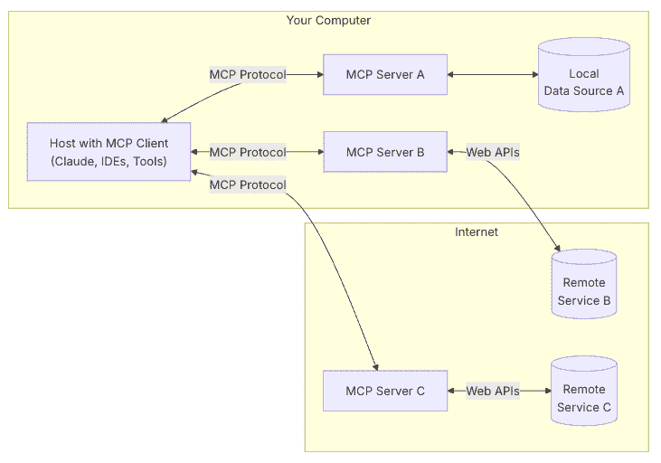
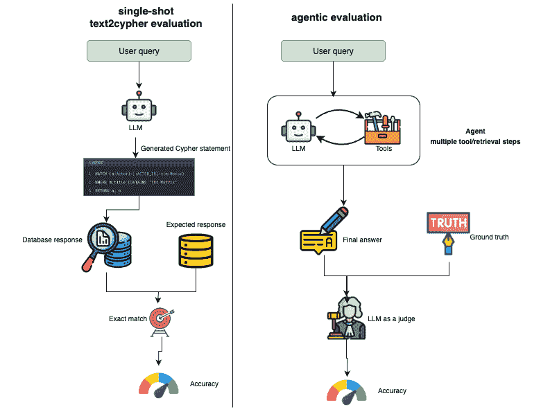
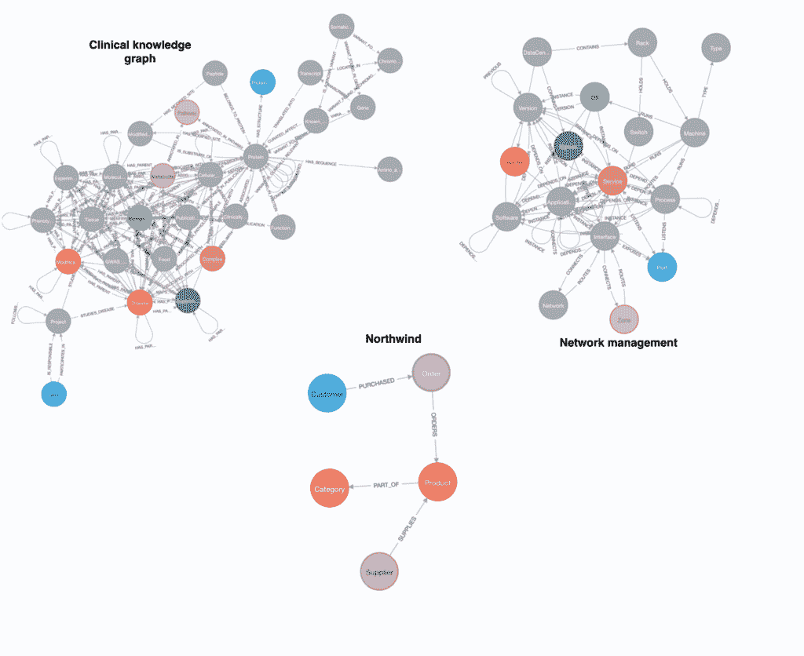
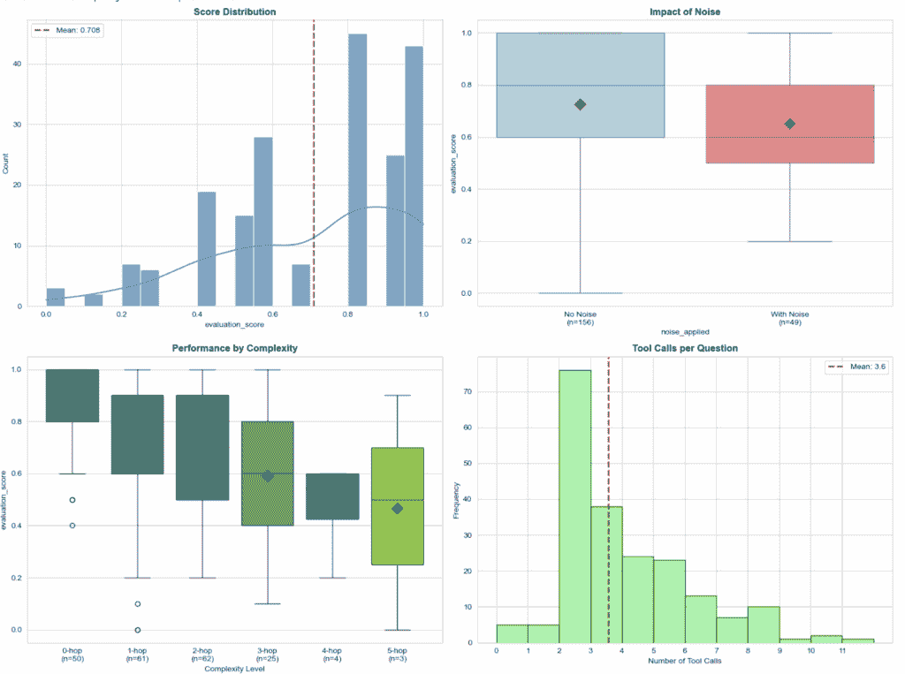
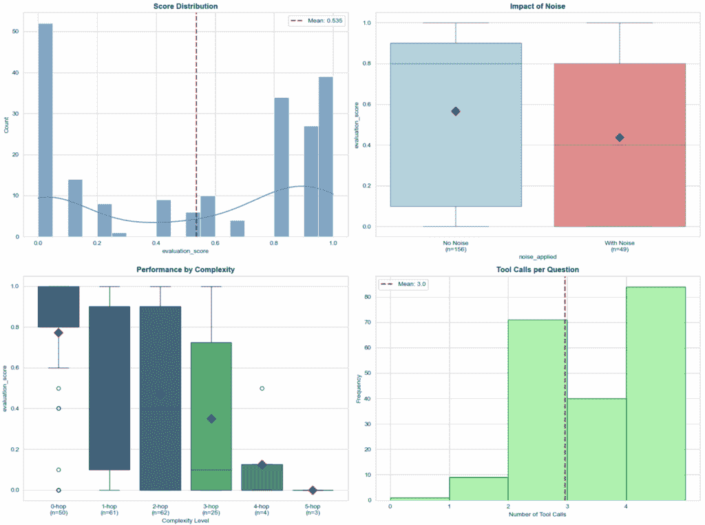

# 如何评估 MCP 智能系统中的图检索

> 原文：[`towardsdatascience.com/evaluating-graph-retrieval-in-mcp-agentic-systems/`](https://towardsdatascience.com/evaluating-graph-retrieval-in-mcp-agentic-systems/)

<mdspan datatext="el1753746675649" class="mdspan-comment">这些</mdspan>天，一切都在围绕着智能体展开，我对此非常支持，并且通过给 LLM 提供广泛的工具来超越基本的向量搜索：

+   网络搜索

+   各种 API 调用

+   查询不同的数据库

虽然正在开发大量新的 MCP 服务器，但令人惊讶的是，评估工作却很少。当然，你可以将 LLM 与各种不同的工具连接起来，但你真的知道它会如何表现吗？这就是为什么我计划撰写一系列博客文章，专注于评估现成的和定制的图 MCP 服务器，特别是那些从 Neo4j 检索信息的那些。

模型上下文协议（MCP）是 Anthropic 的开放标准，它就像“AI 应用的 USB-C 端口”，通过轻量级服务器标准化 AI 系统如何连接到外部数据源，这些服务器向客户端暴露特定的功能。关键洞察是可重用性。开发者不需要为每个数据源定制集成，只需构建一次可重用的 MCP 服务器，并在多个 AI 应用之间共享。

图片来源：https://modelcontextprotocol.io/introduction。许可协议：MIT。

MCP 服务器实现了模型上下文协议，通过结构化的 JSON-RPC 调用向 AI 客户端暴露工具和数据。它处理来自客户端的请求，并在本地或远程 API 上执行它们，返回结果以丰富 AI 的上下文。

为了评估 MCP 服务器及其检索方法，第一步是生成一个评估数据集，我们将使用 LLM 来帮助完成这项工作。在第二阶段，我们将使用现成的[mcp-neo4j-cypher](https://neo4j.com/developer/genai-ecosystem/model-context-protocol-mcp/#_mcp_neo4j_cypher)服务器，并对其进行基准数据集的测试。

本博客文章的议程。图片由作者提供。

目前的目标是建立一个稳固的数据集和框架，这样我们就可以在整个系列中持续比较不同的检索器。

代码可在[GitHub](https://github.com/neo4j-contrib/grape)上找到。

## 评估数据集

去年，Neo4j 发布了[Text2Cypher (2024) 数据集](https://neo4j.com/blog/developer/introducing-neo4j-text2cypher-dataset/)，该数据集围绕单步 Cypher 生成方法设计。在单步 Cypher 生成中，系统接收一个自然语言问题，并必须生成一个完整的 Cypher 查询来直接回答该问题，本质上是从文本到数据库查询的一次性翻译。

然而，这种方法并不能反映代理在实际中如何与图数据库交互。代理通过多步推理进行操作：它们可以迭代地执行多个工具，连续生成多个 Cypher 语句，分析中间结果，并将来自不同查询的发现结合起来，最终形成一个答案。这种迭代、探索的方法代表了一种与规定的单步模型根本不同的范式。

预定义的文本到 Cypher 流程与代理方法，其中可以调用多个工具。图片由作者提供。

当前的基准数据集未能捕捉到代理工作流程中 MCP 服务器实际使用方式的这种差异。基准数据集需要更新，以评估多步推理能力，而不仅仅是单次文本到 Cypher 的翻译。这将更好地反映代理如何导航复杂的信息检索任务，这些任务需要分解问题、探索数据关系以及跨多个数据库交互综合结果。

### 评估指标

从单步文本到 Cypher 评估转向代理方法时，最重要的转变在于我们如何衡量准确性。

单次文本到 Cypher 与代理评估之间的差异。图片由作者提供。

在传统的文本到查询任务，如文本到 Cypher 中，评估通常涉及直接将数据库响应与预定义的基准事实进行比较，通常检查[精确匹配或等价性](https://neo4j.com/blog/developer/benchmarking-neo4j-text2cypher-dataset/)。

然而，代理方法引入了一个关键的变化。代理可能会执行多个检索步骤，选择不同的查询路径，甚至可能在过程中重新表述原始意图。因此，可能没有单一的查询是正确的。相反，我们将重点转向评估代理生成的最终答案，无论它使用了哪些中间查询来达到那里。

为了评估这一点，我们使用了一个 LLM 作为裁判的设置，将代理的最终答案与预期答案进行比较。这使我们能够评估输出的语义质量和实用性，而不仅仅是内部机制或特定的查询结果。

### 结果粒度和代理行为

在代理评估中，另一个重要的考虑因素是**从数据库返回的数据量**。在传统的文本到 Cypher 任务中，允许或甚至期望有大量的查询结果是很常见的，因为目标是测试是否检索到了正确的数据。然而，这种方法并不适用于评估代理工作流程。

在代理环境中，**我们不仅测试代理能否访问正确的数据，还测试它能否生成简洁、准确的最终答案**。如果数据库返回的信息过多，评估就会与其他变量纠缠在一起，例如代理总结或导航大量输出的能力，而不是专注于它是否理解了用户的意图并检索了正确的信息。

### 引入真实世界的噪声

为了进一步使基准与**真实世界的代理使用**相一致，我们在评估提示中也引入了**控制噪声**。

引入真实世界的噪声到评估中。图片由作者提供。

这包括以下元素：

+   **命名实体中的**（例如，“Andrwe Carnegie”而不是“Andrew Carnegie”）中的**印刷错误**，

+   **口语化表达**或非正式语言（例如，“show me what’s up with Tesla’s board”而不是“list members of Tesla’s board of directors”），

+   **过于宽泛或未充分指定的意图**，需要后续推理或澄清。

这些变化反映了用户在实际操作中与代理交互的方式。在实际部署中，代理必须处理混乱的输入、不完整的表述和会话简写，这些条件很少被干净的、规范化的基准所捕捉。

为了更好地反映这些关于评估代理方法的见解，我[创建了一个新的基准，使用 Claude 4.0](https://github.com/neo4j-contrib/grape/blob/main/generate_eval_dataset/dataset_generation.ipynb)。与专注于 Cypher 查询正确性的传统基准不同，这个基准旨在评估多步代理生成的**最终答案**的质量

### 数据库

为了确保评估的多样性，我们使用了几个不同的数据库，这些数据库可在[Neo4j 演示服务器](https://demo.neo4jlabs.com:7473/browser/)上获得。示例包括：

+   [Northwind](https://en.wikiversity.org/wiki/Database_Examples/Northwind)：许可协议为 Microsoft Public License

+   网络管理：由我的朋友 Michael Hunger 生成

+   [Clinical Knowledge Graph](https://github.com/MannLabs/CKG)：许可协议为 MIT

## MCP-Neo4j-Cypher 服务器

[mcp-neo4j-cypher](https://neo4j.com/developer/genai-ecosystem/model-context-protocol-mcp/#_mcp_neo4j_cypher)是一个现成的 MCP 工具接口，允许代理通过自然语言与 Neo4j 交互。它支持三个核心功能：查看图模式、运行 Cypher 查询以读取数据，以及执行写操作以更新数据库。结果以干净、结构化的格式返回，代理可以轻松理解和使用。

mcp-neo4j-cypher 概述。图片由作者提供。

它与支持 MCP 服务器的任何框架无缝工作，使得将其插入现有代理设置变得简单，无需额外集成工作。无论您是在构建聊天机器人、数据助手还是自定义工作流程，这个工具都让您的代理能够安全、智能地处理图数据。

## 基准

最后，让我们运行基准评估。

我们使用 LangChain 托管代理并将其连接到`mcp-neo4j-cypher`服务器，这是提供给代理的唯一工具。这种设置使评估简单且现实：代理必须完全依赖与 MCP 界面的自然语言交互来检索和操作图数据。

对于评估，我们使用了**Claude 3.7 Sonnet**作为代理，**GPT-4o Mini**作为评判者。

基准数据集包括大约 200 个自然语言问答对，按跳数（1 跳、2 跳等）以及查询是否包含干扰或噪声信息进行分类。这种结构有助于评估代理在干净和噪声环境中的推理准确性和鲁棒性。评估代码可在[GitHub](https://github.com/neo4j-contrib/grape/blob/main/servers/mcp-neo4j-cypher/evaluation.ipynb)上找到。

让我们一起查看结果。

mcp-neo4j-cypher 评估。图由作者提供

评估显示，仅使用`mcp-neo4j-cypher`接口的代理可以有效地回答关于图数据的复杂自然语言问题。在一个大约 200 个问题的基准测试中，代理的平均得分为 0.71，随着问题复杂性的增加，性能下降。输入中的噪声显著降低了准确性，揭示了代理对命名实体等错误拼写敏感。

在工具使用方面，该代理平均每个问题调用 3.6 次工具。这与当前至少需要一次调用以获取模式，另一次执行主要 Cypher 查询的要求一致。大多数查询都在 2-4 次调用的范围内，显示出代理推理和行动的高效能力。值得注意的是，少数问题仅通过一次或甚至零次工具调用得到回答，这些异常可能表明早期停止、规划错误或代理错误，值得进一步分析。展望未来，如果通过 MCP 资源直接嵌入模式访问，工具调用次数可以进一步减少，从而消除显式获取模式步骤的需求。

拥有基准测试的实际价值在于它打开了系统迭代的大门。一旦建立了基线性能，你就可以开始调整参数，观察它们的影响，并做出有针对性的改进。例如，如果代理执行成本高昂，你可能想测试将允许的步骤数限制在 10 步，使用 LangGraph 递归限制是否对准确性有可测量的影响。有了基准测试，这些性能和效率之间的权衡可以定量探索，而不是猜测。

mcp-neo4j-cypher 评估，最多 10 步。图片由作者提供。

实施了 10 步的限制后，性能明显下降。平均评估分数降至**0.535**。在更复杂的（3 跳以上）问题上的准确性急剧下降，这表明步骤限制切断了更深层次的推理链。噪声继续降低性能，噪声问题的平均分数低于干净问题。

## 摘要

我们正处于人工智能的激动人心的时刻，随着自主代理和像 MCP 这样的新标准的兴起，LLMs 能够做的事情急剧增加，尤其是在结构化、多步骤任务方面。但是，尽管能力增长迅速，稳健的评估仍然落后。这就是这个[GRAPE](https://github.com/neo4j-contrib/grape/tree/main)项目出现的地方。

目标是构建一个实用、不断演进的基于 MCP 接口的图问答基准测试。随着时间的推移，我计划改进数据集，尝试不同的检索策略，并探索如何扩展或调整 Cypher MCP 以获得更高的准确性。从数据清理到检索改进再到评估收紧，还有很多工作要做。然而，有一个清晰的基准意味着我们可以有意义地跟踪进度，系统地测试想法，并推动这些代理可靠执行边界的扩展。
