# 评估合成数据——百万美元的问题

> 原文：[`towardsdatascience.com/evaluating-synthetic-data-the-million-dollar-question-a54701d1b621/`](https://towardsdatascience.com/evaluating-synthetic-data-the-million-dollar-question-a54701d1b621/)

<mdspan datatext="el1762546889344" class="mdspan-comment">当我们进行合成数据生成时，我们通常为我们的真实（或“观察”）数据创建一个模型，然后使用这个模型来生成合成数据。这些观察数据通常来自现实世界的经验，例如测量鸢尾花的物理特性或关于违约或患有某些医疗状况的个人细节。我们可以将这些观察数据视为来自某个“父分布”——这是观察数据是随机样本的真实潜在分布。当然，我们永远不知道这个父分布——它必须被估计，这就是我们模型的目的。</mdspan>

但是，如果我们能生成被认为是来自同一父分布的随机样本的合成数据，那么我们就找到了宝藏：合成数据将具有与观察数据相同的统计特性和模式（*保真度*）；它在回归或分类等任务中同样有用（*效用*）；而且，因为它是一个随机样本，不存在识别观察数据的隐私风险。但是，我们如何知道我们已经达到了这个难以捉摸的目标呢？

在这个故事的第一部分，我们将进行一些简单的实验，以更好地理解问题并激发解决方案。在第二部分，我们将评估各种合成数据生成器在一系列知名数据集上的性能。

## 第一部分——一些简单的实验

考虑以下两个数据集并尝试回答这个问题：

> *这些数据集是否是来自同一父分布的随机样本，或者其中一个是否通过应用小的随机扰动从另一个派生出来的？*

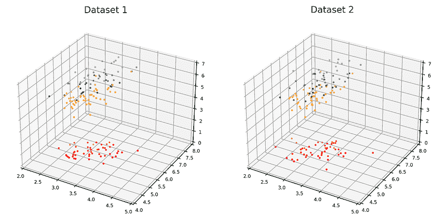

**图 1**。两个数据集。这两个数据集是否都是来自同一父分布的随机样本，或者其中一个是否通过小的随机扰动从另一个派生出来的？[图片由作者提供]

这些数据集明显显示出相似的统计特性，例如边缘分布和协方差。它们在分类任务上的表现也会相似，其中分类器在一个数据集上训练，在另一个数据集上测试。

但假设我们将每个数据集的数据点绘制在同一个图上。如果数据集是从同一父分布中随机抽取的样本，我们会直观地期望一个数据集的点会与其他数据集的点交织在一起，使得平均而言，一个数据集的点与其在该数据集中的最近邻点的距离（或‘相似度’）与它们与其他数据集中最近邻点的距离相同。然而，如果一个数据集是另一个数据集的轻微随机扰动，那么一个数据集的点将比它们在该数据集中的最近邻点更相似于另一个数据集中的最近邻点。这导致以下测试。

#### 最大相似度测试

*对于每个数据集，计算每个实例与其在同一数据集中的最近邻之间的相似度。将这些称为“最大内部集相似度”。如果数据集具有相同的分布特征，那么每个数据集的内部集相似度的分布应该相似。现在计算一个数据集的每个实例与其另一个数据集中最近邻之间的相似度，将这些称为“最大交叉集相似度”。如果最大交叉集相似度的分布与最大内部集相似度的分布相同，那么可以认为数据集是从同一父分布中随机抽取的样本。为了使测试有效，每个数据集应包含相同数量的示例。*

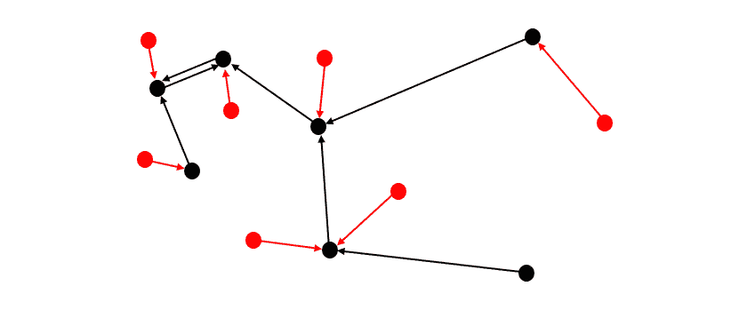

**图 2**. 两个数据集：一个红色，一个黑色。黑色箭头指示每个黑色点（尾部）最近的（或“最相似的”）黑色邻居（头部）——这些对之间的相似度是黑色数据集的“最大内部集相似度”。红色箭头指示每个红色点（尾部）最近的黑色邻居（头部）——这些对之间的相似度是“最大交叉集相似度”。[图片由作者提供]

由于在这个故事中我们处理的数据集都包含数值型和分类型变量混合，我们需要一个能够适应这种情况的相似度度量。我们使用 Gower 相似度¹。

下面的表格和直方图显示了数据集 1 和 2 的最大内部和交叉集相似度的平均值和分布。

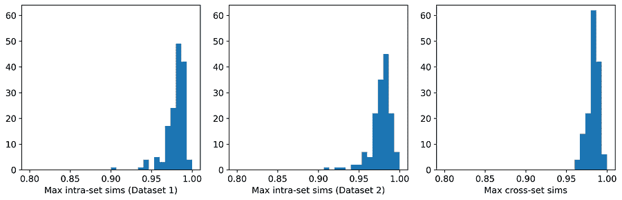

**图 3**. 数据集 1 和 2 的最大内部和交叉集相似度分布。[图片由作者提供]

平均而言，一个数据集中的实例与其在另一个数据集中最近邻的相似度，比与其在同一数据集中最近邻的相似度要高。这表明数据集更有可能是彼此的扰动，而不是来自同一父分布的随机样本。**确实，它们是扰动！**数据集 1 是由高斯混合模型生成的；数据集 2 是通过（不替换）从数据集 1 中选择一个实例并应用小的随机扰动生成的。

最终，我们将使用最大相似性测试来比较合成数据集和观察数据集。合成数据点与观察数据点过于接近的最大危险是隐私；即能够从合成数据集中的点识别出观察数据集中的点。实际上，如果你仔细检查数据集 1 和 2，你实际上可能能够识别出一些这样的配对。而且这是在平均最大跨集相似度仅比平均最大内集相似度高 0.3% 的情况下！

#### 建模和合成

为了结束这个故事的第一部分，让我们为数据集创建一个模型，并使用该模型生成合成数据。然后我们可以使用最大相似性测试来比较合成数据和观察数据集。

下图 4 左侧的数据集就是上面提到的数据集 1。右侧的数据集（数据集 3）是合成数据集。（我们估计分布为高斯混合，但这并不重要）。

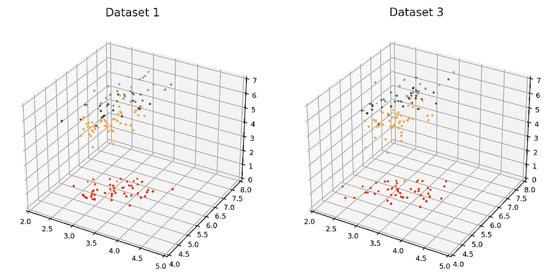

**图 4**. 观察数据集（左侧）和合成数据集（右侧）。[图片由作者提供]

这里是平均相似度和直方图：

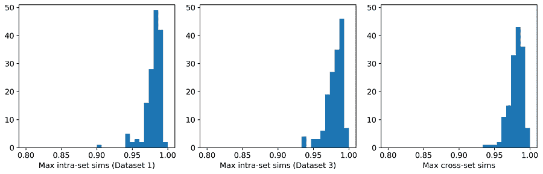

**图 5**. 数据集 1 和 3 的最大内集和跨集相似度的分布。[图片由作者提供]

三个平均值在三位有效数字上是一致的，三个直方图也非常相似。因此，根据最大相似性测试，两个数据集可以合理地被认为是来自同一父分布的随机样本。我们的合成数据生成练习已经成功，我们实现了三合一——保真度、实用性和隐私性。

[*用于生成第一部分数据集、图表和直方图的 Python 代码可在以下链接找到*](https://github.com/a-skabar/TDS-EvalSynthData)

## 第二部分——真实数据集，真实生成器

第一部分中使用的数据集简单，可以用高斯混合模型轻松建模。然而，大多数现实世界的数据集要复杂得多。在本部分故事中，我们将对一些流行的现实世界数据集应用几个合成数据生成器。我们的主要重点是比较观察到的和合成数据集内部以及之间的最大相似度的分布，以了解它们在多大程度上可以被认为是来自同一父分布的随机样本。

六个数据集源自 UCI 仓库²，并且都是几十年来在机器学习文献中被广泛使用的流行数据集。所有这些都是混合类型的数据集，选择它们是因为它们在类别特征和数值特征之间的平衡度各不相同。

六个生成器代表了在合成数据生成中使用的**主要方法**：基于 Copula、基于 GAN、基于 VAE 以及使用顺序插补的方法。CopulaGAN³、GaussianCopula、CTGAN³ 和 TVAE³ 都可在 *Synthetic Data Vault* 库⁴ 中找到，synthpop⁵ 是一个开源的 R 软件包，而“UNCRi”指的是在 *Unified Numeric/Categorical Representation and Inference*（UNCRi）框架⁶ 下开发的合成数据生成工具。所有生成器都使用其默认设置。

表 1 显示了每个生成器应用于每个数据集的平均最大内部和交叉集相似度。用红色突出显示的条目是隐私受到侵犯的条目（即，观察数据的平均最大交叉集相似度超过平均最大内部集相似度）。用绿色突出显示的条目是具有最高平均最大交叉集相似度的条目（不包括红色条目）。最后一列显示了执行 *Train on Synthetic, Test on Real*（TSTR）测试的结果，其中分类器或回归器在合成示例上训练，并在真实（观察）示例上测试。波士顿房价数据集是一个回归任务，报告的是平均绝对误差（MAE）；所有其他任务都是分类任务，报告的值是 ROC 曲线下面积（AUC）。

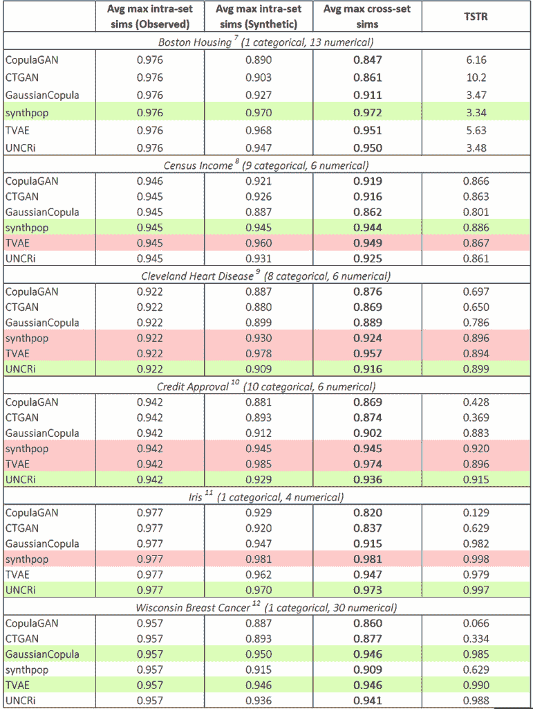

**表 1**. 六个生成器在六个数据集上的平均最大相似度和 TSTR 结果。TSTR 的值对于波士顿房价是 MAE，对于所有其他数据集是 AUC。[图片由作者提供]

下面的图示显示了每个数据集，对应于获得最高平均最大交叉集相似度的生成器的最大内部和交叉集相似度的分布（不包括上面用红色突出显示的）。

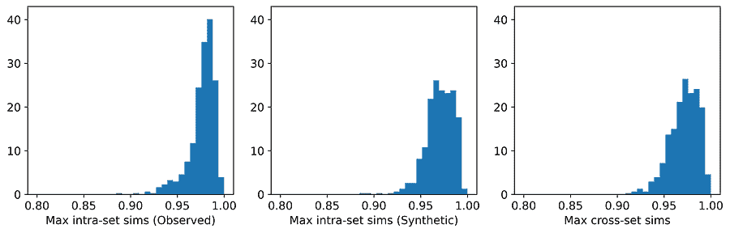

**图 6**. synthpop 在 **Boston Housing** 数据集上的最大相似度分布。[图片由作者提供]

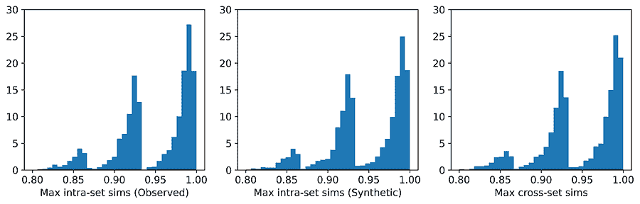

**图 7**. synthpop 在 **Census Income** 数据集上的最大相似度分布。[图片由作者提供]

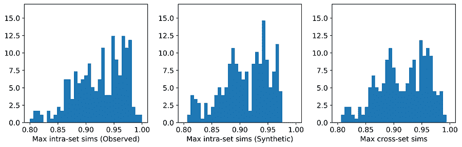

**图 8**. **Cleveland Heart Disease**数据集上 UNCRi 的最大相似度分布。[图片由作者提供]

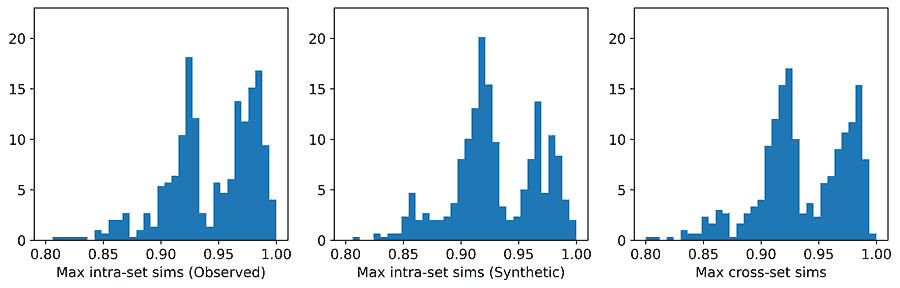

**图 9**. **Credit Approval**数据集上 UNCRi 的最大相似度分布。[图片由作者提供]

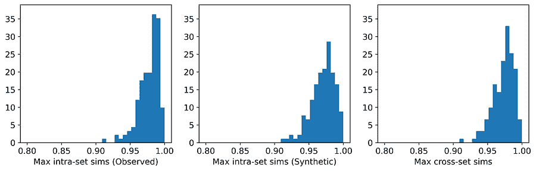

**图 10**. **Iris**数据集上 UNCRi 的最大相似度分布。[图片由作者提供]

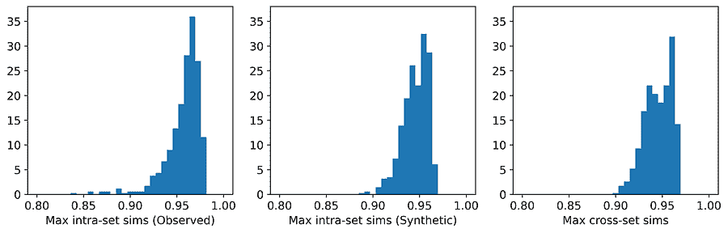

**图 11**. **Wisconsin Breast Cancer**数据集上 TVAE 的平均相似度分布。[图片由作者提供]

从表中，我们可以看到，对于那些没有侵犯隐私的生成器，观察数据中平均最大交叉集相似度与平均最大内部集相似度非常接近。直方图显示了这些最大相似度的分布，我们可以看到，在大多数情况下，分布是明显相似的——对于像人口收入数据集这样的数据集来说，这种相似性尤为显著。表还显示，对于每个数据集（不包括用红色突出显示的），实现平均最大交叉集相似度最高的生成器（再次排除红色部分）在 TSTR 测试中也表现出最佳性能。因此，虽然我们永远无法声称发现了“真实”的潜在分布，但这些结果表明，对于每个数据集来说，最有效的生成器已经捕捉到了潜在分布的关键特征。

#### 隐私

只有七个生成器中的两个在隐私方面存在问题：synthpop 和 TVAE。每个生成器在六个数据集中有三个数据集违反了隐私。在两个实例中，特别是 TVAE 在克利夫兰心脏病和 TVAE 在信用批准中，违规尤其严重。下面显示了 TVAE 在信用批准上的直方图，并表明合成的例子彼此之间过于相似，并且也与观察数据中的最近邻过于相似。该模型是潜在父分布的特别糟糕的表示。这可能是由于信用批准数据集包含几个极端偏斜的数值特征。

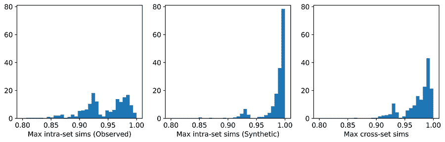

**图 12**. **Credit Approval**数据集上 TVAE 的平均最大相似度分布。[图片由作者提供]

#### 其他观察和评论

这两个基于 GAN 的生成器——CopulaGAN 和 CTGAN——在表现最差的生成器中一直名列前茅。考虑到 GAN 的巨大流行度，这一点有些令人惊讶。

GaussianCopula 在所有数据集上的表现都一般，除了威斯康星乳腺癌数据集，在该数据集上它达到了最高的平均最大交叉集相似度。它在 Iris 数据集上的表现令人印象深刻，尤其是考虑到这是一个非常简单的数据集，可以很容易地使用高斯混合模型进行建模，并且我们预计它将很好地匹配基于 Copula 的方法。

在所有数据集上表现最稳定的是 synthpop 和 UNCRi 生成器，它们都通过顺序插补进行操作。这意味着它们只需要估计和从一元条件分布（例如，*P*(*x*₇|*x*₁, *x*₂, …)）中进行采样，这通常比建模和从多元分布（例如，*P*(*x*₁, *x*₂, *x*₃, …)）中进行采样要容易得多，这正是 GANs 和 VAEs 所隐含的。而 synthpop 使用决策树来估计分布（这是 synthpop 容易过拟合的来源），而 UNCRi 生成器使用基于最近邻的方法来估计分布，使用交叉验证过程优化超参数，以防止过拟合。

## 结论

合成数据生成是一个新兴且不断发展的领域，尽管目前还没有标准评估技术，但普遍认为测试应该涵盖一致性、效用和隐私。但是，虽然这些都很重要，但它们并不处于同等地位。例如，一个合成数据集可能在一致性和效用上表现良好，但在隐私上失败。这并不意味着它“三选其二”：如果合成示例与观察示例过于接近（从而未能通过隐私测试），则模型已被过拟合，使得一致性和效用测试变得毫无意义。一些合成数据生成软件的供应商倾向于提出基于多种测试结果的单一评分性能度量。这本质上基于相同的“三选其二”逻辑。

如果一个合成数据集可以被认为是来自与观察数据相同父分布的随机样本，那么我们就无法做得更好——我们已经实现了最大的一致性、效用和隐私。最大相似性测试提供了两个数据集可以被认为是来自相同父分布的随机样本的程度度量。它基于简单直观的概念，即如果观察到的和合成的数据集都是来自相同父分布的随机样本，实例应该分布得使得合成的实例与其最近的观察实例的平均相似度与观察实例与其最近的观察实例的平均相似度相当。

我们提出了以下合成数据集质量的单一评分度量方法：

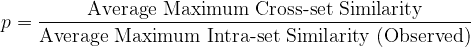

这个比率越接近 1 — 但不能超过 1 — 合成数据的质量就越好。当然，它应该伴随着直方图的合理性检查。

## 参考文献

[1] Gower, J. C. (1971). 一种通用的相似系数及其一些性质. 生物统计学, 27(4), 857–871.

[2] Dua, D. & Graff, C., (2017). *UCI 机器学习库*， 可在：[`archive.ics.uci.edu/ml.`](https://archive.ics.uci.edu/ml/)

[3] Xu, L., Skoularidou, M., Cuesta-Infante, A. and Veeramachaneni., K. 使用条件 GAN 对表格数据进行建模. NeurIPS, 2019.

[4] Patki, N., Wedge, R., & Veeramachaneni, K. (2016). 合成数据保险库. 在 *2016 IEEE 国际数据科学和高级分析会议 (DSAA)* (第 399–410 页). IEEE.

[5] Nowok, B., Raab G.M., Dibben, C. (2016). “synthpop: 在 R 中定制创建合成数据。” *《统计软件杂志》*， **74**(11), 1–26.

[6] [`skanalytix.com/uncri-framework`](https://skanalytix.com/uncri-framework/)

[7] Harrison, D., & Rubinfeld, D.L. (1978). 波士顿住房数据集. Kaggle. [`www.kaggle.com/c/boston-housing`](https://www.kaggle.com/c/boston-housing). 在 CC: 公共领域许可下授权商业使用。

[8] Kohavi, R. (1996). 人口收入. UCI 机器学习库. [archive.ics.uci.edu/dataset/20/census+income](https://archive.ics.uci.edu/dataset/20/census+income)[.](https://doi.org/10.24432/C5GP7S.) 在[Creative Commons Attribution 4.0 国际](https://creativecommons.org/licenses/by/4.0/legalcode) (CC BY 4.0) 许可下授权商业使用。

[9] Janosi, A., Steinbrunn, W., Pfisterer, M. and Detrano, R. (1988). 心脏病. UCI 机器学习库. [archive.ics.uci.edu/dataset/45/heart+disease](https://archive.ics.uci.edu/dataset/45/heart+disease)[.](https://doi.org/10.24432/C52P4X.) 在[Creative Commons Attribution 4.0 国际](https://creativecommons.org/licenses/by/4.0/legalcode) (CC BY 4.0) 许可下授权商业使用。

[10] Quinlan, J.R. (1987). 信用批准. UCI 机器学习库. [archive.ics.uci.edu/dataset/27/credit+approval](https://archive.ics.uci.edu/dataset/27/credit+approval)[.](https://doi.org/10.24432/C5FS30.) 在[Creative Commons Attribution 4.0 国际](https://creativecommons.org/licenses/by/4.0/legalcode) (CC BY 4.0) 许可下授权商业使用。

[11] Fisher, R.A. (1988). 鸢尾花. UCI 机器学习库. [archive.ics.uci.edu/dataset/53/iris](https://archive.ics.uci.edu/dataset/53/iris)[.](https://doi.org/10.24432/C56C76.) 在[Creative Commons Attribution 4.0 国际](https://creativecommons.org/licenses/by/4.0/legalcode) (CC BY 4.0) 许可下授权商业使用。

[12] Wolberg, W., Mangasarian, O., Street, N. 和 Street, W. (1995). 威斯康星州乳腺癌（诊断）。UCI 机器学习库。[archive.ics.uci.edu/dataset/17/breast+cancer+wisconsin+diagnostic](https://archive.ics.uci.edu/dataset/17/breast+cancer+wisconsin+diagnostic)[.](https://doi.org/10.24432/C5DW2B.) 在[Creative Commons Attribution 4.0 International](https://creativecommons.org/licenses/by/4.0/legalcode) (CC BY 4.0) 许可下允许商业使用。
