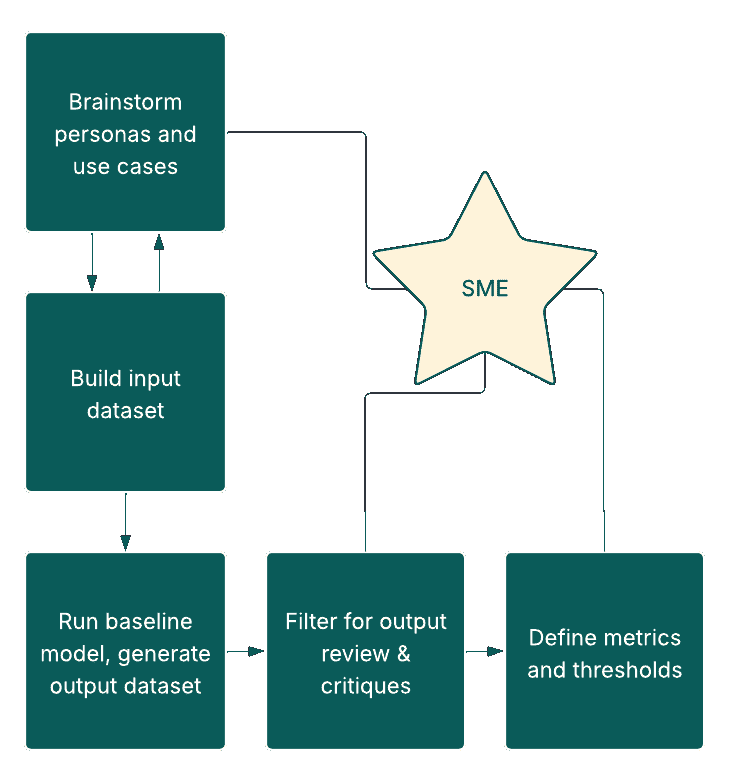
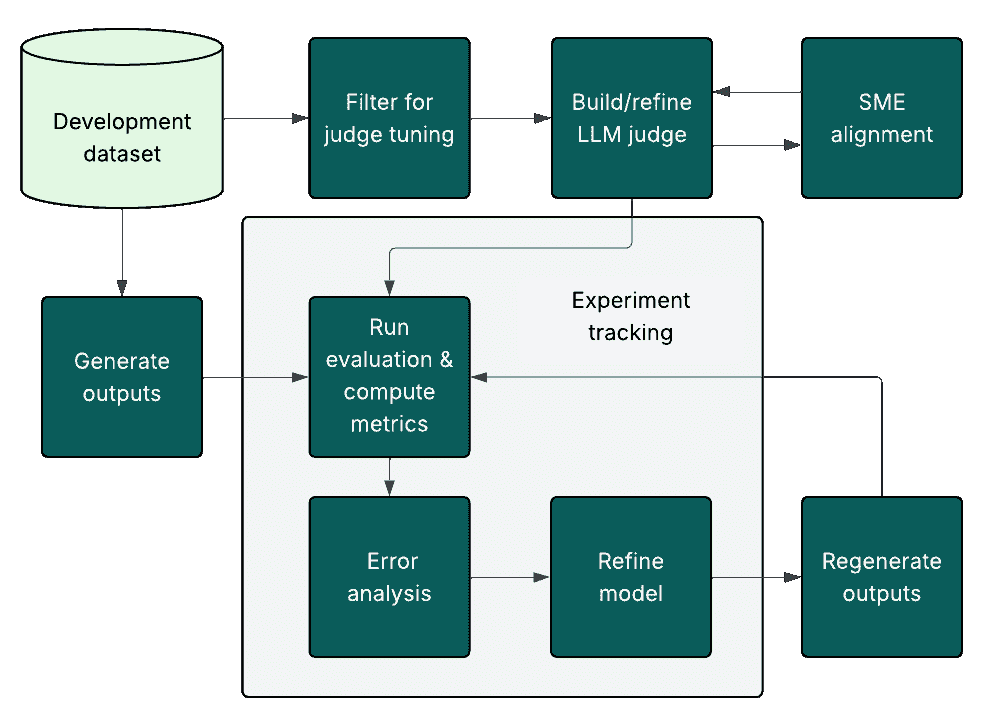
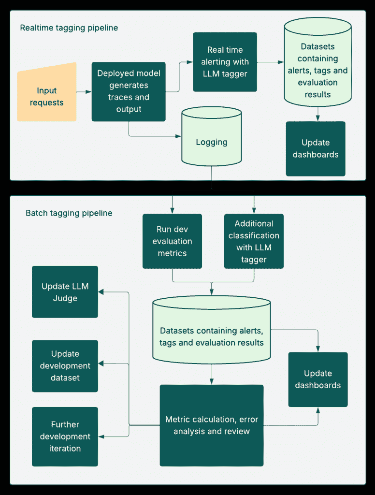

# 评估驱动的 LLM 产品开发：从医疗保健领域构建中汲取的教训

> 原文：[`towardsdatascience.com/evaluation-driven-development-for-llm-powered-products-lessons-from-building-in-healthcare/`](https://towardsdatascience.com/evaluation-driven-development-for-llm-powered-products-lessons-from-building-in-healthcare/)

* * *

<mdspan datatext="el1752108482014" class="mdspan-comment">大型语言模型（LLM）及其应用领域的开发速度非常快。成本正在下降，基础模型的能力也在不断增强，能够处理文本、图像、视频的通信。开源解决方案在多样性和能力上也得到了爆炸性的增长，许多模型足够轻量，可以探索、微调和迭代，而无需巨大的开销。最后，像 Databricks 和 Nebius 这样的云 AI 训练和推理提供商使得组织从 POC 到生产就绪系统的应用 AI 产品规模化变得越来越容易。这些进步与 LLM 的商业用途的多样化以及代理应用的兴起相辅相成，其中模型规划并执行涉及与工具或其他代理交互的复杂多步骤工作流程。这些技术已经在医疗保健领域产生了影响，预计其增长将非常迅速[1]。

所有这些能力都使得开始这项工作变得令人兴奋，为特定用例构建一个基线解决方案可以非常快。然而，由于它们的本质，大型语言模型（LLM）是非确定性的，比传统的软件或 ML 模型更难以预测。因此，真正的挑战在于迭代：我们如何知道我们的开发过程正在改进系统？如果我们修复了一个问题，我们如何知道这个改变不会破坏其他东西？一旦投入生产，我们如何检查性能是否与我们在开发中看到的一致？使用仅进行单个 LLM 调用的系统来回答这些问题已经足够困难，但使用[代理系统](https://en.wikipedia.org/wiki/Agentic_AI)时，我们还需要考虑它们之间所有单个步骤和路由决策。为了解决这些问题——并且因此在我们构建的系统中获得信任和信心——我们需要[评估驱动的开发](https://arxiv.org/html/2411.13768v2)。这是一种将迭代、可操作的评价置于产品生命周期核心的方法，从开发、部署到监控。

作为 Nuna, Inc.这家医疗 AI 公司的数据科学家，我一直负责将以评估驱动的开发融入我们的产品中。在领导层的支持下，我们分享了一些我们迄今为止学到的关键经验教训。我们希望这些见解不仅对那些在医疗领域构建 AI 的人有价值，而且对任何正在开发 AI 产品的人，尤其是那些刚开始他们旅程的人，也很有价值。

本文分为以下几部分，旨在解释我们从文献中获得的广泛知识，以及从经验中获得的技巧和提示。

+   在第一部分中，我们将简要介绍 Nuna 的产品，并解释为什么 AI 评估对我们以及一般医疗保健 AI 至关重要。

+   在第二部分中，我们将探讨如何通过评估驱动的开发为我们的产品的预部署阶段带来结构。这包括使用 LLM 作为评判者和程序性方法来开发指标，这些方法受到了[这篇优秀的文章](https://hamel.dev/blog/posts/llm-judge/)的极大启发。一旦建立了可靠的评判者和与专家对齐的指标，我们将描述如何使用它们通过错误分析来迭代正确的方向。在本节中，我们还将触及聊天机器人应用带来的独特挑战。

+   在第三部分中，我们将讨论使用基于模型的分类和警报来监控生产中的应用程序，并使用这些反馈进行进一步的改进。

+   第四部分总结了我们所学到的所有内容

任何组织对这些主题的看法都受到其使用的工具的影响——例如，我们使用 MLflow 和 Databricks Mosaic Evaluation 来跟踪我们的预生产实验，并使用 AWS Agent Evaluation 来测试我们的聊天机器人。然而，我们相信这里提出的思想应该适用于任何技术堆栈，并且有许多来自 Arize（凤凰城评估套件）、LangChain（LangSmith）和 Confident AI（DeepEval）等公司的优秀选项。在这里，我们将关注主要涉及提示工程的项目，但对于微调模型也可以采用类似的方法。

## 1.0 Nuna 的 AI 和评估

[Nuna 的](https://www.nuna.com/)目标是降低护理的总成本，并改善患有慢性疾病（如高血压和糖尿病）的人的生活，这些疾病共同影响了超过 50%的美国成年人口[2,3]。这是通过一个以患者为中心的移动应用来实现的，该应用鼓励健康习惯，如药物依从性和血压监测，同时还有一个以护理团队为中心的仪表板，该仪表板组织来自应用的数据以供提供者*使用。为了使系统成功，患者和护理团队必须觉得它易于使用、引人入胜且富有洞察力。它还必须产生可衡量的健康益处。这一点至关重要，因为它将医疗保健技术与其他大多数技术领域区分开来，在其他技术领域，商业成功与参与度更为紧密相关。

AI 在产品中扮演着关键、耐心且面向护理团队的角色：在患者端，我们有应用内的护理教练聊天机器人，以及药物容器和餐食照片扫描等功能。在护理团队端，我们正在开发摘要和数据排序能力，以减少行动时间并针对不同用户定制体验。下表显示了四个由 AI 驱动的产品组件，这些组件的开发为本文提供了灵感，并在以下章节中提及。

| **产品描述** | **独特特性** | **最关键的评估组成部分** |
| --- | --- | --- |
| 药物容器扫描（图像到文本） | 多模态，具有清晰的地面真实标签（从容器中提取的药物细节） | 典型的发展数据集，迭代和跟踪，生产中的监控 |
| 餐食扫描（成分提取、营养洞察和评分） | 多模态，混合清晰的地面真实标签（提取的成分）和 LLM 生成的评估及小企业输入的主观判断 | 典型的发展数据集，适当的指标，迭代和跟踪，生产中的监控 |
| 应用内护理教练聊天机器人（文本到文本） | 多轮转录，工具调用，多样化的角色和用例，主观判断 | 典型的发展数据集，适当的指标，生产中的监控 |
| 医疗记录摘要（文本和数值数据转换为文本）  | 复杂的输入数据，狭窄的应用场景，对高精度和小企业判断的迫切需求 | 典型的发展数据集，专家对齐的 LLM 判断，迭代和跟踪 |

图 1：展示 Nuna 中 AI 用例的表格，这些用例将在本文中提及。我们相信这里提出的以评估驱动的开发框架足够广泛，可以应用于这些和类似类型的 AI 产品。

尊重患者以及他们托付给我们的敏感数据是我们业务的核心理念。除了保护数据隐私外，我们还必须确保我们的 AI 产品以安全、可靠、符合用户需求的方式运行。我们需要预测人们可能如何使用这些产品，并测试标准用法和边缘情况。在可能出现错误的地方——例如，从餐食照片中识别成分——我们需要知道在哪里投资建立用户轻松纠正错误的方法。我们还需要关注更微妙的问题——例如，[最近的研究表明，长时间使用聊天机器人可能导致孤独感增加](https://www.media.mit.edu/publications/how-ai-and-human-behaviors-shape-psychosocial-effects-of-chatbot-use-a-longitudinal-controlled-study/)——因此，我们需要识别和监控令人担忧的使用案例，以确保我们的 AI 与改善生活、降低护理成本的目标保持一致。这与 NIST AI 风险管理框架的建议相符，该框架强调预先识别可能的误用场景，包括边缘情况和意外后果，尤其是在影响重大的领域，如医疗保健。

**本系统仅提供健康支持，并不用于医疗诊断、治疗，或替代专业医疗判断**。

## 2.0 部署前：指标、对齐和迭代

在一个由 LLM（大型语言模型）驱动的产品的开发阶段，建立与业务/产品目标对齐的评估指标、一个足以模拟生产行为的测试数据集，以及一个实际计算评估指标的方法是非常重要的。有了这些，我们就可以进入迭代和错误分析的良性循环（详情见[这本书](https://info.deeplearning.ai/machine-learning-yearning-book)）。我们越快在正确的方向上进行迭代，成功的可能性就越高。不言而喻，当测试涉及通过 LLM 传递敏感数据时，必须在符合数据隐私法规的受信任环境中进行。例如，在美国，健康保险可携带性和问责法案（HIPAA）为保护患者健康信息设定了严格的标准。任何此类数据的处理都必须符合 HIPAA 对安全和保密的要求。

### 2.1 开发数据集

在项目开始时，识别并联系能够帮助生成示例输入数据和定义成功标准的主题领域专家（SMEs）非常重要。在 Nuna，我们的 SMEs 是咨询医疗保健专业人士，如医生和营养师。根据问题背景，我们发现医疗保健专家的意见几乎是一致的——答案可以来源于他们培训的核心原则——或者非常多样化，借鉴他们个人的经验。为了减轻这种差异，我们发现从项目开始就寻求一小组专家（通常是 2-5 人）的意见是有用的，他们的共识观点作为我们最终的真实来源。

建议与 SMEs（行业专家）合作，构建系统的代表性输入数据集。为此，我们应该考虑可能使用该系统的各种用户角色的广泛类别和主要功能。用例越广泛，这些类别就越多。例如，Nuna 聊天机器人对所有用户都开放，帮助回答任何基于健康的问题，并且可以通过工具调用访问用户自己的数据。因此，一些功能是“情感支持”、“高血压支持”、“营养建议”、“应用支持”，我们可能需要将这些功能进一步细分为“新用户”与“老用户”或“怀疑用户”与“高级用户”的用户角色。这种细分对数据生成过程和后续的错误分析很有用，在这些输入经过系统处理后。

同时，考虑系统必须处理的特定场景——包括典型场景和边缘情况——也很重要。对于我们聊天机器人来说，这些包括“用户根据症状请求诊断”（在这种情况下，我们总是建议他们联系医疗保健专业人士），“用户请求被截断或不完整”，“用户尝试越狱系统”。当然，不可能考虑到所有关键场景，这就是为什么需要后续迭代（第 2.5 节）和在生产中的监控（第 3.0 节）的原因。

在类别设置到位后，数据本身可能通过过滤现有的专有或开源数据集（例如，用于食品图像的[Nutrition5k](https://github.com/google-research-datasets/Nutrition5k)，用于患者-医生对话的 OpenAI 的[HealthBench](https://openai.com/index/healthbench/)）来生成。在某些情况下，输入和黄金标准输出都可能可用，例如在 Nutition5k 中每张图像的成分标签。这使得指标设计（第 2.3 节）更加容易。然而，更常见的情况是需要专家对黄金标准输出进行标注。确实，即使没有现成的输入示例，也可以使用 LLM（大型语言模型）合成这些示例，然后由团队进行整理——Databricks 有一些工具用于此，详情请参阅[这里](https://docs.databricks.com/aws/en/generative-ai/agent-evaluation/synthesize-evaluation-set)。

这个开发集应该有多大？我们拥有的例子越多，它就越有可能代表模型在生产中看到的内容，但迭代的成本也越高。我们的开发集通常从几百个例子开始。对于聊天机器人，为了具有代表性，输入可能需要是包含样本患者数据的多步骤对话，我们建议使用像[AWS Agent Evaluation](https://awslabs.github.io/agent-evaluation/)这样的测试框架，其中输入示例文件可以手动生成或通过 LLM 通过提示和编辑生成。

### 2.2 基线模型流程

如果从头开始，思考用例和构建开发集的过程可能会让团队对这个问题以及要构建的基线系统的架构有一个感觉。除非由于安全或成本问题而变得不可行，否则建议保持初始架构简单，并使用基于 API 的强大模型进行基线迭代。后续章节中描述的迭代过程的主要目的是改进这个基线版本中的提示，所以我们通常保持它们简单，同时尽量遵循一般的提示工程最佳实践，如本指南中描述的[Anthropic 指南](https://docs.anthropic.com/en/docs/build-with-claude/prompt-engineering/overview)。

一旦基线系统启动并运行，它应该运行在开发集上以生成第一个输出。将开发数据集通过系统运行是一个可能需要重复多次的批量过程，因此值得并行化。在 Nuna，我们使用 Databricks 上的 PySpark 来完成这项工作。此类批量并行化的最直接方法是使用[pandas 用户定义函数](https://docs.databricks.com/aws/en/udf/pandas)（UDF），它允许我们在 Pandas 数据框的行上循环调用模型 API，然后使用 Pyspark 将输入数据集分割成块，以便在集群的节点上并行处理。另一种方法，如[此处](https://docs.databricks.com/aws/en/machine-learning/model-inference/dl-model-inference)所述，首先需要我们将调用模型的脚本作为[mlflow PythonModel 对象](https://mlflow.org/docs/latest/model#models-from-code)记录下来，将其作为 pandas UDF 加载，然后使用它进行推理。



图 2：展示构建开发数据集和指标的高级工作流程，其中包含来自领域专家（SME）的输入。数据集的构建是迭代的。在运行基线模型之后，领域专家的批评可以用来定义优化和满足的指标及其相关的成功阈值。图像由作者生成。

### 2.3 指标设计

设计可操作且与功能目标一致的评估指标是评估驱动型开发的关键部分。考虑到你正在开发的功能的背景，可能有一些指标是发货的最低要求——例如，图表上文本摘要的数值准确性的最低比率。特别是在医疗保健环境中，我们发现 SMEs 在识别对利益相关者和最终用户解释重要的额外补充指标方面再次是关键资源。异步地，SMEs 应该能够安全地审查开发集的输入和输出，并对它们进行评论。各种专门设计的工具支持这种类型的审查，并可以根据项目的敏感性和成熟度进行调整。对于早期阶段或低量级的工作，轻量级方法，如安全的电子表格，可能就足够了。如果可能的话，反馈应包括对每个输入/输出对的简单通过/失败决定，以及对 LLM 生成的输出的评论，解释决定。我们的想法是，然后我们可以使用这些评论来指导我们选择评估指标，并为任何我们构建的 LLM-judges 提供少量示例。为什么是通过/失败而不是李克特量表或其他数值指标？这是一个开发者选择，但我们发现，在二元情况下，SMEs 和 LLM judges 之间的对齐要容易得多。将结果汇总为开发集的简单准确度度量是直接的。例如，如果 30%的“90 天血压时间序列摘要”在扎根性方面得到零分，而 30 天的摘要中没有，那么这表明模型在处理长输入时存在困难。

在初步审查阶段，记录一组关于输出成功构成要素的明确指南通常也是很有用的，这可以让所有注释者有一个可信的来源。SME 注释者之间的分歧通常可以通过参考这些指南来解决，如果分歧持续存在，这可能是一个迹象，表明指南——以及 AI 系统的目的——定义得不够清楚。还重要的是要注意，根据你公司的资源、发货时间表和功能的危险级别，可能无法对整个开发集获得 SME 的评论——因此选择代表性的例子很重要。

作为具体例子，Nuna 开发了一个药物日志历史 AI 摘要，用于在面向护理团队的门户中显示。在 AI 摘要的开发早期，我们收集了一组代表性患者记录，将它们通过摘要模型处理，绘制了数据，并与我们的专家共享了一个包含输入图表和输出摘要的安全电子表格，以供他们评论。从这个练习中，我们确定了需要一系列指标，包括可读性、风格（即客观而非惊悚的）、格式和扎根性（即洞察力与输入时间序列的准确性）。

一些指标可以通过对输出进行简单的编程测试来计算。这包括格式和长度限制，以及通过像[F-K 等级](https://en.wikipedia.org/wiki/Flesch%E2%80%93Kincaid_readability_tests)这样的评分来量化的可读性。其他指标需要 LLM 评判者（见下文了解更多细节），因为成功的定义更为复杂。这就是我们提示 LLM 表现得像人类专家，给出通过/失败的决定和输出评论的地方。想法是，如果我们能够将 LLM 评判者的结果与专家的结果对齐，我们就可以在开发集上自动运行它，并在迭代时快速计算我们的指标。

我们发现为每个项目选择一个单一的“优化指标”很有用，例如开发集中被标记为准确基于输入数据的比例，但可以用几个“满意指标”来支持，例如在长度限制内的百分比、适合风格的百分比、可读性评分大于 60 的百分比等。像[延迟百分位数](https://www.tuanh.net/blog/oop/statistics-behind-latency-metrics-understanding-p90-p95-and-p99)和每请求平均令牌成本这样的因素也构成理想的满意指标。如果一个更新使得优化指标值上升，而没有将任何满意指标值降低到预定义的阈值以下，那么我们知道我们正在朝着正确的方向前进。

### 2.4 构建 LLM 评判者

LLM-judge 开发的目的是将专家的建议提炼成一个提示，使 LLM 能够以与他们的专业判断一致的方式评分开发集。评判者通常是一个比被评判的模型更大/更强大的模型，尽管这不是一个严格的要求。我们发现，虽然有可能让单个 LLM 评判者提示输出多个指标的评分和评论，但这可能会造成混淆，并且与 2.4 中描述的跟踪工具不兼容。因此，我们为每个指标创建一个单独的评判者提示，这还有一个额外的优点，即强制限制 LLM 生成的指标数量。

一个初始的裁判提示，将在开发集上运行，可能看起来像下面的块。在对齐步骤中，将迭代指令，因此在这个阶段，它们应该代表捕捉专家在撰写评论时的思维过程的最佳尝试。确保 LLM 提供其推理，并且这种推理足够详细，以便理解其做出决定的理由非常重要。我们还应该对照其通过/失败判断双重检查推理，以确保它们在逻辑上是一致的。关于此类情况中 LLM 推理的更多详细信息，我们推荐这篇[优秀文章](https://www.anthropic.com/research/tracing-thoughts-language-model)。

```py
<task>
You are an expert healthcare professional who is asked to evaluate a summary of a patient's medical data that was made by an automated system. 

Please follow these instructions for evaluating the summaries

{detailed instructions}

Now carefully study the following input data and output response, giving your reasoning and a pass/fail judgement in the specified output format
</task>

<input data>
{data to be summarized}
</input data>

<output_format>
{formatting instructions}
</output_format>
```

为了尽可能保证裁判输出的可靠性，其温度设置应尽可能低。为了验证裁判，专家需要查看输入、输出、裁判决定和裁判评论的代表性示例。这些示例最好与他们在度量设计阶段查看的示例不同，考虑到这一步骤中涉及的人力，这些示例可以相对较少。

专家可能首先对每个示例给出自己的通过/失败评估，而不看裁判的版本。然后他们应该能够看到一切，并有机会修改模型的评论，使其更符合自己的思考。这些结果可以用来修改 LLM 裁判提示，并重复这个过程，直到专家评估和模型评估之间的对齐不再改善，时间限制允许为止。对齐可以使用简单的准确度或统计指标，如[Cohen 的 kappa](https://en.wikipedia.org/wiki/Cohen%27s_kappa)来衡量。我们发现，在裁判提示中包含相关的少量示例通常有助于对齐，也有研究表明，为每个要评判的示例添加[评分注释](https://www.databricks.com/blog/enhancing-llm-as-a-judge-with-grading-notes)也是有益的。

我们通常使用电子表格进行此类迭代，但更复杂的工具，如 Databricks 的[审查应用](https://docs.databricks.com/aws/en/mlflow3/genai/human-feedback/concepts/review-app)也存在，并且可以用于 LLM 裁判提示的开发。由于专家时间短缺，LLM 裁判在医疗保健 AI 中非常重要，随着基础模型变得更加复杂，它们替代人类专家的能力似乎在提高。[OpenAI 的 HealthBench 工作](https://openai.com/index/healthbench/)，例如，发现医生通常无法改善 2025 年 4 月模型的响应，并且当 GPT4.1 作为医疗相关问题的评分者时，其评分与人类专家的评分非常一致[4]。



图 3：高级工作流程图，展示了如何使用开发集（第 2.1 节）构建和校准 LLM 评委。实验跟踪用于进化循环，涉及计算指标、优化模型、重新生成输出和重新运行评委。图像由作者生成。

### 2.5 迭代和跟踪

在我们的 LLM 评委到位后，我们终于处于一个良好的位置，可以开始迭代我们的主要系统。为此，我们将系统地更新提示，重新生成开发集输出，运行评委，计算指标，并在新旧结果之间进行比较。这是一个可能包含许多周期的迭代过程，这就是为什么它受益于跟踪、提示日志和实验跟踪。重新生成开发数据集输出的过程在第 2.1 节中描述，像 MLflow 这样的工具使得跟踪和版本控制评委迭代也成为可能。我们使用[Databricks Mosaic AI Agent Evaluation](https://docs.databricks.com/aws/en/generative-ai/agent-evaluation/)，它提供了一个框架来添加自定义评委（包括 LLM 和程序化），除了几个具有预定义提示的内置评委（我们通常将其关闭）。在代码中，核心评估命令看起来像这样

```py
 with mlflow.start_run(
    run_name=run_name,
    log_system_metrics=True,
    description=run_description,
) as run:

    # run the programmatic tests

    results_programmatic = mlflow.evaluate(
        predictions="response",
        data=df,  # df contains the inputs, outputs and any relevant context, as a pandas dataframe
        model_type="text",
        extra_metrics=programmatic_metrics,  # list of custom mlflow metrics, each with a function describing how the metric is calculated
    )

    # run the llm judge with the additional metrics we configured
    # note that here we also include a dataframe of few-shot examples to
    # help guide the LLM judge.

    results_llm = mlflow.evaluate(
        data=df,
        model_type="databricks-agent",
        extra_metrics=agent_metrics,  # agent metrics is a list of custom mlflow metrics, each with its own prompt
        evaluator_config={
            "databricks-agent": {
                "metrics": ["safety"],  # only keep the “safety” default judge
                "examples_df": pd.DataFrame(agent_eval_examples),
            }
        },
    )

    # Also log the prompts (judge and main model) and any other useful artifacts such as plots the results along with the run 
```

在底层，MLflow 将对评委模型（如上述代码中的代理指标列表中所打包的）发出并行调用，并调用与相关函数（在程序化指标列表中）的程序化指标，将结果和相关工件保存到 Unity 目录，并提供一个用于比较实验中指标、查看跟踪和阅读 LLM 评委评论的出色用户界面。需要注意的是[MLflow 3.0](https://www.databricks.com/blog/mlflow-30-unified-ai-experimentation-observability-and-governance)，在本文撰写之后发布，并有一些工具可能会简化上述代码。

为了识别具有最高投资回报率的改进，我们可以回顾第 2.1 节中描述的开发集分割成角色、功能和场景。我们可以比较不同段落的优化指标价值，并选择将我们的提示迭代重点放在得分最低的段落，或者最令人担忧的边缘案例上。有了我们的评估循环，我们可以捕捉到模型更新带来的任何意外后果。此外，通过跟踪，我们可以重现结果，并在需要时回滚到之前的提示版本。

### 2.6 它何时准备好投入生产？

在人工智能应用中，尤其是在医疗保健领域，一些失败比其他失败更为严重。我们绝不想让我们的聊天机器人声称自己是医疗保健专业人士，例如。但我们的餐品扫描器在识别上传图像中的成分时出错是不可避免的——人类在从照片中识别成分方面并不特别擅长，因此即使是人类水平的准确性也可能包含频繁的错误。因此，与行业专家和产品利益相关者合作，为优化指标制定现实可行的阈值非常重要，超过这些阈值，开发工作可以宣布成功，以便迁移到生产环境。有些项目可能在这个阶段失败，因为在不损害令人满意的指标或由于资源限制的情况下，无法将优化指标推高到商定的阈值以上。

如果阈值非常高，那么由于不可避免的错误或 LLM 评判中的歧义，稍微低于阈值可能是可以接受的。例如，我们最初设定了一个要求，即我们的开发集健康记录摘要的 100%应被评为“准确无误”。然后我们发现，LLM 评判偶尔会对诸如“病人在上周的大多数日子里记录了血压”之类的陈述进行挑剔，而实际上记录的天数是 4 天。根据我们的判断，一个合理的最终用户不会认为这个陈述令人烦恼，尽管 LLM 评判将其归类为失败。彻底手动审查失败案例对于确定性能是否实际上是可以接受的以及是否需要进一步迭代非常重要。

这些是/否决策也与[NIST 人工智能风险管理框架](https://www.nist.gov/itl/ai-risk-management-framework)相一致，该框架鼓励基于情境的风险阈值，并强调在整个人工智能生命周期中实现可追溯性、有效性和利益相关者一致的管理。

即使温度为零，LLM 法官也是非确定性的。一个可靠的法官应该在每次面对给定示例时给出相同的判断和大致相同的评论。如果这种情况没有发生，这表明法官提示需要改进。我们发现这个问题在聊天机器人测试中尤其成问题，使用的是[AWS 评估框架](https://awslabs.github.io/agent-evaluation/)，其中每个要评分的对话都有一个定制的评分标准，而生成输入对话的 LLM 在“用户消息”的确切措辞上有些自由度。因此，我们编写了一个简单的脚本来多次运行每个测试并记录平均失败率。失败率不是 0 或 100%的测试可以标记为不可靠，并更新直到它们变得一致。这种经历突出了 LLM 法官和更广泛的自动化评估的限制。它强调了在宣布系统准备投入生产之前纳入人工审查和反馈的重要性。对性能阈值、测试结果和审查决策的明确记录支持透明度、问责制和明智的部署。

除了性能阈值之外，评估系统是否针对已知的网络安全漏洞也很重要。[OWASP LLM 应用前 10 名](https://owasp.org/www-project-top-10-for-large-language-model-applications/)概述了常见的风险，如提示注入、不安全的输出处理以及在高风险决策中对 LLM 的过度依赖，这些都对医疗保健用例高度相关。根据此指南评估系统可以帮助减轻产品投入生产后的下游风险。

## 3.0 部署后：监控和分类

以可扩展、可持续和可重复的方式将 LLM 应用程序从开发转移到部署是一项复杂的任务，也是像这篇[文章](https://aws.amazon.com/blogs/machine-learning/fmops-llmops-operationalize-generative-ai-and-differences-with-mlops/)这样的“LLMOps”文章的主题。拥有这样一个将数据管道的每个阶段都实现操作化的流程非常有用，因为它允许快速部署新的迭代。然而，在本节中，我们将主要关注如何实际使用生产中运行的 LLM 应用程序生成的日志来了解其性能并指导进一步的开发。

监控的一个主要目标是验证在开发阶段定义的评估指标在生产数据中的行为与开发数据集具有相似性，这本质上是对开发数据集代表性的测试。理想情况下，这首先应在内部通过狗粮测试或“虫子捣毁”练习来完成，涉及无关团队和 SMEs。我们可以重用开发中构建的指标定义和 LLM 评审员，定期在生产数据的样本上运行它们，并保持结果的分解。在 Nuna 的数据安全方面，所有这些都在 Databricks 内部完成，这使我们能够利用 Unity Catalog 进行谱系跟踪和仪表板工具进行易于可视化的操作。

在基于 LLM 的产品上进行监控是一个广泛的话题，我们在这里关注的是如何使用它来完成以评估为导向的开发循环，以便改进和调整模型以适应漂移。监控还应用于跟踪更广泛的“产品成功”指标，例如用户提供的反馈、用户参与度、令牌使用情况和聊天机器人问题解决。这篇[优秀文章](https://humanloop.com/blog/llm-monitoring)包含了更多细节，LLM 评审员也可以在这个角色中部署——他们将会经历与第 2.4 节中描述的相同的发展过程。

这种方法与 NIST 人工智能风险管理框架（“AI RMF”）相一致，该框架强调持续监控、测量和记录以管理人工智能风险。在生产环境中，由于模糊性和边缘情况更为常见，仅依靠自动化评估通常是不够的。结合结构化的人类反馈、领域专业知识和透明的决策对于构建可信赖的系统至关重要，尤其是在医疗保健等高风险领域。这些实践支持 AI RMF 的核心原则，即可治理性、有效性、可靠性和透明度。



图 4：展示部署后数据管道组件的高级工作流程，该管道允许监控、警报、标记和评估生产中的模型输出。这对于以评估为导向的开发至关重要，因为洞察可以反馈到开发阶段。图像由作者生成。

### 3.1 附加 LLM 分类

LLM 裁判的概念可以扩展到部署后的分类，为模型输出分配标签，并给出关于应用程序在“野外”如何使用的见解，突出意外交互并警告关注的行为。标记是将简单的标签分配给数据的过程，以便它们更容易进行分割和分析。这对于聊天机器人应用尤其有用：例如，如果某个 Nuna 应用版本的用户开始询问我们的聊天机器人有关血压袖带的问题，这可能会指向袖带设置问题。同样，如果某些类型的药物容器导致我们的药物扫描工具的失败率高于平均水平，这表明需要调查并可能更新该工具。

在实践中，LLM 分类本身就是一个类似于第二部分所述的开发项目。我们需要构建一个标签分类法（即每个可能分配的标签的描述）和带有使用说明的提示，然后我们需要使用开发集来验证标记的准确性。标记通常涉及生成一致格式的输出，以便由下游过程（例如，每个聊天机器人对话段的主题 ID 列表）摄取，这就是为什么在 LLM 调用上强制执行[结构化输出](https://humanloop.com/blog/structured-outputs)在这里非常有帮助，Databricks 有一个[示例](https://docs.databricks.com/aws/en/machine-learning/model-inference/dl-model-inference)说明了如何大规模地完成这项工作。

对于较长的聊天机器人转录本，LLM 分类可以适应摘要以提高可读性和保护隐私。然后可以将对话摘要向量化、聚类和可视化，以了解数据中自然出现的组。这通常是设计主题分类法的第一步，例如 Nuna 用来标记我们的聊天所使用的分类法。Anthropic 也构建了一个内部工具用于类似目的，该工具揭示了关于 Claude 使用模式的迷人见解，并在他们的[Clio 研究文章](https://www.anthropic.com/research/clio)中概述。

根据信息的紧急程度，标记可以实时进行或作为批量处理。寻找关注行为的标记——例如，如果聊天内容描述了暴力、非法活动或严重健康问题，则立即标记进行审查——可能最适合实时系统，其中在标记对话后立即发送通知。而更通用的摘要和分类可能可以作为一个批量处理过程进行，更新仪表板，也许只针对数据子集以降低成本。对于聊天分类，我们发现为 LLM 分配一个“其他”标记，用于那些无法完美归类到分类法中的示例，非常有用。标记为“其他”的数据可以更详细地检查，以添加新的主题到分类法中。

### 3.2 更新开发集

监控和标记资助的可见性到应用程序性能，但它们也是驱动评估驱动的开发的反馈循环的一部分。随着新的或意外的示例出现并被标记，它们可以被添加到开发数据集中，由 SMEs 进行审查，并通过 LLM 评委。可能需要根据这些新信息调整评委提示或少样本示例，但第 2.4 节中概述的跟踪步骤应能够使进度不受混淆或意外覆盖的风险。这完成了评估驱动的开发的反馈循环，并使 LLM 产品不仅在发布时，而且在随时间演变时都充满信心。

## 4.0 摘要

大型语言模型（LLMs）的快速进化正在改变行业，并为医疗保健领域带来巨大的潜在利益。然而，人工智能的非确定性本质带来了独特的挑战，尤其是在确保医疗保健应用中的可靠性和安全性方面。

在 Nuna, Inc.，我们拥抱以评估驱动的开发来应对这些挑战并推动我们的 AI 产品方法。总之，理念是在产品生命周期中强调评估和迭代，从开发到部署和监控。

我们的方法包括与领域专家紧密合作，创建代表性的数据集并定义成功标准。我们通过提示工程进行迭代改进，并利用 MLflow 和 Databricks 等工具来跟踪和优化我们的模型。

部署后，持续监控和 LLM 标记提供了对实际应用性能的见解，使我们能够随着时间的推移调整和改进我们的系统。这个反馈循环对于保持高标准和确保 AI 产品继续与我们的目标保持一致至关重要，即改善生活质量和降低护理成本。

总之，以评估驱动的开发对于在医疗保健和其他领域构建可靠、有影响力的 AI 解决方案至关重要。通过分享我们的见解和经验，我们希望指导他人导航 LLM 部署的复杂性，并为提高医疗保健 AI 项目开发效率的更广泛目标做出贡献。

## 参考文献

[1] 波士顿咨询集团，重塑医疗保健的数字和 AI 解决方案（2025），[`www.bcg.com/publications/2025/digital-ai-solutions-reshape-health-care-2025`](https://www.bcg.com/publications/2025/digital-ai-solutions-reshape-health-care-2025)

[2] 美国疾病控制与预防中心，高血压事实（2022），[`www.cdc.gov/high-blood-pressure/data-research/facts-stats/index.html`](https://www.cdc.gov/high-blood-pressure/data-research/facts-stats/index.html)

[3] 美国疾病控制与预防中心，糖尿病数据和研究成果（2022），[`www.cdc.gov/diabetes/php/data-research/index.html`](https://www.cdc.gov/diabetes/php/data-research/index.html)

[4] R.K. Arora 等人. HealthBench：评估大型语言模型以改善人类健康（2025），OpenAI

## 作者信息

本文由 Robert Martin-Short 撰写，Nuna 团队（Kate Niehaus, Michael Stephenson, Jacob Miller & Pat Alberts）提供支持
