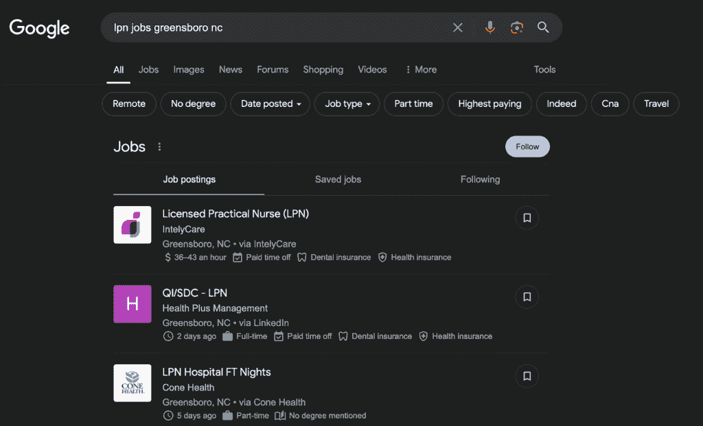
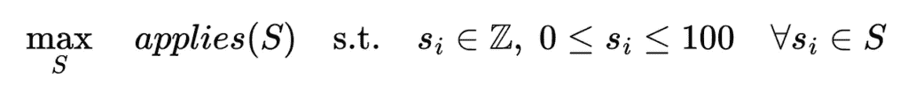
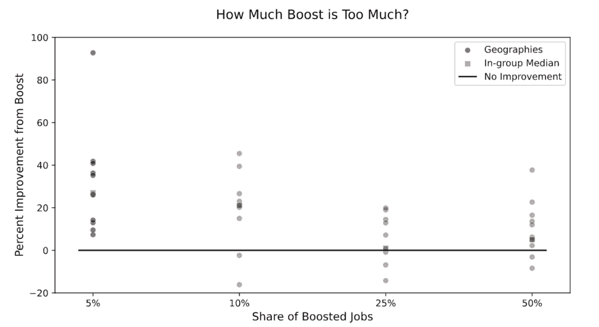

# 实验展示：我们如何优化我们的护士招聘板上的高级列表

> 原文：[`towardsdatascience.com/experiments-illustrated-how-we-optimized-premium-listings-on-our-nursing-job-board/`](https://towardsdatascience.com/experiments-illustrated-how-we-optimized-premium-listings-on-our-nursing-job-board/)

运行实验通常是数据科学家的任务。如果你是，恭喜你！这可以是一个有回报且影响深远的工作领域，但也需要典型以机器学习为主的数据科学课程之外的工具。

即使拥有最好的工具，也只有一小部分实验能带来有意义的商业价值。我很幸运设计并执行了许多实验。其中，我有几个成功的案例。从这些案例中，我分享了一些故事，以说明与实验相关的关键概念。

+   [多重比较与随机分配如何为我们节省 100 万美元的营销支出](https://towardsdatascience.com/experiments-illustrated-how-random-assignment-saved-us-1m-in-marketing-spend/)

+   [选择要测试的内容 & IntelyCare 如何测试其推荐奖金计划](https://towardsdatascience.com/experiments-illustrated-can-1-change-behavior-more-than-100/)

**背景：** 我在一家名为 IntelyCare 的公司工作。我们帮助护士与各种工作机会（全职、兼职、合同、日薪……应有尽有）建立联系。

+   我们的核心服务之一是专为护士提供的[招聘板](https://www.intelycare.com/jobs/)。如果你在 2025 年查看，你会注意到两种按日期和相关性排序工作的可能方式。

**为什么这很重要：** 按相关性排序的功能是我们目前保证付费客户良好体验的最好杠杆。它还给我们提供了一个机会，通过引导目光远离低质量工作，来提高我们招聘板的整体效率。

不幸的是，我们无法将*每个*工作都放在搜索结果的最顶部。我们在首页列表的数量和以增加申请为形式的经验质量之间面临权衡。

**如何工作：“相关性”并不像通常所意味的那样。抱歉！**

我们给每个工作分配一个 0 到 100 之间的分数。当用工作填充页面时，按相关性排序意味着我们按那个分数排序结果。就是这样！为了简洁起见，我们将任何分数高于 0 的工作称为“提升”。

我知道你在想什么，“这不是相关性！”你是对的，至少在这个词的正常意义上。分数不会因求职者或搜索词而变化。更好的名字应该是“与谷歌相关”。我们对此表示接受，因为我们的招聘板流量中有很大一部分来自谷歌，如下所示。

“按相关性排序”在这里是“与谷歌相关”的简称。（图片由作者提供）

**在数学上：** 我们有 N 个工作。每天我们生成一个介于 0 到 100 之间的 N 个整数的向量。我们将这个向量输入到一个名为谷歌的黑盒中。如果我们做得好，黑盒会奖励我们许多工作申请。

通过将“正确”的工作放在页面顶部（那里加载的单词），我们可以改进按时间顺序排序。在我们能够确定正确的工作之前，我们需要知道谷歌实际上是如何奖励排名更高的工作的。

## 第 0 天：当你一无所知时的进步

有时候，为了证明我后面将要做的所有简化假设的合理性，我会先从写下我想解决的数学方程式开始一个项目。我想象我们的方程式可能看起来像这样：

+   **S** 是我们的相关性得分向量。有 N 个工作，所以 S 中的每个 s_i（S 的一个元素）对应一个不同的工作。一个名为“申请”的函数将**S**转换为一个标量。我们每天都想找到使这个数字尽可能大的**S**——为 intelycare.com/jobs 生成最多工作申请的相关性得分。

+   “申请”是第 0 天的一个很好的目标函数。稍后，我们的目标函数可能会改变（例如，收入，终身价值）。但是，申请很容易计数，这让我可以在其他地方花费我的[复杂性令牌](https://mcfunley.com/choose-boring-technology)。这是第 0 天，人们。我们将在第 1 天回到这些问题。

+   问题。在我们开始向“申请”函数提供相关性得分之前，我们对“申请”函数一无所知。😱

**首先，最重要的是：** 由于我们知道关于“申请”函数一无所知，我们的第一个问题是，“我们如何选择一个持续的每日 S 向量波，以便我们可以学习“申请”函数的样子？”

+   我们知道（1）哪些工作被提升以及何时提升，（2）每天每个工作收到多少申请。注意缺少页面加载数据。这是第 0 天！你可能不会在第 0 天得到你想要的所有数据，但如果我们足够聪明，我们可以利用我们拥有的数据。

+   注意我们目标的微妙变化。之前，我们的目标是完成某些商业目标（最大化申请量），我们最终会回到这个目标。我们暂时摘下了商业帽子，戴上了科学帽子。我们现在的唯一目标就是学习。如果我们能学到一些东西，我们就可以（以后）用它来帮助实现某些商业目标。🤓

+   由于我们的目标是学习“一些”东西，首先我们想要避免学习“什么都没有”。记住这是第 0 天，我们没有保证谷歌怪物会关注我们如何排序。我们不妨孤注一掷，确保这个玩意儿在投入更多时间改进它之前能正常工作。

**我们如何选择初始的每日 S 向量波？** 我们会给每个工作一个 0 分（默认分数），并选择一个随机的工作子集将其提升到 100 分。

+   也许我在陈述显而易见的事情，但如果你想隔离页面位置对工作申请的影响，就必须是随机的。[我无法告诉你我进行了多少次电话面试，候选人在一个组中针对好客户进行 A/B 测试，而在另一个组中针对坏客户进行 A/B 测试。公平地说，我也审查过做同样事情的营销技术供应商 😭]。

+   随机性在以后会因其他原因而变得很棒。很可能有些工作比其他工作更能从页面放置中受益。我们将更容易地通过一个大的、随机生成的数据集来识别这些工作。

## 计划：微妙但重要的细节

我们知道我们不可能提升*所有*工作。每次我把一个工作放在页面顶部，就会把所有其他工作推到页面下方（这是典型的“[溢出](https://en.wikipedia.org/wiki/Spillover_(experiment))”例子）。

随着提升的工作越来越多，溢出效应变得更糟，我通过在排序中推低所有其他工作（包括其他提升的工作）对它们施加了更大和更大的惩罚。

+   除了少数例外，护理工作通常是面对面和当地的，因此任何提升的溢出都将限制在附近的其他工作。这很重要。

**我们如何选择初始的每日 S 向量波？(最终答案)** 我们将给每个工作分配一个 0 分（默认分数），并随机选择一部分工作将其提升到 100 分。*随机子集的大小将在不同地区有所不同。*

+   我们创建了 4 组具有大致相同网络流量的不同地理区域。每个组在我们认为重要的关键维度上都是平衡的。我们在每个组中随机提升不同百分比的工作。

看起来是这样的...

*每日申请量对比提升和不提升的工作。注意当提升的工作较少时，提升的工作表现更好。(图片由作者提供)*

+   每个黑色圆圈代表一个不同的地理区域。它的高度显示了提升工作与其他工作之间申请量每工作的差异（以百分比衡量）。

+   虽然总体上组是平衡的，但各个地理区域差异很大。尽管如此，平衡仍然很重要。否则，图表中显示的可能是每个组中城市/乡村或大/小地理区域的混合造成的。实际上，我们相信结果来自我们的相关性评分。

+   对这张图的快速而粗略的解释可能是这样的，“页面上部的 5%的工作每天比下部的 95%的工作多 26%的申请量。页面上部的 10%的工作每天比下部的 90%的工作多 21%的申请量……”等等。我永远不会那么大胆地说在现实生活中会是这样，但在一个完美的实验世界中这将是真实的。

+   到我们提升 25%的职位时，提升体验已经完全平均化了！对于中位数地理区域，我们稀释了高级位置的好处，实际上已经没有多少了。[“当每个人都超级时，就没有人会被注意到！<邪恶的笑声>。”](https://www.youtube.com/watch?v=fmSO2cz2ozQ)你能想象以这种方式艰难地学到这一点吗？

+   还有许多其他层次可以剥开。也许对于有许多列表的护理专业，稀释发生得更快？关于与我们长期日薪人员业务重叠的州呢？有许多很好的问题，我们对一些问题有答案，但所有这些问题都超出了这篇文章的范围。

**接下来是什么？** 第一天是真正的乐趣开始的时候！🎉

+   我们现在有了防止稀释我们高级体验的防护栏（超级重要），但每天最好的 10%的职位提升是什么？显然，我们的付费客户有优先权，但接下来呢？

+   提升是否对某些职位比其他职位更有帮助？我们实验中随机生成的数据非常适合回答这个问题以及许多其他问题。我们将把这些问题留到未来的文章中讨论。

+   一旦我们有了提升策略，我们的目标真的是最大化**总数**的申请量吗？或者我们只关心提升职位的申请量？🤔（有时我想念那些所有职位都同等相关的 Day 0 的日子。可能是有时候要回顾一下文章顶部的那些方程式了。）

## 对那些坚持到这里的人来说，关键要点

+   通过深思熟虑我们如何生成初始数据，我们很快找到了对我们问题的令人信服的答案，为回答许多未来的问题做好了准备，并且节省了大量时间，因为我们试图在不存在的历史数据上构建提升模型。

+   在想进行测试吗？那就去做吧！如果你执行得好，你可以在图表中清楚地看到结果，并避免所有复杂的统计数据（[必要的 xkcd](https://www.explainxkcd.com/wiki/index.php/2400:_Statistics)参考）。[嗯，也许*大多数*统计数据。我仍然喜欢一个好的回归表。]

+   溢出效应无处不在。有时在汇总的群体中改变处理方式，就像这里一样，可能会有所帮助。这可能会迅速减少样本量，但我认为拥有一个有意义的较小数据集比拥有一个垃圾数据集要好。

## 奖励：我们在 2023 年进行了这个实验。现在情况如何？

在我们的小型地理随机实验期间，你可以在图表中看到，我们的高级职位空缺表现比常规职位好约 25%（这意味着平均有 25%的申请量）。

**为什么这很重要：** 我们花费了一年的时间来增长和迭代我们的产品，以确保我们的高级列表提供最佳体验。看看一些最近的数据……（我实际上是在写这篇文章时运行这些查询）

+   提升职位空缺比常规职位空缺收到**425%更多的申请**。

+   与常规职位相比，提升职位**有 450%的可能性至少收到一份申请**。

还不错！这不是随机化的，所以 425%包括了各种选择偏差、额外的产品工作、一个优秀的 SEO 团队以及成功的电子邮件运营，所有这些都加上来自优质页面位置的增量效应。重要的是，所有额外的产品和营销工作都集中在少数几个职位上，正如我们的初步测试所建议的那样。🏆
