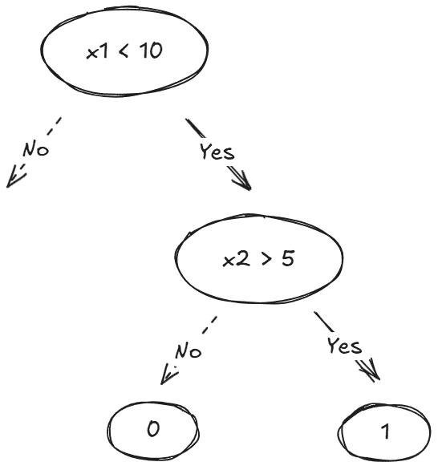
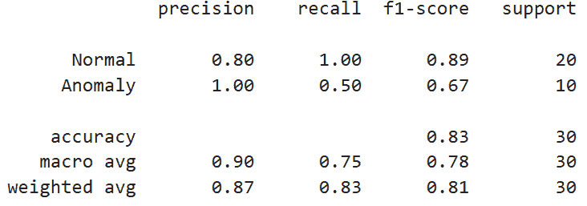
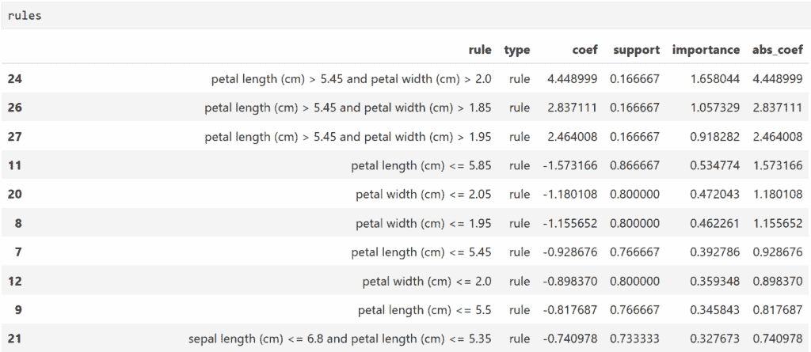
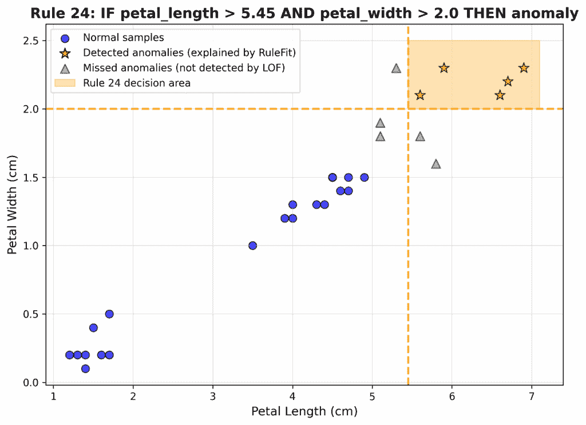

# RuleFit 的可解释异常检测：直观指南

> 原文：[`towardsdatascience.com/explainable-anomaly-detection-with-rulefit-an-intuitive-guide/`](https://towardsdatascience.com/explainable-anomaly-detection-with-rulefit-an-intuitive-guide/)

<mdspan datatext="el1751604886452" class="mdspan-comment">每次你向你的利益相关者展示你的异常检测结果时，他们紧接着问的总是“*为什么*？”</mdspan>

在实践中，仅仅标记异常通常是不够的。理解*出了什么问题*对于确定最佳下一步行动至关重要。

然而，大多数基于机器学习的异常检测方法都停留在生成异常分数。它们本质上是黑盒的，这使得理解它们的输出变得痛苦——为什么这个样本的异常分数比它的邻居高？

为了应对这一可解释性挑战，你可能已经求助于流行的可解释人工智能（XAI）技术。也许你正在计算特征重要性以识别哪些变量是导致异常的原因，或者你正在进行反事实分析以查看一个案例与正常情况的接近程度。

这些方法很有用，但如果你能做更多呢？如果你能推导出一组可解释的**IF-THEN 规则**来描述已识别的异常呢？

这正是**RuleFit**算法[1]所承诺的。

在这篇文章中，我们将探讨 RuleFit 算法的直观工作原理，如何将其应用于解释检测到的异常，并详细分析一个具体案例研究。

* * *

## 1. 它是如何工作的？

在深入技术细节之前，让我们首先明确应用算法后我们想要达到的目标：我们希望得到一组**IF-THEN 规则**，这些规则可以定量描述异常样本，以及这些规则的重要性。

为了达到这个目标，我们需要回答两个问题：

（1）我们如何从数据中生成有意义的 IF-THEN 条件？

（2）我们如何计算规则重要性分数以确定哪些规则真正重要？

RuleFit 算法通过将工作分为两个互补的部分来解决这些问题：“规则”和“拟合”。

### 1.1 RuleFit 中的“规则”

在 RuleFit 中，一个规则看起来是这样的：

**IF** x1 < 10 **AND** x2 > 5 **THEN** 1 **ELSE** 0

如果我们这样可视化，这个结构看起来会更熟悉吗？



图 1. 一个规则只是决策树中的一条特定路径。（图片由作者提供）

是的，它是一个**决策树**！这里的规则只是遍历树中的特定路径，从根节点到叶节点。

在 RuleFit 中，规则生成过程高度依赖于构建决策树，这些决策树根据输入特征预测目标结果。一旦树构建完成，从根节点到树中任意节点的任何路径都可以转换为决策规则，就像我们在上面的例子中看到的那样。

为了确保规则具有多样性，RuleFit 不仅仅拟合一棵决策树。相反，它利用树集成算法（例如，随机森林、梯度提升树等）生成许多不同的决策树。

此外，这些树的一般深度也不同。这带来了生成不同长度规则的益处，进一步增强了多样性。

在这里，我们应该注意，尽管集成树是考虑到预测目标结果而构建的，但 RuleFit 算法并不真正关心最终预测结果。它只是将这一树构建练习作为提取有意义的、定量规则的手段。

有效地，这意味着我们将丢弃每个节点中的预测值，**只保留**导致我们到达该节点的**条件**。这些条件产生了我们关心的规则。

好的，现在我们可以总结 RuleFit 算法的第一步处理：规则构建。这一步骤的结果是一系列可能**解释**特定数据行为的候选规则。

但在所有这些规则中，哪些真正值得我们关注？

好吧，这就是 RuleFit 的第二步发挥作用的地方。我们“拟合”以进行排名。

### 1.2 RuleFit 中的“拟合”

实际上，RuleFit 通过特征选择揭示最重要的规则。

首先，RuleFit 将每个规则视为一个新的**二进制特征**，也就是说，如果规则对特定样本成立，则该二进制特征获得值为 1；否则，其值为 0。

然后，RuleFit 使用原始数据集的所有“原始”特征以及从规则中派生出的新二进制特征，通过 Lasso 进行稀疏线性回归来预测目标结果。这样，每个特征（原始特征+二进制规则特征）都会得到一个系数。

Lasso 的一个关键特性是其损失函数强制那些不重要的特征的系数恰好为零。这实际上意味着那些不重要的特征被从模型中移除。

结果，通过简单地检查哪些二进制规则特征在 Lasso 分析中幸存，我们就会立即知道哪些规则在准确预测目标结果方面很重要。此外，通过查看与规则特征相关的系数大小，我们能够对规则的重要性进行排序。

### 1.3 回顾

我们刚刚介绍了 RuleFit 算法背后的基本理论。总结来说，我们可以将这种方法视为提供可解释性的两步解决方案：

(1) 它首先通过训练决策树集成来提取规则。**这就是“规则”部分**。

(2) 它巧妙地将这些规则转换为二进制特征，并使用稀疏线性回归（Lasso）进行标准特征选择。**这就是“拟合”部分**。

最后，具有非零系数的幸存规则是值得我们关注的重点。

到目前为止，你可能已经注意到“预测目标结果”在“规则”和“拟合”步骤中都出现了。如果我们处理的是一个回归或分类问题，那么“目标结果”是我们想要预测的数值或标签，这是很容易理解的，规则可以解释为驱动预测的模式。

但是，对于主要是一个无监督任务的异常检测，我们该如何应用 RuleFit 呢？

* * *

## 2. 异常解释与 RuleFit

### 2.1 应用模式

首先，我们需要将无监督的可解释性问题转化为一个监督问题。下面是如何做的。

一旦我们得到了异常检测的结果（无论我们使用了哪种算法），我们就可以创建二元标签，即对于已识别的异常用 1 表示，对于正常数据点用 0 表示，作为我们的“目标结果”。这样，我们就拥有了 RuleFit 所需的一切：原始特征和预测的目标结果。

然后，RuleFit 可以施展其魔法，生成一组候选规则，并拟合一个稀疏线性回归模型，以保留重要的规则。结果模型的系数将表明每个规则对将实例分类为异常的对数几率贡献了多少。换句话说，它们告诉我们哪些规则组合最强烈地将样本推向被标记为异常。

注意，从理论上讲，你也可以使用异常分数（由主要异常检测模型产生）作为“目标结果”。这将改变 RuleFit 的应用场景，从分类设置变为回归设置。

这两种方法都是有效的，但它们回答的问题略有不同：在二元标签分类设置中，RuleFit 揭示的是“**是什么使某物成为异常？**”；在异常分数回归设置中，RuleFit 揭示的是“**是什么驱动了异常的严重程度？**”。

在实践中，两种方法生成的规则可能非常相似。尽管如此，使用二元异常标签作为 RuleFit 的目标在解释检测到的异常中更为常见。在解释和直接应用于创建标记未来异常的业务规则方面，这种方法非常直接。

### 2.2 案例研究

让我们通过一个具体的例子来了解 RuleFit 是如何实际工作的。在这里，我们将使用 Iris 数据集[2]（许可 CC BY 4.0）创建一个异常检测场景，其中每个样本由 4 个特征（花萼长度、花萼宽度、花瓣长度、花瓣宽度）组成，并标记为以下三个类别之一：Setosa、Versicolor 和 Virginica。

#### 第 1 步：数据设置

首先，我们将使用所有的 Setosa 样本（50 个）和所有的 Versicolor 样本（50 个）作为“正常”样本。对于“异常”样本，我们将使用 Virginica 样本的一个子集（10 个）。

```py
import numpy as np
import pandas as pd
import matplotlib.pyplot as plt
import seaborn as sns
from sklearn.datasets import load_iris
from sklearn.preprocessing import StandardScaler
from sklearn.metrics import classification_report, confusion_matrix
np.random.seed(42)

# Load the Iris dataset
iris = load_iris()
X = pd.DataFrame(iris.data, columns=iris.feature_names)
y_true = iris.target

# Get normal samples (Setosa + Versicolor)
normal_mask = (y_true == 0) | (y_true == 1)
X_normal_all = X[normal_mask].copy()

# Get Virginica samples
virginica_mask = (y_true == 2)
X_virginica = X[virginica_mask].copy()

# Randomly select 10
anomaly_indices = np.random.choice(len(X_virginica), size=10, replace=False)
X_anomalies = X_virginica.iloc[anomaly_indices].copy()
```

为了使场景更真实，我们创建了一个单独的训练集和测试集。训练集包含纯“正常”样本，而测试集由随机抽取的 20 个“正常”样本和 10 个“异常”样本组成。

```py
train_indices = np.random.choice(len(X_normal_all), size=80, replace=False)
test_indices = np.setdiff1d(np.arange(len(X_normal_all)), train_indices)

X_train = X_normal_all.iloc[train_indices].copy()
X_normal_test = X_normal_all.iloc[test_indices].copy()

# Create test set (20 normal + 10 anomalous)
X_test = pd.concat([X_normal_test, X_anomalies], ignore_index=True)
y_test_true = np.concatenate([
    np.zeros(len(X_normal_test)),   
    np.ones(len(X_anomalies))       
])
```

#### 第 2 步：异常检测

接下来，我们执行异常检测。在这里，我们假装我们不知道实际的标签。在本案例研究中，我们应用*局部离群因子*（LOF）作为异常检测算法，该算法通过测量数据点与其局部邻居密度的隔离程度来定位异常。当然，你也可以尝试其他异常检测算法，如*高斯混合模型*（GMM）、*K 最近邻*（KNN）和*自编码器*等。然而，请记住，这里的目的是仅获取检测结果，我们主要关注的是第 3 步中的异常解释。

具体来说，我们将使用**pyOD**库来训练模型并进行推理：

```py
# Install the pyOD library
#!pip install pyod

from pyod.models.lof import LOF

# Standardize features
scaler = StandardScaler()
X_train_scaled = scaler.fit_transform(X_train)
X_test_scaled = scaler.transform(X_test)

# Local Outlier Factor
lof = LOF(n_neighbors=3)
lof.fit(X_train_scaled)

train_scores = lof.decision_function(X_train_scaled)
test_scores = lof.decision_function(X_test_scaled)
threshold = np.percentile(train_scores_lof, 99)
y_pred = (test_scores > threshold).astype(int)
```

注意，我们使用了在训练集上获得的异常分数的 99%分位数作为阈值。对于单个测试样本，如果其异常分数高于阈值，则该样本将被标记为“异常”。否则，该样本被认为是“正常”。

在这个阶段，我们可以快速检查检测性能，方法如下：

```py
classification_report(y_test_true, y_pred, target_names=['Normal', 'Anomaly'])
```



（图片由作者提供）

结果并不十分理想。在 10 个真实异常中，只有 5 个被捕获。然而，好消息是 LOF 没有产生任何假阳性。你可以通过调整 LOF 模型的超参数、调整阈值或甚至考虑集成学习策略来进一步提高性能。但请记住：我们的目标不是获得最佳的检测精度。相反，我们的目标是看看 RuleFit 是否能够正确生成规则来解释 LOF 模型检测到的异常。

#### 第 3 步：异常解释

现在我们正在进入核心主题。要应用 RuleFit，让我们首先从**[imodels](https://github.com/csinva/imodels)**安装库，这是一个 sklearn 兼容的、用于简洁、透明和准确预测建模的可解释机器学习包：

```py
pip install imodels
```

在这种情况下，我们将考虑一个二分类标签分类设置，其中 LOF 模型标记的异常样本（在测试集中）被标记为 1，而其他未标记的正常样本（也在测试集中）被标记为 0。请注意，我们是基于 LOF 的检测结果进行标记的，而不是实际的地面真相，我们假装我们不知道。

要初始化 RuleFit 模型：

```py
from imodels import RuleFitClassifier

rf = RuleFitClassifier(                 
        max_rules = 30,           
        lin_standardise=True,           
        include_linear=True,           
        random_state = 42
)
```

然后，我们可以继续拟合 RuleFit 模型：

```py
rf.fit(
    X_test, 
    y_pred, 
    feature_names=X_test.columns
)
```

在实践中，通常进行快速合理性检查以评估 RuleFit 模型的预测与由 LOF 算法确定的异常标签的一致性是一个好习惯：

```py
from sklearn.metrics import accuracy_score, roc_auc_score

y_label = rf.predict(X_test)               
y_prob  = rf.predict_proba(X_test)[:, 1]   

print("accuracy:", accuracy_score(y_pred, y_label))
print("roc-auc:", roc_auc_score (y_pred, y_prob))
```

对于我们的情况，我们看到两个打印输出都是 1。这证实了 RuleFit 模型已经成功地学习了 LOF 用于识别异常的模式。对于你自己的问题，如果你观察到远低于 1 的值，你可能需要微调你的 RuleFit 超参数。

现在让我们来检查规则：

```py
rules = rf._get_rules()
rules = rules[rules.coef != 0]                         
rules = rules[~rules.type.str.contains('linear')]      
rules['abs_coef'] = rules['coef'].abs()
rules = rules.sort_values('importance', ascending=False)
```

RuleFit 算法返回总共 24 条规则。下面是一个快照：



（图片由作者提供）

让我们首先明确结果列的含义：

+   “rule”列和“abs_coef”列的含义是显而易见的。

+   “type”列有两个独特的值：“linear”和“rule”。“linear”表示原始输入特征，而“rule”表示从决策树生成的“IF-THEN”条件。

+   “coef”列表示 Lasso 回归分析产生的系数。正值表示如果规则适用，被分类为异常类的**log-odds**增加。更大的绝对值表示该规则对预测的**影响更强**。

+   “support”列记录了规则适用的数据样本的比例。

+   “importance”列是系数的绝对值乘以规则所采用的二进制（0 或 1）值的标准差计算得出的。那么为什么这样做呢？正如我们刚才讨论的，更大的绝对系数意味着对 log-odds 有更强的直接影响。这是显而易见的。对于标准差项，它实际上衡量了规则的“**判别能力**”。例如，如果一个规则几乎总是为真（非常小的标准差），它就不能有效地分割你的数据。如果规则几乎总是为假，情况也是如此。换句话说，规则不能*解释*目标变量中的大部分变化。因此，重要性分数结合了规则影响强度（系数大小）以及它如何在不同样本之间进行区分（标准差）。

对于我们的具体情况，我们只看到一个高影响规则（规则#24）：

> *如果一朵花的 petals 长度超过 5.45 厘米**并且**宽度超过 2 厘米，LOF 将其分类为“异常”的概率会增加 85 倍。（注意：exp(4.448999) ~= 85）

规则#26 和#27 嵌套在规则#24 中。这在实践中很常见，因为 RuleFit 通常会产生由相邻树分割产生的“家族”相似规则。因此，真正用于描述 LOF 识别的异常的规则只有规则#24。

此外，我们看到规则#24 的支持度为 0.1667（5/30）。这实际上意味着所有 5 个 LOF 识别的异常都可以由这个规则解释。我们可以在下面的图中更清楚地看到这一点：



这就是描述识别到的异常的规则！

* * *

## 3. 结论

在这篇博客文章中，我们探讨了 RuleFit 算法作为可解释异常检测的有力解决方案。我们讨论了：

+   **工作原理**：一种两步法，首先使用决策树拟合以推导出有意义的规则，然后通过稀疏线性回归对规则的重要性进行排序。

+   **如何应用于异常解释**：使用检测结果作为伪标签，并将它们用作 RuleFit 模型的“目标结果”。

在你的建模工具包中有了 RuleFit，下次利益相关者询问“这是为什么异常？”时，你将拥有他们可以理解和采取行动的明确的 IF-THEN 规则。

## 参考文献

[1] Jerome H. Friedman, Bogdan E. Popescu，通过规则集成进行预测学习，[arXiv](https://arxiv.org/abs/0811.1679)，2008。

[2] 费舍尔，R. A.，鸢尾花 [数据集]。[UCI 机器学习仓库](https://doi.org/10.24432/C56C76)，1936。
