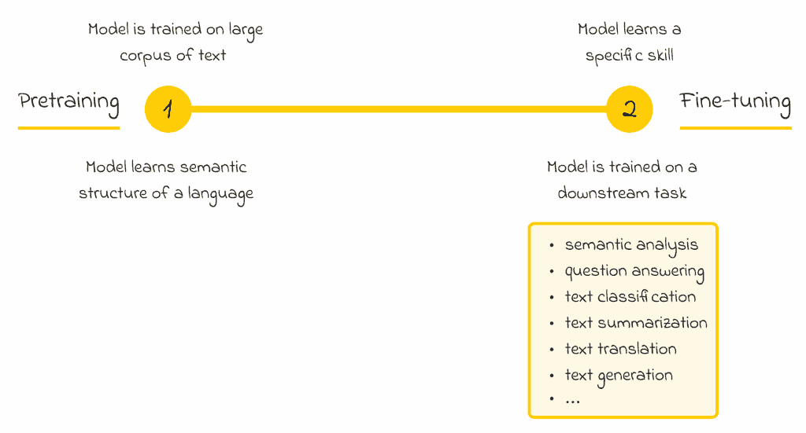
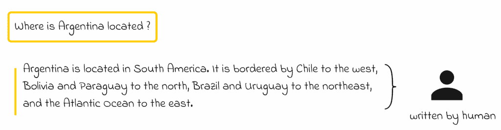
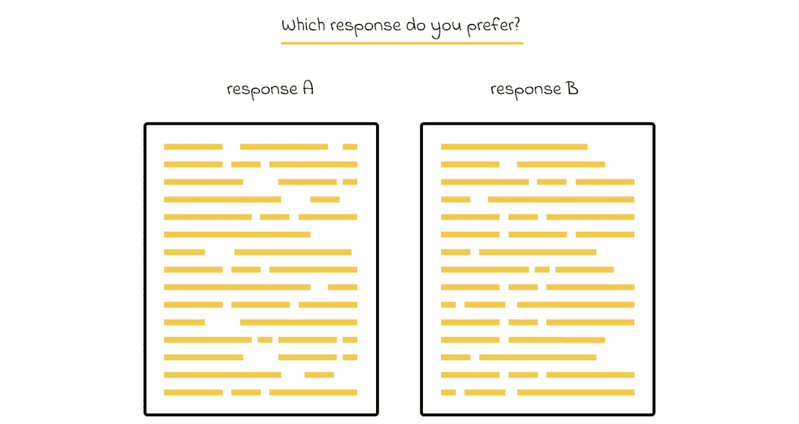
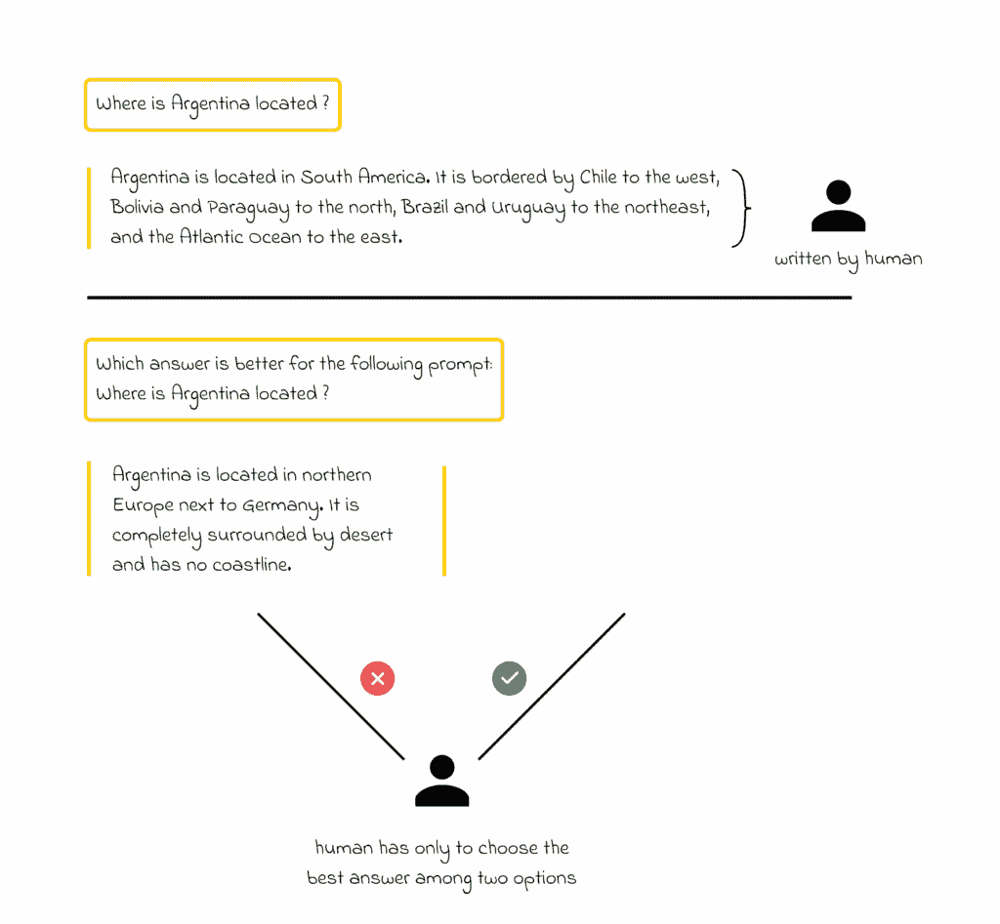
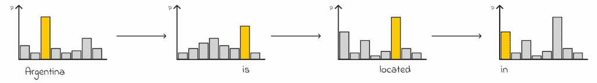
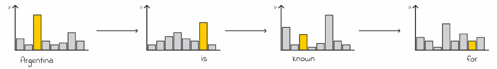
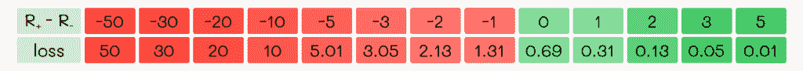
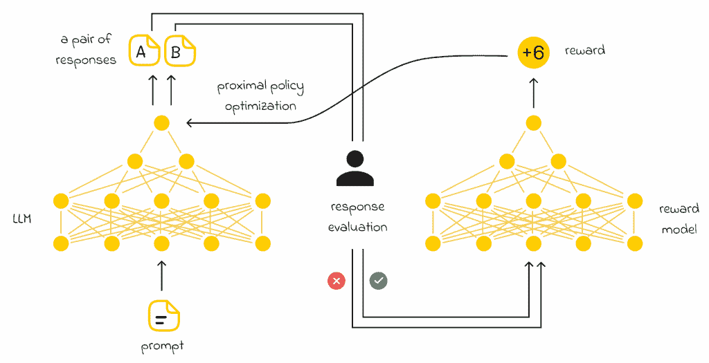

# 从人类反馈中简单解释强化学习

> 原文：[`towardsdatascience.com/explained-simply-reinforcement-learning-from-human-feedback/`](https://towardsdatascience.com/explained-simply-reinforcement-learning-from-human-feedback/)

## <mdspan datatext="el1750721327755" class="mdspan-comment">介绍</mdspan>

2022 年 ChatGPT 的出现完全改变了世界对人工智能的最初认知。ChatGPT 令人难以置信的表现导致了其他强大 LLMs 的快速发展。

我们可以粗略地说，ChatGPT 是 GPT-3 的升级版。但与之前的 GPT 版本相比，这次 OpenAI 的开发者不仅使用了更多的数据或更复杂的模型架构。相反，他们设计了一种令人难以置信的技术，实现了突破。

> *在这篇文章中，我们将讨论 RLHF——这是 ChatGPT 核心中实施的一个基本算法，它超越了人类标注对 LLMs 的限制。尽管该算法基于近端策略优化（PPO），但我们将保持解释简单，不会深入强化学习的细节，这不是本文的重点。*

## ChatGPT 之前的 NLP 发展

为了更好地了解上下文，让我们回顾一下在 ChatGPT 出现之前，LLMs 是如何发展的。在大多数情况下，LLM 的发展包括两个阶段：

+   **预训练**

+   **微调**

预训练与微调框架

预训练包括语言建模——这是一个模型试图预测上下文中隐藏的标记的任务。模型为隐藏标记产生的概率分布与真实分布进行比较，用于损失计算和进一步的反向传播。通过这种方式，模型学习语言的语义结构和词语背后的含义。

> *如果您想了解更多关于**预训练与微调框架**的信息，请查看我的[关于 BERT 的文章](https://towardsdatascience.com/bert-3d1bf880386a/)。*

之后，模型在下游任务上进行微调，这可能包括不同的目标：文本摘要、文本翻译、文本生成、问答等。在许多情况下，微调需要一个由人类标记的数据集，该数据集最好包含足够的文本样本，以便模型能够很好地泛化其学习并避免过拟合。

这就是微调的局限性所在。**数据标注通常是一项耗时的人类任务**。以问答任务为例。为了构建训练样本，我们需要一个手动标记的问题和答案数据集。对于每个问题，我们需要一个由人类提供的精确答案。例如：

在数据标注过程中，对提示提供完整答案需要大量的人类时间。

在现实中，为了训练 LLM，我们需要数百万甚至数十亿这样的（问题，答案）对。**这个标注过程非常耗时，并且扩展性不好。**

## RLHF

理解了主要问题后，现在正是深入探究 RLHF 细节的完美时机。

如果你已经使用过 ChatGPT，你可能遇到过 ChatGPT 要求你选择一个更适合你初始提示的答案的情况：

*ChatGPT 界面要求用户对两个可能的答案进行评分。*

这些信息实际上被用来持续改进 ChatGPT。让我们来了解这是如何实现的。

首先，重要的是要注意，在两个选项中选出最佳答案对于人类来说比提供一个精确的开放性问题答案要简单得多。我们将探讨的想法正是基于这一点：我们希望人类只需从两个可能的选项中选择一个答案来创建标注数据集。

*在两个选项之间进行选择比要求某人写出最佳可能的响应要容易得多。*

## 响应生成

在 LLM 中，有几种可能的方式可以从预测的标记概率分布中生成一个响应：

+   拥有一个标记的输出分布 *p*，模型总是确定性地选择概率最高的标记。

*模型总是选择具有最高 softmax 概率的标记。*

+   拥有一个标记的输出分布 *p*，模型根据其分配的概率随机采样一个标记。

*模型每次随机选择一个标记。最高的概率并不保证相应的标记会被选择。当再次运行生成过程时，结果可能会有所不同。*

这种第二种采样方法会导致模型行为更加随机化，从而允许生成多样化的文本序列。目前，我们假设我们生成了许多这样的序列对。这些对的结果数据集由人类进行标注：对于每一对，都会要求人类判断两个输出序列中哪一个更适合输入序列。标注数据集将在下一步中使用。

> *在 RLHF 的背景下，以这种方式创建的标注数据集被称为**“人类反馈”**。*

## 奖励模型

在标注数据集创建后，我们使用它来训练一个所谓的“奖励”模型，其目标是学习如何数值估计给定答案对于初始提示的好坏。理想情况下，**我们希望奖励模型为好的响应生成正值，为不好的响应生成负值**。

> *谈到奖励模型，其架构与最初的 LLM 完全相同，只是在最后一层，模型不是输出一个文本序列，而是输出一个浮点值——即对答案的估计。*
> 
> *将初始提示和生成的响应作为输入传递给奖励模型是必要的。*

## 损失函数

你可能会逻辑上问，如果没有数值标签在注释数据集中，奖励模型将如何学习这个回归任务。这是一个合理的问题。为了解决这个问题，我们将使用一个有趣的技巧：**我们将同时通过一个好的和一个坏的答案通过奖励模型，这将最终输出两个不同的估计（奖励）。**

然后我们将巧妙地构建一个损失函数，以便相对比较它们。

RLHF 算法中使用的损失函数。R₊ 指的是分配给更好响应的奖励，而 R₋ 是对更差响应估计的奖励。

让我们为损失函数插入一些参数值并分析其行为。下面是一个插入值的表格：

一个根据 R₊ 和 R₋ 之间的差异计算损失值的表格。

我们可以立即观察到两个有趣的见解：

+   *如果 R₊ 和 R₋ 之间的差异是负的*，即更好的响应比更差的响应获得更低的奖励，那么损失值将与奖励差异成比例地增大，这意味着模型需要显著调整。

+   *如果 R₊ 和 R₋ 之间的差异是正的*，即更好的响应比更差的响应获得更高的奖励，那么损失将在区间 (0, 0.69) 内被限制在远低的值，这表明模型在区分好和坏的响应方面做得很好。

> *使用这种损失函数的一个好处是，模型可以自己学习适当的奖励，我们（人类）不需要明确地对每个响应进行数值评估——只需提供一个二元值：给定的响应是更好还是更差。*

## 训练原始 LLM

然后使用训练好的奖励模型来训练原始 LLM。为此，我们可以向 LLM 提供一系列新的提示，LLM 将生成输出序列。然后，将输入提示以及输出序列输入到奖励模型中，以估计这些响应有多好。

在生成数值估计后，这些信息被用作对原始 LLM 的反馈，然后 LLM 执行权重更新。这是一个非常简单但优雅的方法！

RLHF 训练图

> *大多数情况下，在最后一步调整模型权重时，会使用强化学习算法（通常是通过近端策略优化 PPO 完成）。*
> 
> *即使从技术上讲不正确，如果你不熟悉强化学习或 PPO，你可以大致将其视为与正常机器学习算法中的反向传播类似。*

## 推理

在推理过程中，仅使用原始训练模型。同时，模型可以通过收集用户提示并在定期询问他们对两种响应中哪一种更好进行评分，在后台不断得到改进。

## 结论

在本文中，我们研究了 RLHF——一种高效且可扩展的技术，用于训练现代大型语言模型。将大型语言模型与奖励模型优雅地结合，使我们能够显著简化人类执行的标注任务，这在过去通过原始微调程序进行时需要巨大的努力。

> *RLHF 被用于许多流行模型的核心，如 ChatGPT、Claude、Gemini 或 Mistral。*

### 资源

+   [介绍 ChatGPT | OpenAI](https://openai.com/index/chatgpt/)

+   [展示从人类反馈中进行强化学习（RLHF）| Hugging Face](https://huggingface.co/blog/rlhf)

*除非另有说明，所有图像均为作者所有*
