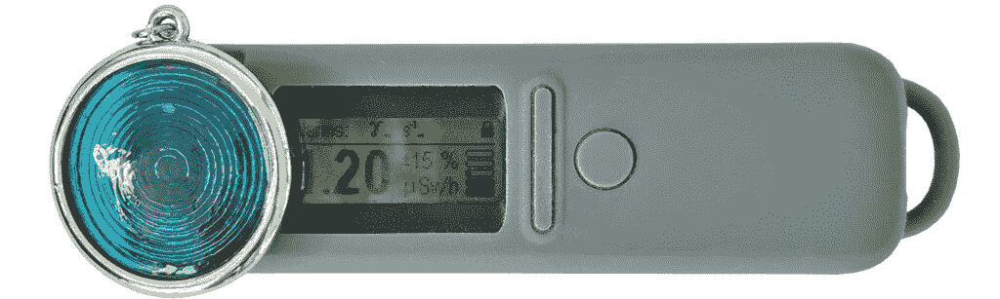
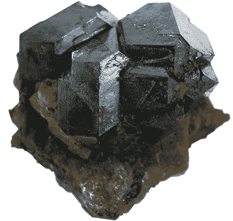
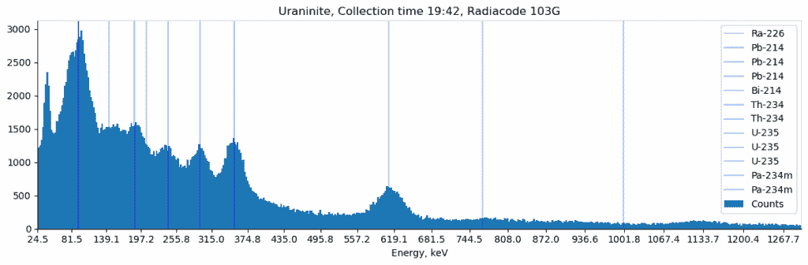
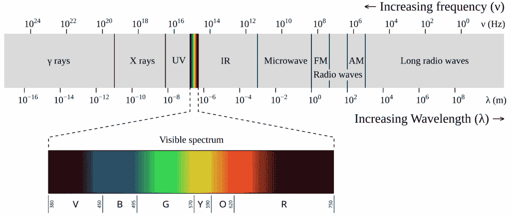
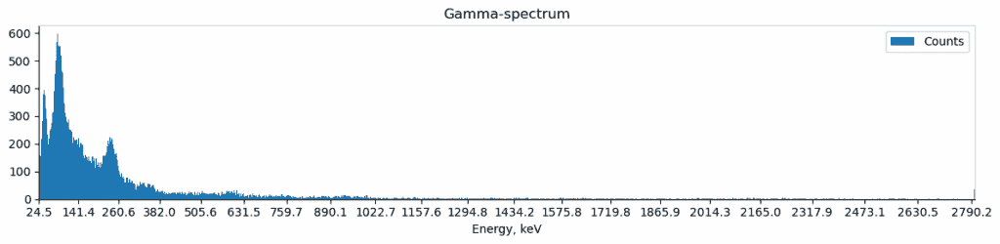
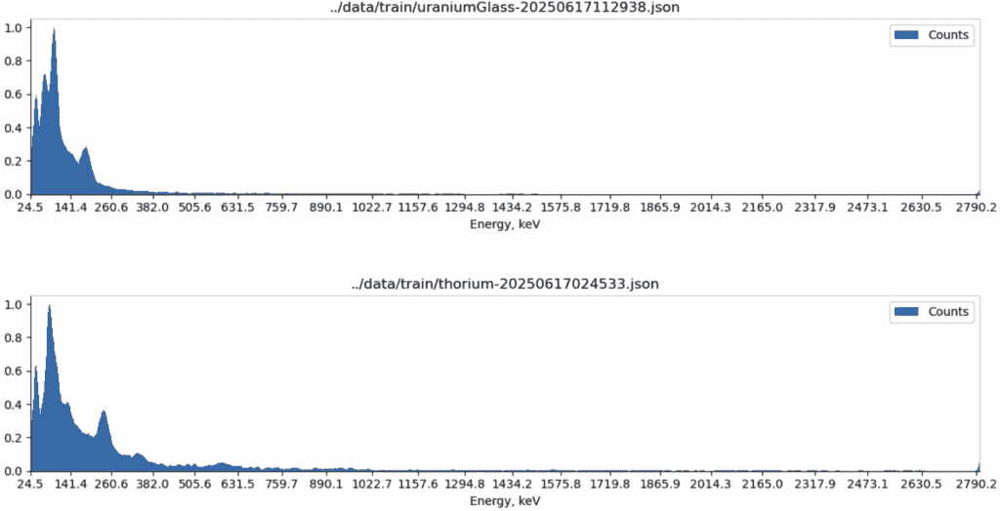
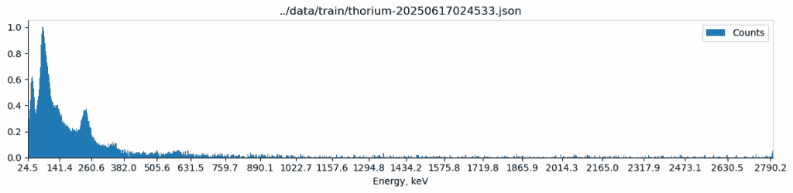
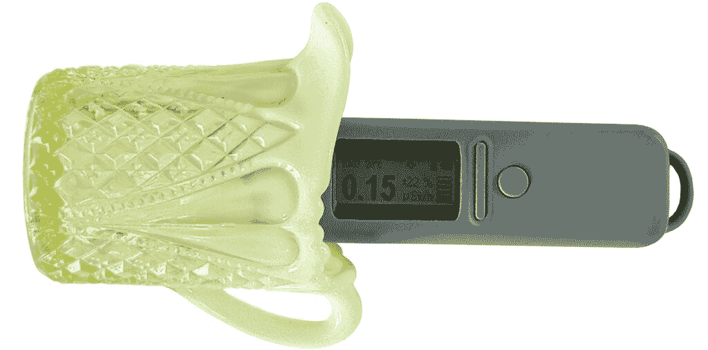
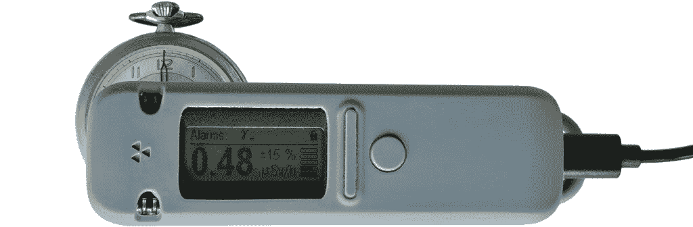
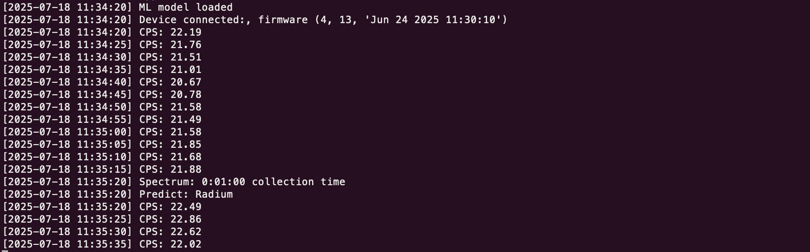

# Exploratory Data Analysis: Gamma Spectroscopy in Python (Part 2)

> 原文：[`towardsdatascience.com/exploratory-data-analysis-gamma-spectroscopy-in-python-part-2/`](https://towardsdatascience.com/exploratory-data-analysis-gamma-spectroscopy-in-python-part-2/)

<mdspan datatext="el1752873323864" class="mdspan-comment">在[第一部分](https://towardsdatascience.com/exploratory-data-analysis-gamma-spectroscopy-in-python/)</mdspan> [中](https://towardsdatascience.com/exploratory-data-analysis-gamma-spectroscopy-in-python/), 我对伽马光谱数据进行了探索性数据分析。我们能够看到，使用现代闪烁探测器，我们不仅能看到物体是放射性的。通过伽马光谱，我们还能知道*为什么*它是放射性的以及物体包含哪些同位素。

在这部分，我们将更进一步，我将展示如何制作和训练一个用于检测放射性元素的机器学习模型。

在我们开始之前，有一个**重要**的**警告**。本文收集的所有数据文件都可在 Kaggle 上找到，读者可以在没有真实硬件的情况下训练和测试他们的机器学习模型。如果您想测试*真实物体*，请自行承担风险。我的测试使用了可以合法找到和购买的来源，如复古铀玻璃或带有镭 dial 涂料的旧手表。请检查您当地的法律，并阅读处理放射性材料的安全指南。本测试使用的来源并不严重危险，但仍需小心处理！

现在，让我们开始吧！我将展示如何收集数据，训练模型，并使用[Radiacode](https://102.radiacode.com/DmitriiE)闪烁探测器运行它。对于那些没有 Radiacode 硬件的读者，数据源的链接已添加到文章末尾。

## 方法论

本文将包含几个部分：

1.  我将简要解释什么是伽马光谱以及我们如何使用它。

1.  我们将为我们的机器学习模型收集数据。我将展示使用 Radiacode 设备收集光谱的代码。

1.  我们将训练模型并控制其准确性。

1.  最后，我将制作一个基于 HTMX 的 Web 前端，我们可以实时查看结果。

让我们开始吧！

## 1. 伽马光谱

这是对[第一部分](https://towardsdatascience.com/exploratory-data-analysis-gamma-spectroscopy-in-python/)的简要回顾，更多细节，我强烈建议您先阅读它。

为什么伽马光谱如此有趣？我们周围的某些物体可能略微具有放射性。其来源从建筑物中花岗岩的自然辐射到一些复古手表中的镭或现代钍钨丝中的钍。*盖革计数器*只能显示检测到的放射性粒子的数量。*闪烁探测器*不仅显示粒子的数量，还显示它们的能量。这是一个关键的区别——结果证明，不同的放射性材料会以不同的能量发射伽马射线，每种材料都有其自己的“指纹”。

作为第一个例子，我在中国商店购买了这款吊坠：



图片由作者提供

它被宣传为“离子生成器”，所以我已怀疑这个吊坠可能略微具有放射性（正如其名称所暗示的，电离辐射可以产生离子）。确实，正如我们在仪表屏幕上所看到的，其放射性水平约为 1,20 *µSv*/h，比背景（0,1 *µSv*/h）高出 12 倍。它并不疯狂高，与飞行中的飞机上的水平相当，但仍然具有统计学意义 😉

然而，仅通过观察数值，我们无法得知物体为何具有放射性。伽马光谱会显示物体内部含有哪些同位素：


图片由作者提供

在这个例子中，吊坠含有 [钍-232](https://en.wikipedia.org/wiki/Thorium-232)，钍衰变链产生镭和锕。正如我们在图表上所看到的，锕-228 峰在光谱中清晰可见。

作为第二个例子，假设我们找到了这块岩石：



图片来源 [维基百科](https://en.wikipedia.org/wiki/Uraninite)

这是铀矿，一种含有大量二氧化铀的矿物。这种标本可以在德国、捷克共和国或美国的某些地区找到。如果我们从矿物店购买，它可能上面有标签。但在野外，通常不是这样 😉 通过伽马光谱，我们可以看到这样的图像：



图片由作者提供

通过将峰与已知的同位素进行比较，我们可以判断岩石中含有铀，但例如不含有钍。

伽马光谱的物理解释也非常迷人。正如我们在下面的图表上所看到的，伽马射线实际上是光子，属于与可见光相同的谱系：



电磁谱，图片来源 [维基百科](https://en.wikipedia.org/wiki/Electromagnetic_radiation)

当有些人认为放射性物体在黑暗中发光时，这实际上是正确的！每种放射性材料确实会以它自己独特的“颜色”发光，但在非常远且对人眼不可见的光谱部分。

第二件令人着迷的事情是，仅在 10-20 年前，伽马光谱仪仅限于机构和大型实验室使用（在最好的情况下，一些质量未知的晶体可以在 eBay 上找到）。如今，由于电子技术的进步，一个闪烁探测器可以以中端智能手机的价格购买。

现在，让我们回到我们的项目。正如我们上面两个例子所看到的，不同物体的光谱是不同的。让我们创建一个机器学习模型，可以自动检测各种元素。

## 2. 收集数据

如读者所猜，我们的第一个挑战是**收集样本**。我不是一个核机构，我没有访问到像铯或锶这样的校准测试源。然而，对于我们的任务来说，这不是必需的，一些材料可以合法找到并购买。例如，钚仍然用于烟雾探测器；镭在 20 世纪 60 年代之前用于涂覆手表表盘；铀在 20 世纪 50 年代之前被广泛用于玻璃制造，今天仍在生产的钍钨棒可以从亚马逊购买。即使是天然铀矿石也可以在矿物商店购买；然而，这需要更多的安全预防措施。而且，伽马光谱的一个好处是我们不需要拆卸或破坏物品，整个过程通常是安全的。

第二个挑战是**收集数据**。如果你在电子商务领域工作，那么这通常不是问题，每个 SQL 请求都会返回数百万条记录。然而，在“现实世界”中，这可能更具挑战性。特别是如果你想要建立一个放射性材料的数据库。在我们的案例中，收集每个光谱需要 10-20 分钟。对于每个测试对象，至少需要 10 条记录。正如我们所见，这个过程可能需要数小时，拥有数百万条记录并不是一个现实的选择。

为了获取光谱数据，我将使用一个[Radiacode 103G](https://102.radiacode.com/DmitriiE)闪烁探测器和一个开源的[radiacode](https://github.com/cdump/radiacode)库。


Radiacode 探测器，图片由作者提供

可以使用官方的 Radiacode Android 应用程序将伽马光谱以 XML 格式导出，但手动过程太慢且繁琐。相反，我创建了一个 Python 脚本，它使用随机时间间隔收集光谱：

```py
from radiacode import RadiaCode, RawData, Spectrum

def read_forever(rc: RadiaCode):
    """ Read data from the device """
    while True:
        interval_sec = random.randint(10*60, 30*60)
        read_spectrum(rc, interval_sec)

def read_spectrum(rc: RadiaCode, interval: int):
    """ Read and save spectrum """
    rc.spectrum_reset()

    # Read
    dt = datetime.datetime.now()
    filename = dt.strftime("spectrum-%Y%m%d%H%M%S.json")
    logging.debug(f"Making spectrum for {interval // 60} min")

    # Wait
    t_start = time.monotonic()
    while time.monotonic() - t_start < interval:
        show_device_data(rc)
        time.sleep(0.4)

    # Save
    spectrum: Spectrum = rc.spectrum()
    spectrum_save(spectrum, filename)

def show_device_data(rc: RadiaCode):
    """ Get CPS (counts per second) values """
    data = rc.data_buf()
    for record in data:
        if isinstance(record, RawData):
            log_str = f"CPS: {int(record.count_rate)}"
            logging.debug(log_str)

def spectrum_save(spectrum: Spectrum, filename: str):
    """ Save  spectrum data to log """
    duration_sec = spectrum.duration.total_seconds()
    data = {
            "a0": spectrum.a0,
            "a1": spectrum.a1,
            "a2": spectrum.a2,
            "counts": spectrum.counts,
            "duration": duration_sec,
    }
    with open(filename, "w") as f_out:
        json.dump(data, f_out, indent=4)
        logging.debug(f"File '{filename}' saved")

rc = RadiaCode()
app.read_forever()
```

为了清晰起见，这里省略了一些错误处理。完整的源代码链接可以在文章末尾找到。

正如我们所见，我随机选择 10 到 30 分钟之间的时间，收集伽马光谱数据，并将其保存到 JSON 文件中。现在，我只需将 Radiacode 探测器放置在物体附近，并让脚本运行数小时。结果，将保存 10-20 个 JSON 文件。我还需要对我的每个样本重复此过程。最终输出，可以收集 100-200 个文件。这仍然不是数百万，但正如我们将看到的，这对我们的任务来说已经足够了。

## 3. 训练模型

当上一步的数据准备好后，我们可以开始训练模型。作为提醒，所有文件都可在 Kaggle 上找到，读者也可以创建自己的模型。

首先，让我们预处理数据并提取我们想要使用的特征。

### 3.1 数据加载

数据收集后，我们应该有一些以 JSON 格式保存的光谱文件。单个文件看起来像这样：

```py
{
    "a0": 24.524023056030273,
    "a1": 2.2699732780456543,
    "a2": 0.0004327862989157,
    "counts": [ 48, 52, , ..., 0, 35],
    "duration": 1364.0
} 
```

在这里，“*counts”数组是*实际的光谱数据。不同的探测器可能有不同的格式；Radiacode 以 1024 通道数组的格式返回数据。校准常数[a0, a1, a2]使我们能够将通道号转换为 keV（千电子伏特）的能量。

首先，让我们创建一个从文件中加载光谱的方法：

```py
@dataclass
class Spectrum:
    """ Radiation spectrum measurement data """

    duration: int
    a0: float
    a1: float
    a2: float
    counts: list[int]

    def channel_to_energy(self, ch: int) -> float:
        """ Convert channel number to the energy level """
        return self.a0 + self.a1 * ch + self.a2 * ch**2

    def energy_to_channel(self, e: float):
        """ Convert energy to the channel number (inverse E = a0 + a1*C + a2 C²) """
        c = self.a0 - e
        return int(
            (np.sqrt(self.a1**2 - 4 * self.a2 * c) - self.a1) / (2 * self.a2)
        )

def load_spectrum_json(filename: str) -> Spectrum:
    """ Load spectrum from a json file """
    with open(filename) as f_in:
        data = json.load(f_in)
        return Spectrum(
            a0=data["a0"], a1=data["a1"], a2=data["a2"],
            counts=data["counts"],
            duration=int(data["duration"]),
        )
```

现在，我们可以用 Matplotlib 绘制它：

```py
import matplotlib.pyplot as plt

def draw_simple_spectrum(spectrum: Spectrum, title: Optional[str] = None):
    """ Draw spectrum obtained from the Radiacode """
    fig, ax = plt.subplots(figsize=(12, 3))
    ax.spines["top"].set_color("lightgray")
    ax.spines["right"].set_color("lightgray")
    counts = spectrum.counts
    energy = [spectrum.channel_to_energy(x) for x in range(len(counts))]
    # Bars
    ax.bar(energy, counts, width=3.0, label="Counts")
    # X values
    ticks_x = [
       spectrum.channel_to_energy(ch) for ch in range(0, len(counts), len(counts) // 20)
    ]
    labels_x = [f"{ch:.1f}" for ch in ticks_x]
    ax.set_xticks(ticks_x, labels=labels_x)
    ax.set_xlim(energy[0], energy[-1])
    plt.ylim(0, None)
    title_str = "Gamma-spectrum" if title is None else title
    ax.set_title(title_str)
    ax.set_xlabel("Energy, keV")
    plt.legend()
    fig.tight_layout()

sp = load_spectrum_json("thorium-20250617012217.json")
draw_simple_spectrum(sp)
```

输出看起来像这样：



钍光谱，图片由作者提供

我们在这里能看到什么？

如前所述，从标准的盖革计数器中，我们只能得到检测到的粒子数。它告诉我们物体是否具有放射性，但不仅如此。从闪烁探测器中，我们可以得到按能量分组的粒子数，这实际上是一个现成的直方图！放射性衰变本身是随机的，因此收集时间越长，图表就越“平滑”。

### 3.2 数据转换

**3.2.1 规范化**

让我们再次看看光谱：


在这里，数据收集了大约 10 分钟，垂直轴包含检测到的粒子数。这种方法有一个简单的问题：粒子的数量不是恒定的。它取决于收集时间和源头的“强度”。这意味着我们可能不会有像这个图上那样的 600 个粒子，而是 60 或 6000 个。我们还可以看到数据有点噪声。这在“弱”源和短收集时间时尤其明显。

为了消除这些问题，我决定使用两步流水线。首先，我应用了[Savitzky-Golay 滤波器](https://docs.scipy.org/doc/scipy/reference/generated/scipy.signal.savgol_filter.html)来减少噪声：

```py
from scipy.signal import savgol_filter

def smooth_data(data: np.array) -> np.array:
    """ Apply 1D smoothing filter to the data array """
    window_size = 10
    data_out = savgol_filter(
        data,
        window_length=window_size,
        polyorder=2,
    )
    return np.clip(data_out, a_min=0, a_max=None)
```

它对于收集时间短的光谱特别有用，其中峰值不太明显。

其次，我通过简单地除以其最大值将 NumPy 数组规范化到 0..1。

最后的“规范化”方法如下所示：

```py
def normalize(spectrum: Spectrum) -> Spectrum:
    """ Normalize data to the vertical range of 0..1 """
    # Smooth data
    counts = np.array(spectrum.counts).astype(np.float64)
    counts = smooth_data(counts)

    # Normalize
    val_norm = counts.max()
    return Spectrum(
        duration=spectrum.duration,
        a0 = spectrum.a0,
        a1 = spectrum.a1,
        a2 = spectrum.a2,
        counts = counts/val_norm
    )
```

因此，来自不同来源的光谱现在具有相似的刻度：



图片由作者提供

正如我们也可以看到，两个样本之间的差异非常明显。

**3.2.2 数据扩充**

技术上，我们已经准备好训练模型。然而，正如我们在“收集数据”部分所看到的，数据集相当小——我可能总共只有 100-200 个文件。解决方案是通过添加更多合成样本来扩充数据。

作为一种简单的方法，我决定向原始谱中添加一些噪声。但我们应该添加多少噪声呢？我选择了一个 680 keV 通道作为参考值，因为这部分没有有趣的同位素。然后我添加了该通道幅度的 50%的噪声。一个 *np.clip* 调用保证了数据值不是负数（对于检测到的粒子数量，这在物理上是没有意义的）。

```py
def add_noise(spectrum: Spectrum) -> Spectrum:
    """ Add random noise to the spectrum """
    counts = np.array(spectrum.counts)    
    ch_empty = spectrum.energy_to_channel(680.0)
    val_norm = counts[ch_empty]

    ampl = val_norm / 2
    noise = np.random.normal(0, ampl, counts.shape)
    data_out = np.clip(counts + noise, min=0)
    return Spectrum(
        duration=spectrum.duration,
        a0 = spectrum.a0,
        a1 = spectrum.a1,
        a2 = spectrum.a2,
        counts = data_out
    )

sp = load_spectrum_json("thorium-20250617012217.json")
sp = add_noise(normalize(sp))
draw_simple_spectrum(sp, filename)
```

输出看起来像这样：



图片由作者提供

如我们所见，噪声水平并不大，因此它不会扭曲峰值。同时，它给数据增加了一些多样性。

也可以使用更复杂的方法。例如，一些放射性矿物含有不同比例的钍、铀或钾。可能可以将现有样本的谱结合起来得到一些“新”的样本。

**3.2.3 特征提取**

技术上，我们可以直接使用所有 1024 个值作为我们机器学习模型的输入。然而，这种方法有两个问题：

+   首先，这是多余的——我们主要只对特定的同位素感兴趣。例如，在最后一张图上，有一个在 238 keV 处的良好可见峰值，属于铅-212，还有一个在 338 keV 处不太明显的峰值，属于镭-228。

+   第二，它是设备特定的。我希望模型是通用的。仅使用所选同位素的能量作为输入，允许我们使用任何伽马光谱仪模型。

最后，我创建了以下同位素列表：

```py
isotopes = [ 
    # Americium
    ("Am-241", 59.5),
    # Potassium
    ("K-40", 1460.0),
    # Radium
    ("Ra-226", 186.2),
    ("Pb-214", 242.0),
    ("Pb-214", 295.2),
    ("Pb-214", 351.9),
    ("Bi-214", 609.3),
    ("Bi-214", 1120.3),
    ("Bi-214", 1764.5),
    # Thorium
    ("Pb-212", 238.6),
    ("Ac-228", 338.2),
    ("TI-208", 583.2),
    ("AC-228", 911.2),
    ("AC-228", 969.0),
    # Uranium
    ("Th-234", 63.3),
    ("Th-231", 84.2),
    ("Th-234", 92.4),
    ("Th-234", 92.8),
    ("U-235", 143.8),
    ("U-235", 185.7),
    ("U-235", 205.3),
    ("Pa-234m", 766.4),
    ("Pa-234m", 1000.9),
]

def isotopes_save(filename: str):
    """ Save isotopes list to a file """
    with open(filename, "w") as f_out:
        json.dump(isotopes, f_out)
```

模型将仅使用这些同位素的谱值作为输入。我还创建了一个方法来将列表保存到 JSON 文件中——它将被用于稍后加载模型。一些同位素，如铀-235，可能以极小的量存在且实际上不可检测。读者欢迎自行改进列表。

现在，让我们创建一个将 Radiacode 谱转换为特征列表的方法：

```py
def get_features(spectrum: Spectrum, isotopes: List) -> np.array:
    """ Extract features from the spectrum """
    energies = [energy for _, energy in isotopes]
    data = [spectrum.counts[spectrum.energy_to_channel(energy)] for energy in energies]
    return np.array(data)
```

实际上，我们将 1024 个值的列表转换为只有 23 个元素的 NumPy 数组，这是一个很好的尺寸缩减！

### 3.3 训练

最后，我们准备好训练机器学习模型。

首先，让我们将所有文件合并成一个数据集。实际上，这取决于你拥有的样本，可能看起来像这样：

```py
all_files = [
    ("Americium", glob.glob("../data/train/americium*.json")),
    ("Radium", glob.glob("../data/train/radium*.json")),
    ("Thorium", glob.glob("../data/train/thorium*.json")),
    ("Uranium Glass", glob.glob("../data/train/uraniumGlass*.json")),
    ("Uranium Glaze", glob.glob("../data/train/uraniumGlaze*.json")),
    ("Uraninite", glob.glob("../data/train/uraninite*.json")),
    ("Background", glob.glob("../data/train/background*.json")),
]

def prepare_data(augmentation: int) -> Tuple[np.array, np.array]:
    """ Prepare data for training """
    x, y = [], []
    for name, files in all_files:
        for filename in files:
            print(f"Processing {filename}...")
            sp = normalize(load_spectrum(filename))
            for _ in range(augmentation):
                sp_out = add_noise(sp)
                x.append(get_features(sp_out, isotopes))
                y.append(name)

    return np.array(x), np.array(y)

X_train, y_train = prepare_data(augmentation=10)
```

如我们所见，我们的 y 值包含像“钚”这样的名称。我将使用 *LabelEncoder* 将它们转换为数值：

```py
from sklearn.preprocessing import LabelEncoder

le = LabelEncoder()
le.fit(y_train)
y_train = le.transform(y_train)

print("X_train:", X_train.shape)
#> (1900, 23)

print("y_train:", y_train.shape)
#> (1900,)
```

我决定使用基于梯度提升树（[原始论文链接](https://arxiv.org/pdf/1603.02754)）的开源[XGBoost](https://github.com/dmlc/xgboost)模型，我还将使用[GridSearchCV](https://scikit-learn.org/stable/modules/generated/sklearn.model_selection.GridSearchCV.html)来寻找最佳参数：

```py
from xgboost import XGBClassifier
from sklearn.model_selection import GridSearchCV

bst = XGBClassifier(n_estimators=10, max_depth=2, learning_rate=1)
clf = GridSearchCV(
    bst,
    {
        "max_depth": [1, 2, 3, 4],
        "n_estimators": range(2, 20),
        "learning_rate": [0.001, 0.01, 0.1, 1.0, 10.0]
    },
    verbose=1,
    n_jobs=1,
    cv=3,
)
clf.fit(X_train, y_train)

print("best_score:", clf.best_score_)
#> best_score: 0.99474

print("best_params:", clf.best_params_)
#> best_params: {'learning_rate': 1.0, 'max_depth': 1, 'n_estimators': 9} 
```

最后但同样重要的是，我需要保存训练好的模型：

```py
isotopes_save("../models/V1/isotopes.json")
bst.save_model("../models/V1/XGBClassifier.json")
np.save("../models/V1/LabelEncoder.npy", le.classes_)
```

显然，我们不仅需要模型本身，还需要同位素和标签的列表。如果我们更改了某些内容，数据将不再匹配，模型将产生垃圾，所以模型版本控制是我们的朋友！

为了**验证结果**，我需要模型之前没有“看到”的数据。我已经使用 Radiacode Android 应用程序收集了几个 XML 文件，出于好玩，我决定用它们进行测试。

首先，我创建了一个加载数据的方法：

```py
import xmltodict

def load_spectrum_xml(file_path: str) -> Spectrum:
    """ Load the spectrum from a Radiacode Android app file """
    with open(file_path) as f_in:
        doc = xmltodict.parse(f_in.read())
        result = doc["ResultDataFile"]["ResultDataList"]["ResultData"]
        spectrum = result["EnergySpectrum"]
        cal = spectrum["EnergyCalibration"]["Coefficients"]["Coefficient"]
        a0, a1, a2 = float(cal[0]), float(cal[1]), float(cal[2])
        duration = int(spectrum["MeasurementTime"])
        data = spectrum["Spectrum"]["DataPoint"]
        return Spectrum(
            duration=duration,
            a0=a0, a1=a1, a2=a2,
            counts=[int(x) for x in data],
        )
```

它具有与我在 JSON 文件中使用的相同的谱值，还有一些对我们任务不是必需的额外数据。

实际上，这是一个数据收集的例子。这个 19 世纪 90 年代的维多利亚时代奶油壶有 130 年的历史，相信我，你不能通过使用 SQL 请求来获取这些数据哦 🙂



图片由作者提供

这块铀玻璃有轻微的放射性（背景水平约为 0,08 µSv/h），但处于安全水平，不会产生任何危害。

测试代码本身很简单：

```py
# Load model
bst = XGBClassifier()
bst.load_model("../models/V1/XGBClassifier.json")
isotopes = isotopes_load("../models/V1/isotopes.json")
le = LabelEncoder()
le.classes_ = np.load("../models/V1/LabelEncoder.npy")

# Load data
test_data = [
    ["../data/test/background1.xml", "../data/test/background2.xml"],
    ["../data/test/thorium1.xml", "../data/test/thorium2.xml"],
    ["../data/test/uraniumGlass1.xml", "../data/test/uraniumGlass2.xml"],
    ...
]

# Predict
for group in test_data:
    data = []
    for filename in group:
        spectrum = load_spectrum(filename)
        features = get_features(normalize(spectrum), isotopes)
        data.append(features)

    X_test = np.array(data)
    preds = bst.predict(X_test)
    preds = le.inverse_transform(preds)
    print(preds)

#> ['Background' 'Background']
#> ['Thorium' 'Thorium']
#> ['Uranium Glass' 'Uranium Glass']
#> ...
```

在这里，我也将不同样本的值分组，并使用批量预测。

如我们所见，所有结果都是正确的。我还打算制作一个混淆矩阵，但至少对于我相对较少的样本数量，所有物体都被正确检测到。

## 4. 测试

作为这篇文章的最后一部分，让我们使用 Radiacode 设备实时应用这个模型。

代码几乎与文章开头相同，所以我只会展示关键部分。使用[radiacode](https://github.com/cdump/radiacode)库，我连接到设备，每分钟读取一次光谱，并使用这些值来预测同位素：

```py
from radiacode import RadiaCode, RealTimeData, Spectrum
import logging

le = LabelEncoder()
le.classes_ = np.load("../models/V1/LabelEncoder.npy")
isotopes = isotopes_load("../models/V1/isotopes.json")
bst = XGBClassifier()
bst.load_model("../models/V1/XGBClassifier.json")

def read_spectrum(rc: RadiaCode):
    """ Read spectrum data """
    spectrum: Spectrum = rc.spectrum()
    logging.debug(f"Spectrum: {spectrum.duration} collection time")
    result = predict_spectrum(spectrum)
    logging.debug(f"Predict: {result}")

def predict_spectrum(sp: Spectrum) -> str:
    """ Predict the isotope from a spectrum """
    features = get_features(normalize(sp), isotopes)
    preds = bst.predict([features])
    return le.inverse_transform(preds)[0]

def read_cps(rc: RadiaCode):
    """ Read CPS (counts per second) values """
    data = rc.data_buf()
    for record in data:
        if isinstance(record, RealTimeData):
             logging.debug(f"CPS: {record.count_rate:.2f}")

if __name__ == '__main__':
    logging.basicConfig(
        level=logging.DEBUG, format="[%(asctime)-15s] %(message)s",
        datefmt="%Y-%m-%d %H:%M:%S"
    )

    rc = RadiaCode()
    logging.debug(f"ML model loaded")
    fw_version = rc.fw_version()
    logging.debug(f"Device connected:, firmware {fw_version[1]}")
    rc.spectrum_reset()
    while True:
        for _ in range(12):
            read_cps(rc)
            time.sleep(5.0)

        read_spectrum(rc)
```

在这里，我每 5 秒从 Radiacode 读取 CPS（每秒计数）值，只是为了确保设备工作。每分钟，我读取光谱并使用它与模型一起。

在运行应用程序之前，我将 Radiacode 探测器放置在物体附近：



图片由作者提供

这块复古手表是在 20 世纪 50 年代制造的，它的数字上涂有镭漆。它的辐射水平是背景的约 5 倍，但仍然处于安全水平（实际上比人们在飞行中在飞机上得到的辐射量低 2 倍）。

现在，我们可以运行代码并实时查看结果：



如我们所见，模型的预测是正确的。

没有 Radiacode 硬件的读者可以使用原始日志文件来回放数据。链接已添加到文章末尾。

## 结论

在这篇文章中，我解释了创建用于预测放射性同位素的机器学习模型的过程。我还使用了一些可以合法购买的放射性样品测试了该模型。

我还为模型做了一个交互式的 HTMX 前端，但这篇文章已经够长了。如果对这个话题有公众兴趣，这将在下一部分发布。

至于模型本身，有几种改进的方法：

+   添加更多的数据样本和同位素。我不是核机构，我的选择（不仅从财务或法律角度考虑，还考虑到我公寓的空闲空间）是有限的。那些能够访问其他同位素和矿物的读者欢迎分享他们的数据，我将尝试将其添加到模型中。

+   添加更多特征。在这个模型中，我标准化了所有光谱，并且效果很好。然而，以这种方式，我们失去了关于物体放射性水平的信息。例如，铀玻璃的辐射水平比铀矿石低得多。为了更有效地区分这些物体，我们可以将放射性水平作为额外的模型特征添加。

+   测试其他模型类型。使用向量搜索来查找最接近的嵌入看起来很有希望。它也可以更具可解释性，模型可以显示几个最接近的同位素。像[FAISS](https://github.com/facebookresearch/faiss)这样的库可能对此很有用。另一种方法是使用深度学习模型，这也很有趣可以测试。

在这篇文章中，我使用了一个[Radiacode](https://102.radiacode.com/DmitriiE)辐射探测器。这是一个不错的设备，可以进行一些有趣的实验（免责声明：我从中没有获得任何利润或其他商业利益）。对于那些没有 Radiacode 硬件的读者，所有收集到的数据都可以在 Kaggle 上免费[获取](https://www.kaggle.com/datasets/dmitriieliuseev/radiation-spectra-ml-data)。

这篇文章的完整源代码可在我的[Patreon 页面](https://www.patreon.com/deliuseev)上找到。这种支持帮助我购买未来测试所需的设备或电子设备。读者也可以通过[LinkedIn](https://www.linkedin.com/in/dmitrii-eliuseev/)与我联系，我在那里定期发布一些不够长以构成完整文章的小帖子。

感谢阅读。
