# 探索性数据分析：Python 中的伽马光谱

> 原文：[`towardsdatascience.com/exploratory-data-analysis-gamma-spectroscopy-in-python/`](https://towardsdatascience.com/exploratory-data-analysis-gamma-spectroscopy-in-python/)

<mdspan datatext="el1749533078689" class="mdspan-comment">在某些领域</mdspan>，数据科学和数据分析与物理学和硬件密切相关。并非所有东西都可以在云端运行，有些应用需要使用*真实*的东西。在这篇文章中，我将展示如何从[Radiacode 103G](https://102.radiacode.com/DmitriiE)辐射探测器和伽马光谱仪收集数据，我们将看看我们可以从中获得什么样的信息。我们将使用 Python 进行此分析，我还会展示我在二手商店得到的不同物体的伽马光谱。在下一部分，我将使用机器学习方法自动检测物体类型和同位素。

为这篇文章收集的所有文件都可在 Kaggle 上找到，读者也可以在自己的设备上运行所有测试。链接已添加到页面末尾。

让我们开始吧！

## 1. 硬件

如读者可以从顶部图片中猜到，我们将讨论辐射。有趣的是，辐射总是围绕在我们身边，辐射水平从未为零。在许多地方和物体中都可以发现辐射水平增加，从二手商店的复古手表到飞机航班（由于宇宙射线，飞行期间的辐射水平比地面水平高约 10 倍）。

简而言之，主要有两种类型的辐射探测器：

+   **盖革-米勒计数管**。正如其名所示，它是一个充满气体混合物的管子。当带电粒子到达管子时，气体被电离，我们可以检测到短脉冲。辐射水平越高，每分钟的脉冲数就越多。辐射探测器通常显示 CPM（每分钟计数）的值，这些值可以转换为西弗或其他单位。盖革计数管价格低廉且可靠，它被用于许多辐射探测器。

+   **闪烁探测器**。这种探测器基于一种特殊的晶体，当检测到带电粒子时会产生光。闪烁体有一个重要的特性——光的强度与粒子的能量成正比。正因为如此，我们不仅可以检测粒子，还可以确定我们得到的是哪种类型的粒子。

显然，从硬件角度来看，说起来容易做起来难。在一个闪烁晶体中，当检测到粒子时，只能发出几个光子。以前，这些检测器价格在 5-6 位数字，仅用于实验室和机构。如今，由于电子技术的进步，我们可以用中等智能手机的价格购买一个闪烁探测器。这使得伽马光谱分析对预算适中的科学爱好者来说也成为可能。

让我们深入了解并看看它是如何工作的！

## 2. 收集数据

如开头所述，我将使用 *Radiacode 103G*。这是一个便携式设备，可以用作辐射探测器和伽马光谱仪——我们可以得到每秒计数（CPS）和伽马光谱值。Radiacode 只需要 USB 连接，大小与 U 盘相似：

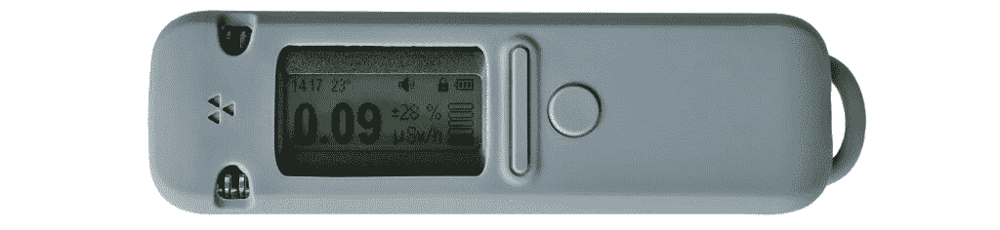

Radiacode 探测器，图片由作者提供

为了获取数据，我将使用 [radiacode](https://github.com/cdump/radiacode) 开源库。作为一个简单的例子，让我们在 30 秒内收集伽马光谱：

```py
from radiacode import RadiaCode

rc = RadiaCode()
rc.spectrum_reset()
time.sleep(30)

spectrum = rc.spectrum()
print(spectrum.duration)
#> 0:00:30

print(spectrum.a0, spectrum.a1, spectrum.a2)
#> 24.524023056030273 2.2699732780456543 0.00043278629891574383

print(len(spectrum.counts))
#> 1024

print(spectrum.counts)
#> [0, 0, 0, 0, 2, 6, … 0, 0, 1]
```

我将在下一章中解释这些字段的意义，当我们开始分析时。

如果我们在 Jupyter Notebook 中使用 Radiacode，我们还需要在单元格结束时关闭连接，否则下一次运行将得到 USB “资源繁忙”错误：

```py
usb.util.dispose_resources(rc._connection._device)
```

我们也可以为每秒计数（CPS）和光谱值创建记录器。例如，让我们每 60 秒将伽马光谱记录到 CSV 文件中：

```py
from radiacode import RadiaCode, RawData, Spectrum

SPECTRUM_READ_INTERVAL_SEC = 60
spectrum_read_time = 0

def read_forever(rc: RadiaCode):
   """ Read data from the device """
   while True:
       self.process_device_data(rc)
       time.sleep(0.3)

       t_now = time.monotonic()
       if t_now - spectrum_read_time >= SPECTRUM_READ_INTERVAL_SEC:
           self.process_spectrum_data(rc)
           spectrum_read_time = t_now

def process_device_data(rc: RadiaCode):
    """ Get CPS (counts per second) values """
    data = rc.data_buf()
    for record in data:
        if isinstance(record, RawData):
            dt_str = record.dt.strftime(self.TIME_FORMAT)
            log_str = f"{dt_str},,{int(record.count_rate)},"
            logging.debug(log_str)

def process_spectrum_data(rc: RadiaCode):
    """ Get spectrum data from the device """
    spectrum: Spectrum = rc.spectrum()
    save_spectrum_data(spectrum)

def save_spectrum_data(spectrum: Spectrum):
    """ Save spectrum data to the log """
    spectrum_str = ';'.join(str(x) for x in spectrum.counts)
    s_data = f"{spectrum.a0};{spectrum.a1};{spectrum.a2};{spectrum_str}"
    t_now = datetime.datetime.now()
    dt_str = t_now.strftime(self.TIME_FORMAT)
    log_str = f"{dt_str},,,{s_data}"
    logging.debug(log_str)

if __name__ == '__main__':
   rc = RadiaCode()
   rc.spectrum_reset()
   read_forever(rc) 
```

这里，我得到了两种类型的数据。*原始数据*包含 CPS 值，可以用来获取辐射水平（µSv/小时）。我只用它们来确认设备工作正常；它们不用于分析。*光谱*数据包含我们感兴趣的内容——伽马光谱值。

每隔 60 秒收集数据使我能够看到数据变化动态。通常，必须在几小时内收集光谱（越多越好），我更喜欢在 Raspberry Pi 上运行这个应用程序。输出以 CSV 格式保存，我们将使用 Python 和 Pandas 处理它。

## 3. 数据分析

### 3.1 伽马光谱

为了了解我们有什么样的数据，让我们再次打印光谱：

```py
spectrum = rc.spectrum()
print(spectrum.duration)
#> 0:00:30

print(spectrum.a0, spectrum.a1, spectrum.a2)
#> 24.524023056030273 2.2699732780456543 0.00043278629891574383

print(len(spectrum.counts))
#> 1024

print(spectrum.counts)
#> [0, 0, 0, 0, 2, 6, … 0, 0, 1]
```

我们在这里得到了什么？正如之前提到的，一个闪烁探测器不仅给我们粒子的数量，还给我们它们的能量。带电粒子的能量以 keV（千电子伏特）或 MeV（兆电子伏特）来衡量，其中电子伏特是粒子的动能量。Radiacode 探测器有 1024 个通道，每个通道的能量可以通过一个简单的公式找到：


这里，*ch* 是通道号，*a0*、*a1* 和 *a2* 是存储在设备中的校准常数。

在指定的时间（在我们的例子中，30 秒）内，Radiacode 检测粒子并将结果作为简单的算术和保存到通道中。例如，第 5 个位置上的值“2”表示在通道 5 中检测到了 2 个能量为 33.61 keV 的粒子。

让我们使用 Matplotlib 绘制光谱：

```py
def draw_simple_spectrum(spectrum: Spectrum):
   """ Draw spectrum from the Radiacode """
   a0, a1, a2 = spectrum.a0, spectrum.a1, spectrum.a2
   ch_to_energy = lambda ch: a0 + a1 * ch + a2 * ch**2

   fig, ax = plt.subplots(figsize=(12, 4))
   fig.gca().spines["top"].set_color("lightgray")
   fig.gca().spines["right"].set_color("lightgray")
   counts = spectrum.counts
   energy = [ch_to_energy(x) for x in range(len(counts))]
   # Bars
   plt.bar(energy, counts, width=3.0, label="Counts")
   # keV label values
   ticks_x = [
      ch_to_energy(ch) for ch in range(0, len(counts), len(counts) // 20)
   ]
   labels_x = [f"{ch:.1f}" for ch in ticks_x]
   ax.set_xticks(ticks_x, labels=labels_x)
   plt.xlim(energy[0], energy[-1])
   plt.title("Gamma-spectrum, Radiacode 103")
   plt.xlabel("Energy, keV")
   plt.legend()
   fig.tight_layout()
   fig.show()

draw_simple_spectrum(spectrum)
```

输出看起来是这样的：

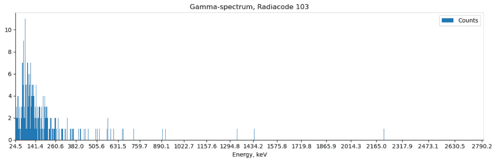

图片由作者提供

我在 30 秒内收集了数据，即使在这么短的时间内，我们也能看到概率分布！在统计学中，通常来说，时间越长越好，通过收集几小时内的数据，我们可以得到清晰可见的结果。而且，Radiacode 能够自动收集光谱，这也非常方便。我们可以让设备自主运行几小时甚至几天，然后运行代码并检索光谱。

对于那些没有 Radiacode 探测器的读者，我编写了两个函数来**保存和加载光谱**到 JSON 文件：

```py
def save_spectrum(spectrum: Spectrum, filename: str):
   """ Save spectrum to a file """
   duration_sec = spectrum.duration.total_seconds()
   data = {
       "a0": spectrum.a0,
       "a1": spectrum.a1,
       "a2": spectrum.a2,
       "counts": spectrum.counts,
       "duration": duration_sec,
   }
   with open(filename, "w") as f_out:
       json.dump(data, f_out, indent=4)
       print(f"File '{filename}' saved, duration {duration_sec} sec")

def load_spectrum(filename: str) -> Spectrum:
   """ Load spectrum from a file """
   with open(filename) as f_in:
       data = json.load(f_in)
       return Spectrum(
           a0=data["a0"], a1=data["a1"], a2=data["a2"],
           counts=data["counts"],
           duration=datetime.timedelta(seconds=data["duration"]),
       )
```

我们可以使用它来获取数据：

```py
spectrum = load_spectrum("sp_background.json")
draw_simple_spectrum(spectrum)
```

如开头所述，所有收集的文件都可在 Kaggle 上找到。

### 3.2 同位素

现在，我们正接近文章的有趣部分。伽马光谱的目的是什么？结果发现，不同的元素会以不同能量的伽马射线发射。这使我们能够通过观察光谱来判断我们有什么样的物体。这是简单盖革-米勒计数管和闪烁探测器之间的一个关键区别。使用盖革-米勒计数管，我们可以判断物体是否具有放射性，并看到其水平，比如说，每分钟 500 次计数。而伽马光谱不仅能看到辐射水平，还能看到物体为何具有放射性以及衰变过程是如何进行的。

实际上它是如何工作的呢？比如说，我想测量香蕉的辐射。[香蕉](https://en.wikipedia.org/wiki/Banana_equivalent_dose)自然含有[钾-40](https://en.wikipedia.org/wiki/Potassium-40)，它以 1.46 MeV 的能量发射伽马射线。理论上，如果我拿很多香蕉（实际上很多，因为每根香蕉的钾含量不到 0.5 克）并将它们放在一个隔离的铅室中以屏蔽背景辐射，我会在光谱上看到一个 1.46 MeV 的峰值。

实际上，情况通常更为复杂。一些材料，如铀-238，可能有一个复杂的衰变链，如下所示：

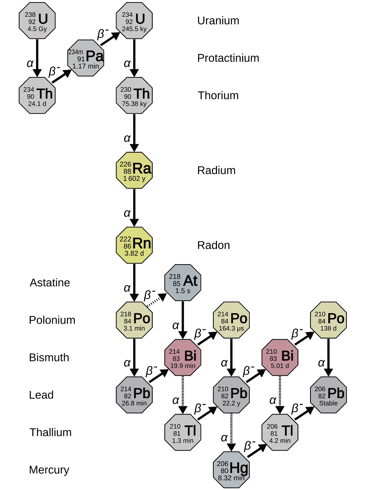

铀-238 衰变链，图片来源 – [维基百科](https://en.m.wikipedia.org/wiki/File:Decay_chain%284n%2B2,_Uranium_series%29.svg)

如我们所见，铀有一系列放射性衰变。它衰变为钍，钍衰变为镭，等等。每个元素都有其伽马光谱峰和半衰期。因此，所有这些峰都会同时出现在光谱上（但强度不同）。

我们也可以用 Matplotlib 显示同位素峰。作为一个例子，让我们绘制 K40 同位素线：

```py
isotopes_k40 = [ ("K-40", 1460, "#0000FF55") ]
```

我们只需要在 Matplotlib 中添加两行代码，就可以在光谱上绘制它：

```py
# Isotopes
for name, en_kev, color in isotopes:
   plt.axvline(x = en_kev, color = color, label=name)
# Spectrum
plt.bar(energy, counts, width=3.0, label="Counts")
```

现在，让我们看看它是如何实际工作的，并进行一些实验！

## 4. 实验

我不在核机构工作，也没有访问像铯-137 或锶-90 这样的官方测试源，这些源在“大科学”中应用。然而，这并不是必需的，我们周围的某些物体可能略微具有放射性。

理想情况下，测试对象必须放置在铅室中以减少背景辐射。厚厚的铅层可以将背景辐射降低到更低的水平。然而，铅很重，运输可能很昂贵，并且它是一种需要大量安全预防措施的有毒材料。相反，我将收集两个光谱——第一个是对象本身，第二个是背景（没有对象）。正如我们将看到的，这已经足够了，差异将是可见的。

让我们结合所有部分并绘制两种光谱和同位素：

```py
def draw_spectrum(
   spectrum: Spectrum, background: Spectrum, isotopes: List, title: str
):
   """ Draw the spectrum, the background, and the isotopes """
   counts = np.array(spectrum.counts) / spectrum.duration.total_seconds()
   counts_b = np.array(background.counts) / background.duration.total_seconds()

   a0, a1, a2 = spectrum.a0, spectrum.a1, spectrum.a2
   ch_to_energy = lambda ch: a0 + a1 * ch + a2 * ch**2

   # X-range
   x1, x2 = 0, 1024
   channels = list(range(x1, x2))
   energy = [ch_to_energy(x) for x in channels]

   fig, ax = plt.subplots(figsize=(12, 8))
   fig.gca().spines["top"].set_color("lightgray")
   fig.gca().spines["right"].set_color("lightgray")
   # Isotopes
   for name, en_kev, color in isotopes:
      plt.axvline(x = en_kev, color = color, label=name)
   # Bars
   plt.bar(energy, counts[x1:x2], width=3.0, label="Counts")
   plt.bar(energy, counts_b[x1:x2], width=3.0, label="Background")
   # X labels
   ticks_x = [ch_to_energy(ch) for ch in range(x1, x2, (x2 - x1) // 20)]
   labels_x = [f"{ch:.1f}" for ch in ticks_x]
   ax.set_xticks(ticks_x, labels=labels_x)
   plt.xlim(energy[0], energy[-1])
   plt.title(f"{title}, gamma-spectrum, Radiacode 103G")
   plt.xlabel("Energy, keV")
   plt.legend()
   fig.tight_layout()
   fig.show() 
```

在不同的时间段内可以收集不同的光谱。因此，我通过将计数值除以总时间来归一化图表，这样我们总是在图表上看到每秒的计数。

现在，让我们开始实验！作为提醒，测试中使用的所有数据文件都可在 Kaggle 上找到。

### 4.1 香蕉

首先，让我们回答核物理学中最常问的问题——香蕉有多放射性？香蕉是一个出人意料难以测量的对象——它含有不到 1 克的钾-40，并且含有 74%的水。正如我们所猜测的，香蕉的辐射非常低。首先，我尝试了一个普通的香蕉，但不起作用。然后我在超市买了干香蕉，只有在那时我才能看到微小的差异。

使用之前创建的方法，轻松加载光谱并查看结果：

```py
spectrum = load_spectrum("sp_bananas_dried.json")
background = load_spectrum("sp_bananas_background.json")
isotopes_k40 = [ ("K-40", 1460, "#0000FF55") ]

draw_spectrum(spectrum, background, isotopes_k40, title="Dried bananas")
```

输出结果如下：

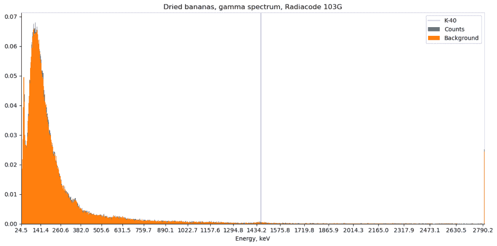

图片由作者提供

如我们所见，差异微乎其微，几乎看不见。让我们计算由钾-40（1460 keV 能量，对应于 Radiacode 通道数 N=570）引起的差异：

```py
ch, width = 570, 5
counts = np.array(spectrum.counts) / spectrum.duration.total_seconds()
counts_b = np.array(background.counts) / background.duration.total_seconds()
sum1 = sum(counts[ch - width:ch + width])
sum2 = sum(counts_b[ch - width:ch + width])
diff = 100*(sum1 - sum2)/sum(counts)

print(f"Diff: {diff:.3f}%")
#> Diff: 0.019%
```

在这里，我将差异与背景辐射引起的总粒子数进行了比较。如我们所见，香蕉比背景仅多 0.019%的放射性！显然，这个数字太小，仅通过观察辐射计数器是看不见的。

### 4.2 带镭表盘的复古手表

现在，让我们测试一些“更强”的对象。从 1910 年到 1960 年，镭-226 被用于[绘制](https://en.wikipedia.org/wiki/Radium_dial)手表指针和表盘。镭和特殊夜光的混合物使得手表可以在黑暗中发光。

许多制造商都在生产带有镭漆的手表，从廉价的非知名型号到像劳力士潜航者这样的奢侈品，其现代价格标签超过 40K。

我在复古商店以大约 20 美元的价格购买了这块手表进行测试：

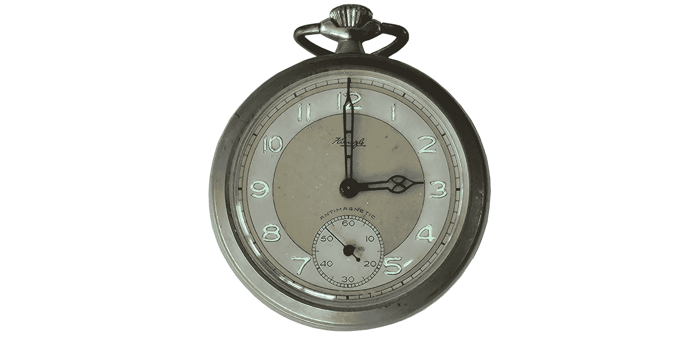

图片由作者提供

我还使用紫外线灯来展示手表在制造时如何在黑暗中发光（如今，夜光已经耗尽，没有紫外线，它不再发光）。

让我们绘制光谱：

```py
spectrum = load_spectrum("sp_watch.json")
background = load_spectrum("sp_background.json")
isotopes_radium = [
   ("Ra-226", 186.21, "#AA00FF55"),
   ("Pb-214", 242.0,  "#0000FF55"),
   ("Pb-214", 295.21, "#0000FF55"),
   ("Pb-214", 351.93, "#0000FF55"),
   ("Bi-214", 609.31, "#00AAFF55"),
   ("Bi-214", 1120.29, "#00AAFF55"),
   ("Bi-214", 1764.49, "#00AAFF55"),
]

draw_spectrum(spectrum, background, isotopes_radium, title="Vintage watch")
```

数据收集在 3.5 小时内完成，输出结果如下：

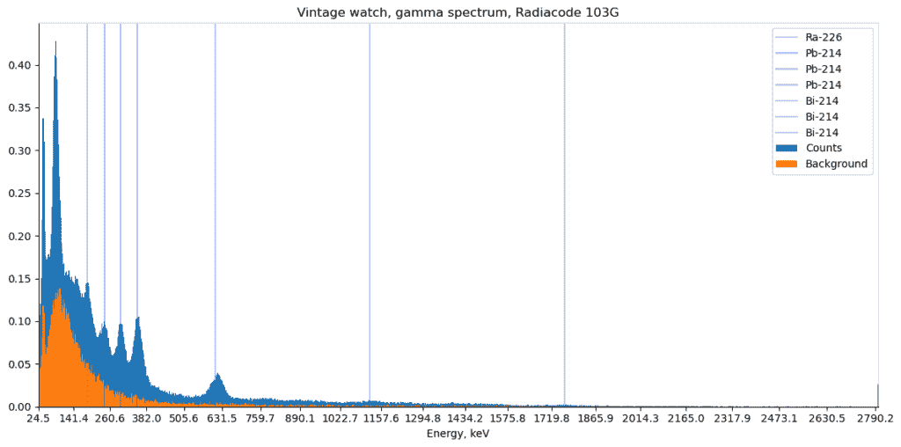

图片由作者提供

这里有很多过程在进行中，我们可以看到镭衰变链的各个部分：

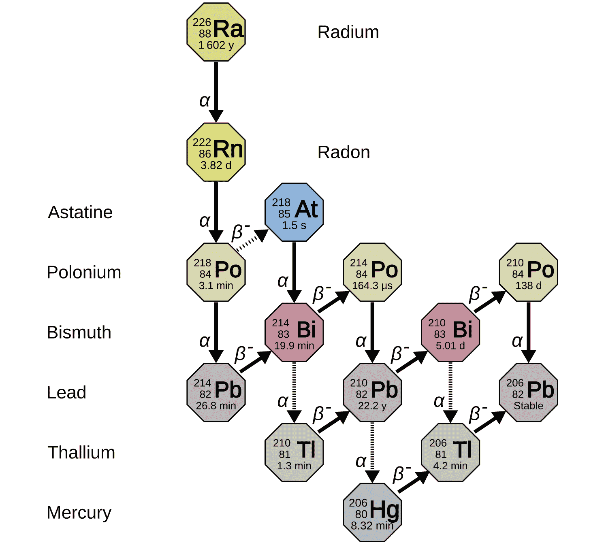

图片来源 – [维基百科](https://en.m.wikipedia.org/wiki/File:Decay_chain%284n%2B2,_Uranium_series%29.svg)

镭-226（1602 年半衰期）产生一个α粒子和氡气（3.82 天半衰期），但氡本身也是一个α发射体，不会产生伽马射线。相反，我们可以看到一些子产品，如铋和铅。

作为一个问题：戴一个镭质表盘的手表危险吗？通常来说不是，只要表壳和玻璃没有损坏，这些手表是安全的。我们可以在光谱上看到许多衰变产物，但就像香蕉一样，这个光谱是在几小时内收集的，这块手表的实际辐射水平相对较小。

### 4.3 铀玻璃

铀玻璃有着惊人的悠久历史。铀矿石自 19 世纪以来就被用于玻璃制造，甚至在“放射性”这个词被知晓之前就已经如此。铀玻璃大量生产，现在几乎可以在每个古董店找到。生产在 20 世纪 50 年代停止；之后，所有的铀大部分都用于工业和军事目的。

铀玻璃主要只含有极小部分的铀；这些物体可以安全地放在柜子里（尽管如此，我还是不会用它来吃饭：）。玻璃产生的辐射量也很小。

这块维多利亚时代的玻璃是在 19 世纪 90 年代制造的，它将成为我们的测试对象：

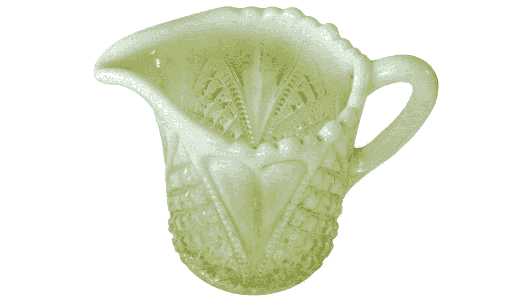

图片由作者提供

让我们看看光谱：

```py
spectrum = load_spectrum("sp_uranium.json")
background = load_spectrum("sp_background.json")
isotopes_uranium = [
   ("Th-234", 63.30, "#0000FF55"),
   ("Th-231", 84.21, "#0000FF55"),
   ("Th-234", 92.38, "#0000FF55"),
   ("Th-234", 92.80, "#0000FF55"),
   ("U-235", 143.77, "#00AAFF55"),
   ("U-235", 185.72, "#00AAFF55"),
   ("U-235", 205.32, "#00AAFF55"),
   ("Pa-234m", 766.4, "#0055FF55"),
   ("Pa-234m", 1000.9, "#0055FF55"),
]

draw_spectrum(spectrum, background, isotopes_uranium, title="Uranium glass")
```

正如之前提到的，铀玻璃的辐射水平并不高。大多数峰值都很小，我使用了对数尺度来更好地观察它们。结果看起来是这样的：

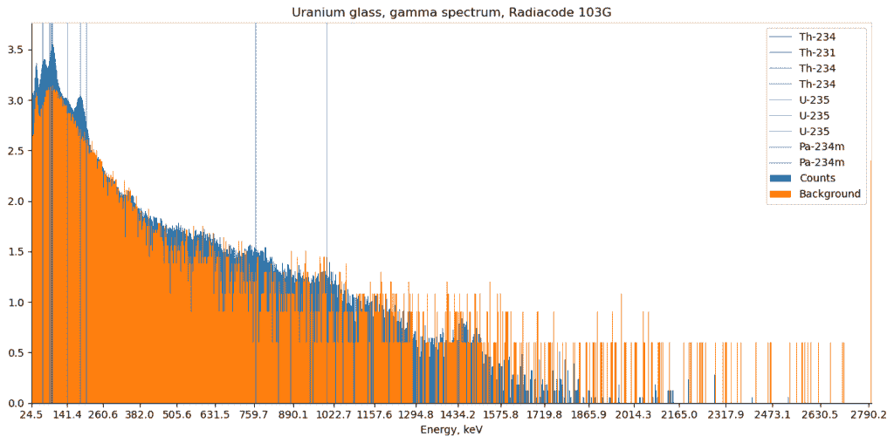

图片由作者提供

在这里，我们可以看到钍和铀的一些峰值；这些元素存在于铀衰变链中。

### 4.4 “量子”吊坠

读者可能会认为放射性物体只产生于“黑暗时代”，很久以前，那时人们还不知道辐射。有趣的是，这并不总是正确的，许多与“负离子”相关的产品今天仍然有售。

我在 eBay 上以 10 美元的价格买下了这个吊坠，根据卖家的描述，它可以作为负离子源“改善健康”：


图片由作者提供

离子辐射确实可以产生离子。这些离子的医疗特性超出了本文的范围。无论如何，它是一个很好的伽马光谱测试对象——让我们绘制光谱，看看里面有什么：

```py
spectrum = load_spectrum("sp_pendant.json")
background = load_spectrum("sp_background.json")
isotopes_thorium = [
   ("Pb-212", 238.63, "#0000FF55"),
   ("Ac-228", 338.23, "#0000FF55"),
   ("TI-208", 583.19, "#0000FF55"),
   ("AC-228", 911.20, "#0000FF55"),
   ("AC-228", 968.96, "#0000FF55"),
]

draw_spectrum(
   spectrum, background, isotopes_thorium, title="'Quantum' pendant"
)
```

结果看起来是这样的：

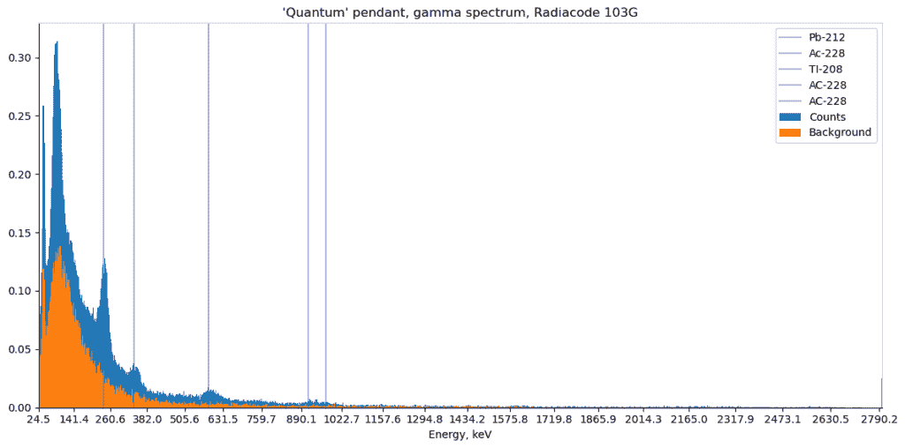

图片由作者提供

根据[gammaspectacular.com](https://www.gammaspectacular.com/blue/th232-spectrum)，这个光谱属于钍-232。显然，这并没有在产品描述中提到，但通过伽马光谱，我们可以看到它，而无需拆卸物体或进行任何化学测试！

## 5. Matplotlib 动画（额外奖励）

作为对那些耐心读到这里的读者的额外奖励，我将展示如何在 Matplotlib 中制作动画图。

作为提醒，在文章开头，我每分钟从 Radiacode 设备收集光谱。我们可以使用这些数据来动画化光谱收集过程。

首先，让我们将数据 **加载** 到数据框中：

```py
def get_spectrum_log(filename: str) -> pd.DataFrame:
   """ Get dataframe from a CSV-file """
   df = pd.read_csv(
       filename, header=None, index_col=False,
       names=["datetime", "temp_c", "cps", "spectrum"],
       parse_dates=["datetime"]
   )
   return df.sort_values(by='datetime', ascending=True)

def get_spectrum_data(spectrum: str) -> np.array:
   """ Spectrum data: a0, a1, a2, 1024 energy values
   Example:
   9.572;2.351;0.000362;0;2;0;0; ... """
   values = spectrum.split(";")[3:]
   return np.array(list(map(int, values)))

def process_spectrum_file(filename: str) -> pd.DataFrame:
   df = get_spectrum_log(filename)
   df = df[
       df["spectrum"].notnull()
   ][["datetime", "spectrum"]].copy()

   df["spectrum"] = df["spectrum"].map(get_spectrum_data)
   return df

df = process_spectrum_file("spectrum-watch.log")
display(df)
```

输出看起来像这样：

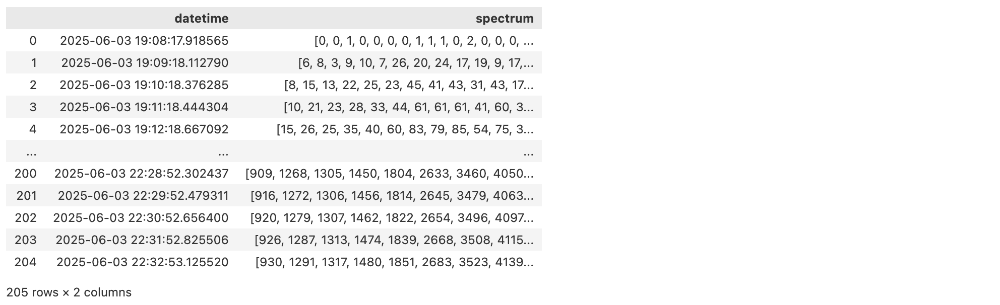

如我们所见，观测中的每一行都包含与我们之前用于单个光谱对象相同的字段。

**动画**过程相对简单。首先，我们需要将 Matplotlib 的“条形”对象保存到变量中：

```py
plt.bar(energy, counts_b[x1:x2], width=3.0, label="Background")
bar = plt.bar(energy, counts[x1:x2], width=3.5, label="Counts")
```

然后，我们可以使用一个 *更新* 函数，该函数从数据框中获取光谱：

```py
def update(frame: int):
   """ Frame update callback """
   index = frame * df.shape[0] // num_frames
   counts = df["spectrum"].values[index]
   # Update bar
   for i, b in enumerate(bar):
       b.set_height(counts[x1:x2][i])
   # Update title 
   ax.set_title(...)
```

现在，我们可以将动画保存为 GIF 文件：

```py
import matplotlib.animation as animation

# Animate
anim = animation.FuncAnimation(
  fig=fig, func=update, frames=num_frames, interval=100
)
writer = animation.PillowWriter(fps=5)
anim.save("spectrum-watch.gif", writer=writer)
```

输出看起来像这样：

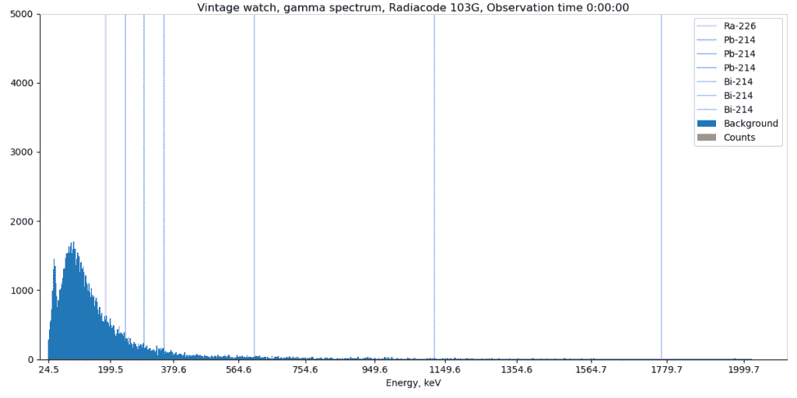

图片由作者提供

在这里，我们可以看到在收集时间内粒子数量的增加。

## 6. 结论

在这篇文章中，我描述了使用 Radiacode 闪烁探测器、Python 和 Matplotlib 进行伽马光谱分析的基础。正如我们所见，数据本身很简单，然而，许多看不见的过程正在“幕后”进行。使用不同的测试对象，我们能够看到不同放射性衰变元素的谱，如铋-214 或钍-234。而且，令人惊讶的是，这些测试可以在家中进行，像 Radiacode 这样的探测器对科学爱好者来说，价格与中档智能手机相当。

这种基本分析使我们能够更进一步。如果对这个主题有公众兴趣，在下一篇文章中，我将使用机器学习来自动化同位素的检测。请保持关注。

对于那些想要亲自进行测试的读者，所有数据集都在 [Kaggle 上可用](https://www.kaggle.com/datasets/dmitriieliuseev/radiation-spectra-examples/)。如果有人想用自己的硬件进行测试，Radiacode 制造商很友好地提供了一张 10% 的折扣码“DE10”，用于 [购买设备](https://102.radiacode.com/DmitriiE)（免责声明：我从中不获得任何利润或其他商业利益）。

所有读者也欢迎通过 [LinkedIn](https://www.linkedin.com/in/dmitrii-eliuseev/) 联系我，我在那里定期发布一些不够长以成为完整文章的小帖子。如果您想获取这篇文章和其他文章的完整源代码，请随时访问我的 [Patreon 页面](https://www.patreon.com/deliuseev)。

感谢阅读。
