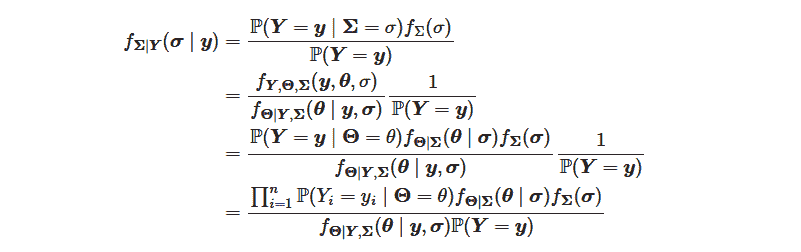
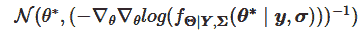
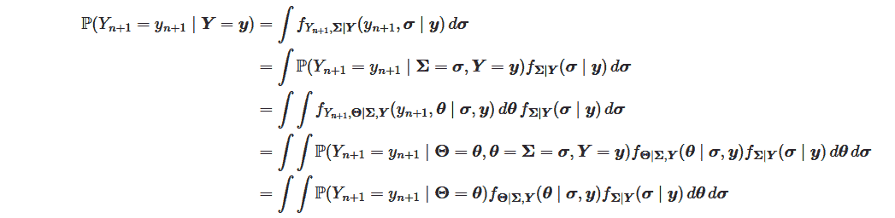

# 使用 Laplace 近似贝叶斯优化探索新的超参数维度

> 原文：[`towardsdatascience.com/exploring-new-hyperparameter-dimensions-with-laplace-approximated-bayesian-optimization-588a0891ca5b/`](https://towardsdatascience.com/exploring-new-hyperparameter-dimensions-with-laplace-approximated-bayesian-optimization-588a0891ca5b/)


图片由作者来自 canva 提供

**当我注意到我的模型过拟合时**，我常常想，“**是时候正则化了**”。但我如何决定使用哪种正则化方法（L1，L2）以及选择哪些参数？通常，我通过网格搜索进行超参数优化以选择设置。然而，如果自变量有不同的尺度或不同水平的影响会发生什么？我能为每个变量设计具有不同正则化系数的超参数网格吗？这种优化在高维空间中可行吗？还有其他设计正则化的方法吗？让我们用一个假设的例子来探讨这个问题。

## 用例

我的虚构示例是一个具有 3 个解释变量的二元分类用例。这些变量都是分类变量，并且有 7 个不同的类别。我的可重复用例在这个[notebook](https://github.com/kapytaine/bayesian_optimisation/blob/master/notebooks/bayesian_optimization_instead_of_hyperoptimization_artificial_dataset.ipynb)中。生成数据集的函数如下：

```py
import numpy as np
import pandas as pd

def get_classification_dataset():
    n_samples = 200
    cats = ["a", "b", "c", "d", "e", "f"]
    X = pd.DataFrame(
        data={
            "col1": np.random.choice(cats, size=n_samples),
            "col2": np.random.choice(cats, size=n_samples),
            "col3": np.random.choice(cats, size=n_samples),
        }
    )
    X_preprocessed = pd.get_dummies(X)

    theta = np.random.multivariate_normal(
        np.zeros(len(cats) * X.shape[1]),
        np.diag(np.array([1e-1] * len(cats) + [1] * len(cats) + [1e1] * len(cats))),
    )

    y = pd.Series(
        data=np.random.binomial(1, expit(np.dot(X_preprocessed.to_numpy(), theta))),
        index=X_preprocessed.index,
    )
    return X_preprocessed, y
```

为了信息透明，我故意选择了 theta 协方差矩阵的 3 个不同值来展示 Laplace 近似贝叶斯优化方法的优点。如果这些值在某种程度上相似，那么兴趣就会小得多。

## 基准

除了**一个简单的基线模型，该模型在训练数据集上预测观察到的平均值**（用于比较目的）之外，我还决定设计一个稍微复杂一些的模型。我决定对三个独立变量进行独热编码，并在基本预处理之上应用**逻辑回归模型**。对于正则化，我选择了 L2 设计，并旨在使用两种技术找到最优的正则化系数：**网格搜索**和**Laplace 近似贝叶斯优化**，正如你可能已经预料到的。最后，我使用两个指标（任意选择）在测试数据集上评估了模型：对数损失和 AUC ROC。

在展示结果之前，让我们首先更仔细地看看贝叶斯模型以及我们如何优化它。

## 贝叶斯模型

在贝叶斯框架中，参数不再是固定的常数，而是随机变量。我们不再通过最大化似然来估计这些未知参数，而是现在优化给定观测数据的随机参数的后验分布。这要求我们选择，通常是相当任意地，先验的设计和参数。然而，也可以将先验参数视为随机变量本身——就像在 *Inception* 中，不确定性层不断堆叠在一起…

在这项研究中，我选择了以下模型：


我逻辑上选择了伯努利模型来表示 Y_i | θ，对应于 θ | Σ 的 L2 正则化的正态中心先验，最后对于 Σ_i^{-1}，我选择了伽马模型。我选择建模精度矩阵而不是协方差矩阵，因为在文献中这是传统的，例如在 scikit learn 用户指南的贝叶斯线性回归[2]中。

除了这个书面模型之外，我还假设 Y_i 和 Y_j 在 θ 的条件下（条件于 θ）也是相互独立的，以及 Y_i 和 Σ。

## 校准

### 似然

根据模型，似然可以相应地写成：



为了优化，我们需要评估几乎所有项，除了 P(Y=y)。分子中的项可以使用选定的模型来评估。然而，分母中剩余的项不能。这就是拉普拉斯近似发挥作用的地方。

### 拉普拉斯近似

为了评估分母的第一项，我们可以利用拉普拉斯近似。我们通过以下方式近似 θ | Y, Σ 的分布：



其中 θ* 是 θ | Y, Σ 的密度分布的模态。

尽管我们不知道密度函数，但我们可以通过以下分解来评估 Hessian 部分：


我们只需要知道分子中的前两项来评估 Hessian 矩阵，我们就是这样做的。

对于那些对进一步解释感兴趣的人，我建议参考 Christopher M. Bishop 的《模式识别与机器学习》第 4.4 部分，“拉普拉斯近似”[1]。它极大地帮助我理解了近似。

### 拉普拉斯近似似然

最后，要优化的拉普拉斯近似似然是：


一旦我们近似了 θ | Y, Σ 的密度函数，我们就可以在任意 θ 处评估似然，如果近似在所有地方都是准确的。为了简单起见，并且因为近似仅在模态附近是准确的，我们在 θ* 处评估近似似然。

以下是一个函数，用于评估给定（标量）σ²=1/p（除了给定的观测值 X 和 y 以及设计值α和β）的损失。

```py
import numpy as np
from scipy.stats import gamma

from module.bayesian_model import BayesianLogisticRegression

def loss(p, X, y, alpha, beta):
    # computation of the loss for given values:
    # - 1/sigma² (named p for precision here)
    # - X: matrix of features
    # - y: vector of observations
    # - alpha: prior Gamma distribution alpha parameter over 1/sigma²
    # - beta: prior Gamma distribution beta parameter over 1/sigma²

    n_feat = X.shape[1]
    m_vec = np.array([0] * n_feat)
    p_vec = np.array(p * n_feat)

    # computation of theta*
    res = minimize(
        BayesianLogisticRegression()._loss,
        np.array([0] * n_feat),
        args=(X, y, m_vec, p_vec),
        method="BFGS",
        jac=BayesianLogisticRegression()._jac,
    )
    theta_star = res.x

    # computation the Hessian for the Laplace approximation
    H = BayesianLogisticRegression()._hess(theta_star, X, y, m_vec, p_vec)

    # loss
    loss = 0
    ## first two terms: the log loss and the regularization term
    loss += baysian_model._loss(theta_star, X, y, m_vec, p_vec)
    ## third term: prior distribution over sigma, written p here
    out -= gamma.logpdf(p, a = alpha, scale = 1 / beta)
    ## fourth term: Laplace approximated last term
    out += 0.5 * np.linalg.slogdet(H)[1] - 0.5 * n_feat * np.log(2 * np.pi)

    return out
```

在我的用例中，我选择通过**Adam 优化器**来优化它，该代码是从这个[仓库](https://gist.github.com/jcmgray/e0ab3458a252114beecb1f4b631e19ab)中获取的。

```py
def adam(
    fun,
    x0,
    jac,
    args=(),
    learning_rate=0.001,
    beta1=0.9,
    beta2=0.999,
    eps=1e-8,
    startiter=0,
    maxiter=1000,
    callback=None,
    **kwargs
):
    """``scipy.optimize.minimize`` compatible implementation of ADAM -
    [http://arxiv.org/pdf/1412.6980.pdf].
    Adapted from ``autograd/misc/optimizers.py``.
    """
    x = x0
    m = np.zeros_like(x)
    v = np.zeros_like(x)

    for i in range(startiter, startiter + maxiter):
        g = jac(x, *args)

        if callback and callback(x):
            break

        m = (1 - beta1) * g + beta1 * m  # first  moment estimate.
        v = (1 - beta2) * (g**2) + beta2 * v  # second moment estimate.
        mhat = m / (1 - beta1**(i + 1))  # bias correction.
        vhat = v / (1 - beta2**(i + 1))
        x = x - learning_rate * mhat / (np.sqrt(vhat) + eps)

    i += 1
    return OptimizeResult(x=x, fun=fun(x, *args), jac=g, nit=i, nfev=i, success=True)
```

对于这次优化，我们需要前一个损失的导数。我们无法得到一个解析形式，所以我决定使用导数的数值近似。

## 推理

一旦模型在训练数据集上训练完成，就需要在评估数据集上进行预测以评估其性能并比较不同的模型。然而，无法直接计算新点的实际分布，因为计算是不可行的。



有可能用以下方式近似结果：


考虑到：


## 结果

我选择了一个对精度随机变量的非信息先验。朴素模型表现不佳，具有 0.60 的对数损失和 0.50 的 AUC ROC。第二个模型表现更好，具有 0.44 的对数损失和 0.83 的 AUC ROC，这两个指标都是在使用网格搜索和贝叶斯优化超优化时得到的。这表明，包含依赖变量的逻辑回归模型优于朴素模型。然而，使用贝叶斯优化而不是网格搜索没有优势，所以我现在将继续使用网格搜索。感谢阅读。

…但是等等，我在思考。为什么我的参数使用相同的系数进行正则化？我的先验不应该取决于潜在的依赖变量吗？也许第一个依赖变量的参数可以取更高的值，而第二个依赖变量的参数，由于其较小的影响力，应该更接近于零。让我们探索这些新维度。

## 基准 2

到目前为止，我们已经考虑了两种技术，网格搜索和贝叶斯优化。我们可以在更高维度中使用这些相同的技巧。

考虑新的维度可能会显著增加我的网格节点数。这就是为什么在更高维度中使用贝叶斯优化来获取最佳正则化系数是有意义的。在考虑的用例中，我假设有 3 个正则化参数，每个独立变量一个。在编码一个变量之后，我假设生成的所有新变量都共享相同的正则化参数。因此，总共有 3 个正则化参数，即使有超过 3 列作为逻辑回归的输入。

我用以下代码更新了之前的损失函数：

```py
import numpy as np
from scipy.stats import gamma

from module.bayesian_model import BayesianLogisticRegression

def loss(p, X, y, alpha, beta, X_columns, col_to_p_id):
    # computation of the loss for given values:
    # - 1/sigma² vector (named p for precision here)
    # - X: matrix of features
    # - y: vector of observations
    # - alpha: prior Gamma distribution alpha parameter over 1/sigma²
    # - beta: prior Gamma distribution beta parameter over 1/sigma²
    # - X_columns: list of names of X columns
    # - col_to_p_id: dictionnary mapping a column name to a p index
    # because many column names can share the same p value

    n_feat = X.shape[1]
    m_vec = np.array([0] * n_feat)
    p_list = []
    for col in X_columns:
        p_list.append(p[col_to_p_id[col]])
    p_vec = np.array(p_list)

    # computation of theta*
    res = minimize(
        BayesianLogisticRegression()._loss,
        np.array([0] * n_feat),
        args=(X, y, m_vec, p_vec),
        method="BFGS",
        jac=BayesianLogisticRegression()._jac,
    )
    theta_star = res.x

    # computation the Hessian for the Laplace approximation
    H = BayesianLogisticRegression()._hess(theta_star, X, y, m_vec, p_vec)

    # loss
    loss = 0
    ## first two terms: the log loss and the regularization term
    loss += baysian_model._loss(theta_star, X, y, m_vec, p_vec)
    ## third term: prior distribution over 1/sigma² written p here
    ## there is now a sum as p is now a vector
    out -= np.sum(gamma.logpdf(p, a = alpha, scale = 1 / beta))
    ## fourth term: Laplace approximated last term
    out += 0.5 * np.linalg.slogdet(H)[1] - 0.5 * n_feat * np.log(2 * np.pi)

    return out
```

采用这种方法，在测试数据集上评估的度量指标如下：0.39 和 0.88，这比仅使用网格搜索和贝叶斯方法以及所有独立变量的单个先验优化的初始模型要好。


在我的用例中，使用不同方法所实现的指标。

可以使用这个[notebook](https://github.com/kapytaine/bayesian_optimisation/blob/master/notebooks/bayesian_optimization_instead_of_hyperoptimization_artificial_dataset.ipynb)来重现用例。

## 限制

我创建了一个示例来展示该技术的实用性。然而，我未能找到一个合适的真实世界数据集来完全展示其潜力。在我处理实际数据集时，我无法从应用此技术中获得任何显著的好处。如果你发现了这样的数据集，请告诉我——我很乐意看到这种正则化方法在真实世界中的应用。

## 结论

总结来说，使用贝叶斯优化（如有需要，使用拉普拉斯近似）来确定最佳正则化参数可能是一种比传统超参数调整方法更好的替代方案。通过利用概率模型，贝叶斯优化不仅降低了计算成本，还提高了找到最佳正则化值的可能性，尤其是在高维情况下。

## 参考文献

1.  Christopher M. Bishop. (2006). 模式识别与机器学习. Springer.

1.  Bayesian Ridge Regression scikit-learn 用户指南: [`scikit-learn.org/1.5/modules/linear_model.html#bayesian-ridge-regression`](https://scikit-learn.org/1.5/modules/linear_model.html#bayesian-ridge-regression)
