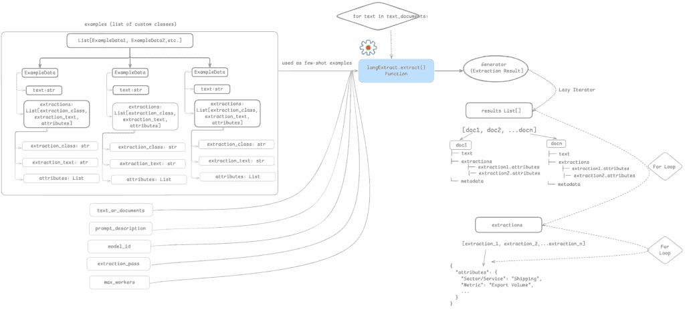
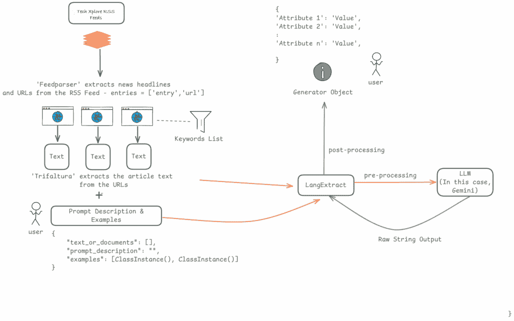
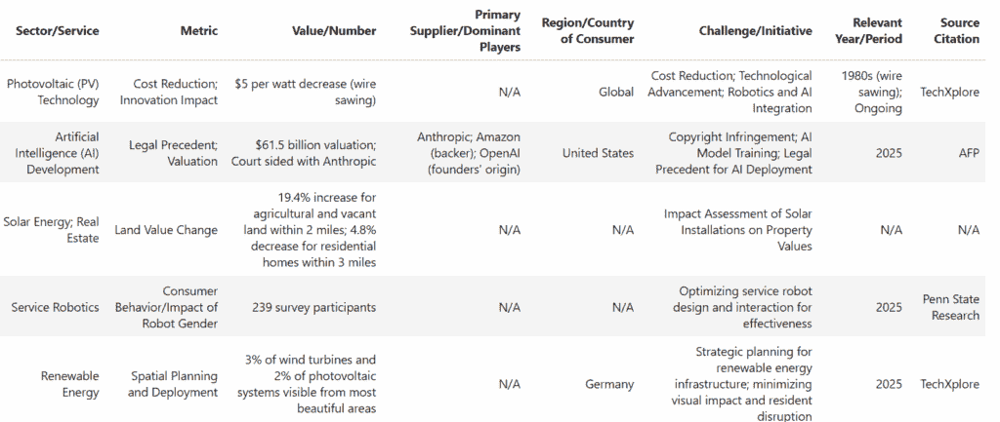

# 使用 LangExtract 提取结构化数据：深入探讨 LLM 编排工作流程

> 原文：[`towardsdatascience.com/extracting-structured-data-with-langextract-a-deep-dive-into-llm-orchestrated-workflows/`](https://towardsdatascience.com/extracting-structured-data-with-langextract-a-deep-dive-into-llm-orchestrated-workflows/)

## <mdspan datatext="el1756943484907" class="mdspan-comment">引言</mdspan>

在开发用于结构化提取任务的原始 LLM 工作流程后，我逐渐发现其中存在几个陷阱。在我的一个项目中，我使用 Grok 和 OpenAI 开发了两个独立的工作流程，以查看哪一个在结构化提取方面表现更好。这时，我发现两者都在随机位置遗漏了事实。此外，提取的字段与模式不匹配。

为了解决这些问题，我设置了特殊处理和验证检查，使 LLM 重新访问文档（就像第二次遍历一样），以便可以捕捉并添加缺失的事实到输出文档中。然而，多次验证运行使我超过了我的 API 限制。此外，提示微调是一个真正的瓶颈。每次我修改提示以确保 LLM 不会错过任何事实时，都会引入新的问题。我注意到的一个重要约束是，虽然一个 LLM 对一组提示表现良好，但另一个 LLM 使用相同的指令表现就不会那么好。这些问题促使我寻找一个编排引擎，该引擎可以自动微调我的提示以匹配 LLM 的提示风格，处理事实遗漏，并确保我的输出与我的模式保持一致。

我最近发现了 LangExtract 并尝试了它。这个库解决了我在模式对齐和事实完整性方面遇到的一些问题。在这篇文章中，我解释了 LangExtract 的基本原理以及它如何增强原始 LLM 工作流程以解决结构化提取问题。我还旨在通过一个示例分享我的 LangExtract 使用经验。

## 为什么选择 LangExtract？

众所周知，当你设置一个原始 LLM 工作流程（例如，使用 OpenAI 从你的语料库中收集结构化属性）时，你需要建立一个分块策略来优化令牌的使用。你还需要添加对缺失值和格式不一致性的特殊处理。在提示工程方面，你需要在每次迭代中添加或删除提示中的指令；以尝试微调结果和处理差异。

LangExtract 通过有效地协调用户和 LLM 之间的提示和输出，帮助管理上述内容。它在传递给 LLM 之前对提示进行微调。在输入文本或文档较大的情况下，它将数据分块并传递给 LLM，同时确保我们保持在每个模型规定的令牌限制内（例如，GPT-4 的 ~8000 令牌与 Claude 的 ~10000 令牌）。在速度至关重要的场合，可以设置并行化。在令牌限制成为约束的情况下，可以设置顺序执行。我将在下一节尝试分解 LangExtract 的工作原理及其数据结构。

## LangExtract 中的数据结构和工作流程

下面是一个图表，展示了 LangExtract 中的数据结构和从输入流到输出流的流程。

LangExtract 使用的数据结构示意图

（图片由作者提供）

LangExtract 将示例存储为自定义类对象的列表。每个示例对象都有一个名为 ‘text’ 的属性，它是来自新闻文章的样本文本。另一个属性是 ‘extraction_class’，这是 LLM 在执行期间分配给新闻文章的类别。例如，讨论云提供商的新闻文章会被标记为“云基础设施”。‘extraction_text’ 属性是您提供给 LLM 的参考输出。这个参考输出指导 LLM 推断您期望的类似新闻片段的最近似输出。‘text_or_documents’ 属性存储需要结构化提取的实际数据集（在我的例子中，输入文档是新闻文章）。

少样本提示指令通过 LangExtract 发送到选择的 LLM（model_id）。LangExtract 的核心 ‘extract()’ 函数收集提示并将其传递给 LLM，在内部对提示进行微调以匹配所选 LLM 的提示风格，并防止模型差异。然后，LLM 逐个返回结果（即每次一个文档）给 LangExtract，LangExtract 然后将结果以生成器对象的形式返回。生成器对象类似于一个短暂的流，它产生由 LLM 提取的值。将生成器视为短暂流的类比可以是数字温度计，它提供当前的读数，但实际上并不存储读数以供将来参考。如果生成器对象中的值没有立即捕获，它就会丢失。

注意，‘max_workers’ 和 ‘extraction_pass’ 属性已在“LangExtract 使用最佳实践”部分进行了详细讨论。

现在我们已经了解了 LangExtract 的工作原理以及它使用的数据结构，让我们继续探讨在现实场景中应用 LangExtract。

## LangExtract 的动手实现

该用例涉及从“techxplore.com RSS Feeds”中收集与科技商业领域相关的新闻文章（https://techxplore.com/feeds/）。我们使用 Feedparser 和 Trifaltura 进行 URL 解析和文章文本提取。提示和示例由用户创建并输入到 LangExtract 中，LangExtract 执行编排以确保提示针对所使用的 LLM 进行了调整。LLM 根据提示指令和提供的示例处理数据，并将数据返回给 LangExtract。LangExtract 在向最终用户显示结果之前再次进行后处理。以下是一个图表，展示了数据如何从输入源（RSS 源）流入 LangExtract，最终通过 LLM 产生结构化提取。

以下是在此演示中使用的库。

我们首先将 Tech Xplore RSS 源 URL 分配给一个变量‘feed_url’。然后定义一个包含与科技商业相关的关键词的‘keywords’列表。我们定义了三个函数来解析和抓取新闻源中的新闻文章。函数‘get_article_urls()’解析 RSS 源并检索文章标题和单个文章 URL（链接）。Feedparser 用于完成此操作。‘extract_text()’函数使用 Trifaltura 从 Feedparser 返回的单个文章 URL 中提取文章文本。函数‘filter_articles_by_keywords’根据我们定义的关键词列表过滤检索到的文章。

运行上述代码后，我们得到以下输出-

“在 RSS 源中找到 30 篇文章”

过滤文章：15″

现在‘filtered_articles’列表已经可用，我们继续设置提示。在这里，我们给出指令让 LLM 理解我们感兴趣的新闻洞察类型。如“LangExtract 中的数据结构和工作流程”部分所述，我们使用‘data.ExampleData()’设置了一个自定义类列表，这是 LangExtract 中的一个内置数据结构。在这种情况下，我们使用包含多个示例的少量提示。

我们初始化一个名为‘results’的列表，然后遍历‘filtered_articles’语料库，逐篇文章进行提取。LLM 的输出可用在生成器对象中。如前所述，由于是一个临时流，‘result_generator’中的输出值会立即追加到‘results’列表中。‘results’变量是一个标注文档的列表。

我们通过一个‘for 循环’遍历结果，将每个标注文档写入 jsonl 文件。虽然这是一个可选步骤，但在需要审计单个文档时可以使用。值得一提的是，LangExtract 的官方文档提供了一个可视化这些文档的实用工具。

我们遍历“results”列表，逐个收集标注文档中的每个提取。一个提取不过是我们在模式中请求的一个或多个属性。所有这样的提取都存储在“all_extractions”列表中。这个列表是所有提取的扁平化列表，形式为[extraction_1, extraction_2, extraction_n]。

我们从之前收集的 15 篇文章中获得了 55 个提取结果。

最后一步涉及遍历“all_extractions”列表以收集每个提取。提取对象是 LangExtract 中的一个自定义数据结构。属性是从每个提取对象中收集的。在这种情况下，属性是具有度量名称和值的字典对象。属性/度量名称与我们最初作为提示请求的模式相匹配（请参阅“data.Extraction”对象中提供的“examples”列表中的“attributes”字典）。最终结果以数据框的形式提供，可用于进一步分析。

下面是显示数据框前五行输出的结果——

## 最佳使用 LangExtract 的有效实践

### 少样本提示

LangExtract 设计为与单次或少样本提示结构一起工作。少样本提示要求你提供一个提示和一些示例，这些示例解释了你期望 LLM 产生的输出。这种提示风格在复杂的多学科领域（如贸易和出口）中特别有用，在这些领域中，一个部门的数据和术语可能与另一个部门大相径庭。以下是一个例子——一条新闻片段写道，“黄金的价值上涨了 X”，另一条片段写道，“某种特定类型半导体的价值上涨了 Y”。在这里，尽管两个片段都说“价值”，但它们的意思非常不同。对于像黄金这样的贵金属，价值基于每单位的市场价格，而对于半导体，它可能意味着市场规模或战略价值。提供特定领域的示例可以帮助 LLM 获取该领域所需的细微差别。示例越多越好。一个广泛的示例集可以帮助 LLM 模型和 LangExtract 适应不同的写作风格（在文章中）并避免提取错误。

### 多提取遍历

多提取过程是指 LLM 多次重新访问输入数据集以填补在第一次遍历输出结束时缺失的细节。LangExtract 通过在每次运行期间微调提示来引导 LLM 多次重新访问数据集（输入）。它还通过合并第一次和后续运行的中间输出来有效地管理输出。需要添加的遍历次数是通过 extract()模块中的‘extraction_passes’参数提供的。尽管提取过程设置为‘1’在这里也可以工作，但超过‘2’的任何设置都将有助于产生更精细调整且与提示和提供的模式对齐的输出。此外，2 次或更多次的多提取过程确保输出模式与你在提示描述中提供的模式和属性相匹配。

### 并行化

当你拥有可能消耗每个请求允许的标记数的较大文档时，采用顺序提取过程是理想的。可以通过设置 max_workers = 1 来启用顺序提取过程。这会导致 LangExtract 强制 LLM 以顺序方式处理提示，一次处理一个文档。如果速度是关键，可以通过设置 max_workers = 2 或更多来启用并行化。这确保了有多个线程可用于提取过程。此外，当执行顺序执行时，可以使用 time.sleep()模块来确保 LLM 的请求配额不会被超过。

并行化和多提取过程都可以设置为以下选项 –

## 结论

在这篇文章中，我们学习了如何使用 LangExtract 进行结构化提取用例。到目前为止，应该很清楚，拥有像 LangExtract 这样的协调器可以帮助你的 LLM 进行提示微调、数据分块、输出解析和模式对齐。我们还看到了 LangExtract 如何通过处理少量提示来适应所选的 LLM，并将 LLM 的原始输出解析为与模式对齐的结构。
