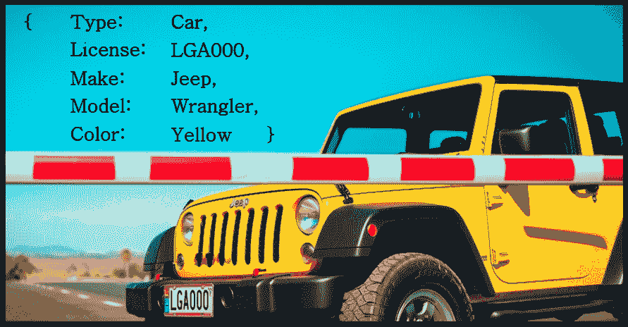
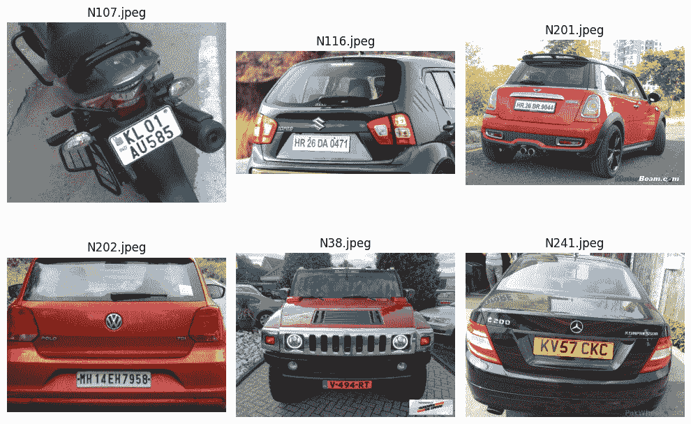
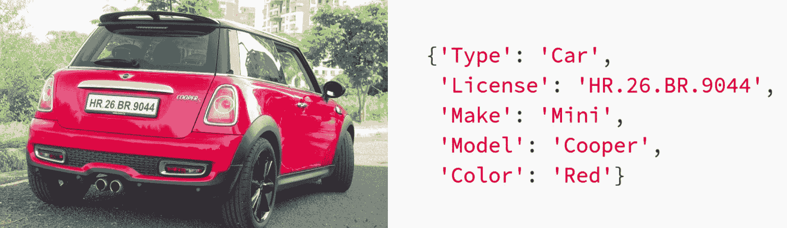
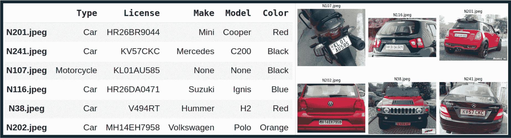

# 从图像中提取结构化车辆数据

> 原文：[`towardsdatascience.com/extracting-structured-vehicle-data-from-images-794128aa8696/`](https://towardsdatascience.com/extracting-structured-vehicle-data-from-images-794128aa8696/)



图片由作者在[PicLumen](https://www.piclumen.com/)生成

## 简介

想象有一个摄像头在检查点监控车辆，你的任务是记录复杂的车辆细节——类型、车牌号码、制造商、型号和颜色。这项任务具有挑战性——经典的计算机视觉方法难以处理各种模式，而监督式深度学习则需要集成多个专业模型、大量标记数据和繁琐的训练。最近在预训练的 **多模态 LLMs** (MLLMs) 领域的进步提供了快速灵活的解决方案，但为了适应结构化输出，需要进行调整。

在本教程中，我们将构建一个车辆文档系统，从车辆图像中提取关键细节。这些细节将以结构化格式提取，便于进一步下游使用。我们将使用 **OpenAI** 的 GPT-4 来提取数据，**Pydantic** 来结构化输出，以及 **LangChain** 来编排流程。到结束时，你将拥有一个将原始图像转换为结构化、可操作数据的实用流程。

本教程面向对使用 LLMs 进行视觉任务感兴趣的计算机视觉从业者、数据科学家和开发者。完整的代码以易于使用的 Colab 笔记本形式提供，以帮助你逐步跟进。

## 技术栈

1.  **GPT-4 视觉模型：** GPT-4 是 OpenAI 开发的一个多模态模型，能够理解文本和图像 [1]。在大量多模态数据上训练，它能够在零样本方式下泛化到广泛的任务中，通常无需微调。虽然 GPT-4 的确切架构和大小尚未公开披露，但其能力在业界处于最先进水平。GPT-4 通过 OpenAI API 以付费令牌的方式提供。在本教程中，我们使用 GPT-4 的出色零样本性能，但代码允许根据你的需求轻松切换到其他模型。

1.  **LangChain:** 在构建管道时，我们将使用 LangChain。LangChain 是一个强大的框架，它简化了复杂的流程，确保代码的一致性，并使得在 LLM 模型之间切换变得容易 [2]。在我们的案例中，Langchain 将帮助我们连接加载图像、生成提示、调用 GPT 模型和将输出解析为结构化数据的步骤。

1.  **Pydantic:** Pydantic 是一个强大的 Python 数据验证库 [3]。我们将使用 Pydantic 来定义 GPT-4 模型预期输出的结构。这将帮助我们确保输出的一致性并便于处理。

## **数据集概述**

为了模拟来自车辆检查检查站的模拟数据，我们将使用来自“车牌号码”Kaggle 数据集的车辆图像样本[4]。此数据集可在[Apache 2.0 许可证](https://www.apache.org/licenses/LICENSE-2.0)下使用。您可以在下面的图像中查看：



来自[车牌号码](https://www.kaggle.com/datasets/alihassanml/car-number-plate)‘Kaggle 数据集的车辆图像

## 让我们开始编码！

在深入实际实现之前，我们需要做一些准备工作：

+   **生成 OpenAI API 密钥**— OpenAI API 是一项付费服务。要使用 API，您需要注册 OpenAI 账户并生成一个与付费计划关联的秘密 API 密钥 ([了解更多](https://platform.openai.com/docs/quickstart))。

+   **配置您的 OpenAI** – 在 Colab 中，您可以将 API 密钥作为环境变量（秘密）安全地存储在左侧侧边栏（🔑）。创建一个名为`OPENAI_API_KEY`的秘密，将您的 API 密钥粘贴到`value`字段中，并切换“Notebook 访问”。

+   **安装并导入**所需的库。

### 管道架构

在这个实现中，我们将使用 LangChain 的`chain`抽象来链接管道中的步骤序列。我们的管道链由 4 个组件组成：一个图像加载组件、一个提示生成组件、一个 MLLM 调用组件和一个解析组件，用于将 LLM 的输出解析为结构化格式。链中每一步的输入和输出通常以字典的形式结构化，其中键代表参数名称，值是实际数据。让我们看看它是如何工作的。

**图像加载组件**

链中的第一步是加载图像并将其转换为 base64 编码，因为 GPT-4 需要图像以基于文本（base64）的格式存在。

```py
def image_encoding(inputs):
    """Load and Convert image to base64 encoding"""

    with open(inputs["image_path"], "rb") as image_file:
        image_base64 = base64.b64encode(image_file.read()).decode("utf-8")
    return {"image": image_base64}
```

`inputs` 参数是一个包含图像路径的字典，输出是一个包含基于 64 编码图像的字典。

**使用 Pydantic 定义输出结构**

我们首先通过使用名为`Vehicle`的类来指定所需的输出结构，该类继承自 Pydantic 的`BaseModel`。每个字段（例如，`Type`、`Licence`、`Make`、`Model`、`Color`）都是使用`Field`定义的，这允许我们：

+   指定输出数据类型（例如，`str`、`int`、`list`等）。

+   为 LLM 的字段提供描述。

+   包含示例以指导 LLM。

每个字段中的`...`（省略号）表示该字段是必需的，不能省略。

下面是这个类的样子：

```py
class Vehicle(BaseModel):

    Type: str = Field(
        ...,
        examples=["Car", "Truck", "Motorcycle", 'Bus'],
        description="Return the type of the vehicle.",
    )

    License: str = Field(
        ...,
        description="Return the license plate number of the vehicle.",
    )

    Make: str = Field(
        ...,
        examples=["Toyota", "Honda", "Ford", "Suzuki"],
        description="Return the Make of the vehicle.",
    )

    Model: str = Field(
        ...,
        examples=["Corolla", "Civic", "F-150"],
        description="Return the Model of the vehicle.",
    )

    Color: str = Field(
        ...,
        example=["Red", "Blue", "Black", "White"],
        description="Return the color of the vehicle.",
    )
```

**解析组件**

为了确保 LLM 的输出与我们的预期格式匹配，我们使用初始化为`Vehicle`类的`JsonOutputParser`。这个解析器验证输出是否符合我们定义的结构，验证字段、类型和约束。如果输出不符合预期格式，解析器将引发验证错误。

`parser.get_format_instructions()`方法根据`Vehicle`类中的模式生成一个字符串指令。这些指令将成为提示的一部分，并指导模型如何结构化其输出以便解析。您可以在 Colab 笔记本中查看`instructions`变量的内容。

```py
parser = JsonOutputParser(pydantic_object=Vehicle)
instructions = parser.get_format_instructions()
```

**提示生成组件**

我们管道中的下一个组件是构建提示。提示由系统提示和人类提示组成：

+   **系统提示**：在`SystemMessage`中定义，我们用它来建立 AI 的角色。

+   **人类提示**：在`HumanMessage`中定义，包括 3 个部分：1）任务描述 2）从解析器中提取的格式指令，以及 3）以 base64 格式和图像质量`detail`参数的图像。

`detail`参数控制模型如何处理图像并生成其文本理解[5]。它有三个选项：`low`、`high`或`auto`：

+   `low`：模型处理低分辨率（512 x 512 像素）的图像版本，并用 85 个标记的预算表示图像。这允许 API 返回更快的响应并消耗更少的输入标记。

+   `high`：模型首先分析低分辨率图像（85 个标记），然后使用每 512 x 512 像素块 170 个标记创建详细裁剪。

+   `auto`：默认设置，其中`low`或`high`设置会根据图像大小自动选择。

对于我们的设置，`low`分辨率就足够了，但其他应用可能从`high`分辨率选项中受益。

这是提示创建步骤的实现：

```py
@chain
def prompt(inputs):
    """Create the prompt"""

    prompt = [
    SystemMessage(content="""You are an AI assistant whose job is to inspect an image and provide the desired information from the image. If the desired field is not clear or not well detected, return none for this field. Do not try to guess."""),
    HumanMessage(
        content=[
            {"type": "text", "text": """Examine the main vehicle type, make, model, license plate number and color."""},
            {"type": "text", "text": instructions},
            {"type": "image_url", "image_url": {"url": f"data:image/jpeg;base64,{inputs['image']}", "detail": "low", }}]
        )
    ]
    return prompt
```

使用`@chain`装饰器来表示这个函数是 LangChain 管道的一部分，其中这个函数的结果可以被传递到工作流程中的步骤。

**MLLM 组件**

管道中的下一步是调用 MLLM 以使用`MLLM_response`函数从图像中生成信息。

首先，我们使用`ChatOpenAI`初始化一个多模态 GTP-4 模型，以下为配置：

+   `model`指定了 GPT-4 模型的精确版本。

+   将`temperature`设置为 0.0 以确保响应的确定性。

+   `max_token`限制输出最大长度为 1024 个标记。

接下来，我们使用`model.invoke`和组装好的输入（包括图像和提示）调用 GPT-4 模型。模型处理输入并从图像中返回信息。

```py
@chain
def MLLM_response(inputs):
    """Invoke GPT model to extract information from the image"""

    model: ChatOpenAI = ChatOpenAI(
        model="gpt-4o-2024-08-06",
        temperature=0.0,
        max_tokens=1024,
    )
    output = model.invoke(inputs)
    return output.content
```

**构建管道链**

在定义了所有组件之后，我们使用`|`运算符将它们连接起来，以构建管道链。这个运算符将一个步骤的输出顺序地链接到下一个步骤的输入，从而创建一个流畅的工作流程。

### 单个图像的推理

现在是趣味部分！我们可以通过传递包含图像路径的字典到`pipeline.invoke`方法中，从车辆图像中提取信息。以下是工作原理：

```py
output = pipeline.invoke({"image_path": f"{img_path}"})
```

输出是一个包含车辆详细信息的字典：



左侧：输入图像。右侧：输出字典。

为了进一步与数据库或 API 响应集成，我们可以轻松地将输出字典转换为 JSON：

```py
json_output = json.dumps(output)
```

### 批量图像推理

LangChain 通过允许你同时处理多个图像来简化批量推理。为此，你应该传递一个包含图像路径的字典列表，并使用 `pipeline.batch` 调用管道：

```py
# Prepare a list of dictionaries with image paths:
batch_input = [{"image_path": path} for path in image_paths]

# Perform batch inference:
output = pipeline.batch(batch_input)
```

结果输出字典可以轻松转换为表格数据，例如 Pandas DataFrame：

```py
df = pd.DataFrame(output)
```



左侧：作为 DataFrame 的输出车辆数据。右侧：输入图像。

如我们所见，GPT-4 模型正确地识别了车辆类型、车牌、制造商、型号和颜色，提供了准确和结构化的信息。在细节不够清晰可见的情况下，例如摩托车图像，它按照提示返回了‘None’。

## 结论

在本教程中，我们学习了如何从图像中提取结构化数据，并将其用于构建车辆文档系统。同样的原则也可以应用于广泛的其它应用。我们使用了 GPT-4 模型，它在识别车辆细节方面表现出强大的性能。然而，我们的基于 LangChain 的实现是灵活的，允许轻松集成其他 MLLM 模型。虽然我们取得了良好的结果，但重要的是要关注潜在的资源分配，这些资源可能会随着基于 LLM 的模型而产生。

实践者还应考虑在实施类似系统时可能存在的潜在隐私和安全风险。尽管 OpenAI API 平台中的数据默认不用于训练模型 [6]，但处理敏感数据需要遵守适当的法规。

## 完整代码作为 Colab 笔记本：

## 感谢您阅读！

恭喜你一路走来。点击 👍 x50 表达你的赞赏并提升算法的自尊心 🤓

**想了解更多吗？**

+   **[探索](https://medium.com/@lihigurarie) 我写的其他文章**

+   **[订阅](https://medium.com/@lihigurarie/subscribe)** 获取我发布文章的通知

+   在 **[领英](https://www.linkedin.com/in/lihi-gur-arie/)** 上关注我

## 参考文献

[1] GPT-4 技术报告 [[链接](https://arxiv.org/pdf/2303.08774)]

[2] LangChain [[链接](https://python.langchain.com/docs/introduction/)]

[3] PyDantic [[链接](https://docs.pydantic.dev/latest/)]

[4] ‘车牌号码’ Kaggle 数据集 [[链接](https://www.kaggle.com/datasets/alihassanml/car-number-plate)]

[5] OpenAI – 低或高保真图像理解 [[链接](https://platform.openai.com/docs/guides/vision#low-or-high-fidelity-image-understanding)]

[6] OpenAI 企业隐私 [[链接](https://openai.com/enterprise-privacy/)]
