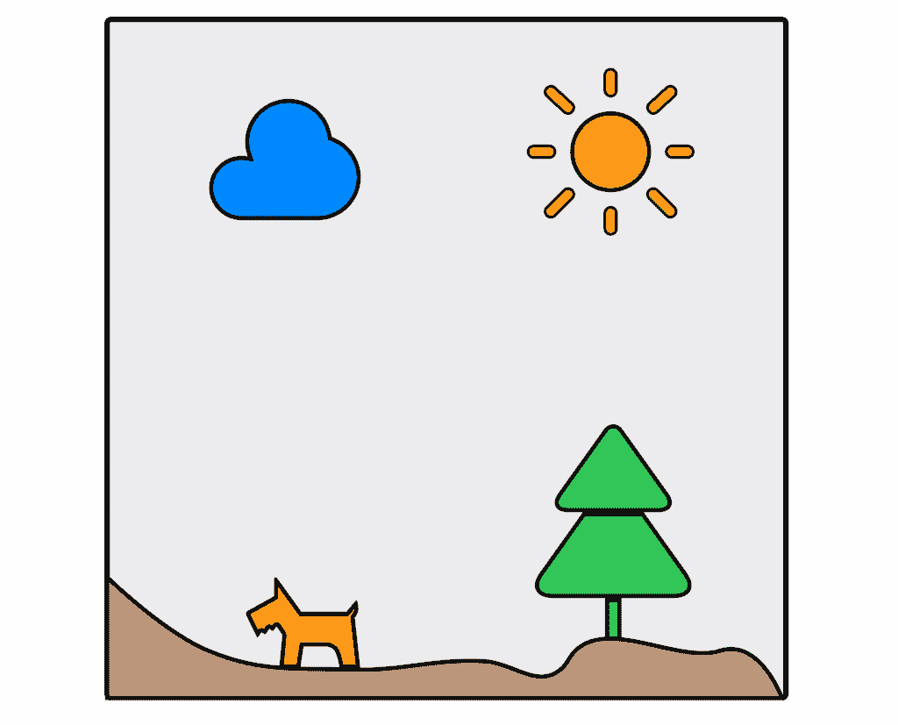
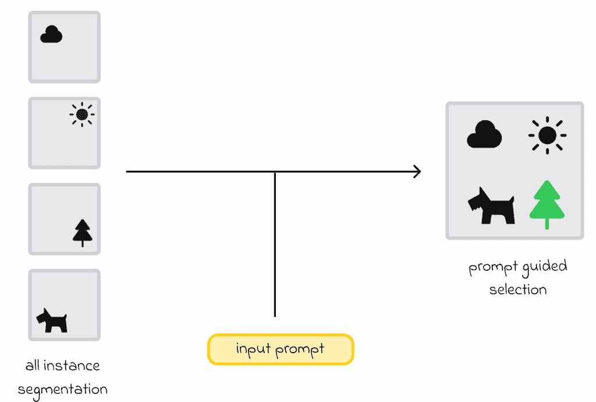
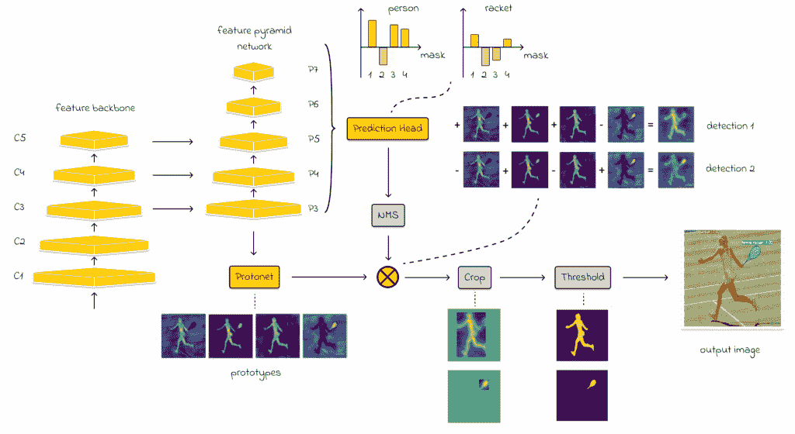
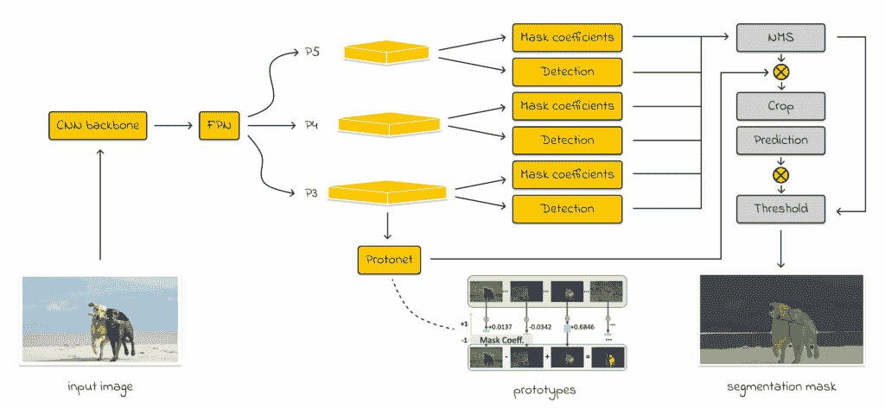
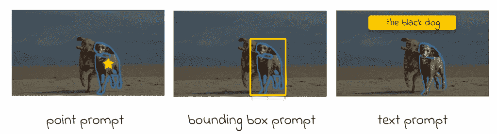
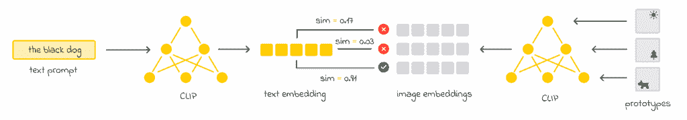
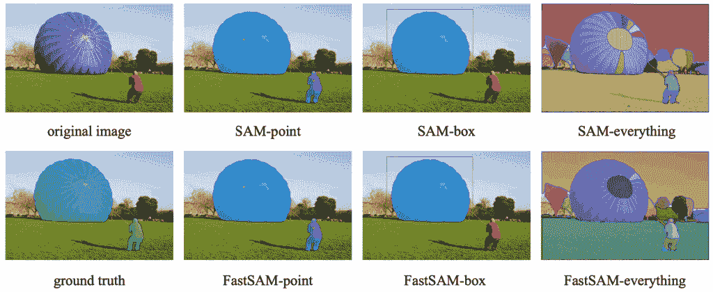
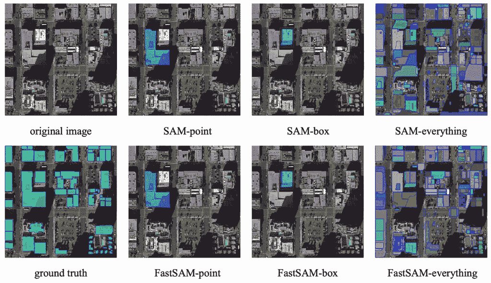

# FastSAM 图像分割任务 — 简单解释

> 原文：[`towardsdatascience.com/fastsam-for-image-segmentation-tasks-explained-simply/`](https://towardsdatascience.com/fastsam-for-image-segmentation-tasks-explained-simply/)

## 简介

**<mdspan datatext="el1753725858900" class="mdspan-comment">图像分割**是计算机视觉中的一项流行任务，其目标是将输入图像分割成多个区域，其中每个区域代表一个单独的对象。

过去的一些经典方法涉及选择一个模型骨干（例如，U-Net）并在专门的数据集上进行微调。虽然微调效果不错，但 GPT-2 和 GPT-3 的出现促使机器学习社区逐渐将关注点转向零样本学习解决方案的开发。

> *零样本学习指的是模型在没有明确接收到针对该任务的任何训练示例的情况下执行任务的能力。*

零样本概念通过允许跳过微调阶段，希望模型足够智能，能够即时解决任何任务，发挥着重要作用。

在计算机视觉的背景下，Meta 在 2023 年发布了广为人知的通用“[Segment Anything Model](https://arxiv.org/pdf/2304.02643)”（SAM），它使零样本方式下执行分割任务成为可能。



分割任务的目标是将图像分割成多个部分，每个部分代表一个单独的对象。

虽然 SAM 的大规模结果令人印象深刻，但几个月后，中国科学院图像与视频分析（CASIA IVA）小组发布了 FastSAM 模型。正如形容词“快速”所暗示的，FastSAM 通过加速推理过程最多 50 倍，同时保持高分割质量，解决了 SAM 的速度限制问题。

> *在这篇文章中，我们将探讨 FastSAM 架构、可能的推理选项，并检查与标准 SAM 模型相比，它“快速”的原因。此外，我们还将查看一个代码示例，以帮助巩固我们的理解。*
> 
> *作为先决条件，强烈建议您熟悉计算机视觉的基础知识、YOLO 模型，并了解分割任务的目标。*

### 架构

FastSAM 的推理过程分为两个步骤：

1.  **所有实例分割。**目标是生成图像中所有对象的分割掩码。

1.  **提示引导选择。**在获得所有可能的掩码后，提示引导选择返回与输入提示相对应的图像区域。



FastSAM 的推理过程分为两个步骤。在获得分割掩码后，使用提示引导选择进行过滤和合并，以生成最终的掩码。

让我们从所有实例分割开始。

#### 所有实例分割

在视觉检查架构之前，让我们参考原始论文：

> ***“FastSAM 架构基于 YOLOv8-seg——一个配备了实例分割分支的对象检测器，该分支利用了 YOLOACT 方法”*** — [***Fast Segment Anything 论文***](https://arxiv.org/pdf/2306.12156)

对于不熟悉 YOLOv8-seg 和 YOLOACT 的人来说，定义可能看起来很复杂。无论如何，为了更好地阐明这两个模型背后的含义，我将提供一个关于它们是什么以及如何使用的简单直观理解。

#### **YOLOACT (You Only Look at CoefficienTs)**

YOLOACT 是一个实时实例分割卷积模型，专注于高速检测，灵感来源于 YOLO 模型，并实现了与 Mask R-CNN 模型相当的性能。

YOLOACT 由两个主要模块（分支）组成：

1.  **原型分支。**YOLOACT 创建了一组称为原型的分割掩码。

1.  **预测分支。**YOLOACT 通过预测边界框然后估计掩码系数来执行对象检测，这些系数告诉模型如何线性组合原型以创建每个对象的最终掩码。



YOLACT 架构：黄色块表示可训练参数，而灰色块表示不可训练参数。来源：[YOLOACT, 实时实例分割](https://arxiv.org/pdf/1904.02689)。图中掩码原型的数量是 k = 4。图由作者改编。

为了从图像中提取初始特征，YOLOACT 使用 ResNet，然后是特征金字塔网络（FPN）以获得多尺度特征。每个 P-level（如图所示）使用卷积处理不同大小的特征（例如，P3 包含最小的特征，而 P7 捕获更高层次的图像特征）。这种方法有助于 YOLOACT 考虑各种尺度的对象。

#### YOLOv8-seg

YOLOv8-seg 是基于 YOLOACT 的模型，并采用了关于原型的相同原则。它也有两个头：

1.  **检测头。**用于预测边界框和类别。

1.  **分割头。**用于生成掩码并将它们组合。

关键区别在于 YOLOv8-seg 使用 YOLO 骨干架构，而不是 YOLOACT 中使用的 ResNet 骨干和 FPN。这使得 YOLOv8-seg 在推理过程中更轻、更快。

> *YOLOACT 和 YOLOv8-seg 都使用默认的原型数量 k = 32，这是一个可调整的超参数。在大多数情况下，这提供了速度和分割性能之间良好的权衡。*
> 
> *在这两个模型中，对于每个检测到的对象，都会预测一个大小为 k = 32 的向量，表示掩码原型的权重。然后，这些权重被用来线性组合原型，以生成对象的最终掩码。*

#### FastSAM 架构

FastSAM 的架构基于 YOLOv8-seg，但也集成了 FPN，类似于 YOLACT。它包括检测和分割头，具有 *k = 32* 原型。然而，由于 FastSAM 对图像中所有可能的对象进行分割，其工作流程与 YOLOv8-seg 和 YOLACT 不同：

1.  首先，FastSAM 通过生成 *k = 32* 图像掩码来进行分割。

1.  然后将这些掩码组合起来生成最终的分割掩码。

1.  在后处理过程中，FastSAM 提取区域，计算边界框，并对每个对象进行实例分割。



FastSAM 架构：黄色块表示可训练参数，而灰色块表示不可训练参数。来源：[Fast Segment Anything](https://arxiv.org/pdf/2306.12156)。图片由作者改编。

**注意**

尽管论文没有提及后处理的详细信息，但可以观察到官方 FastSAM GitHub 仓库在预测阶段使用了 OpenCV 的[***cv2.findContours()***](https://github.com/CASIA-IVA-Lab/FastSAM/blob/main/fastsam/prompt.py)方法。

```py
# The use of cv2.findContours() method the during prediction stage.
# Source: FastSAM repository (FastSAM / fastsam / prompt.py)  

def _get_bbox_from_mask(self, mask):
      mask = mask.astype(np.uint8)
      contours, hierarchy = cv2.findContours(mask, cv2.RETR_EXTERNAL, cv2.CHAIN_APPROX_SIMPLE)
      x1, y1, w, h = cv2.boundingRect(contours[0])
      x2, y2 = x1 + w, y1 + h
      if len(contours) > 1:
          for b in contours:
              x_t, y_t, w_t, h_t = cv2.boundingRect(b)
              # Merge multiple bounding boxes into one.
              x1 = min(x1, x_t)
              y1 = min(y1, y_t)
              x2 = max(x2, x_t + w_t)
              y2 = max(y2, y_t + h_t)
          h = y2 - y1
          w = x2 - x1
      return [x1, y1, x2, y2]
```

在实践中，有几种方法可以从最终的分割掩码中提取实例掩码。一些例子包括轮廓检测（在 FastSAM 中使用）和连通分量分析（***cv2.connectedComponents()***）。

#### 训练

FastSAM 研究人员使用了与 SAM 开发者相同的[SA-1B 数据集](https://ai.meta.com/datasets/segment-anything/)，但在仅 2%的数据上训练了 CNN 检测器。尽管如此，CNN 检测器实现了与原始 SAM 相当的性能，同时分割所需的资源显著减少。因此，FastSAM 的推理速度高达 50 倍！

作为参考，SA-1B 包含 1100 万张多样化的图像和 11 亿个高质量的分割掩码。

> ***是什么让 FastSAM 比 SAM 更快？**SAM 使用 Vision Transformer (ViT)架构，以其计算需求重而闻名。相比之下，FastSAM 使用 CNN 进行分割，这要轻得多.*

#### **提示引导选择**

**“分割任何事物任务”**涉及为给定的提示生成分割掩码，它可以以不同的形式表示。



FastSAM 处理的不同类型的提示。来源：[Fast Segment Anything](https://arxiv.org/pdf/2306.12156)。图片由作者改编。

#### 点提示

在获得多个图像原型后，可以使用点提示来指示感兴趣的对象是否位于图像的特定区域。因此，指定的点会影响原型掩码的系数。

与 SAM 类似，FastSAM 允许选择多个点并指定它们属于前景还是背景。如果对应于对象的背景点出现在多个掩码中，可以使用背景点来过滤掉无关的掩码。

然而，在过滤后，如果仍有几个掩码满足点提示，则应用掩码合并以获得对象的最终掩码。

此外，作者应用形态学运算符来平滑最终掩码形状并去除小瑕疵和噪声。

#### 盒子提示

盒子提示涉及选择与提示中指定的边界框具有最高交并比（IoU）的掩码。

#### 文本提示

类似地，对于文本提示，选择与文本描述最匹配的掩码。为了实现这一点，使用了[CLIP 模型](https://towardsdatascience.com/clip-model-overview-unlocking-the-power-of-multimodal-ai/)：

1.  计算文本提示和 k = 32 原型掩码的嵌入。

1.  然后计算文本嵌入和原型之间的相似性。具有最高相似性的原型经过后处理并返回。



对于文本提示，使用 CLIP 模型计算提示的文本嵌入和掩码原型的图像嵌入。计算文本嵌入和图像嵌入之间的相似性，并选择与具有最高相似性的图像嵌入相对应的原型。

> *一般来说，对于大多数分割模型，提示通常应用于原型级别。*

### FastSAM 仓库

这里是[FastSAM 官方仓库的链接](https://github.com/CASIA-IVA-Lab/FastSAM/tree/main)，其中包含清晰的 README.md 文件和文档。

# 结论

在这篇文章中，我们探讨了 FastSAM——SAM 的改进版本。结合 YOLACT 和 YOLOv8-seg 模型的最佳实践，FastSAM 在保持高分割质量的同时，实现了预测速度的显著提升，与原始 SAM 相比，推理速度提高了几十倍。

使用 FastSAM 的提示功能提供了一种灵活的方式来检索感兴趣对象的分割掩码。此外，已经证明，将提示引导的选择与所有实例分割解耦可以降低复杂性。

下面是一些使用不同提示的 FastSAM 使用示例，直观地展示了它仍然保留了 SAM 的高分割质量：



来源：[Fast Segment Anything](https://arxiv.org/pdf/2306.12156)



来源：[Fast Segment Anything](https://arxiv.org/pdf/2306.12156)

### 资源

+   [Fast Segment Anything](https://arxiv.org/pdf/2306.12156) | Xu Zhao, Wenchao Ding 等人 (2023)

+   [Segment Anything](https://arxiv.org/pdf/2304.02643) | Meta AI Research | Alexander Kirillov, Eric Mintum 等人 (2023)

+   [YOLACT, 实时实例分割](https://arxiv.org/pdf/1904.02689) | Daniel Bolya, Chong Zhou 等人 (2019)

+   [SA-1B 数据集 | Meta](https://ai.meta.com/datasets/segment-anything/)

*所有图片除非另有说明，均为作者所有。*
