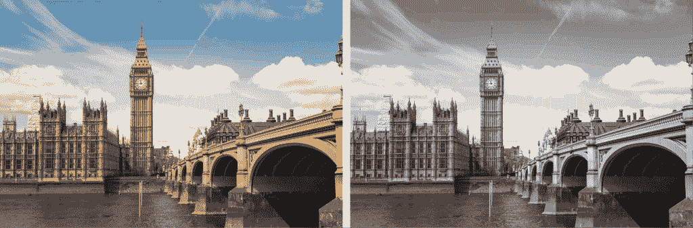
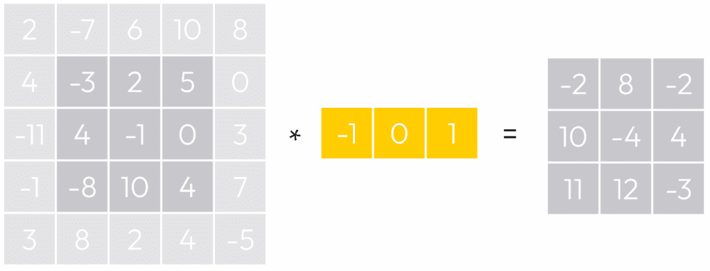
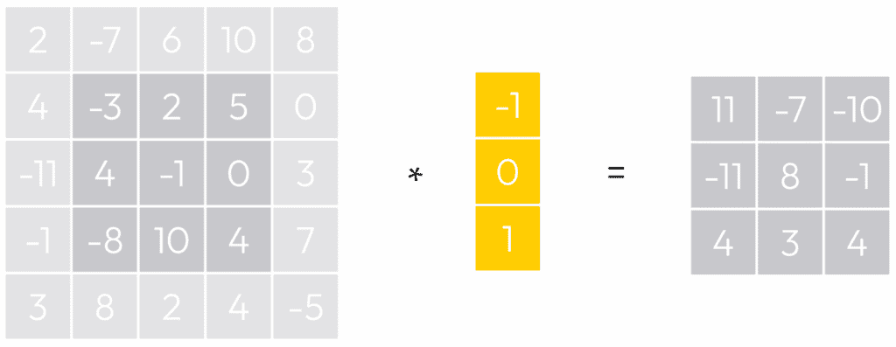
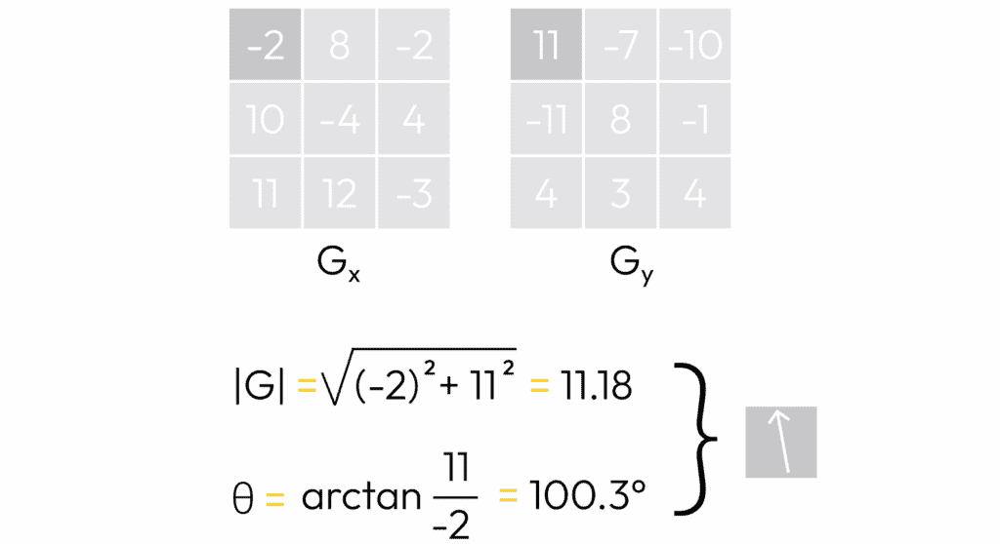
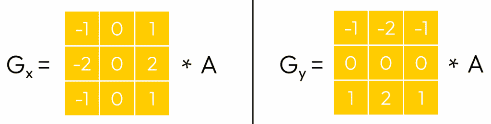
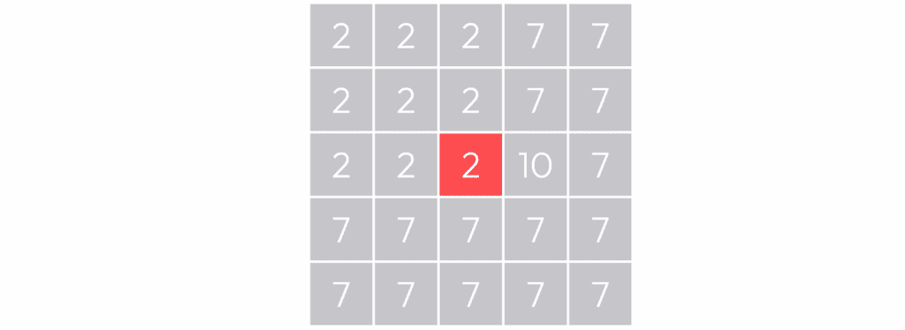
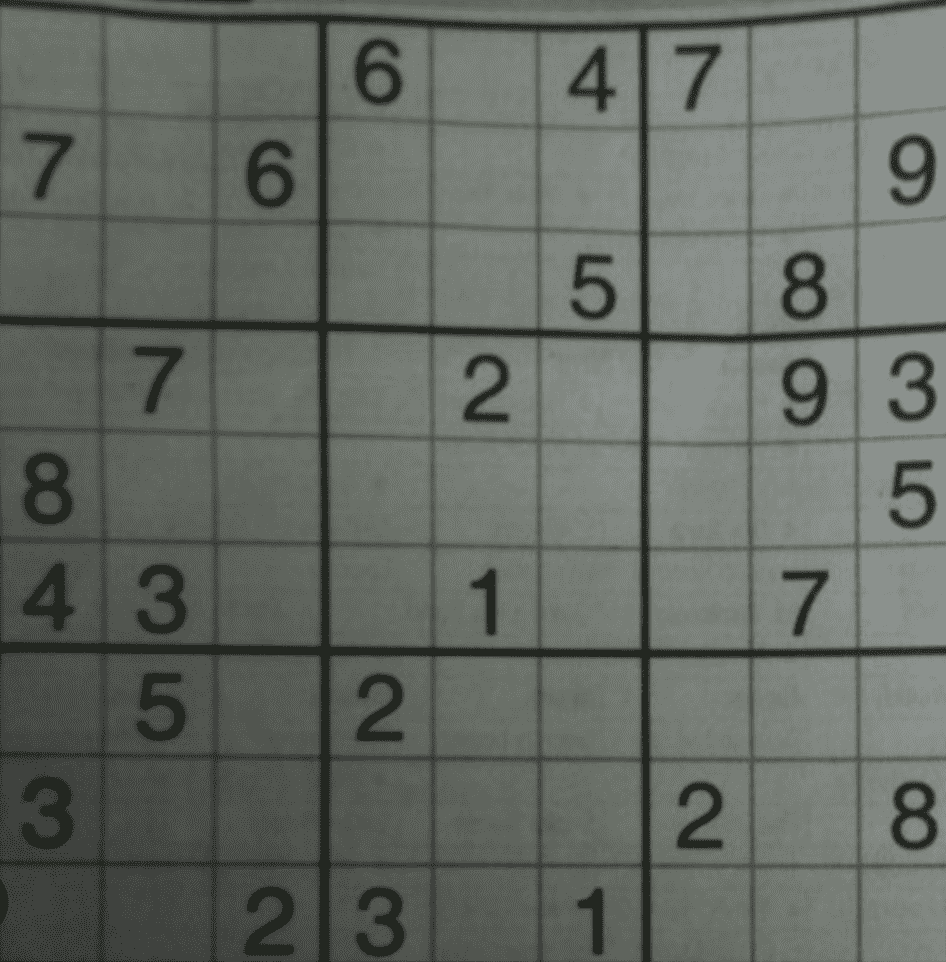
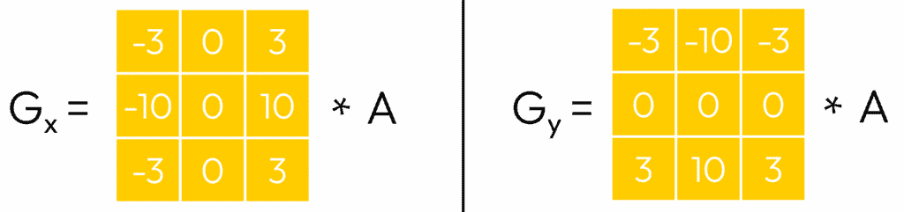
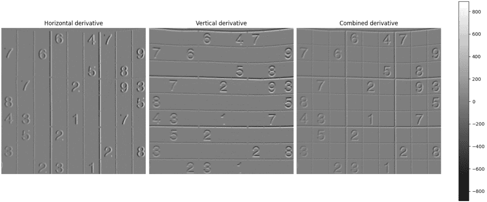

# 特征检测，第一部分：图像导数、梯度和 Sobel 算子

> 原文：[`towardsdatascience.com/feature-detection-part-1-image-derivatives-gradients-and-sobel-operator/`](https://towardsdatascience.com/feature-detection-part-1-image-derivatives-gradients-and-sobel-operator/)

## <mdspan datatext="el1760637873112" class="mdspan-comment">简介</mdspan>

计算机视觉是分析图像和视频的广阔领域。虽然许多人听到计算机视觉时主要想到的是机器学习模型，但现实中，存在许多更多的现有算法，在某些情况下，它们的性能甚至优于人工智能！

在计算机视觉中，**特征检测**领域涉及识别图像中的感兴趣区域。这些结果可以用来创建**特征描述符**——代表局部图像区域的数值向量。之后，可以将同一场景的多张照片的特征描述符结合起来进行图像匹配，甚至重建场景。

在本文中，我们将从微积分中类比引入**图像导数**和**梯度**。这将使我们有必要理解卷积核背后的逻辑，特别是**Sobel 算子**——一种用于检测图像边缘的计算机视觉滤波器。

## 图像强度

<mdspan datatext="el1760637550514" class="mdspan-comment">强度</mdspan>是图像的主要特征之一。图像的每个像素都有三个组成部分：R（红色）、G（绿色）和 B（蓝色），取值介于 0 和 255 之间。值越高，像素越亮。像素的强度是其 R、G 和 B 组成部分的加权平均值。

实际上，存在几个标准定义了不同的权重。由于我们将专注于 OpenCV，我们将使用它们的公式，如下所示：


强度公式

```py
image = cv2.imread('image.png')
B, G, R = cv2.split(image)
grayscale_image = 0.299 * R + 0.587 * G + 0.114 * B
grayscale_image = np.clip(grayscale_image, 0, 255).astype('uint8')
intensity = grayscale_image.mean()
print(f"Image intensity: {intensity:2f}")
```

### 灰度图像

图像可以使用不同的颜色通道来表示。如果 RGB 通道代表原始图像，则应用上述强度公式将将其转换为灰度格式，仅包含一个通道。

由于公式中权重的总和等于 1，灰度图像将包含介于 0 和 255 之间的强度值，就像 RGB 通道一样。



以 RGB（左）和灰度（右）显示的大本钟

在 OpenCV 中，可以使用 cv2.cvtColor()函数将 RGB 通道转换为灰度格式，这是一种比上面看到的方法更简单的方式。

```py
image = cv2.imread('image.png')
grayscale_image = cv2.cvtColor(image, cv2.COLOR_BGR2GRAY)
intensity = grayscale_image.mean()
print(f"Image intensity: {intensity:2f}")
```

> *与标准的 RGB 调色板不同，OpenCV 使用 BGR 调色板。它们都是相同的，只是 R 和 B 元素被交换了。为了简化，在本系列文章的本文和后续文章中，我们将交替使用 RGB 和 BGR 这两个术语。*
> 
> *如果我们使用 OpenCV 中的两种方法计算图像强度，我们可能会得到略微不同的结果。这是完全正常的，因为当使用 cv2.cvtColor 函数时，OpenCV 会将转换后的像素四舍五入到最接近的整数。计算平均值会导致一个小差异。*

## 图像导数

图像导数用于测量像素强度在图像中变化的速率。图像可以被视为两个变量的函数，I(x, y)，其中 x 和 y 指定像素位置，I 代表该像素的强度。

我们可以正式地写出：


但鉴于图像存在于离散空间中，它们的导数通常通过卷积核来近似：

+   对于水平的 X 轴：*[-1, 0, 1]*

+   对于垂直的 Y 轴：*[-1, 0, 1]ᵀ*

换句话说，我们可以将上面的方程重写为以下形式（其中*Δx = 1*和*Δy = 1*）：


为了更好地理解核背后的逻辑，让我们参考下面的例子。

### 示例

假设我们有一个由 5×5 像素组成的矩阵，代表一个灰度图像块。这个矩阵的元素显示了像素的强度。



要计算图像导数，我们可以使用卷积核。其思路很简单：通过取图像中的一个像素及其邻域中的几个像素，我们找到与给定核的逐元素乘积之和，该核代表一个固定的矩阵（或向量）。

在我们的情况下，我们将使用一个三元素向量[-1, 0, 1]。从上面的例子中，让我们取一个位置为(1, 1)的像素，其值为-3，例如。

由于核的大小（黄色）是 3×1，我们需要-3 的左右元素来匹配大小，因此结果是我们取向量[4, -3, 2]。然后，通过找到逐元素乘积的和，我们得到-2 的值：


-2 的值代表初始像素的导数。如果我们仔细观察，我们可以注意到像素-3 的导数就是-3 的最右侧像素（2）和其最左侧像素（4）之间的差值。

> *为什么我们要使用复杂的公式，而不是计算两个元素之间的差值？实际上，在这个例子中，我们只需计算元素 I(x, y + 1)和 I(x, y  –  1)之间的强度差。但在现实中，当我们需要检测更复杂和不太明显的特点时，我们可以处理更复杂的场景。因此，使用已知矩阵的核的泛化形式来检测预定义类型的特点是方便的。*

基于导数值，我们可以得出一些观察结果：

+   如果导数值在图像的某个区域显著，这意味着那里的强度变化剧烈。否则，在亮度方面没有明显的变化。

+   如果导数的值为正，这意味着从左到右，图像区域变亮；如果它是负的，那么从左到右的方向上图像区域变暗。

通过类比线性代数，可以将核视为图像上的线性算子，它们将局部图像区域进行转换。

> *类似地，我们可以使用垂直核计算卷积。过程将保持不变，只是我们现在将窗口（核）垂直移动到图像矩阵上。*



你可以注意到，在将卷积滤波器应用于原始 5×5 图像后，它变成了 3×3。这是正常的，因为我们不能以相同的方式对边缘像素应用卷积（否则我们将超出范围）。

为了保持图像的维度，通常使用填充技术，该技术包括临时扩展/插值图像边界或用零填充它们，以便可以计算边缘像素的卷积。

默认情况下，像 OpenCV 这样的库会自动填充边界，以确保输入和输出图像具有相同的维度。

## 图像梯度

图像梯度显示了在给定像素处强度（亮度）在两个方向（X 和 Y）上的变化速度。


形式上，图像梯度可以写成关于 X 轴和 Y 轴的图像导数的向量。

### 梯度幅度

梯度幅度代表梯度向量的范数，可以使用以下公式找到：


### 梯度方向

使用找到的 Gx 和 Gy，也可以计算梯度向量的角度：


### 示例

让我们看看如何根据上面的例子手动计算梯度。为此，我们需要卷积核应用后的计算出的 3×3 矩阵。

如果我们取左上角的像素，它具有值 *Gₓ = -2* 和 *Gᵧ = 11*。我们可以轻松地计算梯度幅度和方向：



对于整个 3×3 矩阵，我们得到以下梯度的可视化：


> *在实践中，建议在将核应用于矩阵之前对其进行归一化。我们没有这样做是为了简化示例。*

## 索贝尔算子

在学习了图像导数和梯度的基本原理之后，现在是时候学习索贝尔算子了，它被用来近似这些导数。与之前的大小为 3×1 和 1×3 的核相比，索贝尔算子由一对 3×3 的核（针对两个轴）定义：



这给索贝尔算子带来了优势，因为之前的核只测量了一维变化，忽略了邻域中的其他行和列。索贝尔算子考虑了更多关于局部区域的信息。

另一个优点是 Sobel 对处理噪声更鲁棒。让我们看看下面的图像块。如果我们计算中心红色元素周围的导数，该元素位于暗（2）和亮（7）像素之间的边界上，我们应该得到 5。问题是存在一个值为 10 的噪声像素。



如果我们在红色元素附近应用水平 1D 核，它将对像素值 10 给予显著的重要性，这是一个明显的异常值。同时，Sobel 算子更鲁棒：它将考虑 10，以及其周围的值为 7 的像素。在某种程度上，Sobel 算子应用了平滑处理。

> *在同时比较几个核时，建议将矩阵核归一化，以确保它们都在相同的尺度上。在图像分析中，算子的一般最常见应用之一是特征检测。*

在 Sobel 和 Scharr 算子的情况下，它们通常用于检测边缘——像素强度（及其梯度）急剧变化的区域。

### OpenCV

要应用 Sobel 算子，可以使用 OpenCV 函数 cv2.Sobel。让我们看看它的参数：

```py
derivative_x = cv2.Sobel(image, cv2.CV_64F, 1, 0)
derivative_y = cv2.Sobel(image, cv2.CV_64F, 0, 1)
```

+   第一个参数是一个输入 NumPy 图像。

+   第二个参数（cv2.CV_64F）是输出图像的数据深度。问题是，通常，算子可以产生包含值在 0-255 区间之外的输出图像。这就是为什么我们需要指定我们想要的输出图像的像素类型。

+   第三个和第四个参数分别代表 x 方向和 y 方向导数的阶数。在我们的情况下，我们只想在 x 方向和 y 方向上得到第一阶导数，所以我们传递值（1，0）和（0，1）。

让我们看看以下示例，其中我们给出了一个数独输入图像：



让我们应用 Sobel 滤波器：

```py
import cv2
import matplotlib.pyplot as plt

image = cv2.imread("data/input/sudoku.png")

image = cv2.cvtColor(image, cv2.COLOR_BGR2GRAY)
derivative_x = cv2.Sobel(image, cv2.CV_64F, 1, 0)
derivative_y = cv2.Sobel(image, cv2.CV_64F, 0, 1)

derivative_combined = cv2.addWeighted(derivative_x, 0.5, derivative_y, 0.5, 0)

min_value = min(derivative_x.min(), derivative_y.min(), derivative_combined.min())
max_value = max(derivative_x.max(), derivative_y.max(), derivative_combined.max())

print(f"Value range: ({min_value:.2f}, {max_value:.2f})")

fig, axes = plt.subplots(1, 3, figsize=(16, 6), constrained_layout=True)

axes[0].imshow(derivative_x, cmap='gray', vmin=min_value, vmax=max_value)
axes[0].set_title("Horizontal derivative")
axes[0].axis('off')

image_1 = axes[1].imshow(derivative_y, cmap='gray', vmin=min_value, vmax=max_value)
axes[1].set_title("Vertical derivative")
axes[1].axis('off')

image_2 = axes[2].imshow(derivative_combined, cmap='gray', vmin=min_value, vmax=max_value)
axes[2].set_title("Combined derivative")
axes[2].axis('off')

color_bar = fig.colorbar(image_2, ax=axes.ravel().tolist(), orientation='vertical', fraction=0.025, pad=0.04)

plt.savefig("data/output/sudoku.png")

plt.show()
```

结果，我们可以看到水平和垂直导数非常擅长检测线条！此外，这些线条的组合使我们能够检测到两种类型的特点：


## Scharr 算子

Sobel 核的另一个流行替代方案是 Scharr 算子：



尽管其结构与 Sobel 算子有实质性的相似性，但 Scharr 核在边缘检测任务中实现了更高的精度。它有几个关键的数学特性，我们不会在本文中考虑。

### OpenCV

在 OpenCV 中使用 Scharr 滤波器与上面我们看到的 Sobel 滤波器非常相似。唯一的区别是另一个方法名（其他参数相同）：

```py
derivative_x = cv2.Scharr(image, cv2.CV_64F, 1, 0)
derivative_y = cv2.Scharr(image, cv2.CV_64F, 0, 1)
```

这是使用 Scharr 滤波器得到的结果：



在这种情况下，注意到这两个算子的结果差异是具有挑战性的。然而，通过查看颜色图，我们可以看到 Scharr 算子产生的可能值范围（-800, +800）比 Sobel 算子（-200, +200）要大得多。这是正常的，因为 Scharr 核的常数更大。

这也是一个为什么我们需要使用特殊类型 cv2.CV_64F 的好例子。否则，值会被裁剪到 0 到 255 的标准范围，我们就会失去关于梯度的宝贵信息。

> *注意。直接将保存方法应用于 cv2.CV_64F 图像会导致错误。要在磁盘上保存此类图像，它们需要转换为另一种格式，并且只包含介于 0 到 255 之间的值。*

## 结论

通过将微积分的基本原理应用于计算机视觉，我们研究了基本图像属性，这些属性使我们能够在图像中检测强度峰值。这种知识是有帮助的，因为特征检测是图像分析中的常见任务，尤其是在图像处理有约束或未使用机器学习算法时。

我们还通过使用 OpenCV 的示例来查看边缘检测是如何使用 Sobel 和 Scharr 算子工作的。在接下来的文章中，我们将研究更高级的特征检测算法，并检查 OpenCV 的示例。

### 资源

+   [颜色转换 | OpenCV](https://docs.opencv.org/3.4/de/d25/imgproc_color_conversions.html)

+   [Sobel 导数 | OpenCV](https://docs.opencv.org/4.x/d2/d2c/tutorial_sobel_derivatives.html)

+   [图像梯度 | OpenCV](https://docs.opencv.org/4.x/da/d85/tutorial_js_gradients.html)

+   [Sobel 算子 | 维基百科](https://en.wikipedia.org/wiki/Sobel_operator)

*除非另有说明，所有图像均为作者所有。*
