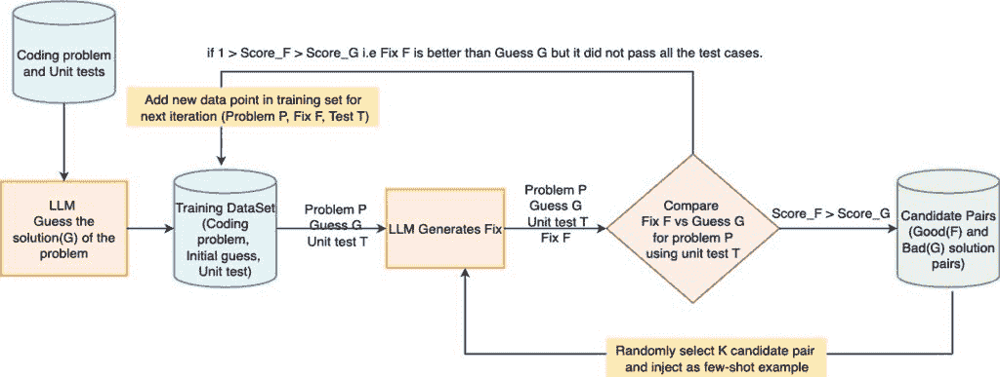
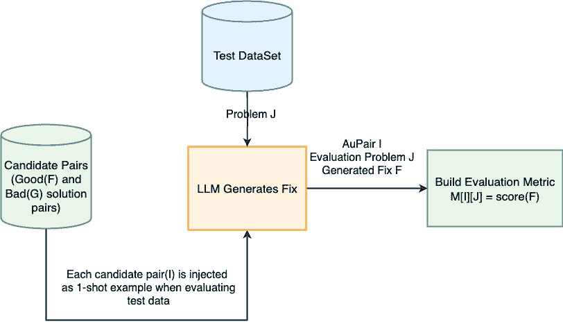
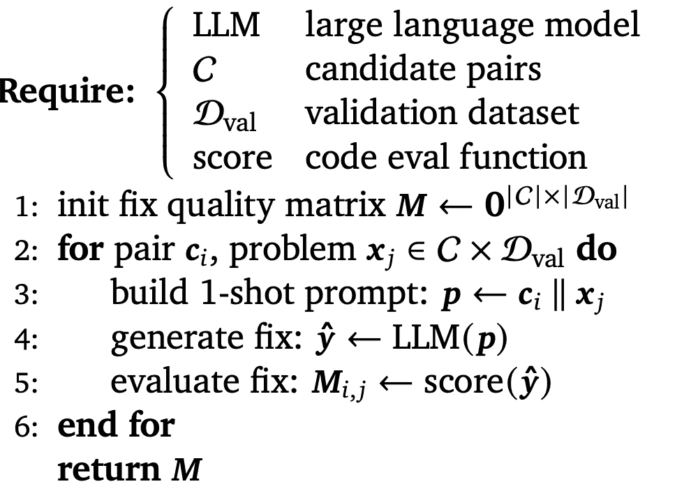
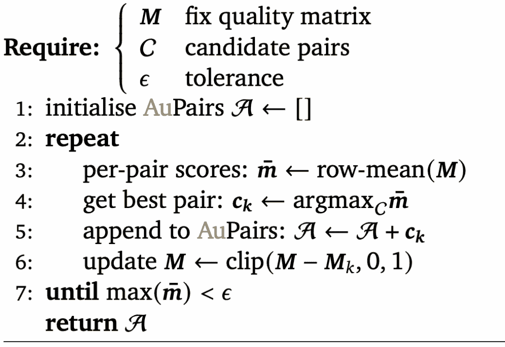

# 寻找黄金示例：情境学习的更智能方法

> 原文：[`towardsdatascience.com/finding-golden-examples-a-smarter-approach-to-in-context-learning/`](https://towardsdatascience.com/finding-golden-examples-a-smarter-approach-to-in-context-learning/)

## 情境

<mdspan datatext="el1754587836510" class="mdspan-comment">在构建使用大型语言模型（LLMs）的应用时，**I**n-**C**ontext **L**earning (ICL)，即输入和输出被提供给 LLMs 以在处理下一个输入之前从它们那里学习，已被证明在引导 LLMs 走向正确方向方面非常有效。已经开发出多种 ICL 策略。其中一些流行的方法包括单次示例（提供单个示例）、少量示例（提供多个示例）、思维链（在示例中展示逐步推理）等等。让我们用一个简单的例子来更好地理解情境学习。

当你问一个 LLM，“哪种动物发出‘哞哞’的声音，它的类型是什么？”你可能会期望得到一个答案，比如“牛，哺乳动物。”但 LLMs 会提供更多信息。例如，当被问及相同的问题时，ChatGPT 给出了以下答案：

```py
User: What animal makes the sound 'moo' and what is its type?
```

```py
The animal that makes the sound "moo" is a cow.
Animal: Cow
Type: Mammal (specifically, a domesticated ungulate belonging to the species Bos taurus)
Other examples of non-mammals include birds (like eagles 🦅), reptiles (like snakes 🐍)
, fish (like salmon 🐟), and insects (like butterflies 🦋).
```

链接：[`chatgpt.com/share/6886636f-7b48-8000-a477-54405edd7e43`](https://chatgpt.com/share/6886636f-7b48-8000-a477-54405edd7e43)

现在，为了教会 LLM 产生我们期望的结果（动物名称、类型），我们既可以微调（训练）LLM 以输出我们期望的格式，但这不是一个可行的方案，因为训练 LLM 需要大量的资源。或者，在推理过程中，我们可以在提问之前提供示例来教会 LLM 我们的期望格式。这正是情境学习的含义。LLMs 从提供的示例中学习模式以执行手头的任务。以下是与 ChatGPT 的相同交互，带有情境示例：

```py
User: What animal makes the 'woof' sound and what is its type?
Assistant: Dog, mammal
User: What animal makes the 'meow' sound and what is its type?
Assistant: Cat, mammal
User: What animal makes the sound 'moo' and what is its type?
```

这次，LLM 给出了正确的答案：牛，哺乳动物。

链接：[`chatgpt.com/share/688664f0-96f0-8000-9125-6a40b24d2773`](https://chatgpt.com/share/688664f0-96f0-8000-9125-6a40b24d2773)

如我们所见，大型语言模型（LLMs）很好地适应了情境学习（ICL）以实现其目标。研究表明，ICL 有助于提升 LLMs 的性能和准确性。但 ICL 是脆弱的。性能高度敏感于你选择的示例、它们的顺序，甚至微小的格式变化。ICL 通过模式匹配而不是真正的学习来工作，因此它严重依赖于表面线索。想象一下，对于像代码修复、文本到 SQL 等复杂任务，一组示例可能效果很好，而另一组替代方案可能会显著降低准确性。因此，ICL 的主要挑战是“**如何选择真正有帮助的示例（而不仅仅是任何示例）？”**

在这篇文章中，我们将探讨由 Google DeepMind 发布的关于系统性地处理这些问题的研究论文[AuPair: Golden Example Pairs for Code Repair](https://arxiv.org/pdf/2502.18487v1)。AuPair 专门解决代码修复任务（修复有缺陷的代码）的示例选择问题。本文旨在解释他们工作的核心思想，并为理解如何系统地生成 ICL 的示例奠定基础。

## 有效的示例选择

现在，我们了解到 ICL 的第一个挑战是找到正确的一组示例。在我们深入了解 AuPair 如何解决此问题之前，让我们看看传统的示例选择方法。通常，对于特定领域的问题（如代码生成/修复或文本到 SQL），我们根据自己的能力随机选择几个示例，或者从数据集中选择问题，为选定的这些问题编写示例，并在运行时使用它们进行 ICL。这种方法的扩展是，我们构建一个示例池，并在运行时使用相似性搜索来检索相关的示例以注入 ICL。

在传统的示例编纂过程中，我们没有能力衡量哪个示例在将 LLM 锚定在正确方向上最有效。现在，让我们看看 AuPair 的方法以及它是如何解决这个问题的。AuPair 不是随机选择示例，而是首先构建一个包含示例对的大数据集，然后应用贪婪选择算法来选择表现最好的对。让我们一步一步地看看每个步骤。

### 第一阶段：示例对生成



图片由作者提供

第一步是创建一个包含候选修复对的庞大集合。AuPair 从一组带有测试用例的编码问题数据集开始。对于每个问题，它要求 LLM 生成一个初始解决方案（猜测）。如果这个猜测部分正确（分数在 0 到 1 之间），它就会被添加到训练数据集中。

修复过程将这段损坏的代码交给 LLM，并使用 k 个随机选择的现有对作为上下文（实验中使用的是 k = 32）来修复它。如果生成的修复得分高于原始猜测，这将成为一个候选对（猜测 → 修复）。巧妙之处在于，如果修复仍然不完美，它将成为一个新的“损坏”代码，并重新添加到训练数据集中，以便在下一轮迭代中进行进一步的改进。这创建了增量改进的链条。AuPair 重复这个过程数千次，以构建一个覆盖不同类型错误及其修复的巨大候选对池。

### 第二阶段：黄金（Au）对提取

一旦我们有了候选对数据集，我们需要挑选出最有效的对。这个过程分为两个步骤。首先，我们需要衡量每个候选修复对的影响程度，其次，我们需要使用贪婪算法选择最好的对。

让我们先看看如何衡量候选修复对的有效性。



作者的图片

为了衡量有效性，我们首先创建一个验证数据集——基本上是一组损坏的代码问题。然后，对于验证数据集中的每个问题，我们取每个候选修复对，并将其作为 1 次示例与验证问题一起生成一个修复方案。一旦生成修复方案，它就会与单元测试用例进行测试，并为该验证问题计算一个分数。

我们创建了一个质量矩阵 M，其中 M[i,j]表示候选对 i 在解决验证问题 j 方面的效果如何，这为我们提供了一个全面的视角，了解哪些对在不同类型的问题中最有帮助。



AuPair 论文中的算法

下一步是使用计算出的有效性找到 AuPairs。算法选择所有验证问题中平均得分最高的候选对，并将其添加到 AuPair 列表中。关键的下一步是从矩阵中所有剩余对中减去这对的贡献。这确保我们不会选择重复的对，但保持对是互补的，每个新的 AuPair 必须解决与之前选中的不同的问题。这个过程会持续进行，直到改进低于一个阈值，从而得到一个有序的黄金对列表，其中每个都对教学有独特的贡献。



AuPair 论文中的图片

### 实验结果

AuPair 在 7 个不同的编码问题数据集上使用 5 个不同的 LLM 模型进行了基准测试。它始终优于自我反思和最佳 N 采样方法来解决问题。结果进一步表明，AuPairs 实现了 2-3 倍的更好的计算效率。只需要 12 个 AuPairs 就能达到需要 32 个随机对才能达到的性能。结果还表明，在 CodeForces 数据集上生成的 AuPairs 在 HackerEarth 和 AtCoder 等完全不同的数据集上也能有效工作。这证明了一旦我们构建了一个好的黄金对集合，它们可以在同一领域的新的问题上表现出色。

### 局限性

AuPair 显示出有希望的结果，但也有几个限制。首先，它需要大量的计算成本来生成候选示例对，这些对通过迭代修复来进行 LLM 调用。其次，它严重依赖于评估指标（如代码的单元测试）来衡量改进，这些指标可能不是所有领域都可用，并且它假设互补的示例将导致更好的性能。虽然这在编码问题中有效，但对于所有领域可能并不成立。最后，AuPair 是与结构化竞赛问题而不是更复杂的真实世界代码库进行了基准测试。

## 结论

AuPair 展示了在代码修复任务中进行上下文学习的一种更智能的方法。它不是随机选择示例，而是采用一种系统的方法来找到最有效的修复模式，这些模式实际上有助于大型语言模型（LLM）表现更好。虽然它需要显著的前期计算成本，并且在拥有良好的评估指标时效果最佳，但结果证明这是值得投资的，尤其是在黄金对（golden pairs）在不同数据集上表现良好的情况下。这项研究为将类似的示例选择技术应用于其他领域（例如文本到 SQL）开辟了可能性，在这些领域中，我们可以系统地生成和衡量示例的有效性。

## 参考文献

+   AuPair 论文 – [`arxiv.org/pdf/2502.18487v1`](https://arxiv.org/pdf/2502.18487v1)

+   在上下文学习 – [`transformer-circuits.pub/2022/in-context-learning-and-induction-heads/index.html`](https://transformer-circuits.pub/2022/in-context-learning-and-induction-heads/index.html)
